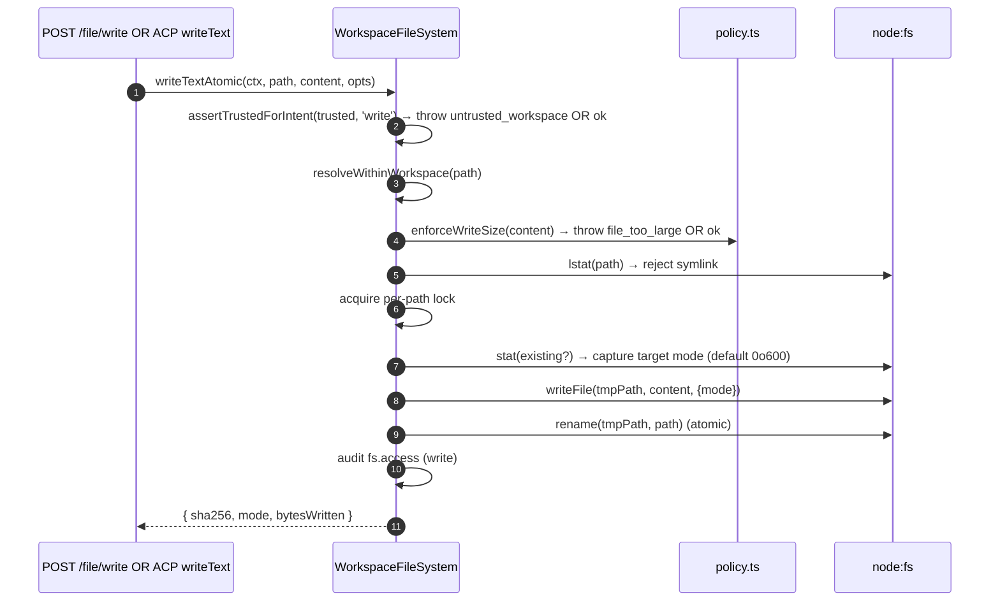
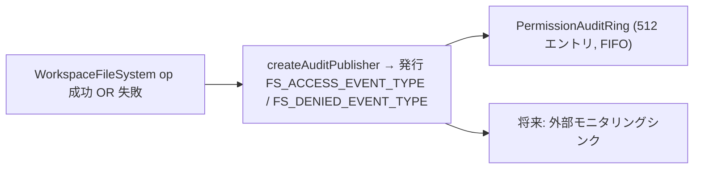

# ワークスペースファイルシステム境界

## 概要

デーモンの HTTP ファイルルートと委譲された ACP `readTextFile` / `writeTextFile` 呼び出しは `WorkspaceFileSystem` 境界（`packages/cli/src/serve/fs/`）を通過します。以下を提供します：

- **パス解決** — パスを正規化し、バインドされたワークスペースから逸脱するもの（シンボリックリンク経由も含む）を拒否します。
- **信頼ゲート** — ワークスペースが信頼されていない場合（`untrusted_workspace`）、書き込みを拒否します。
- **サイズ＆コンテンツポリシー** — フルスナップショット/出力上限（`MAX_READ_BYTES = 256 KiB`）、出力とスキャンコストの両方が制限されたラージテキストウィンドウ（`MAX_TEXT_SCAN_BYTES = 8 MiB`）、書き込み上限（`MAX_WRITE_BYTES = 5 MiB`）、バイナリ検出。
- **アトミック性** — 書き込み後にリネームし、ターゲットのモードを保存、新しいファイルのデフォルトは `0o600`。
- **監査** — すべてのアクセス／拒否は、`PermissionAuditRing` / モニタリングのための構造化イベントを発行します。
- **型付きエラー** — 閉じた `FsErrorKind` ユニオンを HTTP ステータスにマッピングします。

HTTP ファイルルート（`GET /file`、`GET /file/bytes`、`POST /file/write`、`POST /file/edit`、`GET /list`、`GET /glob`、`GET /stat`）はこの境界を使用します。本番デーモンでは、委譲されたままの ACP 呼び出しは注入されたブリッジアダプタを通じて WFS に到達します。汎用のブリッジ呼び出し元は、そのようなアダプタを注入する場合にのみ WFS を使用します。本番の同一ホスト `qwen serve` ランタイムは `readTextFile: false` を通知するため、すべての子プロセスの `FileSystemService.readTextFile` コンシューマーは通常の CLI ファイルシステムサービスを使用します。最終的な ACP `writeTextFile` コンテンツ書き込みは委譲されたままです。ワークスペースのターゲットは WFS を使用し、厳格な組み込みツールマーカーは、デーモンが作成した同一ホストアダプター上でのみ外部パスに対して同等のホストライターを選択する場合があります。[外部書き込みの設計ドキュメント](../../design/daemon-external-tool-text-writes.md)を参照してください。

このテキスト読み取りケイパビリティスライスは、直接の `read_file` と、write、edit、notebook、sed、artifact 操作で使用される共有の事前読み取りをカバーします：

- WFS の読み取り側の保証ではなく、通常の CLI の読み取り動作を意図的に受け入れます。[設計ドキュメント](../../design/daemon-local-text-reads.md) に、何が放棄されるかの正確なリストが記載されています。
- 同じドキュメントに、保持されたアダプタの読み取りパスが「fail closed」する限定的な意味が記録されています。また、別の外部書き込み設計ドキュメントに、承認された最終書き込みの失敗がどのように fail closed するかが記録されています。
- 直接の外部 `read_file` は、通常の CLI 権限ルールとコアファイル操作テレメトリを保持します。
- HTTP ファイルシステムルートはワークスペーススコープのままであり、エージェントの検出ツール動作はこのケイパビリティによって変更されません。
- 親ディレクトリの作成やシェルコマンドなどの補助的なアクションは、既存の別のパスであり、この境界ではカバーされません。
- `qwen serve` は同一マシン、同一 UID のセキュリティプリンシパルを前提としており、OS サンドボックスではありません。

## 責務

- ユーザー指定のパスを、境界内で安全に使用できるブランド化された `ResolvedPath` 値に解決します。
- バインドされたワークスペース外のパス（`path_outside_workspace`）と、ターゲットがシンボリックリンクであるパス（`symlink_escape`）を拒否します。
- `MAX_READ_BYTES` を超えるフルスナップショット読み取りを拒否しつつ、出力が `MAX_READ_BYTES` に制限され、スキャンコストが `MAX_TEXT_SCAN_BYTES` に制限された明示的なウィンドウを許可します。`MAX_WRITE_BYTES` を超える書き込みとバイナリファイル（`binary_file`）を拒否します。
- ワークスペースが信頼されていない場合（`untrusted_workspace`）、`assertTrustedForIntent(trusted, intent)` によってゲート制御される書き込み/編集を拒否します。
- `.gitignore` / `.qwenignore` パターンを `shouldIgnore` を介して尊重します。
- アトミックな書き込み後のリネームとターゲットモードの保存を実行します。新しいファイルのデフォルトモードは `0o600` です。
- すべての操作で `fs.access` / `fs.denied` 監査イベントを発行します。
- すべての失敗を、種類と HTTP ステータスを持つ `FsError` にマッピングします。ルートハンドラはこれらを統一的にシリアライズします。

## アーキテクチャ

### モジュール構成

| ファイル                     | 目的                                                                                                                                                                                                                                                   |
| ------------------------ | ----------------------------------------------------------------------------------------------------------------------------------------------------------------------------------------------------------------------------------------------------- |
| `paths.ts`               | `canonicalizeWorkspace`、`resolveWithinWorkspace`、`hasSuspiciousPathPattern`、ブランド化された `ResolvedPath`、`Intent` ユニオン（`read \| write \| list \| stat \| glob`）。                                                                                      |
| `policy.ts`              | `MAX_READ_BYTES`、`MAX_TEXT_SCAN_BYTES`、`MAX_WRITE_BYTES`、`MAX_UPLOAD_BYTES`、`BINARY_PROBE_BYTES`、`assertTrustedForIntent`、`detectBinary`、`enforceReadBytesSize`、`enforceReadSize`、`enforceWriteSize`、`shouldIgnore`。                        |
| `audit.ts`               | `FS_ACCESS_EVENT_TYPE`、`FS_DENIED_EVENT_TYPE`、`createAuditPublisher`、監査ペイロード型。                                                                                                                                                          |
| `errors.ts`              | `FsError` クラス、`isFsError`、`FsErrorKind` ユニオン（14種類）、`FsErrorStatus` ユニオン（`400 / 403 / 404 / 409 / 413 / 422 / 500 / 503`）。                                                                                                                |
| `workspace-file-system.ts` | `createWorkspaceFileSystemFactory`、`WorkspaceFileSystem`（読み取り/書き込み/リストを実行するオーケストレーター）、`WriteMode`、`ContentHash`、`FsEntry`、`FsStat`、`ListOptions`、`GlobOptions`、`ReadTextOptions`、`ReadBytesOptions`、`WriteTextAtomicOptions`。 |

### `FsErrorKind` 分類

| 種類                     | デフォルトHTTP | 意味                                                                                                                                                                                       |
| ------------------------ | ------------ | --------------------------------------------------------------------------------------------------------------------------------------------------------------------------------------------- |
| `path_outside_workspace` | 400          | 解決されたパスがバインドされたワークスペース外。                                                                                                                                                 |
| `symlink_escape`         | 400          | ターゲットがシンボリックリンク（PR 18 + PR 20 の保守的な姿勢に基づき拒否）。                                                                                                                    |
| `path_not_found`         | 404          | `ENOENT`。                                                                                                                                                                                     |
| `binary_file`            | 422          | テキストルートでコンテンツがバイナリと検出された、またはテキストルートがデコードできないエンコーディングのラージテキスト。                                                                                                                                                       |
| `file_too_large`         | 413          | ウィンドウなし/フルスナップショットのテキストが `MAX_READ_BYTES` を超えた、`MAX_TEXT_SCAN_BYTES` を超える行オフセット、または `MAX_WRITE_BYTES` を超える書き込み。                                                         |
| `hash_mismatch`          | 409          | 楽観的同時実行制御の `expectedSha256` が失敗、または安定読み取り中にファイルが変更された。                                                                                                                                               |
| `file_already_exists`    | 409          | 既存ファイルに対する `mode: 'create'`。                                                                                                                                                    |
| `text_not_found`         | 422          | `POST /file/edit` の検索文字列がファイル内に見つからない。                                                                                                                                         |
| `ambiguous_text_match`   | 422          | 1つだけ必要な場合に複数のマッチがあった。                                                                                                                                               |
| `untrusted_workspace`    | 403          | 信頼されていないワークスペースでの書き込み試行。                                                                                                                                                    |
| `permission_denied`      | 403          | OSレベルの `EACCES` / `EPERM`。                                                                                                                                                                  |
| `io_error`               | 503          | `ENOSPC` / `EIO` / `EBUSY` / `ETXTBSY` / `ENAMETOOLONG` / `EMFILE` / `ENFILE`。**`permission_denied` とは区別される**ため、モニタリングパイプラインが「ディスクフル」でセキュリティ対応者にページングすることはありません。 |
| `internal_error`         | 500          | 境界に到達した非errnoエラー（`TypeError`、プログラマのバグ）。                                                                                                                      |
| `parse_error`            | 400 / 422    | リクエストボディのパースエラー（400）またはサービスレベルの不変条件違反（422）。                                                                                                                       |

### `BridgeFileSystem`（ACP側アダプタ）

`packages/acp-bridge/src/bridgeFileSystem.ts` で定義:

```ts
interface BridgeFileSystem {
  readText(params: ReadTextFileRequest): Promise<ReadTextFileResponse>;
  writeText(params: WriteTextFileRequest): Promise<WriteTextFileResponse>;
}
```

これは、ACP `readTextFile` / `writeTextFile` の注入ポイントです。ブリッジテストや Mode A 組み込み呼び出し元は、`BridgeOptions` でこれを省略できます。その場合、`BridgeClient` はインラインの `fs.readFile` / `fs.writeFile` プロキシにフォールバックします（F1 以前の動作を維持）。本番の `qwen serve` は、`createBridgeFileSystemAdapter(fsFactory)`（`packages/cli/src/serve/bridge-file-system-adapter.ts`）を介して `BridgeFileSystem` を配線し、`delegateReadTextFileToClient: false` を設定します。ケイパビリティに準拠した子プロセスはテキストをローカルで読み取り、最終的な ACP テキスト書き込みを委譲します。アダプタは読み取り実装も保持しているため、予期しないまたはケイパビリティに違反する委譲読み取りも WFS のワークスペース境界に到達します。外部のホストライターパスはデフォルトで無効化されており、デーモン所有の同一ホストアダプター上でのみバージョン付き来歴によって選択されます。注入されたブリッジ、ワークスペースレジストリとファクトリ、汎用 ACP、および HTTP は通常の境界を維持します。

アダプタが必ず複製しなければならない2つの防御ゲート（アダプタが注入されるとインラインプロキシが完全にバイパスされるため）:

1. **通常ファイル以外を拒否** — ソケット / パイプ / キャラクタデバイス / procfs / sysfs エントリは、`stats.size === 0` にもかかわらず無制限のデータをストリーミングする可能性があります。インラインパスは、メッセージ内に `describeStatKind(stats)` を含めてスローします。
2. **無制限のフルファイルバッファリングを避ける。** インラインフォールバックはバッファされた読み取りを `READ_FILE_SIZE_CAP = 100 MiB` に制限します。注入されたアダプタは代わりに、より厳格な WorkspaceFileSystem 契約を適用します。フルスナップショットは 256 KiB で停止し、それより大きい UTF-8 ファイルには有限の `limit` が必要で、inode にバインドされたハンドルからストリーミングされ、最大 256 KiB が返されます。`{ line: 1, limit: 10 }` を返すためだけに 500 MB のログ全体を読み込むことはあってはなりません。

アダプタはさらに、`WorkspaceFileSystem.writeTextOverwrite`（PR 18 プリミティブ）を使用して、アトミックなテンポラリファイル・アンド・リネーム書き込みを、モード保存、`0o600` デフォルト、パスごとのロック内でのシンボリックリンク拒否とともに行います。これは、**F1 以前のインラインプロキシからの逸脱**です。以前はシンボリックリンクを解決し、そのターゲットに書き込んでいました。シンボリックリンクされた dotfile を経由して書き込んでいたエージェントは、解決されたパスを直接指定する必要があります。

### ACP ワイヤ上の FsError 保存

`BridgeFileSystem` アダプタが `FsError`（`kind: 'untrusted_workspace'` / `'symlink_escape'` / `'file_too_large'` など）をスローすると、ACP SDK のデフォルトの RPC エラーパスは `error.message` のみを汎用的な `-32603 "Internal error"` としてシリアライズします。`kind` / `status` / `hint` は削除されます。そのため、ダウンストリームのエージェント RPC クライアントは、人間可読なメッセージに対して正規表現マッチを行い、型付けされた UI（認証再試行 vs ファイルピッカー vs プロキシヒント）をディスパッチする必要があります。

`BridgeClient.writeTextFile` と `BridgeClient.readTextFile` は、FsError 形状のスローをキャッチし、ACP `RequestError` として再スローする薄いガード（`packages/acp-bridge/src/bridgeClient.ts`）をインストールします:

```ts
function isFsErrorShape(err: unknown): err is FsErrorShape {
  return (
    err instanceof Error &&
    err.name === 'FsError' &&
    typeof (err as { kind?: unknown }).kind === 'string'
  );
}

function preserveFsErrorOverAcp(err: unknown): never {
  if (isFsErrorShape(err)) {
    throw new RequestError(-32603, err.message, {
      errorKind: err.kind,
      ...(err.hint !== undefined ? { hint: err.hint } : {}),
      ...(err.status !== undefined ? { status: err.status } : {}),
    });
  }
  throw err;
}
```

エージェントの RPC クライアントは `data.errorKind`（閉じた `FsErrorKind` 値）とオプションの `data.hint`、`data.status` を受け取るため、SDK コンシューマはメッセージの正規表現マッチではなく、型付けされた enum で分岐できます。

2つの設計上の注意点:

- **インポートではなくダックタイピング** — `FsError` は `packages/cli/src/serve/fs/errors.ts` にあり、`BridgeClient` は `packages/acp-bridge` にあります。直接 `import { FsError }` すると依存関係が逆転します。ダックチェック（`name === 'FsError'` + `kind: string`）は、`mapDomainErrorToErrorKind`（`status.ts`）が `TrustGateError` / `SkillError` に対して同じクロスパッケージバンドリングの理由で既に行っていることと同様です。
- **JSON-RPC コードは -32603 のまま** — ブリッジは `FsError.kind` を JSON-RPC エラーコードの形状に確実にマッピングできないため、構造化された `data` フィールドが SDK コンシューマのためのセマンティック情報を運びます。ワイヤ上のステータスコード（`-32603` "internal error"）は変更されません。クライアントは `data.errorKind` でルーティングします。

### 信頼ゲート

`assertTrustedForIntent(trusted, intent)` は、呼び出し元によって注入された信頼ブール値を消費します。ポリシーレイヤーは `Config.isTrustedFolder()` を直接読み取りません。読み取り / リスト / stat / glob は常に許可されます（信頼は書き込みのみに適用されます）。信頼されていないワークスペースでの書き込みインテントは、`FsError('untrusted_workspace', ..., status: 403)` をスローします。信頼シグナルは `WorkspaceFileSystemFactoryDeps.trusted: boolean` を介して流入します。`runQwenServe` は `true` を渡します。これは、オペレーターが暗黙的に信頼するワークスペースに対してデーモンを起動するためです。`createServeApp`（`runQwenServe` なしの直接組み込み）はデフォルトで `false` になり、プロセスごとに1回警告します（[`02-serve-runtime.md`](./02-serve-runtime.md) を参照）。

## ワークフロー

### 読み取り

```mermaid
sequenceDiagram
    autonumber
    participant R as HTTP ルート OR BridgeFileSystem.readText
    participant FS as WorkspaceFileSystem
    participant POL as policy.ts
    participant FSP as node:fs

    R->>FS: readText(ctx, path, opts)
    FS->>FS: resolveWithinWorkspace(path) → ResolvedPath OR throw
    FS->>FSP: stat(path)
    FSP-->>FS: stats
    FS->>FS: reject if not regular file (describeStatKind)
    alt cursor supplied
        FS->>FSP: open stable FileHandle
        FS->>FS: validate cursor {dev,ino,size}; seek to the byte offset
        FS->>FS: return whole lines; emit the next cursor
    else file <= 256 KiB
        FS->>FSP: open + read stable full snapshot
        FSP-->>FS: buffer
        FS->>FS: hash full snapshot; apply line/output limits
    else file > 256 KiB AND an explicit window arg
        FS->>FSP: open stable FileHandle
        FS->>FS: stream requested lines from the same inode
        FS->>FS: cap output at 256 KiB and scan at 8 MiB; omit full-file hash
    else windowless large read
        FS-->>R: file_too_large
    end
    FS->>POL: detectBinary(sample)
    POL-->>FS: isBinary?
    FS->>FS: reject if binary
    FS->>FS: shouldIgnore? → annotate meta.matchedIgnore
    FS->>FS: audit fs.access
    FS-->>R: { content, optional sha256, truncated?, meta }
```

`readText` は、無視ルールのために読み取りをスキップしたり拒否したりしません。通常通りファイルを読み取り、マッチする無視分類を `meta.matchedIgnore` に記録します。`list` と `glob` は、`includeIgnored` が有効でない場合、無視された結果をフィルタリングします。

### 書き込み


```mermaid
sequenceDiagram
    autonumber
    participant R as POST /file/write OR ACP writeText
    participant FS as WorkspaceFileSystem
    participant POL as policy.ts
    participant FSP as node:fs

    R->>FS: writeTextAtomic(ctx, path, content, opts)
    FS->>FS: assertTrustedForIntent(trusted, 'write') → throw untrusted_workspace OR ok
    FS->>FS: resolveWithinWorkspace(path)
    FS->>POL: enforceWriteSize(content) → throw file_too_large OR ok
    FS->>FSP: lstat(path) → reject symlink
    FS->>FS: acquire per-path lock
    FS->>FSP: stat(existing?) → capture target mode (default 0o600)
    FS->>FSP: writeFile(tmpPath, content, {mode})
    FS->>FSP: rename(tmpPath, path) (atomic)
    FS->>FS: audit fs.access (write)
    FS-->>R: { sha256, mode, bytesWritten }
```

アトミックな書き込み後リネームにより、書き込み中の SIGKILL / OOM がターゲットを切り詰めたままにすることを防ぎます。`mode: 'create'` は lstat で `file_already_exists` により中止します。`mode: 'overwrite'` は続行します。`expectedSha256` は楽観的同時実行制御を有効にします（不一致時は `hash_mismatch`）。

### `POST /file/edit`（単一テキスト置換）

書き込みに加えて2つの失敗モードを追加します:

- `text_not_found` (422) — 検索文字列がファイル内に見つからない。
- `ambiguous_text_match` (422) — 1つだけ必要な場合に複数のマッチがあった（ルートの契約）。

### 監査ファンアウト


```mermaid
flowchart LR
    A["WorkspaceFileSystem op 成功 OR 失敗"] --> P["createAuditPublisher → 発行 FS_ACCESS_EVENT_TYPE / FS_DENIED_EVENT_TYPE"]
    P --> AR["PermissionAuditRing (512 エントリ, FIFO)"]
    P --> MON["将来: 外部モニタリングシンク"]
```

`FS_ACCESS_EVENT_TYPE` / `FS_DENIED_EVENT_TYPE` は、コンテキスト（`ctx`）、パス、インテント、結果、errorKind?、bytesRead/written、sha256? を運びます。

## 状態とライフサイクル

- ファクトリはデーモン起動時に1回構築されます（`runQwenServe` → `resolveBridgeFsFactory` → アダプタ）。
- 各リクエストは `RequestContext` を構築し、その呼び出しのみのためにファクトリのオーケストレーターを呼び出します。長期生存するファイル単位の状態はありません。
- パスごとのロックは、書き込み操作の期間中のみ存続します（呼び出しをまたがるロックはありません。同じパスへの同時書き込みはロック上で競合し、直列化されます）。
- 監査リングは `runQwenServe` が所有し、権限監査パブリッシャーと共有されます。

## 依存関係

- `@qwen-code/qwen-code-core` — `Ignore`、`isBinaryFile`、`Config.isTrustedFolder()`。
- `node:fs`、`node:path`、`node:crypto`。
- `@qwen-code/acp-bridge` — ACP 側の `BridgeFileSystem` コントラクト。
- HTTP ルート: `packages/cli/src/serve/routes/workspace-file-read.ts`、`workspace-file-write.ts`。

## 設定

| ソース                                            | 設定項目                                                                  | 効果                                                                                                            |
| ------------------------------------------------- | --------------------------------------------------------------------- | ----------------------------------------------------------------------------------------------------------------- |
| `WorkspaceFileSystemFactoryDeps.trusted: boolean` | コンストラクタ入力                                                     | 書き込みが許可されるかどうか。`runQwenServe` からのデフォルトは `true`、`createServeApp` からのデフォルトは `false`（警告あり）。 |
| 定数                                          | `MAX_READ_BYTES = 256 KiB`                                            | フルスナップショットおよび返却テキストの上限。それより大きいテキストには明示的なウィンドウ引数が必要。                            |
| 定数                                          | `MAX_TEXT_SCAN_BYTES = 8 MiB`                                         | ラージテキスト読み取りが行オフセットを特定するためにスキャンできるバイト数。これを超えると `file_too_large`。                              |
| 定数                                          | `MAX_WRITE_BYTES = 5 MiB`                                             | 書き込み上限。`express.json({ limit: '10mb' })` より小さいサイズに設定。                                                         |
| 定数                                          | `MAX_UPLOAD_BYTES = 50 MiB`                                           | `POST /file/upload` のバイナリアップロード上限。アップロードは上書きせず、占有済みの名前には自動採番します。                |
| 定数                                          | `BINARY_PROBE_BYTES = 4096`                                           | コンテンツベースのバイナリ検出のためのサンプルサイズ。                                                                   |
| 機能タグ                                   | `workspace_file_read`、`workspace_file_bytes`、`workspace_file_write`、`workspace_file_upload` | [`11-capabilities-versioning.md`](./11-capabilities-versioning.md) を参照。                                           |
| ワークスペースファイル                                   | `.gitignore`、`.qwenignore`                                           | 無視されたパスは `shouldIgnore` から `ignored: true` として表示される。                                                     |

## 注意点と既知の制限

- **シンボリックリンクは拒否され、追跡されない。** これは、F1 以前のインライン `BridgeClient.writeTextFile` プロキシ（シンボリックリンクを解決していた）からの逸脱です。シンボリックリンクされた dotfile を通じて書き込むエージェントは、解決されたパスを直接指定する必要があります。
- **`io_error` と `permission_denied` は区別されます。** 混同しないでください。モニタリングパイプラインはアラートのために `errorKind` をキーにしています。ENOSPC を permission_denied に含めると、`df -h` の問題でセキュリティ対応者にページングが行われることになります。
- **新しいファイルのモードは `0o600` がデフォルトであり、umask のデフォルトではありません。** write システムコールの `mode` 引数は umask をバイパスします。エージェントは書き込みごとのモードオーバーライドを渡せません。デーモンが作成したファイルがデーモンの umask に従うようにしたいオペレーターは、デーモンごとに `QWEN_SERVE_NEW_FILE_MODE=system` でオプトインできます（既存のファイルは引き続きモードを保持します）。[`17-configuration.md`](./17-configuration.md) を参照してください。
- **`createServeApp` のデフォルト `trusted: false`** は、カスタム `fsFactory` や `bridge` を注入しない組み込み者に対して、ACP 書き込みを `untrusted_workspace` でサイレントに拒否します。最初の1回だけ stderr に警告が出力され、以降の呼び出し元にはリマインダーは表示されません。[`02-serve-runtime.md`](./02-serve-runtime.md) を参照してください。
- **ラージテキストには明示的なウィンドウ引数が必要です。** `line` / `limit` / `maxBytes` のいずれか。いずれもない読み取りは `file_too_large` になります。ファイル全体を保持していると信じている呼び出し元が切り詰めて書き戻す可能性があるためです。ウィンドウは inode にバインドされたハンドルからストリーミングされ、`MAX_READ_BYTES` を超えて返すことはありません。
- **`MAX_READ_BYTES` は読み取りが返すものを制限し、`MAX_TEXT_SCAN_BYTES` はコストを制限します。** 行オフセットはバイト0からスキャンして解決されるため、`{ line: 900_000_000, limit: 20 }` はほとんど何も返さず、それでもファイル全体を走査します。8 MiB を超えるスキャン past の読み取りは `file_too_large` で拒否されます。`readBytes` は任意のオフセットに O(1) で到達します。
- **ストリーミングされたウィンドウは追記には耐えますが、切り詰めには耐えません。** フルスナップショットパスはファイル全体を返すため、バイト単位の安定性を要求できます。プレフィックスウィンドウはそうできません。そうでなければ、ライブログの読み取りは毎回失敗します。ストリーミングパスは inode の同一性加上「縮小しなかった」ことをアサートするため、追記は通過し、切り詰め/置換は引き続き拒否されます。`sizeBytes` は `open` 時のサイズを報告し、ウィンドウが切り取られたスナップショットを記述します。
- **ラージ部分的読み取りはフルファイルハッシュを省略します。** ストリーミングが EOF より前に停止した場合、`originalLineCount` は省略されます。
- **ページングは行ではなくバイトカーソルで行われます。** コンテンツを残した読み取りは `hasMore` と、バイトオフセットが導出可能な場合は不透明な `nextCursor` を返します。そこから再開すると O(1) です。`line` で再開するとバイト0から再スキャンされ、`MAX_TEXT_SCAN_BYTES` を超えると拒否されます。カーソルは `{dev, ino, size}` を保持するため、置換または切り詰めされたファイルは誤った場所のバイトではなく `hash_mismatch` を返しますが、追記の場合は有効なままです。非 UTF-8 スナップショット読み取りは `hasMore` を報告しますがカーソルは報告しません。デコードされたテキストは UTF-8 に再エンコードされたもので、その長さがファイルオフセットにマッピングされないためです。
- **`BridgeFileSystem` アダプタは、両方のインラインプロキシゲート（非通常ファイル拒否 + バッファサイズ上限/ストリーミング）を複製する必要があります。** アダプタが注入されると、インラインパスは完全にバイパスされます。

## 参考資料

- `packages/cli/src/serve/fs/index.ts`（バレル）
- `packages/cli/src/serve/fs/paths.ts`
- `packages/cli/src/serve/fs/policy.ts`
- `packages/cli/src/serve/fs/errors.ts`
- `packages/cli/src/serve/fs/audit.ts`
- `packages/cli/src/serve/fs/workspace-file-system.ts`
- `packages/cli/src/serve/bridge-file-system-adapter.ts`
- `packages/acp-bridge/src/bridgeFileSystem.ts`
- HTTP ルートリファレンス: [`../qwen-serve-protocol.md`](../qwen-serve-protocol.md).
