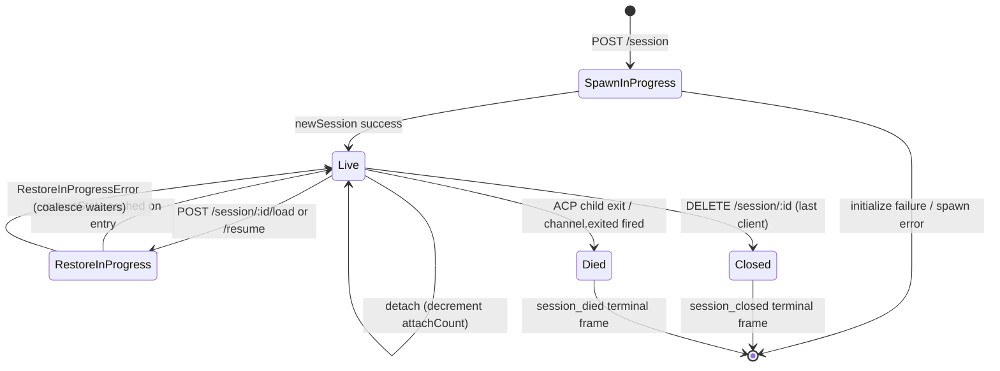

# セッションライフサイクルとアイデンティティ

## 概要

デーモンの**セッション**は、1つのACP `sessionId` に紐付いた1つの論理的な会話です。ブリッジはセッションごとに `SessionEntry` を管理します（[`03-acp-bridge.md`](./03-acp-bridge.md) 参照）。この `SessionEntry` は、ACPの子接続とHTTP側の管理情報（プロンプトFIFO、モデル変更FIFO、イベントバス、保留中のパーミッション、接続クライアント、ハートビート、リストア状態、ターミナルフレームのトゥームストーン）を紐付けます。

デーモンの**クライアント**は `X-Qwen-Client-Id` で識別されます。これはHTTP呼び出し元がリクエストに付与する、デーモンが検証する不透明な文字列です。ブリッジはどのクライアントがどのセッションに接続されているかを追跡し、起点クライアントIDを使って `designated` パーミッションポリシー、監査証跡、イベント帰属を管理します。

このドキュメントでは、セッションのすべてのライフサイクル遷移（create / attach / load / resume / close / die / evict）と、デーモンが公開するすべてのアイデンティティサーフェスを説明します。

## 責務

- セッションの作成、接続、リストア、破棄。
- `X-Qwen-Client-Id` の検証と不正なIDの拒否。
- セッションごとに複数の接続クライアントを追跡（`clientIds: Map<string, count>`、`attachCount`）。
- 送信イベントへの `originatorClientId` スタンプ。
- ダッシュボードがどのクライアントが接続中か把握できるようハートビートを実行。
- `PATCH /session/:id/metadata` でオペレーターが設定するセッションメタデータ（`displayName`）の公開。
- ターミナルフレーム（`session_died`、`session_closed`、`client_evicted`、`stream_error`）の送信制御。

## アーキテクチャ

| 関心事                    | ソース                                                       | 備考                                                                                     |
| ------------------------- | ------------------------------------------------------------ | ----------------------------------------------------------------------------------------- |
| `SessionEntry`            | `packages/acp-bridge/src/bridge.ts`                          | セッションごとの構造体。フィールドの一覧は [`03-acp-bridge.md`](./03-acp-bridge.md) 参照。  |
| `BridgeSession` (public)  | `packages/acp-bridge/src/bridgeTypes.ts`                     | `{ sessionId, workspaceCwd, attached, clientId?, createdAt? }` をHTTPハンドラーに返す。 |
| `BridgeSessionState`      | `packages/acp-bridge/src/bridgeTypes.ts`                     | エントリーに `restoreState` としてキャッシュされる `LoadSessionResponse \| ResumeSessionResponse`。     |
| `DaemonSession` (SDK)     | `packages/sdk-typescript/src/daemon/types.ts`                | `{ sessionId, workspaceCwd, attached, clientId?, createdAt? }`。                           |
| クライアントID検証      | `packages/acp-bridge/src/bridge.ts` (`spawnOrAttach` 周辺) | パターン `[A-Za-z0-9._:-]{1,128}`；不正な場合は `InvalidClientIdError`。                    |
| セッション切断リーパー | `packages/cli/src/serve/server.ts`                           | `attachCount` と `spawnOwnerWantedKill` でスポーンオーナーの切断を追跡。               |

### ステートマシン



### Attach vs Spawn

`sessionScope: 'single'`（デフォルト）の場合、ブリッジの `defaultEntry` はすべての接続クライアントで共有されます。`defaultEntry` が既に存在する状態で `POST /session` が届くと、新しいACPの子プロセスをスポーンせずに `attached: true` を返します。ブリッジは同期的に `attachCount` をインクリメントし、呼び出し元の `X-Qwen-Client-Id` を `clientIds` に登録します。

`sessionScope: 'thread'` の場合、各スレッドは独自のセッションを作成できます。呼び出し元は引き続き `maxSessions` を尊重します。

### アイデンティティ

`X-Qwen-Client-Id` は**任意**ですが、**強く推奨**されます。デーモンは呼び出し元の代わりにIDを生成しません。クライアントは自身でIDを選択し、リクエスト全体で再利用することで、デーモンが投票の帰属、監査イベント、再接続の検出を行えるようにします。

検証ルール:

- 文字セット: `[A-Za-z0-9._:-]`。
- 長さ: 1〜128文字。
- このセット外の場合: `InvalidClientIdError`（`400`）。

デーモンは以下の条件を満たす場合、送信SSEイベントに `originatorClientId` をスタンプします:

1. イベントをトリガーしたリクエストが `X-Qwen-Client-Id` を持っていた、かつ
2. そのIDが現在セッションの `clientIds` セットに登録されている、かつ
3. セッションに `activePromptOriginatorClientId` が設定されている（インラインの `sessionUpdate` と `permission_request` はアクティブなプロンプトから起点を継承する）。

匿名の呼び出し元（`X-Qwen-Client-Id` なし）は `first-responder` ポリシーでは問題なく動作します。`designated` ポリシーは投票を `permission_forbidden{ reason: 'designated_mismatch' }` で拒否し、`consensus` ポリシーも同じ `forbidden` 理由で拒否します（投票者が発行時の `votersAtIssue` スナップショットに含まれていないため）。`local-only` ポリシーのみが匿名のループバック投票者を受け入れます。

## ワークフロー

### 作成または接続

```mermaid
sequenceDiagram
    autonumber
    participant C as Client
    participant R as POST /session
    participant B as Bridge.spawnOrAttach
    participant CH as ACP child

    C->>R: POST /session<br/>X-Qwen-Client-Id: alice<br/>{cwd, sessionScope?}
    R->>R: validate clientId pattern
    R->>B: spawnOrAttach({cwd, sessionScope, clientId})
    alt single scope + defaultEntry exists
        B->>B: bump attachCount; register clientId
        B-->>R: {sessionId, attached: true, restoreState?}
    else cold
        B->>CH: spawn + ACP initialize + newSession
        CH-->>B: sessionId
        B->>B: build SessionEntry; register in byId
        B-->>R: {sessionId, attached: false}
    end
    R-->>C: 200 { sessionId, attached, ... }
```

### Load / Resume

`POST /session/:id/load` — 完全なACPヒストリーを再生します（`session/load` 通知はレスポンスが返る前に発火します）。
`POST /session/:id/resume` — 再生なしでリストアします（`connection.unstable_resumeSession`。安定版の `session_resume` デーモン機能として公開。`unstable_session_resume` は非推奨のエイリアスとして残存）。

共通の動作:

1. チャンネルごとのセッションに `pendingRestoreIds` セットを使用し、並行するリストア呼び出しをまとめます（`RestoreInProgressError`）。
2. エントリーに `restoreState` をキャッシュし、後から接続したクライアントが元のリストア実行者と同じペイロードを受け取れるようにします。

### ハートビート

`POST /session/:id/heartbeat` は `clientId` に関係なく `sessionLastSeenAt` を更新します。リクエストに登録済みの `X-Qwen-Client-Id` が含まれている場合、`clientLastSeenAt.set(clientId, Date.now())` も更新されます。クライアントごとの退避はv1では**未実装**です。失効機能はF-seriesウェーブ5での実装が予定されています。現在、ハートビートはダッシュボードの可観測性と、PR 24で予定されている失効ポリシーのために利用されています。

### メタデータ

`PATCH /session/:id/metadata` は `{displayName?}` を受け付けます。検証ルール:

- 最大長: `MAX_DISPLAY_NAME_LENGTH = 256`。
- 制御文字を含んではいけない（`hasControlCharacter` はコードポイント ≤ 0x1f または == 0x7f を拒否）。
- 違反時: `InvalidSessionMetadataError`（`400`）。

更新が成功すると、`session_metadata_updated` がすべてのサブスクライバーにファンアウトされます。

### 終了

| ターミナルフレーム   | トリガー                                                                                                                                                       |
| ---------------- | ------------------------------------------------------------------------------------------------------------------------------------------------------------- |
| `session_closed` | `DELETE /session/:id`（client_close）またはプログラム的クローズ。                                                                                                   |
| `session_died`   | 何らかの理由（クラッシュ、子プロセスのキル）で `channel.exited` が発火。OSの終了パスが使われた場合は `exitCode?` と `signalCode?` を含む。                                |
| `client_evicted` | EventBusのサブスクライバーごとのキューオーバーフロー（[`10-event-bus.md`](./10-event-bus.md) 参照）。セッションレベルの終了ではなく、このサブスクライバーのみが閉じられる。 |
| `stream_error`   | `SubscriberLimitExceededError` またはその他のルートレベルのストリーム障害。                                                                                             |

保留中のパーミッションは、すべての終了パスで `mediator.forgetSession(sessionId)` を介して `{kind:'cancelled', reason:'session_closed'}` として解決されます。

### 切断リーパーガード

スポーンオーナーのクライアントのHTTPレスポンスが書き込めない場合（ハンドシェイク中のTCPリセット）、ルートは `killSession({ requireZeroAttaches: true })` を呼び出します。別のクライアントが既に接続している場合（`attachCount > 0`）、ガードはショートサーキットし、セッションは継続されます。`spawnOwnerWantedKill = true` を設定することでその意図を記録し、後で `detachClient()` が `attachCount` を0に戻したときに遅延リープが完了します。これがなければ、素早く切断するスポーンオーナーが再接続のたびに正常なセッションを終了させてしまいます。

## 状態とライフサイクル

ライフサイクルに重要な `SessionEntry` フィールド:

| フィールド                            | 型                  | 意味                                                                          |
| -------------------------------- | --------------------- | -------------------------------------------------------------------------------- |
| `clientIds`                      | `Map<string, number>` | 登録クライアントID → 登録参照カウント。                                                  |
| `attachCount`                    | `number`              | このエントリーで `spawnOrAttach` が `attached: true` を返した回数。                  |
| `activePromptOriginatorClientId` | `string?`             | 現在実行中のプロンプトの起点クライアント。                                                     |
| `restoreState`                   | `BridgeSessionState?` | キャッシュされたload/resumeレスポンス。後から接続したクライアントが一貫したペイロードを受け取れるようにする。           |
| `spawnOwnerWantedKill`           | `boolean`             | 遅延リープのトゥームストーン（上記の切断リーパー参照）。                           |
| `sessionLastSeenAt`              | `number?`             | 全クライアントを通じた最新のハートビート（エポック秒）。                              |
| `clientLastSeenAt`               | `Map<string, number>` | クライアントごとのハートビート。                                                            |
| `pendingPermissionIds`           | `Set<string>`         | 現在保留中のACP requestId — キャンセル/クローズ時にキャンセル済みとして解決するために使用。 |

## 依存関係

- ACPレイヤー: `connection.newSession`、`connection.unstable_resumeSession`、`connection.loadSession`。
- 周囲のブリッジアーキテクチャについては [`03-acp-bridge.md`](./03-acp-bridge.md)。
- 起点とアイデンティティがポリシー決定をどう動かすかについては [`04-permission-mediation.md`](./04-permission-mediation.md)。
- ターミナルフレームの配信については [`10-event-bus.md`](./10-event-bus.md)。

## 追加のセッションエンドポイント

これらのエンドポイントは基本的なライフサイクルサーフェスを拡張します:

### ノンブロッキングプロンプト（`non_blocking_prompt` 機能タグ）

`POST /session/:id/prompt` は、プロンプトの完了を待つのではなく、HTTP **202** と
`{ promptId, lastEventId }` を返します。実際の結果はSSEで `turn_complete` / `turn_error` として届き、
`promptId` フィールドがそれらのイベントと202レスポンスを紐付けます。
`DaemonSessionClient.prompt()` はアクティブなイベントサブスクリプションがある場合、自動的にノンブロッキングパスを使用し、
SSEストリームから透過的に結果を照合します。

### セッションリキャップ（`session_recap` 機能タグ）

`POST /session/:id/recap` は高速モデルに「どこまで進んでいたか」の一行サマリーを依頼します。
`{ sessionId, recap: string | null }` を返します。`null` はヒストリーが短すぎるか、モデルが一時的に失敗したことを意味します。
このエンドポイントはベストエフォートです。

### セッションBTW / サイドクエスチョン（`session_btw` 機能タグ）

`POST /session/:id/btw` は、メインの会話フローを中断せずにセッションコンテキストに対して単発の質問を行います。
キャッシュパス上で `runForkedAgent` を使用してシングルターンのツールなしLLM呼び出しを実行し、
`{ sessionId, answer: string | null }` を返します。実装では
`BTW_MAX_INPUT_LENGTH`、クロスセッションリーケージガード、タイムアウト処理を適用します。

### シェルコマンド実行

`POST /session/:id/shell` はLLMを経由せずにデーモンホスト上で直接シェルコマンドを実行します。
`user_shell_command` / `user_shell_result` イベントとしてセッションSSEバス上で出力をストリームし、
コマンドと結果をLLMの会話履歴に注入します。レスポンスは
`{ exitCode, output, aborted }` です。

### セッションデタッチ

`POST /session/:id/detach` は `attachCount` をデクリメントすることでクライアントをセッションから明示的にデタッチします。
それ自体ではセッションを閉じません。他のattachまたはサブスクライバーが残っていない場合、セッションは破棄されます。
エンドポイントは204を返します。

### バッチセッション削除

`POST /sessions/delete` は `{ sessionIds: string[] }`（最大100件）を受け付け、
ブリッジセッションを閉じてトランスクリプトファイルを削除します。
耐障害性のために `Promise.allSettled` を使用し、`{ removed, notFound, errors }` を返します。

### コンテキスト使用量（`session_context_usage` 機能タグ）

`GET /session/:id/context-usage` は構造化されたコンテキストウィンドウ使用量を返します。
`?detail=true` を指定すると、ツール、メモリ、スキルごとにより細かい使用量が含まれます。

### セッション統計（`session_stats` 機能タグ）

`GET /session/:id/stats` は使用統計を返します: モデルメトリクス
（入出力トークン数、キャッシュの読み書き、総コスト）、ツールごとの呼び出し回数と
レイテンシ、ファイル編集回数、ライブセッションのスキルごとの呼び出し回数。
`skills` ブロックはこのセッション内のスキル本体のロードとスキルスラッシュコマンドを反映します。
クロスセッションのアクティビティ集計ではありません。

### セッションタスク（`session_tasks` 機能タグ）

`GET /session/:id/tasks` はエージェントタスク、シェルタスク、モニタータスクとそのライフサイクル状態の
バックグラウンドタスクスナップショットを返します。

### セッションLSPステータス（`session_lsp` 機能タグ）

`GET /session/:id/lsp` はデーモンクライアント向けにサニタイズされたセッションごとのLSPステータスを返します:
有効/無効状態、サーバーの集計数、利用不可/初期化状態、
各サーバーの `name`、`status`、`languages`、`transport`、`command`、`error`。
無効または利用不可なLSPはトランスポートエラーではなく、HTTP 200のステータスデータとして表現されます。

### 圧縮済みリプレイ

`POST /session/:id/load` は `compactedReplay?: BridgeEvent[]`、`liveJournal?: BridgeEvent[]`、
`lastEventId?: number` を含む `BridgeRestoredSession` を返すようになりました。
`compactedReplay` は `TurnBoundaryCompactionEngine` によって生成されます。
ターン境界で連続するテキスト/思考ブロックを折りたたみ、ツール呼び出しシーケンスを最終状態に集約し、
一時的なシグナルを破棄し、O(tokens)ではなくO(turns)のリプレイログを生成します（通常25〜30倍の削減）。

### ACPチャイルドのプリヒート

`bridge.preheat()` は最初のセッションの前にACPの子プロセスをウォームアップし、
最初の実セッションのコールドスタートレイテンシを回避します。
`channelIdleTimeoutMs`（最後のセッションが閉じた後もACPの子プロセスを生存させる）と
スキップ再起動動作（新しいセッションが来たときにアイドル状態の子プロセスを再利用する）と組み合わせて使用します。

## 設定

- `BridgeOptions.maxSessions`（デフォルト20）— 上限。
- `BridgeOptions.sessionScope`（デフォルト `'single'`；オプションで `'thread'`）。
- `BridgeOptions.initializeTimeoutMs`（デフォルト10秒）— ACP `initialize` ハンドシェイク。
- `BridgeOptions.channelIdleTimeoutMs`（デフォルト0；ACPの子プロセスを即座に破棄）。
- 機能タグ: `session_create`、`session_scope_override`、`session_load`、`session_resume`、`unstable_session_resume`（非推奨エイリアス）、`session_list`、`session_close`、`session_metadata`、`session_set_model`、`client_identity`、`client_heartbeat`、`session_recap`、`session_btw`、`session_context_usage`、`session_tasks`、`session_stats`、`session_lsp`、`non_blocking_prompt`。

## 注意事項と既知の制限

- `connection.unstable_resumeSession` はACPレイヤーでまだ不安定な場合がありますが、デーモンは `session_resume` としてコミット済みのv1ルートコントラクトを公表しています。`unstable_session_resume` は非推奨の互換性エイリアスとしてのみ保持されています。
- v1にはクライアントごとの退避機能は**ありません**。セッションごとおよびサブスクライバーごとの終了のみです。失効ポリシーはF-seriesウェーブ5 / PR 24で予定されています。
- `client_evicted` はセッション単位ではなく、サブスクライバー単位です。SSEサブスクライバーが退避されたクライアントは再接続できます。
- 匿名クライアント（`X-Qwen-Client-Id` なし）は `designated` または `consensus` ポリシー下では投票できません。

## 参考資料

- `packages/acp-bridge/src/bridge.ts`（SessionEntry定義）
- `packages/acp-bridge/src/bridgeTypes.ts`（`HttpAcpBridge`、`BridgeSession`、`BridgeSessionState`）
- `packages/sdk-typescript/src/daemon/types.ts`（`DaemonSession`）
- `packages/sdk-typescript/src/daemon/DaemonSessionClient.ts`
- ワイヤーリファレンス: [`../qwen-serve-protocol.md`](../qwen-serve-protocol.md)（ルートカタログ）。
