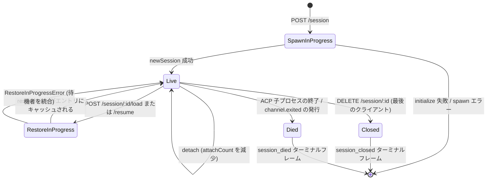

# セッションライフサイクルと識別子

## 概要

デーモンの**セッション**は、1つのACP `sessionId`に紐付けられた1つの論理的な会話です。ブリッジはセッションごとに `SessionEntry` を維持し（[`03-acp-bridge.md`](./03-acp-bridge.md) を参照）、ACP子プロセス接続とHTTP側の管理（プロンプトFIFO、モデル変更FIFO、イベントバス、保留中の権限、アタッチされたクライアント、ハートビート、復元状態、ターミナルフレームのトームストーン）を結合します。

デーモンの**クライアント**は `X-Qwen-Client-Id` によって識別されます。これは、HTTP呼び出し元がリクエストに付与する、デーモンによって検証される不透明な文字列です。ブリッジはどのクライアントがどのセッションにアタッチされているかを追跡し、発信元クライアントIDを使用して `designated` 権限ポリシー、監査証跡、およびイベントの属性付けを制御します。

本ドキュメントでは、すべてのセッションライフサイクルの遷移（create / attach / load / resume / close / die / evict）と、デーモンが公開するすべてのID関連インターフェースについて説明します。

## 責務

- セッションの作成、アタッチ、復元、および回収。
- `X-Qwen-Client-Id` を検証し、不正な形式のIDを拒否する。
- セッションごとに複数のアタッチされたクライアントを追跡する（`clientIds: Map<string, count>`、`attachCount`）。
- 送信イベントに `originatorClientId` を付与する。
- ダッシュボードでどのクライアントがまだ接続されているかを確認できるようにハートビートを実行する。
- オペレーターが `PATCH /session/:id/metadata` を介して設定するセッションメタデータ（`displayName`）を公開する。
- ターミナルフレームの発行（`session_died`、`session_closed`、`client_evicted`、`stream_error`）を制御する。

## アーキテクチャ

| 懸念事項                   | ソース                                                       | 備考                                                                                     |
| ------------------------- | ------------------------------------------------------------ | ----------------------------------------------------------------------------------------- |
| `SessionEntry`            | `packages/acp-bridge/src/bridge.ts`                          | セッションごとの構造体。全フィールド一覧は [`03-acp-bridge.md`](./03-acp-bridge.md) を参照。  |
| `BridgeSession` (public)  | `packages/acp-bridge/src/bridgeTypes.ts`                     | HTTPハンドラに返される `{ sessionId, workspaceCwd, attached, clientId?, createdAt? }`。 |
| `BridgeSessionState`      | `packages/acp-bridge/src/bridgeTypes.ts`                     | エントリに `restoreState` としてキャッシュされる `LoadSessionResponse \| ResumeSessionResponse`。     |
| `DaemonSession` (SDK)     | `packages/sdk-typescript/src/daemon/types.ts`                | `{ sessionId, workspaceCwd, attached, clientId?, createdAt? }`。                           |
| Client-id validation      | `packages/acp-bridge/src/bridge.ts` (around `spawnOrAttach`) | パターン `[A-Za-z0-9._:-]{1,128}`。不正な形式の場合は `InvalidClientIdError`。                    |
| Session disconnect-reaper | `packages/cli/src/serve/server.ts`                           | `attachCount` + `spawnOwnerWantedKill` を使用して、スポーンオーナーの切断を追跡。               |

### 状態遷移図



### アタッチとスポーン

`sessionScope: 'single'`（デフォルト）では、ブリッジの `defaultEntry` は接続するすべてのクライアントで共有されます。`defaultEntry` が既に存在する状態で `POST /session` が到着した場合、新しいACP子プロセスをスポーンせずに `attached: true` を返します。ブリッジは同期的に `attachCount` を増加させ、呼び出し元の `X-Qwen-Client-Id` を `clientIds` に登録します。

`sessionScope: 'thread'` では、各スレッドが個別のセッションを作成できます。呼び出し元は引き続き `maxSessions` を遵守する必要があります。

### 識別子

`X-Qwen-Client-Id` は**任意**ですが、**強く推奨**されます。デーモンは呼び出し元に代わってこれを生成しません。クライアントは自分で選択し、リクエスト間で再利用することで、デーモンが投票の属性付け、イベントの監査、再接続の検出を行えるようにします。

検証ルール:

- 文字セット: `[A-Za-z0-9._:-]`。
- 長さ: 1〜128。
- このセット外: `InvalidClientIdError` (`400`)。

デーモンは、以下の条件を満たす場合に送信SSEイベントへ `originatorClientId` を付与します。

1. イベントをトリガーしたリクエストに `X-Qwen-Client-Id` が含まれており、かつ
2. そのIDが現在セッションの `clientIds` セットに登録されており、かつ
3. セッションに `activePromptOriginatorClientId` が設定されている（インラインの `sessionUpdate` と `permission_request` は、アクティブなプロンプトから発信元を継承します）。

匿名の呼び出し元（`X-Qwen-Client-Id` なし）は `first-responder` ポリシーで正常に動作します。`designated` は `permission_forbidden{ reason: 'designated_mismatch' }` で投票を拒否します。`consensus` は、投票者が発行時の `votersAtIssue` スナップショットに含まれていないため、同じ `forbidden` 理由で拒否します。匿名のループバック投票者を受け入れる唯一のポリシーは `local-only` です。

## ワークフロー

### 作成またはアタッチ

```mermaid
sequenceDiagram
    autonumber
    participant C as クライアント
    participant R as POST /session
    participant B as Bridge.spawnOrAttach
    participant CH as ACP 子プロセス

    C->>R: POST /session<br/>X-Qwen-Client-Id: alice<br/>{cwd, sessionScope?}
    R->>R: clientId パターンの検証
    R->>B: spawnOrAttach({cwd, sessionScope, clientId})
    alt single スコープ + defaultEntry が存在
        B->>B: attachCount を増加; clientId を登録
        B-->>R: {sessionId, attached: true, restoreState?}
    else コールドスタート
        B->>CH: spawn + ACP initialize + newSession
        CH-->>B: sessionId
        B->>B: SessionEntry を構築; byId に登録
        B-->>R: {sessionId, attached: false}
    end
    R-->>C: 200 { sessionId, attached, ... }
```

### ロード / レジューム

`POST /session/:id/load` — 完全なACP履歴をリプレイします（レスポンスが返る前に `session/load` 通知が発行されます）。
`POST /session/:id/resume` — リプレイなしで復元します（`connection.unstable_resumeSession`。安定版の `session_resume` デーモン機能の下で公開されます。`unstable_session_resume` は非推奨のエイリアスとして残っています）。

両者とも:

1. チャネル上のセッションごとの `pendingRestoreIds` セットを使用して、並行する復元呼び出しを統合します（`RestoreInProgressError`）。
2. エントリに `restoreState` をキャッシュし、後からアタッチするクライアントが元の復元者と同じペイロードを取得できるようにします。

### ハートビート

`POST /session/:id/heartbeat` は `clientId` に関係なく `sessionLastSeenAt` を更新します。リクエストに登録済みの `X-Qwen-Client-Id` が含まれている場合、`clientLastSeenAt.set(clientId, Date.now())` も更新されます。v1ではクライアントごとのエビクトは**実装されていません**。取り消し（revocation）はF-series Wave 5で予定されています。現在、ハートビートはダッシュボードの可観測性およびPR 24で予定されている取り消しポリシーのために提供されています。

### メタデータ

`PATCH /session/:id/metadata` は `{displayName?}` を受け付けます。検証:

- 最大長: `MAX_DISPLAY_NAME_LENGTH = 256`。
- 制御文字を含めてはなりません（`hasControlCharacter` はコードポイント ≤ 0x1f または == 0x7f を拒否します）。
- 違反した場合は `InvalidSessionMetadataError` (`400`)。

更新が成功すると、`session_metadata_updated` がすべてのサブスクライバーにファンアウトされます。

### 終了

| ターミナルフレーム   | トリガー                                                                                                                                                       |
| ---------------- | ------------------------------------------------------------------------------------------------------------------------------------------------------------- |
| `session_closed` | `DELETE /session/:id`（client_close）またはプログラムによるクローズ。                                                                                                   |
| `session_died`   | 何らかの理由（クラッシュ、子プロセスのキル）で `channel.exited` が発行されます。OSの終了パスが使用された場合は `exitCode?` + `signalCode?` が含まれます。                                |
| `client_evicted` | EventBusでのサブスクライバーごとのキューオーバーフロー（[`10-event-bus.md`](./10-event-bus.md) を参照）。セッションレベルの終了ではなく、このサブスクライバーのみがクローズされます。 |
| `stream_error`   | `SubscriberLimitExceededError` またはその他のルートレベルのストリーム障害。                                                                                             |

保留中の権限は、すべての終了パスで `mediator.forgetSession(sessionId)` を介して `{kind:'cancelled', reason:'session_closed'}` として解決されます。

### 切断レパーガード

スポーンを所有するクライアントのHTTPレスポンスを書き込めない場合（ハンドシェイク中にTCPリセットが発生した場合など）、ルートは `killSession({ requireZeroAttaches: true })` を呼び出します。他のクライアントがすでにアタッチされている場合（`attachCount > 0`）、ガードはショートサーキットし、セッションは存続します。`spawnOwnerWantedKill = true` を設定すると意図が保持されるため、後で `attachCount` を 0 に戻す `detachClient()` が遅延回収を完了します。これがなければ、高速に切断されるスポーンオーナーは、再接続のたびに正常なセッションを破棄してしまうことになります。

## 状態とライフサイクル

ライフサイクルに重要な `SessionEntry` フィールド:

| フィルダ                            | タイプ                  | 意味                                                                          |
| -------------------------------- | --------------------- | -------------------------------------------------------------------------------- |
| `clientIds`                      | `Map<string, number>` | 登録済みクライアントID → 登録参照カウント。                                  |
| `attachCount`                    | `number`              | このエントリに対して `spawnOrAttach` が `attached: true` を返した回数。                  |
| `activePromptOriginatorClientId` | `string?`             | 現在実行中のプロンプトの発信元。                                     |
| `restoreState`                   | `BridgeSessionState?` | 遅れてアタッチするクライアントが一貫したペイロードを確認できるようにキャッシュされた load/resume レスポンス。           |
| `spawnOwnerWantedKill`           | `boolean`             | 遅延回収のトームストーン（上記のdisconnect-reaperを参照）。                           |
| `sessionLastSeenAt`              | `number?`             | 任意のクライアントからの最新のハートビート（エポックミリ秒）。                              |
| `clientLastSeenAt`               | `Map<string, number>` | クライアントごとのハートビート。                                                            |
| `pendingPermissionIds`           | `Set<string>`         | 現在保留中のACP requestIds — キャンセル/クローズ時にキャンセル済みとして解決するために使用。 |

## 依存関係

- ACP層: `connection.newSession`、`connection.unstable_resumeSession`、`connection.loadSession`。
- 周辺のブリッジアーキテクチャについては [`03-acp-bridge.md`](./03-acp-bridge.md) を参照。
- 発信元 + ID がポリシー決定をどのように駆動するかについては [`04-permission-mediation.md`](./04-permission-mediation.md) を参照。
- ターミナルフレームの配信については [`10-event-bus.md`](./10-event-bus.md) を参照。

## 追加のセッションエンドポイント

これらのエンドポイントは基本のライフサイクルインターフェースを拡張します。

### ノンブロッキングプロンプト（`non_blocking_prompt` 機能タグ）

`POST /session/:id/prompt` は、プロンプトが完了するまでブロックするのではなく、`{ promptId, lastEventId }` を含むHTTP **202** を返すようになりました。実際の結果はSSE上で `turn_complete` / `turn_error` として到着し、`promptId` フィールドがそれらのイベントと202レスポンスを関連付けます。`DaemonSessionClient.prompt()` は、アクティブなイベントサブスクリプションを持っている場合に自動的にノンブロッキングパスを使用し、SSEストリームからの結果を透過的にマッチングします。

### セッションリキャップ（`session_recap` 機能タグ）

`POST /session/:id/recap` は、高速モデルに「どこまで進んでいたか」を要約した1行のサマリーを要求します。`{ sessionId, recap: string | null }` を返します。`null` は履歴が短すぎるか、モデルが一時的に失敗したことを意味します。このエンドポイントはベストエフォートです。

### セッションBTW / サイドクエスチョン（`session_btw` 機能タグ）

`POST /session/:id/btw` は、メインの会話フローを中断することなく、セッションコンテキストに対して一回限りの質問を行います。キャッシュパス上で `runForkedAgent` を使用して、シングルターンかつツールなしのLLM呼び出しを行い、`{ sessionId, answer: string | null }` を返します。実装では `BTW_MAX_INPUT_LENGTH`、クロスセッションリークガード、およびタイムアウト処理が強制されます。

### シェルコマンド実行

`POST /session/:id/shell` は、LLMを経由せずにデーモンホスト上で直接シェルコマンドを実行します。`user_shell_command` / `user_shell_result` イベントを介してセッションSSEバス上で出力をストリーミングし、コマンドと結果をLLMの会話履歴に注入します。レスポンスは `{ exitCode, output, aborted }` です。

### セッションデタッチ

`POST /session/:id/detach` は、`attachCount` を減算することでクライアントをセッションから明示的にデタッチします。これ単体ではセッションをクローズしません。他のアタッチやサブスクライバーが残っていない場合、セッションは回収されます。エンドポイントは204を返します。

### バッチセッション削除

`POST /sessions/delete` は `{ sessionIds: string[] }`（最大100個のID）を受け付け、ブリッジセッションをクローズし、アクティブまたはアーカイブされたトランスクリプトファイルを削除します。同じIDに対してアクティブなJSONLファイルとアーカイブされたJSONLファイルの両方が存在する場合、ハード削除は両方を削除するため、オペレーターは競合を解消できます。アクティブおよびアーカイブされたワークツリーサイドカーをクリーンアップしますが、ファイル履歴スナップショット、サブエージェントのトランスクリプト、およびランタイムサイドカーはそのまま残します。回復力のために `Promise.allSettled` を使用し、`{ removed, notFound, errors }` を返します。

### セッションアーカイブ

`POST /sessions/archive` は、非アクティブなセッションのJSONLファイルを `chats/` から `chats/archive/` に移動します。対象のセッションがライブの場合、デーモンはまずセッションごとのアーカイブゲートに入り、ACP子プロセスに `ChatRecordingService` のフラッシュを要求する厳格なクローズを実行します。クローズまたはフラッシュが失敗した場合、アーカイブはJSONLをそのまま残します。

`POST /sessions/unarchive` は、アーカイブされたJSONLファイルを `chats/` に戻します。これはストレージ状態の遷移に過ぎないため、クライアントはその後 `session/load` または `session/resume` を呼び出す必要があります。アーカイブされたセッションは load/resume に対して `409 session_archived` を返し、アーカイブ遷移と競合するミューテーションは `409 session_archiving` を返します。

### コンテキスト使用量（`session_context_usage` 機能タグ）

`GET /session/:id/context-usage` は構造化されたコンテキストウィンドウの使用状況を返します。`?detail=true` は、ツール、メモリ、およびスキルごとにグループ化されたより詳細な使用状況を含みます。

### セッション統計（`session_stats` 機能タグ）

`GET /session/:id/stats` は使用統計を返します。ライブセッションのモデルメトリクス（入出力トークン、キャッシュの読み書き、総コスト）、ツールごとの呼び出し回数とレイテンシ、ファイル編集回数、およびスキルごとの呼び出し回数です。`skills` ブロックは、このセッション内のスキル本体のロードとスキルスラッシュコマンドのみを反映し、クロスセッションのアクティビティ集計ではありません。

### セッションタスク（`session_tasks` 機能タグ）

`GET /session/:id/tasks` は、エージェントタスク、シェルタスク、モニタータスク、およびそれらのライフサイクル状態のバックグラウンドタスクスナップショットを返します。

### セッションLSPステータス（`session_lsp` 機能タグ）

`GET /session/:id/lsp` は、デーモンクライアント向けにサニタイズされたセッションごとのLSPステータスを返します。有効化状態、集計サーバー数、利用不可/初期化状態、およびサーバーごとの `name`、`status`、`languages`、`transport`、`command`、`error` です。無効または利用不可のLSPは、トランスポートエラーではなくHTTP 200ステータスデータとして表現されます。

### コンパクトリプレイ

`POST /session/:id/load` は、`compactedReplay?: BridgeEvent[]`、`liveJournal?: BridgeEvent[]`、および `lastEventId?: number` を含むことができる `BridgeRestoredSession` を返すようになりました。`compactedReplay` は `TurnBoundaryCompactionEngine` によって生成されます。ターンの境界で連続するテキスト/思考ブロックを折りたたみ、ツール呼び出しシーケンスを最終状態に圧縮し、一時的なシグナルを破棄して、O(tokens) ログではなく O(turns) のリプレイログを生成します（通常25〜30倍の削減）。

### ACP子プロセスのプレヒート

`bridge.preheat()` は、最初のセッションの前にACP子プロセスをウォーミングアップし、最初の本番セッションでコールドスタートのレイテンシを回避します。これは、最後のセッションがクローズした後もACP子プロセスを存続させる `channelIdleTimeoutMs` と、新しいセッションが到着したときにすでにアイドル状態の子プロセスを再利用する skip-relaunch 動作と組み合わせて使用されます。

## 設定

- `BridgeOptions.maxSessions`（デフォルト 20）— 上限。
- `BridgeOptions.sessionScope`（デフォルト `'single'`、オプション `'thread'`）。
- `BridgeOptions.initializeTimeoutMs`（デフォルト 10s）— ACP `initialize` ハンドシェイク。
- `BridgeOptions.channelIdleTimeoutMs`（デフォルト 0、ACP子プロセスを即座に回収）。
- 機能タグ: `session_create`、`session_scope_override`、`session_load`、`session_resume`、`unstable_session_resume`（非推奨のエイリアス）、`session_list`、`session_close`、`session_metadata`、`session_set_model`、`client_identity`、`client_heartbeat`、`session_recap`、`session_btw`、`session_context_usage`、`session_tasks`、`session_stats`、`session_lsp`、`session_status`、`non_blocking_prompt`。

## 注意事項と既知の制限

- `connection.unstable_resumeSession` はACP層ではまだ不安定な場合がありますが、デーモンは `session_resume` でコミットされたv1ルート契約を公開します。`unstable_session_resume` は、非推奨の互換性エイリアスとしてのみ保持されています。
- v1には**クライアントごとのエビクトはありません**。セッションごとおよびサブスクライバーごとの終了のみです。取り消しポリシーはF-series Wave 5 / PR 24です。
- `client_evicted` はサブスクライバーごとであり、セッションごとではありません。SSEサブスクライバーがエビクトされたクライアントは再接続できます。
- 匿名のクライアント（`X-Qwen-Client-Id` なし）は、`designated` または `consensus` ポリシーの下で投票できません。

## 参照

- `packages/acp-bridge/src/bridge.ts`（SessionEntryの定義）
- `packages/acp-bridge/src/bridgeTypes.ts`（`HttpAcpBridge`、`BridgeSession`、`BridgeSessionState`）
- `packages/sdk-typescript/src/daemon/types.ts`（`DaemonSession`）
- `packages/sdk-typescript/src/daemon/DaemonSessionClient.ts`
- ワイヤーリファレンス: [`../qwen-serve-protocol.md`](../qwen-serve-protocol.md)（ルートカタログ）。