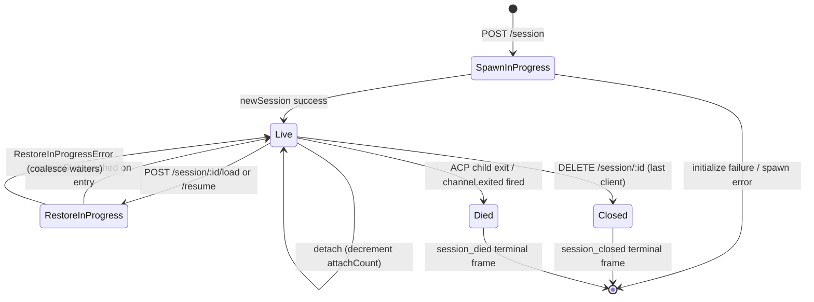

# セッションライフサイクルとID

## 概要

デーモンの**セッション**は、1つのACP `sessionId` に紐づく1つの論理的な会話です。ブリッジはセッションごとに `SessionEntry` を保持し（[`03-acp-bridge.md`](./03-acp-bridge.md) 参照）、ACP子接続とHTTP側のブックキーピング（プロンプトFIFO、モデル変更FIFO、イベントバス、保留中のパーミッション、接続クライアント、ハートビート、復元状態、端末フレームのトゥームストーン）を結合します。

デーモンの**クライアント**は `X-Qwen-Client-Id` によって識別されます。これは、HTTP呼び出し元がリクエストに付与する、デーモンによって検証される不透明な文字列です。ブリッジはどのクライアントがどのセッションに接続しているかを追跡し、発信元クライアントIDを使用して `designated` パーミッションポリシー、監査証跡、イベントの属性情報を管理します。

このドキュメントでは、すべてのセッションライフサイクルの遷移（作成 / アタッチ / ロード / レジューム / クローズ / 終了 / エビクト）と、デーモンが公開するすべてのID関連のサーフェスについて説明します。

## 責任

- セッションの生成、アタッチ、復元、および回収。
- `X-Qwen-Client-Id` の検証と不正なIDの拒否。
- セッションごとの複数アタッチクライアントの追跡（`clientIds: Map<string, count>`、`attachCount`）。
- 送信イベントへの `originatorClientId` の付与。
- ダッシュボードがどのクライアントがまだ接続中かを把握できるようにするためのハートビートの実行。
- オペレーターが `PATCH /session/:id/metadata` で設定するセッションメタデータ（`displayName`）の公開。
- 端末フレームの出力（`session_died`、`session_closed`、`client_evicted`、`stream_error`）。

## アーキテクチャ

| 対象                          | ソース                                                         | 備考                                                                                             |
| ----------------------------- | -------------------------------------------------------------- | ------------------------------------------------------------------------------------------------ |
| `SessionEntry`                | `packages/acp-bridge/src/bridge.ts`                            | セッションごとの構造体。全フィールド一覧は [`03-acp-bridge.md`](./03-acp-bridge.md) 参照。          |
| `BridgeSession` (公開)        | `packages/acp-bridge/src/bridgeTypes.ts`                       | `{ sessionId, workspaceCwd, attached, clientId?, createdAt? }`。HTTPハンドラに返却。            |
| `BridgeSessionState`          | `packages/acp-bridge/src/bridgeTypes.ts`                       | `LoadSessionResponse | ResumeSessionResponse` をエントリに `restoreState` としてキャッシュ。       |
| `DaemonSession` (SDK)         | `packages/sdk-typescript/src/daemon/types.ts`                  | `{ sessionId, workspaceCwd, attached, clientId?, createdAt? }`。                                 |
| クライアントID検証              | `packages/acp-bridge/src/bridge.ts` (`spawnOrAttach` 周辺)      | パターン `[A-Za-z0-9._:-]{1,128}`。不正な場合は `InvalidClientIdError`。                          |
| セッション切断回収機能         | `packages/cli/src/serve/server.ts`                             | `attachCount` + `spawnOwnerWantedKill` を使用してスポーン所有者の切断を追跡。                      |

### ステートマシン



### アタッチ vs スポーン

`sessionScope: 'single'`（デフォルト）の場合、ブリッジの `defaultEntry` は接続するすべてのクライアントで共有されます。`defaultEntry` が既に存在する状態で `POST /session` が到着すると、新しいACP子をスポーンせずに `attached: true` を返します。ブリッジは同期的に `attachCount` を増やし、呼び出し元の `X-Qwen-Client-Id` を `clientIds` に登録します。

`sessionScope: 'thread'` の場合、各スレッドが個別のセッションを生成できます。呼び出し元は依然として `maxSessions` に従います。

### ID

`X-Qwen-Client-Id` は**オプション**ですが、**強く推奨されます**。デーモンは呼び出し元に代わってIDを生成しません。クライアントが自身でIDを選択し、リクエスト間で再利用することで、デーモンは投票の属性、イベントの監査、再接続の検出を行うことができます。

検証ルール:

- 文字セット: `[A-Za-z0-9._:-]`。
- 長さ: 1～128。
- この範囲外: `InvalidClientIdError` (`400`)。

デーモンは、以下の場合に送信SSEイベントに `originatorClientId` を付与します:

1. イベントをトリガーしたリクエストが `X-Qwen-Client-Id` を持っていた場合、かつ
2. そのIDが現在セッションの `clientIds` セットに登録されている場合、かつ
3. セッションに `activePromptOriginatorClientId` が設定されている場合（インラインの `sessionUpdate` と `permission_request` は、アクティブなプロンプトから発信元を継承します）。

匿名呼び出し元（`X-Qwen-Client-Id` なし）は `first-responder` ポリシーでは正常に機能します。`designated` は `permission_forbidden{ reason: 'designated_mismatch' }` で投票を拒否します。`consensus` は、投票者が発行時の `votersAtIssue` スナップショットに含まれていないため、同じ `forbidden` 理由で拒否します。`local-only` は、匿名のループバック投票者を受け入れる唯一のポリシーです。

## ワークフロー

### 作成またはアタッチ

```mermaid
sequenceDiagram
    autonumber
    participant C as Client
    participant R as POST /session
    participant B as Bridge.spawnOrAttach
    participant CH as ACP child

    C->>R: POST /session<br/>X-Qwen-Client-Id: alice<br/>{cwd, sessionScope?}
    R->>R: validate clientId pattern
    R->>B: spawnOrAttach({cwd, sessionScope, clientId})
    alt single scope + defaultEntry exists
        B->>B: bump attachCount; register clientId
        B-->>R: {sessionId, attached: true, restoreState?}
    else cold
        B->>CH: spawn + ACP initialize + newSession
        CH-->>B: sessionId
        B->>B: build SessionEntry; register in byId
        B-->>R: {sessionId, attached: false}
    end
    R-->>C: 200 { sessionId, attached, ... }
```

### ロード / レジューム

`POST /session/:id/load` — 完全なACP履歴を再生します（`session/load` 通知はレスポンスが返る前に発火します）。
`POST /session/:id/resume` — 再生なしで復元します（`connection.unstable_resumeSession`。安定版の `session_resume` デーモン機能として公開。`unstable_session_resume` は非推奨のエイリアスとして残ります）。

両者ともに:

1. チャネル上のセッションごとの `pendingRestoreIds` セットを使用して、同時実行の復元呼び出しを合体させます（`RestoreInProgressError`）。
2. `restoreState` をエントリにキャッシュして、後にアタッチしたクライアントが元の復元者と同じペイロードを取得できるようにします。

### ハートビート

`POST /session/:id/heartbeat` は、`clientId` に関係なく `sessionLastSeenAt` を更新します。リクエストが登録済みの `X-Qwen-Client-Id` を持っている場合、`clientLastSeenAt.set(clientId, Date.now())` も更新されます。クライアントごとのエビクションはv1では**実装されていません**。失効はFシリーズ Wave 5で計画されています。現在、ハートビートはダッシュボードとPR 24で計画されている失効ポリシーに対する観測可能性を提供します。

### メタデータ

`PATCH /session/:id/metadata` は `{displayName?}` を受け入れます。検証:

- 最大長: `MAX_DISPLAY_NAME_LENGTH = 256`。
- 制御文字を含めてはなりません（`hasControlCharacter` はコードポイント ≤ 0x1f または == 0x7f を拒否します）。
- 違反した場合は `InvalidSessionMetadataError` (`400`)。

更新が成功すると、すべてのサブスクライバーに `session_metadata_updated` がファンアウトされます。

### 終了

| 端末フレーム      | トリガー                                                                                                           |
| ----------------- | ------------------------------------------------------------------------------------------------------------------ |
| `session_closed`  | `DELETE /session/:id` (client_close) またはプログラムによるクローズ。                                                |
| `session_died`    | `channel.exited` が何らかの理由（クラッシュ、子プロセス強制終了）で発火。OSのexitパスが使用された場合、`exitCode?` + `signalCode?` を保持。 |
| `client_evicted`  | EventBus上のサブスクライバーごとのキューオーバーフロー（[`10-event-bus.md`](./10-event-bus.md) 参照）。セッションレベルの終了ではありません — このサブスクライバーのみがクローズされます。 |
| `stream_error`    | SubscriberLimitExceededError またはその他のルートレベルのストリーム障害。                                            |

保留中のパーミッションは、すべての終了パスで `mediator.forgetSession(sessionId)` を介して `{kind:'cancelled', reason:'session_closed'}` として解決されます。

### 切断回収機能ガード

スポーン所有クライアントのHTTPレスポンスが書き込めない場合（ハンドシェイク中のTCPリセット）、ルートは `killSession({ requireZeroAttaches: true })` を呼び出します。別のクライアントが既にアタッチしている場合（`attachCount > 0`）、ガードはショートサーキットし、セッションは存続します。`spawnOwnerWantedKill = true` を設定することで意図を記憶し、後続の `detachClient()` で `attachCount` が0に戻ったときに、延期された回収を完了します。これがないと、高速切断するスポーン所有者が、再接続のたびに正常なセッションを破棄してしまいます。

## 状態とライフサイクル

ライフサイクルに重要な `SessionEntry` フィールド:

| フィールド                          | 型                    | 意味                                                                          |
| ----------------------------------- | --------------------- | ----------------------------------------------------------------------------- |
| `clientIds`                         | `Map<string, number>` | 登録されたクライアントID → 登録参照カウント。                                   |
| `attachCount`                       | `number`              | このエントリに対して `spawnOrAttach` が `attached: true` を返した回数。          |
| `activePromptOriginatorClientId`    | `string?`             | 現在実行中のプロンプトの発信元。                                                |
| `restoreState`                      | `BridgeSessionState?` | ロード/レジュームレスポンスをキャッシュし、後からアタッチしたクライアントが一貫したペイロードを取得できるようにする。 |
| `spawnOwnerWantedKill`              | `boolean`             | 延期回収用のトゥームストーン（上記の切断回収機能を参照）。                        |
| `sessionLastSeenAt`                 | `number?`             | 任意のクライアントからの最新のハートビート（エポックミリ秒）。                     |
| `clientLastSeenAt`                  | `Map<string, number>` | クライアントごとのハートビート。                                                 |
| `pendingPermissionIds`              | `Set<string>`         | 現在保留中のACPリクエストID — キャンセル/クローズ時にキャンセル済みとして解決するために使用。 |

## 依存関係

- ACP層: `connection.newSession`、`connection.unstable_resumeSession`、`connection.loadSession`。
- [`03-acp-bridge.md`](./03-acp-bridge.md) — 周辺のブリッジアーキテクチャについて。
- [`04-permission-mediation.md`](./04-permission-mediation.md) — 発信元とIDがどのようにポリシー判断を駆動するかについて。
- [`10-event-bus.md`](./10-event-bus.md) — 端末フレームの配信について。

## 追加のセッションエンドポイント

これらのエンドポイントは、基本のライフサイクルサーフェスを拡張します:

### 非ブロッキングプロンプト（`non_blocking_prompt` 機能タグ）

`POST /session/:id/prompt` は、プロンプトが完了するまでブロックする代わりに、HTTP **202** と `{ promptId, lastEventId }` を返すようになりました。実際の結果はSSEで `turn_complete` / `turn_error` として到着し、`promptId` フィールドがこれらのイベントを202レスポンスと関連付けます。`DaemonSessionClient.prompt()` は、アクティブなイベントサブスクリプションがある場合に自動的に非ブロッキングパスを使用し、SSEストリームからの結果を透過的に照合します。

### セッション要約（`session_recap` 機能タグ）

`POST /session/:id/recap` は、高速モデルに「どこまで進めたか」の1行の要約を要求します。`{ sessionId, recap: string | null }` を返します。`null` は履歴が短すぎるか、モデルが一時的に失敗したことを意味します。このエンドポイントはベストエフォートです。

### セッションBTW / サイドクエスチョン（`session_btw` 機能タグ）

`POST /session/:id/btw` は、メインの会話フローを中断することなく、セッションコンテキストに対して単発の質問を行います。キャッシュパス上で `runForkedAgent` を使用してシングルターン、ツールなしのLLM呼び出しを行い、`{ sessionId, answer: string | null }` を返します。実装は `BTW_MAX_INPUT_LENGTH`、セッション間の漏洩ガード、タイムアウト処理を適用します。

### シェルコマンド実行

`POST /session/:id/shell` は、LLMを経由せずに、デーモンホスト上でシェルコマンドを直接実行します。`user_shell_command` / `user_shell_result` イベントを介してセッションSSEバスに出力をストリーミングし、コマンドと結果をLLMの会話履歴に挿入します。レスポンスは `{ exitCode, output, aborted }` です。

### セッション切断

`POST /session/:id/detach` は、`attachCount` をデクリメントすることで、クライアントをセッションから明示的に切断します。これ自体はセッションをクローズしません。他にアタッチやサブスクライバーが残っていない場合、セッションは回収されます。エンドポイントは204を返します。

### バッチセッション削除

`POST /sessions/delete` は `{ sessionIds: string[] }`（最大100 ID）を受け入れ、ブリッジセッションをクローズし、トランスクリプトファイルを削除します。耐障害性のために `Promise.allSettled` を使用し、`{ removed, notFound, errors }` を返します。

### コンテキスト使用量（`session_context_usage` 機能タグ）

`GET /session/:id/context-usage` は、構造化されたコンテキストウィンドウ使用量を返します。`?detail=true` は、ツール、メモリ、スキルごとにグループ化されたより詳細な使用量を含みます。

### セッション統計（`session_stats` 機能タグ）

`GET /session/:id/stats` は、使用統計を返します: モデルメトリクス（入出力トークン、キャッシュ読み取り/書き込み、総コスト）、ツールごとの呼び出し回数とレイテンシ、ファイル編集回数、およびライブセッションのスキルごとの呼び出し回数。`skills` ブロックは、このセッション内でのスキル本体の読み込みとスキルスラッシュコマンドを反映します。これはセッション間のアクティビティ集計ではありません。

### セッションタスク（`session_tasks` 機能タグ）

`GET /session/:id/tasks` は、エージェントタスク、シェルタスク、モニタタスク、およびそれらのライフサイクル状態のバックグラウンドタスクスナップショットを返します。

### セッションLSPステータス（`session_lsp` 機能タグ）

`GET /session/:id/lsp` は、デーモンクライアント向けにサニタイズされたセッションごとのLSPステータスを返します: 有効化、サーバー総数の集計、利用不可/初期化状態、およびサーバーごとの `name`、`status`、`languages`、`transport`、`command`、`error`。無効または利用不可のLSPは、トランスポートエラーではなく、HTTP 200ステータスのデータとして表現されます。

### コンパクト化再生

`POST /session/:id/load` は、`compactedReplay?: BridgeEvent[]`、`liveJournal?: BridgeEvent[]`、`lastEventId?: number` を含むことができる `BridgeRestoredSession` を返すようになりました。`compactedReplay` は `TurnBoundaryCompactionEngine` によって生成されます: ターン境界で連続するテキスト/思考ブロックを折り畳み、ツール呼び出しシーケンスを最終状態に圧縮し、一時的なシグナルを破棄し、O(トークン) ログの代わりに O(ターン) の再生ログを生成します（通常は25～30倍の削減）。

### ACP子プロセス予熱

`bridge.preheat()` は、最初のセッションの前にACP子プロセスをウォームアップし、最初の実際のセッションがコールドスタートレイテンシを回避できるようにします。これは `channelIdleTimeoutMs` と連動し、最後のセッションがクローズされた後もACP子プロセスを生かし続け、新しいセッションが到着したときに既にアイドル状態の子プロセスを再利用するスキップ再起動動作を行います。

## 設定

- `BridgeOptions.maxSessions`（デフォルト 20）— 上限。
- `BridgeOptions.sessionScope`（デフォルト `'single'`、オプション `'thread'`）。
- `BridgeOptions.initializeTimeoutMs`（デフォルト 10秒）— ACP `initialize` ハンドシェイク。
- `BridgeOptions.channelIdleTimeoutMs`（デフォルト 0、ACP子プロセスをすぐに回収）。
- 機能タグ: `session_create`、`session_scope_override`、`session_load`、`session_resume`、`unstable_session_resume`（非推奨エイリアス）、`session_list`、`session_close`、`session_metadata`、`session_set_model`、`client_identity`、`client_heartbeat`、`session_recap`、`session_btw`、`session_context_usage`、`session_tasks`、`session_stats`、`session_lsp`、`session_status`、`non_blocking_prompt`。

## 注意事項と既知の制限

- `connection.unstable_resumeSession` はACP層ではまだ不安定かもしれませんが、デーモンは `session_resume` でコミットされたv1のルート契約をアドバタイズします。`unstable_session_resume` は非推奨の互換性エイリアスとしてのみ保持されます。
- v1には**クライアントごとのエビクションはありません**。セッション単位とサブスクライバー単位の終了のみです。失効ポリシーはFシリーズ Wave 5 / PR 24です。
- `client_evicted` はサブスクライバー単位であり、セッション単位ではありません。SSEサブスクライバーがエビクトされたクライアントは再接続できます。
- 匿名クライアント（`X-Qwen-Client-Id` なし）は、`designated` または `consensus` ポリシーの下で投票できません。

## 参照

- `packages/acp-bridge/src/bridge.ts`（SessionEntry 定義）
- `packages/acp-bridge/src/bridgeTypes.ts`（`HttpAcpBridge`、`BridgeSession`、`BridgeSessionState`）
- `packages/sdk-typescript/src/daemon/types.ts`（`DaemonSession`）
- `packages/sdk-typescript/src/daemon/DaemonSessionClient.ts`
- ワイヤーリファレンス: [`../qwen-serve-protocol.md`](../qwen-serve-protocol.md)（ルートカタログ）