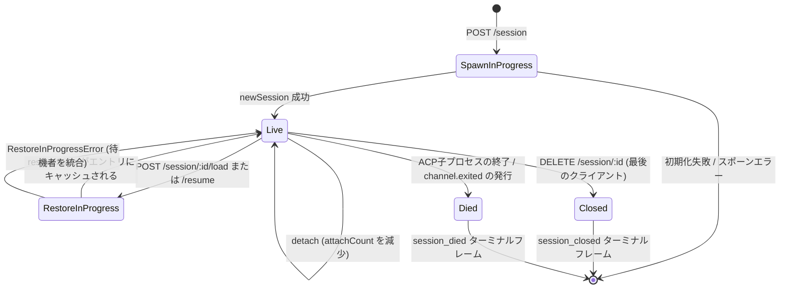

# セッションライフサイクルとID

## 概要

デーモンの**セッション**は、1つのACP `sessionId` に紐付けられた1つの論理的な会話です。ブリッジはセッションごとに `SessionEntry` を維持し（[`03-acp-bridge.md`](./03-acp-bridge.md) を参照）、ACP子プロセス接続とHTTP側の状態管理（プロンプトFIFO、モデル変更FIFO、イベントバス、保留中の権限、アタッチされたクライアント、ハートビート、復元状態、ターミナルフレームのトームストーン）を結合します。

デーモンの**クライアント**は `X-Qwen-Client-Id` によって識別されます。これは、HTTP呼び出し元がリクエストに付与する、デーモンによって検証される不透明な文字列です。ブリッジはどのクライアントがどのセッションにアタッチされているかを追跡し、発信元クライアントIDを使用して `designated` 権限ポリシー、監査証跡、およびイベントの属性付けを制御します。

本ドキュメントでは、すべてのセッションライフサイクルの遷移（create / attach / load / resume / close / die / evict）と、デーモンが公開するすべてのID関連インターフェースについて説明します。

## 責務

- セッションの作成、アタッチ、復元、および回収。
- `X-Qwen-Client-Id` を検証し、不正な形式のIDを拒否する。
- セッションごとに複数のアタッチされたクライアントを追跡する（`clientIds: Map<string, count>`、`attachCount`）。
- 送信イベントに `originatorClientId` を付与する。
- ダッシュボードでどのクライアントがまだ接続されているかを把握できるようにハートビートを実行する。
- オペレーターが `PATCH /session/:id/metadata` を介して設定するセッションメタデータ（`displayName`）を公開する。
- ターミナルフレームの発行（`session_died`、`session_closed`、`client_evicted`、`stream_error`）を制御する。

## アーキテクチャ

| 懸念事項                   | ソース                                                       | 備考                                                                                     |
| ------------------------- | ------------------------------------------------------------ | ----------------------------------------------------------------------------------------- |
| `SessionEntry`            | `packages/acp-bridge/src/bridge.ts`                          | セッションごとの構造体。全フィールド一覧は [`03-acp-bridge.md`](./03-acp-bridge.md) を参照。  |
| `BridgeSession` (public)  | `packages/acp-bridge/src/bridgeTypes.ts`                     | HTTPハンドラに返される `{ sessionId, workspaceCwd, attached, clientId?, createdAt? }`。 |
| `BridgeSessionState`      | `packages/acp-bridge/src/bridgeTypes.ts`                     | エントリに `restoreState` としてキャッシュされる `LoadSessionResponse \| ResumeSessionResponse`。     |
| `DaemonSession` (SDK)     | `packages/sdk-typescript/src/daemon/types.ts`                | `{ sessionId, workspaceCwd, attached, clientId?, createdAt? }`。                           |
| Client-id validation      | `packages/acp-bridge/src/bridge.ts` (around `spawnOrAttach`) | パターン `[A-Za-z0-9._:-]{1,128}`。不正な形式の場合は `InvalidClientIdError`。                    |
| Session disconnect-reaper | `packages/cli/src/serve/server.ts`                           | `attachCount` + `spawnOwnerWantedKill` を使用して、スポーンオーナーの切断を追跡する。               |

### 状態マシン

```mermaid
stateDiagram-v2
    [*] --> SpawnInProgress: POST /session
    SpawnInProgress --> Live: newSession 成功
    SpawnInProgress --> [*]: 初期化失敗 / スポーンエラー
    Live --> Live: attach (sessionScope=single、attachCount を増加)
    Live --> Live: detach (attachCount を減少)
    Live --> RestoreInProgress: POST /session/:id/load または /resume
    RestoreInProgress --> Live: restoreState がエントリにキャッシュされる
    RestoreInProgress --> Live: RestoreInProgressError (待機者を統合)
    Live --> Closed: DELETE /session/:id (最後のクライアント)
    Live --> Died: ACP子プロセスの終了 / channel.exited の発行
    Closed --> [*]: session_closed ターミナルフレーム
    Died --> [*]: session_died ターミナルフレーム
```

### アタッチ vs スポーン

`sessionScope: 'single'`（デフォルト）では、ブリッジの `defaultEntry` は接続するすべてのクライアントで共有されます。`defaultEntry` が既に存在する状態で `POST /session` が到着した場合、新しいACP子プロセスをスポーンせずに `attached: true` を返します。ブリッジは同期的に `attachCount` を増加させ、呼び出し元の `X-Qwen-Client-Id` を `clientIds` に登録します。

`sessionScope: 'thread'` では、各スレッドが個別のセッションを作成できます。呼び出し元は引き続き `maxSessions` を遵守する必要があります。

### ID

`X-Qwen-Client-Id` は**任意**ですが、**強く推奨**されます。デーモンは呼び出し元に代わってこれを生成しません。クライアントは自分で選択し、リクエスト間で再利用することで、デーモンが投票の属性付け、イベントの監査、再接続の検出を行えるようにします。

検証ルール:

- 文字セット: `[A-Za-z0-9._:-]`。
- 長さ: 1〜128。
- このセット外: `InvalidClientIdError` (`400`)。

デーモンは、以下の条件を満たす場合に送信SSEイベントへ `originatorClientId` を付与します。

1. イベントをトリガーしたリクエストに `X-Qwen-Client-Id` が含まれており、かつ
2. そのIDが現在セッションの `clientIds` セットに登録されており、かつ
3. セッションに `activePromptOriginatorClientId` が設定されている（インラインの `sessionUpdate` と `permission_request` は、アクティブなプロンプトから発信元を継承します）。

匿名の呼び出し元（`X-Qwen-Client-Id` なし）は `first-responder` ポリシーで正常に動作します。`designated` は `permission_forbidden{ reason: 'designated_mismatch' }` で投票を拒否します。`consensus` は、投票者が発行時の `votersAtIssue` スナップショットに含まれていないため、同じ `forbidden` 理由で拒否します。匿名のループバック投票者を受け入れる唯一のポリシーは `local-only` です。

## ワークフロー

### 作成またはアタッチ

```mermaid
sequenceDiagram
    autonumber
    participant C as Client
    participant R as POST /session
    participant B as Bridge.spawnOrAttach
    participant CH as ACP child

    C->>R: POST /session<br/>X-Qwen-Client-Id: alice<br/>{cwd, sessionScope?}
    R->>R: clientId パターンの検証
    R->>B: spawnOrAttach({cwd, sessionScope, clientId})
    alt single スコープ + defaultEntry が存在
        B->>B: attachCount を増加; clientId を登録
        B-->>R: {sessionId, attached: true, restoreState?}
    else cold
        B->>CH: spawn + ACP initialize + newSession
        CH-->>B: sessionId
        B->>B: SessionEntry を構築; byId に登録
        B-->>R: {sessionId, attached: false}
    end
    R-->>C: 200 { sessionId, attached, ... }
```

### ロード / 再開

`POST /session/:id/load` — 永続化されたセッションを復元し、現在のバウンドされたリプレイスナップショットウィンドウを返します（`session/load` 通知またはレスポンスモードのリプレイは、レスポンスが返る前にシードされます）。
`POST /session/:id/resume` — リプレイなしで復元します（`connection.unstable_resumeSession`。安定版の `session_resume` デーモンケーパビリティの下で公開されます。`unstable_session_resume` は非推奨のエイリアスとして残っています）。

両者とも:

1. チャネル上のセッションごとの `pendingRestoreIds` セットを使用して、並行する復元呼び出しを統合します（`RestoreInProgressError`）。
2. エントリに `restoreState` をキャッシュし、後からアタッチするクライアントが元の復元者と同じペイロードを取得できるようにします。

### ハートビート

`POST /session/:id/heartbeat` は `clientId` に関係なく `sessionLastSeenAt` を更新します。リクエストに登録済みの `X-Qwen-Client-Id` が含まれている場合、`clientLastSeenAt.set(clientId, Date.now())` も更新されます。クライアントごとのエビクトはv1では**実装されていません**。取り消しはF-series Wave 5で予定されています。現在、ハートビートはダッシュボードと、PR 24で予定されている今後の取り消しポリシーに対する可観測性を提供します。

### メタデータ

`PATCH /session/:id/metadata` は `{displayName?}` を受け付けます。検証:

- 最大長: `MAX_DISPLAY_NAME_LENGTH = 256`。
- 制御文字を含めてはなりません（`hasControlCharacter` はコードポイント ≤ 0x1f または == 0x7f を拒否します）。
- 違反した場合は `InvalidSessionMetadataError` (`400`)。

更新が成功すると、`session_metadata_updated` がすべてのサブスクライバーに配信されます。

### 終了

| ターミナルフレーム   | トリガー                                                                                                                                                       |
| ---------------- | ------------------------------------------------------------------------------------------------------------------------------------------------------------- |
| `session_closed` | `DELETE /session/:id`（client_close）またはプログラムによるクローズ。                                                                                                   |
| `session_died`   | 何らかの理由（クラッシュ、子プロセスのキル）で `channel.exited` が発行される。OSの終了パスが使用された場合は `exitCode?` + `signalCode?` を含みます。                                |
| `client_evicted` | EventBusでのサブスクライバーごとのキューオーバーフロー（[`10-event-bus.md`](./10-event-bus.md) を参照）。セッションレベルの終了ではなく、このサブスクライバーのみがクローズされます。 |
| `stream_error`   | SubscriberLimitExceededError またはその他のルートレベルのストリーム障害。                                                                                             |

保留中の権限は、すべての終了パスで `mediator.forgetSession(sessionId)` を介して `{kind:'cancelled', reason:'session_closed'}` として解決されます。

### 切断レパーガード

スポーンを所有するクライアントのHTTPレスポンスを書き込めない場合（ハンドシェイク中にTCPリセットが発生した場合など）、ルートは `killSession({ requireZeroAttaches: true })` を呼び出します。他のクライアントがすでにアタッチされている場合（`attachCount > 0`）、ガードはショートサーキットし、セッションは存続します。`spawnOwnerWantedKill = true` を設定すると意図が保持されるため、後で `attachCount` を 0 に戻す `detachClient()` が遅延回収を完了します。これがなければ、高速に切断されるスポーンオーナーは、再接続のたびに正常なセッションを破棄してしまうことになります。

## 状態とライフサイクル

ライフサイクルに重要な `SessionEntry` フィールド:

| フィルダ                            | 型                  | 意味                                                                          |
| -------------------------------- | --------------------- | -------------------------------------------------------------------------------- |
| `clientIds`                      | `Map<string, number>` | 登録済みクライアントID → 登録参照カウント。                                  |
| `attachCount`                    | `number`              | このエントリに対して `spawnOrAttach` が `attached: true` を返した回数。                  |
| `activePromptOriginatorClientId` | `string?`             | 現在実行中のプロンプトの発信元。                                     |
| `restoreState`                   | `BridgeSessionState?` | 遅れてアタッチするクライアントが一貫したペイロードを参照できるようにキャッシュされた load/resume レスポンス。           |
| `spawnOwnerWantedKill`           | `boolean`             | 遅延回収のトームストーン（上記のdisconnect-reaperを参照）。                           |
| `sessionLastSeenAt`              | `number?`             | 任意のクライアントからの最新のハートビート（エポックミリ秒）。                              |
| `clientLastSeenAt`               | `Map<string, number>` | クライアントごとのハートビート。                                                            |
| `pendingPermissionIds`           | `Set<string>`         | 現在保留中のACP requestIds。キャンセル/クローズ時に cancelled として解決するために使用されます。 |

## 依存関係

- ACPレイヤー: `connection.newSession`、`connection.unstable_resumeSession`、`connection.loadSession`。
- 周辺のブリッジアーキテクチャについては [`03-acp-bridge.md`](./03-acp-bridge.md) を参照。
- 発信元 + ID がどのようにポリシー決定を駆動するかについては [`04-permission-mediation.md`](./04-permission-mediation.md) を参照。
- ターミナルフレームの配信については [`10-event-bus.md`](./10-event-bus.md) を参照。

## 追加のセッションエンドポイント

これらのエンドポイントは基本のライフサイクルインターフェースを拡張します:

### ノンブロッキングプロンプト（`non_blocking_prompt` 機能タグ）

`POST /session/:id/prompt` は、プロンプトが完了するまでブロックするのではなく、`{ promptId, lastEventId }` を含むHTTP **202** を返すようになりました。実際の結果はSSE上で `turn_complete` / `turn_error` として到着し、`promptId` フィールドがそれらのイベントと202レスポンスを関連付けます。`DaemonSessionClient.prompt()` は、アクティブなイベントサブスクリプションを持っている場合に自動的にノンブロッキングパスを使用し、SSEストリームからの結果を透過的にマッチングします。

### セッションリキャップ（`session_recap` 機能タグ）

`POST /session/:id/recap` は、高速モデルに対して「どこまでやったか」を要約した1行のサマリーを要求します。これは `{ sessionId, recap: string | null }` を返します。`null` は履歴が短すぎるか、モデルが一時的に失敗したことを意味します。このエンドポイントはベストエフォート型です。
### Session BTW / 追加質問 (`session_btw` capability tag)

`POST /session/:id/btw` は、メインの会話フローを中断することなく、セッションコンテキストに対して一度限りの質問を行います。これはキャッシュパス上で `runForkedAgent` を使用して、ツールを使用しないシングルターンの LLM 呼び出しを行い、`{ sessionId, answer: string | null }` を返します。実装では `BTW_MAX_INPUT_LENGTH`、セッション間漏洩ガード、およびタイムアウト処理が強制されます。

### シェルコマンドの実行

`POST /session/:id/shell` は、LLM を経由せずにデーモンホスト上で直接シェルコマンドを実行し、LLM を経由しません。`user_shell_command` / `user_shell_result` イベントを介してセッション SSE バス上で出力をストリーミングし、コマンドと結果を LLM の会話履歴に注入します。レスポンスは `{ exitCode, output, aborted }` です。ライブのセカンダリワークスペースセッションの場合、単一の REST ルートはセッションオーナーを解決し、そのランタイムのブリッジ上で実行するため、コマンドは所有ワークスペースの cwd で開始されます。このルートはパスサンドボックスを提供しません。ワークスペース限定の ACP クライアントは、所有ワークスペース接続上で `_qwen/session/shell` を引き続き使用できます。

### セッションの rewind

`GET /session/:id/rewind/snapshots` と `POST /session/:id/rewind` は、所有するライブワークスペースランタイムを解決します。永続化されたセッションは、rewind 前にロードまたは再開する必要があります。Rewind は会話履歴を切り詰め、`edit` と `write_file` によって追跡されたファイルを選択的に復元します。シェルコマンド、Git、スクリプト、または手動の変更は元に戻しません。ファイルの復元はベストエフォート型のため、レスポンスは会話履歴がすでに移動した後でも `rewound: false` と `filesFailed[]` を報告する可能性があります。SDK の rewind 呼び出しは、クライアントがそうでない場合でも ACP トランスポートを使用している場合でも、常にオーナー認識 REST を使用します。これは、ミューテーションが厳格な REST 認証を保持する必要があるためです。

### セッションのデタッチ

`POST /session/:id/detach` は、`attachCount` をデクリメントすることで、クライアントをセッションから明示的にデタッチします。これ単体ではセッションを閉じません。他のアタッチやサブスクライバーが残っていない場合、セッションは回収（reap）されます。エンドポイントは 204 を返します。

### セッションの一括削除

`POST /sessions/delete` は `{ sessionIds: string[] }`（最大 100 個の ID）を受け取り、ブリッジセッションを閉じて、アクティブまたはアーカイブされたトランスクリプトファイルを削除します。同じ ID に対してアクティブな JSONL ファイルとアーカイブされた JSONL ファイルの両方が存在する場合、ハード削除は両方を削除するため、オペレーターは競合を解消できます。アクティブおよびアーカイブされたワークツリーのサイドカーをクリーンアップしますが、ファイル履歴のスナップショット、サブエージェントのトランスクリプト、およびランタイムのサイドカーはそのまま残します。回復力のために `Promise.allSettled` を使用し、`{ removed, notFound, errors }` を返します。

### セッションのアーカイブ

`POST /sessions/archive` は、非アクティブなセッションの JSONL ファイルを `chats/` から `chats/archive/` に移動します。対象のセッションがライブの場合、デーモンはまずセッションごとのアーカイブゲートに入り、ACP 子プロセスが `ChatRecordingService` をフラッシュする必要がある厳格なクローズを実行します。クローズまたはフラッシュが失敗した場合、アーカイブは JSONL をそのまま残します。

`POST /sessions/unarchive` は、アーカイブされた JSONL ファイルを `chats/` に戻します。これはストレージ状態の遷移に過ぎないため、クライアントはその後 `session/load` または `session/resume` を呼び出す必要があります。アーカイブされたセッションは load/resume に対して `409 session_archived` を返し、アーカイブ遷移と競合するミューテーションは `409 session_archiving` を返します。

### コンテキスト使用量 (`session_context_usage` capability tag)

`GET /session/:id/context-usage` は構造化されたコンテキストウィンドウの使用量を返します。`?detail=true` は、ツール、メモリ、およびスキルごとにグループ化された、より詳細な使用量を含みます。

### セッション統計 (`session_stats` capability tag)

`GET /session/:id/stats` は使用統計を返します。モデルメトリクス（入出力トークン、キャッシュの読み書き、総コスト）、ツールごとの呼び出し回数とレイテンシ、ファイル編集回数、およびライブセッションのスキルごとの呼び出し回数です。`skills` ブロックは、このセッション内のスキル本体のロードとスキルスラッシュコマンドのみを反映し、セッションをまたいだアクティビティの集計ではありません。

### セッションタスク (`session_tasks` capability tag)

`GET /session/:id/tasks` は、エージェントタスク、シェルタスク、モニタータスク、およびそれらのライフサイクル状態のバックグラウンドタスクのスナップショットを返します。別のサブエージェントによって生成されたエージェントエントリには、オプションの系統フィールド（`parentAgentId`、`parentName`、`depth`）が含まれるため、クライアントはネストされたサブエージェントをツリーとしてレンダリングできます。ペイロードの例は `qwen-serve-protocol.md` を参照してください。

`session_monitor_tool_correlation` ケーパビリティは、モニターエントリが `toolUseId` を持つことを追加で保証し、クライアントがトランスクリプトのツール呼び出しとそのタスク詳細を関連付けられるようにします。

### セッション LSP ステータス (`session_lsp` capability tag)

`GET /session/:id/lsp` は、daemon クライアント向けにサニタイズされたセッションごとの LSP ステータスを返します。これには、有効化状態、集計されたサーバー数、利用不可/初期化状態、およびサーバーごとの `name`、`status`、`languages`、`transport`、`command`、`error` が含まれます。無効または利用不可の LSP は、トランスポートエラーではなく HTTP 200 のステータスデータとして表現されます。

### コンパクトリプレイ

`POST /session/:id/load` は、`compactedReplay?: BridgeEvent[]`、`liveJournal?: BridgeEvent[]`、および `lastEventId?: number` を含むことができる `BridgeRestoredSession` を返すようになりました。これらのフィールドは、ライブセッションのためのデーモンのバウンドされたインメモリリプレイウィンドウであり、完全なトランスクリプト API ではありません。デフォルトのウィンドウキャップはライブセッションあたり 4 MiB（`--compacted-replay-max-bytes`）で、起動は無効なキャップを拒否します。ハード上限は 256 MiB です。`compactedReplay` は `TurnBoundaryCompactionEngine` によって生成されます。ターンの境界で、連続するテキスト/思考ブロックを折りたたみ、ツール呼び出しシーケンスを最終状態に圧縮し、一時的なシグナルを破棄して、O(tokens) ログではなく O(turns) リプレイログを生成します（通常 25〜30 倍の削減）。古いリプレイエントリがそのバイトウィンドウから削除された場合、`compactedReplay[0]` は合成の ID なし `history_truncated` マーカーであり、`{reason: 'replay_window_exceeded', truncatedEvents, retainedEvents, maxBytes, truncatedTurns?, fullTranscriptAvailable: boolean}` を持ちます。`fullTranscriptAvailable` はケーパビリティフラグです。`true` はクライアントが `GET /session/:id/transcript` で完全な永続化トランスクリプトをページングできることを意味し、`false` はバウンドされたリプレイのみが利用可能であることを意味します。クライアントはそれをステータスとしてレンダリングし、保持されたリプレイを通常通り適用する必要があります。再同期ループをトリガーしてはなりません。

### ACP 子プロセスのプレヒート

`bridge.preheat()` は、最初のセッションの前に ACP 子プロセスをウォームアップし、最初の本セッションでコールドスタートのレイテンシを回避します。これは、最後のセッションが閉じた後も ACP 子プロセスを存続させる `channelIdleTimeoutMs` と、新しいセッションが到着したときにすでにアイドル状態の子プロセスを再利用する skip-relaunch 動作と組み合わせて使用されます。

### ステートレス生成（`session_generation` ケーパビリティタグ）

`POST /session/:id/generate` は `{ "prompt": string }` を受け取り、`started`、オプションの `thinking`、`delta`、`done`、または `error` イベントを含むリクエストスコープの SSE ストリームを返します。リクエストは会話履歴を読み取らず、ターンを記録せず、ツールを公開しません。ACP 子プロセスは、有効な設定済みの高速モデルが利用可能な場合はそれを使用し、そうでない場合はセッションのメインモデルを使用します。

## 設定

- `BridgeOptions.maxSessions`（デフォルト 32）— 上限。
- `BridgeOptions.sessionScope`（デフォルト `'single'`、オプションで `'thread'`）。
- `BridgeOptions.initializeTimeoutMs`（デフォルト 10s）— ACP `initialize` ハンドシェイク。
- `BridgeOptions.sessionRestoreTimeoutMs`（デフォルト 60s）— ACP `loadSession` / `unstable_resumeSession` のデッドライン。デフォルトは 60 秒で、明示的に設定された initialize タイムアウトはこれを上げることができますが、下げることはできません。
- `BridgeOptions.channelIdleTimeoutMs`（デフォルト 0、ACP 子プロセスを即座に回収）。
- Capability tags: `session_create`, `session_id_override`, `session_scope_override`, `session_load`, `session_resume`, `unstable_session_resume`（非推奨のエイリアス）, `session_list`, `session_info`, `session_close`, `session_metadata`, `session_set_model`, `client_identity`, `client_heartbeat`, `session_recap`, `session_generation`, `session_btw`, `session_context_usage`, `session_tasks`, `session_monitor_tool_correlation`, `session_stats`, `session_lsp`, `session_status`, `non_blocking_prompt`.

## 注意事項と既知の制限

- `connection.unstable_resumeSession` は ACP レイヤーではまだ不安定な場合がありますが、daemon は `session_resume` でコミットされた v1 ルート契約を公開します。`unstable_session_resume` は、非推奨の互換性エイリアスとしてのみ保持されています。
- v1 には**クライアントごとのエビクションはありません**。セッションごとおよびサブスクライバーごとの終了のみです。取り消しポリシーは F-series Wave 5 / PR 24 です。
- `client_evicted` はセッションごとではなくサブスクライバーごとです。SSE サブスクライバーがエビクトされたクライアントは再接続できます。
- 匿名クライアント（`X-Qwen-Client-Id` なし）は、`designated` または `consensus` ポリシーの下で投票できません。

## 参照

- `packages/acp-bridge/src/bridge.ts`（SessionEntry の定義）
- `packages/acp-bridge/src/bridgeTypes.ts`（`HttpAcpBridge`、`BridgeSession`、`BridgeSessionState`）
- `packages/sdk-typescript/src/daemon/types.ts`（`DaemonSession`）
- `packages/sdk-typescript/src/daemon/DaemonSessionClient.ts`
- Wire 参照: [`../qwen-serve-protocol.md`](../qwen-serve-protocol.md)（ルートカタログ）。