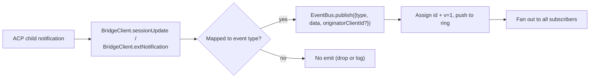
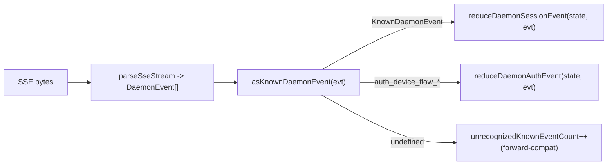

# 型付きデーモンイベントスキーマ v1

## 概要

`GET /session/:id/events` でデーモンから出力されるすべての SSE フレームは、`{ id, v, type, data, originatorClientId?, _meta? }` の形状を持ちます。`v: 1` は現在の `EVENT_SCHEMA_VERSION` です。`type` は `packages/sdk-typescript/src/daemon/events.ts` にある閉じたバージョン固定の `DAEMON_KNOWN_EVENT_TYPE_VALUES` セットから取得されます。現在のセットには 47 種類の既知のイベントタイプがあります。エンベロープの `_meta` フィールドは、`packages/cli/src/serve/routes/sse-events.ts` の `formatSseFrame()` によって SSE 書き込み境界でスタンプされます。[Envelope-level metadata](#envelope-level-metadata) を参照してください。

SDK は `asKnownDaemonEvent(evt)` を公開しています。これは既知のイベントタイプに対しては判別共用体 `KnownDaemonEvent` を返し、その他のタイプに対しては `undefined` を返します。したがって、SDK コンシューマーは、新しいデーモンがイベントタイプを追加した際に、SDK の同期アップグレードを必要とせずに前方互換性を処理できます。セッションリデューサーはそれらを `unrecognizedKnownEventCount` として記録します。

ワイヤーフォーマットは [`../qwen-serve-protocol.md`](../qwen-serve-protocol.md) にあります。このページは各イベントのペイロード契約です。

## 責務

- イベント語彙（`DAEMON_KNOWN_EVENT_TYPE_VALUES`）の唯一の信頼できる情報源を提供する。
- 各イベントタイプに対して型付きエンベロープ（`DaemonEventEnvelope<TType, TData>`）を提供する。
- イベントストリームを SDK ビュー状態に射影する純粋なリデューサー（`reduceDaemonSessionEvent`、`reduceDaemonAuthEvent`）を提供する。
- 情報シグナルとして `typed_event_schema` ケーパビリティタグをブロードキャストする。タグが存在しない場合でも、`asKnownDaemonEvent` は `unknown` にフォールバックする。

## イベント語彙（47 の既知タイプ）

ドメイン別にグループ化されています。

### コアセッション

| タイプ                     | 方向           | トリガー                                                                        | 主要なペイロードフィールド                                                             |
| -------------------------- | -------------- | ------------------------------------------------------------------------------- | -------------------------------------------------------------------------------------- |
| `session_update`           | S->C           | 任意の ACP `sessionUpdate` 通知: エージェントテキスト、思考、ツール呼び出し、またはプラン | `sessionUpdate: string, content?: ...`（不透明な ACP 形状）                            |
| `session_metadata_updated` | S->C           | `PATCH /session/:id/metadata`                                                   | `sessionId, displayName?`                                                              |
| `session_died`             | S->C 終端      | `channel.exited`                                                                | `sessionId, reason, exitCode? \| null, signalCode? \| null`                            |
| `session_closed`           | S->C 終端      | `DELETE /session/:id` またはプログラムによるクローズ                            | `sessionId, reason: 'client_close' \| string, closedBy?`                               |
| `session_snapshot`         | S->C 合成      | SSE アタッチ / リプレイ後のスナップショットフレーム                             | `sessionId, currentModelId: string \| null, currentApprovalMode: string \| null`       |

### サブスクライバーレベルの合成フレーム

| タイプ                    | トリガー                                                                                                                                                                                                                             | 備考                                                                                                                                                                                                                                                                                                                         |
| ------------------------- | ------------------------------------------------------------------------------------------------------------------------------------------------------------------------------------------------------------------------------------ | ---------------------------------------------------------------------------------------------------------------------------------------------------------------------------------------------------------------------------------------------------------------------------------------------------------------------------- |
| `client_evicted`          | サブスクライバーごとの EventBus キューオーバーフロー。**`id` なし**                                                                                                                                                                  | `reason: string, droppedAfter?: number`。現在のサブスクライバーに対してのみ終端となり、セッション自体は存続する。                                                                                                                                                                                                              |
| `slow_client_warning`     | キュー >= 75%。強制プッシュされ、**`id` を持たない**                                                                                                                                                                                 | `queueSize, maxQueued, lastEventId`。キューが 37.5% 未満に低下した後に再設定される。                                                                                                                                                                                                                                         |
| `stream_error`            | `SubscriberLimitExceededError` または別のルートストリームエラー                                                                                                                                                                      | `error: string`。サブスクリプションに対して終端となる。                                                                                                                                                                                                                                                                      |
| `state_resync_required`   | `subscribe({lastEventId})` が、デーモンリングが `[lastEventId+1, earliestInRing-1]` を保持しなくなったこと、またはクライアントカーソルが前のバスエポックのものであることを検出する。残りのリプレイフレームの**前**に強制プッシュされ、**`id` を持たない**。 | `reason: 'ring_evicted' \| 'epoch_reset' \| string`、`lastDeliveredId: number`、`earliestAvailableId: number`。これは終端ではなくリカバリーシグナルである。SSE ストリームはオープンされたままとなり、リプレイとライブフレームが継続する。SDK リデューサーは `awaitingResync = true` を設定し、呼び出し元が `loadSession` でリセットするまでデルタをスキップする。 |
| `replay_complete`         | `Last-Event-ID` リプレイループが終了した後に発行される ID なしセンチネル。クリーンなリプレイとリングエビクトパスの両方に対して、`data.replayedCount === 0` の場合でも発行される。**`id` なし**                                                             | `replayedCount: number`。コンシューマーがタイムアウトなしでキャッチアップ UI を確定的に削除できるようにする。                                                                                                                                                                                                                  |

### 権限（F3 + base）

| タイプ                          | 方向 | トリガー                                           | 主要なペイロードフィールド                                                                                                                               |
| ------------------------------- | ---- | -------------------------------------------------- | -------------------------------------------------------------------------------------------------------------------------------------------------------- |
| `permission_request`            | S->C | エージェントが `requestPermission` を呼び出す      | `requestId, sessionId, toolCall, options[]`。エンベロープはプロンプト発信元からの `originatorClientId` をスタンプする。                                  |
| `permission_resolved`           | S->C | メディエーターが決定した                           | `requestId, outcome`（ACP `PermissionOutcome`）                                                                                                          |
| `permission_already_resolved`   | S->C | リクエストがすでに決定された後に投票が到着した     | `requestId, sessionId, outcome`                                                                                                                          |
| `permission_partial_vote`       | S->C | `consensus` ポリシーが非最終投票を記録する         | `requestId, sessionId, votesReceived, votesNeeded (>= 1), quorum, optionTallies: Record<string, number>, originatorClientId?`                            |
| `permission_forbidden`          | S->C | ポリシーが投票を拒否する                           | `requestId, sessionId, clientId?, reason: 'designated_mismatch' \| 'remote_not_allowed', originatorClientId?`。匿名投票者は `clientId` を省略する。      |

### モデル

| タイプ                | 方向 | ペイロード                                     |
| --------------------- | ---- | ---------------------------------------------- |
| `model_switched`      | S->C | `sessionId, modelId`                           |
| `model_switch_failed` | S->C | `sessionId, requestedModelId, error: string`   |

### MCP ガードレール（PR 14b + F2）

| タイプ                         | 方向 | ペイロード                                                                                                                                                                                                                                                                                                                                                                                                                                           |
| ------------------------------ | ---- | ---------------------------------------------------------------------------------------------------------------------------------------------------------------------------------------------------------------------------------------------------------------------------------------------------------------------------------------------------------------------------------------------------------------------------------------------------- |
| `mcp_budget_warning`           | S->C | `liveCount, reservedCount, budget, thresholdRatio: 0.75, mode: 'warn' \| 'enforce', scope?: 'workspace' \| 'session'`                                                                                                                                                                                                                                                                                                                                |
| `mcp_child_refused_batch`      | S->C | `refusedServers: [{ name, transport, reason: 'budget_exhausted' }], budget, liveCount, reservedCount, mode: 'enforce', scope?: 'workspace' \| 'session'`                                                                                                                                                                                                                                                                                             |
| `mcp_server_restarted`         | S->C | `serverName, durationMs, entryIndex?`（F2 マルチエントリプール再起動用）                                                                                                                                                                                                                                                                                                                                                                             |
| `mcp_server_restart_refused`   | S->C | `serverName, reason: 'budget_would_exceed' \| 'in_flight' \| 'disabled' \| 'restart_failed', entryIndex?, details?`。4番目の値 `restart_failed` は、プールモードのマルチエントリ再起動における根本的なハード障害を伝える。`MCP_RESTART_REFUSED_REASONS` は未知の理由を拒否する。古い SDK リデューサーは、`parseDaemonEvent` が `undefined` を返すため、追加された新しい理由の値をサイレントに破棄する。新しい理由を認識する SDK とともにリリースすること。 |

### 変更制御（Wave 4 PR 16+17）

| タイプ                     | 方向 | ペイロード                                                                                                                         |
| -------------------------- | ---- | ---------------------------------------------------------------------------------------------------------------------------------- |
| `memory_changed`           | S->C | `scope: 'workspace' \| 'global', filePath, mode: 'append' \| 'replace', bytesWritten`                                              |
| `agent_changed`            | S->C | `change: 'created' \| 'updated' \| 'deleted', name, level: 'project' \| 'user'`                                                    |
| `approval_mode_changed`    | S->C | `sessionId, previous, next, persisted: boolean`                                                                                    |
| `tool_toggled`             | S->C | `toolName, enabled`。次の ACP 子プロセスの生成に影響し、すでに実行中のセッションは変更しない。                                     |
| `settings_changed`         | S->C | ワークスペース設定の書き込みが完了した。ペイロードはオープンである。コンシューマーは read-after-write でリフレッシュする必要がある。 |
| `settings_reloaded`        | S->C | デーモンワークスペースサービスが設定を再読み込みした。ペイロードはオープンである。                                                 |
| `trust_change_requested`   | S->C | `workspaceCwd, desiredState: 'trusted' \| 'untrusted', reason?`                                                                    |
| `workspace_initialized`    | S->C | `path, action: 'created' \| 'overwrote' \| 'noop', originatorClientId?`                                                            |
| `github_setup_completed`   | S->C | `releaseTag, readmeUrl, secretsUrl?, workflows: [{path, status, sizeBytes?, error?}], gitignore: {path, status, added?, error?}`   |

### 認証デバイスフロー（PR 21）

これらのイベントはセッションキーではなくワークスペースキーです。セッションリデューサーはこれらを no-op として扱います。`reduceDaemonAuthEvent` はこれらをワークスペースレベルの状態に射影します。

| タイプ                          | 方向 | ペイロード                                            |
| ------------------------------- | ---- | ----------------------------------------------------- |
| `auth_device_flow_started`      | S->C | `deviceFlowId, providerId, expiresAt`                 |
| `auth_device_flow_throttled`    | S->C | `deviceFlowId, intervalMs`                            |
| `auth_device_flow_authorized`   | S->C | `deviceFlowId, providerId, expiresAt?, accountAlias?` |
| `auth_device_flow_failed`       | S->C | `deviceFlowId, errorKind, hint?`                      |
| `auth_device_flow_cancelled`    | S->C | `deviceFlowId`                                        |

### MCP ランタイム変更

| タイプ                 | 方向 | トリガー                                                        | 主要なペイロードフィールド                                                         |
| ---------------------- | ---- | --------------------------------------------------------------- | ---------------------------------------------------------------------------------- |
| `mcp_server_added`     | S->C | `POST /workspace/mcp/servers` 経由でランタイムにサーバーが追加された | `name, transport, replaced, shadowedSettings, toolCount, originatorClientId`       |
| `mcp_server_removed`   | S->C | ランタイムにサーバーが削除された                                | `name, wasShadowingSettings, originatorClientId`                                   |

### 拡張機能ライフサイクル

| タイプ                 | 方向 | トリガー                                                               | 主要なペイロードフィールド                                                                                                                               |
| ---------------------- | ---- | ---------------------------------------------------------------------- | -------------------------------------------------------------------------------------------------------------------------------------------------------- |
| `extensions_changed`   | S->C | バックグラウンドでの拡張機能のインストール/更新作業が完了した、またはステータスが変更された | `refreshed, failed, status?: 'installed' \| 'enabled' \| 'disabled' \| 'updated' \| 'uninstalled' \| 'failed', source?, name?, version?, error?`         |

### ターン中メッセージ挿入

| タイプ                        | 方向 | トリガー                                                                                          | 主要なペイロードフィールド                                                                                                                 |
| ----------------------------- | ---- | ------------------------------------------------------------------------------------------------- | ------------------------------------------------------------------------------------------------------------------------------------------ |
| `mid_turn_message_injected`   | S->C | Web シェルまたはリモートクライアントが `POST /session/:id/inject` 経由で実行中のターンにメッセージを挿入した | `sessionId, messages: string[], originatorClientId?`。コンシューマーは重複排除の前に `originatorClientId` を自身の ID と比較**しなければならない**。 |

### ターンライフサイクル / アシスタントプッシュ

| タイプ                | 方向 | トリガー                                                                                                              | 主要なペイロードフィールド                                                                                                                                                                             |
| --------------------- | ---- | --------------------------------------------------------------------------------------------------------------------- | ------------------------------------------------------------------------------------------------------------------------------------------------------------------------------------------------------ |
| `prompt_cancelled`    | S->C | 明示的な `cancelSession` ルート**または**発信元 SSE 切断によってプロンプトがキャンセルされた                          | エンベロープはキャンセルしたクライアントの `originatorClientId` をスタンプする。これは「キャンセルが要求された」ことを意味し、「キャンセルが確定した」ことではない。ピアサブスクライバーはプロンプトが終了したことを知る。 |
| `turn_complete`       | S->C | ターンが正常に完了した                                                                                                | `sessionId, stopReason, promptId?`。`promptId` はノンブロッキングプロンプトレスポンス（`202`）にリンクする。SDK はこれを通じて SSE イベントを発信元プロンプトと照合する。                              |
| `turn_error`          | S->C | ターンが失敗した                                                                                                      | `sessionId, message, code?, promptId?`。同じ `promptId` 相関メカニズム。                                                                                                                               |
| `session_rewound`     | S->C | `POST /session/:id/rewind` が成功した                                                                                 | `sessionId, promptId, targetTurnIndex, filesChanged[], filesFailed[], originatorClientId?`                                                                                                             |
| `session_branched`    | S->C | `POST /session/:id/branch` が既存のセッションからブランチを作成した                                                   | `sourceSessionId, newSessionId, displayName, originatorClientId?`                                                                                                                                      |
| `followup_suggestion` | S->C | ACP 子が `end_turn` 後にゴーストテキストのフォローアップ提案を生成し、セッションごとの SSE 経由で転送された           | `sessionId, suggestion, promptId`。ワイヤーは `getFilterReason()===null` の提案のみを運ぶ。クライアントはこれらを入力プレースホルダーのゴーストテキストとしてレンダリングし、次の `sendPrompt` で無効化する。 |
| `user_shell_command`  | S->C | ユーザーが `POST /session/:id/shell` 経由でシェルコマンドを開始した。同じセッション内の他のサブスクライバーにファンアウトされる | `sessionId, command, shellId, originatorClientId?`。型付きの `DaemonXxxData` インターフェースはまだ存在しない。`asKnownDaemonEvent` は `undefined` を返し、UI ノーマライザーはそれをアドホックに解析する。 |
| `user_shell_result`   | S->C | 上記のシェルコマンドの結果                                                                                            | `sessionId, shellId, exitCode, output, aborted`。`user_shell_command` と同じアドホックな解析の注意書きが適用される。                                                                                   |
## アーキテクチャ

| 対象                                 | ソース                                         | 備考                                                                                                               |
| ------------------------------------ | ---------------------------------------------- | ------------------------------------------------------------------------------------------------------------------ |
| `EVENT_SCHEMA_VERSION = 1`             | `packages/acp-bridge/src/eventBus.ts`          | すべてのフレームで送信されます。                                                                                               |
| `DAEMON_KNOWN_EVENT_TYPE_VALUES`       | `packages/sdk-typescript/src/daemon/events.ts` | 47種類のタイプを含む閉じたリスト。                                                                                         |
| `DaemonEventEnvelope<TType, TData>`    | `events.ts`                                    | 汎用エンベロープ。                                                                                                  |
| `DaemonKnownEventType`                 | `events.ts`                                    | `typeof DAEMON_KNOWN_EVENT_TYPE_VALUES[number]`。                                                                   |
| イベントごとのペイロードタイプ                | `events.ts`                                    | ほとんどのイベントタイプには `DaemonXxxData` インターフェースがあります。`user_shell_*` は現在、UIノーマライザーによってアドホックにパースされます。 |
| `asKnownDaemonEvent(evt)`              | `events.ts`                                    | `KnownDaemonEvent \| undefined` を返します。                                                                           |
| `reduceDaemonSessionEvent(state, evt)` | `events.ts`                                    | `DaemonSessionViewState` に射影します。                                                                            |
| `reduceDaemonAuthEvent(state, evt)`    | `events.ts`                                    | `DaemonAuthState` に射影します。                                                                                   |
| `isWorkspaceScopedBudgetEvent(evt)`    | `events.ts`                                    | F2 `scope: 'workspace'` を検出します。                                                                                   |

### `DaemonSessionViewState`

`reduceDaemonSessionEvent` はこのビューステートを埋めます。CLI TUIアダプタ、`DaemonChannelBridge`、およびVS Code IDEがこれを消費します。主要なフィールド:

- `alive: boolean` - ターミナルフレーム（`session_died`、`session_closed`、`client_evicted`、`stream_error`）の後に `false` になります。
- `currentModelId?: string` - `model_switched` から。
- `displayName?: string` - `session_metadata_updated` から。
- `pendingPermissions: Record<string, DaemonPermissionRequestData>` - `requestId` をキーとするオープンなリクエスト。`permission_resolved` / `permission_already_resolved` によってクリアされます。
- `lastSessionUpdate?: DaemonSessionUpdateData` - 最新の `session_update`。
- `lastModelSwitchFailure?: DaemonModelSwitchFailedData` - `model_switch_failed` から。
- `terminalEvent?` - 生のターミナルイベント。
- `streamError?: DaemonStreamErrorData` - 最新の `stream_error` ペイロード。
- `unrecognizedKnownEventCount`, `lastUnrecognizedKnownEvent?` - イベントは `asKnownDaemonEvent` によって認識されましたが、リデューサーにはまだ専用のステートがありません。
- `droppedPermissionRequestCount`, `lastDroppedPermissionRequestId?` - 不正な形式のパーミッションリクエストが pending マップに入れませんでした。
- `unmatchedPermissionResolutionCount`, `lastUnmatchedPermissionResolutionId?` - パーミッション解決に一致する pending リクエストがありませんでした。
- `slowClientWarningCount`, `lastSlowClientWarning?` - `slow_client_warning` から。
- `mcpBudgetWarningCount`, `lastMcpBudgetWarning?` - `mcp_budget_warning` から。
- `mcpChildRefusedBatchCount`, `lastMcpChildRefusedBatch?` - `mcp_child_refused_batch` から。
- `lastWorkspaceMutation?`, `lastWorkspaceMutationType?` - `memory_changed` / `agent_changed` から。
- `approvalMode?`, `approvalModeChangedCount`, `lastApprovalModeChange?` - `approval_mode_changed` から。
- `toolToggleCount`, `lastToolToggle?` - `tool_toggled` から。
- `workspaceInitCount`, `lastWorkspaceInit?` - `workspace_initialized` から。
- `mcpRestartCount`, `lastMcpRestart?` - `mcp_server_restarted` から。
- `mcpRestartRefusedCount`, `lastMcpRestartRefused?` - `mcp_server_restart_refused` から。
- `settings_changed` / `settings_reloaded` - `asKnownDaemonEvent` によって認識されます。セッションリデューサーは専用のビューステートフィールドを維持せず、UIは通常これらをリフレッシュシグナルとして扱います。
- `permissionVoteProgress: Record<string, DaemonPermissionPartialVoteData>` - コンセンサス投票の進捗。
- `forbiddenVotes: DaemonPermissionForbiddenData[]`, `forbiddenVoteCount` - ポリシーによって拒否された投票レコード。最大32件。
- `awaitingResync: boolean` - `state_resync_required` によって設定されます。コンシューマーがビューステートをリセットするとクリアされます。
- `resyncRequiredCount`, `lastResyncRequired?` - 再同期のオブザーバビリティ。
- `lastFollowupSuggestion?: DaemonFollowupSuggestionData` - デーモンによってプッシュされた最新のフォローアップ提案。
- `lastTurnComplete?: DaemonTurnCompleteData` - 最新の成功したターンの完了。
- `lastTurnError?: DaemonTurnErrorData` - 最新のターンエラー。
- `rewindCount`, `lastRewind?`, `lastBranch?` - 最新の巻き戻し / ブランチイベント。

### `DaemonAuthState`

`providerId` ごとに1つのエントリを持ち、`auth_device_flow_*` によって駆動されます。各フローは `{ deviceFlowId, status, providerId, expiresAt?, lastThrottleIntervalMs?, lastError? }` を公開します。

## フロー

### プロデューサー側



### コンシューマー側（SDK）



## エンベロープレベルのメタデータ

各イベントの `data` ペイロードに加えて、デーモンは2つのエンベロープレベルのフィールドにスタンプを押します。

### `_meta.serverTimestamp` - デーモンクロック

`packages/acp-bridge/src/eventBus.ts` の `EventBus.publish()` は、イベントがバスに入る際に `_meta.serverTimestamp` にスタンプを押します。`BridgeEvent` 型は `_meta?: Record<string, unknown>` を含むため、内部デーモンコンシューマーはバスで公開されるすべてのイベントで `_meta` を**確認できます**。`packages/cli/src/serve/routes/sse-events.ts` の `formatSseFrame()` は、`EventBus.publish` をバイパスする合成フレーム（例: `stream_error`）に対してのみフォールバックタイムスタンプを提供します。

```jsonc
{
  "id": 47,
  "v": 1,
  "type": "session_update",
  "data": { ... },
  "_meta": { "serverTimestamp": 1716287345123 }
}
```

マージは、入力イベントから既存の `_meta` キーを保持します（`{...input._meta, serverTimestamp: Date.now()}`）。プロデューサーは追加のエンベロープレベルの `_meta` キーを添付できます。`EventBus.publish` はタイムスタンプで上書きするのではなく、それらをマージします。

重要な理由: 相対時間をレンダリングしたり、トランスクリプトブロックをソートしたりするマルチクライアントUIは、各ブラウザ/タブ/スマートフォンのローカルクロックではなく、サーバー時間を使用する必要があります。サーバーでのスタンプ押印により、クライアント間での順序が一貫して保たれます。

SDKアクセス: `event._meta?.serverTimestamp` を優先してください。互換性パスは `event.serverTimestamp` または `event.data._meta.serverTimestamp` も参照する場合があります。ACPペイロードの `data._meta` とデーモンエンベロープの `_meta` を混同しないでください。

### `originatorClientId`

登録済みの `X-Qwen-Client-Id` を含むリクエストによってトリガーされたイベントは、このフィールドにスタンプを押す場合があります。[`08-session-lifecycle.md`](./08-session-lifecycle.md) を参照してください。

## ツール呼び出しの `_meta`（出所 / serverId）

これはエンベロープの `_meta` とは異なります。ACPの `session/update` ペイロードは、`event.data._meta` に独自の `_meta` を持つことができます。`ToolCallEmitter`（`packages/cli/src/acp-integration/session/emitters/ToolCallEmitter.ts`）は、`emitStart`、`emitResult`、および `emitError` で2つのフィールドにスタンプを押します。

| フィールド        | 型                                      | 解決ルール                                                                                                                                                            |
| ------------ | ----------------------------------------- | -------------------------------------------------------------------------------------------------------------------------------------------------------------------------- |
| `provenance` | `'builtin' \| 'mcp' \| 'subagent'`        | `ToolCallEmitter.resolveToolProvenance`: `subagentMeta` が `subagent` で優先されます。ツール名が `mcp__<server>__<tool>` に一致する場合は `mcp` にマッピングされ、それ以外はすべて `builtin` にマッピングされます。 |
| `serverId`   | `provenance === 'mcp'` の場合のみ `string` | `mcp__<serverId>__<tool>` からヒューリスティックに抽出されます。                                                                                                                    |

既存の `_meta.toolName` 表示名は保持されます。UIはこれらのフィールドを使用して、ツール名を再パースすることなく、builtin / MCPサーバー / subagent のバッジをレンダリングします。

## SDKリデューサーの動作

`packages/sdk-typescript/src/daemon/events.ts` の `reduceDaemonSessionEvent(state, evt)` は、ストリームを `DaemonSessionViewState` に射影します。再同期関連のフィールドは次のとおりです。

- **`awaitingResync: boolean`** - `state_resync_required` によって設定されます。呼び出し元は通常、`POST /session/:id/load` がビューステートをリセットした後にこれをクリアします。
- **`resyncRequiredCount: number`** - オブザーバビリティカウンター。
- **`lastResyncRequired?: DaemonStateResyncRequiredData`** - 最新のペイロード。

`awaitingResync = true` の間、リデューサーは**デルタの適用をスキップ**し、閉じた `RESYNC_PASSTHROUGH_TYPES` セットのみを許可します。

| パススルータイプ        | 再同期中にも適用される理由                                          |
| ----------------------- | ------------------------------------------------------------------------------ |
| `state_resync_required` | まれな2回目の再同期で `lastResyncRequired` / `resyncRequiredCount` を更新する必要があるため。 |
| `session_died`          | ターミナルストリームシグナルは再同期中も表示されたままにする必要があるため。                      |
| `session_closed`        | 上記と同じ。                                                                 |
| `client_evicted`        | 上記と同じ。                                                                 |
| `stream_error`          | 上記と同じ。                                                                 |
| `session_snapshot`      | フルステートの権威あるフレーム。再同期中に適用しても安全。                   |

再同期中も `lastEventId` は `advanceLastEventId(base)` を介して単調に増加し続けます。呼び出し元がリセットして `awaitingResync` をクリアした後、後続のデルタは正しいカーソルに整列します。

`reduceDaemonAuthEvent` は、概念的にはデバイスフローイベントを `{deviceFlowId, status, providerId, expiresAt?, lastThrottleIntervalMs?, lastError?}` の形状を持つワークスペースレベルの認証ステートエントリに射影します。コード内では、リデューサーは `DaemonDeviceFlowReducerState` に `status`、`errorKind`、`hint`、`intervalMs`、`lastSeenEventId`、`authorizedExpiresAt`、および `accountAlias` を保存します。デーモンイベントのペイロード自体は、上記のリストにあるイベントごとの形状のままです。

## ステートと前方互換性

- `DAEMON_KNOWN_EVENT_TYPE_VALUES` に追加することで、既知のイベントタイプを追加します。古いSDKはフォールバックパスを通じて認識されないイベントタイプに対して `undefined` を返し、`unrecognizedKnownEventCount` をインクリメントします。新しいSDKは識別共用体に依存します。
- ペイロードはオープン（`{ [key: string]: unknown }`）であるため、既存のペイロードにオプションのフィールドを追加しても安全です。
- 既存のペイロードの**形状**を変更することは破壊的であり、`EVENT_SCHEMA_VERSION` を上げる必要があります。さらに、`caps.features.typed_event_schema_v2` などの互換性のあるケーパビリティタグを公開する必要があります。
- `id` はセッションごとに単調です。サブスクライバーレベルの合成フレーム（`client_evicted`、`slow_client_warning`、`stream_error`、`state_resync_required`、`replay_complete`、`session_snapshot`）には、他のサブスクライバーにギャップが見えないように意図的にidがありません。
- `originatorClientId` は `data` ではなくエンベロープに存在します。F3の部分的投票 / 禁止ペイロードも、`mergeOriginator` を介して `data` にマージされるため、ビューステートコンシューマーはエンベロープを保持する必要がありません。

## 依存関係

- [`10-event-bus.md`](./10-event-bus.md) - 配信チャネル。
- [`11-capabilities-versioning.md`](./11-capabilities-versioning.md) - SDKが `typed_event_schema`、`mcp_guardrail_events`、および `permission_mediation` をプリフライトする方法。
- [`04-permission-mediation.md`](./04-permission-mediation.md) - パーミッションイベントが生成される方法。
- [`13-sdk-daemon-client.md`](./13-sdk-daemon-client.md) - `asKnownDaemonEvent`、リデューサー、およびビューステートの形状。

## 設定

- 常に公開: `typed_event_schema`、`mcp_guardrail_events`、および `permission_mediation`（サポートされているポリシーモード付き）。
- 環境変数やフラグがスキーマ自体を直接制御することはありません。`QWEN_SERVE_NO_MCP_POOL=1` は、MCPイベントの `scope` を `'workspace'` から不在または `'session'` に変更します。

## 注意事項と既知の制限

- 6つの合成フレームタイプには意図的に `id` がありません。SDKコードは、すべてのイベントにidがあることを前提としてはいけません。
- `permission_partial_vote` は `consensus` 下でのみ表示されます。`permission_forbidden` は `designated`、`consensus`、および `local-only` 下で表示されますが、`first-responder` 下では表示されません。
- `mcp_child_refused_batch` は `mode: 'enforce'` でのみ表示されます。`warn` モードでは決して拒否しません。
- `auth_device_flow_*` イベントはセッションキーではありません。`DaemonSessionClient` を介して消費する場合は、セッションリデューサーではなく `reduceDaemonAuthEvent` を使用してください。

## 参照

- `packages/sdk-typescript/src/daemon/events.ts`
- `packages/acp-bridge/src/eventBus.ts` (`EVENT_SCHEMA_VERSION`)
- `packages/cli/src/serve/capabilities.ts` (`typed_event_schema`, `mcp_guardrail_events`, `permission_mediation`)
- ワイヤー参照: [`../qwen-serve-protocol.md`](../qwen-serve-protocol.md)