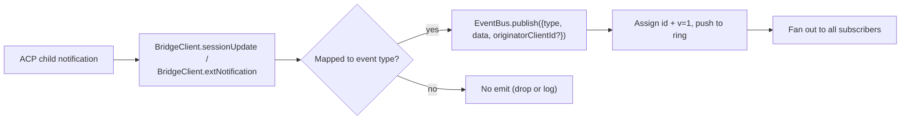
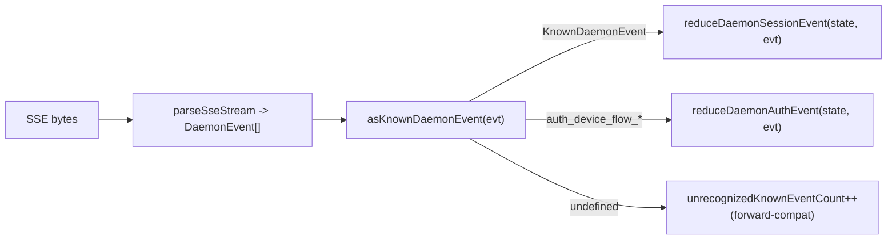

# 型付きデーモンイベントスキーマ v1

## 概要

デーモンが `GET /session/:id/events` で送出するすべての SSE フレームは `{ id, v, type, data, originatorClientId?, _meta? }` の形式を持ちます。`v: 1` が現在の `EVENT_SCHEMA_VERSION` です。`type` は `packages/sdk-typescript/src/daemon/events.ts` の `DAEMON_KNOWN_EVENT_TYPE_VALUES` セットに閉じたバージョン固定の値で、現在 43 種類のイベントタイプが定義されています。エンベロープの `_meta` フィールドは `server.ts` の `formatSseFrame()` が SSE 書き込み境界でスタンプします。詳細は[エンベロープレベルのメタデータ](#エンベロープレベルのメタデータ)を参照してください。

SDK は `asKnownDaemonEvent(evt)` を公開しています。既知のイベントタイプに対しては判別済みの `KnownDaemonEvent` を返し、それ以外のタイプには `undefined` を返します。これにより SDK コンシューマーは、新しいデーモンがイベントタイプを追加した際にもロックステップな SDK アップグレードを必要とせず前方互換性を維持できます。セッションリデューサーはそれらを `unrecognizedKnownEventCount` として記録します。

ワイヤーフォーマットは [`../qwen-serve-protocol.md`](../qwen-serve-protocol.md) に記載されています。このページは各イベントのペイロードコントラクトです。

## 責務

- イベントボキャブラリー（`DAEMON_KNOWN_EVENT_TYPE_VALUES`）の唯一の信頼できる情報源を提供する。
- 各イベントタイプの型付きエンベロープ（`DaemonEventEnvelope<TType, TData>`）を提供する。
- イベントストリームを SDK ビュー状態に投影する純粋なリデューサー（`reduceDaemonSessionEvent`、`reduceDaemonAuthEvent`）を提供する。
- 情報シグナルとして `typed_event_schema` ケーパビリティタグをブロードキャストする。タグが存在しない場合、`asKnownDaemonEvent` は引き続き `unknown` にフォールバックします。

## イベントボキャブラリー（43 種類の既知タイプ）

ドメインごとにグループ化しています。

### コアセッション

| タイプ                     | 方向           | トリガー                                                                        | 主要ペイロードフィールド                                                             |
| -------------------------- | -------------- | ----------------------------------------------------------------------------- | -------------------------------------------------------------------------------- |
| `session_update`           | S->C           | あらゆる ACP `sessionUpdate` 通知（エージェントテキスト、思考、ツール呼び出し、プラン） | `sessionUpdate: string, content?: ...`（不透明な ACP シェイプ）                    |
| `session_metadata_updated` | S->C           | `PATCH /session/:id/metadata`                                                 | `sessionId, displayName?`                                                        |
| `session_died`             | S->C 終端      | `channel.exited`                                                              | `sessionId, reason, exitCode? \| null, signalCode? \| null`                      |
| `session_closed`           | S->C 終端      | `DELETE /session/:id` またはプログラムによるクローズ                              | `sessionId, reason: 'client_close' \| string, closedBy?`                         |
| `session_snapshot`         | S->C 合成      | SSE アタッチ／リプレイ後のスナップショットフレーム                                  | `sessionId, currentModelId: string \| null, currentApprovalMode: string \| null` |

### サブスクライバーレベルの合成フレーム

| タイプ                  | トリガー                                                                                                                                                                                                                             | 備考                                                                                                                                                                                                                                                                                                                          |
| ----------------------- | ------------------------------------------------------------------------------------------------------------------------------------------------------------------------------------------------------------------------------------ | ------------------------------------------------------------------------------------------------------------------------------------------------------------------------------------------------------------------------------------------------------------------------------------------------------------------------------ |
| `client_evicted`        | サブスクライバー単位の EventBus キューオーバーフロー。**`id` なし**                                                                                                                                                                  | `reason: string, droppedAfter?: number`。現在のサブスクライバーに対してのみ終端であり、セッション自体は生き続けます。                                                                                                                                                                                                            |
| `slow_client_warning`   | キューが 75% 以上。強制プッシュされ、**`id` なし**                                                                                                                                                                                   | `queueSize, maxQueued, lastEventId`。キューが 37.5% 以下に下がった後に再アーム。                                                                                                                                                                                                                                               |
| `stream_error`          | `SubscriberLimitExceededError` またはその他のルートストリームエラー                                                                                                                                                                  | `error: string`。サブスクリプションに対して終端。                                                                                                                                                                                                                                                                              |
| `state_resync_required` | `subscribe({lastEventId})` がデーモンリングに `[lastEventId+1, earliestInRing-1]` が存在しなくなったこと、またはクライアントカーソルが前のバスエポックのものであることを検出。残りのリプレイフレームの**前**に強制プッシュされ、**`id` なし**。 | `reason: 'ring_evicted' \| 'epoch_reset' \| string`、`lastDeliveredId: number`、`earliestAvailableId: number`。これは回復シグナルであり終端ではありません。SSE ストリームはオープンのままでリプレイとライブフレームが継続します。SDK リデューサーは `awaitingResync = true` を設定し、呼び出し元が `loadSession` でリセットするまでデルタをスキップします。 |
| `replay_complete`       | `Last-Event-ID` リプレイループ終了後に送出される ID なしのセンチネル。クリーンなリプレイとリングエビクション後のパスの両方、`data.replayedCount === 0` のときでも送出されます。**`id` なし**                                                   | `replayedCount: number`。コンシューマーがタイムアウトなしにキャッチアップ UI を確定的に削除できます。                                                                                                                                                                                                                             |

### パーミッション（F3 + ベース）

| タイプ                        | 方向 | トリガー                                           | 主要ペイロードフィールド                                                                                                                             |
| ----------------------------- | --------- | -------------------------------------------------- | ------------------------------------------------------------------------------------------------------------------------------------------------ |
| `permission_request`          | S->C      | エージェントが `requestPermission` を呼び出す        | `requestId, sessionId, toolCall, options[]`。エンベロープはプロンプト発信者から `originatorClientId` をスタンプします。                               |
| `permission_resolved`         | S->C      | メディエーターが決定を下した                         | `requestId, outcome`（ACP `PermissionOutcome`）                                                                                                   |
| `permission_already_resolved` | S->C      | リクエストがすでに決定済みの後に投票が届いた          | `requestId, sessionId, outcome`                                                                                                                  |
| `permission_partial_vote`     | S->C      | `consensus` ポリシーが非最終投票を記録する           | `requestId, sessionId, votesReceived, votesNeeded (>= 1), quorum, optionTallies: Record<string, number>, originatorClientId?`                    |
| `permission_forbidden`        | S->C      | ポリシーが投票を拒否する                            | `requestId, sessionId, clientId?, reason: 'designated_mismatch' \| 'remote_not_allowed', originatorClientId?`。匿名投票者は `clientId` を省略します。 |

### モデル

| タイプ                | 方向 | ペイロード                                    |
| --------------------- | --------- | -------------------------------------------- |
| `model_switched`      | S->C      | `sessionId, modelId`                         |
| `model_switch_failed` | S->C      | `sessionId, requestedModelId, error: string` |

### MCP ガードレール（PR 14b + F2）

| タイプ                       | 方向 | ペイロード                                                                                                                                                                                                                                                                                                                                                                                                                                        |
| ---------------------------- | --------- | ------------------------------------------------------------------------------------------------------------------------------------------------------------------------------------------------------------------------------------------------------------------------------------------------------------------------------------------------------------------------------------------------------------------------------------------------- |
| `mcp_budget_warning`         | S->C      | `liveCount, reservedCount, budget, thresholdRatio: 0.75, mode: 'warn' \| 'enforce', scope?: 'workspace' \| 'session'`                                                                                                                                                                                                                                                                                                                             |
| `mcp_child_refused_batch`    | S->C      | `refusedServers: [{ name, transport, reason: 'budget_exhausted' }], budget, liveCount, reservedCount, mode: 'enforce', scope?: 'workspace' \| 'session'`                                                                                                                                                                                                                                                                                          |
| `mcp_server_restarted`       | S->C      | `serverName, durationMs, entryIndex?`（F2 マルチエントリープールの再起動向け）                                                                                                                                                                                                                                                                                                                                                                    |
| `mcp_server_restart_refused` | S->C      | `serverName, reason: 'budget_would_exceed' \| 'in_flight' \| 'disabled' \| 'restart_failed', entryIndex?, details?`。4 番目の値 `restart_failed` はプールモードのマルチエントリー再起動における深刻な障害を表します。`MCP_RESTART_REFUSED_REASONS` は未知の reason を拒否します。古い SDK リデューサーは `parseDaemonEvent` が `undefined` を返すため、加算的な新しい reason 値をサイレントにドロップします。新しい reason を追加する際はそれを認識する SDK と一緒にリリースしてください。 |

### ミューテーション制御（Wave 4 PR 16+17）

| タイプ                  | 方向 | ペイロード                                                                                              |
| ----------------------- | --------- | ---------------------------------------------------------------------------------------------------- |
| `memory_changed`        | S->C      | `scope: 'workspace' \| 'global', filePath, mode: 'append' \| 'replace', bytesWritten`                |
| `agent_changed`         | S->C      | `change: 'created' \| 'updated' \| 'deleted', name, level: 'project' \| 'user'`                      |
| `approval_mode_changed` | S->C      | `sessionId, previous, next, persisted: boolean`                                                      |
| `tool_toggled`          | S->C      | `toolName, enabled`。次の ACP 子スポーンに影響し、すでに実行中のセッションをミューテートしません。         |
| `settings_changed`      | S->C      | ワークスペース設定の書き込みが完了。ペイロードはオープン。コンシューマーはリードアフターライトでリフレッシュすべきです。 |
| `settings_reloaded`     | S->C      | デーモンワークスペースサービスが設定を再読み込み。ペイロードはオープン。                                   |
| `workspace_initialized` | S->C      | `path, action: 'created' \| 'overwrote' \| 'noop', originatorClientId?`                              |

### 認証デバイスフロー（PR 21）

これらのイベントはセッションキーではなくワークスペースキーです。セッションリデューサーはこれらをノーオペレーションとして扱います。`reduceDaemonAuthEvent` がワークスペースレベルの状態に投影します。

| タイプ                        | 方向 | ペイロード                                            |
| ----------------------------- | --------- | ----------------------------------------------------- |
| `auth_device_flow_started`    | S->C      | `deviceFlowId, providerId, expiresAt`                 |
| `auth_device_flow_throttled`  | S->C      | `deviceFlowId, intervalMs`                            |
| `auth_device_flow_authorized` | S->C      | `deviceFlowId, providerId, expiresAt?, accountAlias?` |
| `auth_device_flow_failed`     | S->C      | `deviceFlowId, errorKind, hint?`                      |
| `auth_device_flow_cancelled`  | S->C      | `deviceFlowId`                                        |

### MCP ランタイムミューテーション

| タイプ               | 方向 | トリガー                                                     | 主要ペイロードフィールド                                                           |
| -------------------- | --------- | ------------------------------------------------------------- | ---------------------------------------------------------------------------- |
| `mcp_server_added`   | S->C      | `POST /workspace/mcp/servers` でランタイム追加されたサーバー   | `name, transport, replaced, shadowedSettings, toolCount, originatorClientId` |
| `mcp_server_removed` | S->C      | ランタイムで削除されたサーバー                                 | `name, wasShadowingSettings, originatorClientId`                             |

### ターンライフサイクル / アシスタントプッシュ

| タイプ                | 方向 | トリガー                                                                                                            | 主要ペイロードフィールド                                                                                                                                                                             |
| --------------------- | --------- | ------------------------------------------------------------------------------------------------------------------- | ------------------------------------------------------------------------------------------------------------------------------------------------------------------------------------------------ |
| `prompt_cancelled`    | S->C      | 明示的な `cancelSession` ルート**または**発信者 SSE の切断によるプロンプトキャンセル                                  | エンベロープはキャンセルしたクライアントの `originatorClientId` をスタンプします。これは「キャンセルがリクエストされた」ことを意味し、「キャンセルが確認された」ことではありません。ピアサブスクライバーはプロンプトが終了したことを知ります。 |
| `turn_complete`       | S->C      | ターンが正常に完了した                                                                                               | `sessionId, stopReason, promptId?`。`promptId` は非ブロッキングプロンプトレスポンス（`202`）にリンクします。SDK はこれを通じて SSE イベントと発信プロンプトを対応付けます。                              |
| `turn_error`          | S->C      | ターンが失敗した                                                                                                     | `sessionId, message, code?, promptId?`。同じ `promptId` 相関メカニズム。                                                                                                                           |
| `session_rewound`     | S->C      | `POST /session/:id/rewind` が成功した                                                                               | `sessionId, promptId, targetTurnIndex, filesChanged[], filesFailed[], originatorClientId?`                                                                                                       |
| `session_branched`    | S->C      | `POST /session/:id/branch` が既存セッションからブランチを作成した                                                    | `sourceSessionId, newSessionId, displayName, originatorClientId?`                                                                                                                                |
| `followup_suggestion` | S->C      | ACP 子が `end_turn` 後にゴーストテキストのフォローアップ提案を生成し、セッションごとの SSE で転送された               | `sessionId, suggestion, promptId`。ワイヤーは `getFilterReason()===null` の提案のみを転送します。クライアントは入力プレースホルダーのゴーストテキストとしてレンダリングし、次の `sendPrompt` で無効化します。 |
| `user_shell_command`  | S->C      | ユーザーが `POST /session/:id/shell` でシェルコマンドを開始。同セッションの他のサブスクライバーにファンアウト          | `sessionId, command, shellId, originatorClientId?`。まだ型付き `DaemonXxxData` インターフェースがなく、`asKnownDaemonEvent` は `undefined` を返し、UI ノーマライザーがアドホックにパースします。     |
| `user_shell_result`   | S->C      | 上記シェルコマンドの結果                                                                                            | `sessionId, shellId, exitCode, output, aborted`。`user_shell_command` と同じアドホックパースの注意事項。                                                                                            |

## アーキテクチャ

| 関心事                                 | ソース                                         | 備考                                                                                                             |
| -------------------------------------- | ---------------------------------------------- | ------------------------------------------------------------------------------------------------------------------ |
| `EVENT_SCHEMA_VERSION = 1`             | `packages/acp-bridge/src/eventBus.ts`          | すべてのフレームで送信されます。                                                                                   |
| `DAEMON_KNOWN_EVENT_TYPE_VALUES`       | `packages/sdk-typescript/src/daemon/events.ts` | 43 タイプの閉じたリスト。                                                                                         |
| `DaemonEventEnvelope<TType, TData>`    | `events.ts`                                    | ジェネリックエンベロープ。                                                                                         |
| `DaemonKnownEventType`                 | `events.ts`                                    | `typeof DAEMON_KNOWN_EVENT_TYPE_VALUES[number]`。                                                                 |
| イベントごとのペイロード型             | `events.ts`                                    | ほとんどのイベントタイプは `DaemonXxxData` インターフェースを持ちます。`user_shell_*` は現在 UI ノーマライザーがアドホックにパースします。 |
| `asKnownDaemonEvent(evt)`              | `events.ts`                                    | `KnownDaemonEvent \| undefined` を返します。                                                                     |
| `reduceDaemonSessionEvent(state, evt)` | `events.ts`                                    | `DaemonSessionViewState` に投影します。                                                                           |
| `reduceDaemonAuthEvent(state, evt)`    | `events.ts`                                    | `DaemonAuthState` に投影します。                                                                                  |
| `isWorkspaceScopedBudgetEvent(evt)`    | `events.ts`                                    | F2 `scope: 'workspace'` を検出します。                                                                            |

### `DaemonSessionViewState`

`reduceDaemonSessionEvent` がこのビュー状態を埋めます。CLI TUI アダプター、`DaemonChannelBridge`、VS Code IDE が使用します。主要フィールド：

- `alive: boolean` - 終端フレーム（`session_died`、`session_closed`、`client_evicted`、`stream_error`）の後に `false` になります。
- `currentModelId?: string` - `model_switched` から。
- `displayName?: string` - `session_metadata_updated` から。
- `pendingPermissions: Record<string, DaemonPermissionRequestData>` - `requestId` でキーされたオープンリクエスト。`permission_resolved` / `permission_already_resolved` でクリアされます。
- `lastSessionUpdate?: DaemonSessionUpdateData` - 最新の `session_update`。
- `lastModelSwitchFailure?: DaemonModelSwitchFailedData` - `model_switch_failed` から。
- `terminalEvent?` - 生の終端イベント。
- `streamError?: DaemonStreamErrorData` - 最新の `stream_error` ペイロード。
- `unrecognizedKnownEventCount`、`lastUnrecognizedKnownEvent?` - `asKnownDaemonEvent` で認識されたがリデューサーにまだ専用状態がないイベント。
- `droppedPermissionRequestCount`、`lastDroppedPermissionRequestId?` - 不正なパーミッションリクエストがペンディングマップに入れなかった。
- `unmatchedPermissionResolutionCount`、`lastUnmatchedPermissionResolutionId?` - パーミッション解決に対応するペンディングリクエストがなかった。
- `slowClientWarningCount`、`lastSlowClientWarning?` - `slow_client_warning` から。
- `mcpBudgetWarningCount`、`lastMcpBudgetWarning?` - `mcp_budget_warning` から。
- `mcpChildRefusedBatchCount`、`lastMcpChildRefusedBatch?` - `mcp_child_refused_batch` から。
- `lastWorkspaceMutation?`、`lastWorkspaceMutationType?` - `memory_changed` / `agent_changed` から。
- `approvalMode?`、`approvalModeChangedCount`、`lastApprovalModeChange?` - `approval_mode_changed` から。
- `toolToggleCount`、`lastToolToggle?` - `tool_toggled` から。
- `workspaceInitCount`、`lastWorkspaceInit?` - `workspace_initialized` から。
- `mcpRestartCount`、`lastMcpRestart?` - `mcp_server_restarted` から。
- `mcpRestartRefusedCount`、`lastMcpRestartRefused?` - `mcp_server_restart_refused` から。
- `settings_changed` / `settings_reloaded` - `asKnownDaemonEvent` で認識されます。セッションリデューサーは専用のビュー状態フィールドを持たず、UI は通常リフレッシュシグナルとして扱います。
- `permissionVoteProgress: Record<string, DaemonPermissionPartialVoteData>` - コンセンサス投票の進捗。
- `forbiddenVotes: DaemonPermissionForbiddenData[]`、`forbiddenVoteCount` - ポリシーに拒否された投票レコード。最大 32 件。
- `awaitingResync: boolean` - `state_resync_required` で設定。コンシューマーがビュー状態をリセットするとクリアされます。
- `resyncRequiredCount`、`lastResyncRequired?` - リシンク可観測性。
- `lastFollowupSuggestion?: DaemonFollowupSuggestionData` - デーモンがプッシュした最新のフォローアップ提案。
- `lastTurnComplete?: DaemonTurnCompleteData` - 最新の正常なターン完了。
- `lastTurnError?: DaemonTurnErrorData` - 最新のターンエラー。
- `rewindCount`、`lastRewind?`、`lastBranch?` - 最新のリワインド / ブランチイベント。

### `DaemonAuthState`

`auth_device_flow_*` によって駆動される `providerId` ごとのエントリー。各フローは `{ deviceFlowId, status, providerId, expiresAt?, lastThrottleIntervalMs?, lastError? }` を公開します。

## フロー

### プロデューサー側



### コンシューマー側（SDK）



## エンベロープレベルのメタデータ

各イベントの `data` ペイロードに加え、デーモンは 2 つのエンベロープレベルフィールドをスタンプします。

### `_meta.serverTimestamp` - デーモンクロック

`packages/cli/src/serve/server.ts` の `formatSseFrame()` が SSE 書き込み境界でスタンプします。`EventBus.publish` の内部では**ありません**。インメモリの `BridgeEvent` 型は変更されず、内部デーモンコンシューマーは `_meta` を参照しませんが、ワイヤー SSE フレームには含まれます。

```jsonc
{
  "id": 47,
  "v": 1,
  "type": "session_update",
  "data": { ... },
  "_meta": { "serverTimestamp": 1716287345123 }
}
```

マージは既存の `_meta` キーを保持します
（`{...existingMeta, serverTimestamp: Date.now()}`）。**現在のデーモンプロデューサーは
エンベロープレベルの `_meta` を書き込みません**。トップレベルのマージは前方互換性の
エスケープハッチです。

重要な理由：相対時間をレンダリングしたりトランスクリプトブロックをソートするマルチクライアント UI は、各ブラウザ/タブ/デバイスのローカルクロックではなくサーバー時間を使用すべきです。サーバースタンプによりクライアント間で順序が一貫します。

SDK アクセス：`event._meta?.serverTimestamp` を推奨します。互換パスは `event.serverTimestamp` や `event.data._meta.serverTimestamp` も参照する場合があります。ACP ペイロードの `data._meta` とデーモンエンベロープの `_meta` を混同しないでください。

### `originatorClientId`

登録済みの `X-Qwen-Client-Id` を持つリクエストによってトリガーされたイベントはこのフィールドをスタンプする場合があります。[`08-session-lifecycle.md`](./08-session-lifecycle.md) を参照してください。

## ツール呼び出し `_meta`（プロベナンス / serverId）

これはエンベロープ `_meta` とは別です。ACP `session/update` ペイロードは `event.data._meta` に独自の `_meta` を持つ場合があります。`ToolCallEmitter`（`packages/cli/src/acp-integration/session/emitters/ToolCallEmitter.ts`）は `emitStart`、`emitResult`、`emitError` 時に 2 つのフィールドをスタンプします。

| フィールド   | 型                                        | 解決ルール                                                                                                                                                                            |
| ------------ | ----------------------------------------- | -------------------------------------------------------------------------------------------------------------------------------------------------------------------------- |
| `provenance` | `'builtin' \| 'mcp' \| 'subagent'`        | `ToolCallEmitter.resolveToolProvenance`：`subagentMeta` がある場合は `subagent` が優先されます。ツール名が `mcp__<server>__<tool>` にマッチする場合は `mcp`。それ以外は `builtin`。 |
| `serverId`   | `provenance === 'mcp'` の場合のみ `string` | `mcp__<serverId>__<tool>` からヒューリスティックに抽出されます。                                                                                                                     |

既存の `_meta.toolName` 表示名は保持されます。UI はツール名を再パースせずにこれらのフィールドを使用して builtin / MCP サーバー / subagent のバッジをレンダリングします。

## SDK リデューサーの動作

`packages/sdk-typescript/src/daemon/events.ts` の `reduceDaemonSessionEvent(state, evt)` がストリームを `DaemonSessionViewState` に投影します。リシンク関連フィールドは次の通りです：

- **`awaitingResync: boolean`** - `state_resync_required` で設定。呼び出し元がクリアします。通常は `POST /session/:id/load` でビュー状態をリセットした後。
- **`resyncRequiredCount: number`** - 可観測性カウンター。
- **`lastResyncRequired?: DaemonStateResyncRequiredData`** - 最新のペイロード。

`awaitingResync = true` の間、リデューサーはデルタ適用を**スキップ**し、閉じた `RESYNC_PASSTHROUGH_TYPES` セットのみを許可します：

| パススルータイプ        | リシンク中も適用される理由                                                          |
| ----------------------- | ------------------------------------------------------------------------------ |
| `state_resync_required` | まれな 2 回目のリシンクで `lastResyncRequired` / `resyncRequiredCount` を更新すべきです。 |
| `session_died`          | 終端ストリームシグナルはリシンク中も可視のままでなければなりません。                  |
| `session_closed`        | 同上。                                                                          |
| `client_evicted`        | 同上。                                                                          |
| `stream_error`          | 同上。                                                                          |
| `session_snapshot`      | 完全状態の権威あるフレーム。リシンク中に適用しても安全です。                          |

`lastEventId` はリシンク中も `advanceLastEventId(base)` を通じて単調に進みます。呼び出し元がリセットして `awaitingResync` をクリアした後、後続のデルタは正しいカーソルに整合します。

`reduceDaemonAuthEvent` はデバイスフローイベントをワークスペースレベルの認証
状態エントリーに投影します。概念的には
`{deviceFlowId, status, providerId, expiresAt?, lastThrottleIntervalMs?, lastError?}`
の形です。コードでは、リデューサーは `DaemonDeviceFlowReducerState` に `status`、`errorKind`、`hint`、
`intervalMs`、`lastSeenEventId`、`authorizedExpiresAt`、`accountAlias` を格納します。
デーモンイベントペイロード自体は上記のイベントごとの形式のままです。

## 状態と前方互換性

- 既知のイベントタイプを追加するには `DAEMON_KNOWN_EVENT_TYPE_VALUES` に追記します。古い SDK はフォールバックパスを通じて未認識のイベントタイプに `undefined` を返し、`unrecognizedKnownEventCount` をインクリメントします。新しい SDK は判別済みユニオンに依存します。
- 既存のペイロードへのオプションフィールド追加は安全です。ペイロードはオープン（`{ [key: string]: unknown }`）です。
- 既存のペイロード**シェイプ**の変更は破壊的変更であり、`EVENT_SCHEMA_VERSION` をバンプし、`caps.features.typed_event_schema_v2` などの互換ケーパビリティタグをアドバタイズする必要があります。
- `id` はセッションごとに単調増加します。サブスクライバーレベルの合成フレーム（`client_evicted`、`slow_client_warning`、`stream_error`、`state_resync_required`、`replay_complete`、`session_snapshot`）は意図的に id を持たないため、他のサブスクライバーはギャップを見ません。
- `originatorClientId` は `data` ではなくエンベロープに存在します。F3 の部分投票 / 拒否ペイロードも `mergeOriginator` を通じて `data` にマージされるため、ビュー状態コンシューマーはエンベロープを保持する必要がありません。

## 依存関係

- [`10-event-bus.md`](./10-event-bus.md) - 配信チャネル。
- [`11-capabilities-versioning.md`](./11-capabilities-versioning.md) - SDK が `typed_event_schema`、`mcp_guardrail_events`、`permission_mediation` をプリフライトする方法。
- [`04-permission-mediation.md`](./04-permission-mediation.md) - パーミッションイベントが生成される方法。
- [`13-sdk-daemon-client.md`](./13-sdk-daemon-client.md) - `asKnownDaemonEvent`、リデューサー、ビュー状態シェイプ。

## 設定

- 常にアドバタイズされます：`typed_event_schema`、`mcp_guardrail_events`、`permission_mediation`（サポートされているポリシーモードを含む）。
- スキーマ自体を直接制御する環境変数やフラグはありません。`QWEN_SERVE_NO_MCP_POOL=1` は MCP イベントの `scope` を `'workspace'` から absent または `'session'` に変更します。

## 注意事項と既知の制限

- 6 種類の合成フレームタイプは意図的に `id` を持ちません。SDK コードはすべてのイベントが id を持つと仮定してはなりません。
- `permission_partial_vote` は `consensus` 下でのみ現れます。`permission_forbidden` は `designated`、`consensus`、`local-only` で現れますが、`first-responder` では現れません。
- `mcp_child_refused_batch` は `mode: 'enforce'` でのみ現れます。`warn` モードは拒否しません。
- `auth_device_flow_*` イベントはセッションキーではありません。`DaemonSessionClient` を通じて消費する場合、セッションリデューサーではなく `reduceDaemonAuthEvent` を使用してください。

## 参照

- `packages/sdk-typescript/src/daemon/events.ts`
- `packages/acp-bridge/src/eventBus.ts`（`EVENT_SCHEMA_VERSION`）
- `packages/cli/src/serve/capabilities.ts`（`typed_event_schema`、`mcp_guardrail_events`、`permission_mediation`）
- ワイヤーリファレンス：[`../qwen-serve-protocol.md`](../qwen-serve-protocol.md)
