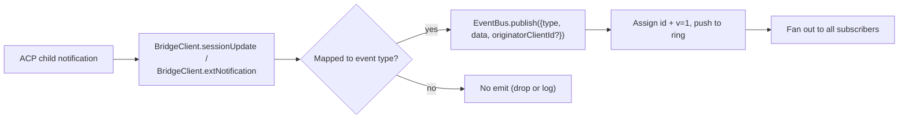
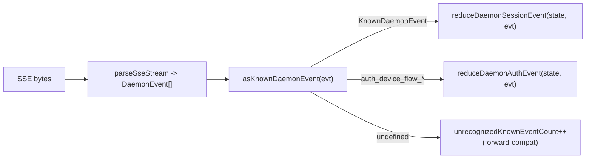

# Typed Daemon Event Schema v1

## 概要

`GET /session/:id/events` でデーモンが発行するすべてのSSEフレームは、`{ id, v, type, data, originatorClientId?, _meta? }` という形状を持ちます。`v: 1` は現在の `EVENT_SCHEMA_VERSION` です。`type` は `packages/sdk-typescript/src/daemon/events.ts` 内の、クローズドでバージョン固定された `DAEMON_KNOWN_EVENT_TYPE_VALUES` セットから取得されます。現在のセットには43の既知のイベントタイプがあります。エンベロープの `_meta` フィールドは、`server.ts` 内の `formatSseFrame()` によってSSE書き込み境界で付与されます。[エンベロープレベルのメタデータ](#envelope-level-metadata)を参照してください。

SDKは `asKnownDaemonEvent(evt)` を公開しています。これは、既知のイベントタイプに対しては判別可能な `KnownDaemonEvent` を返し、その他のタイプには `undefined` を返します。したがって、SDKコンシューマは、新しいデーモンがイベントタイプを追加した場合でも、SDKのバージョンアップを強制されることなく前方互換性を処理できます。セッションレデューサーは、これらを `unrecognizedKnownEventCount` として記録します。

ワイヤーフォーマットは [`../qwen-serve-protocol.md`](../qwen-serve-protocol.md) にあります。このページは、各イベントのペイロード契約です。

## 責任

- イベント語彙の唯一の情報源を提供する (`DAEMON_KNOWN_EVENT_TYPE_VALUES`)。
- 各イベントタイプの型付きエンベロープを提供する (`DaemonEventEnvelope<TType, TData>`)。
- イベントストリームをSDKビューステートに投影する純粋レデューサー (`reduceDaemonSessionEvent`, `reduceDaemonAuthEvent`) を提供する。
- 情報シグナルとして `typed_event_schema` 機能タグをブロードキャストする。タグがない場合でも、`asKnownDaemonEvent` は `unknown` にフォールバックする。

## イベント語彙（43の既知タイプ）

ドメインごとにグループ化。

### コアセッション

| タイプ | 方向 | トリガー | 主要ペイロードフィールド |
| -------------------------- | -------------- | ----------------------------------------------------------------------------- | -------------------------------------------------------------------------------- |
| `session_update` | S→C | 任意のACP `sessionUpdate` 通知：エージェントテキスト、思考、ツール呼び出し、またはプラン | `sessionUpdate: string, content?: ...`（不透明なACP形状） |
| `session_metadata_updated` | S→C | `PATCH /session/:id/metadata` | `sessionId, displayName?` |
| `session_died` | S→C 終端 | `channel.exited` | `sessionId, reason, exitCode? \| null, signalCode? \| null` |
| `session_closed` | S→C 終端 | `DELETE /session/:id` またはプログラムによるクローズ | `sessionId, reason: 'client_close' \| string, closedBy?` |
| `session_snapshot` | S→C 合成 | SSEアタッチ/リプレイ後のスナップショットフレーム | `sessionId, currentModelId: string \| null, currentApprovalMode: string \| null` |

### サブスクライバーレベルの合成フレーム

| タイプ | トリガー | 注記 |
| ----------------------- | -------------------------------------------------------------------------------------------------------------------------------------------------------------------- | ------------------------------------------------------------------------------------------------------------------------------------------------------------------------------------------------------------------------------------------------------------------------------------------------------------------------------ |
| `client_evicted` | サブスクライバーごとのEventBusキューオーバーフロー。**`id` なし** | `reason: string, droppedAfter?: number`；現在のサブスクライバーにとって終端ですが、セッションは有効なままです。 |
| `slow_client_warning` | キューが75%以上；強制プッシュされ、**`id` なし** | `queueSize, maxQueued, lastEventId`；キューが37.5%未満に低下すると再アームされます。 |
| `stream_error` | `SubscriberLimitExceededError` またはその他のルートストリームエラー | `error: string`；サブスクリプションにとって終端です。 |
| `state_resync_required` | `subscribe({lastEventId})` が、デーモンリングが `[lastEventId+1, earliestInRing-1]` を保持していないこと、またはクライアントカーソルが前のバスエポックからのものであることを検出。残りのリプレイフレームの**前に**強制プッシュされ、**`id` なし**。 | `reason: 'ring_evicted' \| 'epoch_reset' \| string`, `lastDeliveredId: number`, `earliestAvailableId: number`。これは回復シグナルであり、終端ではありません：SSEストリームは開いたままで、リプレイ＋ライブフレームが続きます。SDKレデューサーは `awaitingResync = true` を設定し、呼び出し元が `loadSession` でリセットするまでデルタをスキップします。 |
| `replay_complete` | `Last-Event-ID` リプレイループが終了した後に発行されるIDなしのセンチネル。クリーンリプレイとリング削除の両方のパスで、`data.replayedCount === 0` の場合でも発行されます。**`id` なし** | `replayedCount: number`；コンシューマはタイムアウトなしで決定論的にキャッチアップUIを削除できます。 |

### 権限（F3 + ベース）

| タイプ | 方向 | トリガー | 主要ペイロードフィールド |
| ----------------------------- | --------- | -------------------------------------------------- | -------------------------------------------------------------------------------- |
| `permission_request` | S→C | エージェントが `requestPermission` を呼び出す | `requestId, sessionId, toolCall, options[]`；エンベロープはプロンプト発信元から `originatorClientId` をスタンプします。 |
| `permission_resolved` | S→C | メディエーターが決定した | `requestId, outcome`（ACP `PermissionOutcome`） |
| `permission_already_resolved` | S→C | リクエストがすでに決定された後に投票が届く | `requestId, sessionId, outcome` |
| `permission_partial_vote` | S→C | `consensus` ポリシーが最終投票でないものを記録する | `requestId, sessionId, votesReceived, votesNeeded (>= 1), quorum, optionTallies: Record<string, number>, originatorClientId?` |
| `permission_forbidden` | S→C | ポリシーが投票を拒否する | `requestId, sessionId, clientId?, reason: 'designated_mismatch' \| 'remote_not_allowed', originatorClientId?`；匿名投票者は `clientId` を省略。 |

### モデル

| タイプ | 方向 | ペイロード |
| --------------------- | --------- | -------------------------------------------- |
| `model_switched` | S→C | `sessionId, modelId` |
| `model_switch_failed` | S→C | `sessionId, requestedModelId, error: string` |

### MCPガードレール（PR 14b + F2）

| タイプ | 方向 | ペイロード |
| ---------------------------- | --------- | ------------------------------------------------------------------------------------------------------------------------------------------------------------------------------------------------------------------------------------------------------------------------------------------------------------------------------------------------------------------------------------------------------------------------------------------------- |
| `mcp_budget_warning` | S→C | `liveCount, reservedCount, budget, thresholdRatio: 0.75, mode: 'warn' \| 'enforce', scope?: 'workspace' \| 'session'` |
| `mcp_child_refused_batch` | S→C | `refusedServers: [{ name, transport, reason: 'budget_exhausted' }], budget, liveCount, reservedCount, mode: 'enforce', scope?: 'workspace' \| 'session'` |
| `mcp_server_restarted` | S→C | `serverName, durationMs, entryIndex?`（F2マルチエントリープール再起動用） |
| `mcp_server_restart_refused` | S→C | `serverName, reason: 'budget_would_exceed' \| 'in_flight' \| 'disabled' \| 'restart_failed', entryIndex?, details?`。4番目の値 `restart_failed` は、プールモードのマルチエントリー再起動における根本的なハード障害を伝えます。`MCP_RESTART_REFUSED_REASONS` は未知の理由を拒否します。古いSDKレデューサーは、`parseDaemonEvent` が `undefined` を返すため、追加された新しい理由値を静かにドロップします。その理由を知っているSDKとともに新しい理由を出荷してください。 |

### ミューテーション制御（Wave 4 PR 16+17）

| タイプ | 方向 | ペイロード |
| ----------------------- | --------- | ---------------------------------------------------------------------------------------------------- |
| `memory_changed` | S→C | `scope: 'workspace' \| 'global', filePath, mode: 'append' \| 'replace', bytesWritten` |
| `agent_changed` | S→C | `change: 'created' \| 'updated' \| 'deleted', name, level: 'project' \| 'user'` |
| `approval_mode_changed` | S→C | `sessionId, previous, next, persisted: boolean` |
| `tool_toggled` | S→C | `toolName, enabled`；次のACP子プロセスの生成に影響し、既に実行中のセッションは変更しません。 |
| `settings_changed` | S→C | ワークスペース設定の書き込みが完了。ペイロードはオープン。コンシューマは読み取り後書き込みでリフレッシュする必要があります。 |
| `settings_reloaded` | S→C | デーモンワークスペースサービスが設定を再読み込み。ペイロードはオープン。 |
| `workspace_initialized` | S→C | `path, action: 'created' \| 'overwrote' \| 'noop', originatorClientId?` |

### 認証デバイスフロー（PR 21）

これらのイベントはセッションキーではなくワークスペースキーです。セッションレデューサーはこれらをno-opとして扱います。`reduceDaemonAuthEvent` はこれらをワークスペースレベルのステートに投影します。

| タイプ | 方向 | ペイロード |
| ----------------------------- | --------- | ----------------------------------------------------- |
| `auth_device_flow_started` | S→C | `deviceFlowId, providerId, expiresAt` |
| `auth_device_flow_throttled` | S→C | `deviceFlowId, intervalMs` |
| `auth_device_flow_authorized` | S→C | `deviceFlowId, providerId, expiresAt?, accountAlias?` |
| `auth_device_flow_failed` | S→C | `deviceFlowId, errorKind, hint?` |
| `auth_device_flow_cancelled` | S→C | `deviceFlowId` |

### MCPランタイムミューテーション

| タイプ | 方向 | トリガー | 主要ペイロードフィールド |
| -------------------- | --------- | ------------------------------------------------------------- | ---------------------------------------------------------------------------- |
| `mcp_server_added` | S→C | `POST /workspace/mcp/servers` でランタイムにサーバーが追加された | `name, transport, replaced, shadowedSettings, toolCount, originatorClientId` |
| `mcp_server_removed` | S→C | ランタイムにサーバーが削除された | `name, wasShadowingSettings, originatorClientId` |

### ターンライフサイクル / アシスタントプッシュ

| タイプ | 方向 | トリガー | 主要ペイロードフィールド |
| --------------------- | --------- | ------------------------------------------------------------------------------------------------------------------- | ------------------------------------------------------------------------------------------------------------------------------------------------------------------------------------------------ |
| `prompt_cancelled` | S→C | 明示的な `cancelSession` ルート、または発信元SSE切断によるプロンプトのキャンセル | エンベロープはキャンセル元クライアントの `originatorClientId` をスタンプします。これは「キャンセルが要求された」という意味であり、「キャンセルが確定した」という意味ではありません。ピアサブスクライバーはプロンプトが終了したことを学習します。 |
| `turn_complete` | S→C | ターンが正常に完了した | `sessionId, stopReason, promptId?`。`promptId` は非ブロッキングプロンプト応答（`202`）にリンクします。SDKはSSEイベントをそれを通じて発信元プロンプトに照合します。 |
| `turn_error` | S→C | ターンが失敗した | `sessionId, message, code?, promptId?`；同じ `promptId` 相関メカニズム。 |
| `session_rewound` | S→C | `POST /session/:id/rewind` が成功した | `sessionId, promptId, targetTurnIndex, filesChanged[], filesFailed[], originatorClientId?` |
| `session_branched` | S→C | `POST /session/:id/branch` が既存のセッションからブランチを作成した | `sourceSessionId, newSessionId, displayName, originatorClientId?` |
| `followup_suggestion` | S→C | ACP子プロセスが `end_turn` 後にゴーストテキストのフォローアップ候補を生成し、セッションごとのSSEで転送 | `sessionId, suggestion, promptId`；ワイヤーは `getFilterReason()===null` の候補のみを転送します。クライアントはそれらを入力プレースホルダーのゴーストテキストとしてレンダリングし、次の `sendPrompt` で無効にします。 |
| `user_shell_command` | S→C | ユーザーが `POST /session/:id/shell` でシェルコマンドを開始。同じセッションの他のサブスクライバーにファンアウト | `sessionId, command, shellId, originatorClientId?`。型付き `DaemonXxxData` インターフェースはまだありません。`asKnownDaemonEvent` は `undefined` を返し、UIノーマライザーがアドホックに解析します。 |
| `user_shell_result` | S→C | 上記のシェルコマンドの結果 | `sessionId, shellId, exitCode, output, aborted`。`user_shell_command` と同じアドホック解析の注記。 |

## アーキテクチャ

| 関心事 | ソース | 注記 |
| -------------------------------------- | ---------------------------------------------- | ------------------------------------------------------------------------------------------------------------------ |
| `EVENT_SCHEMA_VERSION = 1` | `packages/acp-bridge/src/eventBus.ts` | すべてのフレームで送信されます。 |
| `DAEMON_KNOWN_EVENT_TYPE_VALUES` | `packages/sdk-typescript/src/daemon/events.ts` | 43タイプのクローズドリスト。 |
| `DaemonEventEnvelope<TType, TData>` | `events.ts` | ジェネリックエンベロープ。 |
| `DaemonKnownEventType` | `events.ts` | `typeof DAEMON_KNOWN_EVENT_TYPE_VALUES[number]`。 |
| イベントごとのペイロードタイプ | `events.ts` | ほとんどのイベントタイプには `DaemonXxxData` インターフェースがあります。`user_shell_*` は現在、UIノーマライザーによってアドホックに解析されています。 |
| `asKnownDaemonEvent(evt)` | `events.ts` | `KnownDaemonEvent \| undefined` を返します。 |
| `reduceDaemonSessionEvent(state, evt)` | `events.ts` | `DaemonSessionViewState` に投影します。 |
| `reduceDaemonAuthEvent(state, evt)` | `events.ts` | `DaemonAuthState` に投影します。 |
| `isWorkspaceScopedBudgetEvent(evt)` | `events.ts` | F2 `scope: 'workspace'` を検出します。 |
### `DaemonSessionViewState`

`reduceDaemonSessionEvent` はこのビューステートを設定します。CLI TUI アダプタ、`DaemonChannelBridge`、VS Code IDE がこれを消費します。主要なフィールド:

- `alive: boolean` - ターミナルフレーム (`session_died`, `session_closed`, `client_evicted`, `stream_error`) の後に `false` になります。
- `currentModelId?: string` - `model_switched` から設定されます。
- `displayName?: string` - `session_metadata_updated` から設定されます。
- `pendingPermissions: Record<string, DaemonPermissionRequestData>` - `requestId` をキーとする未解決のリクエスト。`permission_resolved` / `permission_already_resolved` でクリアされます。
- `lastSessionUpdate?: DaemonSessionUpdateData` - 最新の `session_update`。
- `lastModelSwitchFailure?: DaemonModelSwitchFailedData` - `model_switch_failed` から設定されます。
- `terminalEvent?` - 生のターミナルイベント。
- `streamError?: DaemonStreamErrorData` - 最新の `stream_error` ペイロード。
- `unrecognizedKnownEventCount`, `lastUnrecognizedKnownEvent?` - イベントは `asKnownDaemonEvent` で認識されたが、リデューサーにはまだ専用の状態がありません。
- `droppedPermissionRequestCount`, `lastDroppedPermissionRequestId?` - 不正な形式の権限リクエストが保留マップに追加できませんでした。
- `unmatchedPermissionResolutionCount`, `lastUnmatchedPermissionResolutionId?` - 権限解決に一致する保留リクエストがありませんでした。
- `slowClientWarningCount`, `lastSlowClientWarning?` - `slow_client_warning` から設定されます。
- `mcpBudgetWarningCount`, `lastMcpBudgetWarning?` - `mcp_budget_warning` から設定されます。
- `mcpChildRefusedBatchCount`, `lastMcpChildRefusedBatch?` - `mcp_child_refused_batch` から設定されます。
- `lastWorkspaceMutation?`, `lastWorkspaceMutationType?` - `memory_changed` / `agent_changed` から設定されます。
- `approvalMode?`, `approvalModeChangedCount`, `lastApprovalModeChange?` - `approval_mode_changed` から設定されます。
- `toolToggleCount`, `lastToolToggle?` - `tool_toggled` から設定されます。
- `workspaceInitCount`, `lastWorkspaceInit?` - `workspace_initialized` から設定されます。
- `mcpRestartCount`, `lastMcpRestart?` - `mcp_server_restarted` から設定されます。
- `mcpRestartRefusedCount`, `lastMcpRestartRefused?` - `mcp_server_restart_refused` から設定されます。
- `settings_changed` / `settings_reloaded` - `asKnownDaemonEvent` で認識されます。セッションリデューサーは専用のビューステートフィールドを維持せず、UI は通常それらをリフレッシュ信号として扱います。
- `permissionVoteProgress: Record<string, DaemonPermissionPartialVoteData>` - コンセンサス投票の進捗。
- `forbiddenVotes: DaemonPermissionForbiddenData[]`, `forbiddenVoteCount` - ポリシーにより拒否された投票レコード。最大 32 個。
- `awaitingResync: boolean` - `state_resync_required` により設定されます。コンシューマーがビューステートをリセットするとクリアされます。
- `resyncRequiredCount`, `lastResyncRequired?` - 再同期の可観測性。
- `lastFollowupSuggestion?: DaemonFollowupSuggestionData` - デーモンがプッシュした最新のフォローアップ提案。
- `lastTurnComplete?: DaemonTurnCompleteData` - 最新の成功したターン完了。
- `lastTurnError?: DaemonTurnErrorData` - 最新のターンエラー。
- `rewindCount`, `lastRewind?`, `lastBranch?` - 最新の巻き戻し / ブランチイベント。

### `DaemonAuthState`

`providerId` ごとに 1 エントリ。`auth_device_flow_*` によって駆動されます。各フローは `{ deviceFlowId, status, providerId, expiresAt?, lastThrottleIntervalMs?, lastError? }` を公開します。

## Flow

### プロデューサー側



### コンシューマー側 (SDK)



## エンベロープレベルのメタデータ

各イベントの `data` ペイロードに加えて、デーモンは 2 つのエンベロープレベルフィールドをスタンプします。

### `_meta.serverTimestamp` - デーモンのクロック

`packages/cli/src/serve/server.ts` の `formatSseFrame()` は、SSE 書き込み境界でこれをスタンプします。**`EventBus.publish` 内ではありません**。インメモリの `BridgeEvent` 型は変更されません。内部のデーモンコンシューマーは `_meta` を参照しませんが、ワイヤ上の SSE フレームは参照します。

```jsonc
{
  "id": 47,
  "v": 1,
  "type": "session_update",
  "data": { ... },
  "_meta": { "serverTimestamp": 1716287345123 }
}
```

マージは既存の `_meta` キーを保持します
(`{...existingMeta, serverTimestamp: Date.now()}`)。**現在のデーモンプロデューサーはエンベロープレベルの `_meta` を書き込みません**。トップレベルのマージは前方互換性のためのエスケープハッチです。

なぜ重要か: 複数クライアントの UI で相対時間を表示したりトランスクリプトブロックを並べ替えたりする場合、各ブラウザ/タブ/電話のローカルクロックではなくサーバー時刻を使用する必要があります。サーバースタンプにより、クライアント間で順序が一貫します。

SDK でのアクセス: `event._meta?.serverTimestamp` を推奨します。互換性パスでは `event.serverTimestamp` や `event.data._meta.serverTimestamp` を調べることもあります。ACP ペイロードの `data._meta` とデーモンエンベロープの `_meta` を混同しないでください。

### `originatorClientId`

登録された `X-Qwen-Client-Id` を含むリクエストによってトリガーされたイベントは、このフィールドをスタンプする場合があります。詳細は [`08-session-lifecycle.md`](./08-session-lifecycle.md) を参照してください。

## Tool-call `_meta` (provenance / serverId)

これはエンベロープ `_meta` とは別のものです。ACP の `session/update` ペイロードは、自身の `_meta` を `event.data._meta` に含めることができます。`ToolCallEmitter` (`packages/cli/src/acp-integration/session/emitters/ToolCallEmitter.ts`) は `emitStart`、`emitResult`、`emitError` に 2 つのフィールドをスタンプします。

| フィールド   | 型                                             | 解決ルール                                                                                                                                                                     |
| ------------ | ---------------------------------------------- | ------------------------------------------------------------------------------------------------------------------------------------------------------------------------------ |
| `provenance` | `'builtin' \| 'mcp' \| 'subagent'`            | `ToolCallEmitter.resolveToolProvenance`: `subagentMeta` が存在すれば `subagent`、ツール名が `mcp__<server>__<tool>` に一致すれば `mcp`、それ以外は `builtin` にマッピングされます。 |
| `serverId`   | `string` (`provenance === 'mcp'` の場合のみ)    | `mcp__<serverId>__<tool>` からヒューリスティックに抽出されます。                                                                                                                  |

既存の `_meta.toolName` 表示名は保持されます。UI はこれらのフィールドを使用して、ツール名を再解析することなく、builtin / MCP サーバー / subagent のバッジをレンダリングします。

## SDK リデューサーの動作

`packages/sdk-typescript/src/daemon/events.ts` の `reduceDaemonSessionEvent(state, evt)` は、ストリームを `DaemonSessionViewState` に投影します。再同期関連のフィールドは以下の通りです:

- **`awaitingResync: boolean`** - `state_resync_required` により設定されます。呼び出し側がクリアします。通常は `POST /session/:id/load` でビューステートをリセットした後に行います。
- **`resyncRequiredCount: number`** - 可観測性カウンター。
- **`lastResyncRequired?: DaemonStateResyncRequiredData`** - 最新のペイロード。

`awaitingResync = true` の間、リデューサーは**デルタ適用をスキップ**し、閉じた `RESYNC_PASSTHROUGH_TYPES` セットのみを許可します:

| 通過型                   | 再同期中にも適用される理由                                                               |
| ------------------------ | ---------------------------------------------------------------------------------------- |
| `state_resync_required`  | 稀な 2 回目の再同期では `lastResyncRequired` / `resyncRequiredCount` を更新する必要がある。 |
| `session_died`           | ターミナルストリーム信号は再同期中も可視である必要がある。                                 |
| `session_closed`         | 同上。                                                                                   |
| `client_evicted`         | 同上。                                                                                   |
| `stream_error`           | 同上。                                                                                   |
| `session_snapshot`       | 全状態の信頼できるフレーム。再同期中に適用しても安全。                                     |

`lastEventId` は再同期中も `advanceLastEventId(base)` により単調に進行します。呼び出し側がリセットして `awaitingResync` をクリアした後、後続のデルタは正しいカーソルにアラインされます。

`reduceDaemonAuthEvent` は、デバイスフローイベントをワークスペースレベルの認証状態エントリに投影します。これは概念的には `{deviceFlowId, status, providerId, expiresAt?, lastThrottleIntervalMs?, lastError?}` のような形になります。コード上では、リデューサーは `DaemonDeviceFlowReducerState` に `status`、`errorKind`、`hint`、`intervalMs`、`lastSeenEventId`、`authorizedExpiresAt`、`accountAlias` を格納します。デーモンイベントペイロード自体は、上記のイベントごとの形状のままです。

## 状態と前方互換性

- 新しい既知のイベント型は `DAEMON_KNOWN_EVENT_TYPE_VALUES` に追加することで追加できます。古い SDK はフォールバックパスを通じて認識されないイベント型に対して `undefined` を返し、`unrecognizedKnownEventCount` をインクリメントします。新しい SDK は判別ユニオンに依存します。
- 既存のペイロードにオプションフィールドを追加しても安全です。ペイロードはオープン (`{ [key: string]: unknown }`) だからです。
- 既存のペイロードの**形状**を変更するのは破壊的変更であり、`EVENT_SCHEMA_VERSION` をバンプし、`caps.features.typed_event_schema_v2` のような互換性のある機能タグをアドバタイズする必要があります。
- `id` はセッションごとに単調増加します。サブスクライバーレベルの合成フレーム (`client_evicted`、`slow_client_warning`、`stream_error`、`state_resync_required`、`replay_complete`、`session_snapshot`) には意図的に id がなく、他のサブスクライバーにギャップが見えないようにしています。
- `originatorClientId` は `data` ではなくエンベロープに存在します。F3 の部分投票 / 禁止ペイロードは `mergeOriginator` を通じてそれを `data` にもマージするため、ビューステートのコンシューマーはエンベロープを保持する必要がありません。

## 依存関係

- [`10-event-bus.md`](./10-event-bus.md) - 配信チャネル。
- [`11-capabilities-versioning.md`](./11-capabilities-versioning.md) - SDK が `typed_event_schema`、`mcp_guardrail_events`、`permission_mediation` を事前確認する方法。
- [`04-permission-mediation.md`](./04-permission-mediation.md) - 権限イベントが生成される方法。
- [`13-sdk-daemon-client.md`](./13-sdk-daemon-client.md) - `asKnownDaemonEvent`、リデューサー、ビューステートの形状。

## 設定

- 常にアドバタイズ: `typed_event_schema`、`mcp_guardrail_events`、`permission_mediation`（サポートされているポリシーモードを含む）。
- スキーマ自体を直接制御する環境変数やフラグはありません。`QWEN_SERVE_NO_MCP_POOL=1` は MCP イベントの `scope` を `'workspace'` から absent または `'session'` に変更します。

## 注意点と既知の制限

- 6 つの合成フレーム型には意図的に `id` がありません。SDK コードはすべてのイベントに id があると仮定してはいけません。
- `permission_partial_vote` は `consensus` でのみ出現します。`permission_forbidden` は `designated`、`consensus`、`local-only` では出現しますが、`first-responder` では出現しません。
- `mcp_child_refused_batch` は `mode: 'enforce'` でのみ出現します。`warn` モードでは拒否されません。
- `auth_device_flow_*` イベントはセッションキーを持ちません。`DaemonSessionClient` を介して消費する場合、セッションリデューサーではなく `reduceDaemonAuthEvent` を使用してください。

## 参照

- `packages/sdk-typescript/src/daemon/events.ts`
- `packages/acp-bridge/src/eventBus.ts` (`EVENT_SCHEMA_VERSION`)
- `packages/cli/src/serve/capabilities.ts` (`typed_event_schema`、`mcp_guardrail_events`、`permission_mediation`)
- ワイヤ参照: [`../qwen-serve-protocol.md`](../qwen-serve-protocol.md)