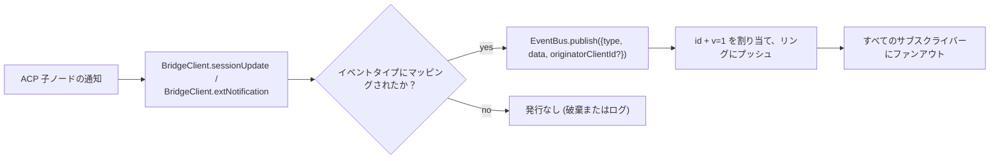
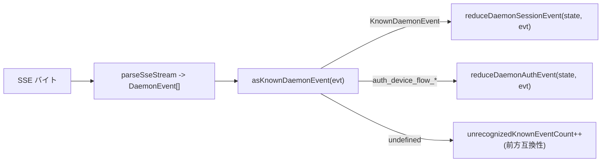

---

# Typed Daemon Event Schema v1

## 概要

`GET /session/:id/events` でデーモンから出力されるすべての SSE フレームは、`{ id, v, type, data, originatorClientId?, _meta? }` の形状を持ちます。`v: 1` は現在の `EVENT_SCHEMA_VERSION` です。`type` は `packages/sdk-typescript/src/daemon/events.ts` にあるクローズドでバージョン固定された `DAEMON_KNOWN_EVENT_TYPE_VALUES` セットから取得されます。エンベロープの `_meta` フィールドは、`packages/cli/src/serve/routes/sse-events.ts` の `formatSseFrame()` によって SSE 書き込み境界でスタンプされます。[Envelope-level metadata](#envelope-level-metadata) を参照してください。

SDK は `asKnownDaemonEvent(evt)` を公開しています。これは既知のイベントタイプに対しては判別共用体である `KnownDaemonEvent` を、その他のタイプに対しては `undefined` を返します。したがって、SDK を利用する側は、新しいデーモンがイベントタイプを追加した際に、SDK を同時にアップグレードすることなく前方互換性を処理できます。セッションリデューサーはこれらを `unrecognizedKnownEventCount` として記録します。

ワイヤーフォーマットは [`../qwen-serve-protocol.md`](../qwen-serve-protocol.md) にあります。このページは各イベントのペイロード契約です。

## 責務

- イベント語彙（`DAEMON_KNOWN_EVENT_TYPE_VALUES`）の単一の信頼できる情報源（Single Source of Truth）を提供します。
- 各イベントタイプに対する型付きエンベロープ（`DaemonEventEnvelope<TType, TData>`）を提供します。
- イベントストリームを SDK のビュー状態に射影する純粋なリデューサー（`reduceDaemonSessionEvent`, `reduceDaemonAuthEvent`）を提供します。
- 情報提供シグナルとして `typed_event_schema` ケイパビリティタグをブロードキャストします。タグが存在しない場合でも、`asKnownDaemonEvent` は `unknown` にフォールバックします。

## Event vocabulary

ドメイン別にグループ化されています。

### Core session

| Type                         | Direction      | Trigger                                                                               | Key payload fields                                                                                           |
| ---------------------------- | -------------- | ------------------------------------------------------------------------------------- | ------------------------------------------------------------------------------------------------------------ |
| `session_update`             | S->C           | 任意の ACP `sessionUpdate` 通知: エージェントテキスト、思考、ツール呼び出し、またはプラン | `sessionUpdate: string, content?: ...`（不透明な ACP 形状）                                                    |
| `session_metadata_updated`   | S->C           | `PATCH /session/:id/metadata`                                                         | `sessionId, displayName?`                                                                                    |
| `session_died`               | S->C 終端  | `channel.exited`                                                              | `sessionId, reason, exitCode? \| null, signalCode? \| null`                                                  |
| `session_closed`             | S->C 終端  | `DELETE /session/:id` またはプログラムによるクローズ                                   | `sessionId, reason: 'client_close' \| string, closedBy?`                                                     |
| `session_snapshot`           | S->C 合成 | SSE アタッチ / リプレイ後のスナップショットフレーム                                      | `sessionId, currentModelId: string \| null, currentApprovalMode: string \| null, recordingDegraded: boolean` |
| `session_recording_degraded` | S->C           | セッションのトランスクリプトライターが非同期書き込み失敗後に永続的に停止しました | `sessionId, reason: 'write_failed'`                                                                          |

### Subscriber-level synthetic frames

| Type                    | Trigger                                                                                                                                                                                                                              | Notes                                                                                                                                                                                                                                                                                                                          |
| ----------------------- | ------------------------------------------------------------------------------------------------------------------------------------------------------------------------------------------------------------------------------------ | ------------------------------------------------------------------------------------------------------------------------------------------------------------------------------------------------------------------------------------------------------------------------------------------------------------------------------ |
| `client_evicted`        | サブスクライバーごとの EventBus キューのオーバーフロー。**`id` なし**                                                                                                                                                                                  | `reason: 'queue_overflow' \| 'queue_bytes_overflow' \| string, droppedAfter?: number, queueSize?: number, maxQueued?: number, queuedBytes?: number, maxQueuedBytes?: number, eventBytes?: number`; 現在のサブスクライバーに対してのみ終端となり、セッション自体は存続します。                                                  |
| `slow_client_warning`   | ライブフレームのバックログまたはライブシリアライズバイトのバックログが 75% 以上。強制プッシュされ、**`id` を持ちません**                                                                                                                                          | `queueSize, maxQueued, lastEventId, queuedBytes?, maxQueuedBytes?, threshold?: 'frames' \| 'bytes' \| 'frames_and_bytes'`; フレームとバイトの両方の測定値が 37.5% 未満に下がった後に再設定されます。                                                                                                                                   |
| `stream_error`          | `SubscriberLimitExceededError` または別のルートストリームエラー                                                                                                                                                                         | `error: string`; サブスクリプションに対して終端となります。                                                                                                                                                                                                                                                                                |
| `state_resync_required` | `subscribe({lastEventId})` がデーモンリングに `[lastEventId+1, earliestInRing-1]` が保持されなくなったこと、またはクライアントカーソルが前のバスエポックのものであることを検出します。残りのリプレイフレームの**前**に強制プッシュされ、**`id` を持ちません**。 | `reason: 'ring_evicted' \| 'epoch_reset' \| string`, `lastDeliveredId: number`, `earliestAvailableId: number`。これは終端ではなくリカバリーシグナルです。SSE ストリームはオープンされたままとなり、リプレイとライブフレームが継続します。SDK リデューサーは `awaitingResync = true` を設定し、呼び出し元が `loadSession` でリセットするまでデルタをスキップします。 |
| `history_truncated`     | `POST /session/:id/load` が、古いインメモリリプレイエントリがドロップされた後にバウンドされたリプレイスナップショットを返します。`compactedReplay` の先頭に追加され、**`id` を持ちません**。                                                                    | `reason: 'replay_window_exceeded'`, `truncatedEvents: number`, `retainedEvents: number`, `maxBytes: number`, `truncatedTurns?: number`, `fullTranscriptAvailable: boolean`。これはステータスマーカーであり、再同期リクエストではありません。クライアントはこれをレンダリングし、保持されたリプレイの適用を続行します。                                            |
| `replay_complete`       | `Last-Event-ID` リプレイループが終了した後に発行される ID なしセンチネル。クリーンなリプレイとリングエビクトのパスの両方に対して、`data.replayedCount === 0` の場合でも発行されます。**`id` なし**                                                             | `replayedCount: number`; コンシューマーがタイムアウトなしでキャッチアップ UI を確実に削除できるようにします。                                                                                                                                                                                                                                |

`fullTranscriptAvailable` は真偽値のケイパビリティフラグであり、リテラルの `true` 型ではありません。現在のデーモンは、`/session/:id/transcript` で永続化されたトランスクリプトをページングできる場合に `true` を出力します。古いまたは制約付きのデーモンは `false` を出力する可能性があり、クライアントはバウンドされたリプレイのレンダリングを通常通り続行する必要があります。

### Permissions (F3 + base)

| Type                          | Direction | Trigger                                            | Key payload fields                                                                                                                               |
| ----------------------------- | --------- | -------------------------------------------------- | ------------------------------------------------------------------------------------------------------------------------------------------------ |
| `permission_request`          | S->C      | エージェントが `requestPermission` を呼び出す                    | `requestId, sessionId, toolCall, options[]`; エンベロープはプロンプトのオリジネーターからの `originatorClientId` をスタンプします。                                |
| `permission_resolved`         | S->C      | メディエーターが決定した                               | `requestId, outcome`（ACP `PermissionOutcome`）                                                                                                   |
| `permission_already_resolved` | S->C      | リクエストがすでに決定された後に投票が到着した | `requestId, sessionId, outcome`                                                                                                                  |
| `permission_partial_vote`     | S->C      | `consensus` ポリシーが最終的ではない投票を記録する        | `requestId, sessionId, votesReceived, votesNeeded (>= 1), quorum, optionTallies: Record<string, number>, originatorClientId?`                    |
| `permission_forbidden`        | S->C      | ポリシーが投票を拒否する                              | `requestId, sessionId, clientId?, reason: 'designated_mismatch' \| 'remote_not_allowed', originatorClientId?`; 匿名の投票者は `clientId` を省略します。 |

### Models

| Type                  | Direction | Payload                                      |
| --------------------- | --------- | -------------------------------------------- |
| `model_switched`      | S->C      | `sessionId, modelId`                         |
| `model_switch_failed` | S->C      | `sessionId, requestedModelId, error: string` |

### MCP guardrails (PR 14b + F2)

| Type                         | Direction | Payload                                                                                                                                                                                                                                                                                                                                                                                                                                           |
| ---------------------------- | --------- | ------------------------------------------------------------------------------------------------------------------------------------------------------------------------------------------------------------------------------------------------------------------------------------------------------------------------------------------------------------------------------------------------------------------------------------------------- |
| `mcp_budget_warning`         | S->C      | `liveCount, reservedCount, budget, thresholdRatio: 0.75, mode: 'warn' \| 'enforce', scope?: 'workspace' \| 'session'`                                                                                                                                                                                                                                                                                                                             |
| `mcp_child_refused_batch`    | S->C      | `refusedServers: [{ name, transport, reason: 'budget_exhausted' }], budget, liveCount, reservedCount, mode: 'enforce', scope?: 'workspace' \| 'session'`                                                                                                                                                                                                                                                                                          |
| `mcp_server_restarted`       | S->C      | F2 マルチエントリープール再起動用の `serverName, durationMs, entryIndex?`                                                                                                                                                                                                                                                                                                                                                                            |
| `mcp_server_restart_refused` | S->C      | `serverName, reason: 'budget_would_exceed' \| 'in_flight' \| 'disabled' \| 'restart_failed', entryIndex?, details?`。4番目の値である `restart_failed` は、プールモードのマルチエントリー再起動における根本的なハード障害を伝えます。`MCP_RESTART_REFUSED_REASONS` は未知の理由を拒否します。古い SDK リデューサーは、`parseDaemonEvent` が `undefined` を返すため、追加された新しい理由の値をサイレントに破棄します。新しい理由を、それを知る SDK とともにリリースしてください。 |

### ミューテーション制御 (Wave 4 PR 16+17)

| Type                     | Direction | Payload                                                                                                                                        |
| ------------------------ | --------- | ---------------------------------------------------------------------------------------------------------------------------------------------- |
| `memory_changed`         | S->C      | ファイルメモリ: `scope: 'workspace' \| 'global', filePath, mode, bytesWritten`; 管理メモリ: `scope: 'managed', source, taskId, touchedScopes` |
| `agent_changed`          | S->C      | `change: 'created' \| 'updated' \| 'deleted', name, level: 'project' \| 'user'`                                                                |
| `approval_mode_changed`  | S->C      | `sessionId, previous, next, persisted: boolean`                                                                                                |
| `tool_toggled`           | S->C      | `toolName, enabled`; 次回の ACP 子プロセスの生成に影響し、すでに実行中のセッションは変更しません。                                            |
| `settings_changed`       | S->C      | ワークスペース設定の書き込みが完了しました。ペイロードは `key` を含みます。`value`、`scope`、および Skill トグルの `mutation` はオプションです。                        |
| `settings_reloaded`      | S->C      | デーモンのワークスペースサービスが設定を再読み込みしました。ペイロードはオープンです。                                                                                     |
| `trust_change_requested` | S->C      | `workspaceCwd, desiredState: 'trusted' \| 'untrusted', reason?`                                                                                |
| `workspace_initialized`  | S->C      | `path, action: 'created' \| 'overwrote' \| 'noop', originatorClientId?`                                                                        |
| `github_setup_completed` | S->C      | `releaseTag, readmeUrl, secretsUrl?, workflows: [{path, status, sizeBytes?, error?}], gitignore: {path, status, added?, error?}`               |

`memory_changed` はセッションレスの管理メモリタスクもカバーします。これらのペイロードでは、`scope` は `"managed"`、`source` は `"workspace_memory_remember"`、`"workspace_memory_forget"`、または `"workspace_memory_dream"` のいずれか、`taskId` はキューイングされたタスク ID、`touchedScopes` は変更された管理メモリのスコープ（`"user"` や `"project"`）の一覧です。remember/forget/dream タスクが管理メモリを変更せずに完了した場合、イベントは発行されません。

### 認証デバイスフロー (PR 21)

これらのイベントはセッション単位ではなくワークスペース単位でキー付けされます。セッションリデューサーはこれらを no-op として扱い、`reduceDaemonAuthEvent` がこれらをワークスペースレベルのステートに投影します。

| Type                          | Direction | Payload                                               |
| ----------------------------- | --------- | ----------------------------------------------------- |
| `auth_device_flow_started`    | S->C      | `deviceFlowId, providerId, expiresAt`                 |
| `auth_device_flow_throttled`  | S->C      | `deviceFlowId, intervalMs`                            |
| `auth_device_flow_authorized` | S->C      | `deviceFlowId, providerId, expiresAt?, accountAlias?` |
| `auth_device_flow_failed`     | S->C      | `deviceFlowId, errorKind, hint?`                      |
| `auth_device_flow_cancelled`  | S->C      | `deviceFlowId`                                        |

### MCP ランタイムミューテーション

| Type                 | Direction | Trigger                                                       | Key payload fields                                                           |
| -------------------- | --------- | ------------------------------------------------------------- | ---------------------------------------------------------------------------- |
| `mcp_server_added`   | S->C      | `POST /workspace/mcp/servers` 経由でランタイムにサーバーが追加された | `name, transport, replaced, shadowedSettings, toolCount, originatorClientId` |
| `mcp_server_removed` | S->C      | ランタイムでサーバーが削除された                                     | `name, wasShadowingSettings, originatorClientId`                             |

### 拡張機能のライフサイクル

| Type                 | Direction | Trigger                                                              | Key payload fields                                                                                                                               |
| -------------------- | --------- | -------------------------------------------------------------------- | ------------------------------------------------------------------------------------------------------------------------------------------------ |
| `extensions_changed` | S->C      | バックグラウンドでの拡張機能のインストール/リフレッシュ作業の完了、またはステータスの変更 | `refreshed, failed, status?: 'installed' \| 'enabled' \| 'disabled' \| 'updated' \| 'uninstalled' \| 'failed', source?, name?, version?, error?` |

### ターン中のメッセージ挿入

| Type                        | Direction | Trigger                                                                                         | Key payload fields                                                                                                                 |
| --------------------------- | --------- | ----------------------------------------------------------------------------------------------- | ---------------------------------------------------------------------------------------------------------------------------------- |
| `mid_turn_message_injected` | S->C      | Web シェルまたはリモートクライアントが `POST /session/:id/inject` 経由で実行中のターンにメッセージを挿入しました | `sessionId, messages: string[], originatorClientId?`; コンシューマーは重複排除を行う前に、`originatorClientId` を自身の ID と比較**しなければなりません**。 |

### ターンのライフサイクル / アシスタントプッシュ

| Type                  | Direction | Trigger                                                                                                             | Key payload fields                                                                                                                                                                               |
| --------------------- | --------- | ------------------------------------------------------------------------------------------------------------------- | ------------------------------------------------------------------------------------------------------------------------------------------------------------------------------------------------ |
| `prompt_cancelled`    | S->C      | 明示的な `cancelSession` ルート**または**発信元の SSE 切断によってプロンプトがキャンセルされました | エンベロープには、キャンセルを実行したクライアントの `originatorClientId` がスタンプされます。これは「キャンセルが要求された」ことを意味し、「キャンセルが確定した」わけではありません。ピアサブスクライバーはプロンプトが終了したことを認識します。              |
| `turn_complete`       | S->C      | ターンが正常に完了しました                                                                                       | `sessionId, stopReason, promptId?, branchPoint?`。`promptId` は非ブロッキングプロンプトレスポンス（`202`）にリンクします。対象となる完了ターンには `branchPoint: { assistantRecordUuid, checkpointUuid }` が含まれます。 |
| `turn_error`          | S->C      | ターンが失敗しました                                                                                                       | `sessionId, message, code?, promptId?`; 上記と同じ `promptId` の相関メカニズム。                                                                                                                   |
| `session_rewound`     | S->C      | `POST /session/:id/rewind` が成功しました                                                                                | `sessionId, promptId, targetTurnIndex, filesChanged[], filesFailed[], originatorClientId?`                                                                                                       |
| `session_branched`    | S->C      | レガシー互換性イベント。現在のブランチエンドポイントは結果を直接返しており、このイベントを公開しません | `sourceSessionId, newSessionId, displayName, originatorClientId?`。リーダーは古いプロデューサーへのサポートを保持します。                                                                                        |
| `followup_suggestion` | S->C      | ACP 子が `end_turn` 後にゴーストテキストのフォローアップ提案を生成し、セッションごとの SSE 経由で転送されました               | `sessionId, suggestion, promptId`; ワイヤー上では `getFilterReason()===null` である提案のみが伝送されます。クライアントはこれらを入力プレースホルダーのゴーストテキストとしてレンダリングし、次の `sendPrompt` で無効化します。 |
| `user_shell_command`  | S->C      | ユーザーが `POST /session/:id/shell` 経由でシェルコマンドを開始しました。同じセッション内の他のサブスクライバーにファンアウトされます | `sessionId, command, shellId, originatorClientId?`。型付きの `DaemonXxxData` インターフェースはまだ存在しないため、`asKnownDaemonEvent` は `undefined` を返し、UI ノーマライザーはそれをアドホックに解析します。            |
| `user_shell_result`   | S->C      | 上記のシェルコマンドの結果                                                                                   | `sessionId, shellId, exitCode, output, aborted`。`user_shell_command` と同じく、アドホックな解析に関する注意事項が適用されます。                                                                                               |

## アーキテクチャ

| Concern                                | Source                                         | Notes                                                                                                              |
| -------------------------------------- | ---------------------------------------------- | ------------------------------------------------------------------------------------------------------------------ |
| `EVENT_SCHEMA_VERSION = 1`             | `packages/acp-bridge/src/eventBus.ts`          | 全フレームで送信されます。                                                                                               |
| `DAEMON_KNOWN_EVENT_TYPE_VALUES`       | `packages/sdk-typescript/src/daemon/events.ts` | 53 種類のタイプを持つ閉じたリスト。                                                                                         |
| `DaemonEventEnvelope<TType, TData>`    | `events.ts`                                    | 汎用エンベロープ。                                                                                                  |
| `DaemonKnownEventType`                 | `events.ts`                                    | `typeof DAEMON_KNOWN_EVENT_TYPE_VALUES[number]`。                                                                   |
| Per-event payload types                | `events.ts`                                    | ほとんどのイベントタイプには `DaemonXxxData` インターフェースがあります。`user_shell_*` は現在、UI ノーマライザーによってアドホックに解析されます。 |
| `asKnownDaemonEvent(evt)`              | `events.ts`                                    | `KnownDaemonEvent \| undefined` を返します。                                                                           |
| `reduceDaemonSessionEvent(state, evt)` | `events.ts`                                    | `DaemonSessionViewState` に投影します。                                                                            |
| `reduceDaemonAuthEvent(state, evt)`    | `events.ts`                                    | `DaemonAuthState` に投影します。                                                                                   |
| `isWorkspaceScopedBudgetEvent(evt)`    | `events.ts`                                    | F2 `scope: 'workspace'` を検出します。                                                                                   |

### `DaemonSessionViewState`

`reduceDaemonSessionEvent` はこのビューステートを埋めます。CLI TUI アダプター、`DaemonChannelBridge`、および VS Code IDE がこれを消費します。主要なフィールド:

- `alive: boolean` - ターミナルフレーム（`session_died`、`session_closed`、`client_evicted`、`stream_error`）の後に `false` になります。
- `currentModelId?: string` - `model_switched` から。
- `displayName?: string` - `session_metadata_updated` から。
- `recordingDegraded: boolean` - `session_recording_degraded` からのスティッキーなセッション記録状態。明示的な `session_snapshot.recordingDegraded` 値が優先されます。
- `pendingPermissions: Record<string, DaemonPermissionRequestData>` - `requestId` をキーとするオープンなリクエスト。`permission_resolved` / `permission_already_resolved` によってクリアされます。
- `lastSessionUpdate?: DaemonSessionUpdateData` - 最新の `session_update`。
- `lastModelSwitchFailure?: DaemonModelSwitchFailedData` - `model_switch_failed` から。
- `terminalEvent?` - 生のターミナルイベント。
- `streamError?: DaemonStreamErrorData` - 最新の `stream_error` ペイロード。
- `unrecognizedKnownEventCount`, `lastUnrecognizedKnownEvent?` - イベントは `asKnownDaemonEvent` によって認識されましたが、リデューサーにはまだ専用のステートがありません。
- `droppedPermissionRequestCount`, `lastDroppedPermissionRequestId?` - 不正な形式のパーミッションリクエストが pending マップに入れませんでした。
- `unmatchedPermissionResolutionCount`, `lastUnmatchedPermissionResolutionId?` - パーミッションの解決に対応する pending リクエストがありませんでした。
- `slowClientWarningCount`, `lastSlowClientWarning?` - `slow_client_warning` から。
- `mcpBudgetWarningCount`, `lastMcpBudgetWarning?` - `mcp_budget_warning` から。
- `mcpChildRefusedBatchCount`, `lastMcpChildRefusedBatch?` - `mcp_child_refused_batch` から。
- `lastWorkspaceMutation?`, `lastWorkspaceMutationType?` - `memory_changed` / `agent_changed` から。
- `approvalMode?`, `approvalModeChangedCount`, `lastApprovalModeChange?` - `approval_mode_changed` から。
- `toolToggleCount`, `lastToolToggle?` - `tool_toggled` から。
- `workspaceInitCount`, `lastWorkspaceInit?` - `workspace_initialized` から。
- `mcpRestartCount`, `lastMcpRestart?` - `mcp_server_restarted` から。
- `mcpRestartRefusedCount`, `lastMcpRestartRefused?` - `mcp_server_restart_refused` から。
- `settings_changed` / `settings_reloaded` - `asKnownDaemonEvent` によって認識されます。セッションリデューサーは専用のビューステートフィールドを保持しません。Skill トグルの `settings_changed` イベントにはオプションの `mutation` メタデータが付随し、ホストはタスクをリロードせずに Skill 専用の変更を段階的に適用できます。他の UI では引き続きこれをリフレッシュシグナルとして扱う場合があります。
- `permissionVoteProgress: Record<string, DaemonPermissionPartialVoteData>` - コンセンサス投票の進捗。
- `forbiddenVotes: DaemonPermissionForbiddenData[]`, `forbiddenVoteCount` - ポリシーによって拒否された投票レコード。最大 32 件まで。
- `awaitingResync: boolean` - `state_resync_required` によってセットされます。コンシューマーがビューステートをリセットするとクリアされます。
- `resyncRequiredCount`, `lastResyncRequired?` - 再同期のオブザーバビリティ。
- `lastFollowupSuggestion?: DaemonFollowupSuggestionData` - デーモンによってプッシュされた最新のフォローアップ提案。
- `lastTurnComplete?: DaemonTurnCompleteData` - 最新の正常に完了したターン。
- `lastTurnError?: DaemonTurnErrorData` - 最新のターンエラー。
- `rewindCount`, `lastRewind?`, `lastBranch?` - 最新の rewind / branch イベント。

### `DaemonAuthState`

`providerId` ごとに 1 エントリ。`auth_device_flow_*` によって駆動されます。各フローは `{ deviceFlowId, status, providerId, expiresAt?, lastThrottleIntervalMs?, lastError? }` を公開します。

## Flow

### Producer side


```mermaid
flowchart LR
    A["ACP 子ノードの通知"] --> B["BridgeClient.sessionUpdate /<br/>BridgeClient.extNotification"]
    B --> C{"イベントタイプにマッピングされたか？"}
    C -->|yes| D["EventBus.publish({type, data, originatorClientId?})"]
    C -->|no| E["発行なし (破棄またはログ)"]
    D --> F["id + v=1 を割り当て、リングにプッシュ"]
    F --> G["すべてのサブスクライバーにファンアウト"]
```

### Consumer side (SDK)


```mermaid
flowchart LR
    A["SSE バイト"] --> B["parseSseStream -> DaemonEvent[]"]
    B --> C["asKnownDaemonEvent(evt)"]
    C -->|"KnownDaemonEvent"| D["reduceDaemonSessionEvent(state, evt)"]
    C -->|"auth_device_flow_*"| E["reduceDaemonAuthEvent(state, evt)"]
    C -->|"undefined"| F["unrecognizedKnownEventCount++<br/>(前方互換性)"]
```

## Envelope-level metadata

各イベントの `data` ペイロードに加えて、デーモンは 2 つのエンベロープレベルのフィールドを付与します。

### `_meta.serverTimestamp` - デーモンクロック

`packages/acp-bridge/src/eventBus.ts` 内の `EventBus.publish()` は、イベントがバスに入る際に `_meta.serverTimestamp` を付与します。`BridgeEvent` 型は `_meta?: Record<string, unknown>` を含むため、内部のデーモンコンシューマーはバスで公開されるすべてのイベントで `_meta` を**参照できます**。`packages/cli/src/serve/routes/sse-events.ts` 内の `formatSseFrame()` は、`EventBus.publish` をバイパスする合成フレーム（例: `stream_error`）に対してのみフォールバックタイムスタンプを提供します。

```jsonc
{
  "id": 47,
  "v": 1,
  "type": "session_update",
  "data": { ... },
  "_meta": { "serverTimestamp": 1716287345123 }
}
```

このマージは、入力イベントから既存の `_meta` キーを保持します
（`{...input._meta, serverTimestamp: Date.now()}`）。プロデューサーは
追加のエンベロープレベルの `_meta` キーを付与できます。`EventBus.publish` は
タイムスタンプで上書きするのではなく、それらをマージします。

重要な理由: 相対時間を表示したり、トランスクリプトブロックをソートしたりするマルチクライアント UI では、各ブラウザ/タブ/スマートフォンのローカルクロックではなく、サーバー時間を使用する必要があります。サーバーでのタイムスタンプ付与により、クライアント間での順序が一貫して保たれます。

SDK からのアクセス: `event._meta?.serverTimestamp` を優先して使用してください。互換性パスでは `event.serverTimestamp` や `event.data._meta.serverTimestamp` も参照される場合があります。ACP ペイロードの `data._meta` とデーモンエンベロープの `_meta` を混同しないでください。

### `originatorClientId`

登録済みの `X-Qwen-Client-Id` を含むリクエストによってトリガーされたイベントは、このフィールドを付与する場合があります。[`08-session-lifecycle.md`](./08-session-lifecycle.md) を参照してください。

## ツール呼び出しの `_meta` (provenance / serverId)

これはエンベロープの `_meta` とは別物です。ACP の `session/update` ペイロードは `event.data._meta` に独自の `_meta` を持つことができます。`ToolCallEmitter`（`packages/cli/src/acp-integration/session/emitters/tool-call-emitter.ts`）は、`emitStart`、`emitResult`、および `emitError` で 2 つのフィールドを付与します。

| フィールド   | タイプ                                    | 解決ルール                                                                                                                                                                 |
| ------------ | ----------------------------------------- | -------------------------------------------------------------------------------------------------------------------------------------------------------------------------- |
| `provenance` | `'builtin' \| 'mcp' \| 'subagent'`        | `ToolCallEmitter.resolveToolProvenance`: `subagentMeta` があれば `subagent` が優先されます。ツール名が `mcp__<server>__<tool>` に一致する場合は `mcp` に、それ以外は `builtin` にマッピングされます。 |
| `serverId`   | `provenance === 'mcp'` の場合のみ `string` | `mcp__<serverId>__<tool>` からヒューリスティックに抽出されます。                                                                                                         |

既存の `_meta.toolName` 表示名は保持されます。UI はこれらのフィールドを使用して、ツール名を再パースすることなく、builtin / MCP サーバー / subagent のバッジをレンダリングします。

## SDK リデューサーの動作

`packages/sdk-typescript/src/daemon/events.ts` 内の `reduceDaemonSessionEvent(state, evt)` は、ストリームを `DaemonSessionViewState` に射影します。resync 関連のフィールドは次のとおりです。

- **`awaitingResync: boolean`** - `state_resync_required` によって設定されます。呼び出し元は、通常 `POST /session/:id/load` がビュー状態をリセットした後にこれをクリアします。
- **`resyncRequiredCount: number`** - 観測性カウンター。
- **`lastResyncRequired?: DaemonStateResyncRequiredData`** - 最新のペイロード。

`awaitingResync = true` の間、リデューサーは**デルタの適用をスキップ**し、閉じたセットである `RESYNC_PASSTHROUGH_TYPES` のみ許可します。

| パススルータイプ               | resync 中にも適用される理由                                                    |
| ------------------------------ | ---------------------------------------------------------------------------- |
| `state_resync_required`        | まれな 2 回目の resync で `lastResyncRequired` / `resyncRequiredCount` を更新する必要があります。 |
| `session_died`                 | 終端ストリームシグナルは resync 中も可視化される必要があります。               |
| `session_closed`               | 上記と同じ。                                                                 |
| `client_evicted`               | 上記と同じ。                                                                 |
| `stream_error`                 | 上記と同じ。                                                                 |
| `session_snapshot`             | フル状態の権威あるフレーム。resync 中に適用しても安全です。                    |
| `session_recording_degraded`   | トランスクリプトのデルタ状態に依存しない、スティッキーな安全性シグナル。       |

`lastEventId` は resync 中も `advanceLastEventId(base)` を通じて単調に増加し続けます。呼び出し元がリセットして `awaitingResync` をクリアした後、後続のデルタは正しいカーソルに整列します。

`reduceDaemonAuthEvent` は、概念的に device-flow イベントを
`{deviceFlowId, status, providerId, expiresAt?, lastThrottleIntervalMs?, lastError?}`
という形状のワークスペースレベルの認証状態エントリに射影します。
コード上、リデューサーは `DaemonDeviceFlowReducerState` に `status`、`errorKind`、`hint`、
`intervalMs`、`lastSeenEventId`、`authorizedExpiresAt`、および `accountAlias` を保存します。
デーモンイベントのペイロード自体は、上記のイベントごとの形状のままです。

## 状態と前方互換性

- `DAEMON_KNOWN_EVENT_TYPE_VALUES` に追加することで、既知のイベントタイプを追加します。古い SDK はフォールバックパスを通じて認識されないイベントタイプに対して `undefined` を返し、`unrecognizedKnownEventCount` をインクリメントします。新しい SDK は識別共用体（discriminated union）に依存します。
- ペイロードはオープン（`{ [key: string]: unknown }`）であるため、既存のペイロードにオプションフィールドを追加しても安全です。
- 既存のペイロードの**形状**を変更することは破壊的変更となるため、`EVENT_SCHEMA_VERSION` を上げる必要があり、さらに `caps.features.typed_event_schema_v2` などの互換性のあるケイパビリティタグを公開する必要があります。
- `id` はセッションごとに単調増加します。サブスクライバーレベルの合成フレーム（`client_evicted`、`slow_client_warning`、`stream_error`、`state_resync_required`、`replay_complete`、`session_snapshot`）には意図的に id が含まれていないため、他のサブスクライバーはギャップを目にしません。
- `originatorClientId` は `data` ではなくエンベロープに存在します。F3 partial-vote / forbidden ペイロードは、`mergeOriginator` を通じてこれも `data` にマージするため、ビュー状態のコンシューマーはエンベロープを保持する必要がありません。

## 依存関係

- [`10-event-bus.md`](./10-event-bus.md) - 配信チャネル。
- [`11-capabilities-versioning.md`](./11-capabilities-versioning.md) - SDK が `typed_event_schema`、`mcp_guardrail_events`、および `permission_mediation` をプリフライトする方法。
- [`04-permission-mediation.md`](./04-permission-mediation.md) - 許可イベントが生成される方法。
- [`13-sdk-daemon-client.md`](./13-sdk-daemon-client.md) - `asKnownDaemonEvent`、リデューサー、およびビュー状態の形状。

## 設定

- 常に公開されるもの: `typed_event_schema`、`mcp_guardrail_events`、および `permission_mediation`（サポートされているポリシーモード付き）。
- スキーマ自体を直接制御する環境変数やフラグはありません。`QWEN_SERVE_NO_MCP_POOL=1` は、MCP イベントの `scope` を `'workspace'` から不在（absent）または `'session'` に変更します。

## 注意事項と既知の制限

- 6 つの合成フレームタイプには意図的に `id` がありません。SDK コードはすべてのイベントに id があることを前提としてはいけません。
- `permission_partial_vote` は `consensus` 下でのみ出現します。`permission_forbidden` は `designated`、`consensus`、および `local-only` 下に出現しますが、`first-responder` 下には出現しません。
- `mcp_child_refused_batch` は `mode: 'enforce'` でのみ出現します。`warn` モードでは決して拒否しません。
- `auth_device_flow_*` イベントはセッションキーではありません。`DaemonSessionClient` を介して消費する場合は、セッションリデューサーではなく `reduceDaemonAuthEvent` を使用してください。

## 参考文献

- `packages/sdk-typescript/src/daemon/events.ts`
- `packages/acp-bridge/src/eventBus.ts` (`EVENT_SCHEMA_VERSION`)
- `packages/cli/src/serve/capabilities.ts` (`typed_event_schema`、`mcp_guardrail_events`、`permission_mediation`)
- ワイヤーリファレンス: [`../qwen-serve-protocol.md`](../qwen-serve-protocol.md)
