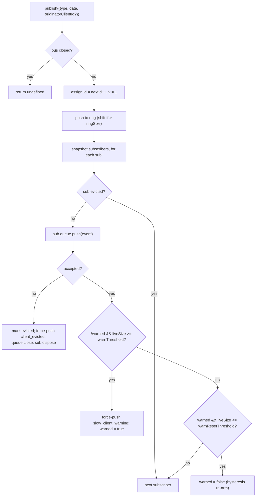

# SSE Event Bus とバックプレッシャー

## 概要

`EventBus`（`packages/acp-bridge/src/eventBus.ts`）は、セッションごとのインメモリ pub/sub であり、デーモンの `GET /session/:id/events` SSE ルートにイベントを供給します。各イベントに単調増加 id を割り当て、`Last-Event-ID` リプレイ用に最近のイベントを有界リングバッファに保持し、すべてのサブスクライバーへ公開されたイベントをファンアウトし、サブスクライバーごとのバックプレッシャー（キュー充填率 75% で警告、上限到達で排除）を適用し、SDK がファーストクラスのイベントとして扱う 2 つの合成ターミナルフレーム（`client_evicted`、`slow_client_warning`）を発行します。ただし、これらのフレームはバスによって **`id` なし** としてマークされるため、セッションごとのシーケンスのスロットを消費しません。

`EventBus` は現在 `acp-bridge` パッケージプライベートであり、セッションごとに 1 つのクローズドインスタンスを通じてブリッジファクトリーから利用されます。将来のリファクタリング（`eventBus.ts` の 150〜159 行目に記載）では、チャネル、デュアル出力、将来の WebSocket トランスポートが並列ストリームを実行する代わりに同じバスを通じてサブスクライブできるよう、トップレベルのビルディングブロックへ昇格される予定です。

## 責務

- セッションごとの単調増加イベント id を 1 から割り当てる。
- `subscribe-with-lastEventId` 時のリプレイ用に、最新 `ringSize` 件のイベントをバッファリングする。
- 公開されたイベントを最大 `maxSubscribers` の同時サブスクライバーへファンアウトする。
- サブスクライバーごとの有界キューを適用し、オーバーフローしたサブスクライバーを合成 `client_evicted` ターミナルフレームでドロップする。
- キュー充填率 75% でオーバーフローエピソードごとに 1 回 `slow_client_warning` を発行し、繰り返しの警告を防ぐため 37.5% のヒステリシスを設ける。
- `AbortSignal.abort()` 発生時にサブスクリプションを速やかに解除する。
- バスクローズ時（例：セッション終了）にすべてのサブスクライバーをクリーンに閉じる。
- `publish` から例外を投げない（「publish は常に安全に呼び出せる」というコントラクト）。

## アーキテクチャ

| 定数                                   | 値          | 目的                                                                                               |
| -------------------------------------- | ----------- | -------------------------------------------------------------------------------------------------- |
| `EVENT_SCHEMA_VERSION`                 | `1`         | すべての `BridgeEvent.v` にスタンプされる。フレームの破壊的変更時にインクリメントされる。          |
| `DEFAULT_RING_SIZE`                    | `8000`      | セッションごとのリプレイリング。`--event-ring-size` でオペレーターが上書き可能。                   |
| `DEFAULT_MAX_QUEUED`                   | `256`       | サブスクライバーごとのバックログ上限。                                                             |
| `DEFAULT_MAX_SUBSCRIBERS`              | `64`        | セッションごとのサブスクライバー上限。                                                             |
| `WARN_THRESHOLD_RATIO`                 | `0.75`      | `slow_client_warning` をトリガーする `maxQueued` に対する割合。                                    |
| `WARN_RESET_RATIO`                     | `0.375`     | ヒステリシスの再アーム割合。                                                                       |
| `MAX_EVENT_RING_SIZE`（`bridge.ts` 内）| `1_000_000` | タイポによるメモリ不足を防ぐための `BridgeOptions.eventRingSize` のソフト上限。                    |

### `BridgeEvent`

```ts
interface BridgeEvent {
  id?: number; // monotonic per session; absent on synthetic terminal frames
  v: 1; // EVENT_SCHEMA_VERSION
  type: string; // one of the 43 known types or future-extensible
  data: unknown; // payload (typed per-type by the SDK; see 09-event-schema.md)
  originatorClientId?: string; // set when the event derives from a clientId-stamped request
}
```

### `SubscribeOptions`

```ts
interface SubscribeOptions {
  lastEventId?: number; // replay from after this id (Last-Event-ID resume)
  signal?: AbortSignal; // aborts the subscription promptly
  maxQueued?: number; // per-subscriber backlog cap; default 256
}
```

`subscribe()` は `AsyncIterable<BridgeEvent>` を返します。SSE ルートは `for await` でこれを消費します。登録は **同期的** です — `subscribe()` が返った時点でサブスクライバーはすでにアタッチされているため、コンシューマーの最初の `next()` と競合する `publish()` もデリバリーされます。

### `BoundedAsyncQueue`

サブスクライバーごとのキューです。重要な動作が 2 つあります。

- **ライブ上限はライブアイテムのみに適用される。** `forcePush()` で挿入されたアイテムはエントリーごとに `forced: true` タグを持ち、`maxSize` にカウントされません。これにより、`Last-Event-ID` リプレイパスが何百もの過去フレームを新しいサブスクライバーへ強制プッシュしても、直ちにライブ上限を超えて再開直後のサブスクライバーが排除されることを防ぎます。
- **`liveCount` はフィールドとして管理される**（`forcedInBuf` ポジションからの導出ではない）。以前のポジションベースのヒューリスティックは、`slow_client_warning` がストリーム途中で強制プッシュを開始したときに壊れました（警告はリプレイのようにキューの先頭ではなく、**末尾**に追加されます）。エントリーごとの `forced` タグはポジション非依存です。

`push(value)` はライブバックログが上限に達した場合に（ブロックや例外ではなく）`false` を返します — バスはこのシグナルを受けてサブスクライバーを排除します。`forcePush(value)` は上限をバイパスします。`close({drain?: boolean})` はデフォルトで保留中のアイテムをドレインします。アボートパスは `drain: false` を渡して即座にドロップします。

## ワークフロー

### Publish



`publish` は例外を投げません。バスのシャットダウン中（シャットダウンパスは `channel.kill()` を await する前にセッションごとのバスをクローズします）に `publish` を呼び出しても、例外ではなく `undefined` を返します。これは、バスクローズとチャネルキルの間の短い窓で、エージェントがまだ `sessionUpdate` 通知を発行する可能性があるためです。

### Subscribe + リプレイ（リングエビクション検出あり）

```mermaid
sequenceDiagram
    autonumber
    participant SR as SSE route
    participant EB as EventBus
    participant Q as BoundedAsyncQueue

    SR->>EB: subscribe({lastEventId: 42, maxQueued: 256, signal})
    EB->>EB: refuse if subs.size >= maxSubscribers<br/>(throws SubscriberLimitExceededError)
    EB->>Q: new BoundedAsyncQueue(256)
    EB->>EB: subs.add(sub)
    EB->>EB: epochReset = lastEventId >= nextId
    alt epochReset (old bus epoch)
        EB->>Q: forcePush state_resync_required<br/>{ reason: 'epoch_reset', lastDeliveredId: 42, earliestAvailableId: ring[0]?.id ?? nextId }
        Note over EB,Q: id-less synthetic, frame goes BEFORE replay.<br/>Replay scans the whole current ring.
    else same bus epoch
        EB->>EB: earliestInRing = ring[0]?.id
        opt earliestInRing > lastEventId + 1 (gap evicted)
            EB->>Q: forcePush state_resync_required<br/>{ reason: 'ring_evicted', lastDeliveredId: 42, earliestAvailableId: earliestInRing }
            Note over EB,Q: id-less synthetic, frame goes BEFORE replay.<br/>Stream stays open; SDK reducer flips awaitingResync.
        end
    end
    loop ring scan
        EB->>EB: for e in ring where e.id > (epochReset ? 0 : 42)
        EB->>Q: forcePush(e)
    end
    EB->>EB: attach AbortSignal listener<br/>(onAbort → queue.close({drain:false}); dispose)
    EB-->>SR: AsyncIterable
    SR->>Q: next() in for-await loop
```

サブスクライブ時に `subs.size >= maxSubscribers` の場合、`SubscriberLimitExceededError` がスローされます — SSE ルートはこれをキャッチし、拒否されたクライアントに `stream_error` 合成フレームをシリアライズして返すため、クライアントが無言の空ストリームを受け取ることはありません。代わりに空のイテラブルを返すと、負荷下で「一部のクライアントはイベントを受け取れるが、他は受け取れない」状況をオペレーターが把握できなくなります。

### リングエビクション → `state_resync_required`（リカバリーフロー）

コンシューマーが `Last-Event-ID: N` で再接続したとき、リングの最古のサバイバルイベントが `id > N + 1` を持つ場合、`[N+1, earliestInRing-1]` の範囲のイベントはコンシューマーの再接続前にエビクトされています。単純なリプレイは非連続なサフィックスでサイレントに成功し、SDK リデューサーはストリームが連続しているかのようにデルタを適用し続け、その状態はデーモンの実態と乖離します — ターミナルシグナルも発生しません。

`EventBus.subscribe()` での実装：

1. まず `opts.lastEventId >= this.nextId` を確認します。真の場合、クライアントカーソルは古いバスエポック（デーモン再起動 / EventBus の再構築）のものであるため、バスは `reason: 'epoch_reset'` を発行し、現在のリング全体をリプレイします。
2. それ以外の場合は `earliestInRing = this.ring[0]?.id` を計算します。
3. `earliestInRing > opts.lastEventId + 1` の場合、リプレイフレームの**前**に合成フレームを強制プッシュします：
   ```jsonc
   {
     "v": 1,
     "type": "state_resync_required",
     "data": {
       "reason": "ring_evicted",
       "lastDeliveredId": <opts.lastEventId>,
       "earliestAvailableId": <earliestInRing>
     }
   }
   ```
4. 通常のリプレイループを続行します。

重要なコントラクト（#4360 レビューで修正された点）：

- **`id` なし** — `client_evicted` と同じスロットなしパターンにより、他のサブスクライバーが観察するセッションごとの単調シーケンスのスロットを占有しません。
- **ストリームはオープンのまま** — `client_evicted`（真のターミナル）とは異なり、`state_resync_required` はリカバリー志向です。リプレイとライブフレームはその後も流れ続けます。
- **リデューサーは自動的にデルタをスキップする** — SDK 側は `awaitingResync = true` にフリップし、コンシューマーコードが `loadSession` を呼び出してフラグをクリアするまで、`state_resync_required`、ターミナルフレーム、フルステートスナップショットのみを適用します。`RESYNC_PASSTHROUGH_TYPES` については [`09-event-schema.md`](./09-event-schema.md) を参照してください。
- **ネットワーク効率的** — フレームはワイヤー上に残るため、SDK は後で「何を見逃したか」の差分を計算できます。追加の再接続サイクルは不要です。

### エビクションターミナルフロー

サブスクライバーのライブバックログが `maxQueued` にある状態で次の `push()` が `false` を返した場合：

1. `sub.evicted = true` にマークする。
2. `client_evicted` フレームを **`id` なし** で構築する — `{ v: 1, type: 'client_evicted', data: { reason: 'queue_overflow', droppedAfter: <last delivered id> } }`。
3. `queue.forcePush(evictionFrame)` でコンシューマーイテレーターに 1 つのターミナルフレームを届ける。
4. `queue.close()` でターミナルフレームの後にイテレーションが終了するようにする。
5. `sub.dispose()` を呼び出す — `subs` から削除し、`AbortSignal` リスナーをデタッチする。このクリーンアップなしでは、停止したコンシューマーのクロージャーが `AbortSignal` のガベージコレクションまで生き続けます。

### アボートフロー

`AbortSignal.abort()` → `onAbort()`：

1. `queue.close({drain: false})` — バッファされたアイテムをドロップし、SSE ルートが誰も聴いていないソケットへのイベントシリアライズを継続しないようにする。
2. `dispose()` — `disposed` フラグによって冪等。

サブスクライブ時にすでにアボート済みのシグナルは、イテレーターを返す前に `onAbort()` を同期的に呼び出します。

## 状態とライフサイクル

- `nextId` は 1 から始まり、インクリメントのみ行われます。`lastEventId` ゲッターは `nextId - 1` を返します。
- `ring` は有界です。満杯になるとシフトによるエビクションは O(n) です。`ringSize=8000` の場合、高負荷セッションでも数ミリ秒程度で、フレームごとのレイテンシバジェットを大きく下回ります。循環バッファへのリファクタリングは、プロファイリングでフラグが立つか、オペレーターが `--event-ring-size` を桁違いに増加させるまで延期されます。
- `close()` は `closed` をフリップし、すべてのサブスクライバーのキューを閉じ、`subs` をクリアします。以降の `publish()` / `subscribe()` はノーオペレーションになります（`publish` は undefined を返し、`subscribe` は `emptyAsyncIterable` を返します）。
- 各セッションは 1 つの `EventBus` を所有します。バスクローズは `channel.kill()` の前に発生するため、シャットダウン中のインフライト publish は例外ではなく undefined を返します。

## 依存関係

- `packages/acp-bridge/src/bridge.ts` で消費（`BridgeClient.sessionUpdate` / `BridgeClient.extNotification` → `events.publish(...)`）。
- `packages/cli/src/serve/server.ts` で消費（SSE ルートハンドラー → `events.subscribe(...)` で `BridgeEvent` を SSE ワイヤーフレームにフォーマット）。
- 再エクスポートシム：`packages/cli/src/serve/event-bus.ts` → `@qwen-code/acp-bridge/eventBus`。
- SDK コンシューマー：`packages/sdk-typescript/src/daemon/sse.ts`（`parseSseStream`）、その後 `asKnownDaemonEvent`（[`09-event-schema.md`](./09-event-schema.md)、[`13-sdk-daemon-client.md`](./13-sdk-daemon-client.md) 参照）。

## 設定

- `--event-ring-size <n>` — セッションごとのリング深度。`MAX_EVENT_RING_SIZE = 1_000_000` でソフトキャップ。
- `GET /session/:id/events` の `?maxQueued=N` クエリパラメーター。範囲は `[16, 2048]`。SDK クライアントはオプトイン前に `caps.features.slow_client_warning` を事前確認します。
- `BridgeOptions.eventRingSize`（組み込み利用時にデーモンデフォルトを上書き）。
- ケイパビリティタグ：`session_events`、`slow_client_warning`、`typed_event_schema`。

## 注意事項と既知の制限

- **合成フレームには `id` がない。** `Last-Event-ID` レジュームを使用する SDK コンシューマーは id 付きフレームのみを記録します。`slow_client_warning`、`client_evicted`、`state_resync_required`、`replay_complete` はカーソルを進めず、セッションごとのシーケンス番号を消費しません。id 付きのライブフレーム間に実際のギャップがある場合は、プライベート合成フレームとして扱うのではなく、リングエビクション / エポックリセットの再同期パスを通じて処理してください。
- `client_evicted` は**サブスクライバーごと**であり、セッションごとではありません。同じクライアントは再接続できます。
- `BoundedAsyncQueue` イテレーターは**並行ドライバーには安全ではありません** — 2 つの同時 `.next()` 呼び出しは同じイベントを巡って競合します。デーモンの使用は順次的（SSE ルートハンドラーの `for await ... of`）なので、本番環境では安全です。
- バスは現在パッケージプライベートです。チャネルと Web UI は、バスに直接アクセスするのではなく、デーモンの HTTP SSE ルートを通じてサブスクライブする必要があります。Stage 1.5 でこれが解消される予定です。

## 参照

- `packages/acp-bridge/src/eventBus.ts`（ファイル全体）
- `packages/acp-bridge/src/bridge.ts`（publish サイト、特に `BridgeClient.sessionUpdate` と F3 パーミッションイベント）
- `packages/cli/src/serve/server.ts`（SSE ルートハンドラー — `BridgeEvent` をワイヤー SSE にフォーマット）
- `packages/sdk-typescript/src/daemon/sse.ts`（クライアント側の SSE ワイヤーパーサー）
- ワイヤーリファレンス：[`../qwen-serve-protocol.md`](../qwen-serve-protocol.md)（`Last-Event-ID` 再接続コントラクト）
