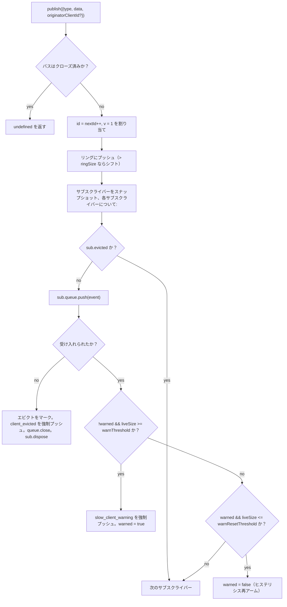

# SSE Event Bus とバックプレッシャー

## 概要

`EventBus`（`packages/acp-bridge/src/eventBus.ts`）は、デーモンの `GET /session/:id/events` SSE ルートにデータを提供する、セッションごとのインメモリ pub/sub です。各イベントに単調増加の ID を割り当て、最近のイベントを有界リングバッファにバッファリングして `Last-Event-ID` によるリプレイを可能にし、公開されたイベントをすべてのサブスクライバーにファンアウトし、サブスクライバーごとのバックプレッシャーを適用し（キューが 75% 埋まると警告、上限に達するとエビクション）、2 つの合成ターミナルフレーム（`client_evicted`、`slow_client_warning`）を出力します。これらは SDK では一等イベントとして扱われますが、バスでは **`id` なし** としてマークされるため、セッションごとのシーケンスのスロットを消費しません。

`EventBus` は現在 `acp-bridge` に対してパッケージプライベートであり、ブリッジファクトリーによってセッションごとに1つのクロージャインスタンスを介して消費されます。将来のリファクタリング（`eventBus.ts` の 150～159 行目で言及）では、これをトップレベルのビルディングブロックに昇格させ、チャネル、デュアル出力、および将来の WebSocket トランスポートが並列ストリームを実行するのではなく、同じバスを介してサブスクライブできるようにする予定です。

## 責務

- セッションごとの単調増加イベント ID を 1 から割り当てます。
- 最後の `ringSize` 個のイベントをバッファリングし、`lastEventId` を指定したサブスクライブ時のリプレイに使用します。
- 公開されたイベントを、最大 `maxSubscribers` 人の同時サブスクライバーにファンアウトします。
- サブスクライバーごとの有界キューを適用し、オーバーフローしたサブスクライバーを合成ターミナルフレーム `client_evicted` でドロップします。
- オーバーフロー発生時にキューが 75% 埋まった時点で `slow_client_warning` を 1 回出力し、37.5% のヒステリシスによって警告が繰り返されるのを防ぎます。
- `AbortSignal.abort()` 時にサブスクリプションを速やかに破棄します。
- バス終了時（セッションの teardown など）にすべてのサブスクライバーをクリーンにクローズします。
- `publish` から決してスローしません（契約は「publish は常に安全に呼び出せる」です）。

## アーキテクチャ

| 定数                                   | 値          | 目的                                                                                               |
| -------------------------------------- | ----------- | -------------------------------------------------------------------------------------------------- |
| `EVENT_SCHEMA_VERSION`                 | `1`         | 各 `BridgeEvent.v` にスタンプされます。破壊的なフレーム変更時にインクリメントされます。             |
| `DEFAULT_RING_SIZE`                    | `8000`      | セッションごとのリプレイリング。オペレーターは `--event-ring-size` でオーバーライド可能です。       |
| `DEFAULT_MAX_QUEUED`                   | `256`       | サブスクライバーごとのバックログ上限。                                                             |
| `DEFAULT_MAX_SUBSCRIBERS`              | `64`        | セッションごとのサブスクライバー上限。                                                             |
| `WARN_THRESHOLD_RATIO`                 | `0.75`      | `maxQueued` に対する `slow_client_warning` のトリガー割合。                                        |
| `WARN_RESET_RATIO`                     | `0.375`     | ヒステリシスの再アーム割合。                                                                       |
| `MAX_EVENT_RING_SIZE`（`bridge.ts` 内）| `1_000_000` | typo による out-of-memory 障害を検出するための、`BridgeOptions.eventRingSize` のソフト上限。        |

### `BridgeEvent`

```ts
interface BridgeEvent {
  id?: number; // セッションごとに単調増加。合成ターミナルフレームでは欠落します
  v: 1; // EVENT_SCHEMA_VERSION
  type: string; // 既知の 47 種類のいずれか、または将来拡張可能
  data: unknown; // ペイロード（SDK によって型ごとに型付けされます。09-event-schema.md を参照）
  _meta?: { serverTimestamp?: number; [key: string]: unknown }; // EventBus.publish によってスタンプされます
  originatorClientId?: string; // イベントが clientId スタンプ付きのリクエストから派生した場合に設定されます
}
```

### `SubscribeOptions`

```ts
interface SubscribeOptions {
  lastEventId?: number; // この ID の後からリプレイ（Last-Event-ID による再開）
  signal?: AbortSignal; // サブスクリプションを速やかに中止します
  maxQueued?: number; // サブスクライバーごとのバックログ上限。デフォルトは 256
}
```

`subscribe()` は `AsyncIterable<BridgeEvent>` を返します。SSE ルートはこれを `for await` で消費します。登録は**同期的**です。`subscribe()` が返る時点ではすでにサブスクライバーがアタッチされているため、コンシューマーの最初の `next()` と競合する `publish()` でも確実に配信されます。

### `BoundedAsyncQueue`

サブスクライバーごとのキュー。2 つの重要な動作があります:

- **ライブキャップはライブアイテムにのみ適用されます。** `forcePush()` を介して挿入されたアイテムはエントリごとに `forced: true` タグを持ち、`maxSize` には決してカウントされません。これにより、`Last-Event-ID` リプレイパスは、ライブキャップに即座に抵触して再開したばかりのサブスクライバーをエビクトすることなく、数百の履歴フレームを新しいサブスクライバーに強制的にプッシュできます。
- **`liveCount` はフィールドとして維持され**、`forcedInBuf` の位置から派生しません。以前の位置ベースのヒューリスティックは、`slow_client_warning` がストリーム途中で強制プッシュを開始したときに壊れました（警告はリプレイのようなフロントではなく、キューの BACK に送られます）。エントリごとの `forced` タグは位置に依存しません。

`push(value)` は、ライブバックログが上限に達している場合、ブロックやスローの代わりに `false` を返します。バスはこのシグナルを使用してサブスクライバーをエビクトします。`forcePush(value)` は上限をバイパスします。`close({drain?: boolean})` はデフォルトで保留中のアイテムをドレインします。中止パスは `drain: false` を渡してそれらを即座にドロップします。

## ワークフロー

### Publish



`publish` は決してスローしません。publish の途中でバスをクローズしても（シャットダウンパスは `channel.kill()` を await する前にセッションごとのバスをクローズします）、エージェントがバス クローズとチャネル kill の間のわずかなウィンドウで `sessionUpdate` 通知をまだ発行している可能性があるため、スローする代わりに `undefined` を返します。

### Subscribe + replay（リングエビクション検出付き）

```mermaid
sequenceDiagram
    autonumber
    participant SR as SSE ルート
    participant EB as EventBus
    participant Q as BoundedAsyncQueue

    SR->>EB: subscribe({lastEventId: 42, maxQueued: 256, signal})
    EB->>EB: subs.size >= maxSubscribers なら拒否<br/>（SubscriberLimitExceededError をスロー）
    EB->>Q: new BoundedAsyncQueue(256)
    EB->>EB: subs.add(sub)
    EB->>EB: epochReset = lastEventId >= nextId
    alt epochReset（古いバスエポック）
        EB->>Q: state_resync_required を強制プッシュ<br/>{ reason: 'epoch_reset', lastDeliveredId: 42, earliestAvailableId: ring[0]?.id ?? nextId }
        Note over EB,Q: ID なしの合成フレーム。リプレイの前にフレームが挿入される。<br/>リプレイは現在のリング全体をスキャンする。
    else 同じバスエポック
        EB->>EB: earliestInRing = ring[0]?.id
        opt earliestInRing > lastEventId + 1（ギャップがエビクトされた）
            EB->>Q: state_resync_required を強制プッシュ<br/>{ reason: 'ring_evicted', lastDeliveredId: 42, earliestAvailableId: earliestInRing }
            Note over EB,Q: ID なしの合成フレーム。リプレイの前にフレームが挿入される。<br/>ストリームはオープンされたまま。SDK リデューサーは awaitingResync を反転させる。
        end
    end
    loop リングスキャン
        EB->>EB: for e in ring where e.id > (epochReset ? 0 : 42)
        EB->>Q: forcePush(e)
    end
    EB->>EB: AbortSignal リスナーをアタッチ<br/>（onAbort → queue.close({drain:false}); dispose）
    EB-->>SR: AsyncIterable
    SR->>Q: for-await ループで next()
```

サブスクライブ時に `subs.size >= maxSubscribers` の場合、`SubscriberLimitExceededError` がスローされます。SSE ルートはこれをキャッチし、拒否されたクライアントに `stream_error` 合成フレームをシリアライズして、サイレントな空ストリームを見せないようにします。代わりに空のイテラブルを返すと、負荷が高い場合に「イベントを受け取るクライアントと受け取らないクライアントがいる」という状況についてオペレーターが可視化できなくなります。

### リングエビクション → `state_resync_required`（リカバリーフロー）

コンシューマーが `Last-Event-ID: N` で再接続し、リングの存続する最古のイベントの `id > N + 1` である場合、`[N+1, earliestInRing-1]` のイベントはコンシューマーの再接続前にエビクトされています。単純なリプレイは非連続なサフィックスでサイレントに成功してしまい、SDK リデューサーはストリームが連続しているかのようにデルタを適用し続け、その状態はデーモンの真実から乖離してしまいます。そしてターミナルシグナルはありません。

`EventBus.subscribe()` に実装されています:

1. まず `opts.lastEventId >= this.nextId` をチェックします。true の場合、クライアントのカーソルは古いバスエポック（デーモンの再起動 / EventBus の再構築）からのものなので、バスは `reason: 'epoch_reset'` を出力し、現在のリング全体をリプレイします。
2. それ以外の場合、`earliestInRing = this.ring[0]?.id` を計算します。
3. `earliestInRing > opts.lastEventId + 1` の場合、リプレイフレームの**前**に合成フレームを強制プッシュします:
   ```jsonc
   {
     "v": 1,
     "type": "state_resync_required",
     "data": {
       "reason": "ring_evicted",
       "lastDeliveredId": <opts.lastEventId>,
       "earliestAvailableId": <earliestInRing>
     }
   }
   ```
4. その後、通常のリプレイループを続行します。

重要な契約（および #4360 レビューで修正された内容）:

- **`id` なし** — `client_evicted` と同じノーロットパターンであり、他のサブスクライバーが観察するセッションごとの単調シーケンスのスロットを占有しません。
- **ストリームはオープンされたまま** — `client_evicted`（真にターミナル）とは異なり、`state_resync_required` はリカバリー志向です。リプレイとライブフレームはその後も流れ続けます。
- **リデューサーがデルタを自動スキップ** — SDK 側は `awaitingResync = true` に反転させ、コンシューマーコードが `loadSession` を呼び出してフラグをクリアするまで、`state_resync_required`、ターミナルフレーム、およびフルステートスナップショットのみを適用します。`RESYNC_PASSTHROUGH_TYPES` については [`09-event-schema.md`](./09-event-schema.md) を参照してください。
- **ネットワークフレンドリー** — フレームはワイヤ上に残るため、SDK は後で「見逃したもの」の差分を計算できます。追加の再接続サイクルは必要ありません。

### エビクションターミナルフロー

サブスクライバーのライブバックログが `maxQueued` に達し、次の `push()` が `false` を返したとき:

1. `sub.evicted = true` をマークします。
2. **`id` なし**で `client_evicted` フレームを構築します — `{ v: 1, type: 'client_evicted', data: { reason: 'queue_overflow', droppedAfter: <last delivered id> } }`。
3. `queue.forcePush(evictionFrame)` を実行し、コンシューマーイテレーターが 1 つのターミナルフレームを見るようにします。
4. `queue.close()` を実行し、ターミナルフレームの後にイテレーションが巻き戻るようにします。
5. `sub.dispose()` を呼び出します。これにより `subs` から削除され、`AbortSignal` リスナーがデタッチされます。このクリーンアップがないと、停滞したコンシューマーのクロージャは `AbortSignal` のガベージコレクションまでライブのままになります。

### 中止フロー

`AbortSignal.abort()` → `onAbort()`:

1. `queue.close({drain: false})` — バッファされたアイテムをドロップし、SSE ルートが誰もリッスンしていないソケットにイベントをシリアライズし続けないようにします。
2. `dispose()` — `disposed` フラグにより冪等になります。

サブスクライブ時にすでに中止済みのシグナルは、イテレーターを返す前に同期的に `onAbort()` を呼び出します。

## 状態とライフサイクル

- `nextId` は 1 から始まり、増加し続けます。`lastEventId` ゲッターは `nextId - 1` を返します。
- `ring` は有界であり、フルになるとシフトによるエビクションは O(n) になります。`ringSize=8000` の場合、高ボリュームのセッションで数ミリ秒で計測され、フレームごとのレイテンシ予算を十分に下回ります。循環バッファへのリファクタリングは、プロファイリングでフラグが立つか、オペレーターが `--event-ring-size` を桁違いに増加させるまで延期されます。
- `close()` は `closed` を反転させ、すべてのサブスクライバーのキューをクローズし、`subs` をクリアします。その後の `publish()` / `subscribe()` はノーオペレーションになります（`publish` は undefined を返し、`subscribe` は `emptyAsyncIterable` を返します）。
- 各セッションは 1 つの `EventBus` を所有します。バスのクローズは `channel.kill()` の前に行われるため、シャットダウン中の実行中の publish はスローする代わりに undefined を返します。

## 依存関係

- `packages/acp-bridge/src/bridge.ts` によって消費されます（`BridgeClient.sessionUpdate` / `BridgeClient.extNotification` → `events.publish(...)`）。
- `packages/cli/src/serve/routes/sse-events.ts` によって消費されます（SSE ルートハンドラー → `events.subscribe(...)` の後、`BridgeEvent` を SSE ワイヤフレームにフォーマット）。
- CLI コンシューマーは `@qwen-code/acp-bridge/eventBus` からイベントバスを直接インポートします。
- SDK コンシューマー: `packages/sdk-typescript/src/daemon/sse.ts`（`parseSseStream`）、次に `asKnownDaemonEvent`（[`09-event-schema.md`](./09-event-schema.md)、[`13-sdk-daemon-client.md`](./13-sdk-daemon-client.md) を参照）。

## 設定

- `--event-ring-size <n>` — セッションごとのリングの深さ。`MAX_EVENT_RING_SIZE = 1_000_000` でソフトキャップされます。
- サブスクライバーの `GET /session/:id/events` に対する `?maxQueued=N` クエリパラメータ。範囲は `[16, 2048]`。SDK クライアントはオプトインする前に `caps.features.slow_client_warning` をプリフライトします。
- `BridgeOptions.eventRingSize`（組み込み使用のためにデーモンのデフォルトをオーバーライド）。
- ケイパビリティタグ: `session_events`, `slow_client_warning`, `typed_event_schema`。

## クライアント統合: `Last-Event-ID` 再接続

### ワイヤフォーマット

`GET /session/:id/events` によって出力される ID を持つすべての SSE フレームには `id:` 行が含まれます:

```
id: 42
event: session_update
data: {"id":42,"v":1,"type":"session_update","data":{...},"_meta":{"serverTimestamp":1719000000000}}

```

合成/ターミナルフレーム（`state_resync_required`, `replay_complete`, `client_evicted`, `slow_client_warning`, `stream_error`）は `id:` 行**なし**で出力されます。これらはセッションごとの単調シーケンスを進めません。

### 再接続プロトコル

クライアントが切断後に再接続する際、最後に正常に受信したイベント ID を `Last-Event-ID` HTTP ヘッダーとして送信します:

```
GET /session/:id/events HTTP/1.1
Last-Event-ID: 42
Accept: text/event-stream
```

デーモンの `EventBus` は、リングバッファから `id > Last-Event-ID` であるすべてのイベントをリプレイし、その後ライブ配信に移行します。`replay_complete` 合成フレームがリプレイとライブの境界をマークします:

```jsonc
// id: 行なし — 合成フレーム
{
  "v": 1,
  "type": "replay_complete",
  "data": { "replayedCount": 7, "lastReplayedEventId": 49 },
}
```

### リプレイの動作

| シナリオ                                     | 動作                                                                                                                                                        |
| -------------------------------------------- | --------------------------------------------------------------------------------------------------------------------------------------------------------------- |
| `Last-Event-ID` なし                         | ライブのみのストリーム。リプレイなし。再開前のクライアントと後方互換性があります。                                                                                       |
| `Last-Event-ID: 0`                           | リングバッファ全体を最初からリプレイします（`--event-ring-size` で制限され、デフォルトは 8000）。                                                                    |
| `Last-Event-ID: N` （`ring[0].id <= N+1` の場合） | `id > N` のイベントを連続的にリプレイし、その後ライブに移行します。                                                                                                                |
| `Last-Event-ID: N` （`ring[0].id > N+1` の場合）  | ギャップが検出されました — 存続するサフィックスのリプレイの前に `state_resync_required`（`reason: 'ring_evicted'`）が出力されます。SDK はフルステートをリカバリーするために `loadSession` を呼び出す必要があります。 |
| `Last-Event-ID: N` （`N >= nextId` の場合）       | エポックリセット（デーモンの再起動） — `state_resync_required`（`reason: 'epoch_reset'`）が出力され、その後リング全体がリプレイされます。                                                |

### バリデーションルール

デーモンは `Last-Event-ID` を厳密にパースします:

- 純粋な 10 進数字の文字列のみが受け入れられます（例: `"42"`）。
- 非数値、負の数、小数、またはオーバーフローした値（`Number.MAX_SAFE_INTEGER` を超える）はサイレントに拒否されます。ストリームはライブのみで開始され、デーモンはパンくずログを記録します。
- `retry: 3000` ディレクティブは、準拠する `EventSource` 実装に再接続前に 3 秒待機するように指示します。

### 後方互換性

`Last-Event-ID` メカニズムは完全にオプトインです:

- ヘッダーを送信しないクライアントは、再開前の動作と同じライブのみのストリームを受け取ります。
- イベント ID を追跡しない古い SDK バージョンも引き続き動作します。
- `replay_complete` フレームは合成（`id:` なし）であるため、ID を認識しないコンシューマーを混乱させません。

### ブラウザの `EventSource` の制限

ネイティブのブラウザ `EventSource` API は、最後の `id:` フィールドを自動的に追跡し、再接続時に送信します。しかし、カスタムヘッダー（例: `Authorization: Bearer`）を**設定できません**。認証を必要とするクライアントは、`EventSource` ではなく、生の `fetch()` と手動の SSE パース（TypeScript SDK が `parseSseStream` を介して行うように）を使用する必要があります。SDK の `RestSseTransport` はこのパターンを示しており、`fetch()` 呼び出しで `Last-Event-ID` を明示的な HTTP ヘッダーとして設定します。

## 注意事項と既知の制限

- **合成フレームには `id` がありません。** `Last-Event-ID` 再開を使用する SDK コンシューマーは ID を持つフレームのみを記録します。`slow_client_warning`、`client_evicted`、`state_resync_required`、および `replay_complete` はカーソルを進めず、セッションごとのシーケンス番号を消費しません。ID を持つ 2 つのライブフレーム間に実際のギャップがある場合は、それをプライベートな合成フレームとして扱うのではなく、リングエビクション / エポックリセットの再同期パスを通じて処理します。
- `client_evicted` はセッションごとではなく、**サブスクライバーごと**です。同じクライアントが再接続できます。
- `BoundedAsyncQueue` イテレーターは**同時ドライバーに対して安全ではありません**。2 つの同時 `.next()` 呼び出しは同じイベントをめぐって競合します。デーモンの使用は順次（SSE ルートハンドラー内の `for await ... of`）であるため、本番環境では安全です。
- バスは現在パッケージプライベートです。チャネルと Web UI は、バスに直接アクセスするのではなく、デーモンの HTTP SSE ルートを介してサブスクライブする必要があります。ステージ 1.5 でこれが解除されます。

## 参考文献

- `packages/acp-bridge/src/eventBus.ts`（ファイル全体）
- `packages/acp-bridge/src/bridge.ts`（publish サイト、特に `BridgeClient.sessionUpdate` と F3 権限イベント）
- `packages/cli/src/serve/routes/sse-events.ts`（SSE ルートハンドラー — `BridgeEvent` をワイヤ SSE にフォーマット）
- `packages/sdk-typescript/src/daemon/sse.ts`（クライアント側の SSE ワイヤパーサー）
- ワイヤリファレンス: [`../qwen-serve-protocol.md`](../qwen-serve-protocol.md)（`Last-Event-ID` 再接続契約）。