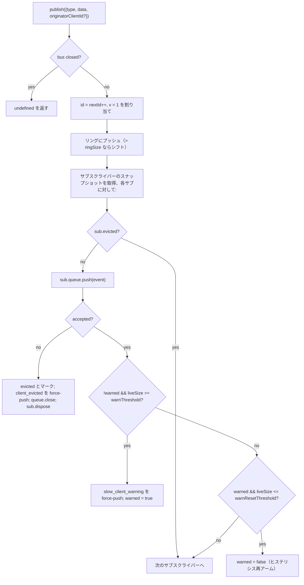

# SSE イベントバス & バックプレッシャー

## 概要

`EventBus` (`packages/acp-bridge/src/eventBus.ts`) は、セッション単位のインメモリ pub/sub 機構で、デーモンの `GET /session/:id/events` SSE ルートにデータを供給します。各イベントに単調増加する ID を割り当て、直近のイベントを有界リングバッファに保持して `Last-Event-ID` によるリプレイを可能にし、発行されたイベントを全サブスクライバーにファンアウトします。サブスクライバーごとにバックプレッシャーを適用し（キュー使用率 75% で警告、上限に達すると追放）、さらに 2 種類の合成終端フレーム（`client_evicted`、`slow_client_warning`）を送出します。これらは SDK からは通常のイベントとして扱われますが、バスでは **`id` なし** でマークされるため、セッション内のシーケンス番号を消費しません。

`EventBus` は現在 `acp-bridge` パッケージの package-private であり、ブリッジファクトリから各セッションにクローズドなインスタンスとして利用されます。将来のリファクタリング（`eventBus.ts` の 150–159 行で言及）では、トップレベルのビルディングブロックに昇格し、チャネル、デュアル出力、将来の WebSocket トランスポートが並列ストリームを実行する代わりに同じバスを購読できるようにする予定です。

## 責務

- セッションごとに 1 から始まる単調増加のイベント ID を割り当てる。
- 直近 `ringSize` 個のイベントをリングバッファに保持し、`lastEventId` 指定での購読時にリプレイする。
- 発行されたイベントを最大 `maxSubscribers` の同時サブスクライバーにファンアウトする。
- サブスクライバーごとに有界キューを適用し、あふれたサブスクライバーには合成 `client_evicted` 終端フレームを送信して追放する。
- キュー使用率 75% で `slow_client_warning` を 1 回送出し、警告の再発防止のために 37.5% のヒステリシスを設ける。
- `AbortSignal.abort()` による購読の迅速な解除を行う。
- バスクローズ時（例：セッション終了）に全てのサブスクライバーをクリーンにクローズする。
- `publish` からは決してスローしない（契約: "publish は常に安全に呼び出せる"）。

## アーキテクチャ

| 定数                                  | 値          | 目的                                                                 |
| ------------------------------------- | ----------- | -------------------------------------------------------------------- |
| `EVENT_SCHEMA_VERSION`                | `1`         | 全ての `BridgeEvent.v` に付与。フレーム構造の破壊的変更時に増加。   |
| `DEFAULT_RING_SIZE`                   | `8000`      | セッションごとのリプレイリングサイズ。`--event-ring-size` で上書き可能。 |
| `DEFAULT_MAX_QUEUED`                  | `256`       | サブスクライバーごとのバックログ上限。                                 |
| `DEFAULT_MAX_SUBSCRIBERS`             | `64`        | セッションごとのサブスクライバー上限。                                 |
| `WARN_THRESHOLD_RATIO`                | `0.75`      | `maxQueued` に対する `slow_client_warning` 発火割合。                |
| `WARN_RESET_RATIO`                    | `0.375`     | ヒステリシス再アーム割合。                                             |
| `MAX_EVENT_RING_SIZE` (`bridge.ts`)   | `1_000_000` | `BridgeOptions.eventRingSize` のソフト上限。タイプミスによるメモリ不足を防止。 |

### `BridgeEvent`

```ts
interface BridgeEvent {
  id?: number; // セッション内で単調増加。合成終端フレームでは欠落
  v: 1; // EVENT_SCHEMA_VERSION
  type: string; // 43 の既知タイプまたは将来拡張可能
  data: unknown; // ペイロード（SDK がタイプごとに型付け。09-event-schema.md 参照）
  originatorClientId?: string; // clientId が付与されたリクエスト由来のイベントに設定
}
```

### `SubscribeOptions`

```ts
interface SubscribeOptions {
  lastEventId?: number; // この ID 以降からリプレイ（Last-Event-ID 再開）
  signal?: AbortSignal; // 購読を迅速に中断
  maxQueued?: number; // サブスクライバーごとのバックログ上限。デフォルト 256
}
```

`subscribe()` は `AsyncIterable<BridgeEvent>` を返します。SSE ルートは `for await` でこれを消費します。登録は**同期的**です — `subscribe()` が返る時点でサブスクライバーは既にアタッチされているため、コンシューマーの最初の `next()` と競合する `publish()` も確実に配信されます。

### `BoundedAsyncQueue`

サブスクライバーごとのキュー。二つの重要な振る舞い:

- **ライブ上限はライブアイテムのみに適用される。** `forcePush()` で挿入されたアイテムはエントリごとに `forced: true` タグが付き、`maxSize` にカウントされません。これにより、`Last-Event-ID` リプレイパスが新規サブスクライバーに数百の履歴フレームを force-push しても、直ちにライブ上限に達して再開したばかりのサブスクライバーを追放することを防ぎます。
- **`liveCount` はフィールドとして管理され**、`forcedInBuf` の位置から導出されません。以前の位置ベースのヒューリスティックは、`slow_client_warning` がストリーム途中で force-push を開始した際に破綻しました（警告はキューの**後方**に追加され、リプレイのように前方には追加されません）。エントリごとの `forced` タグは位置に依存しません。

`push(value)` は、ライブバックログが上限に達している場合に `false` を返します（ブロックやスローはしません） — バスはこのシグナルを使用してサブスクライバーを追放します。`forcePush(value)` は上限を無視します。`close({drain?: boolean})` はデフォルトで保留中のアイテムをドレインします。中断パスでは `drain: false` を渡して即座に破棄します。

## ワークフロー

### パブリッシュ



`publish` は決してスローしません。パブリッシュ中にバスがクローズされた場合（シャットダウンパスでは `channel.kill()` を待つ前にセッションのバスをクローズします）は、スローする代わりに `undefined` を返します。これは、バスクローズからチャネルキルまでのわずかな間にエージェントが `sessionUpdate` 通知を発行する可能性があるためです。

### サブスクライブ + リプレイ（リング削除検出付き）

```mermaid
sequenceDiagram
    autonumber
    participant SR as SSE route
    participant EB as EventBus
    participant Q as BoundedAsyncQueue

    SR->>EB: subscribe({lastEventId: 42, maxQueued: 256, signal})
    EB->>EB: subs.size >= maxSubscribers なら拒否<br/>(SubscriberLimitExceededError をスロー)
    EB->>Q: new BoundedAsyncQueue(256)
    EB->>EB: subs.add(sub)
    EB->>EB: epochReset = lastEventId >= nextId
    alt epochReset（古いバス epoch）
        EB->>Q: forcePush state_resync_required<br/>{ reason: 'epoch_reset', lastDeliveredId: 42, earliestAvailableId: ring[0]?.id ?? nextId }
        Note over EB,Q: id なしの合成フレーム、リプレイより前に送出。<br/>リプレイは現在のリング全体をスキャン。
    else 同じバス epoch
        EB->>EB: earliestInRing = ring[0]?.id
        opt earliestInRing > lastEventId + 1（ギャップが削除された）
            EB->>Q: forcePush state_resync_required<br/>{ reason: 'ring_evicted', lastDeliveredId: 42, earliestAvailableId: earliestInRing }
            Note over EB,Q: id なしの合成フレーム、リプレイより前に送出。<br/>ストリームは開いたまま。SDK リデューサーは awaitingResync に遷移。
        end
    end
    loop リングスキャン
        EB->>EB: ring 内の e で e.id > (epochReset ? 0 : 42) のもの
        EB->>Q: forcePush(e)
    end
    EB->>EB: AbortSignal リスナーをアタッチ<br/>(onAbort → queue.close({drain:false}); dispose)
    EB-->>SR: AsyncIterable
    SR->>Q: for-await ループ内の next()
```

購読時に `subs.size >= maxSubscribers` の場合、`SubscriberLimitExceededError` がスローされます — SSE ルートはこれをキャッチし、拒否されたクライアントに `stream_error` 合成フレームをシリアライズするため、クライアントは空のストリームを黙って受け取ることはありません。代わりに空のイテラブルを返すと、負荷がかかった状態で「一部のクライアントはイベントを受け取り、一部は受け取らない」という状況をオペレーターが把握できなくなります。

### リング削除 → `state_resync_required`（復旧フロー）

コンシューマーが `Last-Event-ID: N` で再接続し、リング内で最も古い生存イベントの ID が `id > N + 1` の場合、`[N+1, earliestInRing-1]` のイベントはコンシューマーが再接続する前に削除されています。単純なリプレイは非連続な後続部分で暗黙に成功し、SDK リデューサーはストリームが連続しているかのようにデルタを適用し続け、デーモンの真実の状態から乖離します — しかも終端シグナルはありません。

`EventBus.subscribe()` での実装:

1. まず `opts.lastEventId >= this.nextId` をチェックします。真の場合、クライアントのカーソルは古いバス epoch（デーモン再起動 / EventBus 再構築）からのものであるため、バスは `reason: 'epoch_reset'` を送出し、現在のリング全体をリプレイします。
2. それ以外の場合は `earliestInRing = this.ring[0]?.id` を計算します。
3. `earliestInRing > opts.lastEventId + 1` の場合、リプレイフレームの**前に**合成フレームを force-push します:
   ```jsonc
   {
     "v": 1,
     "type": "state_resync_required",
     "data": {
       "reason": "ring_evicted",
       "lastDeliveredId": <opts.lastEventId>,
       "earliestAvailableId": <earliestInRing>
     }
   }
   ```
4. その後、通常のリプレイループを続行します。

重要な契約（#4360 のレビューで修正された点）:

- **`id` なし** — `client_evicted` と同じスロット消費なしのパターン。他のサブスクライバーが観測するセッション内の単調シーケンスのスロットを消費しません。
- **ストリームは開いたまま** — `client_evicted`（真に終端）とは異なり、`state_resync_required` は復旧志向です。リプレイとライブフレームはその後も流れ続けます。
- **リデューサーはデルタを自動スキップ** — SDK 側は `awaitingResync = true` にフラグを立て、コンシューマーコードが `loadSession` を呼び出してフラグをクリアするまで、`state_resync_required`、終端フレーム、および完全状態スナップショットのみを適用します。詳細は [`09-event-schema.md`](./09-event-schema.md) の `RESYNC_PASSTHROUGH_TYPES` を参照。
- **ネットワークフレンドリー** — フレームはワイヤー上に残るため、SDK は後で「見逃した差分」を計算したい場合に利用できます。追加の再接続サイクルは不要です。

### 追放終端フロー

サブスクライバーのライブバックログが `maxQueued` に達し、次の `push()` が `false` を返した場合:

1. `sub.evicted = true` をマーク。
2. `client_evicted` フレームを **`id` なし** で構築 — `{ v: 1, type: 'client_evicted', data: { reason: 'queue_overflow', droppedAfter: <最後に配信した ID> } }`。
3. `queue.forcePush(evictionFrame)` でコンシューマーイテレーターが終端フレームを 1 つ見られるようにする。
4. `queue.close()` でイテレーションが終端フレーム後に終了するようにする。
5. `sub.dispose()` を呼び出す — `subs` から削除し、`AbortSignal` リスナーをデタッチ。このクリーンアップがないと、ストールしたコンシューマーのクロージャーが `AbortSignal` のガベージコレクションまで生存し続けます。

### 中断フロー

`AbortSignal.abort()` → `onAbort()`:

1. `queue.close({drain: false})` — バッファされたアイテムを破棄し、SSE ルートが誰もリッスンしていないソケットにイベントをシリアライズし続けるのを防ぎます。
2. `dispose()` — `disposed` フラグにより冪等。

購読時に既に中断済みのシグナルは、イテレーターを返す前に同期的に `onAbort()` を呼び出します。

## 状態 & ライフサイクル

- `nextId` は 1 から始まり、増加のみします。`lastEventId` ゲッターは `nextId - 1` を返します。
- `ring` は有界で、一杯になるとシフトによる削除が O(n) で行われます。`ringSize=8000` の場合、高トラフィックセッションでも数ミリ秒のオーダーであり、フレームあたりのレイテンシ予算を十分に下回ります。循環バッファへのリファクタリングは、プロファイリングで問題が指摘されるか、オペレーターが `--event-ring-size` を桁違いに大きくするまで延期されます。
- `close()` は `closed` フラグを立て、各サブスクライバーのキューをクローズし、`subs` をクリアします。その後の `publish()` / `subscribe()` は何も行いません（`publish` は undefined を返し、`subscribe` は `emptyAsyncIterable` を返します）。
- 各セッションは 1 つの `EventBus` を所有します。バスクローズは `channel.kill()` の前に行われるため、シャットダウン中に進行中の publish はスローする代わりに undefined を返します。

## 依存関係

- `packages/acp-bridge/src/bridge.ts` から利用される（`BridgeClient.sessionUpdate` / `BridgeClient.extNotification` → `events.publish(...)`）。
- `packages/cli/src/serve/server.ts` から利用される（SSE ルートハンドラー → `events.subscribe(...)` して `BridgeEvent` を SSE ワイヤーフレームに整形）。
- 再エクスポートのシム: `packages/cli/src/serve/event-bus.ts` → `@qwen-code/acp-bridge/eventBus`。
- SDK コンシューマー: `packages/sdk-typescript/src/daemon/sse.ts`（`parseSseStream`）、その後 `asKnownDaemonEvent`（[`09-event-schema.md`](./09-event-schema.md)、[`13-sdk-daemon-client.md`](./13-sdk-daemon-client.md) 参照）。

## 設定

- `--event-ring-size <n>` — セッションごとのリング深度。ソフト上限は `MAX_EVENT_RING_SIZE = 1_000_000`。
- サブスクライバーの `?maxQueued=N` クエリパラメータ（`GET /session/:id/events` 用）、範囲 `[16, 2048]`。SDK クライアントは事前に `caps.features.slow_client_warning` を確認してからオプトインします。
- `BridgeOptions.eventRingSize`（埋め込み利用時のデーモンデフォルトを上書き）。
- 機能タグ: `session_events`、`slow_client_warning`、`typed_event_schema`。

## 注意事項と既知の制限

- **合成フレームには `id` がない。** `Last-Event-ID` で再開する SDK コンシューマーは ID を持つフレームのみを記録します。`slow_client_warning`、`client_evicted`、`state_resync_required`、`replay_complete` はカーソルを進めず、セッション内のシーケンス番号を消費しません。ID を持つ 2 つのライブフレーム間に実際のギャップがある場合は、プライベートな合成フレームとして扱うのではなく、リング削除 / epoch リセットの再同期パスで処理してください。
- `client_evicted` は**サブスクライバーごと**であり、セッションごとではありません。同じクライアントは再接続可能です。
- `BoundedAsyncQueue` のイテレーターは**複数の同時ドライバーに対して安全ではありません** — 2 つの同時 `.next()` 呼び出しは同じイベントを奪い合う可能性があります。デーモンでの使用は逐次的（SSE ルートハンドラーの `for await ... of`）であるため、本番環境では安全です。
- バスは現在 package-private です。チャネルや Web UI は、デーモンの HTTP SSE ルートを経由して購読する必要があり、バスに直接アクセスすることはできません。ステージ 1.5 でこの制限は解除される予定です。

## 参考資料

- `packages/acp-bridge/src/eventBus.ts`（ファイル全体）
- `packages/acp-bridge/src/bridge.ts`（publish サイト、特に `BridgeClient.sessionUpdate` と F3 権限イベント）
- `packages/cli/src/serve/server.ts`（SSE ルートハンドラー — `BridgeEvent` をワイヤー SSE に整形）
- `packages/sdk-typescript/src/daemon/sse.ts`（クライアント側の SSE ワイヤーパーサー）
- ワイヤーリファレンス: [`../qwen-serve-protocol.md`](../qwen-serve-protocol.md)（`Last-Event-ID` 再接続契約）