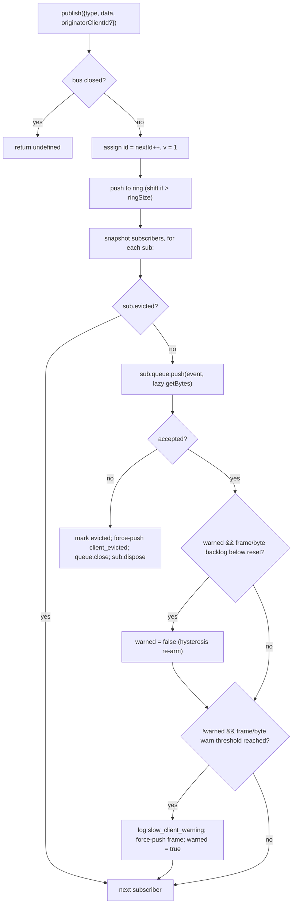

# SSE Event Bus と Backpressure

## 概要

`EventBus` (`packages/acp-bridge/src/eventBus.ts`) は、デーモンの `GET /session/:id/events` SSE ルートにデータを提供する、セッションごとのインメモリ pub/sub です。これは各イベントに単調増加の id を割り当て、最近のイベントを有界リングバッファに保持して `Last-Event-ID` によるリプレイを可能にします。また、公開されたイベントをすべてのサブスクライバーにファンアウトし、サブスクライバーごとのバックプレッシャーを適用し（ライブキューのフレーム数またはシリアライズ済みバイト数が 75% に達すると警告、上限に達するとエビクション）、さらにサブスクライバーローカルの合成フレーム（`client_evicted`, `slow_client_warning`）を出力します。SDK はこれらを第一級のイベントとして扱いますが、バスはこれらに **`id` を付けず**、セッションごとのシーケンスのスロットを消費しないようにします。

`EventBus` は現在 `acp-bridge` に対して package-private であり、ブリッジファクトリーによって、セッションごとにクロージャでキャプチャされた 1 つのインスタンスを介して消費されます。将来のリファクタリング（`eventBus.ts` の 150〜159 行目で言及されている）では、これがトップレベルのビルディングブロックに格上げされ、チャネル、デュアル出力、および将来の WebSocket トランスポートが並列ストリームを実行するのではなく、同じバスを介してサブスクライブできるようになります。

## 責務

- セッションごとの単調増加のイベント id を 1 から割り当てます。
- `lastEventId` を指定したサブスクライブ時のリプレイ用に、最後の `ringSize` 個のイベントをバッファリングします。
- 公開されたイベントを、最大 `maxSubscribers` 人の同時サブスクライバーにファンアウトします。
- サブスクライバーごとに有界キューを適用します。ライブフレームの上限またはライブシリアライズ済みバイト数の上限をオーバーフローしたサブスクライバーは、合成ターミナルフレーム `client_evicted` を使ってドロップ（切断）します。
- ライブフレームまたはライブシリアライズ済みバイト数が 75% に達したオーバーフローエピソードごとに 1 回 `slow_client_warning` を出力します。警告の繰り返しを防ぐため、37.5% のヒステリシスを適用します。
- `AbortSignal.abort()` 時に速やかにサブスクリプションを破棄します。
- バスクローズ時（セッションの teardown など）にすべてのサブスクライバーをクリーンにクローズします。
- `publish` から例外をスローしません（「publish は常に安全に呼び出せる」という契約です）。

## アーキテクチャ

| 定数                                   | 値          | 目的                                                                                                 |
| -------------------------------------- | ----------- | ---------------------------------------------------------------------------------------------------- |
| `EVENT_SCHEMA_VERSION`                 | `1`         | 各 `BridgeEvent.v` にスタンプされます。破壊的なフレーム変更時にインクリメントされます。              |
| `DEFAULT_RING_SIZE`                    | `8000`      | セッションごとのリプレイリング。オペレーターは `--event-ring-size` でオーバーライド可能です。        |
| `DEFAULT_MAX_QUEUED`                   | `256`       | サブスクライバーごとのライブフレームのバックログ上限。                                               |
| `DEFAULT_MAX_QUEUED_BYTES`             | `2 MiB`     | サブスクライバーごとのライブシリアライズ済みバイト数のバックログ上限。                               |
| `DEFAULT_MAX_SUBSCRIBERS`              | `64`        | セッションごとのサブスクライバー数の上限。                                                           |
| `WARN_THRESHOLD_RATIO`                 | `0.75`      | `maxQueued` または `maxQueuedBytes` に対する `slow_client_warning` のトリガーとなる割合。            |
| `WARN_RESET_RATIO`                     | `0.375`     | ヒステリシスの再アーム割合。                                                                         |
| `MAX_EVENT_RING_SIZE` (in `bridge.ts`) | `1_000_000` | 誤字による out-of-memory 障害を検出するための、`BridgeOptions.eventRingSize` のソフト上限。          |

### `BridgeEvent`

```ts
interface BridgeEvent {
  id?: number; // monotonic per session; absent on synthetic terminal frames
  v: 1; // EVENT_SCHEMA_VERSION
  type: string; // one of the 53 known types or future-extensible
  data: unknown; // payload (typed per-type by the SDK; see 09-event-schema.md)
  _meta?: { serverTimestamp?: number; [key: string]: unknown }; // stamped by EventBus.publish
  originatorClientId?: string; // set when the event derives from a clientId-stamped request
}
```

### `SubscribeOptions`

```ts
interface SubscribeOptions {
  lastEventId?: number; // replay from after this id (Last-Event-ID resume)
  signal?: AbortSignal; // aborts the subscription promptly
  maxQueued?: number; // per-subscriber live frame backlog cap; default 256
}
```

`subscribe()` は `AsyncIterable<BridgeEvent>` を返します。SSE ルートはこれを `for await` で消費します。登録は**同期的**に行われます。`subscribe()` が返る時点ではすでにサブスクライバーがアタッチされているため、コンシューマーの最初の `next()` と競合する `publish()` でも確実に配信されます。

ライブバイト数上限は、テストや組み込み呼び出し元専用のバスレベルコンストラクタオプションです。クライアントがデーモンのメモリ予算を増やせないようにするため、HTTP クエリパラメータ、SDK オプション、CLI フラグ、またはケイパビリティとしては公開されません。

### `BoundedAsyncQueue`

サブスクライバーごとのキュー。2 つの重要な動作があります。

- **ライブ上限はライブアイテムのみに適用されます。** `forcePush()` を介して挿入されたアイテムはエントリごとに `forced: true` タグを持ち、`liveCount` や `liveBytes` には決してカウントされません。これにより、`Last-Event-ID` リプレイパスは、ライブ上限に即座に抵触して再開したばかりのサブスクライバーをエビクトすることなく、数百の履歴フレームを新しいサブスクライバーに force-push できます。
- **`liveCount` と `liveBytes` はフィールドとして維持され**、`forcedInBuf` の位置から派生しません。以前の位置ベースのヒューリスティックは、`slow_client_warning` がストリーム途中で force-push を開始したときに壊れました（警告はリプレイのようにキューの先頭ではなく最後尾に追加されるため）。エントリごとの `forced` タグは位置に依存しません。また、ライブエントリはシリアライズされたバイト数の推定値も保持するため、キューをドレインすると `liveBytes` がデクリメントされます。
- **シリアライズ済みバイト数は遅延評価で推定されます。** `push()` は、イベントがバッファリングされる場合にのみ `Buffer.byteLength(JSON.stringify(event), 'utf8')` を計算します。サブスクライバーがすでに `next()` を待機している場合、イベントは直接配信され、バイト数の推定は計算されません。シリアライズに失敗した場合、デーモンはベストエフォートの stderr 診断を出力し、そのイベントは `publish()` の「例外をスローしない」契約を維持したままバイト数の計算をスキップします。ただし、ライブフレーム上限のカウント対象にはなります。

`push(value, getBytes)` は、ブロックやスローの代わりに、accepted / rejected の結果を返します。フレームオーバーフローは `queue_overflow` で拒否され、バイトオーバーフローは `queue_bytes_overflow` で拒否されます。ライブキューが空の場合、1 つのサイズ超過イベントは許可されますが、その背後にある 2 つ目のライブイベントでサブスクライバーがエビクトされます。`forcePush(value)` は両方の上限をバイパスします。`close({drain?: boolean})` はデフォルトで保留中のアイテムをドレインします。abort パスは `drain: false` を渡してそれらを即座にドロップします。

## ワークフロー

### Publish


```mermaid
flowchart TD
    P["publish({type, data, originatorClientId?})"] --> C{"bus closed?"}
    C -->|yes| RU["return undefined"]
    C -->|no| AID["assign id = nextId++, v = 1"]
    AID --> PR["push to ring (shift if > ringSize)"]
    PR --> FAN["snapshot subscribers, for each sub:"]
    FAN --> EVCK{"sub.evicted?"}
    EVCK -->|yes| NEXT[next subscriber]
    EVCK -->|no| PUSH["sub.queue.push(event, lazy getBytes)"]
    PUSH --> OK{"accepted?"}
    OK -->|no| EVICT["mark evicted; force-push client_evicted; queue.close; sub.dispose"]
    OK -->|yes| RES{"warned && frame/byte backlog below reset?"}
    RES -->|yes| RA["warned = false (hysteresis re-arm)"]
    RES -->|no| WARN{"!warned && frame/byte warn threshold reached?"}
    RA --> WARN
    WARN -->|yes| FW["log slow_client_warning; force-push frame; warned = true"]
    WARN -->|no| NEXT
    FW --> NEXT
```

`publish` は例外をスローしません。publish の途中でバスをクローズした場合（シャットダウンパスは `channel.kill()` を await する前にセッションごとのバスをクローズします）、例外をスローする代わりに `undefined` を返します。これは、バスがクローズされてから channel が kill されるまでのわずかな間に、エージェントが `sessionUpdate` 通知を出力する可能性があるためです。

### Subscribe + replay (with ring-eviction detection)

```mermaid
sequenceDiagram
    autonumber
    participant SR as SSE route
    participant EB as EventBus
    participant Q as BoundedAsyncQueue

    SR->>EB: subscribe({lastEventId: 42, maxQueued: 256, signal})
    EB->>EB: refuse if subs.size >= maxSubscribers<br/>(throws SubscriberLimitExceededError)
    EB->>Q: new BoundedAsyncQueue(maxQueued, maxQueuedBytes)
    EB->>EB: subs.add(sub)
    EB->>EB: epochReset = lastEventId >= nextId
    alt epochReset (old bus epoch)
        EB->>Q: forcePush state_resync_required<br/>{ reason: 'epoch_reset', lastDeliveredId: 42, earliestAvailableId: ring[0]?.id ?? nextId }
        Note over EB,Q: id-less synthetic, frame goes BEFORE replay.<br/>Replay scans the whole current ring.
    else same bus epoch
        EB->>EB: earliestInRing = ring[0]?.id
        opt earliestInRing > lastEventId + 1 (gap evicted)
            EB->>Q: forcePush state_resync_required<br/>{ reason: 'ring_evicted', lastDeliveredId: 42, earliestAvailableId: earliestInRing }
            Note over EB,Q: id-less synthetic, frame goes BEFORE replay.<br/>Stream stays open; SDK reducer flips awaitingResync.
        end
    end
    loop ring scan
        EB->>EB: for e in ring where e.id > (epochReset ? 0 : 42)
        EB->>Q: forcePush(e)
    end
    EB->>EB: attach AbortSignal listener<br/>(onAbort → queue.close({drain:false}); dispose)
    EB-->>SR: AsyncIterable
    SR->>Q: next() in for-await loop
```

サブスクライブ時に `subs.size >= maxSubscribers` の場合、`SubscriberLimitExceededError` がスローされます。SSE ルートはこれをキャッチし、拒否されたクライアントに対して `stream_error` 合成フレームをシリアライズして、何も表示されない空のストリームを見せないようにします。代わりに空のイテラブルを返すと、高負荷時に「イベントを受信するクライアントと受信しないクライアントがいる」という状況について、オペレーターが可視性を失うことになります。

### Ring-eviction → `state_resync_required` (the recovery flow)

コンシューマーが `Last-Event-ID: N` で再接続したとき、リング内の生存している最も古いイベントの `id` が `N + 1` より大きい場合、`[N+1, earliestInRing-1]` のイベントはコンシューマーの再接続前にエビクトされていたことになります。単純なリプレイは非連続なサフィックスで静かに成功してしまいますが、SDK リデューサーはストリームが連続しているかのようにデルタを適用し続け、その状態はデーモンの真実から乖離してしまいます。そして、ターミナルシグナルは送られません。

`EventBus.subscribe()` での実装:

1. まず `opts.lastEventId >= this.nextId` をチェックします。true の場合、クライアントのカーソルは古いバスエポック（デーモンの再起動 / EventBus の再構築）からのものなので、バスは `reason: 'epoch_reset'` を出力して現在のリング全体をリプレイします。
2. それ以外の場合、`earliestInRing = this.ring[0]?.id` を計算します。
3. `earliestInRing > opts.lastEventId + 1` の場合、リプレイフレームの**前**に合成フレームを force-push します:
   ```jsonc
   {
     "v": 1,
     "type": "state_resync_required",
     "data": {
       "reason": "ring_evicted",
       "lastDeliveredId": <opts.lastEventId>,
       "earliestAvailableId": <earliestInRing>
     }
   }
   ```
4. その後、通常のリプレイループを続行します。

重要な契約（および #4360 のレビューで修正された内容）:

- **`id` なし** — `client_evicted` と同じノースロットパターンであるため、他のサブスクライバーが観測するセッションごとの単調増加シーケンスのスロットを占有しません。
- **ストリームはオープンされたまま** — `client_evicted`（真にターミナル）とは異なり、`state_resync_required` はリカバリー指向です。その後、リプレイ + ライブフレームのフローが継続します。
- **リデューサーがデルタを自動スキップ** — SDK 側は `awaitingResync = true` に切り替え、コンシューマーコードが `loadSession` を呼び出してフラグをクリアするまで、`state_resync_required`、ターミナルフレーム、およびフルステートスナップショットのみを適用します。`RESYNC_PASSTHROUGH_TYPES` については [`09-event-schema.md`](./09-event-schema.md) を参照してください。
- **ネットワークフレンドリー** — フレームはワイヤ上に残るため、SDK は必要に応じて後で「見逃したもの」の差分を計算できます。追加の再接続サイクルは必要ありません。

### エビクションターミナルフロー

サブスクライバーのライブバックログが上限に達し、次の `push()` が拒否されたとき:

1. `sub.evicted = true` をマークします。
2. エビクションデータを構築し、`logSubscriberEvicted(evictionData)` を stderr に出力してから、**`id` なし**で `client_evicted` フレームを構築します。フレームオーバーフローは `reason: 'queue_overflow'` を使用し、バイトオーバーフローは `reason: 'queue_bytes_overflow'` を使用します。どちらも `queueSize`、`maxQueued`、`queuedBytes`、`maxQueuedBytes` を含みます。バイトオーバーフローには `eventBytes` も含まれます。
3. コンシューマーイテレーターが 1 つのターミナルフレームを認識できるように、`queue.forcePush(evictionFrame)` を実行します。
4. ターミナルフレームの後にイテレーションが巻き戻るように、`queue.close()` を実行します。
5. `sub.dispose()` を呼び出します。これにより `subs` から削除され、`AbortSignal` リスナーがデタッチされます。このクリーンアップがないと、停滞したコンシューマーのクロージャは `AbortSignal` のガベージコレクションまでライブのままになります。

### Abort フロー

`AbortSignal.abort()` → `onAbort()`:

1. `queue.close({drain: false})` — バッファリングされたアイテムを破棄し、SSE ルートが誰もリッスンしていないソケットにイベントをシリアライズし続けないようにする。
2. `dispose()` — `disposed` フラグにより冪等性を保証。

サブスクライブ時にすでに abort 済みのシグナルは、イテレータを返す前に `onAbort()` を同期的に呼び出します。

## 状態とライフサイクル

- `nextId` は 1 から始まり、増加のみ行われます。`lastEventId` ゲッターは `nextId - 1` を返します。
- `ring` は境界があり、フルになるとシフトによる削除は O(n) になります。`ringSize=8000` の場合、高負荷のセッションでも数ミリ秒で計測され、フレームごとのレイテンシ予算を十分に下回ります。循環バッファへのリファクタリングは、プロファイリングで問題が検出されるか、オペレーターが `--event-ring-size` を桁違いに増加させるまで延期されます。
- `close()` は `closed` を反転させ、すべてのサブスクライバーのキューを閉じ、`subs` をクリアします。その後の `publish()` / `subscribe()` は no-op になります（`publish` は undefined を返し、`subscribe` は `emptyAsyncIterable` を返します）。
- 各セッションは 1 つの `EventBus` を所有します。バスのクローズは `channel.kill()` より前に発生するため、シャットダウン中の実行中の publish はスローする代わりに undefined を返します。

## 依存関係

- `packages/acp-bridge/src/bridge.ts` によって消費されます（`BridgeClient.sessionUpdate` / `BridgeClient.extNotification` → `events.publish(...)`）。
- `packages/cli/src/serve/routes/sse-events.ts` によって消費されます（SSE ルートハンドラー → `events.subscribe(...)` の後、`BridgeEvent` を SSE ワイヤーフレームにフォーマット）。
- CLI 側は `@qwen-code/acp-bridge/eventBus` から直接イベントバスをインポートします。
- SDK 側: `packages/sdk-typescript/src/daemon/sse.ts` (`parseSseStream`)、次に `asKnownDaemonEvent`（[`09-event-schema.md`](./09-event-schema.md)、[`13-sdk-daemon-client.md`](./13-sdk-daemon-client.md) を参照）。

## 設定

- `--event-ring-size <n>` — セッションごとのリングの深さ。`MAX_EVENT_RING_SIZE = 1_000_000` でソフトキャップされます。
- `GET /session/:id/events` におけるサブスクライバーの `?maxQueued=N` クエリパラメータ。範囲は `[16, 2048]`。SDK クライアントはオプトインする前に `caps.features.slow_client_warning` をプリフライトで確認します。
- `EventBus(..., { maxQueuedBytes })` コンストラクターオプションは、テストまたは組み込み呼び出し元専用です。デフォルトは 2 MiB で、無効な値は `TypeError` をスローします。意図的に `?maxQueuedBytes` クエリパラメータは存在しません。
- `BridgeOptions.eventRingSize`（組み込み使用時にデーモンのデフォルトを上書き）。
- ケイパビリティタグ: `session_events`, `slow_client_warning`, `typed_event_schema`。

## クライアント統合: `Last-Event-ID` による再接続

### ワイヤーフォーマット

`GET /session/:id/events` によって発行される ID を持つすべての SSE フレームには `id:` 行が含まれます。

```
id: 42
event: session_update
data: {"id":42,"v":1,"type":"session_update","data":{...},"_meta":{"serverTimestamp":1719000000000}}

```

合成/終端フレーム（`state_resync_required`, `replay_complete`, `client_evicted`, `slow_client_warning`, `stream_error`）は `id:` 行 **なしで** 発行されます。これらはセッションごとの単調増加シーケンスを進めません。

### 再接続プロトコル

クライアントが切断後に再接続する際、最後に正常に受信したイベント ID を `Last-Event-ID` HTTP ヘッダーとして送信します。

```
GET /session/:id/events HTTP/1.1
Last-Event-ID: 42
Accept: text/event-stream
```

デーモンの `EventBus` は、リングバッファから `id > Last-Event-ID` となるすべてのイベントをリプレイし、その後ライブ配信に移行します。`replay_complete` 合成フレームは、リプレイとライブの境界を示します。

```jsonc
// no id: line — synthetic
{
  "v": 1,
  "type": "replay_complete",
  "data": { "replayedCount": 7, "lastReplayedEventId": 49 },
}
```

### リプレイの動作

| シナリオ | 動作 |
| --- | --- |
| `Last-Event-ID` 不在 | ライブのみのストリーム。リプレイなし。レジューム以前のクライアントと後方互換性があります。 |
| `Last-Event-ID: 0` | 最初からリングバッファ全体をリプレイ（`--event-ring-size` で制限され、デフォルトは 8000）。 |
| `Last-Event-ID: N` （`ring[0].id <= N+1` の場合） | `id > N` のイベントを連続してリプレイし、その後ライブへ。 |
| `Last-Event-ID: N` （`ring[0].id > N+1` の場合） | ギャップが検出されました。存続するサフィックスのリプレイの前に `state_resync_required` (`reason: 'ring_evicted'`) が発行されます。SDK はバウンドされたリプレイスナップショットウィンドウを回復するために `loadSession` を呼び出す必要があります。返される `compactedReplay` は、古いインメモリリプレイエントリがドロップされていた場合、`history_truncated` で始まる可能性があります。 |
| `Last-Event-ID: N` （`N >= nextId` の場合） | エポックのリセット（デーモンの再起動）。`state_resync_required` (`reason: 'epoch_reset'`) が発行され、その後リング全体のリプレイが行われます。 |

### バリデーションルール

デーモンは `Last-Event-ID` を厳密にパースします。

- 純粋な 10 進数字の文字列のみが受け入れられます（例: `"42"`）。
- 非数値、負の値、小数、またはオーバーフローした値（`Number.MAX_SAFE_INTEGER` を超える値）はサイレントに拒否されます。ストリームはライブのみで開始され、デーモンはパンくずログを記録します。
- `retry: 3000` ディレクティブは、準拠する `EventSource` 実装に対して、再接続前に 3 秒待機するよう指示します。

### 後方互換性

`Last-Event-ID` メカニズムは完全にオプトインです。

- このヘッダーを送信しないクライアントは、レジューム以前の動作と同一のライブのみのストリームを受信します。
- イベント ID を追跡しない古い SDK バージョンも引き続き動作します。
- `replay_complete` フレームは合成フレーム（`id:` なし）であるため、ID を認識しないコンシューマーを混乱させることはありません。

### ブラウザの `EventSource` の制限

ネイティブのブラウザ `EventSource` API は最後の `id:` フィールドを自動的に追跡し、再接続時に送信します。しかし、カスタムヘッダー（例: `Authorization: Bearer`）を設定することは **できません**。認証を必要とするクライアントは、`EventSource` ではなく、生の `fetch()` と手動の SSE パース（TypeScript SDK が `parseSseStream` を介して行う方法）を使用する必要があります。SDK の `RestSseTransport` はこのパターンを示しており、`fetch()` 呼び出し時に `Last-Event-ID` を明示的な HTTP ヘッダーとして設定します。

## 注意事項と既知の制限

- **合成フレームには `id` がありません。** `Last-Event-ID` を使用してレジュームする SDK コンシューマーは、ID を持つフレームのみを記録します。`slow_client_warning`、`client_evicted`、`state_resync_required`、および `replay_complete` はカーソルを進めず、セッションごとのシーケンス番号を消費しません。ID を持つ 2 つのライブフレーム間に実際のギャップがある場合は、それをプライベートな合成フレームとして扱うのではなく、リング削除 / エポックリセットの再同期パスを通じて処理してください。
- `client_evicted` はセッションごとではなく、**サブスクライバーごと** です。同じクライアントが再接続する可能性があります。
- `BoundedAsyncQueue` イテレータは **同時実行のドライバーに対して安全ではありません**。2 つの同時 `.next()` 呼び出しは同じイベントをめぐって競合します。デーモンでの使用は順次（SSE ルートハンドラー内の `for await ... of`）であるため、本番環境では安全です。
- 現在、バスはパッケージプライベートです。チャネルと Web UI は、バスに直接アクセスするのではなく、デーモンの HTTP SSE ルートを通じてサブスクライブする必要があります。ステージ 1.5 でこの制限は解除されます。

## 参照

- `packages/acp-bridge/src/eventBus.ts`（ファイル全体）
- `packages/acp-bridge/src/bridge.ts`（publish 箇所、特に `BridgeClient.sessionUpdate` と F3 権限イベント）
- `packages/cli/src/serve/routes/sse-events.ts`（SSE ルートハンドラー — `BridgeEvent` をワイヤー SSE にフォーマット）
- `packages/sdk-typescript/src/daemon/sse.ts`（クライアント側の SSE ワイヤーパーサー）
- ワイヤーリファレンス: [`../qwen-serve-protocol.md`](../qwen-serve-protocol.md)（`Last-Event-ID` 再接続契約）。
