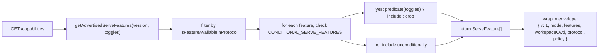
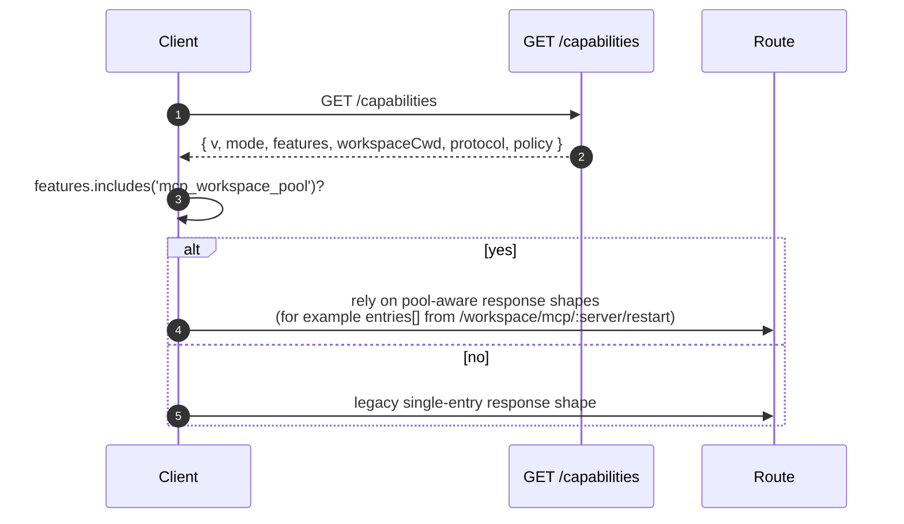

# Capabilities & Protocol Versioning

## 概要

`GET /capabilities` はデーモンのプリフライトエンドポイントです。すべての SDK クライアントは、他のルートを呼び出す前にこのエンドポイントを読み取り、デーモンが使用するプロトコルバージョン、有効になっているフィーチャータグ、デーモンがバインドされているワークスペースを確認する必要があります。契約内容は以下のとおりです：

- **プロトコルバージョンは `v1` のみです。** `SERVE_PROTOCOL_VERSION = 'v1'`、`SUPPORTED_SERVE_PROTOCOL_VERSIONS = ['v1']`。v1 は内部的に追加型であり、フレーム構造の破壊的変更は v2 に予約されています。
- **各タグには `since` バージョンがあります。** 将来の v2 デーモンは v1 と v2 の両方のタグをアドバタイズできます。
- **一部のタグは条件付きです。** 10 個のタグ（`require_auth`、`mcp_workspace_pool`、`mcp_pool_restart`、`allow_origin`、`prompt_absolute_deadline`、`writer_idle_timeout`、`workspace_settings`、`session_shell_command`、`rate_limit`、`workspace_reload`）は、対応するデプロイメントトグルが有効な場合にのみアドバタイズされます。タグが存在する場合、その動作が存在することを意味します。
- **Capability タグ = 動作契約。** 既存のタグに新しい動作を追加すると、古いタグをプリフライトしたクライアントが暗黙的に壊れる可能性があります。新しい動作には新しいタグが必要です。

完全なレジストリは `packages/cli/src/serve/capabilities.ts` にあります。

## 責務

- デーモンがアドバタイズする可能性のあるすべてのフィーチャーを宣言する。
- プロトコルバージョンとデプロイメントトグルによってアドバタイズされるフィーチャーをフィルタリングする。
- `getRegisteredServeFeatures()`（すべてのキー、フィルタリングなし）、`getAdvertisedServeFeatures(version, toggles)`（フィルタリング済み）、`getServeProtocolVersions()`（エンベロープ `{ current, supported }`）を公開する。
- 「タグが存在する = 動作が存在する」という不変条件を維持する。`server.test.ts` には、条件付きタグがトグルがオンのときにアドバタイズされることを検証するテストが含まれており、述語なしで条件付きタグを追加するとそのテストが失敗します。

## アーキテクチャ

### Capability エンベロープ

`/capabilities` は以下を返します：

```ts
{
  v: 1,                    // CAPABILITIES_SCHEMA_VERSION
  mode: 'http-bridge',
  features: ServeFeature[],
  workspaceCwd: string,
  protocol?: { current: 'v1', supported: ['v1'] },
  policy?: { permission: PermissionPolicy },
}
```

`workspaceCwd` はデーモン起動時にバインドされた正規のワークスペースです（[`02-serve-runtime.md`](./02-serve-runtime.md) を参照）。`policy.permission` はアクティブなメディエーターポリシーです。

### `ServeCapabilityDescriptor`

```ts
interface ServeCapabilityDescriptor {
  since: ServeProtocolVersion; // current = 'v1'
  modes?: readonly string[]; // フィーチャーにモードがある場合に操作モードを列挙
}
```

2 つの v1 タグが `modes` を使用します：

- `mcp_guardrails: { since: 'v1', modes: ['warn', 'enforce'] }` - クライアントは拒否動作に依存する前に `'enforce'` をプリフライトする必要があります。
- `permission_mediation: { since: 'v1', modes: ['first-responder', 'designated', 'consensus', 'local-only'] }` - これはビルド時にサポートされるセットです。アクティブなポリシーは `policy.permission` にあります。

### 条件付きタグ

```ts
export const CONDITIONAL_SERVE_FEATURES: ReadonlyMap<
  ServeFeature,
  (toggles: AdvertiseFeatureToggles) => boolean
> = new Map([
  ['require_auth', (t) => t.requireAuth === true],
  ['mcp_workspace_pool', (t) => t.mcpPoolActive === true],
  ['mcp_pool_restart', (t) => t.mcpPoolActive === true],
  ['allow_origin', (t) => t.allowOriginActive === true],
  [
    'prompt_absolute_deadline',
    (t) => typeof t.promptDeadlineMs === 'number' && t.promptDeadlineMs > 0,
  ],
  [
    'writer_idle_timeout',
    (t) =>
      typeof t.writerIdleTimeoutMs === 'number' && t.writerIdleTimeoutMs > 0,
  ],
  ['workspace_settings', (t) => t.persistSettingAvailable === true],
  ['session_shell_command', (t) => t.sessionShellCommandEnabled === true],
  ['rate_limit', (t) => t.rateLimit === true],
  ['workspace_reload', (t) => t.reloadAvailable === true],
]);
```

`Map` はメンバーシップと述語を一緒に保持します。新しい条件付きタグを追加するには、2 つの変更を協調して行う必要があります：

1. `SERVE_CAPABILITY_REGISTRY` にタグとその `since` バージョンを登録する。
2. `CONDITIONAL_SERVE_FEATURES` にその述語を追加する。

ベースラインタグは `Map` に存在せず、無条件にアドバタイズされます。これは別の Set ではなく、意図的に「存在しない」ことで表現されます。

### 67 個のタグ（v1、ドメイン別グループ）

Foundation: `health`、`capabilities`。

Sessions: `session_create`、`session_scope_override`、`session_load`、`session_resume`、`unstable_session_resume`、`session_list`、`session_prompt`、`session_cancel`、`session_events`、`session_set_model`、`session_close`、`session_metadata`、`session_context`、`session_context_usage`、`session_supported_commands`、`session_tasks`、`session_stats`、`session_lsp`、`session_approval_mode_control`、`session_recap`、`session_btw`、**`session_shell_command`**（条件付き）、`session_language`、`session_rewind`、`session_hooks`、`session_branch`。

Streaming: `slow_client_warning`、`typed_event_schema`。

Identity とハートビート: `client_identity`、`client_heartbeat`。

Permissions: `session_permission_vote`、`permission_vote`、**`permission_mediation`**（`modes: ['first-responder', 'designated', 'consensus', 'local-only']`）。

ワークスペース読み取り専用スナップショット: `workspace_mcp`、`workspace_skills`、`workspace_providers`、`workspace_env`、`workspace_preflight`、`workspace_hooks`、`workspace_extensions`。

ワークスペースミューテーション（Wave 4 以降）: `workspace_memory`、`workspace_agents`、`workspace_agent_generate`、`workspace_tool_toggle`、**`workspace_settings`**（条件付き）、`workspace_init`、`workspace_mcp_restart`、`workspace_mcp_manage`、`workspace_file_read`、`workspace_file_bytes`、`workspace_file_write`、**`workspace_reload`**（条件付き）。

MCP ガードレール: **`mcp_guardrails`**（`modes: ['warn', 'enforce']`）、`mcp_guardrail_events`、`mcp_server_runtime_mutation`、**`mcp_workspace_pool`**（条件付き）、**`mcp_pool_restart`**（条件付き）。

プロンプト制御: **`prompt_absolute_deadline`**（条件付き）、**`writer_idle_timeout`**（条件付き）、`non_blocking_prompt`。

Auth: `auth_provider_install`、`auth_device_flow`、**`require_auth`**（条件付き）、**`allow_origin`**（条件付き）。

レート制限: **`rate_limit`**（条件付き）。

太字のタグは `modes` を持つか、条件付きです。

## フロー

### デーモン側：エンベロープの組み立て



### クライアント側：フィーチャープリフライト



## 状態とライフサイクル

- `CAPABILITIES_SCHEMA_VERSION` はワイヤーエンベロープの形状バージョンで、現在は `1` です。エンベロープを変更する場合にのみバンプします。
- `SERVE_PROTOCOL_VERSION = 'v1'` はプロトコルフィーチャーバージョンです。v1 内にフィーチャーを追加することは追加型であり、古いクライアントは新しいタグをプリフライトしない限り新しい動作を受け取りません。フィーチャーを削除することは v2 の破壊的変更となります。
- `EVENT_SCHEMA_VERSION = 1` は SSE フレームの `v` フィールドです（[`09-event-schema.md`](./09-event-schema.md) を参照）。これは独立したバージョン軸であり、イベントスキーマをバンプしてもプロトコルバージョンのバンプを意味せず、その逆も同様です。
- `session_resume` は `POST /session/:id/resume` の安定したデーモン capability です。`unstable_session_resume` は非推奨のエイリアスとして引き続きアドバタイズされます。これは基礎となる ACP メソッドがまだ `connection.unstable_resumeSession` という名前であるためです。新しいクライアントは `session_resume` をフィーチャー検出する必要があります。

## 依存関係

- `/capabilities` レスポンスを構築する際に `packages/cli/src/serve/server.ts` によって読み取られます。
- トグルの入力は `runQwenServe` / `createServeApp` から来ます：`{ requireAuth, mcpPoolActive, allowOriginActive, promptDeadlineMs, writerIdleTimeoutMs, persistSettingAvailable, sessionShellCommandEnabled, rateLimit, reloadAvailable }`。
- エンベロープ内のアクティブな `permission` ポリシーは `BridgeOptions.permissionPolicy` から来ており、それ自体が `settings.json` の `policy.permissionStrategy` を読み取ります。

## 設定

| ソース                     | ノブ                                                            | capability への影響                                                                                                        |
| -------------------------- | --------------------------------------------------------------- | ----------------------------------------------------------------------------------------------------------------------------- |
| CLI フラグ                   | `--require-auth`                                                | `require_auth` をアドバタイズします。                                                                                                    |
| 環境変数                        | `QWEN_SERVE_NO_MCP_POOL=1`                                      | `mcp_workspace_pool` と `mcp_pool_restart` のアドバタイズを停止します。MCP イベントは `scope: 'workspace'` をスタンプしなくなります。               |
| CLI フラグ                   | `--mcp-client-budget=N`, `--mcp-budget-mode={off,warn,enforce}` | タグセットは変更しません（`mcp_guardrails` は常にアドバタイズされます）が、サーバーごとの予約と拒否動作が変更されます。 |
| CLI フラグ / 環境変数             | `--rate-limit` / `QWEN_SERVE_RATE_LIMIT=1`                      | `rate_limit` をアドバタイズします。                                                                                                      |
| 組み込みオプション            | `persistSettingAvailable`                                       | `workspace_settings` をアドバタイズします。                                                                                              |
| CLI フラグ / 組み込みオプション | `--enable-session-shell` / `sessionShellCommandEnabled`         | `session_shell_command` をアドバタイズします。                                                                                           |
| 組み込みオプション            | `reloadAvailable`                                               | `workspace_reload` をアドバタイズします。                                                                                                |
| `settings.json`            | `policy.permissionStrategy`                                     | エンベロープの `policy.permission` を設定します。                                                                                            |

## 注意事項と既知の制限

- **`--require-auth` はプリフライトを非表示にします。** `--require-auth` を使用すると、`/capabilities` を含むすべてのルートがベアラー認証を必要とします。未認証のクライアントは `caps.features.require_auth` をプリフライトできません。401 レスポンスボディがディスカバリーサーフェスとなります。`require_auth` タグは、ハードニングされたデプロイメントの監査 UI 向けの認証済み確認です。
- **タグが存在する = 動作が存在する。** 将来のコントリビューターが `since` をバンプせずに既存のタグに動作を追加した場合、古いタグをプリフライトしたクライアントが暗黙的に新しい動作を受け取る可能性があります。規約として、新しい動作には新しいタグを使用します。
- **`unstable_*` タグはプロトコルバンプなしにバージョン間で形状が変わる可能性があります。** これらに依存する場合は SDK バージョンを固定してください。
- ルートカタログは [`../qwen-serve-protocol.md`](../qwen-serve-protocol.md) にあります。このページでは意図的に重複して記載していません。

## 参考資料

- `packages/cli/src/serve/capabilities.ts`
- `packages/cli/src/serve/types.ts`（`ServeOptions`、`CapabilitiesEnvelope`）
- `packages/cli/src/serve/server.ts`（エンベロープの組み立て）
- `packages/acp-bridge/src/eventBus.ts`（`EVENT_SCHEMA_VERSION`）
- ワイヤーリファレンス：[`../qwen-serve-protocol.md`](../qwen-serve-protocol.md)
- Auth とデプロイメントガードレール：[`12-auth-security.md`](./12-auth-security.md)
