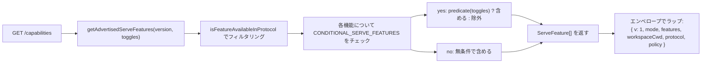

# ケイパビリティとプロトコルバージョニング

## 概要

`GET /capabilities` はデーモンのプリフライトエンドポイントです。すべての SDK クライアントは、他のルートを呼び出す前にこれを読み取り、デーモンが使用するプロトコルバージョン、有効になっている機能タグ、およびデーモンがバインドされているワークスペースを把握する必要があります。契約（コントラクト）は以下の通りです。

- **プロトコルバージョンは `v1` のみです。** `SERVE_PROTOCOL_VERSION = 'v1'` であり、`SUPPORTED_SERVE_PROTOCOL_VERSIONS = ['v1']` です。v1 は内部的に追加のみ可能です。フレーム形状を破壊するような変更は v2 用に予約されています。
- **各タグには `since` バージョンがあります。** 将来の v2 デーモンは v1 と v2 の両方のタグをアドバタイズ（通知）できます。
- **一部のタグは条件付きです。** 13 個のタグ（`require_auth`, `mcp_workspace_pool`, `mcp_pool_restart`, `allow_origin`, `prompt_absolute_deadline`, `writer_idle_timeout`, `workspace_settings`, `workspace_voice`, `workspace_voice_transcription`, `session_shell_command`, `rate_limit`, `workspace_reload`, `voice_transcribe`）は、対応するデプロイトグルが有効な場合にのみアドバタイズされます。タグの存在は、その動作（ビヘイビア）が存在することを意味します。
- **ケイパビリティタグ = 動作のコントラクト。** 既存のタグの下に新しい動作を追加すると、古いタグをプリフライトしたクライアントがサイレントに破壊される可能性があります。新しい動作には新しいタグが必要です。

完全なレジストリは `packages/cli/src/serve/capabilities.ts` にあります。

## 責務

- デーモンがアドバタイズする可能性のあるすべての機能を宣言する。
- プロトコルバージョンとデプロイトグルによってアドバタイズされた機能をフィルタリングする。
- `getRegisteredServeFeatures()`（すべてのキー、未フィルタ）、`getAdvertisedServeFeatures(version, toggles)`（フィルタ済み）、および `getServeProtocolVersions()`（エンベロープ `{ current, supported }`）を公開する。
- 「タグが存在することは動作が存在することである」という不変条件を維持する。`server.test.ts` には、すべての条件付きタグがトグルがオンのときにアドバタイズされることを確認するテストが含まれています。述語（predicate）なしで条件付きタグを追加すると、そのテストは失敗します。

## アーキテクチャ

### ケイパビリティエンベロープ

`/capabilities` は以下を返します。

```ts
{
  v: 1,                    // CAPABILITIES_SCHEMA_VERSION
  mode: 'http-bridge',
  features: ServeFeature[],
  workspaceCwd: string,
  protocol?: { current: 'v1', supported: ['v1'] },
  policy?: { permission: PermissionPolicy },
}
```

`workspaceCwd` はデーモン起動時にバインドされる正規のワークスペースです（[`02-serve-runtime.md`](./02-serve-runtime.md) を参照）。`policy.permission` はアクティブなメディエーターポリシーです。

### `ServeCapabilityDescriptor`

```ts
interface ServeCapabilityDescriptor {
  since: ServeProtocolVersion; // current = 'v1'
  modes?: readonly string[]; // lists operation modes when a feature has modes
}
```

4 つの v1 タグは `modes` を使用します。

- `mcp_guardrails: { since: 'v1', modes: ['warn', 'enforce'] }` - クライアントは拒否動作に依存する前に `'enforce'` をプリフライトする必要があります。
- `permission_mediation: { since: 'v1', modes: ['first-responder', 'designated', 'consensus', 'local-only'] }` - これはビルド時にサポートされるセットです。アクティブなポリシーは `policy.permission` にあります。
- `workspace_voice_transcription: { since: 'v1', modes: ['batch'] }` - デーモンが提供するトランスクリプションパスです。
- `voice_transcribe: { since: 'v1', modes: ['streaming', 'batch'] }` - `/voice/stream` WebSocket で利用可能な 2 つのトランスクリプションパスです。

### 条件付きタグ

```ts
export const CONDITIONAL_SERVE_FEATURES: ReadonlyMap<
  ServeFeature,
  (toggles: AdvertiseFeatureToggles) => boolean
> = new Map([
  ['require_auth', (t) => t.requireAuth === true],
  ['mcp_workspace_pool', (t) => t.mcpPoolActive === true],
  ['mcp_pool_restart', (t) => t.mcpPoolActive === true],
  ['allow_origin', (t) => t.allowOriginActive === true],
  [
    'prompt_absolute_deadline',
    (t) => typeof t.promptDeadlineMs === 'number' && t.promptDeadlineMs > 0,
  ],
  [
    'writer_idle_timeout',
    (t) =>
      typeof t.writerIdleTimeoutMs === 'number' && t.writerIdleTimeoutMs > 0,
  ],
  ['workspace_settings', (t) => t.persistSettingAvailable === true],
  ['workspace_voice', (t) => t.persistSettingAvailable === true],
  [
    'workspace_voice_transcription',
    (t) => t.voiceTranscriptionAvailable === true,
  ],
  ['session_shell_command', (t) => t.sessionShellCommandEnabled === true],
  ['rate_limit', (t) => t.rateLimit === true],
  ['workspace_reload', (t) => t.reloadAvailable === true],
  ['voice_transcribe', (t) => t.voiceWsAvailable !== false],
]);
```

`Map` はメンバーシップと述語を一緒に格納します。新しい条件付きタグを追加するには、2 つの連携した変更が必要です。

1. `SERVE_CAPABILITY_REGISTRY` にタグとその `since` バージョンを登録します。
2. その述語を `CONDITIONAL_SERVE_FEATURES` に追加します。

ベースラインタグは `Map` に存在せず、無条件でアドバタイズされます。これは意図的に、別の Set を使用するのではなく、存在しないことで表現されています。

### 75 個のタグ（v1、ドメイン別にグループ化）

基盤（Foundation）: `health`, `daemon_status`, `capabilities`.

セッション（Sessions）: `session_create`, `session_scope_override`, `session_load`, `session_resume`, `unstable_session_resume`, `session_list`, `session_prompt`, `session_cancel`, `session_events`, `session_set_model`, `session_close`, `session_metadata`, `session_context`, `session_context_usage`, `session_supported_commands`, `session_tasks`, `session_stats`, `session_lsp`, `session_status`, `session_approval_mode_control`, `session_recap`, `session_btw`, **`session_shell_command`** (conditional), `session_language`, `session_rewind`, `session_hooks`, `session_branch`.

ストリーミング（Streaming）: `slow_client_warning`, `typed_event_schema`.

ID とハートビート（Identity and heartbeat）: `client_identity`, `client_heartbeat`.

権限（Permissions）: `session_permission_vote`, `permission_vote`, **`permission_mediation`** (`modes: ['first-responder', 'designated', 'consensus', 'local-only']`).

ワークスペースの読み取り専用スナップショット（Workspace read-only snapshots）: `workspace_mcp`, `workspace_skills`, `workspace_providers`, `workspace_env`, `workspace_preflight`, `workspace_hooks`, `workspace_extensions`.

ワークスペースの変更（Workspace mutation, Wave 4+）: `workspace_memory`, `workspace_agents`, `workspace_agent_generate`, `workspace_tool_toggle`, **`workspace_settings`** (conditional), `workspace_permissions`, `workspace_init`, `workspace_github_setup`, `workspace_trust`, `workspace_mcp_restart`, `workspace_mcp_manage`, `workspace_file_read`, `workspace_file_bytes`, `workspace_file_write`, **`workspace_reload`** (conditional).

MCP ガードレール（MCP guardrails）: **`mcp_guardrails`** (`modes: ['warn', 'enforce']`), `mcp_guardrail_events`, `mcp_server_runtime_mutation`, **`mcp_workspace_pool`** (conditional), **`mcp_pool_restart`** (conditional).

プロンプト制御（Prompt control）: **`prompt_absolute_deadline`** (conditional), **`writer_idle_timeout`** (conditional), `non_blocking_prompt`.

認証（Auth）: `auth_provider_install`, `auth_device_flow`, **`require_auth`** (conditional), **`allow_origin`** (conditional).

音声（Voice）: **`workspace_voice`** (conditional), **`workspace_voice_transcription`** (conditional, `modes: ['batch']`), **`voice_transcribe`** (conditional, `modes: ['streaming', 'batch']`).

レート制限（Rate limiting）: **`rate_limit`** (conditional).

太字のタグは `modes` を持つか、条件付きです。

## フロー

### デーモン側: エンベロープの組み立て



### クライアント側: 機能のプリフライト


## 状態とライフサイクル

- `CAPABILITIES_SCHEMA_VERSION` はワイヤーエンベロープの形状バージョンであり、現在は `1` です。エンベロープの破壊的変更がある場合にのみインクリメントします。
- `SERVE_PROTOCOL_VERSION = 'v1'` はプロトコル機能のバージョンです。v1 内の機能追加は追加のみ可能です。古いクライアントは、新しいタグをプリフライトしない限り新しい動作を確認できません。機能の削除は v2 の破壊的変更です。
- `EVENT_SCHEMA_VERSION = 1` は SSE フレームの `v` フィールドです（[`09-event-schema.md`](./09-event-schema.md) を参照）。これは独立したバージョン軸であり、イベントスキーマのインクリメントはプロトコルバージョンのインクリメントを意味せず、その逆も同様です。
- `session_resume` は `POST /session/:id/resume` のための安定したデーモンケイパビリティです。基盤となる ACP メソッドがまだ `connection.unstable_resumeSession` という名前であるため、`unstable_session_resume` は非推奨のエイリアスとしてアドバタイズされ続けています。新しいクライアントは `session_resume` を機能検出（feature-detect）する必要があります。

## 依存関係

- `/capabilities` レスポンスの構築時に `packages/cli/src/serve/server.ts` によって読み取られます。
- トグル入力は `runQwenServe` / `createServeApp` から渡されます: `{ requireAuth, mcpPoolActive, allowOriginActive, promptDeadlineMs, writerIdleTimeoutMs, persistSettingAvailable, sessionShellCommandEnabled, rateLimit, reloadAvailable }`。
- エンベロープ内のアクティブな `permission` ポリシーは `BridgeOptions.permissionPolicy` から取得され、これは `settings.json` の `policy.permissionStrategy` を読み取ります。

## 設定

| ソース                     | 設定                                                            | ケイパビリティへの影響                                                                                                        |
| -------------------------- | --------------------------------------------------------------- | ----------------------------------------------------------------------------------------------------------------------------- |
| CLI フラグ                   | `--require-auth`                                                | `require_auth` をアドバタイズします。                                                                                                    |
| 環境変数                        | `QWEN_SERVE_NO_MCP_POOL=1`                                      | `mcp_workspace_pool` と `mcp_pool_restart` のアドバタイズを停止します。MCP イベントには `scope: 'workspace'` がスタンプされなくなります。               |
| CLI フラグ                   | `--mcp-client-budget=N`, `--mcp-budget-mode={off,warn,enforce}` | タグセットは変更しません（`mcp_guardrails` は常にアドバタイズされます）が、サーバーごとのリザベーションと拒否動作を変更します。 |
| CLI フラグ / 環境変数             | `--rate-limit` / `QWEN_SERVE_RATE_LIMIT=1`                      | `rate_limit` をアドバタイズします。                                                                                                      |
| 組み込みオプション            | `persistSettingAvailable`                                       | `workspace_settings` と `workspace_voice` をアドバタイズします。                                                                        |
| 組み込みオプション            | `voiceTranscriptionAvailable`                                   | `workspace_voice_transcription` をアドバタイズします。                                                                                   |
| CLI フラグ / 組み込みオプション | `--enable-session-shell` / `sessionShellCommandEnabled`         | `session_shell_command` をアドバタイズします。                                                                                           |
| 組み込みオプション            | `reloadAvailable`                                               | `workspace_reload` をアドバタイズします。                                                                                                |
| 組み込みオプション            | `voiceWsAvailable`                                              | `voice_transcribe` をアドバタイズします。                                                                                                |
| `settings.json`            | `policy.permissionStrategy`                                     | エンベロープの `policy.permission` を設定します。                                                                                            |

## 注意事項と既知の制限

- **`--require-auth` はプリフライトを隠蔽します。** `--require-auth` を指定すると、`/capabilities` を含むすべてのルートで Bearer 認証が必要になります。認証されていないクライアントは `caps.features.require_auth` をプリフライトできません。401 レスポンスボディが検出対象となります。`require_auth` タグは、ハードニングされたデプロイの監査 UI 向けの認証済み確認です。
- **タグの存在は動作の存在を意味します。** 将来のコントリビューターが `since` をインクリメントせずに既存のタグの下に動作を追加した場合、古いタグをプリフライトしたクライアントがサイレントに新しい動作を受け取る可能性があります。慣例として、新しい動作には新しいタグを付与します。
- **`unstable_*` タグはプロトコルのインクリメントなしに**バージョン間で形状が変更される可能性があります。これらに依存する場合は SDK バージョンをピン留めしてください。
- ルートカタログは [`../qwen-serve-protocol.md`](../qwen-serve-protocol.md) にあります。このページでは意図的にその複製を行っていません。

## 参照

- `packages/cli/src/serve/capabilities.ts`
- `packages/cli/src/serve/types.ts` (`ServeOptions`, `CapabilitiesEnvelope`)
- `packages/cli/src/serve/server.ts`（エンベロープの組み立て）
- `packages/acp-bridge/src/eventBus.ts` (`EVENT_SCHEMA_VERSION`)
- ワイヤーリファレンス: [`../qwen-serve-protocol.md`](../qwen-serve-protocol.md)
- 認証とデプロイのガードレール: [`12-auth-security.md`](./12-auth-security.md)