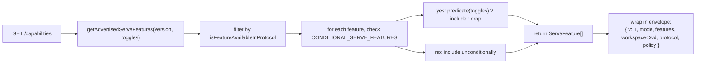
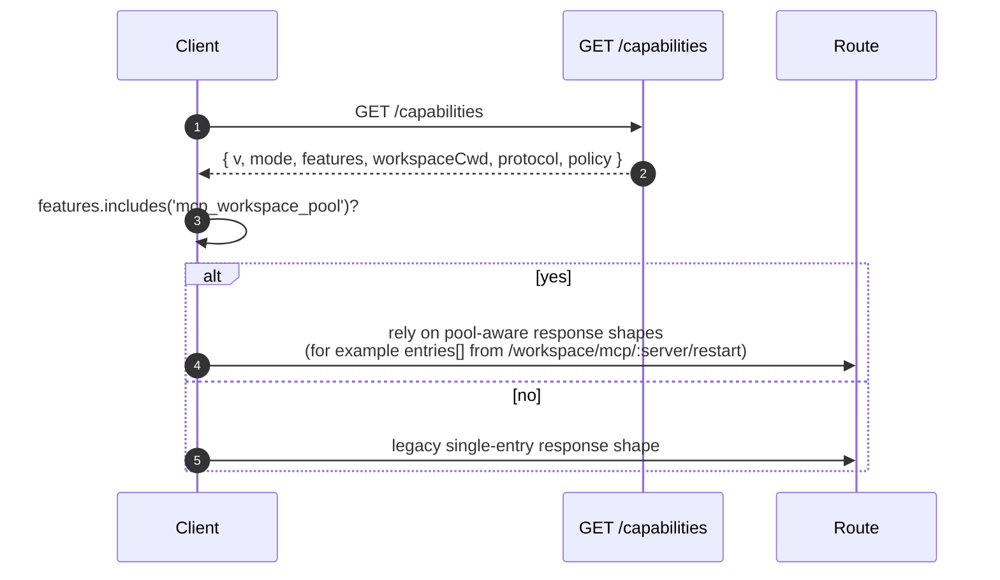

# 機能とプロトコルバージョニング

## 概要

`GET /capabilities` はデーモンの preflight エンドポイントです。すべての SDK クライアントは、他のルートを呼び出す前にこれを読み取り、デーモンが使用するプロトコルバージョン、有効になっている機能タグ、およびデーモンがバインドされているワークスペースを把握する必要があります。契約は以下の通りです：

- **プロトコルバージョンは1つ： `v1`**。`SERVE_PROTOCOL_VERSION = 'v1'` および `SUPPORTED_SERVE_PROTOCOL_VERSIONS = ['v1']` です。v1 は内部的に追加可能です。フレーム構造の変更は v2 のために予約されています。
- **各タグには `since` バージョンがあります。** 将来の v2 デーモンは、v1 と v2 両方のタグをアドバタイズできます。
- **一部のタグは条件付きです。** 10 個のタグ（`require_auth`, `mcp_workspace_pool`, `mcp_pool_restart`, `allow_origin`, `prompt_absolute_deadline`, `writer_idle_timeout`, `workspace_settings`, `session_shell_command`, `rate_limit`, `workspace_reload`）は、対応するデプロイメントトグルが有効な場合のみアドバタイズされます。タグが存在することは、その動作が存在することを意味します。
- **機能タグ = 動作の契約です。** 既存のタグの下に新しい動作を追加すると、その古いタグを preflight したクライアントが静かに壊れる可能性があります。新しい動作には新しいタグが必要です。

完全なレジストリは `packages/cli/src/serve/capabilities.ts` にあります。

## 責務

- デーモンがアドバタイズする可能性のあるすべての機能を宣言する。
- アドバタイズされる機能をプロトコルバージョンとデプロイメントトグルでフィルタリングする。
- `getRegisteredServeFeatures()`（すべてのキー、フィルタリングなし）、`getAdvertisedServeFeatures(version, toggles)`（フィルタリング済み）、および `getServeProtocolVersions()`（エンベロープ `{ current, supported }`）を公開する。
- 「タグがあれば動作あり」という不変条件を維持する。`server.test.ts` には、すべての条件付きタグがそのトグルがオンのときにアドバタイズされることを確認するテストが含まれています。述語のない条件付きタグを追加すると、そのテストは失敗します。

## アーキテクチャ

### Capability エンベロープ

`/capabilities` は以下を返します：

```ts
{
  v: 1,                    // CAPABILITIES_SCHEMA_VERSION
  mode: 'http-bridge',
  features: ServeFeature[],
  workspaceCwd: string,
  protocol?: { current: 'v1', supported: ['v1'] },
  policy?: { permission: PermissionPolicy },
}
```

`workspaceCwd` はデーモンブート時にバインドされた正規のワークスペースです（[`02-serve-runtime.md`](./02-serve-runtime.md) 参照）。`policy.permission` はアクティブなメディエーターポリシーです。

### `ServeCapabilityDescriptor`

```ts
interface ServeCapabilityDescriptor {
  since: ServeProtocolVersion; // current = 'v1'
  modes?: readonly string[]; // lists operation modes when a feature has modes
}
```

2つの v1 タグが `modes` を使用します：

- `mcp_guardrails: { since: 'v1', modes: ['warn', 'enforce'] }` - クライアントは、拒否動作に依存する前に `'enforce'` を preflight すべきです。
- `permission_mediation: { since: 'v1', modes: ['first-responder', 'designated', 'consensus', 'local-only'] }` - これはビルド時にサポートされるセットです。アクティブなポリシーは `policy.permission` にあります。

### 条件付きタグ

```ts
export const CONDITIONAL_SERVE_FEATURES: ReadonlyMap<
  ServeFeature,
  (toggles: AdvertiseFeatureToggles) => boolean
> = new Map([
  ['require_auth', (t) => t.requireAuth === true],
  ['mcp_workspace_pool', (t) => t.mcpPoolActive === true],
  ['mcp_pool_restart', (t) => t.mcpPoolActive === true],
  ['allow_origin', (t) => t.allowOriginActive === true],
  [
    'prompt_absolute_deadline',
    (t) => typeof t.promptDeadlineMs === 'number' && t.promptDeadlineMs > 0,
  ],
  [
    'writer_idle_timeout',
    (t) =>
      typeof t.writerIdleTimeoutMs === 'number' && t.writerIdleTimeoutMs > 0,
  ],
  ['workspace_settings', (t) => t.persistSettingAvailable === true],
  ['session_shell_command', (t) => t.sessionShellCommandEnabled === true],
  ['rate_limit', (t) => t.rateLimit === true],
  ['workspace_reload', (t) => t.reloadAvailable === true],
]);
```

`Map` はメンバーシップと述語を一緒に格納します。新しい条件付きタグを追加するには、2つの調整された変更が必要です：

1. タグとその `since` バージョンを `SERVE_CAPABILITY_REGISTRY` に登録します。
2. その述語を `CONDITIONAL_SERVE_FEATURES` に追加します。

ベースラインタグは `Map` に存在せず、無条件でアドバタイズされます。これは、別の Set ではなく、不在によって意図的に表現されています。

### 67 個のタグ（v1、ドメイン別グループ）

基盤： `health`, `capabilities`。

セッション： `session_create`, `session_scope_override`, `session_load`, `session_resume`, `unstable_session_resume`, `session_list`, `session_prompt`, `session_cancel`, `session_events`, `session_set_model`, `session_close`, `session_metadata`, `session_context`, `session_context_usage`, `session_supported_commands`, `session_tasks`, `session_stats`, `session_lsp`, `session_status`, `session_approval_mode_control`, `session_recap`, `session_btw`, **`session_shell_command`**（条件付き）、`session_language`, `session_rewind`, `session_hooks`, `session_branch`。

ストリーミング： `slow_client_warning`, `typed_event_schema`。

Identity とハートビート： `client_identity`, `client_heartbeat`。

権限： `session_permission_vote`, `permission_vote`, **`permission_mediation`**（`modes: ['first-responder', 'designated', 'consensus', 'local-only']`）。

ワークスペース読み取り専用スナップショット： `workspace_mcp`, `workspace_skills`, `workspace_providers`, `workspace_env`, `workspace_preflight`, `workspace_hooks`, `workspace_extensions`。

ワークスペース変更（Wave 4+）： `workspace_memory`, `workspace_agents`, `workspace_agent_generate`, `workspace_tool_toggle`, **`workspace_settings`**（条件付き）、`workspace_init`, `workspace_mcp_restart`, `workspace_mcp_manage`, `workspace_file_read`, `workspace_file_bytes`, `workspace_file_write`, **`workspace_reload`**（条件付き）。

MCP ガードレール： **`mcp_guardrails`**（`modes: ['warn', 'enforce']`）、`mcp_guardrail_events`, `mcp_server_runtime_mutation`, **`mcp_workspace_pool`**（条件付き）、**`mcp_pool_restart`**（条件付き）。

プロンプト制御： **`prompt_absolute_deadline`**（条件付き）、**`writer_idle_timeout`**（条件付き）、`non_blocking_prompt`。

認証： `auth_provider_install`, `auth_device_flow`, **`require_auth`**（条件付き）、**`allow_origin`**（条件付き）。

レート制限： **`rate_limit`**（条件付き）。

太字のタグは `modes` を持つか、条件付きです。

## フロー

### デーモン側：エンベロープの組み立て



### クライアント側：機能の preflight



## 状態とライフサイクル

- `CAPABILITIES_SCHEMA_VERSION` はワイヤーエンベロープ形状のバージョンで、現在は `1` です。エンベロープに破壊的な変更がある場合のみバンプします。
- `SERVE_PROTOCOL_VERSION = 'v1'` はプロトコル機能のバージョンです。v1 内での機能追加は追加的であり、古いクライアントは新しいタグを preflight しない限り新しい動作を見ません。機能の削除は v2 の破壊的変更です。
- `EVENT_SCHEMA_VERSION = 1` はSSEフレームの `v` フィールドです（[`09-event-schema.md`](./09-event-schema.md) 参照）。独立したバージョン軸であり、イベントスキーマのバンプはプロトコルバージョンのバンプを意味せず、その逆も同様です。
- `session_resume` は `POST /session/:id/resume` の安定したデーモン機能です。`unstable_session_resume` は非推奨のエイリアスとしてアドバタイズされ続けます。これは、基盤となるACPメソッドが依然として `connection.unstable_resumeSession` という名前だからです。新しいクライアントは `session_resume` を機能検出する必要があります。

## 依存関係

- `packages/cli/src/serve/server.ts` によって読み取られ、`/capabilities` 応答を構築します。
- トグル入力は `runQwenServe` / `createServeApp` からのものです：`{ requireAuth, mcpPoolActive, allowOriginActive, promptDeadlineMs, writerIdleTimeoutMs, persistSettingAvailable, sessionShellCommandEnabled, rateLimit, reloadAvailable }`。
- エンベロープ内のアクティブな `permission` ポリシーは `BridgeOptions.permissionPolicy` から取得され、それ自体が `settings.json` の `policy.permissionStrategy` を読み取ります。

## 設定

| ソース            | 設定項目                                                                               | 機能への影響                                                                                                              |
| ----------------- | -------------------------------------------------------------------------------------- | ------------------------------------------------------------------------------------------------------------------------- |
| CLI フラグ        | `--require-auth`                                                                       | `require_auth` をアドバタイズします。                                                                                     |
| 環境変数          | `QWEN_SERVE_NO_MCP_POOL=1`                                                             | `mcp_workspace_pool` と `mcp_pool_restart` のアドバタイズを停止します。MCPイベントは `scope: 'workspace'` をスタンプしなくなります。 |
| CLI フラグ        | `--mcp-client-budget=N`, `--mcp-budget-mode={off,warn,enforce}`                        | タグセットは変わりません（`mcp_guardrails` は常にアドバタイズされます）が、サーバーごとの予約と拒否動作が変わります。     |
| CLI フラグ / 環境変数 | `--rate-limit` / `QWEN_SERVE_RATE_LIMIT=1`                                              | `rate_limit` をアドバタイズします。                                                                                       |
| 埋め込みオプション | `persistSettingAvailable`                                                              | `workspace_settings` をアドバタイズします。                                                                               |
| CLI フラグ / 埋め込みオプション | `--enable-session-shell` / `sessionShellCommandEnabled`                                | `session_shell_command` をアドバタイズします。                                                                            |
| 埋め込みオプション | `reloadAvailable`                                                                      | `workspace_reload` をアドバタイズします。                                                                                 |
| `settings.json`   | `policy.permissionStrategy`                                                            | エンベロープの `policy.permission` を設定します。                                                                         |

## 注意事項と既知の制限

- **`--require-auth` は preflight を隠します。** `--require-auth` を使用すると、`/capabilities` を含むすべてのルートがベアラー認証を必要とします。認証されていないクライアントは `caps.features.require_auth` を preflight できません。401 応答本体が発見の表面となります。`require_auth` タグは、強化されたデプロイメントの監査 UI 向けの認証済み確認です。
- **タグが存在することは、動作が存在することを意味します。** 将来のコントリビューターが `since` をバンプせずに既存のタグの下に動作を追加した場合、古いタグを preflight したクライアントは静かに新しい動作を受け取る可能性があります。規則として、新しい動作には新しいタグが必要です。
- **`unstable_*` タグは、プロトコルのバンプなしにバージョン間で形状が変わる可能性があります。** これらに依存する場合は、SDK のバージョンを固定してください。
- ルートカタログは [`../qwen-serve-protocol.md`](../qwen-serve-protocol.md) にあります。このページでは意図的に重複していません。

## 参照

- `packages/cli/src/serve/capabilities.ts`
- `packages/cli/src/serve/types.ts`（`ServeOptions`, `CapabilitiesEnvelope`）
- `packages/cli/src/serve/server.ts`（エンベロープの組み立て）
- `packages/acp-bridge/src/eventBus.ts`（`EVENT_SCHEMA_VERSION`）
- ワイヤーリファレンス：[`../qwen-serve-protocol.md`](../qwen-serve-protocol.md)
- 認証とデプロイメントガードレール：[`12-auth-security.md`](./12-auth-security.md)