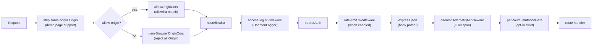
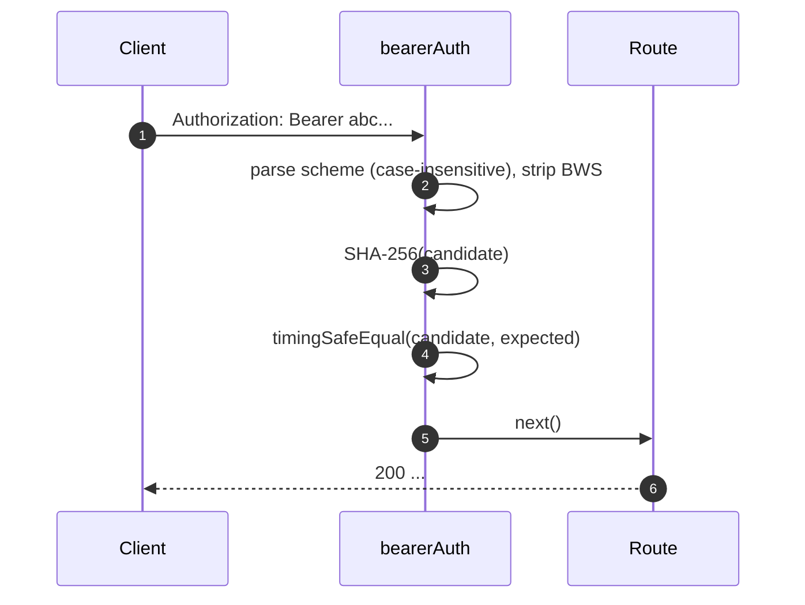
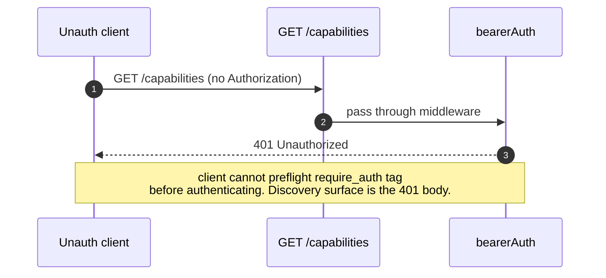
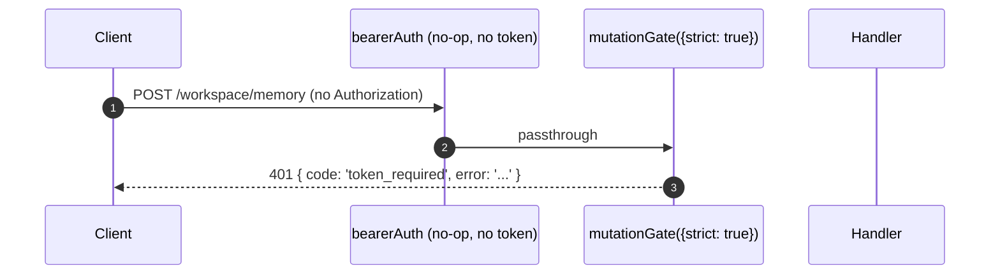

# 認証・セキュリティモデル

## 概要

`qwen serve` はデフォルトではローカルデーモンであり、設定を誤ると外部に露出する面となります。そのセキュリティモデルは**階層化**されており、設定ミスがあっても安全側に倒れるようになっています（fail closed）。

1. **バインド** — ループバック以外のバインドでベアラートークンがない場合、**起動を拒否**します。
2. **ベアラー認証** — `bearerAuth` ミドルウェアは、ループバック上の `/health` を除くすべてのルートを定数時間の SHA-256 比較で保護します（`require_auth` を有効にすると、ループバックと `/health` にも適用されます）。
3. **ホストヘッダー許可リスト** — ループバックでは、`localhost`、`127.0.0.1`、`[::1]`、`host.docker.internal`（ポート付き）のみを受け入れます。DNS リバインディング攻撃に対する防御です。
4. **オリジン制御** — デフォルトでは、`Origin` ヘッダーを持つリクエストはすべて 403 で拒否されます。`--allow-origin <pattern>` が設定されると、デーモンは CORS 許可リストモード（`allowOriginCors`）に切り替わり、一致するオリジンのみを許可します。
5. **ルートごとのミューテーションゲート** — Wave 4 のミューテーションルートは、トークンが設定されていない場合でもループバック上で `401` を返すことをオプトインできます。その際、固有の `code: 'token_required'` エラーを使用します。
6. **デバイスフロー認証** — プロバイダー向けの独立した OAuth 面（`POST /workspace/auth/device-flow` + `GET/DELETE /:id`）。

このドキュメントでは、各レイヤーと、起動パスが強制する明示的な不変条件について説明します。

## 責任

- 安全でない構成での起動を拒否する。
- すべての HTTP リクエストをベアラー（設定時）＋ホスト（ループバック）＋オリジンチェックでゲートする。
- Wave 4 ルートがオプトインするルートごとのミューテーションゲートを提供する。
- プロバイダーの OAuth フローを駆動し、SSE イベント経由で可視化するデバイスフローレジストリをホストする。

## アーキテクチャ

### 起動時の拒否ルール

`run-qwen-serve.ts` 内:

```ts
if (!isLoopbackBind(opts.hostname) && !token) {
  throw new Error('Refusing to bind <host>:<port> without a bearer token. ...');
}
if (opts.requireAuth && !token) {
  throw new Error(
    'Refusing to start with --require-auth set but no bearer token configured. ...',
  );
}
```

allow-origin のワイルドカードには独自の拒否ルールがあります:

```ts
const parsed = parseAllowOriginPatterns(opts.allowOrigins);
if (parsed.allowAny && !token) {
  throw new Error(
    "Refusing to start with --allow-origin '*' but no bearer token configured. ...",
  );
}
```

これら 3 つの拒否はすべて明示的な起動失敗であり（stderr で表示、または埋め込み側にスロー）、決して黙って行われません。#3803 の脅威モデルは、デーモンがループバックを超えて無防備にバインドされることを黙認することを明示的に禁止しています。

### ミドルウェアチェーン（HTTP リクエスト順序）



`mutationGate` はルートごとのミドルウェアファクトリです（`createMutationGate` が `mutate()` を返します）。ルートは登録時に `mutate()` または `mutate({strict: true})` を呼び出します。グローバルな `app.use()` ミドルウェアではありません。アクセスログは `bearerAuth` の前に登録されるため、401 拒否もログに記録されます。レート制限は `bearerAuth` の後、かつ `express.json()` の前で実行されるため、認証済みのリクエストのみがカウントされ、制限を超えた場合は大きなボディがパースされる前に拒否されます。

### `bearerAuth`

- **トークン未設定** → ミドルウェアは何もしません（ループバック開発者のデフォルト）。
- **トークン設定済み** → 設定されたトークンを構築時に SHA-256 で一度ハッシュ化し、リクエストごとに候補をハッシュ化して `timingSafeEqual` で比較します。文字列の等価性によるショートサーキットはありません。タイミング漏洩もありません。
- **スキーム解析**: RFC 7235 §2.1 に従い、大文字小文字を区別しない `Bearer`。RFC 7230 §3.2.6 BWS に従い、スキームと資格情報の間の `SP\tHTAB` を許容します。HTAB のみを区切り文字として使用する場合は拒否します。
- **CodeQL による強化**: 手書きの `indexOf` パースを使用し、正規表現の `\s+` / `.+` の重複を避けています（多項式正規表現のリスクなし）。

### `hostAllowlist`

ループバックのみ。ポートをキーとする `Set<string>` を維持します。許可されるホスト:

- `localhost:<port>`、`127.0.0.1:<port>`、`[::1]:<port>`、`host.docker.internal:<port>`。
- さらに、**ポート 80 にバインドされている場合のみ**、ポートなしの形式（`localhost`、`127.0.0.1`、`[::1]`、`host.docker.internal`）も許可します（RFC 7230 §5.4 のデフォルトポート省略による）。

ホスト比較は**大文字小文字を区別しません** — Express はヘッダー名を正規化しますが、値は正規化しないため、ホストを大文字にする Docker プロキシ（`Localhost:4170`、`HOST.docker.internal`）は、完全一致比較では 403 になります。

ループバック以外のバインドはこのミドルウェアをバイパスします（オペレーターが攻撃面を選択したものであり、ベアラートークンがホストスプーフィングを防ぎます）。

### `denyBrowserOriginCors`

`Origin` ヘッダーを持つリクエストをすべて拒否します。CLI/SDK は Origin を設定しません。ブラウザのみが設定します。`cors` パッケージのエラーコールバックが生成する 500 HTML ではなく、決定論的な `403 { error: 'Request denied by CORS policy' }` を返します。

例外: デモページの同一オリジン XHR は、別のミドルウェア（`server.ts` 内）で処理され、Origin がデーモン自身のアドレスと一致する場合に `Origin` を削除します。

### `allowOriginCors`（`--allow-origin` モード）

`--allow-origin <pattern>` が設定されると、`denyBrowserOriginCors` は `allowOriginCors(parsedPatterns)` に置き換えられます:

- 一致する `Origin` 値には、`Access-Control-Allow-Origin`、`Access-Control-Allow-Headers`、`Access-Control-Allow-Methods` が付与されます。`OPTIONS` プリフライトは `204` を返します。
- 一致しない `Origin` 値には、拒否モードと同じ決定論的な `403 { error: 'Request denied by CORS policy' }` が返されます。
- `--allow-origin '*'` には `--token` が必要です。それ以外の場合は起動を拒否します。
- `parseAllowOriginPatterns()` は起動時にパターン構文を検証します。
- `allow_origin` 機能タグは、このモードが設定されている場合のみアドバタイズされます。

### `createMutationGate`

ルートごとのオプトインゲート。動作マトリクス:

| daemon config           | route opts      | result                           |
| ----------------------- | --------------- | -------------------------------- |
| `requireAuth=true`      | any             | パススルー¹                       |
| `token` 設定済み         | any             | パススルー²                       |
| トークンなし（ループバック開発） | `strict: false` | パススルー                        |
| トークンなし（ループバック開発） | `strict: true`  | `401 { code: 'token_required' }` |

¹ `--require-auth` はトークンがある場合のみ起動するため、グローバル `bearerAuth` が既に未認証の呼び出し元を 401 にしています。
² トークンが設定されていると、グローバル `bearerAuth` がどこでもベアラー必須を強制するため、このゲートは冗長ですが無害です。

`code: 'token_required'` の形式は `bearerAuth` の単なる `Unauthorized` とは異なり、SDK クライアントは汎用的な 401 の代わりに「`--token` / `--require-auth` を設定してください」というヒントを表示できます。

**Wave 4+ の strict ルート**: `/workspace/memory`、`/workspace/agents/*`、`/workspace/agents/generate`、`/file/write`、`/file/edit`、`/workspace/tools/:name/enable`、`/workspace/mcp/:server/restart`、`/workspace/mcp/:server/{enable,disable,authenticate,clear-auth}`、`/workspace/mcp/servers`（POST/DELETE）、`/workspace/auth/device-flow`、`/workspace/init`、`/session/:id/approval-mode`。

### `/health` の例外

ループバックバインドの場合、`/health` はベアラーミドルウェアの**前に**登録されるため、Pod 内の生存確認（liveness probe）がトークンを運ぶ必要はありません。ループバック以外のバインドでは、`/health` も他のルートと同様にベアラーで保護されます。`--require-auth` はこの例外を無効にします。ループバックでも `/health` に `Authorization: Bearer <token>` が必要になります。

### v1 クライアント ID（`X-Qwen-Client-Id`）は自己申告

デーモンは `X-Qwen-Client-Id` の形式（`[A-Za-z0-9._:-]{1,128}`）のみを検証し、セッションごとにアタッチされたクライアント ID を追跡します。現在のところ、Proof-of-Possession（所持証明）は行いません。SSE で `originatorClientId` を観測したクライアントは、同じ ID を再登録し、後続のリクエストでそのオリジネーターを偽装できます。

影響:

- `designated` — リモートの呼び出し元がオリジネーターを偽装し、プロンプトのオリジネーターのみを対象としたリクエストに投票できます。
- `consensus` — 偽装された ID が既に `votersAtIssue` スナップショットに含まれていた場合、投票できます。
- `local-only` は影響を受けません。デーモンが接続のリモートアドレスからスタンプする `fromLoopback` でゲートしているためです。
- `first-responder` は影響を受けません。アイデンティティに依存しないためです。

将来のペアトークン機構では、`POST /session` からセッションごとの秘密を発行する予定です。`designated` / `consensus` の投票はそれを提示する必要があります。それまでは、強化された designated ポリシーが必要なデプロイメントでは、ループバックにバインドするか、認証済みリバースプロキシの背後で実行してください。ポリシーレベルの詳細については、[`04-permission-mediation.md`](./04-permission-mediation.md) を参照してください。

### デバイスフロー認証

プロバイダー認証のための独立した OAuth 面。v1 プロバイダー識別子は `qwen-oauth` ですが、Qwen OAuth の無料ティアは 2026 年 4 月 15 日をもって廃止されました。新しいセットアップでは、利用可能な場合、現在サポートされている認証プロバイダーを使用してください。

- `POST /workspace/auth/device-flow` — フローを開始します。`{deviceFlowId, providerId, expiresAt, verificationUrl, userCode}` を返します。
- `GET /workspace/auth/device-flow/:id` — 状態をポーリングします。
- `DELETE /workspace/auth/device-flow/:id` — キャンセルします。
- `GET /workspace/auth/status` — 現在のアカウント / プロバイダーのスナップショットを返します。

SSE イベント `auth_device_flow_{started, throttled, authorized, failed, cancelled}` はフロー状態をすべてのサブスクライバーにファンアウトし、マルチクライアント UI の同期を維持します。[`09-event-schema.md`](./09-event-schema.md) を参照してください。

実装: `packages/cli/src/serve/auth/device-flow.ts` + `qwen-device-flow-provider.ts`

**ログインジェクション / Trojan Source 対策**: `sanitizeForStderr(value)`（`device-flow.ts`）は、ASCII 制御文字と Unicode 制御文字を `?` に置き換えます。悪意のある IdP は、そうしないとログ行を偽造したりペイロードを隠したりする可能性があります。

| Range                            | 削除理由                                                                                                                                                                                                                                                              |
| -------------------------------- | --------------------------------------------------------------------------------------------------------------------------------------------------------------------------------------------------------------------------------------------------------------------- |
| `\x00–\x1f`、`\x7f`、`\x80–\x9f` | ASCII C0 / DEL / C1 制御文字、ターミナルエスケープ、ログ行偽造。                                                                                                                                                                                                      |
| U+200B-U+200F                    | ゼロ幅文字 + LRM / RLM。不可視ですが、ターミナルの表示を変更できます。                                                                                                                                                                                                |
| U+2028-U+2029                    | LINE / PARAGRAPH SEPARATOR。多くの Unicode 対応ターミナルはこれを行区切りとして扱います。                                                                                                                                                                               |
| U+202A-U+202E                    | 双方向の EMBEDDING / OVERRIDE 制御文字。                                                                                                                                                                                                                              |
| U+2066-U+2069                    | 双方向の ISOLATE 制御文字（LRI / RLI / FSI / PDI）。主要な [CVE-2021-42574 "Trojan Source"](https://trojansource.codes/) ベクター。U+202D（LRO）の代わりに U+2066（LRI）を使用する IdP は、EMBEDDING/OVERRIDE のみのフィルターをバイパスし、同様の視覚的な並び替えが可能です。 |
| U+FEFF                           | BOM / ゼロ幅ノーブレークスペース。                                                                                                                                                                                                                                    |

長さは削除する代わりに各文字を `?` で置き換えることで保持されるため、オペレーターはそのインデックスに何かが存在したことを確認できます。両方のレイヤーでサニタイザーを使用します。`qwenDeviceFlowProvider` は IdP の `oauthError` をサニタイズし、レジストリの遅延ポーリングオブザーバーは監査ヒントに補間されるプロバイダー制御の値（`latePollResult.kind` / `lateErr.name`）をサニタイズします。

`auth_device_flow` 機能タグは**無条件に**アドバタイズされます。ルート自体は、デーモンが特定のプロバイダーをサポートできない場合、`400 unsupported_provider` を返します。サポートされているプロバイダーのリストは、`/capabilities` ではなく `/workspace/auth/status` にあります。これにより、記述子の形状を統一しています。

## ワークフロー

### ベアラー認証成功リクエスト



### ベアラー認証失敗モード

すべて `401 { error: 'Unauthorized' }` を返します（`missing header` / `wrong scheme` / `wrong token` で統一されており、プロービングで区別できません）。

### `--require-auth` のシャドウ



認証後、`caps.features.includes('require_auth')` でデプロイメントが強化されていることを確認できます。

### Wave 4 ミューテーションゲート（トークンなしループバック）



## 状態とライフサイクル

- ベアラートークンは起動時に読み取られ、トリミングされます（`cat token.txt` からの改行が、そうしないと静かに比較を破壊するため）。
- Allowed-Host セットはポートごとにキャッシュされ、ポート変更時に再構築されます（一時的な `0` → `listen` 後の実際のポート）。
- ミューテーションゲートは `passthrough` と `strictDenier` をアプリビルドごとに一度構築し、ルートごとの呼び出しはキャッシュされたクロージャを返します（リクエストごとのアロケーションはありません）。
- デバイスフローレジストリは `shutdown()` フェーズ 1 で破棄され、保留中のフローは HTTP ティアダウンの前に `cancelled` として解決されます。

## 依存関係

- `node:crypto` — `createHash`、`timingSafeEqual`。
- `packages/cli/src/serve/loopback-binds.ts` — `isLoopbackBind`。
- `packages/cli/src/serve/auth/device-flow.ts` — デバイスフローのステートマシン。
- `@qwen-code/acp-bridge` — デバイスフローイベントをセッションごとの SSE バスに送信します。

## 設定

| ソース         | ノブ                                                                                   | 効果                                                                  |
| -------------- | --------------------------------------------------------------------------------------- | --------------------------------------------------------------------- |
| Env            | `QWEN_SERVER_TOKEN`                                                                     | ベアラートークン（トリミング済み）。                                   |
| フラグ         | `--token`                                                                               | ベアラートークン（環境変数を上書き）。                                 |
| フラグ         | `--require-auth`                                                                        | ベアラーをループバックと `/health` に拡張。トークンがないと起動しない。 |
| フラグ         | `--hostname`                                                                            | ループバック以外のバインドには `--token`（または環境変数）が必要。      |
| フラグ         | `--allow-origin <pattern>`                                                              | CORS 許可リストモードに切り替え。`'*'` にはトークンが必要。            |
| 機能タグ       | `require_auth`（条件付き）、`auth_device_flow`（常時）、`allow_origin`（条件付き）       | [`11-capabilities-versioning.md`](./11-capabilities-versioning.md) 参照。 |

## 注意事項と既知の制限

- **`--require-auth` は機能プリフライトをシャドウする**。未認証のクライアントは `require_auth` タグを発見できません。発見面は 401 ボディそのものです。
- **ミューテーションゲートのボディパーサー順序**: `mutationGate({strict: true})` の 401 レスポンスは、`express.json()` がボディをパースした**後に**発生します。飽和したループバックリスナーでの最悪のケース: `--max-connections × express.json({limit: '10mb'})` ≈ 2.5 GB の一時的なメモリ。ループバックのみの攻撃面であり、意図的に許容されています。
- **同一オリジンの Origin 削除**は `server.ts` 内で `denyBrowserOriginCors` の**前**に行われます。将来の変更で削除位置が変わると、デモページが機能しなくなります。
- **トークン比較は SHA-256 ダイジェストに対して行われます**。生のトークンではありません。可変長のトークン比較を固定長のダイジェスト比較にすることで、タイミング漏洩を低減します。
- デーモンは現在、mTLS、リクエスト署名、ペアトークンの Proof-of-Possession を**サポートしていません**。`--rate-limit` はクライアント ID / IP キーによる HTTP レート制限を提供しますが、クライアント ID 認証ではありません。

## 参考

- `packages/cli/src/serve/auth.ts`（ファイル全体）
- `packages/cli/src/serve/run-qwen-serve.ts`（拒否ルール）
- `packages/cli/src/serve/loopback-binds.ts`
- `packages/cli/src/serve/auth/device-flow.ts`
- `packages/cli/src/serve/auth/qwen-device-flow-provider.ts`
- ユーザー向け脅威モデル: [`../../users/qwen-serve.md`](../../users/qwen-serve.md)
- ワイヤーリファレンス: [`../qwen-serve-protocol.md`](../qwen-serve-protocol.md)