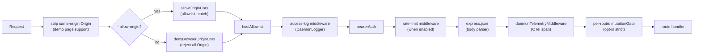
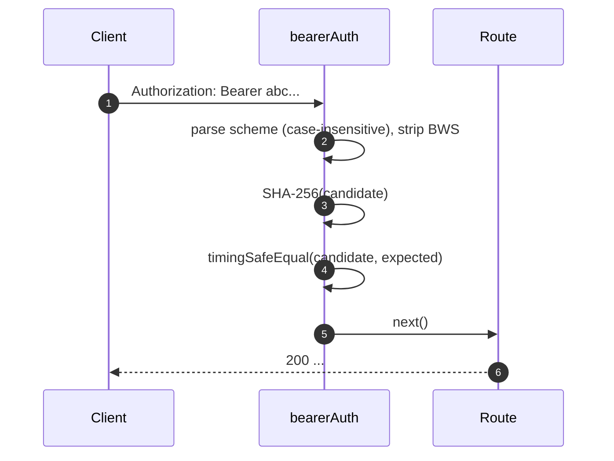
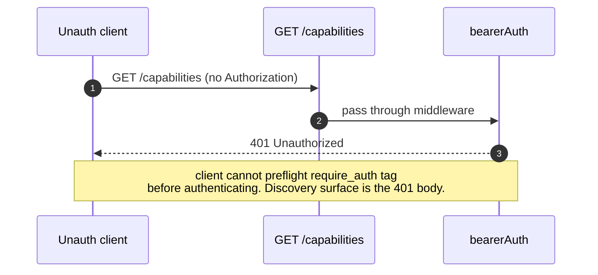
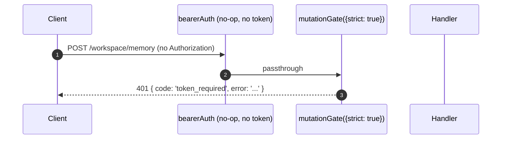

# 認証・セキュリティモデル

## 概要

`qwen serve` はデフォルトでローカルデーモンとして動作しますが、設定を誤ると攻撃面が露出します。セキュリティモデルは**多層構造**になっており、設定ミスがあっても安全側に倒れます。

1. **バインド** — Bearerトークンなしで非ループバックアドレスへのバインドは**起動を拒否**します。
2. **Bearer認証** — 定数時間SHA-256比較による`bearerAuth`ミドルウェアが、ループバックの`/health`を除くすべてのルートを保護します（`require_auth`を設定するとループバックと`/health`も対象になります）。
3. **Hostヘッダーアローリスト** — ループバック時は`localhost`、`127.0.0.1`、`[::1]`、`host.docker.internal`（ポート含む）のみ受け付けます。DNSリバインディング攻撃への対策です。
4. **Originコントロール** — デフォルトでは`Origin`ヘッダーを持つリクエストはすべて403で拒否されます。`--allow-origin <pattern>`を設定すると、デーモンはCORSアローリストモード（`allowOriginCors`）に切り替わり、マッチするOriginのみ許可します。
5. **ルートごとのミューテーションゲート** — Wave 4のミューテーションルートは、トークン未設定時にもループバック上で`401`レスポンスを返すようオプトインできます。このとき`code: 'token_required'`という固有のエラーを使用します。
6. **デバイスフロー認証** — プロバイダー向けの別途OAuth面（`POST /workspace/auth/device-flow` + GET/DELETE on `/:id`）。

このドキュメントでは各レイヤーと、起動パスが強制する明示的な不変条件について説明します。

## 責務

- 安全でない設定での起動を拒否する。
- すべてのHTTPリクエストをBearer認証（設定時）、Host（ループバック）、Originチェックでゲートする。
- Wave 4ルートがオプトインするルートごとのミューテーションゲートを提供する。
- SSEイベントで公開されるプロバイダーOAuthフローを駆動するデバイスフローレジストリをホストする。

## アーキテクチャ

### 起動時の拒否ルール

`run-qwen-serve.ts` 内:

```ts
if (!isLoopbackBind(opts.hostname) && !token) {
  throw new Error('Refusing to bind <host>:<port> without a bearer token. ...');
}
if (opts.requireAuth && !token) {
  throw new Error(
    'Refusing to start with --require-auth set but no bearer token configured. ...',
  );
}
```

`--allow-origin`のワイルドカードにも独自の拒否ルールがあります:

```ts
const parsed = parseAllowOriginPatterns(opts.allowOrigins);
if (parsed.allowAny && !token) {
  throw new Error(
    "Refusing to start with --allow-origin '*' but no bearer token configured. ...",
  );
}
```

3つの拒否はすべて明示的な起動失敗（stderr表示またはエンベッダーへのスロー）で、
サイレントに処理されることはありません。#3803のスレットモデルでは、
デーモンがオープンな状態でループバックを超えてバインドすることをサイレントに許可することを明示的に禁止しています。

### ミドルウェアチェーン（HTTPリクエスト順）



`mutationGate`はルートごとのミドルウェアファクトリです（`createMutationGate`が
`mutate()`を返します）。ルートは登録時に`mutate()`または`mutate({strict: true})`を呼び出します。
グローバルな`app.use()`ミドルウェアではありません。アクセスログは`bearerAuth`の前に登録されるため、
401による拒否もログに残ります。レート制限は`bearerAuth`の後、`express.json()`の前に実行されるため、
認証済みリクエストのみがカウントされ、制限超過時は解析前に大きなボディが拒否されます。

### `bearerAuth`

- **トークン未設定** → ミドルウェアはno-op（ループバック開発者のデフォルト）。
- **トークン設定済み** → 構築時にSHA-256を一度計算し、リクエストごとに候補をハッシュ化して`timingSafeEqual`で比較。文字列等値による短絡なし、タイミングリークなし。
- **スキーム解析**: RFC 7235 §2.1に従い大文字小文字を区別しない`Bearer`。RFC 7230 §3.2.6 BWS に従い、スキームとクレデンシャル間の`SP\tHTAB`を許容。純粋なHTABのセパレータは拒否。
- **CodeQLハードニング**: `\s+`/`.+`の重複（多項式正規表現リスク）を避けるため、手動実装の`indexOf`解析を使用。

### `hostAllowlist`

ループバック専用。ポートをキーとする`Set<string>`を管理。許可Hosts:

- `localhost:<port>`、`127.0.0.1:<port>`、`[::1]:<port>`、`host.docker.internal:<port>`。
- ポート80にバインドされている場合のみ（RFC 7230 §5.4のデフォルトポート省略に従い）、ポートなし形式（`localhost`、`127.0.0.1`、`[::1]`、`host.docker.internal`）も許可。

Host比較は**大文字小文字を区別しません**。Expressはヘッダー名を正規化しますが値は正規化しないため、
Dockerプロキシが大文字化したHost（`Localhost:4170`、`HOST.docker.internal`）は完全一致比較では403になってしまいます。

非ループバックバインドはこのミドルウェアをバイパスします（オペレーターが攻撃面を選択した場合、代わりにBearerトークンがHostスプーフィングをゲートします）。

### `denyBrowserOriginCors`

`Origin`ヘッダーを持つすべてのリクエストを拒否します。CLI/SDKはOriginを設定しません。設定するのはブラウザのみです。`cors`パッケージのエラーコールバックが生成するような500 HTMLではなく、決定論的な`403 { error: 'Request denied by CORS policy' }`を返します。

例外: デモページの同一オリジンXHRは別途ミドルウェア（`server.ts`内）で処理され、デーモン自身のアドレスに一致する場合に`Origin`を除去します。

### `allowOriginCors`（`--allow-origin`モード）

`--allow-origin <pattern>`を設定すると、`denyBrowserOriginCors`は
`allowOriginCors(parsedPatterns)`に置き換えられます:

- マッチした`Origin`値には`Access-Control-Allow-Origin`、
  `Access-Control-Allow-Headers`、`Access-Control-Allow-Methods`が付与され、`OPTIONS`
  プリフライトは`204`を返します。
- マッチしない`Origin`値には、拒否モードと同じ決定論的な
  `403 { error: 'Request denied by CORS policy' }`が返されます。
- `--allow-origin '*'`は`--token`が必要です。未設定の場合は起動を拒否します。
- `parseAllowOriginPatterns()`は起動時にパターン構文を検証します。
- `allow_origin`ケーパビリティタグは、このモードが設定されている場合のみアドバタイズされます。

### `createMutationGate`

ルートごとのオプトイングート。動作マトリクス:

| デーモン設定                | ルートオプション    | 結果                             |
| ----------------------- | --------------- | -------------------------------- |
| `requireAuth=true`      | any             | パススルー¹                      |
| `token`設定済み           | any             | パススルー²                      |
| トークンなし（ループバック開発） | `strict: false` | パススルー                       |
| トークンなし（ループバック開発） | `strict: true`  | `401 { code: 'token_required' }` |

¹ `--require-auth`はトークンがある場合のみ起動するため、グローバルの`bearerAuth`が未認証の呼び出し元を401で弾きます。
² トークン設定があるとグローバルの`bearerAuth`がBearer必須を強制するため、ゲートは冗長ですが無害です。

`code: 'token_required'`の形式は`bearerAuth`の単純な`Unauthorized`とは区別されているため、
SDKクライアントは汎用的な401ではなく「`--token` / `--require-auth`を設定してください」というヒントを表示できます。

**Wave 4以降のstrictルート**: `/workspace/memory`、`/workspace/agents/*`、
`/workspace/agents/generate`、`/file/write`、`/file/edit`、
`/workspace/tools/:name/enable`、`/workspace/mcp/:server/restart`、
`/workspace/mcp/:server/{enable,disable,authenticate,clear-auth}`、
`/workspace/mcp/servers`（POST/DELETE）、`/workspace/auth/device-flow`、
`/workspace/init`、`/session/:id/approval-mode`。

### `/health`の除外

ループバックバインドでは、`/health`はBearerミドルウェアの**前**に登録されるため、
Pod内のライブネスプローブはトークンを送る必要がありません。非ループバックバインドでは、
`/health`も他のルートと同様にBearerでゲートされます。`--require-auth`を設定すると除外が解除され、
ループバックでも`Authorization: Bearer <token>`が必要になります。

### v1クライアントID（`X-Qwen-Client-Id`）はself-reported

デーモンは`X-Qwen-Client-Id`のフォーマット
（`[A-Za-z0-9._:-]{1,128}`）のみ検証し、セッションごとに接続済みクライアントIDを追跡します。
現時点では所有証明（proof-of-possession）は行いません。SSEで`originatorClientId`を観測したクライアントが
同じIDを再登録し、後続のリクエストでそのオリジネーターになりすますことができます。

影響:

- `designated` — リモートの呼び出し元がオリジネーターになりすまし、そのプロンプトオリジネーター専用のリクエストに投票できます。
- `consensus` — なりすましIDがすでに`votersAtIssue`のスナップショットに含まれていれば投票できます。
- `local-only` — `fromLoopback`でゲートされており、これはデーモンが接続リモートアドレスから付与するため影響を受けません。
- `first-responder` — ID非依存なため影響を受けません。

将来のペアトークン機構では`POST /session`からセッションごとのシークレットが発行され、
`designated` / `consensus`の投票にはその提示が必要になります。それまでの間、
強化されたdesignatedポリシーが必要なデプロイメントはループバックへバインドするか、
認証済みリバースプロキシの背後で実行してください。ポリシーレベルの詳細は
[`04-permission-mediation.md`](./04-permission-mediation.md)を参照してください。

### デバイスフロー認証

プロバイダー認証のための別途OAuth面。v1プロバイダーIDは
`qwen-oauth`ですが、Qwen OAuth無料プランは2026-04-15に廃止されました。新規セットアップでは、
利用可能な現在サポートされている認証プロバイダーを使用してください。

- `POST /workspace/auth/device-flow` — フローを開始し、`{deviceFlowId, providerId, expiresAt, verificationUrl, userCode}`を返します。
- `GET /workspace/auth/device-flow/:id` — 状態をポーリング。
- `DELETE /workspace/auth/device-flow/:id` — キャンセル。
- `GET /workspace/auth/status` — 現在のアカウント/プロバイダースナップショット。

SSEイベント`auth_device_flow_{started, throttled, authorized, failed, cancelled}`がフロー状態をすべてのサブスクライバーにファンアウトし、マルチクライアントUIの同期を保ちます。[`09-event-schema.md`](./09-event-schema.md)を参照してください。

実装: `packages/cli/src/serve/auth/device-flow.ts` + `qwen-device-flow-provider.ts`。

**ログインジェクション / Trojan Source対策**: `sanitizeForStderr(value)`
（`device-flow.ts`）はASCII制御文字とUnicode制御文字を`?`に置換します。悪意のあるIdPがログ行を偽造したりペイロードを隠したりする攻撃を防ぎます:

| 範囲                             | 除去理由                                                                                                                                                                                                                                                            |
| -------------------------------- | ------------------------------------------------------------------------------------------------------------------------------------------------------------------------------------------------------------------------------------------------------------------- |
| `\x00–\x1f`, `\x7f`, `\x80–\x9f` | ASCII C0 / DEL / C1制御文字、ターミナルエスケープ、ログ行偽造。                                                                                                                                                                                                     |
| U+200B-U+200F                    | ゼロ幅文字とLRM / RLM。不可視ですがターミナルのレンダリングを変える可能性があります。                                                                                                                                                                               |
| U+2028-U+2029                    | LINE / PARAGRAPH SEPARATOR。多くのUnicode対応ターミナルが改行として扱います。                                                                                                                                                                                       |
| U+202A-U+202E                    | 双方向EMBEDDING / OVERRIDE制御文字。                                                                                                                                                                                                                                |
| U+2066-U+2069                    | 双方向ISOLATE制御文字（LRI / RLI / FSI / PDI）。[CVE-2021-42574 "Trojan Source"](https://trojansource.codes/)の主なベクター。U+202D（LRO）の代わりにU+2066（LRI）を使用するIdPは、EMBEDDING/OVERRIDE専用フィルターをバイパスし、同様の視覚的な並べ替えを行えます。 |
| U+FEFF                           | BOM / ゼロ幅ノーブレークスペース。                                                                                                                                                                                                                                  |

削除ではなく各コードポイントを`?`で置換することで長さを保持し、
オペレーターはそのインデックスに何かが存在していたことを確認できます。サニタイザーは2箇所で使用されます: `qwenDeviceFlowProvider`がIdPの`oauthError`をサニタイズし、レジストリの遅延ポールオブザーバーが監査ヒントに補間されるプロバイダー制御値（`latePollResult.kind` / `lateErr.name`）をサニタイズします。

`auth_device_flow`ケーパビリティタグは**無条件で**アドバタイズされます。デーモンが特定のプロバイダーをサポートできない場合、ルート自体が`400 unsupported_provider`を返します。サポートプロバイダーリストはディスクリプタ形式を統一するため、`/capabilities`ではなく`/workspace/auth/status`にあります。

## ワークフロー

### Bearer認証の成功フロー



### Bearer認証の失敗モード

すべて`401 { error: 'Unauthorized' }`を返します（`ヘッダーなし` / `スキーム不正` / `トークン不正`で一律なため、プロービングでの区別ができません）。

### `--require-auth`によるシャドウ



認証後、`caps.features.includes('require_auth')`でデプロイメントがハードニングされていることを確認できます。

### トークンなしループバックでのWave 4ミューテーションゲート



## 状態とライフサイクル

- Bearerトークンは起動時に読み込まれトリムされます（`cat token.txt`による改行があると比較がサイレントに失敗するため）。
- 許可Hostのセットはポートごとにキャッシュされ、ポート変更時に再構築されます（一時的な`0` → `listen`後の実ポート）。
- ミューテーションゲートはアプリビルドごとに`passthrough`と`strictDenier`を一度だけ構築し、ルートごとの呼び出しはキャッシュされたクロージャを返します（リクエストごとのアロケーションなし）。
- デバイスフローレジストリは`shutdown()`のフェーズ1で破棄されるため、保留中のフローはHTTPのティアダウン前に`cancelled`として解決されます。

## 依存関係

- `node:crypto` — `createHash`、`timingSafeEqual`。
- `packages/cli/src/serve/loopback-binds.ts` — `isLoopbackBind`。
- `packages/cli/src/serve/auth/device-flow.ts` — デバイスフローステートマシン。
- `@qwen-code/acp-bridge` — セッションごとのSSEバスでデバイスフローイベントを公開。

## 設定

| ソース          | 設定項目                                                                                | 効果                                                                    |
| --------------- | --------------------------------------------------------------------------------------- | ----------------------------------------------------------------------- |
| Env             | `QWEN_SERVER_TOKEN`                                                                     | Bearerトークン（トリムあり）。                                          |
| Flag            | `--token`                                                                               | Bearerトークン（envを上書き）。                                         |
| Flag            | `--require-auth`                                                                        | Bearerをループバック + `/health`に拡張。トークンがある場合のみ起動。    |
| Flag            | `--hostname`                                                                            | 非ループバックバインドは`--token`（またはenv）が必要。                  |
| Flag            | `--allow-origin <pattern>`                                                              | CORSアローリストモードに切り替え。`'*'`はトークンが必要。               |
| ケーパビリティタグ | `require_auth`（条件付き）、`auth_device_flow`（常時）、`allow_origin`（条件付き）     | [`11-capabilities-versioning.md`](./11-capabilities-versioning.md)参照。|

## 注意事項と既知の制限

- **`--require-auth`によるフィーチャープリフライトのシャドウ。** 未認証のクライアントは`require_auth`タグを発見できません。発見面は401レスポンスボディ自体になります。
- **ミューテーションゲートのボディパーサー順序**: `mutationGate({strict: true})`の401レスポンスは`express.json()`がボディを解析した**後**に発火します。飽和状態のループバックリスナーにおける最悪ケース: `--max-connections × express.json({limit: '10mb'})` ≈ 2.5 GBの一時的なメモリ使用。ループバック限定の攻撃面であり、意図的に許容されています。
- **`server.ts`での同一オリジンOrigin除去**は`denyBrowserOriginCors`より_前_に行われます。将来の変更で除去箇所が移動した場合、デモページが壊れます。
- **トークン比較はSHA-256ダイジェスト上**で行われ、生トークンではありません。可変長トークン比較を固定サイズのダイジスト比較に落とし込むことでタイミングリークを減らします。
- デーモンは現時点でmTLS、リクエスト署名、ペアトークンの所有証明を**サポートしていません**。`--rate-limit`はクライアントID / IPキーによるHTTPレート制限を提供しますが、クライアントID認証ではありません。

## 参考

- `packages/cli/src/serve/auth.ts`（ファイル全体）
- `packages/cli/src/serve/run-qwen-serve.ts`（拒否ルール）
- `packages/cli/src/serve/loopback-binds.ts`
- `packages/cli/src/serve/auth/device-flow.ts`
- `packages/cli/src/serve/auth/qwen-device-flow-provider.ts`
- ユーザー向けスレットモデル: [`../../users/qwen-serve.md`](../../users/qwen-serve.md)。
- ワイヤーリファレンス: [`../qwen-serve-protocol.md`](../qwen-serve-protocol.md)。
