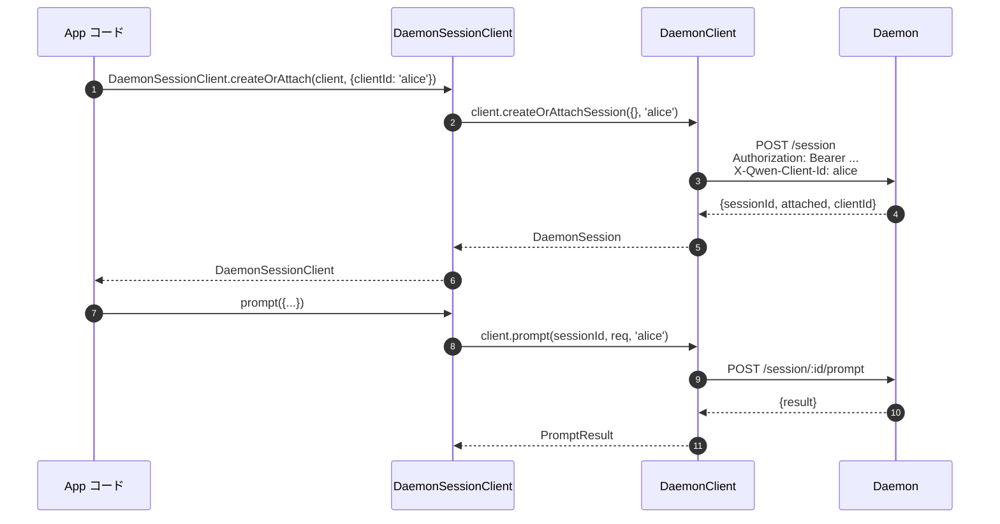
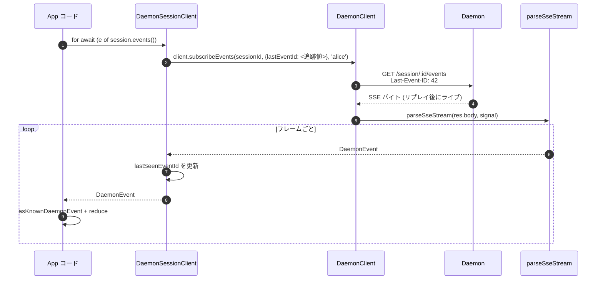
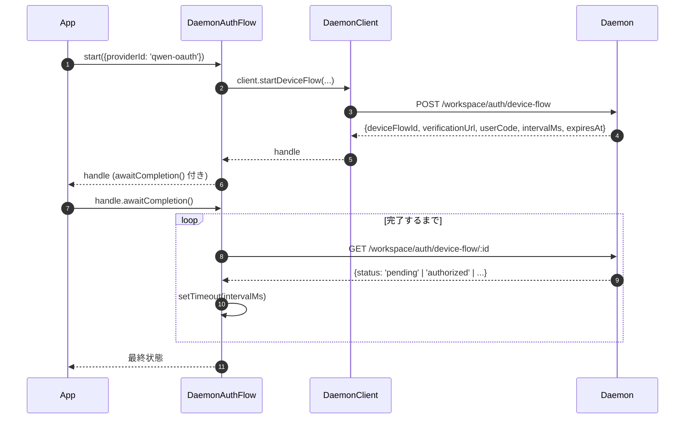

# TypeScript SDK デーモンクライアント

## 概要

`packages/sdk-typescript/src/daemon/` は **TypeScript SDK のデーモンクライアント**です。これは、実行中の `qwen serve` デーモンに接続するための正規の方法であり、任意の TypeScript / JavaScript ホスト（CLI 自身の TUI アダプタ、チャットボットバックエンド、VS Code IDE コンパニオン、カスタムスクリプト、サーバーサイド Web バックエンド）から利用できます。他のすべてのアダプタはこれに依存しています。

パッケージのレイアウトは意図的に小さくなっています:

| ファイル                     | 内容                                                                                                                                                                    |
| ---------------------------- | ----------------------------------------------------------------------------------------------------------------------------------------------------------------------- |
| `index.ts`                   | 公開バレル (`DaemonClient`, `DaemonSessionClient`, `DaemonAuthFlow`, `parseSseStream`, イベントリデューサー, 型)。                                                       |
| `DaemonClient.ts`            | 低レベル HTTP/SSE ファサード — `qwen-serve-protocol.md` のルートごとに 1 メソッド。                                                                                      |
| `DaemonSessionClient.ts`     | SSE リプレイ追跡機能付きのセッションスコープラッパー。                                                                                                                  |
| `DaemonAuthFlow.ts`          | 高レベル OAuth デバイスフローヘルパー。                                                                                                                                |
| `sse.ts`                     | `parseSseStream` (NDJSON / SSE フレームパーサー)。                                                                                                                       |
| `events.ts`                  | `asKnownDaemonEvent`, `reduceDaemonSessionEvent`, `reduceDaemonAuthEvent` (詳細は [`09-event-schema.md`](./09-event-schema.md) を参照)。                                |
| `types.ts`                   | `DaemonCapabilities`, `DaemonSession`, `DaemonEvent`, `PermissionResponse`, `PromptResult`, MCP / エージェント / メモリ / 認証の型。                                       |

ウォークスルー例は [`../examples/daemon-client-quickstart.md`](../examples/daemon-client-quickstart.md) にあります。このドキュメントはアーキテクチャとコントラクトのリファレンスです。

## 責務

- デーモンの HTTP ルートごとに 1 つの TypeScript メソッドを提供する。
- すべてのリクエストに Bearer トークンと `X-Qwen-Client-Id` を正しく付加する。
- 呼び出し元が指定した `AbortSignal` で呼び出しごとのタイムアウトを構成する（長期間の SSE を中断させずに）。
- SSE フレームをストリームで受け取り、型付けされた `DaemonEvent` にパースする。
- セッションごとに `lastSeenEventId` を追跡し、再接続時に正しくリプレイできるようにする。
- デーモンが指定した間隔でポーリングするデバイスフロー認証インターフェースを公開する。

## アーキテクチャ

### `DaemonClient` (`DaemonClient.ts`)

コンストラクタ:

```ts
new DaemonClient({
  baseUrl: string,                  // デフォルト 'http://127.0.0.1:4170'
  token?: string,
  fetch?: typeof globalThis.fetch,  // テスト用に注入可能
  fetchTimeoutMs?: number,          // 0 = 無効; デフォルトは DEFAULT_FETCH_TIMEOUT_MS
});
```

メソッドグループ（すべてのメソッドは `X-Qwen-Client-Id` を付けるためのオプションの `clientId` を受け取ります）:

| グループ               | メソッド                                                                                                                                                                                                                          |
| ---------------------- | --------------------------------------------------------------------------------------------------------------------------------------------------------------------------------------------------------------------------------- |
| 基本パイプ             | `health()`, `capabilities()`, `auth` (遅延初期化される `DaemonAuthFlow` アクセサー)                                                                                                                                                |
| セッション             | `createOrAttachSession`, `loadSession`, `resumeSession`, `listSessions`, `closeSession`, `setSessionMetadata`, `getSessionContext`, `getSessionSupportedCommands`, `setSessionApprovalMode`, `setSessionModel`                      |
| プロンプティング       | `prompt`, `cancel`, `heartbeat`                                                                                                                                                                                                   |
| イベント               | `subscribeEvents` (SSE ジェネレーター), `subscribeEventsStream` (生のレスポンス)                                                                                                                                                  |
| 権限                   | `respondToPermission`, `respondToSessionPermission`                                                                                                                                                                                |
| ワークスペーススナップショット | `getWorkspaceMcp`, `getWorkspaceSkills`, `getWorkspaceProviders`, `getWorkspaceEnv`, `getWorkspacePreflight`                                                                                                                |
| ワークスペース変更     | `writeWorkspaceMemory`, `readWorkspaceMemory`, `listWorkspaceAgents`, `getWorkspaceAgent`, `createWorkspaceAgent`, `updateWorkspaceAgent`, `deleteWorkspaceAgent`, `toggleWorkspaceTool`, `restartMcpServer`, `initializeWorkspace` |
| ファイル               | `readFile`, `readFileBytes`, `writeFile`, `editFile`, `listDirectory`, `globPaths`, `statPath`                                                                                                                                    |
| 認証                   | `startDeviceFlow`, `pollDeviceFlow`, `cancelDeviceFlow`, `getAuthStatus`                                                                                                                                                          |

### `fetchWithTimeout`

すべてのリクエストは `fetchWithTimeout` を経由します。重要な詳細:

- **ボディの読み取りはタイマーのスコープ内で行われます。** 以前の実装ではヘッダーが到着した時点でタイマーをクリアしていましたが、プロキシがボディの途中で停止した場合、`await res.json()` が `fetchTimeoutMs` を超えてハングする可能性がありました。現在の実装では、ボディ読み取りコードをコールバックとして渡すことで、タイマーがヘッダーの到着とボディの消費の両方をカバーするようにしています。
- **`perCallTimeoutMs`** により、個別の呼び出しでクライアント全体のデフォルトを上書きできます。最も顕著な呼び出し元は `restartMcpServer` です。SDK は `MCP_RESTART_DEFAULT_TIMEOUT_MS = 330_000` (5分30秒) を使用します。デーモン自身の `MCP_RESTART_TIMEOUT_MS` は正確に 300 秒です。クライアントが同じ値を使用すると、300 秒近くで再起動が完了した場合、デーモンが構造化レスポンスをシリアライズして送信する間に競合が発生し、誤った `TimeoutError` が発生する可能性があります。追加の 30 秒は、双方でのシリアライズ、ネットワーク転送、デコードをカバーします。より厳しい予算が必要な呼び出し元は `timeoutMs` を渡すことができます。`0` を渡すとタイムアウトが無効になります。
- **`AbortSignal.any`** は、呼び出し元が指定したシグナルと呼び出しごとのタイマーシグナルを合成するため、呼び出し元によるキャンセルと呼び出しごとのタイムアウトの両方をクリーンに中断できます。
- **`AbortController` + キャンセル可能な `setTimeout`** を `AbortSignal.timeout()` の代わりに使用して、高速に解決されるリクエストが保留中のタイマーをイベントループにリークしないようにしています。タイマーは `finally` でクリアされます。
- **ストリーミングエンドポイント (`subscribeEvents`) はタイムアウトをバイパスします** — 長期存続する SSE がタイムアウトで中断されてはなりません。

### `DaemonSessionClient` (`DaemonSessionClient.ts`)

1 つのセッションにバインドし、`lastSeenEventId` を自動的に追跡するため、SSE のリプレイと再接続が呼び出し元の状態を必要としません。

```ts
class DaemonSessionClient {
  readonly client: DaemonClient;
  readonly session: DaemonSession;
  readonly state: DaemonSessionState;
  private lastSeenEventId: number | undefined;

  static createOrAttach(client, req?): Promise<DaemonSessionClient>;
  static load(client, sessionId, req?): Promise<DaemonSessionClient>;
  static resume(client, sessionId, req?): Promise<DaemonSessionClient>;

  events(opts?: DaemonSessionSubscribeOptions): AsyncIterable<DaemonEvent>;
  prompt(req: PromptRequest): Promise<PromptResult>;
  cancel(): Promise<void>;
  respondToPermission(...): Promise<PermissionResponse>;
  setModel(modelServiceId): Promise<SetModelResult>;
  heartbeat(): Promise<HeartbeatResult>;
  setMetadata(metadata): Promise<SessionMetadataResult>;
  close(): Promise<void>;
}
```

`events()` はデフォルトで `resume: true` として `client.subscribeEvents` をプロキシします。追跡している `lastSeenEventId` を渡すことで、再接続時に前のサブスクリプションが停止した位置からリプレイします。イベントが生成されるたびに `lastSeenEventId` が更新されます。

### `DaemonAuthFlow` (`DaemonAuthFlow.ts`)

```ts
class DaemonAuthFlow {
  start(opts: { providerId, ... }): Promise<DaemonAuthFlowHandle>;
}
interface DaemonAuthFlowHandle {
  deviceFlowId: string;
  providerId: string;
  expiresAt: string;
  verificationUrl: string;
  userCode: string;
  awaitCompletion(opts?): Promise<DaemonAuthDeviceFlowState>;
  cancel(): Promise<void>;
}
```

`awaitCompletion()` は、デーモンが指定した `intervalMs` で `GET /workspace/auth/device-flow/:id` をポーリングし、フローが `authorized`、`failed`、または `cancelled` になるまで待機します。これは `client.auth` 経由で遅延初期化されるため、認証に触れないクライアントには割り当てコストがかかりません。

### `parseSseStream` (`sse.ts`)

`Response.body` (`ReadableStream<Uint8Array>`) を `AsyncIterable<DaemonEvent>` に変換します。以下の処理を行います:

- LF および CRLF フレーミング。
- バッファオーバーフロー上限 (16 MiB) — デーモンが異常に大きなフレームを 1 つ送信した場合の防御的な制限。
- AbortSignal の配線 — 中断によりストリームとイテレータが閉じられます。
- コメントのみのフレームと未知のイベントタイプ（`DaemonEvent` として通過。SDK コンシューマーは後続で `asKnownDaemonEvent` を使って絞り込みます）。

### 型 (`types.ts`)

注目すべきエクスポート: `DaemonCapabilities`, `DaemonSession` (`{ sessionId, workspaceCwd, attached, clientId?, createdAt? }`), `DaemonEvent`, `DaemonSessionState`, `DaemonSessionContextStatus`, `DaemonSessionSupportedCommandsStatus`, `PermissionResponse`, `PromptResult`, `HeartbeatResult`, `SetModelResult`, `SessionMetadataResult`、および MCP / エージェント / メモリ / 認証の結果型。

## ワークフロー

### 作成またはアタッチ + 最初のプロンプト



### リプレイ付きサブスクライブ



### デバイスフロー認証



`qwen-oauth` はレガシー v1 プロバイダー識別子です。Qwen OAuth 無料ティアは 2026-04-15 に廃止されました。そのため、新しいクライアントは、利用可能な場合は現在サポートされている認証プロバイダーを使用することを推奨します。

## 状態とライフサイクル

- `DaemonClient` はコネクションレスです。コンストラクション時には何も起こりません。各メソッドは新しい `fetch` を開きます。
- `DaemonSessionClient` は `events()` の呼び出しをまたいで `lastSeenEventId` を保持します。再接続時には最後に見た位置からリプレイします。
- `DaemonAuthFlow` は遅延初期化されます — `client.auth` により初回アクセス時に構築されます。
- SSE イテレータは、(a) デーモンがストリームを終了した場合、(b) `AbortSignal.abort()` が発火した場合、(c) コンシューマーが `for await` から抜けた場合、または (d) バッファオーバーフロー上限 (16 MiB) に達した場合に閉じられます。

## 依存関係

- `globalThis.fetch` (Node 18+ 組み込み、ブラウザ、undici など)。テスト用に `DaemonClient` 経由で注入可能。
- ネイティブの `AbortController` / `AbortSignal.any` / `setTimeout`。
- `@qwen-code/qwen-code-core` または `@qwen-code/acp-bridge` への推移的依存関係はありません — SDK パッケージは完全に切り離されているため、外部のコンシューマーがデーモンの内部を取り込むことはありません。

## `ui/*` サブパッケージ ([#4328](https://github.com/QwenLM/qwen-code/pull/4328) + [#4353](https://github.com/QwenLM/qwen-code/pull/4353))

SDK はさらに `packages/sdk-typescript/src/daemon/ui/` をエクスポートします。これは、デーモンイベントをトランスクリプトブロックに変換するホストニュートラルなプリミティブのセットです:

- `normalizeDaemonEvent(evt)` は、43 の既知のデーモンワイヤーイベントを 37 の UI フレンドリーな `DaemonUiEventType` 値にマッピングします。モデル化されていない、または不正なイベントは `debug` に正規化されます。
- `createDaemonTranscriptState()` と `reduceDaemonTranscriptEvents(state, events)` は、UI イベントを `DaemonTranscriptBlock[]` に投影します。
- `createDaemonTranscriptStore()` は subscribe / dispatch をラップします。
- `render.ts` / `terminal.ts` は、HTML および端末のベースラインレンダラーを提供し、`toolPreview.ts` はツール呼び出しの要約を生成します。
- セレクターには、`selectTranscriptBlocksOrderedByEventId`、`selectPendingPermissionBlocks`、`selectCurrentTool`、`selectApprovalMode`、`selectToolProgress`、`selectSubagentChildBlocks`、`formatMissedRange`、`formatBlockTimestamp` が含まれます。
- 公開定数には `DAEMON_PLAN_TOOL_CALL_ID` が含まれます。
- `conformance.ts` には、クロスホストの一貫性テストスイートが含まれています。

最初のプロダクションコンシューマーは、React の `DaemonSessionProvider` を通じた `packages/webui/src/daemon/` です。詳細なアーキテクチャ、用語集、セレクターテーブル、およびレガシー `DaemonTuiAdapter` との関係については、[`14-cli-tui-adapter.md`](./14-cli-tui-adapter.md) を参照してください。

このサブパッケージは `@qwen-code/sdk/daemon` サブパスからエクスポートされます。`import { DaemonClient }` を行う既存のコードは影響を受けません。

## 設定

| 設定項目           | 場所                                   | 効果                                                                                                   |
| ------------------ | -------------------------------------- | ------------------------------------------------------------------------------------------------------ |
| `baseUrl`          | `DaemonClient` コンストラクタ          | デーモンの URL。末尾のスラッシュは削除されます。                                                       |
| `token`            | `DaemonClient` コンストラクタ          | `Authorization: Bearer` として付加されます。                                                           |
| `fetch`            | `DaemonClient` コンストラクタ          | テスト注入ポイント。                                                                                   |
| `fetchTimeoutMs`   | `DaemonClient` コンストラクタ          | 呼び出しごとのタイムアウト。`0` で無効。                                                              |
| `clientId`         | メソッドごとのオプション引数           | `X-Qwen-Client-Id` ヘッダー ([`08-session-lifecycle.md`](./08-session-lifecycle.md) を参照)。         |
| `lastEventId`      | `DaemonSessionClient` コンストラクタ   | リプレイカーソルのシード値。                                                                           |
| `maxQueued`        | サブスクライブごとのオプション         | SSE ルートの `?maxQueued=N`。事前に `caps.features.slow_client_warning` を確認してください。         |
| `perCallTimeoutMs` | メソッドごと (例: `restartMcpServer`) | クライアント全体のタイムアウトを上書きします。                                                         |

## 注意点と既知の制限

- **`fetchTimeoutMs` は呼び出しごとであり、接続レベルではありません。** 長いボディ読み取りも同じタイマーを共有します。レスポンスをストリーミングするデーモンは、呼び出しごとにオーバーライドするか、タイムアウトを `0` に設定する必要があります。
- **SSE は fetch タイムアウトをバイパスします** — 長期存続する SSE 接続は `fetchTimeoutMs` によって中断されません。呼び出し元が制御するキャンセルには `AbortSignal` を使用してください。
- **`parseSseStream` のバッファ上限は 16 MiB** で、防御的な制限です。これを超える単一フレームはイテレータを中断します（デーモンが正当にそのようなフレームを送信することはありません）。
- **`asKnownDaemonEvent` は認識できないイベントタイプに対して `undefined` を返します。** SDK コンシューマーは、ユニオンが網羅的であると仮定せずに、このブランチを処理する必要があります。これは前方互換性のコントラクトです。認識されないイベントは `DaemonSessionViewState.unrecognizedKnownEventCount` をインクリメントします。
- **`client_evicted`、`slow_client_warning`、`stream_error` はリプレイリングに含まれません。** エビクション後の再接続はデーモンのリングから開始されます。エビクションフレームが再度表示されることはありません。
- **`DaemonClient` は自動リトライしません。** ネットワーク障害は拒否として表面化します。再接続 / リプレイ戦略は呼び出し元の責任です (`DaemonSessionClient.events()` はリプレイを簡単にしますが、再接続は依然として呼び出しごとの処理です)。

## 参考資料

- `packages/sdk-typescript/src/daemon/DaemonClient.ts`
- `packages/sdk-typescript/src/daemon/DaemonSessionClient.ts`
- `packages/sdk-typescript/src/daemon/DaemonAuthFlow.ts`
- `packages/sdk-typescript/src/daemon/sse.ts`
- `packages/sdk-typescript/src/daemon/events.ts`
- `packages/sdk-typescript/src/daemon/types.ts`
- エンドツーエンドのウォークスルー: [`../examples/daemon-client-quickstart.md`](../examples/daemon-client-quickstart.md)