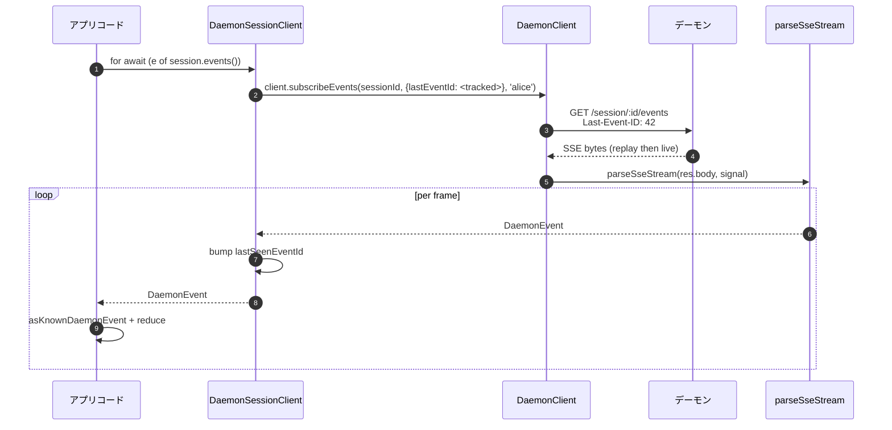
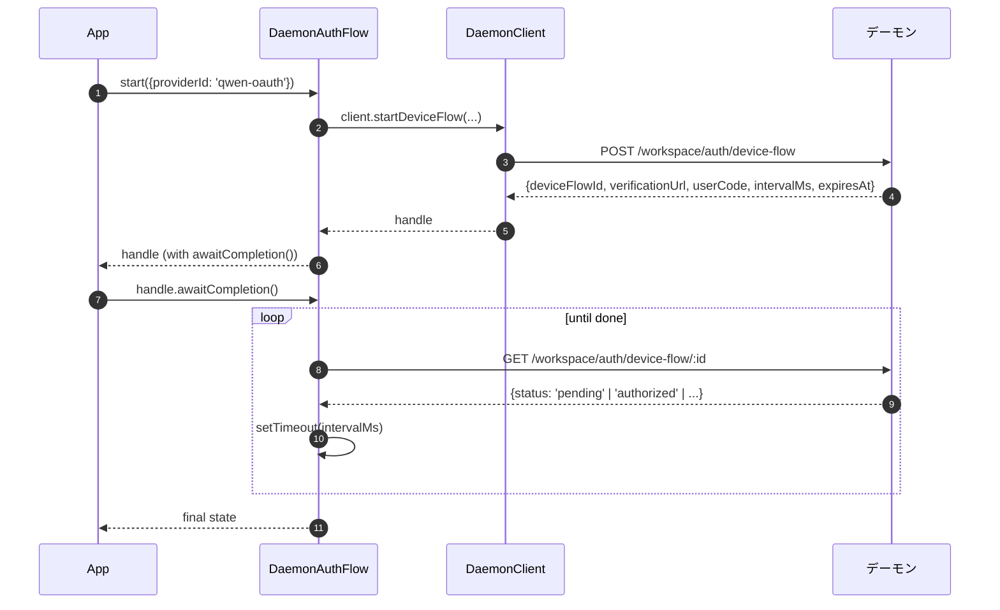

# TypeScript SDK デーモンクライアント

## 概要

`packages/sdk-typescript/src/daemon/` は **TypeScript SDK のデーモンクライアント**です。これは、実行中の `qwen serve` デーモンに、任意の TypeScript / JavaScript ホスト（CLI 独自の TUI アダプター、チャネルボットバックエンド、VS Code IDE コンパニオン、カスタムスクリプト、サーバーサイド Web バックエンド）から接続するための標準的な方法です。他のすべてのアダプターはこれに依存しています。

パッケージ構成は意図的に小さくシンプルに保たれています。

| ファイル                   | 公開 API                                                                                                                       |
| -------------------------- | ------------------------------------------------------------------------------------------------------------------------------ |
| `index.ts`                 | 公開バレル（`DaemonClient`, `DaemonSessionClient`, `DaemonAuthFlow`, `parseSseStream`, イベントリデューサー、型）。              |
| `DaemonClient.ts`          | 低レベル HTTP/SSE ファサード — `qwen-serve-protocol.md` の各ルートに対応するメソッドを提供。                                     |
| `DaemonSessionClient.ts`   | SSE リプレイ追跡を備えたセッションスコープのラッパー。                                                                         |
| `DaemonAuthFlow.ts`        | 高レベル OAuth デバイスフローヘルパー。                                                                                          |
| `sse.ts`                   | `parseSseStream`（NDJSON / SSE フレーミングパーサー）。                                                                          |
| `events.ts`                | `asKnownDaemonEvent`, `reduceDaemonSessionEvent`, `reduceDaemonAuthEvent`（[`09-event-schema.md`](./09-event-schema.md) を参照）。 |
| `types.ts`                 | `DaemonCapabilities`, `DaemonSession`, `DaemonEvent`, `PermissionResponse`, `PromptResult`, MCP / エージェント / メモリ / 認証関連の型。 |

チュートリアルの例は [`../examples/daemon-client-quickstart.md`](../examples/daemon-client-quickstart.md) にあります。このドキュメントはアーキテクチャとコントラクトのリファレンスです。

## 責務

- デーモンの各 HTTP ルートに対応する TypeScript メソッドを 1 つずつ提供します。
- すべてのリクエストに Bearer トークンと `X-Qwen-Client-Id` を正しく付与します。
- 呼び出し元の `AbortSignal` と呼び出しごとのタイムアウトを合成します（長時間稼働する SSE を切断しないようにします）。
- SSE フレームをストリーミングし、型付きの `DaemonEvent` にパースします。
- セッションごとに `lastSeenEventId` を追跡し、再接続時に正しくリプレイされるようにします。
- デーモンから指定された間隔でポーリングするデバイスフロー認証のインターフェースを公開します。

## アーキテクチャ

### `DaemonClient` (`DaemonClient.ts`)

コンストラクタ:

```ts
new DaemonClient({
  baseUrl: string,                  // default 'http://127.0.0.1:4170'
  token?: string,
  fetch?: typeof globalThis.fetch,  // injectable for tests
  fetchTimeoutMs?: number,          // 0 = disabled; default DEFAULT_FETCH_TIMEOUT_MS
});
```

メソッドグループ（各メソッドはオプションの `clientId` を受け取り、`X-Qwen-Client-Id` を付与します）:

| グループ               | メソッド                                                                                                                                                                                                                             |
| ---------------------- | ----------------------------------------------------------------------------------------------------------------------------------------------------------------------------------------------------------------------------------- |
| 基盤                   | `health()`, `capabilities()`, `auth` (lazy `DaemonAuthFlow` accessor)                                                                                                                                                               |
| セッション             | `createOrAttachSession`, `loadSession`, `resumeSession`, `listSessions`, `closeSession`, `setSessionMetadata`, `getSessionContext`, `getSessionSupportedCommands`, `setSessionApprovalMode`, `setSessionModel`                      |
| プロンプト実行         | `prompt`, `cancel`, `heartbeat`                                                                                                                                                                                                     |
| イベント               | `subscribeEvents` (SSE generator), `subscribeEventsStream` (raw response)                                                                                                                                                           |
| 権限                   | `respondToPermission`, `respondToSessionPermission`                                                                                                                                                                                 |
| ワークスペーススナップショット | `getWorkspaceMcp`, `getWorkspaceSkills`, `getWorkspaceProviders`, `getWorkspaceEnv`, `getWorkspacePreflight`                                                                                                                        |
| ワークスペース変更     | `writeWorkspaceMemory`, `readWorkspaceMemory`, `listWorkspaceAgents`, `getWorkspaceAgent`, `createWorkspaceAgent`, `updateWorkspaceAgent`, `deleteWorkspaceAgent`, `toggleWorkspaceTool`, `restartMcpServer`, `initializeWorkspace` |
| ファイル               | `readFile`, `readFileBytes`, `writeFile`, `editFile`, `listDirectory`, `globPaths`, `statPath`                                                                                                                                      |
| 認証                   | `startDeviceFlow`, `pollDeviceFlow`, `cancelDeviceFlow`, `getAuthStatus`                                                                                                                                                            |

### `fetchWithTimeout`

すべてのリクエストは `fetchWithTimeout` を経由します。重要な詳細は以下の通りです。

- **ボディの読み取りはタイマーのスコープ内で行われます。** 以前の実装ではヘッダー到着時にタイマーがクリアされていましたが、プロキシがボディの途中でストールした場合、`await res.json()` が `fetchTimeoutMs` を超えてハングする可能性がありました。現在の実装では、ボディ読み取りコードをコールバックとして渡すことで、タイマーがヘッダー到着とボディ消費の両方をカバーするようになっています。
- **`perCallTimeoutMs`** を使用すると、単一の呼び出しでクライアント全体のデフォルト値をオーバーライドできます。最も目立つ呼び出し元は `restartMcpServer` で、SDK は `MCP_RESTART_DEFAULT_TIMEOUT_MS = 330_000`（5分30秒）を使用します。デーモン側の `MCP_RESTART_TIMEOUT_MS` は正確に 300秒です。クライアントがこの値に一致させた場合、300秒付近で完了する再起動が、デーモンが構造化レスポンスをシリアライズして送信している間にレースに負けてしまい、誤った `TimeoutError` を引き起こす可能性があります。追加の 30秒は、両サイドでのシリアライズ、ネットワーク転送、デコードをカバーします。より厳しい予算が必要な呼び出し元は `timeoutMs` を渡すことができます。`0` を渡すとタイムアウトが無効になります。
- **`AbortSignal.any`** は呼び出し元から提供されたシグナルと呼び出しごとのタイマーシグナルを合成するため、呼び出し元のキャンセルと呼び出しごとのタイムアウトの両方がクリーンにアボートされます。
- **`AbortSignal.timeout()` の代わりに `AbortController` とキャンセル可能な `setTimeout`** を使用することで、すぐに解決するリクエストがイベントループ上で保留中のタイマーをリークしないようにします。タイマーは `finally` でクリアされます。
- **ストリーミングエンドポイント（`subscribeEvents`）はタイムアウトをバイパスします。** 長時間稼働する SSE はこれによって切断されてはなりません。

### `DaemonSessionClient` (`DaemonSessionClient.ts`)

1つのセッションにバインドし、`lastSeenEventId` を自動的に追跡することで、呼び出し元の追加の状態なしに SSE リプレイと再接続が機能するようにします。

```ts
class DaemonSessionClient {
  readonly client: DaemonClient;
  readonly session: DaemonSession;
  readonly state: DaemonSessionState;
  private lastSeenEventId: number | undefined;

  static createOrAttach(client, req?): Promise<DaemonSessionClient>;
  static load(client, sessionId, req?): Promise<DaemonSessionClient>;
  static resume(client, sessionId, req?): Promise<DaemonSessionClient>;

  events(opts?: DaemonSessionSubscribeOptions): AsyncIterable<DaemonEvent>;
  prompt(req: PromptRequest): Promise<PromptResult>;
  cancel(): Promise<void>;
  respondToPermission(...): Promise<PermissionResponse>;
  setModel(modelServiceId): Promise<SetModelResult>;
  heartbeat(): Promise<HeartbeatResult>;
  setMetadata(metadata): Promise<SessionMetadataResult>;
  close(): Promise<void>;
}
```

`events()` はデフォルトで `resume: true` を指定して `client.subscribeEvents` をプロキシします。追跡された `lastSeenEventId` を渡すため、再接続時に前のサブスクリプションが停止した場所からリプレイされます。生成されるイベントごとに `lastSeenEventId` が更新されます。

### `DaemonAuthFlow` (`DaemonAuthFlow.ts`)

```ts
class DaemonAuthFlow {
  start(opts: { providerId, ... }): Promise<DaemonAuthFlowHandle>;
}
interface DaemonAuthFlowHandle {
  deviceFlowId: string;
  providerId: string;
  expiresAt: string;
  verificationUrl: string;
  userCode: string;
  awaitCompletion(opts?): Promise<DaemonAuthDeviceFlowState>;
  cancel(): Promise<void>;
}
```

`awaitCompletion()` は、フローが `authorized`、`failed`、または `cancelled` になるまで、デーモンから指定された `intervalMs` 間隔で `GET /workspace/auth/device-flow/:id` をポーリングします。これは `client.auth` を介して遅延構築されるため、認証に触れないクライアントはアロケーションコストを負担しません。

### `parseSseStream` (`sse.ts`)

`Response.body`（`ReadableStream<Uint8Array>`）を `AsyncIterable<DaemonEvent>` に変換します。以下の処理を行います。

- LF および CRLF フレーミング。
- バッファオーバーフロー上限（16 MiB）— デーモンが異常に大きな単一フレームを出力した場合の防御的な上限。
- AbortSignal の配線 — アボートするとストリームとイテレータが閉じられます。
- コメントのみのフレームと不明なイベントタイプ（`DaemonEvent` として渡されます。SDK 消費者はダウンストリームで `asKnownDaemonEvent` を介して絞り込みます）。

### 型 (`types.ts`)

主なエクスポート: `DaemonCapabilities`, `DaemonSession` (`{ sessionId, workspaceCwd, attached, clientId?, createdAt? }`), `DaemonEvent`, `DaemonSessionState`, `DaemonSessionContextStatus`, `DaemonSessionSupportedCommandsStatus`, `PermissionResponse`, `PromptResult`, `HeartbeatResult`, `SetModelResult`, `SessionMetadataResult`、および MCP / エージェント / メモリ / 認証の結果型。

## ワークフロー

### 作成またはアタッチ + 最初のプロンプト


### リプレイ付きサブスクライブ



### デバイスフロー認証



`qwen-oauth` はレガシーな v1 プロバイダー識別子です。Qwen OAuth 無料枠は 2026-04-15 に廃止されたため、新しいクライアントは利用可能な場合、現在サポートされている認証プロバイダーを優先する必要があります。

## 状態とライフサイクル

- `DaemonClient` はコネクションレスです。コンストラクト時には何も起こりません。各メソッドは新しい `fetch` を開きます。
- `DaemonSessionClient` は `events()` の呼び出しをまたいで `lastSeenEventId` を保持し、再接続時に最後に見たものからリプレイします。
- `DaemonAuthFlow` は遅延評価です。`client.auth` は初回アクセス時にそれを構築します。
- SSE イテレータは、(a) デーモンがストリームを終了したとき、(b) `AbortSignal.abort()` が発生したとき、(c) 消費者が `for await` から抜け出したとき、または (d) バッファオーバーフロー上限（16 MiB）に達したときに閉じられます。

## 依存関係

- `globalThis.fetch`（Node 18+ 組み込み、ブラウザ、undici など）。テスト用に `DaemonClient` ごとに注入可能です。
- ネイティブの `AbortController` / `AbortSignal.any` / `setTimeout`。
- `@qwen-code/qwen-code-core` や `@qwen-code/acp-bridge` への推移的な依存関係はありません。SDK パッケージは完全に切り離されているため、外部の消費者がデーモンの内部を引き込むことはありません。

## `ui/*` サブパッケージ ([#4328](https://github.com/QwenLM/qwen-code/pull/4328) + [#4353](https://github.com/QwenLM/qwen-code/pull/4353))

SDK は `packages/sdk-typescript/src/daemon/ui/` もエクスポートします。これは、デーモンイベントをトランスクリプトブロックに変換する、ホストに依存しないプリミティブのセットです。

- `normalizeDaemonEvent(evt)` は、既知の 47 のデーモンワイヤーイベントを、UI フレンドリーな 42 の `DaemonUiEventType` 値にマッピングします。モデル化されていないイベントや不正なイベントは `debug` に正規化されます。
- `createDaemonTranscriptState()` と `reduceDaemonTranscriptEvents(state, events)` は、UI イベントを `DaemonTranscriptBlock[]` に射影します。
- `createDaemonTranscriptStore()` はサブスクライブ / ディスパッチをラップします。
- `render.ts` / `terminal.ts` は HTML とターミナルのベースラインレンダラーを提供し、`toolPreview.ts` はツール呼び出しのサマリーを生成します。
- セレクタには `selectTranscriptBlocksOrderedByEventId`, `selectPendingPermissionBlocks`, `selectCurrentTool`, `selectApprovalMode`, `selectToolProgress`, `selectSubagentChildBlocks`, `formatMissedRange`, `formatBlockTimestamp` が含まれます。
- 公開定数には `DAEMON_PLAN_TOOL_CALL_ID` が含まれます。
- `conformance.ts` にはクロスホスト一貫性テストスイートが含まれています。

最初の本番環境での消費者は、React の `DaemonSessionProvider` を介した `packages/webui/src/daemon/` です。詳細なアーキテクチャ、用語集、セレクタテーブル、およびレガシーな `DaemonTuiAdapter` との関係については、[`14-cli-tui-adapter.md`](./14-cli-tui-adapter.md) を参照してください。

このサブパッケージは `@qwen-code/sdk/daemon` サブパスからエクスポートされます。`import { DaemonClient }` を実行している既存のコードは影響を受けません。

## SDK を使用した `Last-Event-ID` 再接続

### `DaemonSessionClient` による自動追跡

`DaemonSessionClient` は内部的に `lastSeenEventId` を追跡します。数値の `id` を持つ生成されるイベントごとにカーソルが更新されます。後続の `events()` 呼び出しは、追跡された id を `Last-Event-ID` として自動的に渡すため、呼び出し元の追加の状態なしにリプレイ付き再接続が機能します。

```ts
import { DaemonClient, DaemonSessionClient } from '@qwen-code/sdk/daemon';

const client = new DaemonClient({ baseUrl: 'http://127.0.0.1:4170', token });
const session = await DaemonSessionClient.createOrAttach(client);

// 最初のサブスクリプション — ライブで開始（新しいセッションの場合はリングの開始から）。
for await (const event of session.events()) {
  console.log(event.type, event.id);
  // session.lastEventId は id を含むフレームごとに更新されます。
  if (shouldStop(event)) break;
}

// 再接続 — Last-Event-ID: <最後に見た id> を自動的に送信します。
// デーモンはリングから逃したイベントをリプレイし、その後ライブに移行します。
for await (const event of session.events()) {
  // リプレイフレームが最初に到着し、次に合成された replay_complete が到着し、
  // その後ライブイベントが到着します。
  handleEvent(event);
}
```

### `DaemonClient` を使用した手動再接続

より低レベルの制御については、`DaemonClient.subscribeEvents` を直接使用し、カーソルを自分で管理します。

```ts
const client = new DaemonClient({ baseUrl: 'http://127.0.0.1:4170', token });

let cursor: number | undefined; // undefined = 初回接続時はライブのみ

async function* subscribe(sessionId: string, signal: AbortSignal) {
  for await (const event of client.subscribeEvents(sessionId, {
    lastEventId: cursor,
    signal,
  })) {
    // id を含むフレームのみがカーソルを進めます。
    if (event.id !== undefined) {
      cursor = event.id;
    }
    // リングエビクションのギャップを処理します。
    if (event.type === 'state_resync_required') {
      // 状態が古くなっています — セッション状態全体をリロードします。
      await client.loadSession(sessionId);
      continue;
    }
    yield event;
  }
}
```

### リトライループによる再接続

SDK はネットワーク障害時に自動リトライを**行いません**。`events()` の周りにリトライループを実装してください。

```ts
async function resilientSubscribe(session: DaemonSessionClient) {
  const MAX_RETRIES = 10;
  const BASE_DELAY_MS = 1000;

  for (let attempt = 0; attempt < MAX_RETRIES; attempt++) {
    try {
      // resume: true（デフォルト）は追跡された lastSeenEventId を渡します。
      for await (const event of session.events()) {
        attempt = 0; // イベント成功時にリセット
        handleEvent(event);
      }
      break; // クリーンなストリーム終了
    } catch (err) {
      const delay = BASE_DELAY_MS * 2 ** Math.min(attempt, 5);
      await new Promise((r) => setTimeout(r, delay));
    }
  }
}
```

再接続時、デーモンはバウンドされたリング（デフォルト 8000 イベント）から `id > lastSeenEventId` のイベントをリプレイします。ギャップがリングを超えた場合、`state_resync_required` フレームがクライアントに `loadSession` を呼び出して状態を完全に再構築するよう通知します。

### コンストラクト時の `lastEventId` のシード

プロセス再起動をまたいでカーソルを保持する呼び出し元は、それをシードできます。

```ts
const session = new DaemonSessionClient({
  client,
  session: { sessionId, workspaceCwd, attached: true },
  lastEventId: persistedCursor, // 保持された位置から再開
});
```

値は有限の非負整数である必要があります（コンストラクト時に検証されます）。無効な値はスローされます。

## 設定

| 設定項目           | 場所                                 | 効果                                                                                    |
| ------------------ | ------------------------------------ | --------------------------------------------------------------------------------------- |
| `baseUrl`          | `DaemonClient` コンストラクタ        | デーモンの URL。末尾のスラッシュは削除されます。                                        |
| `token`            | `DaemonClient` コンストラクタ        | `Authorization: Bearer` として付与されます。                                            |
| `fetch`            | `DaemonClient` コンストラクタ        | テスト注入ポイント。                                                                    |
| `fetchTimeoutMs`   | `DaemonClient` コンストラクタ        | 呼び出しごとのタイムアウト。`0` = 無効。                                                |
| `clientId`         | メソッドごとのオプション引数         | `X-Qwen-Client-Id` ヘッダー（[`08-session-lifecycle.md`](./08-session-lifecycle.md) を参照）。 |
| `lastEventId`      | `DaemonSessionClient` コンストラクタ | リプレイカーソルのシード。                                                              |
| `maxQueued`        | サブスクライブごとのオプション       | SSE ルートの `?maxQueued=N`。事前に `caps.features.slow_client_warning` を確認してください。 |
| `perCallTimeoutMs` | メソッドごと（例: `restartMcpServer`） | クライアント全体のタイムアウトをオーバーライド。                                        |

## 注意事項と既知の制限

- **`fetchTimeoutMs` は接続レベルではなく呼び出しごとです。** 長時間のボディ読み取りはタイマーを共有します。レスポンスをストリーミングするデーモンは、呼び出しごとにオーバーライドするか、タイムアウトを `0` に設定する必要があります。
- **SSE は fetch タイムアウトをバイパスします。** 長時間稼働する SSE 接続は `fetchTimeoutMs` によって切断されません。呼び出し元が制御するキャンセルには `AbortSignal` を使用してください。
- **`parseSseStream` のバッファ上限は 16 MiB です。** これは防御的な上限です。これより大きな単一フレームはイテレータをアボートします（デーモンがこのようなフレームを正当に出力することはありません）。
- **`asKnownDaemonEvent` は認識されないイベントタイプに対して `undefined` を返します。** SDK 消費者は、ユニオンが網羅的であると想定するのではなく、この分岐を処理する必要があります。それが前方互換性のコントラクトです。認識されないイベントは `DaemonSessionViewState.unrecognizedKnownEventCount` をインクリメントします。
- **`client_evicted`、`slow_client_warning`、`stream_error` はリプレイリングに含まれません。** エビクション後に再接続しても、デーモンのリングから再開され、エビクションフレームが再度表示されることはありません。
- **`DaemonClient` は自動リトライを行いません。** ネットワーク障害は拒否（rejection）として表面化します。再接続 / リプレイ戦略は呼び出し元の責任です（`DaemonSessionClient.events()` はリプレイを簡単にしますが、再接続は依然として呼び出しごとです）。
## 参照

- `packages/sdk-typescript/src/daemon/DaemonClient.ts`
- `packages/sdk-typescript/src/daemon/DaemonSessionClient.ts`
- `packages/sdk-typescript/src/daemon/DaemonAuthFlow.ts`
- `packages/sdk-typescript/src/daemon/sse.ts`
- `packages/sdk-typescript/src/daemon/events.ts`
- `packages/sdk-typescript/src/daemon/types.ts`
- エンドツーエンドのウォークスルー: [`../examples/daemon-client-quickstart.md`](../examples/daemon-client-quickstart.md)。