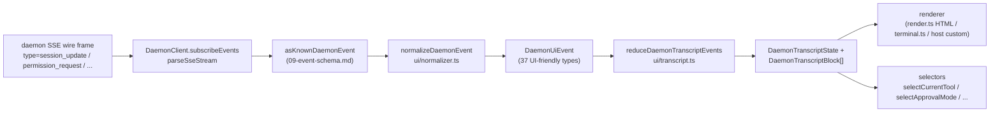

# 共有UI トランスクリプトレイヤー

> **現在のステータス**: `packages/cli/src/ui/daemon/daemon-tui-adapter.ts` はレガシーの実験的CLIサイドアダプターとして `main` ブランチに引き続き存在します。このドキュメントでは、新しいSDKサイドの共有UIトランスクリプトレイヤーについて説明します。これは、Web、TUI、IDE、IMチャンネルなど、あらゆるUIホストが利用できる再利用可能なデーモンイベント正規化とトランスクリプトプリミティブです。CLI TUI、チャンネル、VS Code IDEのマイグレーションはフォローアップ作業となります。

## 概要

`packages/sdk-typescript/src/daemon/ui/` はSDKに `ui/*` サブパッケージを追加します。再利用可能なプリミティブを通じて、デーモンSSEイベントストリームをUIがレンダリング可能なトランスクリプトブロックに変換します。

- **正規化** (`normalizer.ts`): デーモンワイヤースキーマの既知の43種類のイベントタイプ（[`09-event-schema.md`](./09-event-schema.md) 参照）を、`assistant.text.delta`、`tool.update`、`session.metadata.changed` などの37種類のUI向け `DaemonUiEventType` セマンティクスイベントにマッピングします。
- **ステートマシン** (`transcript.ts`、`store.ts`): 純粋なリデューサーと購読可能なストアで、UIイベントを順序付きの `DaemonTranscriptBlock[]` に変換します。
- **レンダラー** (`render.ts`、`terminal.ts`、`toolPreview.ts`): トランスクリプトブロックをHTML、ターミナルテキスト、ツールプレビュー文字列に変換します。ホストはこれらを利用するか、独自のものに置き換えることができます。
- **適合性テスト** (`conformance.ts`): チャンネル、TUI、IDEのサーフェスがこれらのプリミティブに移行する際に使用するクロスホスト整合性テストです。

最初のプロダクション消費者は **`packages/webui/src/daemon/`** ([#4328](https://github.com/QwenLM/qwen-code/pull/4328)) です。ReactのDaemonSessionProviderとトランスクリプトアダプターにより、Web UIはホストの `postMessage` トラフィックをレンダリングするだけでなく、デーモンのHTTP+SSEに直接接続できます。CLI TUI、チャンネルベース、VS Code IDEは後で同じレイヤーを再利用できます。[`../daemon-ui/MIGRATION.md`](../daemon-ui/MIGRATION.md) にはv2の段階的なマイグレーションガイドが記載されています。

## 責務

- デーモンの43種類のワイヤーイベントを安定したUI語彙（`DaemonUiEventType`）に正規化し、レンダラーが `rawEvent.data` を検査しなくて済むようにします。
- デーモンの単調増加するSSE `eventId` を**主要な順序付けキー**として保持し、異なるクライアントが同じ順序でトランスクリプトをレンダリングできるようにします。
- 純粋なリデューサーを使用してトランスクリプトブロックを生成し、保留中の権限、現在のツール、承認モード、ツールの進捗状況、サブエージェントの子などのセレクターを提供します。
- ベースラインHTMLおよびターミナルレンダラーを提供しつつ、ホスト固有のレンダリングも許可します。
- プランパネル用の `DAEMON_PLAN_TOOL_CALL_ID` などのパブリック定数を公開します。
- 追加的なワイヤー互換性を維持します。未知のイベントタイプは破棄されるのではなく `debug` に正規化されます。

## アーキテクチャ

### パッケージ構造

| ファイル                                             | エクスポート                                                                                                                                                           | 目的                     |
| ------------------------------------------------ | ----------------------------------------------------------------------------------------------------------------------------------------------------------------- | --------------------------- |
| `packages/sdk-typescript/src/daemon/ui/index.ts` | サブパッケージのバレル                                                                                                                                                 | パブリックエントリーポイント          |
| `ui/types.ts`                                    | `DaemonUiEventType`、タイプ別 `DaemonUiEvent*` インターフェース、`DaemonTranscriptBlock`、`DaemonTranscriptState`、`DaemonUiToolProvenance`、`DAEMON_PLAN_TOOL_CALL_ID` | 型定義                       |
| `ui/normalizer.ts`                               | `normalizeDaemonEvent(evt) -> DaemonUiEvent`、`getSessionUpdatePayload(evt)`                                                                                      | ワイヤーからUIへのマッピング          |
| `ui/transcript.ts`                               | `createDaemonTranscriptState()`、`appendLocalUserTranscriptMessage()`、`reduceDaemonTranscriptEvents()`、`rebuildDaemonTranscriptBlockIndex()`、セレクター         | ステートマシンとセレクター |
| `ui/store.ts`                                    | `createDaemonTranscriptStore(initial?)`                                                                                                                           | 購読可能なリデューサーストア  |
| `ui/toolPreview.ts`                              | `createDaemonToolPreview(toolEvent)`                                                                                                                              | ツールコールのサマリーテキスト      |
| `ui/render.ts`                                   | `DaemonHtmlRenderOptions`、`DaemonRenderOptions`、レンダー関数                                                                                                                | HTMLおよび汎用レンダリング  |
| `ui/terminal.ts`                                 | ターミナル固有のレンダリング                                                                                                                                       | TUI向け準備             |
| `ui/conformance.ts`                              | クロスホスト適合性スイート                                                                                                                                      | マイグレーション同等性テスト      |
| `ui/utils.ts`                                    | `DaemonUiContentPart` などのヘルパー                                                                                                                             | 内部共有ユーティリティ   |

### `DaemonUiEventType` 語彙

`ui/types.ts` はドメインごとにグループ化された37種類のUIイベントタイプを定義しています。

**チャットストリーム（Stage 1）**

- `user.text.delta`、`user.image.delta`、`user.shell.command`、`assistant.text.delta`、`assistant.done`、`thought.text.delta`
- `tool.update`、`shell.output`、`user.shell.output`
- `permission.request`、`permission.resolved`
- `model.changed`、`status`、`error`、`debug`

**セッションメタデータ**

- `session.metadata.changed`、`session.approval_mode.changed`
- `session.available_commands`、`session.state_resync_required`、`session.replay_complete`

**プロンプトライフサイクル（クロスクライアント）**

- `prompt.cancelled`、`followup.suggestion`

**ワークスペース（Wave 3-4）**

- `workspace.memory.changed`、`workspace.agent.changed`
- `workspace.tool.toggled`、`workspace.settings.changed`、`workspace.initialized`
- `workspace.mcp.budget_warning`、`workspace.mcp.child_refused`
- `workspace.mcp.server_restarted`、`workspace.mcp.server_restart_refused`

**認証フロー（Wave 4 OAuth）**

- `auth.device_flow.started`、`auth.device_flow.throttled`、`auth.device_flow.authorized`
- `auth.device_flow.failed`、`auth.device_flow.cancelled`

`normalizeDaemonEvent` はデーモンの既知の43種類のワイヤーイベントをこの語彙にマッピングします。未知、未モデル化、または不正なイベントタイプは `debug` に正規化され、ホストの診断用に `rawEvent` が保持されます。

### リデューサーとセレクター

```ts
// 初期状態を作成する。
const state = createDaemonTranscriptState();

// SSEイベントシーケンスを適用する。
const next = reduceDaemonTranscriptEvents(state, daemonUiEvents);

// セレクター。
selectTranscriptBlocks(state); // すべてのブロック
selectTranscriptBlocksOrderedByEventId(state); // eventIdで順序付け（推奨キー）
selectPendingPermissionBlocks(state);
selectCurrentTool(state);
selectApprovalMode(state);
selectToolProgress(state, toolCallId);
selectSubagentChildBlocks(state, parentBlockId);
isSubagentChildBlock(block);
formatBlockTimestamp(block);
formatMissedRange(state); // state_resync_required後の "X件のイベントを見逃しました" テキスト
```

### ストア

`createDaemonTranscriptStore()` はsubscribeとdispatchを提供します。

```ts
const store = createDaemonTranscriptStore();
store.subscribe(() => render(store.getState()));
store.dispatch(uiEvents); // 内部でリデューサーを実行する
```

Web UIの `DaemonSessionProvider` はこのストアの上にReactコンテキストを構築します。

## フロー

### 単一SSEイベントのエンドツーエンド



ホストは `(E)` で止まって独自のリデューサーを実装するか、`(G)` と提供されたセレクターを利用することができます。Web UIは `(B) -> (H)` の完全なパスを使用します。マイグレーション済みのTUIは `(G)` を利用して、Ink固有のコンポーネントでレンダリングできます。

### `state_resync_required`

`session.state_resync_required` はトランスクリプトの「見逃した範囲」マーカーにマッピングされます。UIコードは `formatMissedRange(state)` を呼び出して、"missed events X-Y" のようなテキストをレンダリングできます。リデューサーは**その後のイベントの適用を継続**しますが、影響を受けるブロックに `resyncRecovery: true` をマークし、レンダラーが視覚的なコンテキストを追加できるようにします。リングエビクションと `state_resync_required` のセマンティクスについては [`10-event-bus.md`](./10-event-bus.md) を参照してください。

## コンシューマー

### `packages/webui/src/daemon/`

これは [#4328](https://github.com/QwenLM/qwen-code/pull/4328) でマージされました。

| ファイル                        | エクスポート                                                                                                                                                                                                                                                                                                                        |
| --------------------------- | ------------------------------------------------------------------------------------------------------------------------------------------------------------------------------------------------------------------------------------------------------------------------------------------------------------------------------ |
| `DaemonSessionProvider.tsx` | React `<DaemonSessionProvider />`；`useDaemonSession()`、`useDaemonTranscriptStore()`、`useDaemonTranscriptState()`、`useDaemonTranscriptBlocks()`、`useDaemonPendingPermissions()`、`useDaemonActions()`、`useDaemonConnection()` フック；`DaemonConnectionStatus`、`DaemonConnectionState`、`DaemonSessionContextValue` 型 |
| `transcriptAdapter.ts`      | SDK の `DaemonTranscriptBlock` をWeb UIの `UnifiedMessage` に変換します。マークダウンストリーミングのチャンクマージとツールコールサマリーを含みます。                                                                                                                                                                        |
| `index.ts`                  | サブパッケージのバレル                                                                                                                                                                                                                                                                                                              |

Web UIはデーモンのHTTP+SSEに直接接続してトランスクリプトをレンダリングできるようになりました。旧来の `ACPAdapter` ホストの `postMessage` パスは引き続き利用可能です。

### 今後のマイグレーション

[`../daemon-ui/MIGRATION.md`](../daemon-ui/MIGRATION.md) はWebチャットとWebターミナルアダプターのv2段階的ガイドを提供しています。そのPRでは **CLI TUI、チャンネルベース、VS Code IDEは移行されていない**ことを明示しており、それぞれフォローアップPRで移行し、適合性スイートを使用してレンダリングの同等性を維持します。

## レガシー `daemon-tui-adapter.ts` との関係

| 次元         | レガシーCLI `DaemonTuiAdapter`                                   | 新しい共有トランスクリプトレイヤー                                    |
| ----------------- | --------------------------------------------------------------- | -------------------------------------------------------------- |
| パッケージ           | `packages/cli/src/ui/daemon/`                                   | `packages/sdk-typescript/src/daemon/ui/`                       |
| パブリックサーフェス    | `DaemonTuiAdapter`、`DaemonTuiUpdate`、`DaemonTuiSessionClient` | `DaemonUiEventType`、`reduceDaemonTranscriptEvents`、セレクター |
| スコープ             | CLI Ink TUI のみ                                                | Web、TUI、IDE、またはIM UI                                        |
| 状態の形状       | TUIローカルの更新ユニオン                                          | 純粋なトランスクリプトブロックリストと状態フィールド                   |
| 順序付け          | `createdAt`                                                     | `eventId`（デーモン単調増加、クライアント間で一貫）        |
| 未知のワイヤータイプ | `reduceDaemonEventToTuiUpdates` で破棄                      | `debug` に正規化して保持                            |
| テスト             | 単一パッケージのユニットテスト                                       | クロスホスト同等性のためのグローバル適合性スイート                 |

## 依存関係

- 上流のワイヤー型: `packages/sdk-typescript/src/daemon/events.ts`（[`09-event-schema.md`](./09-event-schema.md) 参照）。
- 実際の下流コンシューマー: `packages/webui/src/daemon/`。
- 今後のマイグレーション対象: `packages/cli/src/ui/`、`packages/channels/base/`、および `packages/vscode-ide-companion/src/services/daemonIdeConnection.ts`。
- 並行参照: [`../daemon-ui/README.md`](../daemon-ui/README.md)、[`../daemon-ui/MIGRATION.md`](../daemon-ui/MIGRATION.md)、および [`../daemon-client-adapters/web-ui.md`](../daemon-client-adapters/web-ui.md)。

## 設定

- ランタイム設定はありません。リデューサーとセレクターは純粋関数です。
- ホストはレンダラーを選択します: HTML（`render.ts`）、ターミナル（`terminal.ts`）、またはカスタムレンダリング。
- デバッグ用に、`render.ts` は `includeRawEvent: true` をサポートしており、レンダリング出力に生のワイヤーフレームを含めることができます。

## 注意事項と既知の制限

- **`daemon-tui-adapter.ts` は引き続き存在します**。これはCLIパッケージのレガシーな実験的アダプターです。新しいコードはSDKの `ui/*`（`normalizeDaemonEvent`、`reduceDaemonTranscriptEvents`、`DaemonTranscriptBlock`）を優先して使用してください。
- **CLI TUI、チャンネルベース、VS Code IDEはまだ移行されていません**。これらは独自のレンダリングロジックを維持しています。`docs/developers/daemon-client-adapters/` ディレクトリには `ide.md`、`channel-web.md`、歴史的な `tui.md` ドラフトが引き続き存在します。新しい `web-ui.md` はWeb UIアダプターの設計をカバーしています。
- **`eventId` が主要な順序付けキーです**。`createdAt` は非推奨のエイリアス（`clientReceivedAt`）として残っています。新しいコードでは `selectTranscriptBlocksOrderedByEventId(state)` を使用してください。`MIGRATION.md` には `createdAt` 順序から `eventId` 順序への切り替えのコード差分が記載されています。
- **未知のワイヤータイプは `debug` に正規化されます**。旧アダプターのように破棄されなくなりました。レンダラーはデフォルトで `debug` を表示しません。ホストが表示を有効化する必要があります。
- **バンドルサイズ**: `ui/*` サブパッケージは `@qwen-code/sdk/daemon` 経由でESMサブパスとしてエクスポートされており、ReactやDOM依存関係を引き込みません。React統合はWeb UIコンシューマーが `DaemonSessionProvider` を使用する場合にのみロードされます。

## 参考資料

- `packages/sdk-typescript/src/daemon/ui/types.ts`（`DaemonUiEventType` 語彙）
- `packages/sdk-typescript/src/daemon/ui/transcript.ts`（リデューサーとセレクター）
- `packages/sdk-typescript/src/daemon/ui/normalizer.ts`（ワイヤーからUIへのマッピング）
- `packages/sdk-typescript/src/daemon/ui/store.ts`、`render.ts`、`terminal.ts`、`toolPreview.ts`、`conformance.ts`
- `packages/sdk-typescript/src/daemon/index.ts`（`ui/*` 再エクスポートブロック）
- `packages/webui/src/daemon/DaemonSessionProvider.tsx`、`transcriptAdapter.ts`
- 上流ドキュメント: [`../daemon-ui/README.md`](../daemon-ui/README.md)、[`../daemon-ui/MIGRATION.md`](../daemon-ui/MIGRATION.md)、[`../daemon-client-adapters/web-ui.md`](../daemon-client-adapters/web-ui.md)
- 関連PR: [#4328](https://github.com/QwenLM/qwen-code/pull/4328)（v1トランスクリプトレイヤーとWeb UIプロバイダー）、[#4353](https://github.com/QwenLM/qwen-code/pull/4353)（v2統合完全性フォローアップ）
