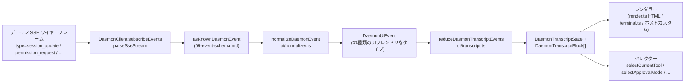

# 共有 UI トランスクリプトレイヤー

> **現在のステータス**: `packages/cli/src/ui/daemon/daemon-tui-adapter.ts` は、レガシーな実験的CLI側アダプターとして `main` ブランチにまだ残っています。本ドキュメントでは、新しいSDK側の共有UIトランスクリプトレイヤーについて説明します。これは、Web、TUI、IDE、IMチャネルを含む任意のUIホストが消費できる、再利用可能なデーモンイベント正規化とトランスクリプトプリミティブです。CLI TUI、チャネル、および VS Code IDE の移行は後続の作業となります。

## 概要

`packages/sdk-typescript/src/daemon/ui/` は、SDK に `ui/*` サブパッケージを追加します。これは、デーモンの SSE イベントストリームを、再利用可能なプリミティブを通じて UI でレンダリング可能なトランスクリプトブロックに変換します。

- **正規化** (`normalizer.ts`): デーモンのワイヤースキーマの47種類の既知のイベントタイプ（[`09-event-schema.md`](./09-event-schema.md) を参照）を、`assistant.text.delta`、`tool.update`、`session.metadata.changed` などの37種類の UIフレンドリな `DaemonUiEventType` セマンティックイベントにマッピングします。
- **ステートマシン** (`transcript.ts`, `store.ts`): UI イベントを順序付けされた `DaemonTranscriptBlock[]` に射影する、純粋なリデューサーとサブスクライブ可能なストアです。
- **レンダラー** (`render.ts`, `terminal.ts`, `toolPreview.ts`): トランスクリプトブロックを HTML、ターミナルテキスト、およびツールプレビュー文字列に変換します。ホストはこれらを使用することも、置き換えることもできます。
- **適合性** (`conformance.ts`): チャネル、TUI、および IDE サーフェスがこれらのプリミティブに移行する際に使用される、クロスホスト一貫性テストです。

最初の本番環境でのコンシューマーは **`packages/webui/src/daemon/`** ([#4328](https://github.com/QwenLM/qwen-code/pull/4328)) です。その React `DaemonSessionProvider` とトランスクリプトアダプターにより、Web UI はホストの `postMessage` トラフィックのみをレンダリングするのではなく、デーモンの HTTP+SSE に直接接続できるようになります。CLI TUI、チャネルベース、および VS Code IDE は後で同じレイヤーを再利用できます。[`../daemon-ui/MIGRATION.md`](../daemon-ui/MIGRATION.md) に v2 の段階的移行ガイドが記載されています。

## 責務

- 47種類のデーモンワイヤーイベントを安定した UI 語彙（`DaemonUiEventType`）に正規化し、レンダラーが `rawEvent.data` を検査しないようにします。
- デーモンで単調増加する SSE `eventId` を**プライマリ順序キー**として保持し、異なるクライアントが同じ順序でトランスクリプトをレンダリングできるようにします。
- 純粋なリデューサーを使用してトランスクリプトブロックを生成し、保留中の権限、現在のツール、承認モード、ツールの進行状況、およびサブエージェントの子に対するセレクターを提供します。
- ベースラインの HTML およびターミナルレンダラーを提供しつつ、ホスト固有のレンダリングを許可します。
- プランパネル用の `DAEMON_PLAN_TOOL_CALL_ID` などのパブリック定数を公開します。
- 追加的なワイヤー互換性を維持します。未知のイベントタイプはドロップされる代わりに `debug` に正規化されます。

## アーキテクチャ

### パッケージ構造

| ファイル                                             | エクスポート                                                                                                                                                           | 目的                     |
| ------------------------------------------------ | ----------------------------------------------------------------------------------------------------------------------------------------------------------------- | --------------------------- |
| `packages/sdk-typescript/src/daemon/ui/index.ts` | サブパッケージバレル                                                                                                                                                 | パブリックエントリーポイント          |
| `ui/types.ts`                                    | `DaemonUiEventType`、タイプごとの `DaemonUiEvent*` インターフェース、`DaemonTranscriptBlock`、`DaemonTranscriptState`、`DaemonUiToolProvenance`、`DAEMON_PLAN_TOOL_CALL_ID` | 型                       |
| `ui/normalizer.ts`                               | `normalizeDaemonEvent(evt) -> DaemonUiEvent`、`getSessionUpdatePayload(evt)`                                                                                      | ワイヤーからUIへのマッピング          |
| `ui/transcript.ts`                               | `createDaemonTranscriptState()`、`appendLocalUserTranscriptMessage()`、`reduceDaemonTranscriptEvents()`、`rebuildDaemonTranscriptBlockIndex()`、セレクター         | ステートマシンとセレクター |
| `ui/store.ts`                                    | `createDaemonTranscriptStore(initial?)`                                                                                                                           | サブスクライブ可能なリデューサーストア  |
| `ui/toolPreview.ts`                              | `createDaemonToolPreview(toolEvent)`                                                                                                                              | ツール呼び出しのサマリーテキスト      |
| `ui/render.ts`                                   | `DaemonHtmlRenderOptions`、`DaemonRenderOptions`、レンダー関数                                                                                                | HTMLおよび汎用レンダリング  |
| `ui/terminal.ts`                                 | ターミナル固有のレンダリング                                                                                                                                       | TUIの準備             |
| `ui/conformance.ts`                              | クロスホスト適合性スイート                                                                                                                                      | 移行の同等性テスト      |
| `ui/utils.ts`                                    | `DaemonUiContentPart` などのヘルパー                                                                                                                             | 内部共有ユーティリティ   |

### `DaemonUiEventType` 語彙

`ui/types.ts` は、ドメインごとにグループ化された37種類の UI イベントタイプを定義します。

**チャットストリーム (Stage 1)**

- `user.text.delta`、`user.image.delta`、`user.shell.command`、`assistant.text.delta`、`assistant.done`、`thought.text.delta`
- `tool.update`、`shell.output`、`user.shell.output`
- `permission.request`、`permission.resolved`
- `model.changed`、`status`、`error`、`debug`

**セッションメタデータ**

- `session.metadata.changed`、`session.approval_mode.changed`
- `session.available_commands`、`session.state_resync_required`、`session.replay_complete`

**プロンプトライフサイクル (クロスクライアント)**

- `prompt.cancelled`、`followup.suggestion`

**ワークスペース (Wave 3-4)**

- `workspace.memory.changed`、`workspace.agent.changed`
- `workspace.tool.toggled`、`workspace.settings.changed`、`workspace.initialized`
- `workspace.mcp.budget_warning`、`workspace.mcp.child_refused`
- `workspace.mcp.server_restarted`、`workspace.mcp.server_restart_refused`

**認証フロー (Wave 4 OAuth)**

- `auth.device_flow.started`、`auth.device_flow.throttled`、`auth.device_flow.authorized`
- `auth.device_flow.failed`、`auth.device_flow.cancelled`

`normalizeDaemonEvent` は、47種類の既知のデーモンワイヤーイベントをこの語彙にマッピングします。未知、未モデル化、または不正な形式のイベントタイプは `debug` に正規化され、ホスト診断用に `rawEvent` が保持されます。

### リデューサーとセレクター

```ts
// 初期状態を作成します。
const state = createDaemonTranscriptState();

// SSE イベントシーケンスを適用します。
const next = reduceDaemonTranscriptEvents(state, daemonUiEvents);

// セレクター。
selectTranscriptBlocks(state); // すべてのブロック
selectTranscriptBlocksOrderedByEventId(state); // eventId で順序付け。推奨キー
selectPendingPermissionBlocks(state);
selectCurrentTool(state);
selectApprovalMode(state);
selectToolProgress(state, toolCallId);
selectSubagentChildBlocks(state, parentBlockId);
isSubagentChildBlock(block);
formatBlockTimestamp(block);
formatMissedRange(state); // state_resync_required 後の "you missed X" テキスト
```

### ストア

`createDaemonTranscriptStore()` は、サブスクライブとディスパッチを提供します。

```ts
const store = createDaemonTranscriptStore();
store.subscribe(() => render(store.getState()));
store.dispatch(uiEvents); // 内部的にリデューサーを実行します
```

Web UI の `DaemonSessionProvider` は、このストアの上に React コンテキストを構築します。

## フロー

### 単一の SSE イベントのエンドツーエンド



ホストは `(E)` で停止して独自のリデューサーを実装するか、`(G)` と提供されたセレクターを消費できます。Web UI は完全な `(B) -> (H)` パスを使用します。移行された TUI は `(G)` を消費し、Ink 固有のコンポーネントでレンダリングできます。

### `state_resync_required`

`session.state_resync_required` は、トランスクリプトの「見逃した範囲」マーカーにマッピングされます。UI コードは `formatMissedRange(state)` を呼び出して、「イベント X-Y を見逃しました」などのテキストをレンダリングできます。リデューサーは**後続のイベントの適用を継続**しますが、影響を受けるブロックに `resyncRecovery: true` をマークし、レンダラーが視覚的なコンテキストを追加できるようにします。リングエビクションと `state_resync_required` のセマンティクスについては、[`10-event-bus.md`](./10-event-bus.md) を参照してください。

## コンシューマー

### `packages/webui/src/daemon/`

これは [#4328](https://github.com/QwenLM/qwen-code/pull/4328) でマージされました。

| ファイル                        | エクスポート                                                                                                                                                                                                                                                                                                                        |
| --------------------------- | ------------------------------------------------------------------------------------------------------------------------------------------------------------------------------------------------------------------------------------------------------------------------------------------------------------------------------ |
| `DaemonSessionProvider.tsx` | React `<DaemonSessionProvider />`、`useDaemonSession()`、`useDaemonTranscriptStore()`、`useDaemonTranscriptState()`、`useDaemonTranscriptBlocks()`、`useDaemonPendingPermissions()`、`useDaemonActions()`、`useDaemonConnection()` フック、`DaemonConnectionStatus`、`DaemonConnectionState`、`DaemonSessionContextValue` 型 |
| `transcriptAdapter.ts`      | SDK の `DaemonTranscriptBlock` を Web UI の `UnifiedMessage` にアダプトします。マークダウンストリーミングチャンクのマージやツール呼び出しのサマリーを含みます                                                                                                                                                                                        |
| `index.ts`                  | サブパッケージバレル                                                                                                                                                                                                                                                                                                              |

Web UI はデーモンの HTTP+SSE に直接接続してトランスクリプトをレンダリングできるようになりました。古い `ACPAdapter` ホストの `postMessage` パスも引き続き利用可能です。

### 後続の移行

[`../daemon-ui/MIGRATION.md`](../daemon-ui/MIGRATION.md) は、Web チャットおよび Web ターミナルアダプター用の v2 段階的ガイドを提供します。ここでは、**CLI TUI、チャネルベース、および VS Code IDE はその PR では移行されない**ことが明示的に記載されています。それぞれは後続の PR で移行され、適合性スイートを使用してレンダリングの同等性を維持します。

## レガシー `daemon-tui-adapter.ts` との関係

| 側面         | レガシー CLI `DaemonTuiAdapter`                                   | 新しい共有トランスクリプトレイヤー                                    |
| ----------------- | --------------------------------------------------------------- | -------------------------------------------------------------- |
| パッケージ           | `packages/cli/src/ui/daemon/`                                   | `packages/sdk-typescript/src/daemon/ui/`                       |
| パブリックサーフェス    | `DaemonTuiAdapter`、`DaemonTuiUpdate`、`DaemonTuiSessionClient` | `DaemonUiEventType`、`reduceDaemonTranscriptEvents`、セレクター |
| スコープ             | CLI Ink TUI のみ                                                | Web、TUI、IDE、または IM UI                                        |
| 状態の形状       | TUIローカルの更新ユニオン                                          | 純粋なトランスクリプトブロックリストと状態フィールド                   |
| 順序付け          | `createdAt`                                                     | `eventId` (デーモンで単調増加、クライアント間で一貫)        |
| 未知のワイヤータイプ | `reduceDaemonEventToTuiUpdates` でドロップ                      | `debug` に正規化され保持                            |
| テスト             | 単一パッケージのユニットテスト                                       | クロスホストの同等性ためのグローバル適合性スイート                 |

## 依存関係

- アップストリームのワイヤー型: `packages/sdk-typescript/src/daemon/events.ts` ([`09-event-schema.md`](./09-event-schema.md) を参照)。
- 実際のダウンストリームコンシューマー: `packages/webui/src/daemon/`。
- 後続の移行ターゲット: `packages/cli/src/ui/`、`packages/channels/base/`、および `packages/vscode-ide-companion/src/services/daemonIdeConnection.ts`。
- 並列するリファレンス: [`../daemon-ui/README.md`](../daemon-ui/README.md)、[`../daemon-ui/MIGRATION.md`](../daemon-ui/MIGRATION.md)、および [`../daemon-client-adapters/web-ui.md`](../daemon-client-adapters/web-ui.md)。

## 設定

- ランタイム設定はありません。リデューサーとセレクターは純粋な関数です。
- ホストはレンダラーを選択します: HTML (`render.ts`)、ターミナル (`terminal.ts`)、またはカスタムレンダリング。
- デバッグ用、`render.ts` は `includeRawEvent: true` をサポートしており、レンダリング出力に生のワイヤーフレームを含めることができます。

## 注意事項と既知の制限

- **`daemon-tui-adapter.ts` はまだ存在します**。これは CLI パッケージのレガシーな実験的アダプターです。新しいコードでは、SDK の `ui/*`、つまり `normalizeDaemonEvent`、`reduceDaemonTranscriptEvents`、および `DaemonTranscriptBlock` を優先すべきです。
- **CLI TUI、チャネルベース、および VS Code IDE はまだ移行されていません**。これらは引き続き独自のレンダリングロジックを維持しています。`docs/developers/daemon-client-adapters/` ディレクトリには引き続き `ide.md`、`channel-web.md`、および歴史的な `tui.md` ドラフトが残っています。新しい `web-ui.md` は Web UI アダプターの設計をカバーしています。
- **`eventId` がプライマリ順序キーです**。`createdAt` は非推奨のエイリアス (`clientReceivedAt`) として残っています。新しいコードでは `selectTranscriptBlocksOrderedByEventId(state)` を使用する必要があります。`MIGRATION.md` には、`createdAt` 順序付けから `eventId` 順序付けに切り替えるためのコード差分が示されています。
- **未知のワイヤータイプは `debug` に正規化されます**。古いアダプターのようにドロップされることはありません。レンダラーはデフォルトで `debug` を表示しません。ホストは表示するためにオプトインする必要があります。
- **バンドルサイズ**: `ui/*` サブパッケージは `@qwen-code/sdk/daemon` 経由で ESM サブパスとしてエクスポートされ、React や DOM の依存関係を取り込みません。React 統合は、Web UI コンシューマーが `DaemonSessionProvider` を使用する場合にのみロードされます。

## 参考文献

- `packages/sdk-typescript/src/daemon/ui/types.ts` (`DaemonUiEventType` 語彙)
- `packages/sdk-typescript/src/daemon/ui/transcript.ts` (リデューサーとセレクター)
- `packages/sdk-typescript/src/daemon/ui/normalizer.ts` (ワイヤーからUIへのマッピング)
- `packages/sdk-typescript/src/daemon/ui/store.ts`、`render.ts`、`terminal.ts`、`toolPreview.ts`、`conformance.ts`
- `packages/sdk-typescript/src/daemon/index.ts` (`ui/*` 再エクスポートブロック)
- `packages/webui/src/daemon/DaemonSessionProvider.tsx`、`transcriptAdapter.ts`
- アップストリームドキュメント: [`../daemon-ui/README.md`](../daemon-ui/README.md)、[`../daemon-ui/MIGRATION.md`](../daemon-ui/MIGRATION.md)、[`../daemon-client-adapters/web-ui.md`](../daemon-client-adapters/web-ui.md)
- 関連 PR: [#4328](https://github.com/QwenLM/qwen-code/pull/4328) (v1 トランスクリプトレイヤーと Web UI プロバイダー)、[#4353](https://github.com/QwenLM/qwen-code/pull/4353) (v2 統合完全性フォローアップ)