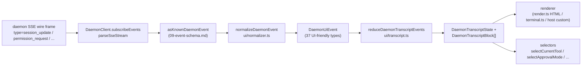

```markdown
# Shared UI Transcript Layer

> [!note]
> **現在のステータス**: `packages/cli/src/ui/daemon/daemon-tui-adapter.ts` は、レガシーな実験的 CLI サイドアダプターとして `main` ブランチに残っています。このドキュメントでは、新しい SDK サイドの共有 UI トランスクリプトレイヤーについて説明します。これは、Web、TUI、IDE、IM チャンネルを含むあらゆる UI ホストが利用できる、再利用可能なデーモンイベントの正規化とトランスクリプトプリミティブです。CLI TUI、チャンネル、VS Code IDE への移行は後続の作業です。

## 概要

`packages/sdk-typescript/src/daemon/ui/` は、SDK に `ui/*` サブパッケージを追加します。これにより、再利用可能なプリミティブを通じてデーモンの SSE イベントストリームを UI でレンダリング可能なトランスクリプトブロックに変換します。

- **正規化** (`normalizer.ts`): デーモンワイヤースキーマの 43 個の既知のイベントタイプ（[`09-event-schema.md`](./09-event-schema.md) 参照）を、`assistant.text.delta`、`tool.update`、`session.metadata.changed` などの 37 個の UI 向け `DaemonUiEventType` セマンティックイベントにマッピングします。
- **ステートマシン** (`transcript.ts`、`store.ts`): UI イベントを順序付けられた `DaemonTranscriptBlock[]` に投影する、純粋なリデューサーとサブスクライブ可能なストア。
- **レンダラー** (`render.ts`、`terminal.ts`、`toolPreview.ts`): トランスクリプトブロックを HTML、ターミナルテキスト、ツールプレビュー文字列に変換します。ホストはこれらを使用または置き換えることができます。
- **コンフォーマンス** (`conformance.ts`): チャンネル、TUI、IDE サーフェスがこれらのプリミティブに移行する際に使用する、クロスホスト一貫性テスト。

最初のプロダクションコンシューマーは **`packages/webui/src/daemon/`** ([#4328](https://github.com/QwenLM/qwen-code/pull/4328)) です。その React `DaemonSessionProvider` とトランスクリプトアダプターにより、Web UI はホストの `postMessage` トラフィックのみをレンダリングするのではなく、デーモンの HTTP+SSE に直接接続できるようになります。CLI TUI、チャンネルベース、VS Code IDE は後で同じレイヤーを再利用できます。[`../daemon-ui/MIGRATION.md`](../daemon-ui/MIGRATION.md) に v2 増分移行ガイドが記載されています。

## 責務

- 43 個のデーモンワイヤーイベントを安定した UI 語彙 (`DaemonUiEventType`) に正規化し、レンダラーが `rawEvent.data` を検査しないようにします。
- デーモン単調増加の SSE `eventId` を**プライマリ順序キー**として保持し、異なるクライアントが同じ順序でトランスクリプトをレンダリングできるようにします。
- 純粋なリデューサーを使用してトランスクリプトブロックを生成し、保留中のパーミッション、現在のツール、承認モード、ツール進捗、サブエージェント子ブロックのためのセレクターを提供します。
- ホスト固有のレンダリングを可能にしながら、ベースラインの HTML およびターミナルレンダラーを提供します。
- プランパネル用の `DAEMON_PLAN_TOOL_CALL_ID` などの公開定数を公開します。
- 追加的なワイヤー互換性を維持します。未知のイベントタイプはドロップされず、`debug` に正規化されます。

## アーキテクチャ

### パッケージ構造

| ファイル                                            | エクスポート                                                                                                                                                           | 目的                         |
| --------------------------------------------------- | ---------------------------------------------------------------------------------------------------------------------------------------------------------------------- | ---------------------------- |
| `packages/sdk-typescript/src/daemon/ui/index.ts`    | サブパッケージバレル                                                                                                                                                   | 公開エントリポイント         |
| `ui/types.ts`                                       | `DaemonUiEventType`、タイプ別 `DaemonUiEvent*` インターフェース、`DaemonTranscriptBlock`、`DaemonTranscriptState`、`DaemonUiToolProvenance`、`DAEMON_PLAN_TOOL_CALL_ID` | 型定義                       |
| `ui/normalizer.ts`                                  | `normalizeDaemonEvent(evt) -> DaemonUiEvent`、`getSessionUpdatePayload(evt)`                                                                                          | ワイヤーから UI へのマッピング |
| `ui/transcript.ts`                                  | `createDaemonTranscriptState()`、`appendLocalUserTranscriptMessage()`、`reduceDaemonTranscriptEvents()`、`rebuildDaemonTranscriptBlockIndex()`、セレクター           | ステートマシンとセレクター   |
| `ui/store.ts`                                       | `createDaemonTranscriptStore(initial?)`                                                                                                                               | サブスクライブ可能なリデューサーストア |
| `ui/toolPreview.ts`                                 | `createDaemonToolPreview(toolEvent)`                                                                                                                                  | ツール呼び出しサマリーテキスト |
| `ui/render.ts`                                      | `DaemonHtmlRenderOptions`、`DaemonRenderOptions`、レンダー関数                                                                                                        | HTML および汎用レンダリング   |
| `ui/terminal.ts`                                    | ターミナル固有のレンダリング                                                                                                                                           | TUI 準備                     |
| `ui/conformance.ts`                                 | クロスホストコンフォーマンススイート                                                                                                                                   | 移行パリティテスト           |
| `ui/utils.ts`                                       | `DaemonUiContentPart` などのヘルパー                                                                                                                                   | 内部共有ユーティリティ       |

### `DaemonUiEventType` 語彙

`ui/types.ts` は、ドメインごとにグループ化された 37 個の UI イベントタイプを定義します。

**チャットストリーム（ステージ 1）**

- `user.text.delta`、`user.image.delta`、`user.shell.command`、`assistant.text.delta`、`assistant.done`、`thought.text.delta`
- `tool.update`、`shell.output`、`user.shell.output`
- `permission.request`、`permission.resolved`
- `model.changed`、`status`、`error`、`debug`

**セッションメタデータ**

- `session.metadata.changed`、`session.approval_mode.changed`
- `session.available_commands`、`session.state_resync_required`、`session.replay_complete`

**プロンプトライフサイクル（クロスクライアント）**

- `prompt.cancelled`、`followup.suggestion`

**ワークスペース（ウェーブ 3-4）**

- `workspace.memory.changed`、`workspace.agent.changed`
- `workspace.tool.toggled`、`workspace.settings.changed`、`workspace.initialized`
- `workspace.mcp.budget_warning`、`workspace.mcp.child_refused`
- `workspace.mcp.server_restarted`、`workspace.mcp.server_restart_refused`

**認証フロー（ウェーブ 4 OAuth）**

- `auth.device_flow.started`、`auth.device_flow.throttled`、`auth.device_flow.authorized`
- `auth.device_flow.failed`、`auth.device_flow.cancelled`

`normalizeDaemonEvent` は、43 個のデーモンの既知のワイヤーイベントをこの語彙にマッピングします。未知、モデル化されていない、または不正な形式のイベントタイプは `debug` に正規化され、ホストの診断のために `rawEvent` を保持します。

### リデューサーとセレクター

```ts
// 初期状態を作成。
const state = createDaemonTranscriptState();

// SSE イベントシーケンスを適用。
const next = reduceDaemonTranscriptEvents(state, daemonUiEvents);

// セレクター。
selectTranscriptBlocks(state); // すべてのブロック
selectTranscriptBlocksOrderedByEventId(state); // eventId で順序付け；推奨キー
selectPendingPermissionBlocks(state);
selectCurrentTool(state);
selectApprovalMode(state);
selectToolProgress(state, toolCallId);
selectSubagentChildBlocks(state, parentBlockId);
isSubagentChildBlock(block);
formatBlockTimestamp(block);
formatMissedRange(state); // state_resync_required 後の "you missed X" テキスト
```

### ストア

`createDaemonTranscriptStore()` は subscribe と dispatch を提供します：

```ts
const store = createDaemonTranscriptStore();
store.subscribe(() => render(store.getState()));
store.dispatch(uiEvents); // 内部でリデューサーを実行
```

Web UI の `DaemonSessionProvider` は、このストア上に React コンテキストを構築します。

## フロー

### 単一 SSE イベントのエンドツーエンド



ホストは `(E)` で停止して独自のリデューサーを実装するか、`(G)` と提供されたセレクターを消費できます。Web UI は完全な `(B) -> (H)` パスを使用します。移行された TUI は `(G)` を消費し、Ink 固有のコンポーネントでレンダリングできます。

### `state_resync_required`

`session.state_resync_required` は、トランスクリプトの「欠落範囲」マーカーにマッピングされます。UI コードは `formatMissedRange(state)` を呼び出して「missed events X-Y」などのテキストをレンダリングできます。リデューサーは**後続のイベントを引き続き適用**しますが、影響を受けるブロックに `resyncRecovery: true` をマークして、レンダラーが視覚的なコンテキストを追加できるようにします。リングエビクションと `state_resync_required` のセマンティクスについては、[`10-event-bus.md`](./10-event-bus.md) を参照してください。

## コンシューマー

### `packages/webui/src/daemon/`

これは [#4328](https://github.com/QwenLM/qwen-code/pull/4328) で導入されました。

| ファイル                       | エクスポート                                                                                                                                                                                                                                                                                                                        |
| ------------------------------ | ----------------------------------------------------------------------------------------------------------------------------------------------------------------------------------------------------------------------------------------------------------------------------------------------------------------------------------- |
| `DaemonSessionProvider.tsx`    | React `<DaemonSessionProvider />`; `useDaemonSession()`、`useDaemonTranscriptStore()`、`useDaemonTranscriptState()`、`useDaemonTranscriptBlocks()`、`useDaemonPendingPermissions()`、`useDaemonActions()`、`useDaemonConnection()` フック; `DaemonConnectionStatus`、`DaemonConnectionState`、`DaemonSessionContextValue` 型 |
| `transcriptAdapter.ts`         | SDK の `DaemonTranscriptBlock` を Web UI の `UnifiedMessage` に適応します。マークダウンストリーミングチャンクのマージやツール呼び出しサマリーを含みます。                                                                                                                                                                                   |
| `index.ts`                     | サブパッケージバレル                                                                                                                                                                                                                                                                                                              |

これで Web UI はデーモンの HTTP+SSE に直接接続してトランスクリプトをレンダリングできるようになりました。古い `ACPAdapter` ホスト `postMessage` パスも引き続き利用可能です。

### 将来の移行

[`../daemon-ui/MIGRATION.md`](../daemon-ui/MIGRATION.md) は、Web チャットおよび Web ターミナルアダプター向けの v2 増分ガイドを提供します。この PR では **CLI TUI、チャンネルベース、VS Code IDE は移行されない**ことを明示的に示しており、それぞれ後続の PR で移行し、コンフォーマンススイートを使用してレンダリングのパリティを維持します。

## レガシー `daemon-tui-adapter.ts` との関係

| 次元              | レガシー CLI `DaemonTuiAdapter`                                   | 新しい共有トランスクリプトレイヤー                                    |
| ----------------- | ----------------------------------------------------------------- | --------------------------------------------------------------------- |
| パッケージ        | `packages/cli/src/ui/daemon/`                                     | `packages/sdk-typescript/src/daemon/ui/`                              |
| 公開 API サーフェス| `DaemonTuiAdapter`、`DaemonTuiUpdate`、`DaemonTuiSessionClient`     | `DaemonUiEventType`、`reduceDaemonTranscriptEvents`、セレクター        |
| スコープ          | CLI Ink TUI のみ                                                   | Web、TUI、IDE、または IM UI                                           |
| 状態の形状        | TUI ローカル更新の共用体                                           | 純粋なトランスクリプトブロックリスト + 状態フィールド                 |
| 順序付け          | `createdAt`                                                        | `eventId`（デーモン単調増加、全クライアントで一貫）                   |
| 未知のワイヤータイプ| `reduceDaemonEventToTuiUpdates` でドロップ                         | `debug` に正規化され保持される                                        |
| テスト            | 単一パッケージのユニットテスト                                     | クロスホストパリティのためのグローバルコンフォーマンススイート         |

## 依存関係

- 上流のワイヤータイプ: `packages/sdk-typescript/src/daemon/events.ts`（[`09-event-schema.md`](./09-event-schema.md) 参照）。
- 実際のダウンストリームコンシューマー: `packages/webui/src/daemon/`。
- 将来の移行ターゲット: `packages/cli/src/ui/`、`packages/channels/base/`、`packages/vscode-ide-companion/src/services/daemonIdeConnection.ts`。
- 並行リファレンス: [`../daemon-ui/README.md`](../daemon-ui/README.md)、[`../daemon-ui/MIGRATION.md`](../daemon-ui/MIGRATION.md)、[`../daemon-client-adapters/web-ui.md`](../daemon-client-adapters/web-ui.md)。

## 設定

- ランタイム設定は不要。リデューサーとセレクターは純粋関数です。
- ホストはレンダラー（HTML（`render.ts`）、ターミナル（`terminal.ts`）、またはカスタムレンダリング）を選択します。
- デバッグ用に、`render.ts` は `includeRawEvent: true` をサポートしており、レンダリング出力に生のワイヤーフレームを含めます。

## 注意点と既知の制限

- **`daemon-tui-adapter.ts` はまだ存在します**。これは CLI パッケージのレガシーな実験的アダプターです。新しいコードは SDK の `ui/*`（`normalizeDaemonEvent`、`reduceDaemonTranscriptEvents`、`DaemonTranscriptBlock`）を優先すべきです。
- **CLI TUI、チャンネルベース、VS Code IDE はまだ移行されていません**。これらは独自のレンダリングロジックを維持しています。`docs/developers/daemon-client-adapters/` ディレクトリには、`ide.md`、`channel-web.md`、および歴史的な `tui.md` ドラフトがまだ残っています。新しい `web-ui.md` は Web UI アダプターの設計をカバーしています。
- **`eventId` がプライマリ順序キーです**。`createdAt` は非推奨のエイリアス（`clientReceivedAt`）として残っています。新しいコードは `selectTranscriptBlocksOrderedByEventId(state)` を使用してください。`MIGRATION.md` に、`createdAt` 順序から `eventId` 順序への切り替えのコード差分が示されています。
- **未知のワイヤータイプは `debug` に正規化されます**。古いアダプターのようにドロップされなくなりました。レンダラーはデフォルトで `debug` を表示しません。表示するにはホストがオプトインする必要があります。
- **バンドルサイズ**: `ui/*` サブパッケージは `@qwen-code/sdk/daemon` を通じて ESM サブパスとしてエクスポートされ、React や DOM の依存関係を引き込みません。React 統合は、Web UI コンシューマーが `DaemonSessionProvider` を使用する場合にのみロードされます。

## 参考資料

- `packages/sdk-typescript/src/daemon/ui/types.ts`（`DaemonUiEventType` 語彙）
- `packages/sdk-typescript/src/daemon/ui/transcript.ts`（リデューサーとセレクター）
- `packages/sdk-typescript/src/daemon/ui/normalizer.ts`（ワイヤーから UI へのマッピング）
- `packages/sdk-typescript/src/daemon/ui/store.ts`、`render.ts`、`terminal.ts`、`toolPreview.ts`、`conformance.ts`
- `packages/sdk-typescript/src/daemon/index.ts`（`ui/*` 再エクスポートブロック）
- `packages/webui/src/daemon/DaemonSessionProvider.tsx`、`transcriptAdapter.ts`
- 上流ドキュメント: [`../daemon-ui/README.md`](../daemon-ui/README.md)、[`../daemon-ui/MIGRATION.md`](../daemon-ui/MIGRATION.md)、[`../daemon-client-adapters/web-ui.md`](../daemon-client-adapters/web-ui.md)
- 関連 PR: [#4328](https://github.com/QwenLM/qwen-code/pull/4328)（v1 トランスクリプトレイヤーと Web UI プロバイダー）、[#4353](https://github.com/QwenLM/qwen-code/pull/4353)（v2 統合完全性フォローアップ）
```