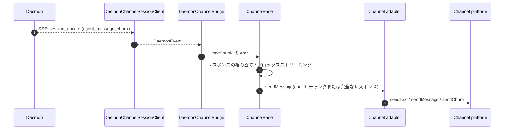
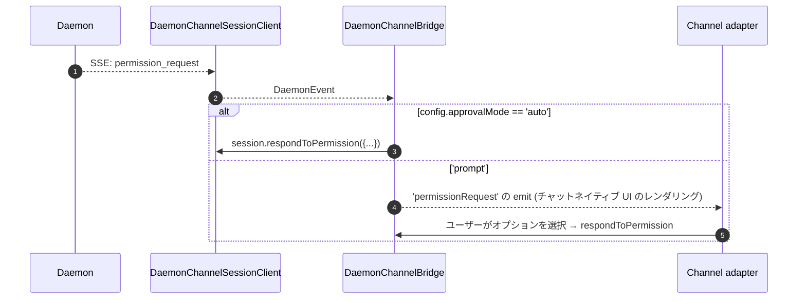

# チャネルアダプター

## 概要

`packages/channels/` には、チャットプラットフォームからの受信メッセージをエージェントのプロンプトに変換し、エージェントの応答をチャットプラットフォームに送信する **IM チャネルアダプター** が含まれています。現在、DingTalk、WeChat (Weixin)、Telegram、Feishu の 4 つの具体的なチャネルが提供されています。これらはベースレイヤー (`packages/channels/base/`) とアダプター向けの `ChannelAgentBridge` 契約を共有しています。

現在のホストモードは 2 つあります。

- `qwen channel start [name]` は、スタンドアロンの ACP バックチャネルサービスです。アダプターに `ChannelAgentBridge` の `AcpBridge` 実装を渡します。
- `qwen serve --channel <name>` および `qwen serve --channel all` は、実験的なデーモン管理モードです。`qwen serve` はプロセス外のチャネルワーカーを 1 つ起動し、ワーカーは SDK を介してデーモンに接続し、アダプターは `DaemonChannelBridge` に基づく `ChannelAgentBridge` ファサードを受け取ります。

デーモン管理モードでは、各チャネルは受信チャットトラフィックを、設定可能な `SessionScope` (`user`、`thread`、または `single`) の下のデーモンセッションにマッピングします。アダプターは `DaemonChannelBridge` に委任し、それは SDK の `DaemonSessionClient` に委任します ([`13-sdk-daemon-client.md`](./13-sdk-daemon-client.md) を参照)。1 つのデーモンは 1 つのワークスペースにバインドされるため、選択された各チャネルの `cwd` はデーモンワークスペースに解決される必要があります。

## 責務

- チャネルのネイティブトランスポート (DingTalk WebSocket ストリーム、WeChat HTTP ロングポール、Telegram Bot ロングポール、Feishu WebSocket または HTTP webhook) から受信メッセージを受け取ります。
- `DaemonChannelSessionFactory` を介して `(senderId, groupId?)` をデーモンセッションに解決します。
- ユーザーメッセージをデーモンプロンプトとして転送し、応答をアウトバウンドチャットメッセージとしてストリーミングバックします (場合によってはチャンク分けされます)。
- インタラクティブな場合は許可リクエストをチャットネイティブなプロンプトとしてレンダリングし、それ以外の場合は `ChannelConfig.approvalMode` に従って自動承認します。
- 送信者ゲーティング (許可リスト / 拒否リスト)、グループゲーティング、およびコンテンツの正規化 (チャネルごとの markdown / HTML) を適用します。

## アーキテクチャ

### `DaemonChannelBridge` (共有ベース、`packages/channels/base/src/DaemonChannelBridge.ts`)

```ts
class DaemonChannelBridge extends EventEmitter {
  constructor(opts: {
    cwd: string;
    sessionFactory: DaemonChannelSessionFactory;
    modelServiceId?: string;
    sessionScope?: SessionScope;
  });
  newSession(cwd: string): Promise<string>;
  loadSession(sessionId: string, cwd: string): Promise<string>;
  prompt(sessionId: string, text: string, options?): Promise<string>;
  cancelSession(sessionId: string): Promise<void>;
  stop(): void;
}
```

デーモンの `sessionId` をキーとしてデーモンセッションクライアントを保持します。`ChannelBase` と `SessionRouter` は、どの受信チャットターゲットをそのセッションにマッピングするかを決定します。各アタッチされたセッションは以下を持ちます。

- `DaemonChannelSessionClient` (チャネルに関連しないメソッドを除いた `DaemonSessionClient` の形状)。
- ライブ SSE コンシューマーポンプ。
- デバウンスされたプロンプトアセンブラー (複数の受信メッセージにまたがってユーザー入力をフラグメント化するアダプター用)。
- リクエストごとの自動承認ポリシー。

発行されるイベント: `textChunk`、`toolCall`、`sessionUpdate`、`permissionRequest`、`permissionResolved`、`modelSwitched`、`modelSwitchFailed`、`sessionDied`、`promptComplete`、および `error`。チャネルアダプターはこれらをプラットフォームネイティブな API に接続します。

### `ChannelBase` (`packages/channels/base/src/ChannelBase.ts`)

すべてのアダプターが継承する抽象ベースクラス:

```ts
abstract class ChannelBase {
  abstract connect(): Promise<void>;
  abstract sendMessage(chatId: string, text: string): Promise<void>;
  abstract disconnect(): void;
  handleInbound(envelope: Envelope): Promise<void>; // → SessionRouter.resolve + bridge.prompt
}
```

共通の横断的関心事を処理します: 送信者ゲーティング (許可リスト / 拒否リスト)、グループゲーティング、メッセージブロックストリーミング (チャンクサイズ、スロットリング)、受信デバウンス。

### チャネル別アダプター

| アダプター | ファイル | トランスポート | 備考 |
| --------------- | --------------------------------------------------- | ------------------------------------------------------ | ------------------------------------------------------------------------------------------------------------ |
| DingTalk        | `packages/channels/dingtalk/src/DingtalkAdapter.ts` | DingTalk Stream SDK WebSocket                          | `sessionWebhook` POST 経由で送信。メディア画像は DT API 経由でダウンロードされ、エンベロープ内で base64 化されます。 |
| WeChat (Weixin) | `packages/channels/weixin/src/WeixinAdapter.ts`     | iLink Bot HTTP ロングポール                            | 独自の `sendText` / `sendImage` API 経由で送信。タイピングインジケーター対応。 |
| Telegram        | `packages/channels/telegram/src/TelegramAdapter.ts` | Telegram Bot API ロングポール (grammy)                 | `sendMessage` 経由で HTML チャンクを送信。 |
| Feishu          | `packages/channels/feishu/src/FeishuAdapter.ts`     | Feishu/Lark Stream WebSocket (デフォルト) または HTTP webhook | Lark SDK 経由でインタラクティブカードとして送信。webhook モードでは HMAC 署名検証に `encryptKey` が必要です。 |

各アダプターは以下を実装します。

1. 受信トランスポート (メッセージのサブスクライブ / ポーリング)。
2. エンベロープの構築 (`{ senderId, groupId?, text, media?, raw }`)。
3. 送信者 / グループゲーティング (`ChannelBase` に委任)。
4. アウトバウンドのシリアライゼーション (markdown → HTML / WeChat ネイティブ / DingTalk ネイティブ)。
5. ライフサイクル (開始 / シャットダウン)。

### アダプターマトリクス

| アダプター | トランスポート | 識別子 | 権限 UX | 自動承認設定 |
| ------------ | ------------------------------- | -------------------------------------------------------- | ----------------------------------- | ------------------------------------------------- |
| **DingTalk** | WebSocket ストリーム | `senderStaffId` (グループの場合はオプションで `conversationId`) | DT markdown 経由のインラインボタン | `ChannelConfig.approvalMode = 'auto' \| 'prompt'` |
| **WeChat**   | HTTP ロングポール | `senderWxid` (グループの場合はオプションで `groupWxid`) | 応答トークンを使用したテキストのみのプロンプト | 同上 |
| **Telegram** | Bot API ロングポール | `from.id` (グループの場合はオプションで `chat.id`) | インラインキーボードボタン | 同上 |
| **Feishu**   | WebSocket ストリーム / HTTP webhook | `sender.open_id` (グループの場合はオプションで `chat_id`) | インタラクティブカードボタン | 同上 |

> **注:** 「Permission UX」列は各プラットフォームのネイティブなアフォーダンスについて説明していますが、まだ何も接続されていません。`AcpBridge.requestPermission` は現在すべてのリクエストを自動承認しており (`packages/channels/base/src/AcpBridge.ts`)、`ChannelConfig.approvalMode` は宣言されていますがまだ読み取られていません。インタラクティブな承認は計画されています (フェーズ 5)。

## ワークフロー

### 受信プロンプト


### SSE ドリブンなアウトバウンド



### 権限の自動承認



## 状態とライフサイクル

- `DaemonChannelBridge` はチャネルアダプターの存続期間中存続し、その内部のセッションは設定された `SessionScope` に従って存続します。
- 各アクティブセッションは、SSE がドロップした場合に自動的に再接続します。`DaemonSessionClient.events()` は `lastSeenEventId` を追跡するため、リプレイが正しく行われます。
- `shutdown()` はすべてのアクティブなセッションと基盤となるトランスポート (チャネルの WebSocket / ロングポール) を閉じます。
- DingTalk の WebSocket ストリームはサーバープッシュをサポートしています。WeChat のロングポールはアイドル応答時のバックオフ戦略を必要とします。Telegram のロングポールには組み込みの `timeout` パラメータがあります。

## 依存関係

- `packages/channels/base/` — `ChannelBase`、`DaemonChannelBridge`、`types.ts` (`ChannelConfig`、`Envelope`、`SessionScope`、`ChannelPlugin`)。
- `packages/sdk-typescript/src/daemon/` — `DaemonSessionClient` など。
- チャネル別 SDK: `@dingtalk/stream` (DingTalk)、独自の iLink Bot HTTP (Weixin)、`grammy` (Telegram)。

## 設定

`ChannelConfig` (`packages/channels/base/src/types.ts` より):

| 設定項目 | 効果 |
| ---------------------------------------- | --------------------------------------------------------------------------------------------------------- |
| `sessionScope` | `'user'` (送信者 + チャット)、`'thread'` (スレッド ID またはチャット)、または `'single'` (チャネルごとに 1 つの共有セッション)。 |
| `approvalMode` | `'auto'` (自動応答) / `'prompt'` (UI のレンダリング)。 |
| `allowlist?: string[]` | 許可される送信者 ID。未指定 = オープン。 |
| `denylist?: string[]` | 拒否される送信者 ID。 |
| `chunkSize`, `chunkIntervalMs` | アウトバウンドブロックストリーミングの設定。 |
| `daemon: { baseUrl, token?, clientId? }` | `DaemonChannelSessionFactory` に転送されます。 |

チャネル固有のキーがその上に追加されます (DingTalk: `streamCredentials`、WeChat: `ilinkUrl`、`botId`、Telegram: `botToken`、Feishu: `clientId` (appId)、`clientSecret` (appSecret)、`verificationToken`、`encryptKey` (webhook モード))。

## 注意事項と既知の制限

- **チャネルは `@qwen-code/sdk` を直接インポートしません。** `ChannelBase` → `DaemonChannelBridge` → `DaemonChannelSessionClient` (ブリッジが SDK から構築) を経由します。この間接化により、ブリッジはチャネルの変更を必要とせずに、テストスタブなどの実装をスワップできます。
- **権限 UX はチャネルごとに異なります。** DingTalk は markdown ボタンを使用し、WeChat はテキストのみ、Telegram はインラインキーボード、Feishu はインタラクティブカードボタンを使用します。(現在はすべて `AcpBridge` 経由で自動承認されます。インタラクティブな承認は計画されています。) 共通の「インタラクティブ権限ウィジェット」抽象化はまだありません。
- **自動承認はデーモン側ではなくデプロイ側の決定です。** デーモンの `permission_mediation` ポリシーは引き続き適用されます。自動承認は、チャネルが人間にプロンプトを出さずに応答することを意味するだけです。`auto` を `enforce` グレードのワークフローと組み合わせないでください。
- **チャネルごとのレート制限 / メッセージサイズ制限はアダプターの役割です。** `DaemonChannelBridge` はチャンク処理のみを扱い、WeChat のメッセージごとのサイズ制限や Telegram のフラッド制限を超える処理はアダプターに任されています。
- **DingTalk / WeChat / Telegram / Feishu のリバースコールはありません。** チャネルは一方通行 (チャット → デーモン → チャット) です。DingTalk カードコールバックなどの IM プラットフォームのネイティブプッシュパスは、まだブリッジに接続されていません。

## 参照

- `packages/channels/base/src/DaemonChannelBridge.ts`
- `packages/channels/base/src/ChannelBase.ts`
- `packages/channels/base/src/types.ts`
- `packages/channels/dingtalk/src/DingtalkAdapter.ts`
- `packages/channels/weixin/src/WeixinAdapter.ts`
- `packages/channels/telegram/src/TelegramAdapter.ts`
- `packages/channels/plugin-example/` (リファレンスプラグインのスケルトン)
- チャネルプラグインガイド: [`../channel-plugins.md`](../channel-plugins.md)。
- SDK リファレンス: [`13-sdk-daemon-client.md`](./13-sdk-daemon-client.md)。