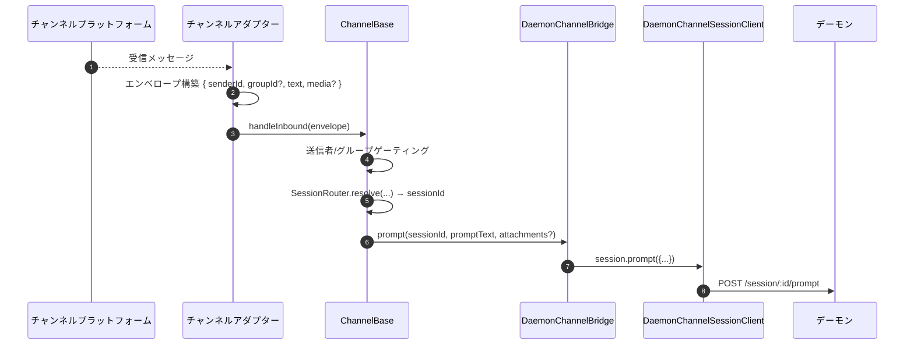
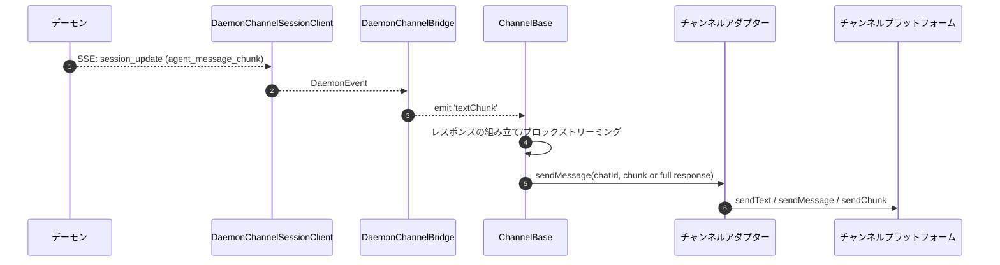
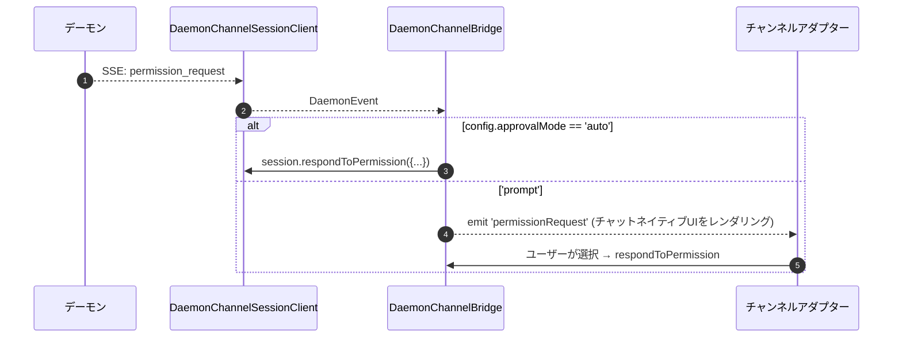

# チャンネルアダプター

## 概要

`packages/channels/` には、チャットプラットフォームの受信メッセージをデーモンプロンプトに変換し、デーモンの送信イベントをチャットプラットフォームのメッセージに変換する **IMチャンネルアダプター** が含まれています。現在、DingTalk、WeChat (Weixin)、Telegram、Feishu の4つの具体的なチャンネルが同梱されています。これらは共通のベースレイヤー (`packages/channels/base/`) と、セッション多重化と SSE 消費を処理する `DaemonChannelBridge` を共有しています。

各チャンネルは、設定可能な `SessionScope` (`user`、`thread`、または `single`) に基づいて、着信チャットトラフィックをデーモンセッションにマッピングします。アダプターは `DaemonChannelBridge` に委譲し、`DaemonChannelBridge` は SDK の `DaemonSessionClient` に委譲します ([`13-sdk-daemon-client.md`](./13-sdk-daemon-client.md) を参照)。

## 責務

- チャンネルのネイティブトランスポート (DingTalk WebSocket ストリーム、WeChat HTTP long-poll、Telegram Bot long-poll、Feishu WebSocket または HTTP webhook) から受信メッセージを受信する。
- `(senderId, groupId?)` を解決し、`DaemonChannelSessionFactory` を介してデーモンセッションにマッピングする。
- ユーザーメッセージをデーモンプロンプトとして転送し、応答をチャンク分割される可能性がある送信チャットメッセージとしてストリーミングする。
- インタラクティブモードの場合は、パーミッションリクエストをチャンネルネイティブのプロンプトとしてレンダリングする。それ以外の場合は `ChannelConfig.approvalMode` に従って自動承認する。
- 送信者ゲーティング (許可リスト / 拒否リスト)、グループゲーティング、およびコンテンツ正規化 (チャンネルごとのマークダウン / HTML) を適用する。

## アーキテクチャ

### `DaemonChannelBridge` (共有ベース、`packages/channels/base/src/DaemonChannelBridge.ts`)

```ts
class DaemonChannelBridge extends EventEmitter {
  constructor(opts: {
    cwd: string;
    sessionFactory: DaemonChannelSessionFactory;
    modelServiceId?: string;
    sessionScope?: SessionScope;
  });
  newSession(cwd: string): Promise<string>;
  loadSession(sessionId: string, cwd: string): Promise<string>;
  prompt(sessionId: string, text: string, options?): Promise<string>;
  cancelSession(sessionId: string): Promise<void>;
  stop(): void;
}
```

デーモンの `sessionId` をキーとしてデーモンセッションクライアントを保持します。`ChannelBase` と `SessionRouter` が、どの着信チャットターゲットがそのセッションにマッピングされるかを決定します。接続された各セッションは以下を持ちます:

- `DaemonChannelSessionClient` (`DaemonSessionClient` からチャンネルに関係のないメソッドを除いたもの)。
- アクティブな SSE コンシューマーポンプ。
- デバウンスされたプロンプトアセンブラ (複数の受信メッセージにわたってユーザー入力を分割するアダプター用)。
- リクエストごとの自動承認ポリシー。

発行されるイベント: `textChunk`、`toolCall`、`sessionUpdate`、`permissionRequest`、`permissionResolved`、`modelSwitched`、`modelSwitchFailed`、`sessionDied`、`promptComplete`、`error`。チャンネルアダプターはこれらをプラットフォームネイティブの API に配線します。

### `ChannelBase` (`packages/channels/base/src/ChannelBase.ts`)

すべてのアダプターが拡張する抽象ベース:

```ts
abstract class ChannelBase {
  abstract connect(): Promise<void>;
  abstract sendMessage(chatId: string, text: string): Promise<void>;
  abstract disconnect(): void;
  handleInbound(envelope: Envelope): Promise<void>; // → SessionRouter.resolve + bridge.prompt
}
```

共通の横断的関心事 (送信者ゲーティング (許可リスト/拒否リスト)、グループゲーティング、メッセージブロックストリーミング (チャンクサイズ、スロットリング)、受信デバウンス) を処理します。

### チャンネルごとのアダプター

| アダプター      | ファイル                                                  | トランスポート                                             | 備考                                                                                                      |
| --------------- | --------------------------------------------------------- | --------------------------------------------------------- | --------------------------------------------------------------------------------------------------------- |
| DingTalk        | `packages/channels/dingtalk/src/DingtalkAdapter.ts`       | DingTalk Stream SDK WebSocket                            | `sessionWebhook` POST で送信; メディア画像は DT API でダウンロード、base64 でエンベロープに含める          |
| WeChat (Weixin) | `packages/channels/weixin/src/WeixinAdapter.ts`           | iLink Bot HTTP long-poll                                 | 独自の `sendText` / `sendImage` API で送信; 入力中インジケーターを表示                                    |
| Telegram        | `packages/channels/telegram/src/TelegramAdapter.ts`       | Telegram Bot API long-poll (grammy)                      | `sendMessage` で HTML チャンクを送信                                                                        |
| Feishu          | `packages/channels/feishu/src/FeishuAdapter.ts`           | Feishu/Lark Stream WebSocket (デフォルト) または HTTP webhook | Lark SDK でインタラクティブカードとして送信; webhook モードでは HMAC 署名検証に `encryptKey` が必要          |

各アダプターは以下を実装します:

1. 受信トランスポート (メッセージの購読/ポーリング)
2. エンベロープ構築 (`{ senderId, groupId?, text, media?, raw }`)
3. 送信者/グループゲーティング (`ChannelBase` に委譲)
4. 送信シリアライゼーション (マークダウン → HTML / WeChatネイティブ / DingTalkネイティブ)
5. ライフサイクル (開始/シャットダウン)

### アダプター一覧

| アダプター    | トランスポート                     | 識別子                                                   | パーミッションUX                         | 自動承認設定                                     |
| ------------- | --------------------------------- | -------------------------------------------------------- | --------------------------------------- | ----------------------------------------------- |
| **DingTalk**  | WebSocket ストリーム               | `senderStaffId` (+ オプションでグループ用 `conversationId`) | DT マークダウンによるインラインボタン      | `ChannelConfig.approvalMode = 'auto' \| 'prompt'` |
| **WeChat**    | HTTP long-poll                   | `senderWxid` (+ オプションでグループ用 `groupWxid`)       | 応答トークン付きテキストのみのプロンプト  | 同上                                            |
| **Telegram**  | Bot API long-poll                | `from.id` (+ オプションでグループ用 `chat.id`)            | インラインキーボードボタン               | 同上                                            |
| **Feishu**    | WebSocket ストリーム / HTTP webhook | `sender.open_id` (+ オプションでグループ用 `chat_id`)     | インタラクティブカードボタン             | 同上                                            |

> **Note:** 「パーミッションUX」列は各プラットフォームのネイティブ機能を説明していますが、現時点ではいずれも配線されていません — `AcpBridge.requestPermission` は現在すべてのリクエストを自動承認しており (`packages/channels/base/src/AcpBridge.ts`)、`ChannelConfig.approvalMode` は宣言されていますが、まだ読み取られていません。インタラクティブな承認は計画中です (フェーズ5)。

## ワークフロー

### 受信プロンプト



### SSE駆動の送信



### パーミッション自動承認



## 状態とライフサイクル

- `DaemonChannelBridge` はチャンネルアダプターの存続期間中生存し、内部のセッションは設定された `SessionScope` に従って生存します。
- アクティブな各セッションは、SSE が切断された場合に自動的に再接続します — `DaemonSessionClient.events()` は `lastSeenEventId` を追跡するため、リプレイは正しく行われます。
- `shutdown()` はすべてのアクティブなセッションと基盤となるトランスポート (チャンネルの WebSocket / long-poll) を閉じます。
- DingTalk の WebSocket ストリームはサーバープッシュをサポートしています。WeChat の long-poll はアイドル応答時のバックオフ戦略が必要です。Telegram の long-poll には組み込みの `timeout` パラメーターがあります。

## 依存関係

- `packages/channels/base/` — `ChannelBase`、`DaemonChannelBridge`、`types.ts` (`ChannelConfig`、`Envelope`、`SessionScope`、`ChannelPlugin`)。
- `packages/sdk-typescript/src/daemon/` — `DaemonSessionClient` とその関連クラス。
- チャンネルごとの SDK: `@dingtalk/stream` (DingTalk)、独自の iLink Bot HTTP (Weixin)、`grammy` (Telegram)。

## 設定

`ChannelConfig` (`packages/channels/base/src/types.ts` より):

| 設定項目                                   | 効果                                                                                                      |
| ------------------------------------------ | --------------------------------------------------------------------------------------------------------- |
| `sessionScope`                             | `'user'` (送信者 + チャット)、`'thread'` (スレッドIDまたはチャット)、または `'single'` (チャンネルごとに1つの共有セッション) |
| `approvalMode`                             | `'auto'` (自動応答) / `'prompt'` (UI を表示)                                                              |
| `allowlist?: string[]`                     | 許可された送信者ID。未設定の場合は全許可                                                                  |
| `denylist?: string[]`                      | 拒否する送信者ID                                                                                          |
| `chunkSize`、`chunkIntervalMs`             | 送信ブロックストリーミング設定                                                                            |
| `daemon: { baseUrl, token?, clientId? }`   | `DaemonChannelSessionFactory` に転送される                                                                |

チャンネル固有のキーが上に積み重なります (DingTalk: `streamCredentials`; WeChat: `ilinkUrl`、`botId`; Telegram: `botToken`; Feishu: `clientId` (appId)、`clientSecret` (appSecret)、`verificationToken`、`encryptKey` (webhook モード))。

## 注意点と既知の制限

- **チャンネルは `@qwen-code/sdk` を直接インポートしません。** `ChannelBase` → `DaemonChannelBridge` → `DaemonChannelSessionClient` (ブリッジがSDKから構築) を経由します。この間接層により、ブリッジはチャンネルを変更せずにテストスタブなどの実装を交換できます。
- **パーミッションUXはチャンネルごとに異なります。** DingTalk はマークダウンボタン、WeChat はテキストのみ、Telegram はインラインキーボード、Feishu はインタラクティブカードボタンを使用します。(現在はすべて `AcpBridge` で自動承認されます。インタラクティブ承認は計画中) 共通の「インタラクティブパーミッションウィジェット」抽象化はまだありません。
- **自動承認はデプロイ側の決定であり、デーモン側の決定ではありません。** デーモンの `permission_mediation` ポリシーは引き続き適用されます。自動承認は、チャンネルが人間へのプロンプトなしで応答することを意味するだけです。`auto` を `enforce` グレードのワークフローと組み合わせないでください。
- **チャンネルごとのレート制限/メッセージサイズ制限はアダプターの責務です。** `DaemonChannelBridge` はチャンク分割のみを処理します。WeChat のメッセージあたりのサイズ制限や Telegram のフラッド制限を超えないようにするのはアダプターの仕事です。
- **DingTalk / WeChat / Telegram / Feishu の逆方向呼び出しはありません** — チャンネルは一方向 (チャット → デーモン → チャット) です。DingTalk カードコールバックなどの IM プラットフォームのネイティブプッシュパスは、まだブリッジに配線されていません。

## 参考資料

- `packages/channels/base/src/DaemonChannelBridge.ts`
- `packages/channels/base/src/ChannelBase.ts`
- `packages/channels/base/src/types.ts`
- `packages/channels/dingtalk/src/DingtalkAdapter.ts`
- `packages/channels/weixin/src/WeixinAdapter.ts`
- `packages/channels/telegram/src/TelegramAdapter.ts`
- `packages/channels/plugin-example/` (リファレンスプラグインスキャフォールド)
- チャンネルプラグインガイド: [`../channel-plugins.md`](../channel-plugins.md)
- SDK リファレンス: [`13-sdk-daemon-client.md`](./13-sdk-daemon-client.md)