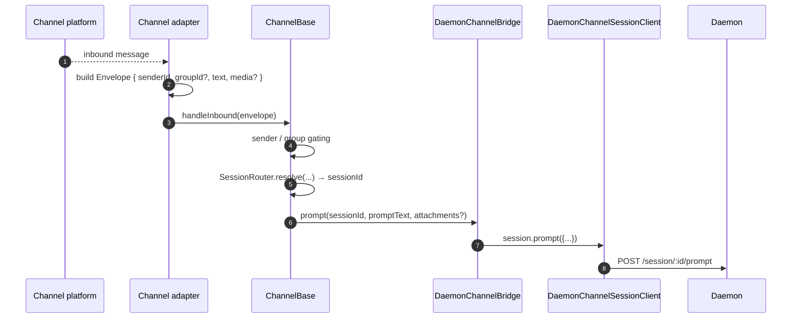
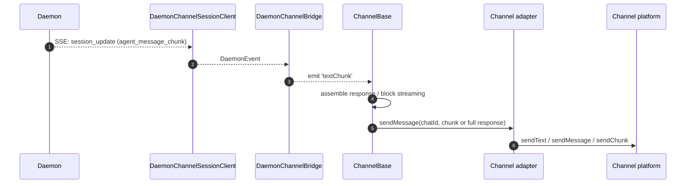
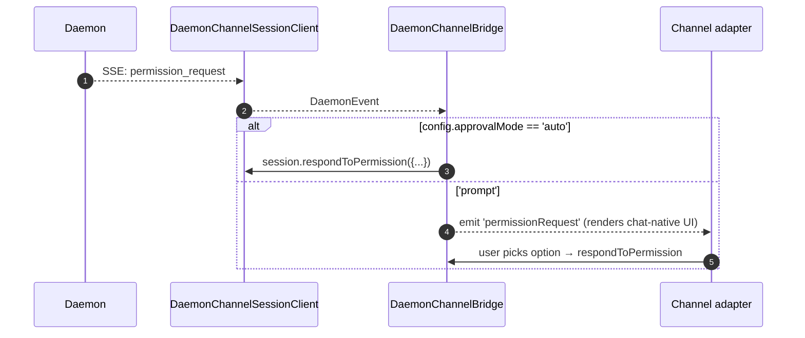

# チャネルアダプター

## 概要

`packages/channels/` には **IM チャネルアダプター** が含まれており、チャットプラットフォームの受信メッセージをデーモンプロンプトに変換し、デーモンの送信イベントをチャットプラットフォームのメッセージに変換します。現在、DingTalk、WeChat（Weixin）、Telegram、Feishu の 4 つのチャネルが同梱されています。これらは共通の基盤レイヤー（`packages/channels/base/`）と、セッション多重化および SSE 消費を処理する `DaemonChannelBridge` を共有しています。

各チャネルは、設定可能な `SessionScope`（`user`、`thread`、または `single`）の下で、受信チャットトラフィックをデーモンセッションにマッピングします。アダプターは `DaemonChannelBridge` に委譲し、`DaemonChannelBridge` は SDK の `DaemonSessionClient` に委譲します（[`13-sdk-daemon-client.md`](./13-sdk-daemon-client.md) を参照）。

## 責務

- チャネルのネイティブトランスポート（DingTalk WebSocket ストリーム、WeChat HTTP ロングポール、Telegram Bot ロングポール、Feishu WebSocket または HTTP webhook）から受信メッセージを受け取る。
- `(senderId, groupId?)` を `DaemonChannelSessionFactory` 経由でデーモンセッションに解決する。
- ユーザーメッセージをデーモンプロンプトとして転送し、レスポンスを送信チャットメッセージとしてストリーミングする（必要に応じてチャンク分割）。
- インタラクティブな場合はパーミッションリクエストをチャットネイティブのプロンプトとして表示し、そうでない場合は `ChannelConfig.approvalMode` に従って自動承認する。
- 送信者フィルタリング（allowlist / denylist）、グループフィルタリング、コンテンツの正規化（チャネルごとの markdown / HTML）を適用する。

## アーキテクチャ

### `DaemonChannelBridge`（共有基盤、`packages/channels/base/src/DaemonChannelBridge.ts`）

```ts
class DaemonChannelBridge extends EventEmitter {
  constructor(opts: {
    cwd: string;
    sessionFactory: DaemonChannelSessionFactory;
    modelServiceId?: string;
    sessionScope?: SessionScope;
  });
  newSession(cwd: string): Promise<string>;
  loadSession(sessionId: string, cwd: string): Promise<string>;
  prompt(sessionId: string, text: string, options?): Promise<string>;
  cancelSession(sessionId: string): Promise<void>;
  stop(): void;
}
```

デーモンの `sessionId` をキーとしてデーモンセッションクライアントを保持します。`ChannelBase` と `SessionRouter` が、どの受信チャットターゲットがそのセッションにマッピングされるかを決定します。各アタッチされたセッションには以下があります。

- `DaemonChannelSessionClient`（チャネルに無関係なメソッドを除いた `DaemonSessionClient` の形状）。
- ライブ SSE コンシューマーポンプ。
- デバウンスされたプロンプトアセンブラー（複数の受信メッセージにわたってユーザー入力をフラグメント化するアダプター向け）。
- リクエストごとの自動承認ポリシー。

発行されるイベント: `textChunk`、`toolCall`、`sessionUpdate`、`permissionRequest`、`permissionResolved`、`modelSwitched`、`modelSwitchFailed`、`sessionDied`、`promptComplete`、`error`。チャネルアダプターはこれらをプラットフォームネイティブの API に接続します。

### `ChannelBase`（`packages/channels/base/src/ChannelBase.ts`）

すべてのアダプターが継承する抽象基底クラス:

```ts
abstract class ChannelBase {
  abstract connect(): Promise<void>;
  abstract sendMessage(chatId: string, text: string): Promise<void>;
  abstract disconnect(): void;
  handleInbound(envelope: Envelope): Promise<void>; // → SessionRouter.resolve + bridge.prompt
}
```

共通の横断的関心事を処理します: 送信者フィルタリング（allowlist / denylist）、グループフィルタリング、メッセージブロックストリーミング（チャンクサイズ、スロットリング）、受信デバウンス。

### チャネルごとのアダプター

| アダプター      | ファイル                                                | トランスポート                                              | 備考                                                                                                        |
| --------------- | --------------------------------------------------- | ------------------------------------------------------ | ------------------------------------------------------------------------------------------------------------ |
| DingTalk        | `packages/channels/dingtalk/src/DingtalkAdapter.ts` | DingTalk Stream SDK WebSocket                          | `sessionWebhook` POST で送信。メディア画像は DT API 経由でダウンロードし、エンベロープ内で base64 エンコード。 |
| WeChat (Weixin) | `packages/channels/weixin/src/WeixinAdapter.ts`     | iLink Bot HTTP ロングポール                               | 独自の `sendText` / `sendImage` API で送信。タイピングインジケーター対応。                                   |
| Telegram        | `packages/channels/telegram/src/TelegramAdapter.ts` | Telegram Bot API ロングポール（grammy）                   | `sendMessage` で HTML チャンクを送信。                                                                        |
| Feishu          | `packages/channels/feishu/src/FeishuAdapter.ts`     | Feishu/Lark Stream WebSocket（デフォルト）または HTTP webhook | Lark SDK 経由でインタラクティブカードとして送信。webhook モードでは HMAC 署名検証のために `encryptKey` が必要。 |

各アダプターが実装する内容:

1. 受信トランスポート（メッセージのサブスクライブ / ポーリング）。
2. エンベロープの構築（`{ senderId, groupId?, text, media?, raw }`）。
3. 送信者 / グループフィルタリング（`ChannelBase` に委譲）。
4. 送信シリアライズ（markdown → HTML / WeChat ネイティブ / DingTalk ネイティブ）。
5. ライフサイクル（起動 / シャットダウン）。

### アダプターマトリクス

| アダプター   | トランスポート                  | ID                                                        | パーミッション UX                      | 自動承認設定                                              |
| ------------ | ------------------------------- | --------------------------------------------------------- | ------------------------------------- | ------------------------------------------------- |
| **DingTalk** | WebSocket ストリーム            | `senderStaffId`（グループ用にオプションで `conversationId`） | DT markdown のインラインボタン         | `ChannelConfig.approvalMode = 'auto' \| 'prompt'` |
| **WeChat**   | HTTP ロングポール               | `senderWxid`（グループ用にオプションで `groupWxid`）        | 返信トークン付きテキストのみのプロンプト | 同上                                              |
| **Telegram** | Bot API ロングポール            | `from.id`（グループ用にオプションで `chat.id`）             | インラインキーボードボタン              | 同上                                              |
| **Feishu**   | WebSocket ストリーム / HTTP webhook | `sender.open_id`（グループ用にオプションで `chat_id`）    | インタラクティブカードボタン            | 同上                                              |

> **Note:** 「パーミッション UX」列は各プラットフォームのネイティブ機能を説明していますが、現時点ではいずれも実装されていません。`AcpBridge.requestPermission` は現在すべてのリクエストを自動承認しており（`packages/channels/base/src/AcpBridge.ts`）、`ChannelConfig.approvalMode` は宣言されていますがまだ読み込まれていません。インタラクティブな承認は Phase 5 で計画されています。

## ワークフロー

### 受信プロンプト



### SSE 駆動の送信



### パーミッション自動承認



## 状態とライフサイクル

- `DaemonChannelBridge` はチャネルアダプターのライフタイム中存在し、その内部のセッションは設定された `SessionScope` に従って存在します。
- 各アクティブセッションは SSE が切断された場合に自動的に再接続します。`DaemonSessionClient.events()` は `lastSeenEventId` を追跡してリプレイが正しく行われるようにします。
- `shutdown()` はすべてのアクティブセッションと基盤となるトランスポート（チャネルの WebSocket / ロングポール）を閉じます。
- DingTalk の WebSocket ストリームはサーバープッシュをサポートしています。WeChat のロングポールはアイドルレスポンスに対してバックオフ戦略が必要です。Telegram のロングポールには組み込みの `timeout` パラメーターがあります。

## 依存関係

- `packages/channels/base/` — `ChannelBase`、`DaemonChannelBridge`、`types.ts`（`ChannelConfig`、`Envelope`、`SessionScope`、`ChannelPlugin`）。
- `packages/sdk-typescript/src/daemon/` — `DaemonSessionClient` および関連クラス。
- チャネルごとの SDK: `@dingtalk/stream`（DingTalk）、独自の iLink Bot HTTP（Weixin）、`grammy`（Telegram）。

## 設定

`ChannelConfig`（`packages/channels/base/src/types.ts` より）:

| 設定項目                                 | 効果                                                                                                      |
| ---------------------------------------- | --------------------------------------------------------------------------------------------------------- |
| `sessionScope`                           | `'user'`（送信者 + チャット）、`'thread'`（スレッド ID またはチャット）、または `'single'`（チャネルごとに 1 つの共有セッション）。 |
| `approvalMode`                           | `'auto'`（自動応答）/ `'prompt'`（UI を表示）。                                                            |
| `allowlist?: string[]`                   | 許可する送信者 ID。指定なしの場合はオープン。                                                              |
| `denylist?: string[]`                    | 拒否する送信者 ID。                                                                                        |
| `chunkSize`, `chunkIntervalMs`           | 送信ブロックストリーミングの設定。                                                                         |
| `daemon: { baseUrl, token?, clientId? }` | `DaemonChannelSessionFactory` に転送される。                                                               |

チャネル固有のキーが追加されます（DingTalk: `streamCredentials`; WeChat: `ilinkUrl`、`botId`; Telegram: `botToken`; Feishu: `clientId`（appId）、`clientSecret`（appSecret）、`verificationToken`、`encryptKey`（webhook モード））。

## 注意事項と既知の制限

- **チャネルは `@qwen-code/sdk` を直接インポートしません。** `ChannelBase` → `DaemonChannelBridge` → `DaemonChannelSessionClient`（ブリッジが SDK から構築する）を経由します。この間接参照により、ブリッジはチャネルの変更を必要とせずにテストスタブなどの実装を切り替えられます。
- **パーミッション UX はチャネルごとに異なります。** DingTalk は markdown ボタンを使用し、WeChat はテキストのみ、Telegram はインラインキーボード、Feishu はインタラクティブカードボタンを使用します。（現在はすべて `AcpBridge` 経由で自動承認。インタラクティブな承認は計画中。）共通の「インタラクティブパーミッションウィジェット」抽象化はまだありません。
- **自動承認はデプロイ側の決定であり**、デーモン側の決定ではありません。デーモンの `permission_mediation` ポリシーは引き続き適用されます。自動承認は、チャネルが人間に確認せずに応答することを意味するだけです。`auto` と `enforce` グレードのワークフローを組み合わせないでください。
- **チャネルごとのレート制限 / メッセージサイズ制限はアダプターの責任です。** `DaemonChannelBridge` はチャンク分割のみを処理します。WeChat のメッセージサイズや Telegram のフラッドリミットを超えることへの対応はアダプターの担当です。
- **DingTalk / WeChat / Telegram / Feishu のリバースコールはありません** — チャネルは一方向（チャット → デーモン → チャット）です。DingTalk カードコールバックなどの IM プラットフォームのネイティブプッシュパスは、まだブリッジに接続されていません。

## 参照

- `packages/channels/base/src/DaemonChannelBridge.ts`
- `packages/channels/base/src/ChannelBase.ts`
- `packages/channels/base/src/types.ts`
- `packages/channels/dingtalk/src/DingtalkAdapter.ts`
- `packages/channels/weixin/src/WeixinAdapter.ts`
- `packages/channels/telegram/src/TelegramAdapter.ts`
- `packages/channels/plugin-example/`（参照プラグインスキャフォールド）
- チャネルプラグインガイド: [`../channel-plugins.md`](../channel-plugins.md)。
- SDK リファレンス: [`13-sdk-daemon-client.md`](./13-sdk-daemon-client.md)。
