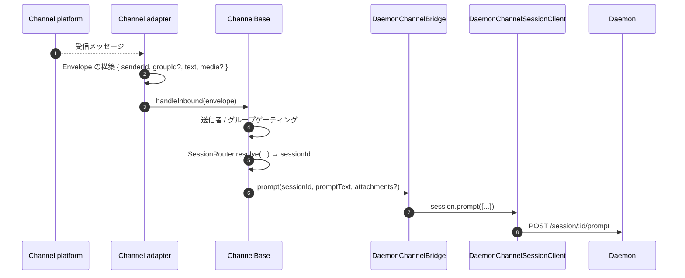
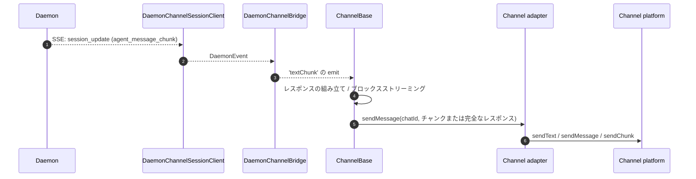
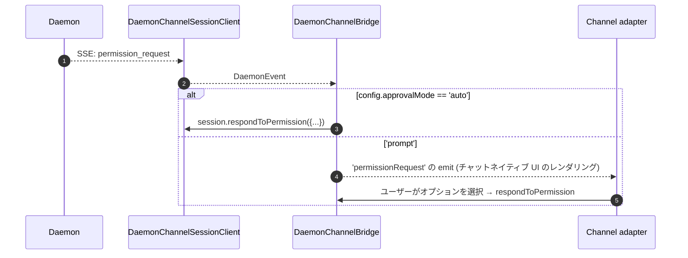

# チャネルアダプター

## 概要

`packages/channels/` には、チャットプラットフォームからの受信メッセージをエージェントのプロンプトに変換し、エージェントの応答をチャットプラットフォームに送信する **IM チャネルアダプター** が含まれています。現在、DingTalk、WeChat (Weixin)、Telegram、Feishu の 4 つの具体的なチャネルが提供されています。これらはベースレイヤー (`packages/channels/base/`) とアダプター向けの `ChannelAgentBridge` 契約を共有しています。

現在のホストモードは 2 つあります。

- `qwen channel start [name]` は、スタンドアロンの ACP バックチャネルサービスです。アダプターに `ChannelAgentBridge` の `AcpBridge` 実装を渡します。
- `qwen serve --channel <name>` および `qwen serve --channel all` は、実験的なデーモン管理モードです。名前付きセレクションは所有ワークスペースごとにグループ化され、`qwen serve` は所有ランタイムごとにプロセス外のワーカーを 1 つ起動します。各ワーカーは SDK を介してデーモンに接続し、アダプターは `DaemonChannelBridge` ベースの `ChannelAgentBridge` ファサードを受け取ります。`--channel all` は引き続きプライマリのみのセレクションです。

デーモン管理モードでは、各チャネルは受信チャットトラフィックを、設定可能な `SessionScope` (`user`、`chat_thread`、または `single`) の下のデーモンセッションにマッピングします。レガシーな Channel 値 `thread` は既存の設定では読み書き可能ですが、新しい Web Shell の設定では提供されません。これはデーモンブリッジ独自の `single`/`thread` セッション作成ノブとは別のものです。`sessionScope: "user"` かつ `multiSession: true` の場合、`ChannelBase` はチャネル、チャット、および送信者をキーとする永続化された名前付きセッションカタログを追加し、`SessionRouter` は選択されたセッションを互換性ルートとして保持します。正確な名前付きセッションのロードは、レガシーな load-or-replace パスを使用することはありません。アダプターは `DaemonChannelBridge` に委任し、それは SDK の `DaemonSessionClient` に委任します ([`13-sdk-daemon-client.md`](./13-sdk-daemon-client.md) を参照)。各名前付きチャネルは、登録された 1 つの信頼されたワークスペースに解決される必要があります。ワーカーはそのランタイムの標準 cwd、`QWEN_DAEMON_WORKSPACE`、および環境オーバーレイを使用します。所有権の解決はプライマリにフォールバックすることはありません。

### Webhook トリガーのチャネルタスク

Webhook トリガーのタスクは `qwen serve` でホストされ、デーモン管理のチャネルワーカー内で実行されます。HTTP ルートはソースを検証し、`ChannelWebhookTask` を IPC 経由でワーカーに転送します。ワーカーは `ChannelBase.runWebhookTask()` を呼び出すため、アダプターは webhook の解析を実装しません。

アダプターはプロアクティブ送信サポートを通じて引き続き関与します。`supportsProactiveSend()` はホストにチャネルが受信メッセージなしに送信できるかどうかを伝え、`supportsProactiveTarget()` は特定のターゲット形状の配信制限を処理し、`pushProactive()` は送信コンテンツを運びます。

## 責務

- チャネルのネイティブトランスポート (DingTalk WebSocket ストリーム、WeChat HTTP ロングポール、Telegram Bot ロングポール、Feishu WebSocket または HTTP webhook) から受信メッセージを受け取ります。
- `DaemonChannelSessionFactory` を介して `(senderId, groupId?)` をデーモンセッションに解決します。
- ユーザーメッセージをデーモンプロンプトとして転送し、応答をアウトバウンドチャットメッセージとしてストリーミングバックします (場合によってはチャンク分けされます)。
- インタラクティブな場合は許可リクエストをチャットネイティブなプロンプトとしてレンダリングし、それ以外の場合は `ChannelConfig.approvalMode` に従って自動承認します。
- 送信者ゲーティング (許可リスト / 拒否リスト)、グループゲーティング、およびコンテンツの正規化 (チャネルごとの markdown / HTML) を適用します。

## アーキテクチャ

### `DaemonChannelBridge` (共有ベース、`packages/channels/base/src/DaemonChannelBridge.ts`)

```ts
class DaemonChannelBridge extends EventEmitter {
  constructor(opts: {
    cwd: string;
    sessionFactory: DaemonChannelSessionFactory;
    modelServiceId?: string;
    sessionScope?: SessionScope;
  });
  newSession(cwd: string): Promise<string>;
  loadSession(sessionId: string, cwd: string): Promise<string>;
  prompt(sessionId: string, text: string, options?): Promise<string>;
  cancelSession(sessionId: string): Promise<void>;
  stop(): void;
}
```

デーモンの `sessionId` をキーとしてデーモンセッションクライアントを保持します。`ChannelBase` と `SessionRouter` は、どの受信チャットターゲットをそのセッションにマッピングするかを決定します。各アタッチされたセッションは以下を持ちます。

- `DaemonChannelSessionClient` (チャネルに関連しないメソッドを除いた `DaemonSessionClient` の形状)。
- ライブ SSE コンシューマーポンプ。
- デバウンスされたプロンプトアセンブラー (複数の受信メッセージにまたがってユーザー入力をフラグメント化するアダプター用)。
- リクエストごとの自動承認ポリシー。

発行されるイベント: `textChunk`、`toolCall`、`sessionUpdate`、`permissionRequest`、`permissionResolved`、`modelSwitched`、`modelSwitchFailed`、`sessionDied`、`promptComplete`、および `error`。チャネルアダプターはこれらをプラットフォームネイティブな API に接続します。

### `ChannelBase` (`packages/channels/base/src/ChannelBase.ts`)

すべてのアダプターが継承する抽象ベースクラス:

```ts
abstract class ChannelBase {
  abstract connect(): Promise<void>;
  abstract sendMessage(chatId: string, text: string): Promise<void>;
  abstract disconnect(): void;
  handleInbound(envelope: Envelope): Promise<void>; // → SessionRouter.resolve + bridge.prompt
}
```

すべての内部メッセージ配信は `sendThreadMessage(chatId, threadId, text)` を通じてルーティングされます。デフォルト実装は `threadId` を無視して `sendMessage(chatId, text)` にフォールスルーします。IM アダプターは影響を受けません。ポーリングアダプター (GitHub など) は `sendThreadMessage` をオーバーライドして、`threadId` を使用して特定の issue/PR にコメントを投稿します。

共通の横断的関心事を処理します: 送信者ゲーティング (許可リスト / 拒否リスト)、グループゲーティング、メッセージブロックストリーミング (チャンクサイズ、スロットリング)、受信デバウンス。

### チャネル別アダプター

| アダプター         | ファイル                                                | トランスポート                                              | 備考                                                                                                                                         |
| --------------- | --------------------------------------------------- | ------------------------------------------------------ | --------------------------------------------------------------------------------------------------------------------------------------------- |
| DingTalk        | `packages/channels/dingtalk/src/DingtalkAdapter.ts` | DingTalk Stream SDK WebSocket                          | `sessionWebhook` POST 経由で送信。メディア画像は DT API 経由でダウンロードされ、エンベロープ内で base64 化されます。                                                      |
| WeChat (Weixin) | `packages/channels/weixin/src/WeixinAdapter.ts`     | iLink Bot HTTP ロングポール                               | 独自の `sendText` / `sendImage` API 経由で送信。タイピングインジケーター対応。                                                                        |
| Telegram        | `packages/channels/telegram/src/TelegramAdapter.ts` | Telegram Bot API ロングポール (grammy)                    | `sendMessage` 経由で HTML チャンクを送信。                                                                                                          |
| Feishu          | `packages/channels/feishu/src/FeishuAdapter.ts`     | Feishu/Lark Stream WebSocket (デフォルト) または HTTP webhook | Lark SDK 経由でインタラクティブカードとして送信。webhook モードでは HMAC 署名検証に `encryptKey` が必要です。                                  |
| GitHub          | `packages/channels/github/src/GithubAdapter.ts`     | GitHub Notifications API ポーリング (`@octokit/rest`)     | `PollingChannelBase` を継承。カーソルベースのコメントウィンドウの重複排除。Issues API 経由でコメントを投稿。                                               |
| GitLab          | `packages/channels/gitlab/src/GitlabAdapter.ts`     | GitLab Todos API ポーリング (`@gitbeaker/rest`)           | `PollingChannelBase` を継承。`todo.body` を直接ディスパッチ。`action_prompt_template` 設定がイベントフィルタリングとメタデータレンダリングを制御。 |

各アダプターは以下を実装します。

1. 受信トランスポート (メッセージのサブスクライブ / ポーリング)。
2. エンベロープの構築 (`{ senderId, groupId?, text, media?, raw }`)。
3. 送信者 / グループゲーティング (`ChannelBase` に委任)。
4. アウトバウンドのシリアライゼーション (markdown → HTML / WeChat ネイティブ / DingTalk ネイティブ)。
5. ライフサイクル (開始 / シャットダウン)。

### アダプターマトリクス

| アダプター      | トランスポート                       | 識別子                                                 | 権限 UX                       | 自動承認設定                               |
| ------------ | ------------------------------- | -------------------------------------------------------- | ----------------------------------- | ------------------------------------------------- |
| **DingTalk** | WebSocket ストリーム                | `senderStaffId` (グループの場合はオプションで `conversationId`) | DT markdown 経由のインラインボタン      | `ChannelConfig.approvalMode = 'auto' \| 'prompt'` |
| **WeChat**   | HTTP ロングポール                  | `senderWxid` (グループの場合はオプションで `groupWxid`)                    | 応答トークンを使用したテキストのみのプロンプト | 同上                                              |
| **Telegram** | Bot API ロングポール               | `from.id` (グループの場合はオプションで `chat.id`)              | インラインキーボードボタン             | 同上                                              |
| **Feishu**   | WebSocket ストリーム / HTTP webhook | `sender.open_id` (グループの場合はオプションで `chat_id`)       | インタラクティブカードボタン            | 同上                                              |
| **GitHub**   | Notifications API ポーリング       | 数値の `user.id` (不変。ログイン名は接続時に解決) | エラーコメント + 再メンション          | `senderPolicy: 'allowlist' \| 'open'`             |
| **GitLab**   | Todos API ポーリング               | `author.username` (小文字化)                           | ログ + 再メンション                    | `senderPolicy: 'allowlist' \| 'open'`             |

> **注:** 「Permission UX」列は各プラットフォームのネイティブなアフォーダンスについて説明していますが、まだ何も接続されていません。`AcpBridge.requestPermission` は現在すべてのリクエストを自動承認しており (`packages/channels/base/src/AcpBridge.ts`)、`ChannelConfig.approvalMode` は宣言されていますがまだ読み取られていません。インタラクティブな承認は計画されています (フェーズ 5)。

## ワークフロー

### 受信プロンプト


```mermaid
sequenceDiagram
    autonumber
    participant CH as Channel platform
    participant AD as Channel adapter
    participant CB as ChannelBase
    participant BR as DaemonChannelBridge
    participant SC as DaemonChannelSessionClient
    participant D as Daemon

    CH-->>AD: 受信メッセージ
    AD->>AD: Envelope の構築 { senderId, groupId?, text, media? }
    AD->>CB: handleInbound(envelope)
    CB->>CB: 送信者 / グループゲーティング
    CB->>CB: SessionRouter.resolve(...) → sessionId
    CB->>BR: prompt(sessionId, promptText, attachments?)
    BR->>SC: session.prompt({...})
    SC->>D: POST /session/:id/prompt
```

### SSE ドリブンなアウトバウンド


```mermaid
sequenceDiagram
    autonumber
    participant D as Daemon
    participant SC as DaemonChannelSessionClient
    participant BR as DaemonChannelBridge
    participant CB as ChannelBase
    participant AD as Channel adapter
    participant CH as Channel platform

    D-->>SC: SSE: session_update (agent_message_chunk)
    SC-->>BR: DaemonEvent
    BR-->>CB: 'textChunk' の emit
    CB->>CB: レスポンスの組み立て / ブロックスストリーミング
    CB->>AD: sendMessage(chatId, チャンクまたは完全なレスポンス)
    AD->>CH: sendText / sendMessage / sendChunk
```

### 権限の自動承認


```mermaid
sequenceDiagram
    autonumber
    participant D as Daemon
    participant SC as DaemonChannelSessionClient
    participant BR as DaemonChannelBridge
    participant AD as Channel adapter

    D-->>SC: SSE: permission_request
    SC-->>BR: DaemonEvent
    alt config.approvalMode == 'auto'
        BR->>SC: session.respondToPermission({...})
    else 'prompt'
        BR-->>AD: 'permissionRequest' の emit (チャットネイティブ UI のレンダリング)
        AD->>BR: ユーザーがオプションを選択 → respondToPermission
    end
```

## 状態とライフサイクル

- `DaemonChannelBridge` はチャネルアダプターの存続期間中存続し、その内部のセッションは設定された `SessionScope` に従って存続します。
- 各アクティブセッションは、SSE がドロップした場合に自動的に再接続します。`DaemonSessionClient.events()` は `lastSeenEventId` を追跡するため、リプレイが正しく行われます。
- `shutdown()` はすべてのアクティブなセッションと基盤となるトランスポート (チャネルの WebSocket / ロングポール) を閉じます。
- DingTalk の WebSocket ストリームはサーバープッシュをサポートしています。WeChat のロングポールはアイドル応答時のバックオフ戦略を必要とします。Telegram のロングポールには組み込みの `timeout` パラメータがあります。

### ランタイムセレクションと設定のリロード

長寿命の `ChannelWorkerManager` は、コミットされたデーモンセレクションとワークスペースグループ化されたスーパーバイザーを所有します。デーモンは `--channel` なしで起動する場合があります。最初の厳格ゲーティングされた `PUT /workspace/channel` がチャネルランタイムを動的にロードし、サービス pidfile を予約し、ワークスペースの所有権を解決し、選択されたワーカーを起動します。`GET /workspace/channel` はマネージャースナップショットを読み取り、`DELETE /workspace/channel` は冪等に停止します。SDK ヘルパーは `getChannelWorkerControl()`、`setChannelWorkerSelection()`、および `stopChannelWorker()` です。CLI エントリーは `qwen channel set` とリモートの `status` および `stop` バリアントです。

デーモンは各ワーカーが起動するときに `settings.json` からチャネル設定を読み取ります (`packages/cli/src/commands/channel/daemon-worker.ts` → `loadSettings` → `loadChannelsConfig`)。`POST /workspace/channel/reload` はこれらの設定を再読み込みし、コミットされたセレクションを強制的に reconciliation します。すべてのライフサイクル変更は 1 つの FIFO レーンを共有します。変更されていないワークスペースグループは通常のセレクション置き換えでも存続します。変更されたグループは、serve が所有する PID リースが保持されたまま、順次停止および起動します。

置き換えが失敗した場合、 newly 起動されたワーカーは停止され、リクエストが返る前に古いワーカーが復元されます。SIGTERM と SIGKILL の後に exit を観察できないスーパーバイザーは子参照を保持し、停止に失敗します。マネージャーは PID リースを保持し、2 つ目のワーカーを起動することはありません。Webhook の設定とルーティングは、セレクションのコミットが成功した場合にのみ変更されます。ランタイムセレクションはプロセスローカルであり、デーモン再起動時に消えます。

アダプターの `connect()` 失敗はワーカーライフサイクルエラーとは別に報告されます。ワーカーは各境界付けられた、資格情報編集済みの失敗を起動 IPC 経由で送信し、次のアダプターを試す前にスーパーバイザーの確認を待ちます。部分的に接続されたワーカーは実行を継続し、スナップショットで `startupFailures` を公開します。動的試行のすべてのアダプターが失敗した場合、`502 channel_worker_start_failed` レスポンスはワークスペース注釈付きの試行失敗を運び、`state` はロールバック結果を反映します。その後の GET レスポンスは試行を保持しません。接続されたアダプターなしのデーモン起動は引き続き fail-fast です。オプションのアダプター `code` は診断のみであり、現在の `phase` は `connect` です。

## 依存関係

- `packages/channels/base/` — `ChannelBase`、`PollingChannelBase`、`DaemonChannelBridge`、`types.ts` (`ChannelConfig`、`Envelope`、`SessionScope`、`ChannelPlugin`)。
- `packages/sdk-typescript/src/daemon/` — `DaemonSessionClient` など。
- チャネル別 SDK: `@dingtalk/stream` (DingTalk)、独自の iLink Bot HTTP (Weixin)、`grammy` (Telegram)、`@octokit/rest` (GitHub ポーリング)、`@gitbeaker/rest` (GitLab ポーリング)。

## 設定

`ChannelConfig` (`packages/channels/base/src/types.ts` より):

| 設定項目                                     | 効果                                                                                                                                                                         |
| ---------------------------------------- | ------------------------------------------------------------------------------------------------------------------------------------------------------------------------------ |
| `sessionScope`                           | `'user'` (送信者 + チャット)、`'chat_thread'` (チャネル + chatId + threadId)、または `'single'` (チャネルごとに 1 つの共有セッション)。レガシーの `'thread'` はすでに設定されている場合は保持されますが、新しい Web Shell の設定では提供されません。 |
| `multiSession`                           | `sessionScope: 'user'` 向けのデーモン専用の名前付きタスク。オーナーカタログはワークスペース/チャネルの状態ディレクトリの下に永続化されます。webhook、グループ履歴のバックフィル、ループ、実行中タスクの切り替え、およびタスクごとのワークツリーは Part 2 で除外されます。 |
| `approvalMode`                           | `'auto'` (自動応答) / `'prompt'` (UI のレンダリング)。                                                                                                                              |
| `allowlist?: string[]`                   | 許可される送信者 ID。未指定 = オープン。                                                                                                                                            |
| `denylist?: string[]`                    | 拒否される送信者 ID。                                                                                                                                                             |
| `chunkSize`, `chunkIntervalMs`           | アウトバウンドブロックストリーミングの設定。                                                                                                                                             |
| `daemon: { baseUrl, token?, clientId? }` | `DaemonChannelSessionFactory` に転送されます。                                                                                                                                    |

チャネル固有のキーがその上に追加されます (DingTalk: `streamCredentials`、WeChat: `ilinkUrl`、`botId`、Telegram: `botToken`、Feishu: `clientId` (appId)、`clientSecret` (appSecret)、`verificationToken`、`encryptKey` (webhook モード))。

## 注意事項と既知の制限

- **チャネルは `@qwen-code/sdk` を直接インポートしません。** `ChannelBase` → `DaemonChannelBridge` → `DaemonChannelSessionClient` (ブリッジが SDK から構築) を経由します。この間接化により、ブリッジはチャネルの変更を必要とせずに、テストスタブなどの実装をスワップできます。
- **権限 UX はチャネルごとに異なります。** DingTalk は markdown ボタンを使用し、WeChat はテキストのみ、Telegram はインラインキーボード、Feishu はインタラクティブカードボタンを使用します。(現在はすべて `AcpBridge` 経由で自動承認されます。インタラクティブな承認は計画されています。) 共通の「インタラクティブ権限ウィジェット」抽象化はまだありません。
- **自動承認はデーモン側ではなくデプロイ側の決定です。** デーモンの `permission_mediation` ポリシーは引き続き適用されます。自動承認は、チャネルが人間にプロンプトを出さずに応答することを意味するだけです。`auto` を `enforce` グレードのワークフローと組み合わせないでください。
- **チャネルごとのレート制限 / メッセージサイズ制限はアダプターの役割です。** `DaemonChannelBridge` はチャンク処理のみを扱い、WeChat のメッセージごとのサイズ制限や Telegram のフラッド制限を超える処理はアダプターに任されています。
- **DingTalk / WeChat / Telegram / Feishu のリバースコールはありません。** チャネルは一方通行 (チャット → デーモン → チャット) です。DingTalk カードコールバックなどの IM プラットフォームのネイティブプッシュパスは、まだブリッジに接続されていません。

## 参照

- `packages/channels/base/src/DaemonChannelBridge.ts`
- `packages/channels/base/src/ChannelBase.ts`
- `packages/channels/base/src/types.ts`
- `packages/cli/src/serve/channel-worker-manager.ts` (セレクションライフサイクル + 直列化)
- `packages/cli/src/serve/channel-worker-group.ts` (ワークスペース差分 reconciliation)
- `packages/cli/src/serve/channel-worker-supervisor.ts` (子スーパービジョン)
- `packages/cli/src/serve/routes/workspace-channel-control.ts` (GET/PUT/DELETE/reload リソース)
- `packages/channels/dingtalk/src/DingtalkAdapter.ts`
- `packages/channels/weixin/src/WeixinAdapter.ts`
- `packages/channels/telegram/src/TelegramAdapter.ts`
- `packages/channels/plugin-example/` (リファレンスプラグインのスケルトン)
- チャネルプラグインガイド: [`../channel-plugins.md`](../channel-plugins.md)。
- SDK リファレンス: [`13-sdk-daemon-client.md`](./13-sdk-daemon-client.md)。
