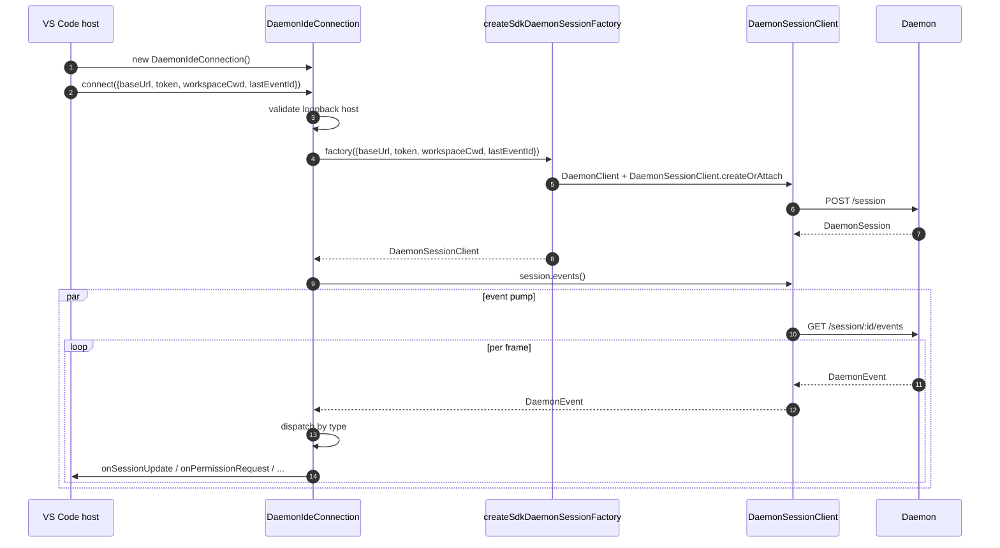
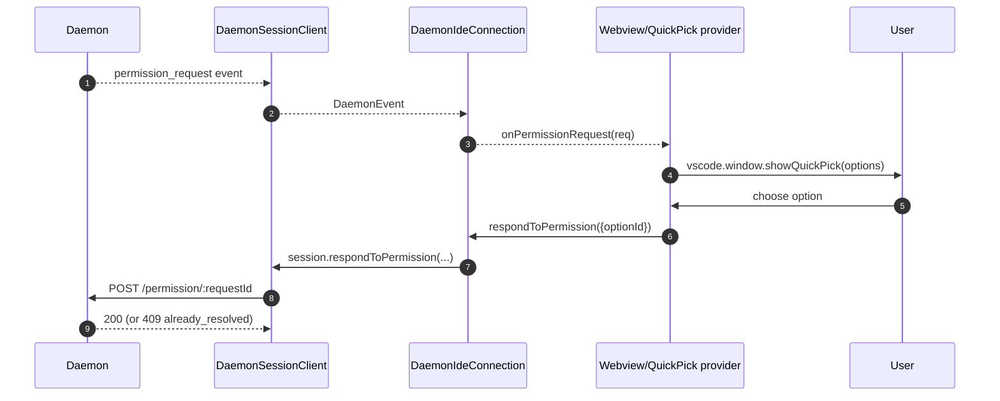
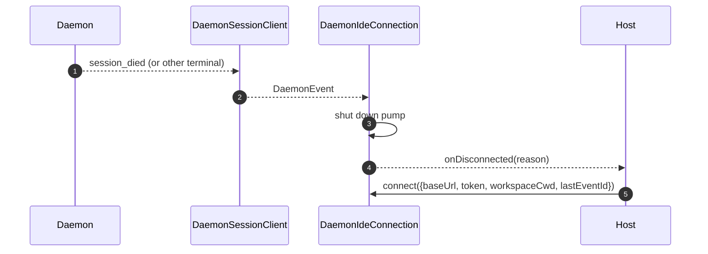

# VS Code IDE Daemon Adapter

## 概要

`packages/vscode-ide-companion/src/services/daemonIdeConnection.ts` は、**VS Code 拡張機能のデーモンアダプター**です。IDE コンパニオンが、実行中の `qwen serve` デーモンに HTTP + SSE 経由で接続できるようにし、インプロセスで起動する `qwen --acp` stdio 子プロセス（従来の `AcpConnectionState` パス）の代わりとします。これは、VS Code ホスト向けの [`14-cli-tui-adapter.md`](./14-cli-tui-adapter.md) に相当する sibling-transport です。

IDE のチャット Webview は、このアダプターを介してデーモンイベントを消費します。パーミッション要求は、ネイティブの VS Code クイックピックダイアログとして表示されます。

## 責務

- `connect(options)` に渡されたループバック検証済みの `baseUrl` から `DaemonClient` + `DaemonSessionClient` を構築する。
- セッションクライアントからの SSE イベントを、コールバックごとのディスパッチ（`onSessionUpdate`、`onPermissionRequest`、`onAskUserQuestion`、`onEndTurn`、`onDisconnected`）に投入する。
- `connect(options)` で **ループバックのみ** の不変条件を強制する（IDE は常に同一ホスト上のデーモンにのみ接続する）。
- デーモンイベントを Webview の `postMessage` にブリッジし、チャットパネルを同期状態に保つ。
- パーミッション要求を VS Code のネイティブクイックピック UI で表示する。
- 呼び出しをキューにシリアライズし、ホストからの連続した二重 `connect()` が競合しないようにする。

## アーキテクチャ

### 公開インターフェース

```ts
class DaemonIdeConnection {
  connect(options: DaemonIdeConnectionOptions): Promise<void>;
  disconnect(): Promise<void>;
  sendPrompt(prompt: string | ContentBlock[]): Promise<DaemonIdePromptResult>;
  cancelSession(): Promise<void>;
  setModel(modelId: string): Promise<DaemonIdeSetModelResult>;

  onSessionUpdate: (data: SessionNotification) => void;
  onPermissionRequest: (
    data: RequestPermissionRequest,
  ) => Promise<{ optionId?: string }>;
  onAskUserQuestion: (data: AskUserQuestionRequest) => Promise<{
    optionId: string;
    answers?: Record<string, string>;
  }>;
  onEndTurn: (reason?: string) => void;
  onDisconnected: (code: number | null, signal: string | null) => void;
}

interface DaemonIdeConnectionOptions {
  baseUrl: string; // MUST be loopback (127.0.0.1 / localhost / [::1])
  token?: string;
  workspaceCwd?: string;
  modelServiceId?: string;
  lastEventId?: number;
  sessionFactory?: DaemonIdeSessionFactory;
}
```

### ループバック検証

`connectInternal()` 内:

```ts
const baseUrl = validateDaemonBaseUrl(options.baseUrl);
```

これは、デーモン自身の `hostAllowlist`（[`12-auth-security.md`](./12-auth-security.md) を参照）とは別の、**クライアント側のハード制約**です。IDE コンパニオンは、たとえオペレーターがリモートデーモンを設定しても、絶対に接続しません。理由: VS Code の脅威モデルは、ワークスペースとデーモンが同一ホストを共有し、ファイルシステムの信頼等の関連する前提を共有することを前提としています。

### `createSdkDaemonSessionFactory()`

`createSdkDaemonSessionFactory()` は `DaemonClient` を構築し、`@qwen-code/sdk` から `DaemonSessionClient.createOrAttach()` を呼び出します。コネクションクラスは直接インスタンス化せずにファクトリを保持するため、テストで fake を注入できます。

### イベントディスパッチ

コネクションは 1 つの SSE コンシューマー（`session.events()` に対する `for await`）を実行し、イベントをタイプごとにルーティングします。

| Daemon event / source                                                                                   | IDE callback / action                                                    |
| ------------------------------------------------------------------------------------------------------- | ------------------------------------------------------------------------ |
| `session_update`                                                                                        | `onSessionUpdate`                                                        |
| Normal `permission_request`                                                                             | `onPermissionRequest`, then `respondToPermission()`                      |
| `permission_request` where `toolCall.kind === 'ask_user_question'` and `rawInput.questions` is an array | `onAskUserQuestion`, then forward `answers` to the daemon                |
| `session_died` with a payload `sessionId` matching the current session                                  | `onDisconnected(null, reason)`                                           |
| SSE natural end / stream failure / manual `disconnect()`                                                | `onDisconnected(null, 'stream_ended' / 'daemon_error' / 'disconnected')` |
| Other daemon events                                                                                     | Debug-level log; no IDE callback today.                                  |

`onEndTurn` は SSE ディスパッチによって生成されません。`sendPrompt()` はデーモンの HTTP prompt 応答を待機し、`response.stopReason` を指定して呼び出します。中断以外の例外パスでは `onEndTurn('error')` を呼び出します。

### Webview ブリッジ

コネクションクラスは**トランスポートのみ**です。実際の VS Code 統合は `packages/vscode-ide-companion/src/webview/providers/ChatWebviewViewProvider.ts`（および関連ファイル）にあります。プロバイダーはコネクションのコールバックを購読し、それらを Webview の `postMessage` 呼び出しに変換します。Webview 自体は共有の `packages/webui/` コンポーネントライブラリを使用してレンダリングします。詳細については、[`01-architecture.md`](./01-architecture.md) のアダプターマトリックスを参照してください。

### 接続のシリアライズ

`connect()` は内部キューを使用するため、ホストからの高速な二重呼び出し（例えば、ハンドシェイク中にユーザーがパネルを 2 回開くなど）が競合しません。2 回目の呼び出しは 1 回目の完了を待ち、接続は単一の決定論的な状態になります。

## ワークフロー

### 初期接続



### クイックピックによるパーミッション



### 切断 / リカバリ



## 状態とライフサイクル

- コンストラクションは同期であり、`connect(options)` まで**ネットワーク I/O は発生しません**。
- `connect()` は内部キューにより冪等です。2 回呼び出すと直列化されます。
- `disconnect()` は SSE イテレータ（ポンプ上の `AbortController`）を中断し、コールバック登録をクリアします。
- `lastEventId` は切断時に SDK の `DaemonSessionClient` から取得され、再開のために次の `connect()` で再指定できます。

## 依存関係

- `packages/sdk-typescript/src/daemon/` — `DaemonClient`, `DaemonSessionClient` (the actual transport).
- VS Code extension API (`vscode.*`) — host APIs, quick-pick, webview.
- `packages/webui/src/adapters/ACPAdapter.ts` — webview rendering of ACP-shaped messages relayed via `postMessage`.

## 設定

| 設定項目                                             | 場所                               | 効果                                                               |
| ---------------------------------------------------- | ---------------------------------- | ------------------------------------------------------------------ |
| `baseUrl`                                            | `connect(options)`                 | デーモンURL。ループバックである必要があります。                    |
| `token`                                              | `connect(options)`                 | Bearer トークン（SDK によってスタンプされます）。                  |
| `workspaceCwd`                                       | `connect(options)`                 | `POST /session` で使用されます。デーモンのバインドされたワークスペースと一致する必要があります。 |
| `modelServiceId`                                     | `connect(options)` / `setModel()`  | 初期モデル。                                                       |
| `lastEventId`                                        | `connect(options)`                 | 再開カーソル（通常はホスト状態から復元されます）。                 |
| VS Code 設定 `qwen.ide.daemonUrl` (または同等のもの) | ワークスペース設定                 | オペレーターが設定するデーモンURL。                                |

## 注意事項と既知の制限

- **ループバックのみ — `connect(options)` でハード拒否。** IDE をリモートデーモンに向けたいオペレーターは SSH ポートフォワード/ローカルプロキシを使用する必要があります。アダプターは非ループバック URL には接続しません。
- **従来の `AcpConnectionState` パスは依然として IDE コンパニオン（stdio 子プロセス）のプライマリです。** このアダプターは Mode-B 移行のための sibling-transport です。移行のブロッカーと計画されている `BridgeFileSystem` のパリティ作業については [`../daemon-client-adapters/ide.md`](../daemon-client-adapters/ide.md) を参照してください。
- **HTTP 経由のリバース RPC やエディターアフォーダンスの表面はまだありません。** エージェントが IDE にコールバックする必要がある機能（読み取り専用バッファアクセス、差分プレビュー統合など）は、現在 stdio パスでのみ動作します。
- **Webview ↔ コネクションの結合はホストが所有しており**、このアダプターには含まれません。Webview 固有のロジックを `DaemonIdeConnection` に組み込まないでください。
- **`workspaceCwd` がデーモンのバインドされたワークスペースと一致しない** 場合、`400 workspace_mismatch` が返されます。再試行するのではなく、明確なセットアップエラーとして表示してください。

## 参考

- `packages/vscode-ide-companion/src/services/daemonIdeConnection.ts`
- `packages/vscode-ide-companion/src/services/daemonIdeConnection.ts` (`createSdkDaemonSessionFactory`)
- `packages/vscode-ide-companion/src/types/connectionTypes.ts` (legacy `AcpConnectionState`)
- `packages/vscode-ide-companion/src/webview/providers/ChatWebviewViewProvider.ts` (webview bridge)
- `packages/webui/src/adapters/ACPAdapter.ts` (webview ACP-message adapter)
- Draft design: [`../daemon-client-adapters/ide.md`](../daemon-client-adapters/ide.md)
- SDK reference: [`13-sdk-daemon-client.md`](./13-sdk-daemon-client.md)