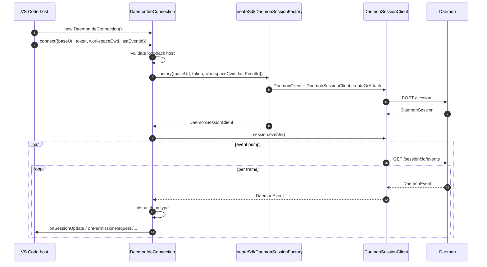
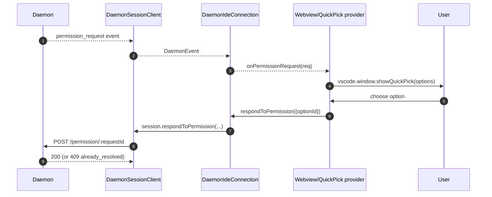
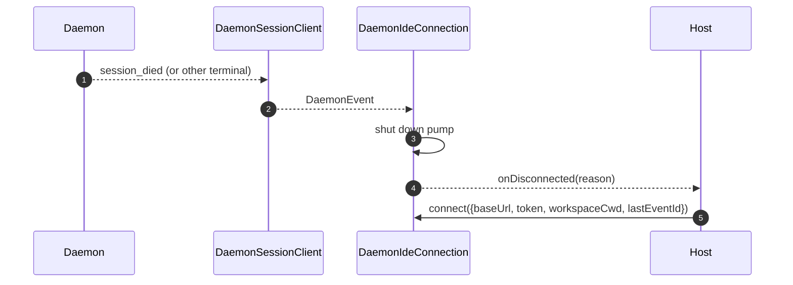

# VS Code IDE デーモンアダプター

## 概要

`packages/vscode-ide-companion/src/services/daemonIdeConnection.ts` は **VS Code 拡張機能のデーモンアダプター**です。これにより、IDE コンパニオンは、インプロセスの `qwen --acp` stdio 子プロセスを起動する代わりに（レガシーの `AcpConnectionState` パス）、HTTP + SSE 経由で実行中の `qwen serve` デーモンに接続できます。VS Code ホスト向けの [`14-cli-tui-adapter.md`](./14-cli-tui-adapter.md) に対応するトランスポートの兄弟実装です。

IDE のチャット WebView はこのアダプターを通じてデーモンイベントを受け取り、権限プロンプトはネイティブの VS Code クイックピックダイアログとして表示されます。

## 責務

- `connect(options)` に渡されたループバック検証済みの `baseUrl` から `DaemonClient` と `DaemonSessionClient` を構築する。
- セッションクライアントから SSE イベントを取り出し、コールバックごとにディスパッチする（`onSessionUpdate`、`onPermissionRequest`、`onAskUserQuestion`、`onEndTurn`、`onDisconnected`）。
- `connect(options)` で**ループバックのみ**という不変条件を強制する（IDE は常に同一ホスト上のデーモンにのみ接続すべき）。
- デーモンイベントを WebView の `postMessage` にブリッジし、チャットパネルの同期を維持する。
- VS Code のネイティブクイックピック UI を通じて権限リクエストを表示する。
- ホストからの高速な二重 `connect()` が競合しないよう、呼び出しをキューにシリアライズする。

## アーキテクチャ

### 公開インターフェース

```ts
class DaemonIdeConnection {
  connect(options: DaemonIdeConnectionOptions): Promise<void>;
  disconnect(): Promise<void>;
  sendPrompt(prompt: string | ContentBlock[]): Promise<DaemonIdePromptResult>;
  cancelSession(): Promise<void>;
  setModel(modelId: string): Promise<DaemonIdeSetModelResult>;

  onSessionUpdate: (data: SessionNotification) => void;
  onPermissionRequest: (
    data: RequestPermissionRequest,
  ) => Promise<{ optionId?: string }>;
  onAskUserQuestion: (data: AskUserQuestionRequest) => Promise<{
    optionId: string;
    answers?: Record<string, string>;
  }>;
  onEndTurn: (reason?: string) => void;
  onDisconnected: (code: number | null, signal: string | null) => void;
}

interface DaemonIdeConnectionOptions {
  baseUrl: string; // MUST be loopback (127.0.0.1 / localhost / [::1])
  token?: string;
  workspaceCwd?: string;
  modelServiceId?: string;
  lastEventId?: number;
  sessionFactory?: DaemonIdeSessionFactory;
}
```

### ループバック検証

`connectInternal()` 内:

```ts
const baseUrl = validateDaemonBaseUrl(options.baseUrl);
```

これはデーモン自身の `hostAllowlist`（[`12-auth-security.md`](./12-auth-security.md) 参照）とは別の**クライアント側のハード制約**です。オペレーターがリモートデーモンを設定していても、IDE コンパニオンはリモートデーモンに接続しません。理由: VS Code の脅威モデルでは、ワークスペースとデーモンが同一ホストを共有し、ファイルシステムの信頼やそれに関連する前提が成り立つことを想定しているためです。

### `createSdkDaemonSessionFactory()`

`createSdkDaemonSessionFactory()` は `DaemonClient` を構築し、`@qwen-code/sdk` から `DaemonSessionClient.createOrAttach()` を呼び出します。接続クラスは直接インスタンス化せずにファクトリーを保持することで、テスト時にフェイクを注入できるようにしています。

### イベントディスパッチ

接続は SSE コンシューマーを 1 つ実行し（`session.events()` に対する `for await`）、各イベントをタイプ別にルーティングします:

| デーモンイベント / ソース                                                                                   | IDE コールバック / アクション                                                    |
| ------------------------------------------------------------------------------------------------------- | ------------------------------------------------------------------------ |
| `session_update`                                                                                        | `onSessionUpdate`                                                        |
| 通常の `permission_request`                                                                             | `onPermissionRequest`、その後 `respondToPermission()`                      |
| `permission_request` で `toolCall.kind === 'ask_user_question'` かつ `rawInput.questions` が配列の場合 | `onAskUserQuestion`、その後 `answers` をデーモンに転送                |
| 現在のセッションに一致するペイロード `sessionId` を持つ `session_died`                                                | `onDisconnected(null, reason)`                                           |
| SSE の自然終了 / ストリーム失敗 / 手動 `disconnect()`                                                | `onDisconnected(null, 'stream_ended' / 'daemon_error' / 'disconnected')` |
| その他のデーモンイベント                                                                                     | デバッグレベルのログ; 現時点では IDE コールバックなし。                                  |

`onEndTurn` は SSE ディスパッチでは生成されません。`sendPrompt()` はデーモンの HTTP プロンプトレスポンスを待ち、`response.stopReason` とともに呼び出します。非中断の例外パスでは `onEndTurn('error')` を呼び出します。

### WebView ブリッジ

接続クラスは**トランスポートのみ**を担います。実際の VS Code 統合は `packages/vscode-ide-companion/src/webview/providers/ChatWebviewViewProvider.ts`（およびその周辺）に存在します。プロバイダーは接続のコールバックをサブスクライブし、WebView の `postMessage` 呼び出しに変換します。WebView 自体は共有の `packages/webui/` コンポーネントライブラリを使用してレンダリングします — [`01-architecture.md`](./01-architecture.md) のアダプターマトリクスを参照してください。

### 接続のシリアライズ

`connect()` は内部キューを使用しているため、ホストからの高速な二重呼び出し（例: ユーザーがハンドシェイク中にパネルを 2 回開く）が競合しません。2 番目の呼び出しは最初のものを待機し、接続は単一の確定的な状態になります。

## ワークフロー

### 初期接続



### クイックピックによる権限



### 切断 / 復旧



## 状態とライフサイクル

- 構築は同期的; `connect(options)` が呼ばれるまで**ネットワーク I/O なし**。
- `connect()` は内部キューを通じて冪等; 2 回呼ぶとシリアライズされる。
- `disconnect()` は SSE イテレーターを中断し（ポンプに対する `AbortController`）、コールバック登録をクリアする。
- `lastEventId` は切断時に SDK の `DaemonSessionClient` からキャプチャされ、次の `connect()` で再供給して再開できる。

## 依存関係

- `packages/sdk-typescript/src/daemon/` — `DaemonClient`、`DaemonSessionClient`（実際のトランスポート）。
- VS Code 拡張機能 API (`vscode.*`) — ホスト API、クイックピック、WebView。
- `packages/webui/src/adapters/ACPAdapter.ts` — `postMessage` 経由でリレーされた ACP 形式メッセージの WebView レンダリング。

## 設定

| 項目                                                 | 場所                             | 効果                                                            |
| ---------------------------------------------------- | --------------------------------- | ----------------------------------------------------------------- |
| `baseUrl`                                            | `connect(options)`                | デーモン URL; ループバックである必要がある。                                     |
| `token`                                              | `connect(options)`                | ベアラートークン（SDK 経由でスタンプ）。                                   |
| `workspaceCwd`                                       | `connect(options)`                | `POST /session` で使用; デーモンのバインドされたワークスペースと一致する必要がある。 |
| `modelServiceId`                                     | `connect(options)` / `setModel()` | 初期モデル。                                                    |
| `lastEventId`                                        | `connect(options)`                | 再開カーソル（通常はホスト状態から復元）。               |
| VS Code 設定 `qwen.ide.daemonUrl`（または同等のもの） | ワークスペース設定                | オペレーターが設定したデーモン URL。                                   |

## 注意事項と既知の制限

- **ループバックのみ — `connect(options)` でのハード拒否。** IDE をリモートデーモンに向けたいオペレーターは SSH ポートフォワード / ローカルプロキシを使用する必要があります; アダプターは非ループバック URL には接続しません。
- **レガシーの `AcpConnectionState` パスが IDE コンパニオンでは依然として主要**です（stdio 子プロセス）。このアダプターは Mode-B 移行のための兄弟トランスポートです; 移行のブロッカーと計画中の `BridgeFileSystem` パリティ作業については [`../daemon-client-adapters/ide.md`](../daemon-client-adapters/ide.md) を参照してください。
- **HTTP 経由のリバース RPC やエディタアフォーダンスサーフェスはまだありません。** エージェントが IDE にコールバックする必要がある機能（例: 読み取り専用バッファアクセス、差分プレビュー統合）は現在 stdio パスのみに存在します。
- **WebView ↔ 接続のカップリングはホスト所有**であり、このアダプターには含まれません。WebView 固有のロジックを `DaemonIdeConnection` に追加しないでください。
- **`workspaceCwd` のミスマッチ**がデーモンのバインドされたワークスペースと一致しない場合は `400 workspace_mismatch` が返されます — 再試行せず、明確なセットアップエラーとして表示してください。

## 参照

- `packages/vscode-ide-companion/src/services/daemonIdeConnection.ts`
- `packages/vscode-ide-companion/src/services/daemonIdeConnection.ts` (`createSdkDaemonSessionFactory`)
- `packages/vscode-ide-companion/src/types/connectionTypes.ts`（レガシー `AcpConnectionState`）
- `packages/vscode-ide-companion/src/webview/providers/ChatWebviewViewProvider.ts`（WebView ブリッジ）
- `packages/webui/src/adapters/ACPAdapter.ts`（WebView ACP メッセージアダプター）
- ドラフト設計: [`../daemon-client-adapters/ide.md`](../daemon-client-adapters/ide.md)
- SDK リファレンス: [`13-sdk-daemon-client.md`](./13-sdk-daemon-client.md)
