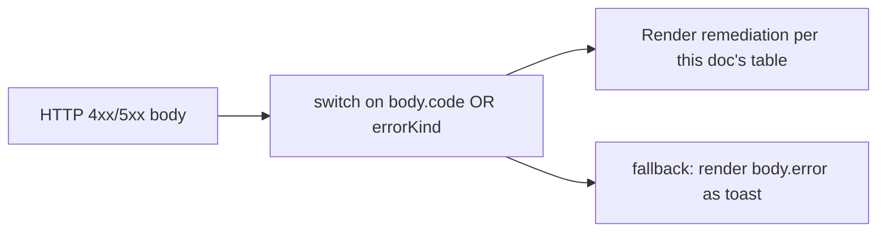
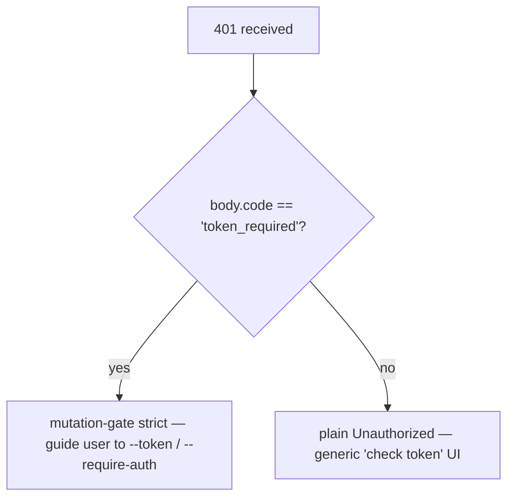

# エラー分類と対処法

## 概要

デーモンの障害モードは意図的にクローズドユニオンとして設計されており、SDK利用者が網羅的にswitch処理を行い、ルートハンドラが一貫したHTTPレスポンスを返せるようになっています。このドキュメントでは、3つのレイヤーにわたる型付きエラークラス/種別をすべて解説します。

1. **`packages/cli/src/serve/`** — HTTPエッジでの境界エラー（認証、ワークスペースファイルシステム、デーモンホストのプリフライト）。
2. **`packages/acp-bridge/`** — デーモンとACPチャイルドの境界でのブリッジ/メディエーターエラー。
3. **`packages/sdk-typescript/src/daemon/`** — SDK側のラッピングと構造化エラーフィールド。

ワイヤーレベルのエラー形式は[`../qwen-serve-protocol.md`](../qwen-serve-protocol.md)に記載されています。このドキュメントでは原因と対処法のガイダンスを追加します。

## ファイルシステム境界 (`packages/cli/src/serve/fs/errors.ts`)

`FsError`は`{ kind, message, status, cause? }`を持ちます。`FsErrorKind`ユニオン（14種類、デフォルトHTTPステータス付き）：

| Kind                     | HTTP      | 原因                                                                           | 対処法                                                                                                                  |
| ------------------------ | --------- | ------------------------------------------------------------------------------ | ----------------------------------------------------------------------------------------------------------------------- |
| `path_outside_workspace` | 400       | 解決されたパスが束縛されたワークスペースの外に出ている。                       | デーモンの`workspaceCwd`内のパスを使用する。`/capabilities`を確認する。                                                  |
| `symlink_escape`         | 400       | ターゲットがシンボリックリンクである。                                         | 解決済みパスを直接指定する。シンボリックリンクは設計上拒否される。                                                      |
| `path_not_found`         | 404       | `ENOENT`。                                                                     | ファイルの存在を確認する。Linux上ではパスの大文字小文字を確認する。                                                     |
| `binary_file`            | 422       | テキストルートでコンテンツがバイナリと判定された。                             | 生バイト取得には`GET /file/bytes`を使用する。テキストルートはバイナリを拒否する。                                       |
| `file_too_large`         | 413       | `MAX_READ_BYTES`（256 KiB）または`MAX_WRITE_BYTES`（5 MiB）を超えている。      | バイト範囲読み取りを使用する。書き込みを分割する。                                                                      |
| `hash_mismatch`          | 409       | 楽観的同時実行の`expectedSha256`が失敗した。                                   | ファイルを再読み込みし、新しいハッシュで再試行する。                                                                    |
| `file_already_exists`    | 409       | 既存ファイルに対して`mode: 'create'`が指定された。                             | `mode: 'overwrite'`を使用するか、別のパスを選択する。                                                                   |
| `text_not_found`         | 422       | `POST /file/edit`の検索文字列がファイル内に存在しない。                        | 検索文字列を確認する。空白や文字エンコードの不一致が一般的な原因。                                                      |
| `ambiguous_text_match`   | 422       | 1つが必要な場所で複数の一致が見つかった。                                      | 一意になるよう検索文字列に前後のコンテキストを追加する。                                                                |
| `untrusted_workspace`    | 403       | 信頼されていないワークスペースへの書き込みが試みられた。                       | ワークスペースを信頼済みにする（`Config.isTrustedFolder()`）か、`createServeApp`直接埋め込みの代わりに`runQwenServe`を使用する。 |
| `permission_denied`      | 403       | OSレベルの`EACCES` / `EPERM`。                                                 | ファイルシステムACLを調整する。これはセキュリティアラートでは**ない**。                                                 |
| `io_error`               | 503       | `ENOSPC` / `EIO` / `EBUSY` / `ETXTBSY` / `ENAMETOOLONG` / `EMFILE` / `ENFILE`。 | ホストレベルの運用対応（ディスク容量、fdの枯渇）。セキュリティではなくOps対応。                                         |
| `internal_error`         | 500       | errnow以外のエラーが境界に到達した。                                           | デーモンのバグとして報告する。                                                                                          |
| `parse_error`            | 400 / 422 | リクエストボディのパースエラー（400）またはサービスレベルの不変条件違反（422）。 | リクエストボディを検証する。SDKのバージョンを確認する。                                                                 |

`io_error`と`permission_denied`の区別は意図的なものであり、監視パイプラインが`errorKind`でルーティングできるようにするためです。EnospcをPermission_deniedに折り込むと、`df -h`の問題でセキュリティ担当者がページングされてしまいます。

## ブリッジエラー (`packages/acp-bridge/src/bridgeErrors.ts`)

ブリッジ/メディエーターが投げる型付きクラス。ほとんどはルートハンドラのswitchを通じてHTTPステータスを持ちます。

| クラス                                | HTTP | 原因                                                                                  | 対処法                                                                                                                                                                           |
| ------------------------------------- | ---- | ------------------------------------------------------------------------------------- | -------------------------------------------------------------------------------------------------------------------------------------------------------------------------------- |
| `SessionNotFoundError`                | 404  | sessionIdが`byId`に存在しない。                                                       | 再作成またはアタッチする。セッションが回収された可能性がある。                                                                                                                   |
| `WorkspaceMismatchError`              | 400  | `POST /session`の`cwd`がデーモンの`boundWorkspace`と一致しない。                      | `cwd`を省略（束縛されたものを使用）するか、自分の`cwd`に束縛されたデーモンにルーティングする。                                                                                   |
| `SessionLimitExceededError`           | 503  | `byId.size >= maxSessions`。                                                          | 古いセッションを閉じる。`--max-sessions`を増やす。                                                                                                                               |
| `InvalidClientIdError`                | 400  | `X-Qwen-Client-Id`が`[A-Za-z0-9._:-]{1,128}`の範囲外。                                | クライアントIDをサニタイズする。                                                                                                                                                  |
| `InvalidSessionMetadataError`         | 400  | `displayName`が256文字超または制御文字を含む。                                        | トリムまたはサニタイズする。                                                                                                                                                     |
| `InvalidSessionScopeError`            | 400  | 不明な`sessionScope`値。                                                              | `'single'`または`'thread'`を使用する。                                                                                                                                           |
| `RestoreInProgressError`              | 409  | `loadSession` / `resumeSession`の同時実行。                                           | 待機して再試行する。                                                                                                                                                             |
| `WorkspaceInitConflictError`          | 409  | `force`なしで既存ファイルに対して`POST /workspace/init`が実行された。                 | `force: true`を渡すか、別のパスを選択する。                                                                                                                                      |
| `WorkspaceInitPathEscapeError`        | 400  | 初期化パスがワークスペースの外に出ている。                                            | `workspaceCwd`内のパスを使用する。                                                                                                                                               |
| `WorkspaceInitSymlinkError`           | 400  | 初期化パスがシンボリックリンクである。                                                | 解決済みパスを指定する。                                                                                                                                                         |
| `WorkspaceInitRaceError`              | 409  | initでTOCTOUレースが発生した。                                                        | 再試行する。                                                                                                                                                                     |
| `McpServerNotFoundError`              | 404  | 不明なサーバーの再起動が要求された。                                                  | `/workspace/mcp`でサーバー名を確認する。                                                                                                                                         |
| `McpServerRestartFailedError`         | 502  | ACPチャイルド内での再起動が失敗した。                                                 | ACPチャイルドのログを確認する。MCPサーバーが壊れている可能性がある。                                                                                                             |
| `InvalidPermissionOptionError`        | 400  | ワイヤー投票が`optionId`を通じて`CANCEL_VOTE_SENTINEL`を注入しようとした。            | `optionId`の代わりに`{outcome: 'cancelled'}`で投票する。                                                                                                                         |
| `PermissionForbiddenError`            | 403  | ポリシーが投票者を拒否した（`designated_mismatch` / `remote_not_allowed`）。          | 発起クライアントID（designated）を使用する、投票者を事前登録（consensus）する、またはループバックから投票する（local-only）。[`04-permission-mediation.md`](./04-permission-mediation.md)を参照。 |
| `CancelSentinelCollisionError`        | 500  | エージェントが`'__cancelled__'`を正当なオプションラベルとして公開した。               | エージェントのバグ。オプションラベルをセンチネル以外に変更する。                                                                                                                 |
| `PermissionPolicyNotImplementedError` | 500  | 要求されたポリシーがこのデーモンに組み込まれていない。                                | デーモンを更新するか、`policy.permissionStrategy`を変更する。                                                                                                                    |
| `BridgeChannelClosedError`            | 503  | ACPチャイルドチャンネルが呼び出し中にクローズされた。                                | 再接続/再試行する。原因は`session_died`を確認する。                                                                                                                              |
| `BridgeTimeoutError`                  | 504  | ブリッジレベルのウォールクロックを超過した。                                          | 再試行する。根本的な遅延を調査する。                                                                                                                                             |
| `MissingCliEntryError`                | 500  | `qwen` CLIエントリファイルが見つからない（`bridgeErrors.ts`ではなく`status.ts`で定義）。 | CLIのインストールが完全であることを確認する。`packages/cli/index.ts`が存在するか確認する。                                                                                       |

## 起動時設定エラー (`packages/cli/src/serve/run-qwen-serve.ts`)

| クラス                     | 発生条件                                                                                                                                                                                                                                  | 対処法                                                                                                                                                                                           |
| -------------------------- | ----------------------------------------------------------------------------------------------------------------------------------------------------------------------------------------------------------------------------------------- | ------------------------------------------------------------------------------------------------------------------------------------------------------------------------------------------------ |
| `InvalidPolicyConfigError` | `validatePolicyConfig()`がマージされた設定を拒否した場合：不明な`policy.permissionStrategy`（`SERVE_CAPABILITY_REGISTRY.permission_mediation.modes`に対して検証）または正の整数でない`policy.consensusQuorum`。起動が明示的に失敗する。 | `settings.json`の問題フィールドを修正する。このクラスは`instanceof`をサポートしており、`runQwenServe`はこれを使用してポリシーの不一致と、デフォルトにフォールバックする設定読み取りI/Oエラーを区別する。 |

## デバイスフロー認証 (`packages/cli/src/serve/auth/device-flow.ts`)

| クラス                       | 発生条件                                           | 備考                                                                                                                                                                                                                                                                                                                                                                                                                                     |
| ---------------------------- | -------------------------------------------------- | ---------------------------------------------------------------------------------------------------------------------------------------------------------------------------------------------------------------------------------------------------------------------------------------------------------------------------------------------------------------------------------------------------------------------------------------- |
| `UpstreamDeviceFlowError`    | ポーリング中に上流のIdPが構造化エラーを返した場合。 | `oauthError`はstderrや監査ヒントへの補間前に`sanitizeForStderr`でサニタイズされる（CVE-2021-42574 / Trojan Source対策。[`12-auth-security.md`](./12-auth-security.md)を参照）。                                                                                                                                                                                                                                                          |
| `DeviceFlowPollTimeoutError` | プロバイダーが返答する前にレジストリのレースタイマーが発火した場合。 | プロバイダーコードはこの型をthrowしてはならない。テスト用にエクスポートされているが、レジストリは`pollTimedOut`を`instanceof`ではなくランタイムブランド`_isRegistryTimeout: boolean`でゲートしている。`new DeviceFlowPollTimeoutError(ms)`をimportしてthrowするプロバイダーは、`_isRegistryTimeout`がデフォルトで`false`のため、汎用プロバイダーthrow監査パスに従う。内部ファクトリ`makeRegistryPollTimeoutError(ms)`だけがブランドを設定する。 |

## デーモンホストエラー種別 (`packages/acp-bridge/src/status.ts`)

`SERVE_ERROR_KINDS`は診断セルと構造化デーモンエラーで使用されるクローズドenumです：

| Kind                       | 意味                                                                    |
| -------------------------- | ----------------------------------------------------------------------- |
| `missing_binary`           | 必要なローカル実行ファイルまたはCLIエントリを解決できなかった。         |
| `blocked_egress`           | アウトバウンドネットワークプローブが失敗した。                          |
| `auth_env_error`           | 認証関連の環境変数、プロバイダー、またはトラストゲートの設定が無効。    |
| `init_timeout`             | デーモン側の初期化ステップがウォールクロックを超過した。                |
| `protocol_error`           | ACP / HTTPプロトコルの不一致。                                          |
| `missing_file`             | 必要なローカルファイルが見つからない。                                  |
| `parse_error`              | ローカルファイルまたはリクエストのパースエラー。                        |
| `stat_failed`              | ローカルファイルシステムのstatが失敗した。                              |
| `budget_exhausted`         | MCPバジェット強制がディスカバリまたはサーバーエントリを拒否した。       |
| `mcp_budget_would_exceed`  | MCPの再起動またはミューテーションが設定バジェットを超過する。           |
| `mcp_server_spawn_failed`  | MCPサーバーのスポーンまたは再起動が失敗した。                           |
| `invalid_config`           | MCPまたはデーモンの設定が無効だった。                                   |
| `prompt_deadline_exceeded` | プロンプトのウォールクロック期限が切れた。                              |
| `writer_idle_timeout`      | SSEライターがアイドルタイムアウト前に正常な書き込みを行えなかった。     |

これらはプリフライトセルの`errorKind`を通じて公開されており、クライアントUIが生のスタックトレースではなく構造化された対処法を表示できるようになっています。

## 認証エラー形式

| ステータス | ボディ                                       | 発生条件                                                                                                                                  |
| ------ | -------------------------------------------- | ----------------------------------------------------------------------------------------------------------------------------------------- |
| `401`  | `{ error: 'Unauthorized' }`                  | bearerトークンが欠落/不正/スキームなし。`missing header` / `wrong scheme` / `wrong token`を区別できないよう統一されている。              |
| `401`  | `{ error: '...', code: 'token_required' }`   | トークンなしのループバックデーモンでミューテーションゲートの厳格ルート。SDKは「`--token` / `--require-auth`を設定してください」ヒントを表示する。 |
| `403`  | `{ error: 'Request denied by CORS policy' }` | `denyBrowserOriginCors`が`Origin`ヘッダー付きリクエストを拒否した。                                                                       |
| `403`  | `{ error: 'Invalid Host header' }`           | `hostAllowlist`が`Host`ヘッダーを拒否した（DNSリバインディング対策）。                                                                    |

完全な認証モデルについては[`12-auth-security.md`](./12-auth-security.md)を参照。

## パーミッション結果（ワイヤーと監査の多重化）

`PermissionResolution`には2つの終端種別があります：

- `{kind: 'option', optionId}` — 投票が勝利した。
- `{kind: 'cancelled', reason: 'timeout' \| 'session_closed' \| 'agent_cancelled'}` — リクエストがキャンセルされた。ワイヤー形式は単一（`{outcome: 'cancelled'}`）で、監査ログは`decisionReason.type`でtimeout / session_closed / voter-cancelled / agent-cancelledを区別する。この多重化は凍結された`permission.ts`コントラクトを破壊しないよう意図的に維持されている。

## SDK側のエラーラッピング

`DaemonClient`はHTTPエラーを、解析されたボディを拒否値とするrejected Promiseとして返します。不明なセッションで`404`になるメソッドは`{error, sessionId}`でrejectします。SDKは現時点では型付きクラスでラップしません。呼び出し元は`instanceof Error`と`.message.includes(...)`のマッチングに依存すべきでなく、代わりにボディの`err.code`または`err.kind`でswitchしてください。

`parseSseStream`は16 MiBのバッファオーバーフロー時にイテレーターを中断します（防御的な上限）。

## ワークフロー

### エラーをユーザーに表示する

### 認証失敗モードを区別する

## 依存関係

- すべてのエラークラスはそれぞれのパッケージからエクスポートされており、同じNodeプロセスで動作している場合はSDK利用者が`bridgeErrors.ts`の型に対して`instanceof`を使用できます。ワイヤー越しの場合は`body.code` / `body.kind` / `body.errorKind`でルーティングしてください。

## 注意事項と既知の制限

- **`io_error`と`permission_denied`**は意図的に区別されています。混同しないでください。
- **`PermissionForbiddenError`の理由（`designated_mismatch` / `remote_not_allowed`）は**`designated`と`consensus`ポリシーをまたいで多重化されています。監査ログは正確に区別しますが、ワイヤー形式は区別しません。
- **`CancelSentinelCollisionError`はエージェント側のバグを示すものであり**、セキュリティイベントではありません。ブリッジはリクエストを拒否し、センチネルが実際のオプションと暗黙的に一致することはありません。
- **SDK側の型付きエラーはまだ進化中です。**呼び出し元はワイヤー越しのJSクラスIDに依存せず、ボディフィールドでルーティングしてください。
- **`internal_error`は常に調査すべきです。**これはerrno以外のパス用に予約されたkindで`FsError`コンストラクタが呼ばれたこと（プログラマーエラー）を示します。レスポンスボディの`cause`フィールドに元の例外が含まれている場合があります。

## 参考資料

- `packages/cli/src/serve/fs/errors.ts`（`FsErrorKind`、`FsErrorStatus`）
- `packages/acp-bridge/src/bridgeErrors.ts`（すべての型付きクラス）
- `packages/acp-bridge/src/status.ts`（`SERVE_ERROR_KINDS`、`ServeErrorKind`）
- `packages/cli/src/serve/auth.ts`（認証ボディ）
- ワイヤーリファレンス：[`../qwen-serve-protocol.md`](../qwen-serve-protocol.md)。
