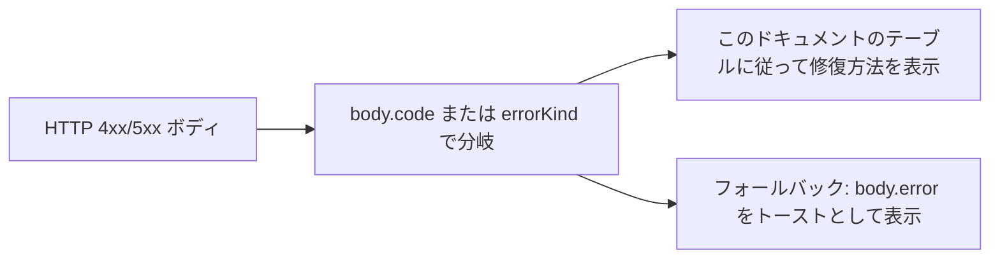
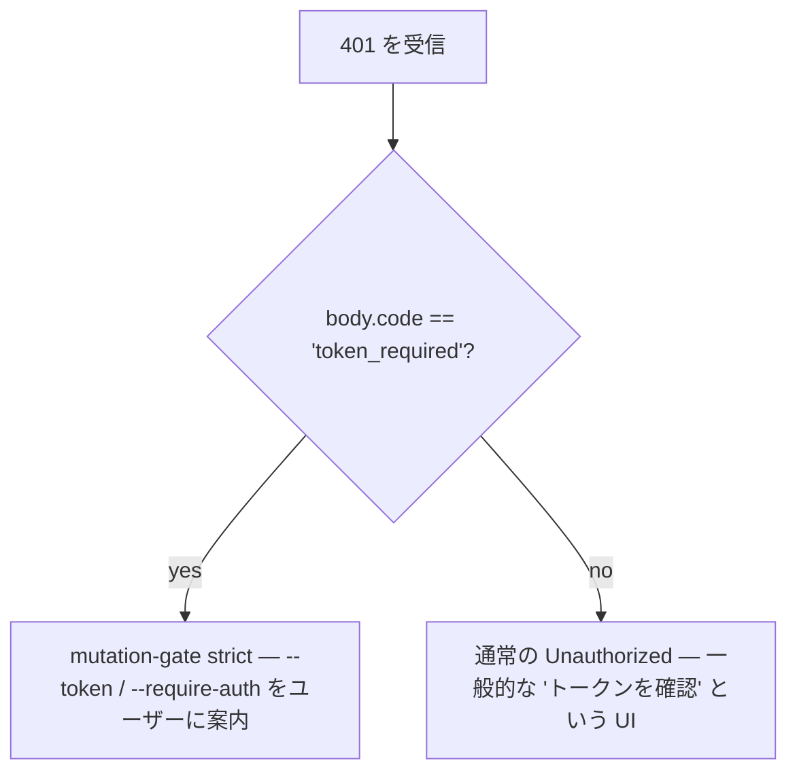

# エラータイポロジと修復策

## 概要

デーモンの障害モードは意図的に閉じたユニオン型として設計されているため、SDK コンシューマは網羅的に switch でき、ルートハンドラは一貫性のある HTTP レスポンスを整形できます。このドキュメントでは、3 つのレイヤーにわたるすべての型付きエラークラス / 種類をカタログ化します。

1. **`packages/cli/src/serve/`** — HTTP エッジでの境界エラー（認証、ワークスペースファイルシステム、デーモンホストの事前チェック）。
2. **`packages/acp-bridge/`** — デーモンと ACP 子プロセス間のブリッジ / 仲介エラー。
3. **`packages/sdk-typescript/src/daemon/`** — SDK 側のラッピングと構造化エラーフィールド。

ワイヤーレベルのエラー形状は [`../qwen-serve-protocol.md`](../qwen-serve-protocol.md) に記載されています。このドキュメントでは、原因と修復ガイダンスを追加します。

## ファイルシステム境界 (`packages/cli/src/serve/fs/errors.ts`)

`FsError` は `{ kind, message, status, cause? }` を保持します。`FsErrorKind` ユニオン（14 種類、デフォルト HTTP ステータス）:

| 種類                       | HTTP | 原因                                                                             | 修復策                                                                                                                   |
| -------------------------- | ---- | -------------------------------------------------------------------------------- | ------------------------------------------------------------------------------------------------------------------------ |
| `path_outside_workspace`   | 400  | 解決されたパスがバインドされたワークスペース外にある。                           | デーモンの `workspaceCwd` 内のパスを使用する。`/capabilities` を確認する。                                               |
| `symlink_escape`           | 400  | ターゲットがシンボリックリンクである。                                           | 解決されたパスを直接指定する。シンボリックリンクは設計上拒否される。                                                     |
| `path_not_found`           | 404  | `ENOENT`。                                                                       | ファイルが存在することを確認する。Linux では大文字小文字を区別するパスをチェックする。                                   |
| `binary_file`              | 422  | テキストルートでバイナリと判定されたコンテンツ。                                 | 生のバイトには `GET /file/bytes` を使用する。テキストルートはバイナリを拒否する。                                       |
| `file_too_large`           | 413  | `MAX_READ_BYTES`（256 KiB）または `MAX_WRITE_BYTES`（5 MiB）を超過した。         | バイト範囲読み取りを使用する。書き込みを分割する。                                                                       |
| `hash_mismatch`            | 409  | 楽観的同時実行制御の `expectedSha256` が失敗した。                               | ファイルを再読み取りし、新しいハッシュで再試行する。                                                                     |
| `file_already_exists`      | 409  | 既存のファイルに対して `mode: 'create'` を使用した。                             | `mode: 'overwrite'` を使用するか、新しいパスを選択する。                                                                 |
| `text_not_found`           | 422  | `POST /file/edit` の検索文字列がファイル内に存在しない。                         | 検索文字列を再確認する。空白文字やエンコーディングの不一致が一般的な原因。                                               |
| `ambiguous_text_match`     | 422  | 1 つ必要なところで複数マッチした。                                               | 検索文字列に周囲のコンテキストを追加して一意にする。                                                                     |
| `untrusted_workspace`      | 403  | 信頼されていないワークスペースへの書き込み試行。                                 | ワークスペースを信頼済みとしてマークする（`Config.isTrustedFolder()`）、または `runQwenServe` を使用して `createServeApp` の直接埋め込みを避ける。 |
| `permission_denied`        | 403  | OS レベルの `EACCES` / `EPERM`。                                                | ファイルシステム ACL を調整する。これは**セキュリティアラートではありません**。                                           |
| `io_error`                 | 503  | `ENOSPC` / `EIO` / `EBUSY` / `ETXTBSY` / `ENAMETOOLONG` / `EMFILE` / `ENFILE`。 | ホストレベルの運用上の修正（ディスクフル、FD 枯渇）。セキュリティではなく運用担当者に連絡。                               |
| `internal_error`           | 500  | errno 以外のエラーが境界に到達した。                                             | デーモンのバグを報告する。                                                                                               |
| `parse_error`              | 400 / 422 | リクエストボディのパースエラー（400）またはサービスレベルの不変条件違反（422）。 | リクエストボディを検証する。SDK のバージョンを確認する。                                                                 |

`io_error` と `permission_denied` の区別は意図的であり、監視パイプラインが `errorKind` でルーティングできるようにするためです。ENOSPC を `permission_denied` に統合すると、`df -h` の問題でセキュリティ担当者がページされることになります。

## ブリッジエラー (`packages/acp-bridge/src/bridgeErrors.ts`)

ブリッジ / 仲介によってスローされる型付きクラス。ほとんどはルートハンドラの switch を介して HTTP ステータスを保持します。

| クラス                               | HTTP | 原因                                                                                    | 修復策                                                                                                                                                                           |
| ------------------------------------ | ---- | --------------------------------------------------------------------------------------- | -------------------------------------------------------------------------------------------------------------------------------------------------------------------------------- |
| `SessionNotFoundError`               | 404  | sessionId が `byId` にない。                                                            | 再作成またはアタッチする。セッションが再利用された可能性がある。                                                                                                                 |
| `WorkspaceMismatchError`             | 400  | `POST /session` の `cwd` がデーモンの `boundWorkspace` と異なる。                        | `cwd` を省略する（バインドされた workspace を使用）か、`cwd` にバインドされたデーモンにルーティングする。                                                                         |
| `SessionLimitExceededError`          | 503  | `byId.size >= maxSessions`。                                                             | 古いセッションを閉じる。`--max-sessions` を増やす。                                                                                                                              |
| `InvalidClientIdError`               | 400  | `X-Qwen-Client-Id` が `[A-Za-z0-9._:-]{1,128}` の範囲外。                              | クライアント ID をサニタイズする。                                                                                                                                               |
| `InvalidSessionMetadataError`        | 400  | `displayName` が 256 文字を超える、または制御文字を含む。                                | トリム / サニタイズする。                                                                                                                                                        |
| `InvalidSessionScopeError`           | 400  | 未知の `sessionScope` 値。                                                               | `'single'` または `'thread'` を使用する。                                                                                                                                        |
| `RestoreInProgressError`             | 409  | 同時の `loadSession` / `resumeSession`。                                                 | 待機 + 再試行。                                                                                                                                                                  |
| `WorkspaceInitConflictError`         | 409  | 既存のファイルに対して `POST /workspace/init` を `force` なしで実行。                      | `force: true` を渡すか、別のパスを選択する。                                                                                                                                    |
| `WorkspaceInitPathEscapeError`       | 400  | init パスがワークスペース外に出る。                                                       | `workspaceCwd` 内のパスを使用する。                                                                                                                                              |
| `WorkspaceInitSymlinkError`          | 400  | init パスがシンボリックリンク。                                                           | 解決されたパスを指定する。                                                                                                                                                        |
| `WorkspaceInitRaceError`             | 409  | init の TOCTOU レース。                                                                  | 再試行。                                                                                                                                                                          |
| `McpServerNotFoundError`             | 404  | 未知のサーバーに対する再起動。                                                             | `/workspace/mcp` でサーバー名を確認する。                                                                                                                                        |
| `McpServerRestartFailedError`        | 502  | ACP 子プロセス内で再起動が失敗。                                                          | ACP 子プロセスのログを確認する。MCP サーバーの破損を示す可能性がある。                                                                                                           |
| `InvalidPermissionOptionError`       | 400  | ワイヤ投票が `optionId` 経由で `CANCEL_VOTE_SENTINEL` を注入しようとした。               | `optionId` の代わりに `{outcome: 'cancelled'}` で投票する。                                                                                                                      |
| `PermissionForbiddenError`           | 403  | ポリシーが投票者を拒否（`designated_mismatch` / `remote_not_allowed`）。                  | 発信元のクライアント ID（指定）を使用する、投票者を事前登録（合意）する、またはループバックから投票する（ローカル限定）。[`04-permission-mediation.md`](./04-permission-mediation.md) を参照。 |
| `CancelSentinelCollisionError`       | 500  | エージェントが `'__cancelled__'` を正当なオプションラベルとして公開した。                 | エージェントのバグ — オプションラベルをセンチネル以外のものに変更する。                                                                                                          |
| `PermissionPolicyNotImplementedError` | 500  | 要求されたポリシーがこのデーモンに組み込まれていない。                                   | デーモンを更新するか、`policy.permissionStrategy` を変更する。                                                                                                                   |
| `BridgeChannelClosedError`           | 503  | 呼び出し中に ACP 子プロセスのチャネルが閉じた。                                           | 再接続 / 再試行。原因は `session_died` を確認する。                                                                                                                               |
| `BridgeTimeoutError`                 | 504  | ブリッジレベルのウォールクロックを超過。                                                   | 再試行。根本的な遅延を調査する。                                                                                                                                                  |
| `MissingCliEntryError`               | 500  | `qwen` CLI エントリファイルが見つからない（`status.ts` で定義、`bridgeErrors.ts` ではない）。 | CLI インストールが完全であることを確認する。`packages/cli/index.ts` が存在するかチェックする。                                                                                   |

## 起動時設定エラー (`packages/cli/src/serve/run-qwen-serve.ts`)

| クラス                      | 条件                                                                                                                                                                                                                        | 修復策                                                                                                                                                                                            |
| -------------------------- | --------------------------------------------------------------------------------------------------------------------------------------------------------------------------------------------------------------------------- | ------------------------------------------------------------------------------------------------------------------------------------------------------------------------------------------------ |
| `InvalidPolicyConfigError` | `validatePolicyConfig()` がマージされた設定を拒否: 未知の `policy.permissionStrategy`（`SERVE_CAPABILITY_REGISTRY.permission_mediation.modes` に対して検証）または非正の整数 `policy.consensusQuorum`。起動が明示的に失敗する。 | `settings.json` の該当フィールドを修正する。このクラスは `instanceof` をサポートする。`runQwenServe` はこれを使用してポリシーの不一致と設定読み取り I/O 障害（デフォルト値にフォールバック）を区別する。 |

## デバイスフロー認証 (`packages/cli/src/serve/auth/device-flow.ts`)

| クラス                        | 条件                                                       | 注記                                                                                                                                                                                                                                                                                                                                                                                                 |
| ---------------------------- | ---------------------------------------------------------- | ---------------------------------------------------------------------------------------------------------------------------------------------------------------------------------------------------------------------------------------------------------------------------------------------------------------------------------------------------------------------------------------------------- |
| `UpstreamDeviceFlowError`    | ポーリング中に上流 IdP が構造化エラーを返した。            | `oauthError` は `sanitizeForStderr` でサニタイズされてから stderr や監査ヒントに挿入される（CVE-2021-42574 / Trojan Source 防御。 [`12-auth-security.md`](./12-auth-security.md) を参照）。                                                                                                                                                                                                             |
| `DeviceFlowPollTimeoutError` | プロバイダが応答する前にレジストリの競合タイマーが発火した。 | プロバイダコードはこの型を throw してはならない。テストのためにエクスポートされているが、レジストリは `pollTimedOut` を `instanceof` ではなくランタイムブランド `_isRegistryTimeout: boolean` でゲートする。`new DeviceFlowPollTimeoutError(ms)` をインポートして throw するプロバイダは、`_isRegistryTimeout` がデフォルトで `false` のため、汎用のプロバイダスロー監査パスをたどる。内部ファクトリ `makeRegistryPollTimeoutError(ms)` のみがブランドを設定する。 |

## デーモンホストエラー種別 (`packages/acp-bridge/src/status.ts`)

`SERVE_ERROR_KINDS` は、診断セルと構造化デーモンエラーで使用される閉じた列挙型:

| 種類                       | 意味                                                                      |
| -------------------------- | ------------------------------------------------------------------------ |
| `missing_binary`           | 必要なローカル実行可能ファイルまたは CLI エントリを解決できなかった。        |
| `blocked_egress`           | 送信ネットワークプローブが失敗した。                                        |
| `auth_env_error`           | 認証関連の環境変数、プロバイダ、または信頼ゲート設定が無効である。             |
| `init_timeout`             | デーモン側の初期化ステップがウォールクロックを超過した。                      |
| `protocol_error`           | ACP / HTTP プロトコルの不一致。                                              |
| `missing_file`             | 必要なローカルファイルが見つからない。                                       |
| `parse_error`              | ローカルファイルまたはリクエストのパースエラー。                               |
| `stat_failed`              | ローカルファイルシステムの stat が失敗した。                                 |
| `budget_exhausted`         | MCP 予算制限が探索またはサーバーエントリを拒否した。                          |
| `mcp_budget_would_exceed`  | MCP 再起動または変更が設定された予算を超えることになる。                       |
| `mcp_server_spawn_failed`  | MCP サーバーの起動または再起動が失敗した。                                    |
| `invalid_config`           | MCP またはデーモンの設定が無効である。                                       |
| `prompt_deadline_exceeded` | プロンプトのウォールクロック期限が切れた。                                    |
| `writer_idle_timeout`      | SSE ライターがアイドルタイムアウト前に正常な書き込みを一度も行わなかった。      |

これらは事前チェックセルの `errorKind` を通じて公開されるため、クライアント UI は生のスタックトレースではなく構造化された修復策を表示できる。

## 認証エラー形状

| ステータス | ボディ                                        | 条件                                                                                                                                                          |
| ---------- | --------------------------------------------- | ------------------------------------------------------------------------------------------------------------------------------------------------------------- |
| `401`      | `{ error: 'Unauthorized' }`                   | Bearer トークンがない / 間違っている / スキームがない。`missing header` / `wrong scheme` / `wrong token` で統一されており、プローブで区別できない。            |
| `401`      | `{ error: '...', code: 'token_required' }`    | トークンなしのループバックデーモンで、変更ゲートの厳格なルートにアクセス。SDK は「--token / --require-auth を設定」というヒントを表示する。                       |
| `403`      | `{ error: 'Request denied by CORS policy' }`  | `denyBrowserOriginCors` が `Origin` ヘッダーを含むリクエストを拒否した。                                                                                        |
| `403`      | `{ error: 'Invalid Host header' }`            | `hostAllowlist` が `Host` ヘッダーを拒否した（DNS リバインディング防御）。                                                                                      |

完全な認証モデルは [`12-auth-security.md`](./12-auth-security.md) を参照。

## 許可結果（ワイヤ vs 監査のオーバーロード）

`PermissionResolution` には 2 つの終端種類がある:

- `{kind: 'option', optionId}` — 投票が勝った。
- `{kind: 'cancelled', reason: 'timeout' | 'session_closed' | 'agent_cancelled'}` — リクエストがキャンセルされた。ワイヤ形状は単一（`{outcome: 'cancelled'}`）。監査ログは `decisionReason.type` で timeout / session_closed / voter-cancelled / agent-cancelled を区別する。このオーバーロードは、凍結された `permission.ts` 契約を壊さないように意図的に保持されている。

## SDK 側のエラーラッピング

`DaemonClient` は、HTTP エラーをパースされたボディをリジェクション値として持つ拒否された Promise として返す。未知のセッションに対して `404` にヒットするメソッドは `{error, sessionId}` で拒否する。SDK は現在それらを型付きクラスでラップしていない。呼び出し側は `instanceof Error` と `.message.includes(...)` のマッチングに依存せず、代わりにボディの `err.code` または `err.kind` で切り替えること。
`parseSseStream` は、16 MiB のバッファオーバーフローが発生した場合にイテレータを中断します（防御的な上限）。

## ワークフロー

### ユーザーにエラーを表示する

### 認証エラーのモードを区別する

## 依存関係

- すべてのエラークラスは各パッケージからエクスポートされています。SDK 利用者は、同じ Node プロセス内で実行されている場合、`bridgeErrors.ts` の型に対して `instanceof` を使用できます。ワイヤー越しでは、`body.code` / `body.kind` / `body.errorKind` でルーティングします。

## 注意点および既知の制限

- **`io_error` と `permission_denied`** は意図的に区別されています。混同しないでください。
- **`PermissionForbiddenError` の理由 (`designated_mismatch` / `remote_not_allowed`) はオーバーロードされています**。`designated` ポリシーと `consensus` ポリシーの両方にまたがって使用されます。監査ログはこれらを正確に区別しますが、ワイヤー形式では区別されません。
- **`CancelSentinelCollisionError` はエージェント側のバグを示します**。セキュリティイベントではありません。ブリッジは、センチネルが実際のオプションと一致することを黙って許可するのではなく、リクエストを拒否します。
- **SDK 側の型付きエラーはまだ進化中です。** 呼び出し側は、JS クラスの同一性をワイヤー越しに信頼するのではなく、ボディフィールドでルーティングする必要があります。
- **`internal_error` は常に調査すべきです。** これは、errno 以外のパス用に予約された種類を使用して `FsError` コンストラクタが呼び出された（プログラマのエラー）ことを示します。レスポンスボディの `cause` フィールドに元の例外が含まれている可能性があります。

## 参照

- `packages/cli/src/serve/fs/errors.ts` (`FsErrorKind`, `FsErrorStatus`)
- `packages/acp-bridge/src/bridgeErrors.ts` (すべての型付きクラス)
- `packages/acp-bridge/src/status.ts` (`SERVE_ERROR_KINDS`, `ServeErrorKind`)
- `packages/cli/src/serve/auth.ts` (認証ボディ)
- ワイヤーリファレンス: [`../qwen-serve-protocol.md`](../qwen-serve-protocol.md).