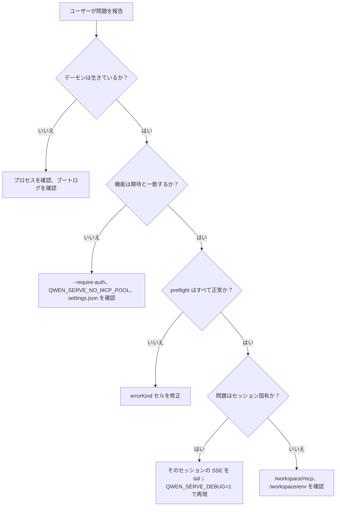

# 可観測性とデバッグ

## 概要

`qwen serve` は現在、**OpenTelemetry スパン計装**、**構造化ファイルログ** (`DaemonLogger`)、**リクエストごとのアクセスログ**、デバッグ用 stderr ログ、構造化された preflight セル、およびインメモリのパーミッション監査リングを提供しています。このページは、現在の可観測性の概要と、トリアージ時に把握すべきギャップに関する実践的なガイドです。

## 現在の機能

| 表面                                         | 場所                                            | 目的                                                                                                                                                                                                                                                                                           |
| ------------------------------------------- | ---------------------------------------------- | --------------------------------------------------------------------------------------------------------------------------------------------------------------------------------------------------------------------------------------------------------------------------------------------- |
| `QWEN_SERVE_DEBUG` stderr ログ              | `bridge.ts` および呼び出し箇所                 | 環境変数が `1` / `true` / `on` / `yes` (大文字小文字を区別しない) の場合、`qwen serve debug: ...` 行を stderr に出力します。                                                                                                                                                                      |
| OpenTelemetry スパン計装                     | `server.ts` `daemonTelemetryMiddleware`        | 各 HTTP リクエストは `withDaemonRequestSpan` でラップされます。属性にはルート、sessionId、clientId、ステータスコードが含まれます。パーミッションルートには専用のスパンがあります。プロンプトのライフサイクルはエンドツーエンドでトレースされます。設定は `settings.json` の `telemetry` にあります。 |
| `DaemonLogger` 構造化ファイルログ           | `serve/daemon-logger.ts`                       | 構造化された JSON ライクなログ行がファイルに書き込まれます。起動時に `daemon log -> <path>` と出力されます。`info` / `warn` / `error` レベルをサポートし、`route`、`sessionId`、`clientId`、`childPid`、`channelId` などの構造化フィールドを含みます。                                          |
| リクエストごとのアクセスログミドルウェア     | `server.ts`、`bearerAuth` の前に登録           | 各リクエスト後に `method`、`path`、`status`、`durationMs`、`sessionId`、`clientId` を記録します。`GET /health` と heartbeat はスキップします。4xx 以上は `warn`、成功は `info` を使用します。                                                                                                |
| `/health`                                   | `server.ts` ルート                              | 生存確認プローブ。`?deep=1` で拡張詳細を返します。                                                                                                                                                                                                                                         |
| `/capabilities`                             | `server.ts` ルート                              | プレフライト機能のディスカバリー。詳細は [`11-capabilities-versioning.md`](./11-capabilities-versioning.md) を参照してください。                                                                                                                                                             |
| `/workspace/preflight`                      | ルート -> `DaemonStatusProvider`                | 構造化された準備状況セル: Node バージョン、CLI エントリ、ripgrep、git、npm、さらに子プロセスが生きている場合の ACP レベルのセル。                                                                                                                                                           |
| `/workspace/env`                            | ルート -> `DaemonStatusProvider`                | デーモンプロセスの環境変数スナップショット。秘密の環境変数は存在の有無のみを報告し、プロキシ URL の認証情報は除去されます。                                                                                                                                                              |
| `/workspace/mcp`                            | ルート -> bridge extMethod                      | プール、予算、拒否のスナップショット。                                                                                                                                                                                                                                                       |
| `/workspace/skills`、`/workspace/providers` | ルート                                          | ACP 側のライブスナップショット。セッションが存在しない場合は空のアイドルデータを返します。                                                                                                                                                                                                |
| セッションごとの SSE                        | `GET /session/:id/events`                      | リアルタイムイベントストリーム。                                                                                                                                                                                                                                                             |
| `/demo` デバッグコンソール                   | `GET /demo` (`packages/cli/src/serve/demo.ts`) | ブラウザからアクセス可能なシングルページコンソール: チャット、イベントログ、ワークスペースインスペクター、パーミッション UI。ループバックでは、`http://127.0.0.1:4170/demo` が SDK コードを書かずにエンドツーエンド検証する最も高速なパスです。登録ルールは [`02-serve-runtime.md`](./02-serve-runtime.md) にあります。 |
| `PermissionAuditRing`                       | `permission-audit.ts`                          | 512 件のパーミッション決定を保持するインメモリ FIFO。                                                                                                                                                                                                                                       |
| Mediator `decisionReason` 監査              | `permissionMediator.ts`                        | パーミッションリクエストがなぜそのように解決されたかを説明する内部構造化レコード。                                                                                                                                                                                                           |

## 現在存在しないもの

- **Prometheus / メトリクスエンドポイントはありません。** `process_cpu_seconds_total`、`http_requests_total`、`event_bus_queue_depth` などは存在しません。
- **`PermissionAuditRing` 向けの外部監査シンクはありません。** リングは存在しますが、SIEM や外部ストレージへのファンアウトフックは配線されていません。

## デバッグレシピ

### 1. デーモンは生きていますか？

```bash
curl -s http://127.0.0.1:4170/health
# {"status":"ok"}

curl -s 'http://127.0.0.1:4170/health?deep=1' | jq
# {"status":"ok","workspaceCwd":"/path","sessions":N,...}
```

ループバックで 401 が返る場合は、`--require-auth` が有効になっている可能性があります。起動時に `QWEN_SERVE_DEBUG=1` を使用すると、ブートログを確認できます。

### 2. どの機能がアドバタイズされていますか？

```bash
curl -s http://127.0.0.1:4170/capabilities | jq
```

`mcp_workspace_pool`（F2 プールがオンか）、`require_auth`（強化されているか）、`permission_mediation.modes`（サポートされているポリシー）、`policy.permission`（アクティブなポリシー）を確認してください。

### 3. デーモンホストの準備状態は正常ですか？

```bash
curl -s http://127.0.0.1:4170/workspace/preflight | jq
```

`status: 'not_started'` のセルは ACP レベルのもので、最初のセッションがアタッチした後にのみ設定されます。`status: 'fail'` のセルにはクローズドな `errorKind` が含まれており、構造化された修正情報は [`18-error-taxonomy.md`](./18-error-taxonomy.md) にあります。

### 4. セッション SSE ストリームを tail する

```bash
curl -N -H 'Accept: text/event-stream' \
     -H 'Authorization: Bearer XYZ' \
     -H 'X-Qwen-Client-Id: debug-tail' \
     -H 'Last-Event-ID: 0' \
     'http://127.0.0.1:4170/session/<sid>/events'
```

`-N` は curl の出力バッファリングを無効にします。`Last-Event-ID: 0` は、`id > 0` のリングイベントのリプレイを要求します。

### 5. なぜパーミッションリクエストがこのように解決されたのか？

`PermissionAuditRing` はインメモリであり、現在 HTTP サーフェスはありません。`QWEN_SERVE_DEBUG=1` を有効にして再現してください。メディエーターは各投票と決定について、`decisionReason.type` を含む構造化行を出力します。今後の PR でリングを HTTP 経由で公開する可能性があります。

### 6. どのコンシューマーが遅いですか？

`slow_client_warning` は、キューが 75% に達したときにオーバーフローエピソードごとに 1 回発火します。セッション SSE ストリームを購読し、合成フレームを探してください。ペイロードには `queueSize`、`maxQueued`、`lastEventId` が含まれます。警告が繰り返される場合は、スタックしたコンシューマー（通常はブロックされた SDK の `for await` ループ）を示しています。

### 7. MCP サーバーが拒否されたのはなぜですか？

`/workspace/mcp` のセルごとの `disabledReason: 'budget'`、`refusedServerNames` リスト、`mcp_child_refused_batch` SSE イベントを組み合わせます。これらを `/capabilities` の `mcp_guardrails.modes`（`enforce` がアクティブか）および `getReservedSlots()` で確認できる現在の `--mcp-client-budget` 状態と比較してください。

### 8. デーモンがシャットダウンしない

最初のシグナルはグレースフルシャットダウンをトリガーします（[`02-serve-runtime.md`](./02-serve-runtime.md) を参照）。10 秒経ってもハングする場合は、以下を確認してください：

- ACP 子プロセスがグレースフルクローズに応答しなかった。
- 長い SSE 接続により、`SHUTDOWN_FORCE_CLOSE_MS`（5 秒）を超えて HTTP `server.close()` が開いたままになっている。

**2 回目の** SIGTERM/SIGINT は意図的に `bridge.killAllSync()` + `process.exit(1)` をトリガーします。

## フロー

### 典型的なトリアージフロー



## 状態とライフサイクル

- `QWEN_SERVE_DEBUG` は、`debug-mode.ts` の `isServeDebugMode()` を通じてチェックのたびに読み取られます。切り替えに再起動は必要ありません。ブートログは、起動時に環境変数が設定されていない限り利用できません。
- `PermissionAuditRing` は最大 512 FIFO エントリに制限されており、古いレコードは静かに破棄されます。
- `DaemonStatusProvider` はリクエストごとにセルを再構築し、キャッシュしません。不要な高頻度ポーリングは避けてください。

## 依存関係

- デバッグ stderr 用の `process.stderr.write`
- 構造化ファイルログ用の `DaemonLogger`
- `initializeTelemetry` および `createDaemonBridgeTelemetry` を通じた OpenTelemetry SDK
- 環境変数とシグナル検査用の `node:process`

## 設定

| ノブ                            | 効果                                                                                       |
| ------------------------------- | ------------------------------------------------------------------------------------------ |
| `QWEN_SERVE_DEBUG`              | 詳細な stderr ログを有効にします。[`17-configuration.md`](./17-configuration.md) を参照。 |
| `settings.json` `telemetry`     | OTel の動作を制御します: `enabled`、`otlpEndpoint`、`otlpProtocol`、およびシグナルごとのエンドポイント。 |
| `DaemonLogger` ログパス         | 起動時に生成され、`daemon log -> <path>` として stderr に出力されます。                   |
| `PermissionAuditRing` サイズ    | 現在はハードコードで 512。                                                                 |
| `slow_client_warning` しきい値 | `0.75` / `0.375`、`eventBus.ts` でハードコード。                                          |

## 注意点と既知の制限

- **DaemonLogger ファイルログは構造化されており**、`route`、`sessionId`、`clientId` でフィルタリングできます。`QWEN_SERVE_DEBUG` stderr ログは構造化されていないテキストのままです。
- **OpenTelemetry スパンにはリクエストごとの相関情報が含まれます。** 各 HTTP リクエストスパンには、トレースバックエンドで結合できるルート、sessionId、clientId 属性が含まれています。
- **ACP レベルの `/workspace/preflight` セルには、アクティブなセッションが必要です。** アイドル状態のデーモンでは、認証 / MCP / skills / providers が `status: 'not_started'` を表示することがありますが、これは想定内です。
- **`/workspace/env` は秘密の存在の有無のみを報告し、値は報告しません。** 秘密の存在自体が機密となる場合は、レスポンスを公開しないでください。
- **監査リングはプロセスローカルであり、** デーモン再起動時に履歴は失われます。
- **ここにロードテストのレシピは記載されていません。** パフォーマンスベースラインは `test/perf-daemon-baseline` ブランチにあります。

## 参考資料

- `packages/cli/src/serve/daemon-status-provider.ts`
- `packages/cli/src/serve/daemon-logger.ts` (`DaemonLogger`、`buildDaemonLogLine`)
- `packages/cli/src/serve/debug-mode.ts` (`isServeDebugMode`)
- `packages/acp-bridge/src/permissionMediator.ts` (`PermissionDecisionReason`)
- `packages/cli/src/serve/server.ts` (`daemonTelemetryMiddleware`、アクセスログミドルウェア)
- 設定: [`17-configuration.md`](./17-configuration.md)
- エラー分類: [`18-error-taxonomy.md`](./18-error-taxonomy.md)
- ユーザー操作ガイド: [`../../users/qwen-serve.md`](../../users/qwen-serve.md)