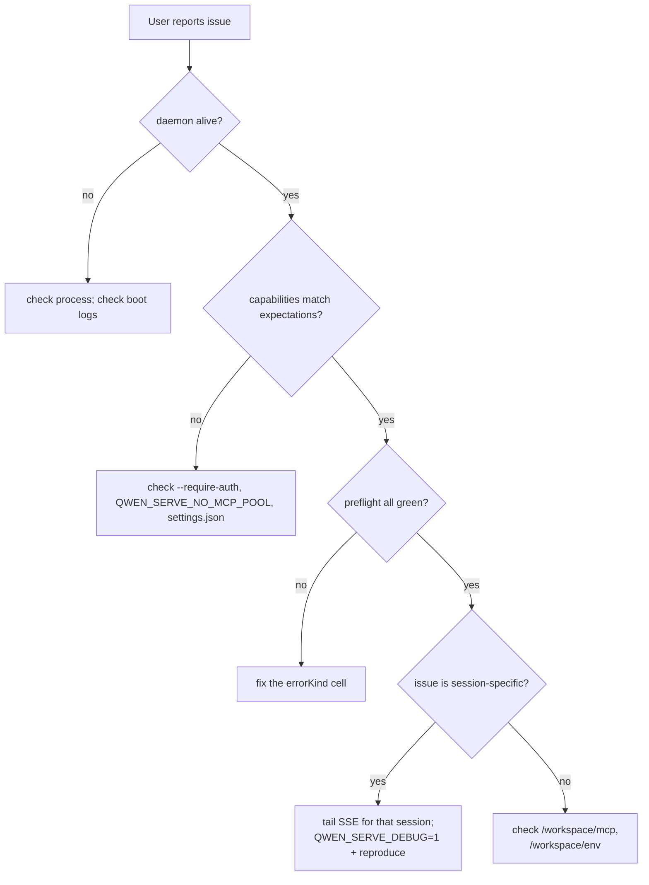

# オブザーバビリティとデバッグ

## 概要

`qwen serve` は現在、**OpenTelemetry スパン計装**、**構造化ファイルログ**（`DaemonLogger`）、**リクエストごとのアクセスログ**、デバッグ用 stderr ログ、構造化プリフライトセル、およびインメモリのパーミッション監査リングを備えています。このページは、現在のオブザーバビリティの全体像と、トリアージ時に注意すべきギャップについての実践的なガイドです。

## 現在利用できる機能

| サーフェス                                      | 場所                                           | 目的                                                                                                                                                                                                                                                                                   |
| ----------------------------------------------- | ---------------------------------------------- | -------------------------------------------------------------------------------------------------------------------------------------------------------------------------------------------------------------------------------------------------------------------------------------- |
| `QWEN_SERVE_DEBUG` stderr ログ                  | `bridge.ts` および各呼び出し箇所               | 環境変数の値が `1` / `true` / `on` / `yes`（大文字小文字不問）の場合、`qwen serve debug: ...` の行を stderr に出力します。                                                                                                                                                              |
| OpenTelemetry スパン計装                        | `server.ts` `daemonTelemetryMiddleware`        | 各 HTTP リクエストは `withDaemonRequestSpan` でラップされます。属性にはルート、sessionId、clientId、ステータスコードが含まれます。パーミッションルートには専用のスパンがあります。プロンプトのライフサイクルはエンドツーエンドでトレースされます。設定は `settings.json` の `telemetry` にあります。 |
| `DaemonLogger` 構造化ファイルログ               | `serve/daemon-logger.ts`                       | 構造化された JSON 形式のログ行がファイルに書き込まれます。起動時に `daemon log -> <path>` が出力されます。`info` / `warn` / `error` レベルをサポートし、`route`、`sessionId`、`clientId`、`childPid`、`channelId` などの構造化フィールドを持ちます。                                    |
| リクエストごとのアクセスログミドルウェア        | `server.ts`（`bearerAuth` の前に登録）         | 各リクエスト後に `method`、`path`、`status`、`durationMs`、`sessionId`、`clientId` をログに記録します。`GET /health` とハートビートはスキップします。4xx 以上は `warn`、成功時は `info` を使用します。                                                                                   |
| `/health`                                       | `server.ts` ルート                             | 死活確認プローブ。`?deep=1` で拡張詳細を返します。                                                                                                                                                                                                                                      |
| `/capabilities`                                 | `server.ts` ルート                             | プリフライトによる機能検出。[`11-capabilities-versioning.md`](./11-capabilities-versioning.md) を参照してください。                                                                                                                                                                      |
| `/workspace/preflight`                          | ルート -> `DaemonStatusProvider`               | 構造化された準備状態セル: Node バージョン、CLI エントリ、ripgrep、git、npm、および子プロセスが起動した後の ACP レベルのセル。                                                                                                                                                            |
| `/workspace/env`                                | ルート -> `DaemonStatusProvider`               | デーモンプロセスの環境変数スナップショット。シークレット環境変数は存在の有無のみ報告されます。プロキシ URL のクレデンシャルは除去されます。                                                                                                                                              |
| `/workspace/mcp`                                | ルート -> bridge の extMethod                  | プール、バジェット、および拒否状態のスナップショット。                                                                                                                                                                                                                                  |
| `/workspace/skills`、`/workspace/providers`     | ルート                                         | ACP 側のライブスナップショット。セッションが存在しない場合は空のアイドルデータを返します。                                                                                                                                                                                               |
| セッションごとの SSE                            | `GET /session/:id/events`                      | リアルタイムのイベントストリーム。                                                                                                                                                                                                                                                      |
| `/demo` デバッグコンソール                      | `GET /demo`（`packages/cli/src/serve/demo.ts`）| ブラウザからアクセス可能なシングルページコンソール: チャット、イベントログ、ワークスペースインスペクター、パーミッション UX。ループバックでは `http://127.0.0.1:4170/demo` が SDK コードを書かずにエンドツーエンドを検証する最速の手段です。登録ルールは [`02-serve-runtime.md`](./02-serve-runtime.md) にあります。 |
| `PermissionAuditRing`                           | `permission-audit.ts`                          | 512 件のパーミッション決定をインメモリ FIFO で保持します。                                                                                                                                                                                                                              |
| Mediator の `decisionReason` 監査               | `permissionMediator.ts`                        | パーミッションリクエストが解決された理由を説明する内部の構造化レコード。                                                                                                                                                                                                                |

## 現在存在しない機能

- **Prometheus / メトリクスエンドポイントはありません。** `process_cpu_seconds_total`、`http_requests_total`、`event_bus_queue_depth` などは存在しません。
- **`PermissionAuditRing` 向けの外部監査シンクはありません。** リングは存在しますが、SIEM や外部ストレージへのファンアウトフックは実装されていません。

## デバッグレシピ

### 1. デーモンは起動しているか？

```bash
curl -s http://127.0.0.1:4170/health
# {"status":"ok"}

curl -s 'http://127.0.0.1:4170/health?deep=1' | jq
# {"status":"ok","workspaceCwd":"/path","sessions":N,...}
```

ループバックで 401 が返る場合は `--require-auth` が有効になっている可能性があります。起動時のログを確認するには、起動時に `QWEN_SERVE_DEBUG=1` を設定してください。

### 2. どの機能がアドバタイズされているか？

```bash
curl -s http://127.0.0.1:4170/capabilities | jq
```

`mcp_workspace_pool`（F2 プールが有効か）、`require_auth`（強化されているか）、`permission_mediation.modes`（サポートされているポリシー）、および `policy.permission`（有効なポリシー）を確認してください。

### 3. デーモンホストの準備状態は正常か？

```bash
curl -s http://127.0.0.1:4170/workspace/preflight | jq
```

`status: 'not_started'` のセルは ACP レベルのものであり、最初のセッションがアタッチされた後にのみ表示されます。`status: 'fail'` のセルにはクローズドな `errorKind` が含まれます。[`18-error-taxonomy.md`](./18-error-taxonomy.md) から構造化された修復手順を参照してください。

### 4. セッションの SSE ストリームをテールする

```bash
curl -N -H 'Accept: text/event-stream' \
     -H 'Authorization: Bearer XYZ' \
     -H 'X-Qwen-Client-Id: debug-tail' \
     -H 'Last-Event-ID: 0' \
     'http://127.0.0.1:4170/session/<sid>/events'
```

`-N` は curl の出力バッファリングを無効にします。`Last-Event-ID: 0` は `id > 0` のリングイベントの再生をリクエストします。

### 5. パーミッションリクエストがこのように解決された理由は？

`PermissionAuditRing` はインメモリであり、現時点では HTTP エンドポイントがありません。`QWEN_SERVE_DEBUG=1` を有効にして再現してください。メディエーターは各投票と決定に対して構造化された行を出力し、`decisionReason.type` も含まれます。後続の PR でリングを HTTP 経由で公開できます。

### 6. どのコンシューマーが遅いか？

キューが 75% に達したオーバーフローエピソードごとに `slow_client_warning` が一度発火します。セッションの SSE ストリームをサブスクライブして合成フレームを探してください。ペイロードには `queueSize`、`maxQueued`、`lastEventId` が含まれます。繰り返し警告が出る場合はスタックしたコンシューマー（通常はブロックされた SDK の `for await` ループ）を示しています。

### 7. MCP サーバーが拒否された理由は？

`/workspace/mcp` のセルごとの `disabledReason: 'budget'`、`refusedServerNames` リスト、および `mcp_child_refused_batch` SSE イベントを組み合わせて確認してください。それらを `/capabilities` の `mcp_guardrails.modes`（`enforce` が有効か）および `getReservedSlots()` で確認できるライブの `--mcp-client-budget` 状態と比較してください。

### 8. デーモンがシャットダウンしない

最初のシグナルはグレースフルシャットダウンをトリガーします（[`02-serve-runtime.md`](./02-serve-runtime.md) を参照）。10 秒を超えてハングする場合は以下を確認してください:

- ACP 子プロセスがグレースフルクローズに応答しなかった。
- 長い SSE 接続が HTTP `server.close()` を `SHUTDOWN_FORCE_CLOSE_MS`（5 秒）を超えて開き続けた。

**2 回目**の SIGTERM/SIGINT は意図的に `bridge.killAllSync()` + `process.exit(1)` をトリガーします。

## フロー

### 典型的なトリアージフロー



## 状態とライフサイクル

- `QWEN_SERVE_DEBUG` は `debug-mode.ts` の `isServeDebugMode()` を通じてチェックのたびに読み取られます。変更に再起動は不要です。ただし、起動時に設定されていない場合、起動ログは利用できません。
- `PermissionAuditRing` は 512 件の FIFO エントリに制限されており、古いレコードはサイレントに破棄されます。
- `DaemonStatusProvider` はリクエストごとにセルを再構築しキャッシュしません。不必要な高頻度ポーリングは避けてください。

## 依存関係

- デバッグ用 stderr には `process.stderr.write` を使用。
- 構造化ファイルログには `DaemonLogger` を使用。
- `initializeTelemetry` および `createDaemonBridgeTelemetry` を通じた OpenTelemetry SDK。
- 環境変数とシグナル検査には `node:process` を使用。

## 設定

| 設定項目                        | 効果                                                                                         |
| ------------------------------- | -------------------------------------------------------------------------------------------- |
| `QWEN_SERVE_DEBUG`              | 詳細な stderr ログを有効にします。[`17-configuration.md`](./17-configuration.md) を参照。    |
| `settings.json` `telemetry`     | OTel の動作を制御: `enabled`、`otlpEndpoint`、`otlpProtocol`、およびシグナルごとのエンドポイント。 |
| `DaemonLogger` ログパス         | 起動時に生成され、`daemon log -> <path>` として stderr に出力されます。                       |
| `PermissionAuditRing` サイズ    | 現在 512 にハードコードされています。                                                         |
| `slow_client_warning` しきい値  | `0.75` / `0.375`、`eventBus.ts` にハードコードされています。                                 |

## 注意事項と既知の制限

- **DaemonLogger のファイルログは構造化されており**、`route`、`sessionId`、`clientId` でフィルタリングできます。`QWEN_SERVE_DEBUG` の stderr ログは非構造化テキストのままです。
- **OpenTelemetry スパンにはリクエストごとの相関情報が含まれます。** 各 HTTP リクエストのスパンはルート、sessionId、clientId の属性を持ち、トレーシングバックエンドで結合できます。
- **ACP レベルの `/workspace/preflight` セルはライブセッションが必要です。** アイドル状態のデーモンでは、auth / MCP / skills / providers が `status: 'not_started'` を示すことがありますが、これは想定された動作です。
- **`/workspace/env` はシークレットの存在のみ報告し、値は報告しません。** シークレットの存在自体が機密情報となる環境ではレスポンスを公開しないでください。
- **監査リングはプロセスローカルであり**、デーモン再起動時に履歴は失われます。
- **負荷テストのレシピはここに記載されていません。** パフォーマンスベースラインは `test/perf-daemon-baseline` ブランチにあります。

## 参照

- `packages/cli/src/serve/daemon-status-provider.ts`
- `packages/cli/src/serve/daemon-logger.ts`（`DaemonLogger`、`buildDaemonLogLine`）
- `packages/cli/src/serve/debug-mode.ts`（`isServeDebugMode`）
- `packages/acp-bridge/src/permissionMediator.ts`（`PermissionDecisionReason`）
- `packages/cli/src/serve/server.ts`（`daemonTelemetryMiddleware`、アクセスログミドルウェア）
- 設定: [`17-configuration.md`](./17-configuration.md)
- エラー分類: [`18-error-taxonomy.md`](./18-error-taxonomy.md)
- ユーザー操作ガイド: [`../../users/qwen-serve.md`](../../users/qwen-serve.md)
