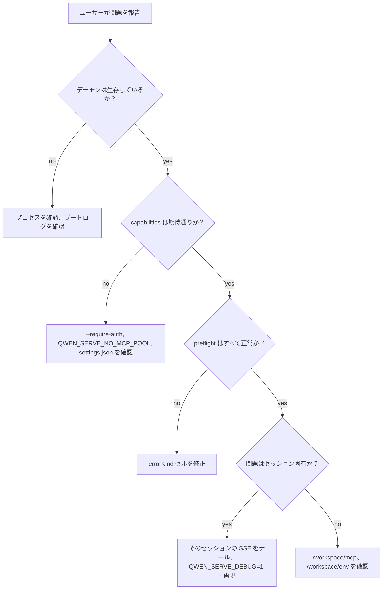

# 可観測性とデバッグ

## 概要

`qwen serve` には現在、**OpenTelemetry スパン計装**、**構造化ファイルログ**（`DaemonLogger`）、**リクエストごとのアクセスログ**、デバッグ用の標準エラーログ、構造化されたプリフライトセル、およびインメモリ権限監査リングが搭載されています。このページは、現在の可観測性機能と、トリアージ時に留意すべきギャップに関する実践的なガイドです。

## 現在利用可能な機能

| 対象                                     | 実装箇所                                       | 目的                                                                                                                                                                                                                                                                                   |
| ------------------------------------------- | ---------------------------------------------- | ----------------------------------------------------------------------------------------------------------------------------------------------------------------------------------------------------------------------------------------------------------------------------------------- |
| `QWEN_SERVE_DEBUG` 標準エラーログ              | `bridge.ts` および呼び出し元                     | 環境変数に `1` / `true` / `on` / `yes`（大文字小文字を区別しない）を指定すると、`qwen serve debug: ...` の行が標準エラー出力に出力されます。                                                                                                                                                                                  |
| OpenTelemetry スパン計装          | `server.ts` `daemonTelemetryMiddleware`        | 各 HTTP リクエストは `withDaemonRequestSpan` でラップされ、属性には route、sessionId、clientId、およびステータスコードが含まれます。権限関連ルートには専用スパンがあります。プロンプトのライフサイクルはエンドツーエンドでトレースされます。設定は `settings.json` の `telemetry` に存在します。                               |
| OpenTelemetry デーモンパフォーマンスメトリクス           | `telemetry/*event-loop-lag*`, `daemon-metrics` | デーモンおよび ACP 子プロセスのイベントループラグゲージと、デーモン-子プロセス間パイプメッセージのバイト数ヒストグラム。                                                                                                                                                                                 |
| `DaemonLogger` 構造化ファイルログ         | `serve/daemon-logger.ts`                       | 構造化された JSON 形式のログ行がファイルに書き込まれます。起動時に `daemon log -> <path>` が出力されます。`info` / `warn` / `error` レベルをサポートし、`route`、`sessionId`、`clientId`、`childPid`、`channelId` などの構造化フィールドを含みます。                                                        |
| リクエストごとのアクセスログミドルウェア           | `server.ts`、`bearerAuth` より前に登録    | 各リクエスト後に `method`、`path`、`status`、`durationMs`、`sessionId`、`clientId` をログに記録します。`GET /health` とハートビートはスキップされます。4xx 以上は `warn`、成功時は `info` を使用します。                                                                                                                  |
| `/health`                                   | `server.ts` ルート                              | 生存プローブ。`?deep=1` を指定すると拡張詳細情報を返します。                                                                                                                                                                                                                                       |
| `/capabilities`                             | `server.ts` ルート                              | プリフライト機能の検出。[`11-capabilities-versioning.md`](./11-capabilities-versioning.md) を参照してください。                                                                                                                                                                                      |
| `/workspace/preflight`                      | ルート -> `DaemonStatusProvider`                | 構造化された準備状態セル: Node バージョン、CLI エントリ、ripgrep、git、npm。子プロセスが起動すると ACP レベルのセルも追加されます。                                                                                                                                                                       |
| `/workspace/env`                            | ルート -> `DaemonStatusProvider`                | デーモンプロセスの環境変数スナップショット。シークレット環境変数は存在のみを報告し、プロキシ URL の認証情報は削除されます。                                                                                                                                                                                    |
| `/workspace/mcp`                            | ルート -> bridge extMethod                      | プール、予算、拒否のスナップショット。                                                                                                                                                                                                                                                       |
| `/workspace/skills`, `/workspace/providers` | ルート                                         | ACP 側のライブスナップショット。セッションが存在しない場合は空のアイドルデータを返します。                                                                                                                                                                                                                   |
| セッションごとの SSE                             | `GET /session/:id/events`                      | リアルタイムイベントストリーム。                                                                                                                                                                                                                                                                   |
| `/demo` デバッグコンソール                       | `GET /demo` (`packages/cli/src/serve/demo.ts`) | ブラウザからアクセス可能なシングルページコンソール: チャット、イベントログ、ワークスペースインスペクター、権限 UX。ループバックでは、`http://127.0.0.1:4170/demo` が SDK コードを書かずにエンドツーエンドの検証を最も迅速に行うパスです。登録ルールは [`02-serve-runtime.md`](./02-serve-runtime.md) にあります。 |
| `PermissionAuditRing`                       | `permission-audit.ts`                          | 512 件の権限決定を保持するインメモリ FIFO。                                                                                                                                                                                                                                               |
| メディエーター `decisionReason` 監査             | `permissionMediator.ts`                        | 権限リクエストがどのように解決されたかを説明する内部構造化レコード。                                                                                                                                                                                                   |

## 現在未実装の機能

- **Prometheus / メトリクスエンドポイントはありません。** OTel メトリクスはエクスポート可能ですが、デーモンは Prometheus スクレイピングエンドポイントを公開していません。
- **`PermissionAuditRing` の外部監査シンクはありません。** リング自体は存在しますが、SIEM や外部ストレージへのファンアウトフックは接続されていません。

## デバッグレシピ

### 1. デーモンは生存しているか？

```bash
curl -s http://127.0.0.1:4170/health
# {"status":"ok"}

curl -s 'http://127.0.0.1:4170/health?deep=1' | jq
# {"status":"ok","workspaceCwd":"/path","sessions":N,...}
```

ループバックで 401 が返る場合、`--require-auth` が有効になっている可能性が高いです。起動時に `QWEN_SERVE_DEBUG=1` を使用してブートログを確認してください。

### 2. どの機能が公開されているか？

```bash
curl -s http://127.0.0.1:4170/capabilities | jq
```

`mcp_workspace_pool`（F2 プールがオンか？）、`require_auth`（強化されているか？）、`permission_mediation.modes`（サポートされているポリシー）、および `policy.permission`（アクティブなポリシー）を確認します。

### 3. デーモンホストの準備状態は正常か？

```bash
curl -s http://127.0.0.1:4170/workspace/preflight | jq
```

`status: 'not_started'` のセルは ACP レベルであり、最初のセッションがアタッチされた後にのみ入力されます。`status: 'fail'` のセルにはクローズされた `errorKind` が含まれます。[`18-error-taxonomy.md`](./18-error-taxonomy.md) から構造化された修復手順を確認してください。

### 4. セッション SSE ストリームをテールする

```bash
curl -N -H 'Accept: text/event-stream' \
     -H 'Authorization: Bearer XYZ' \
     -H 'X-Qwen-Client-Id: debug-tail' \
     -H 'Last-Event-ID: 0' \
     'http://127.0.0.1:4170/session/<sid>/events'
```

`-N` は curl の出力バッファリングを無効にします。`Last-Event-ID: 0` は、`id > 0` のリングイベントのリプレイを要求します。

### 5. 権限リクエストはなぜこのように解決されたか？

`PermissionAuditRing` はインメモリであり、現在 HTTP インターフェースを持っていません。`QWEN_SERVE_DEBUG=1` を有効にして再現してください。メディエーターは、`decisionReason.type` を含む各投票と決定について構造化された行を出力します。今後の PR でリングを HTTP 経由で公開する予定です。

### 6. どのコンシューマーが遅いか？

`slow_client_warning` は、キューが 75% に達した際のオーバーフローエピソードごとに 1 回発生します。セッション SSE ストリームを購読し、合成フレームを探します。ペイロードには `queueSize`、`maxQueued`、`lastEventId` が含まれます。繰り返し警告が発生する場合は、スタックしたコンシューマー、通常はブロックされた SDK の `for await` ループが原因です。

### 7. MCP サーバーはなぜ拒否されたか？

`/workspace/mcp` のセルごとの `disabledReason: 'budget'`、`refusedServerNames` リスト、および `mcp_child_refused_batch` SSE イベントを組み合わせます。これらを `/capabilities` の `mcp_guardrails.modes`（`enforce` がアクティブか？）と、`getReservedSlots()` 経由で確認できるライブの `--mcp-client-budget` 状態と比較します。

### 8. デーモンがシャットダウンしない

最初のシグナルでグレースフルシャットダウンがトリガーされます（[`02-serve-runtime.md`](./02-serve-runtime.md) を参照）。10 秒を過ぎてもハングする場合は、以下を確認してください。

- ACP 子プロセスがグレースフルシャットダウンに応答しなかった。
- 長時間の SSE 接続により、HTTP `server.close()` が `SHUTDOWN_FORCE_CLOSE_MS`（5 秒）を過ぎてもオープン状態のままになっている。

**2 回目の** SIGTERM/SIGINT は、意図的に `bridge.killAllSync()` と `process.exit(1)` をトリガーします。

### 9. デーモンのイベントループ、プロンプトキュー、または ACP パイプは過負荷になっているか？

`GET /daemon/status` には、本番デーモンランタイムが perf スナップショットプロバイダーを注入する場合、`runtime.perf` が含まれることがあります。

```json
{
  "runtime": {
    "perf": {
      "eventLoop": { "meanMs": 1.2, "p50Ms": 1.0, "p99Ms": 9.5, "maxMs": 25 },
      "promptQueueWait": { "count": 3, "meanMs": 12.5, "maxMs": 35, "lastMs": 4 },
      "pipe": {
        "inbound": { "count": 42, "totalBytes": 100000, "maxBytes": 12000 },
        "outbound": { "count": 41, "totalBytes": 90000, "maxBytes": 11000 }
      }
    }
  }
}
```

ステータスペイロードはデーモンのみに関するものです。`promptQueueWait` は、デーモンプロセスで観測されたプロンプト FIFO キューの待機サンプルを要約したものです。ACP 子プロセスのイベントループラグは意図的に `/daemon/status` に集約されていません。これは OTel ゲージ `qwen-code.acp.event_loop.lag` およびデーモンログに転送される標準エラーのストール行を通じて確認できます。

新しい OTel メトリクス名:

- `qwen-code.daemon.event_loop.lag`、`stat=mean|p50|p99|max` を持つミリ秒単位のゲージ。
- `qwen-code.acp.event_loop.lag`、`stat=mean|p50|p99|max` を持つミリ秒単位のゲージ。
- `qwen-code.daemon.prompt.queue_wait`、ミリ秒単位のヒストグラム。
- `qwen-code.daemon.pipe.message_bytes`、`direction=inbound|outbound` を持つバイト単位のヒストグラム。

## フロー

### 典型的なトリアージフロー


```mermaid
flowchart TD
    A[ユーザーが問題を報告] --> B{デーモンは生存しているか？}
    B -->|no| BD[プロセスを確認、ブートログを確認]
    B -->|yes| C{capabilities は期待通りか？}
    C -->|no| CD["--require-auth, QWEN_SERVE_NO_MCP_POOL, settings.json を確認"]
    C -->|yes| D{preflight はすべて正常か？}
    D -->|no| DD["errorKind セルを修正"]
    D -->|yes| E{問題はセッション固有か？}
    E -->|yes| ES["そのセッションの SSE をテール、<br/>QWEN_SERVE_DEBUG=1 + 再現"]
    E -->|no| EW["/workspace/mcp、<br/>/workspace/env を確認"]
```

## 状態とライフサイクル

- `QWEN_SERVE_DEBUG` は、`debug-mode.ts` の `isServeDebugMode()` を通じてチェックごとに読み取られます。切り替えても再起動は不要です。ブート時に環境変数が設定されていなかった場合、ブートログは利用できません。
- `PermissionAuditRing` は 512 件の FIFO エントリに制限されており、古いレコードはサイレントに破棄されます。
- `DaemonStatusProvider` はリクエストごとにセルを再構築し、キャッシュしません。不要な高頻度ポーリングは避けてください。
## 依存関係

- デバッグ用の標準エラー出力には `process.stderr.write` を使用。
- 構造化されたファイルログには `DaemonLogger` を使用。
- `initializeTelemetry` および `createDaemonBridgeTelemetry` を介した OpenTelemetry SDK。
- daemon および ACP のイベントループ遅延ゲージ用の `node:perf_hooks.monitorEventLoopDelay`。
- 環境変数およびシグナルの検査用の `node:process`。

## 設定

| 設定項目                            | 効果                                                                                       |
| ------------------------------- | -------------------------------------------------------------------------------------------- |
| `QWEN_SERVE_DEBUG`              | 詳細な stderr ログを有効にします。[`17-configuration.md`](./17-configuration.md) を参照してください。             |
| `settings.json` の `telemetry`     | OTel の動作を制御します: `enabled`、`otlpEndpoint`、`otlpProtocol`、およびシグナルごとのエンドポイント。 |
| `DaemonLogger` のログパス         | ブート時に生成され、`daemon log -> <path>` として stderr に出力されます。                           |
| `PermissionAuditRing` のサイズ      | 現在は 512 にハードコードされています。                                                                     |
| `slow_client_warning` のしきい値 | `0.75` / `0.375`。`eventBus.ts` にハードコードされています。                                               |

## 注意事項と既知の制限

- **DaemonLogger のファイルログは構造化されており**、`route`、`sessionId`、`clientId` でフィルタリングできます。`QWEN_SERVE_DEBUG` の stderr ログは非構造化テキストのままです。
- **OpenTelemetry のスパンにはリクエストごとの相関情報が含まれます。** 各 HTTP リクエストスパンには route、sessionId、clientId 属性が含まれ、トレーシングバックエンドで結合できます。
- **`runtime.perf` は daemon 専用です。** 設計上、子プロセスのイベントループ遅延はここで報告されません。ACP 子プロセスのストールには、OTel または転送された stderr のストール警告を使用してください。
- **ACP レベルの `/workspace/preflight` セルにはアクティブなセッションが必要です。** アイドル状態の daemon では、auth / MCP / skills / providers が `status: 'not_started'` を示す場合がありますが、これは想定内の動作です。
- **`/workspace/env` はシークレットの存在のみを報告し、値は報告しません。** シークレットの存在自体が機密である場合、そのレスポンスを公開しないでください。
- **監査リングはプロセスローカルであり**、daemon の再起動時に履歴は失われます。
- **ここでは負荷テストのレシピについてはドキュメント化されていません。** パフォーマンスベースラインは `test/perf-daemon-baseline` ブランチに存在します。

## リファレンス

- `packages/cli/src/serve/daemon-status-provider.ts`
- `packages/cli/src/serve/daemon-logger.ts` (`DaemonLogger`, `buildDaemonLogLine`)
- `packages/cli/src/serve/debug-mode.ts` (`isServeDebugMode`)
- `packages/acp-bridge/src/permissionMediator.ts` (`PermissionDecisionReason`)
- `packages/cli/src/serve/server.ts` (`daemonTelemetryMiddleware`, access-log ミドルウェア)
- 設定: [`17-configuration.md`](./17-configuration.md)
- エラー分類: [`18-error-taxonomy.md`](./18-error-taxonomy.md)
- ユーザー操作ガイド: [`../../users/qwen-serve.md`](../../users/qwen-serve.md)