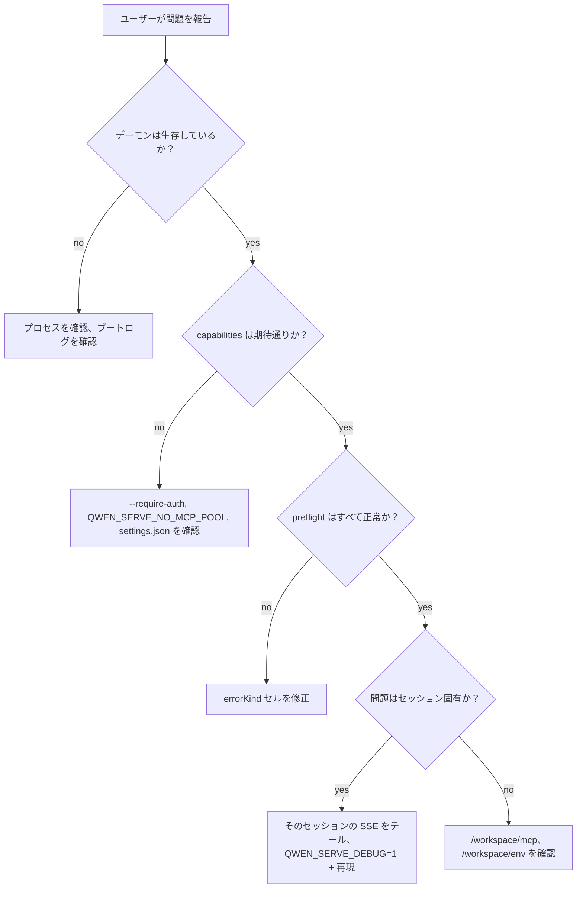

# 可観測性とデバッグ

## 概要

`qwen serve` には現在、**OpenTelemetry スパン計装**、**構造化ファイルログ**（`DaemonLogger`）、**リクエストごとのアクセスログ**、デバッグ用の標準エラーログ、構造化されたプリフライトセル、およびインメモリ権限監査リングが搭載されています。このページは、現在の可観測性機能と、トリアージ時に留意すべきギャップに関する実践的なガイドです。

## 現在利用可能な機能

| 対象                                     | 実装箇所                                       | 目的                                                                                                                                                                                                                                                                                   |
| ------------------------------------------- | ---------------------------------------------- | ----------------------------------------------------------------------------------------------------------------------------------------------------------------------------------------------------------------------------------------------------------------------------------------- |
| `QWEN_SERVE_DEBUG` 標準エラーログ              | `bridge.ts` および呼び出し元                     | 環境変数に `1` / `true` / `on` / `yes`（大文字小文字を区別しない）を指定すると、`qwen serve debug: ...` の行が標準エラー出力に出力されます。                                                                                                                                                                                  |
| OpenTelemetry スパン計装          | `server.ts` `daemonTelemetryMiddleware`        | 分類されたデーモン API リクエストでテレメトリミドルウェアに到達したものは `withDaemonRequestSpan` でラップされます。属性には正規化されたルート、解決された場合のワークスペースハッシュ、sessionId、clientId、およびステータスコードが含まれます。権限ルートには専用スパンがあります。プロンプトのライフサイクルはエンドツーエンドでトレースされます。設定は `settings.json` の `telemetry` に存在します。                               |
| OpenTelemetry デーモンパフォーマンスメトリクス           | `telemetry/*event-loop-lag*`, `daemon-metrics` | デーモンおよび ACP 子プロセスのイベントループラグゲージと、デーモン-子プロセス間パイプメッセージのバイト数ヒストグラム。                                                                                                                                                                                 |
| `DaemonLogger` 構造化ファイルログ         | `serve/daemon-logger.ts`                       | 安定した、サイズローテーションされる `daemon.log` に追記します。ファイルレコードには `runId` と PID が含まれます。起動時に選択された安定/フォールバックパスを出力します。フルステータスはヘルス、問題、およびファイルコピー損失カウンタを公開します。                                                        |
| リクエストごとのアクセスログミドルウェア           | `server/access-log.ts`                         | 各リクエスト後に method/path、ステータス、所要時間、セッション、および最初の生のクライアント ID をログに記録します。60トークンのバースト / 毎秒2トークンのバケットが、超過トラフィックを5つの固定ステータスカウンタに集約します。ヘルス、ハートビート、および成功した SSE 除外はそのまま残ります。                                                                                                                  |
| `/health`                                   | `server.ts` ルート                              | 生存プローブ。`?deep=1` を指定すると拡張詳細情報を返します。                                                                                                                                                                                                                                       |
| `/capabilities`                             | `server.ts` ルート                              | プリフライト機能の検出。[`11-capabilities-versioning.md`](./11-capabilities-versioning.md) を参照してください。                                                                                                                                                                                      |
| `/workspace/preflight`                      | ルート -> `DaemonStatusProvider`                | 構造化された準備状態セル: Node バージョン、CLI エントリ、ripgrep、git、npm。子プロセスが起動すると ACP レベルのセルも追加されます。                                                                                                                                                                       |
| `/workspace/env`                            | ルート -> `DaemonStatusProvider`                | デーモンプロセスの環境変数スナップショット。シークレット環境変数は存在のみを報告し、プロキシ URL の認証情報は削除されます。                                                                                                                                                                                    |
| `/workspace/mcp`                            | ルート -> bridge extMethod                      | プール、予算、拒否のスナップショット。                                                                                                                                                                                                                                                       |
| `/workspace/skills`, `/workspace/providers` | ルート                                         | ACP 側のライブスナップショット。セッションが存在しない場合は空のアイドルデータを返します。                                                                                                                                                                                                                   |
| セッションごとの SSE                             | `GET /session/:id/events`                      | リアルタイムイベントストリーム。                                                                                                                                                                                                                                                                   |
| `/demo` デバッグコンソール                       | `GET /demo` (`packages/cli/src/serve/demo.ts`) | ブラウザからアクセス可能なシングルページコンソール: チャット、イベントログ、ワークスペースインスペクター、権限 UX。ループバックでは、`http://127.0.0.1:4170/demo` が SDK コードを書かずにエンドツーエンドの検証を最も迅速に行うパスです。登録ルールは [`02-serve-runtime.md`](./02-serve-runtime.md) にあります。 |
| `PermissionAuditRing`                       | `permission-audit.ts`                          | 512 件の権限決定を保持するインメモリ FIFO。                                                                                                                                                                                                                                               |
| メディエーター `decisionReason` 監査             | `permissionMediator.ts`                        | 権限リクエストがどのように解決されたかを説明する内部構造化レコード。                                                                                                                                                                                                   |

## 現在未実装の機能

- **Prometheus / メトリクスエンドポイントはありません。** OTel メトリクスはエクスポート可能ですが、デーモンは Prometheus スクレイピングエンドポイントを公開していません。
- **`PermissionAuditRing` の外部監査シンクはありません。** リング自体は存在しますが、SIEM や外部ストレージへのファンアウトフックは接続されていません。

## デバッグレシピ

### 1. デーモンは生存しているか？

```bash
curl -s http://127.0.0.1:4170/health
# {"status":"ok"}

curl -s 'http://127.0.0.1:4170/health?deep=1' | jq
# {"status":"ok","workspaceCount":N,"sessions":N,...}
```

ディープヘルスは、drain 中のランタイムを含め、管理下のすべてのワークスペースランタイムを合計します。これは情報提供用のカウンタスナップショットであり、ワークスペースごとの準備状態ではありません。個別のワークスペースやトランスポートの診断が必要な場合は `/daemon/status` を使用してください。

ループバックで 401 が返る場合、`--require-auth` が有効になっている可能性が高いです。起動時に `QWEN_SERVE_DEBUG=1` を使用してブートログを確認してください。

### 2. どの機能が公開されているか？

```bash
curl -s http://127.0.0.1:4170/capabilities | jq
```

`mcp_workspace_pool`（F2 プールがオンか？）、`require_auth`（強化されているか？）、`permission_mediation.modes`（サポートされているポリシー）、および `policy.permission`（アクティブなポリシー）を確認します。

### 3. デーモンホストの準備状態は正常か？

```bash
curl -s http://127.0.0.1:4170/workspace/preflight | jq
```

`status: 'not_started'` のセルは ACP レベルであり、最初のセッションがアタッチされた後にのみ入力されます。`status: 'fail'` のセルにはクローズされた `errorKind` が含まれます。[`18-error-taxonomy.md`](./18-error-taxonomy.md) から構造化された修復手順を確認してください。

### 4. セッション SSE ストリームをテールする

```bash
curl -N -H 'Accept: text/event-stream' \
     -H 'Authorization: Bearer XYZ' \
     -H 'X-Qwen-Client-Id: debug-tail' \
     -H 'Last-Event-ID: 0' \
     'http://127.0.0.1:4170/session/<sid>/events'
```

`-N` は curl の出力バッファリングを無効にします。`Last-Event-ID: 0` は、`id > 0` のリングイベントのリプレイを要求します。

### 5. 権限リクエストはなぜこのように解決されたか？

`PermissionAuditRing` はインメモリであり、現在 HTTP インターフェースを持っていません。`QWEN_SERVE_DEBUG=1` を有効にして再現してください。メディエーターは、`decisionReason.type` を含む各投票と決定について構造化された行を出力します。今後の PR でリングを HTTP 経由で公開する予定です。

### 6. どのコンシューマーが遅いか？

`slow_client_warning` は、キューが 75% に達した際のオーバーフローエピソードごとに 1 回発生します。セッション SSE ストリームを購読し、合成フレームを探します。ペイロードには `queueSize`、`maxQueued`、`lastEventId` が含まれます。繰り返し警告が発生する場合は、スタックしたコンシューマー、通常はブロックされた SDK の `for await` ループが原因です。

### 7. MCP サーバーはなぜ拒否されたか？

`/workspace/mcp` のセルごとの `disabledReason: 'budget'`、`refusedServerNames` リスト、および `mcp_child_refused_batch` SSE イベントを組み合わせます。これらを `/capabilities` の `mcp_guardrails.modes`（`enforce` がアクティブか？）と、`getReservedSlots()` 経由で確認できるライブの `--mcp-client-budget` 状態と比較します。

### 8. デーモンがシャットダウンしない

最初のシグナルでグレースフルシャットダウンがトリガーされます（[`02-serve-runtime.md`](./02-serve-runtime.md) を参照）。10 秒を過ぎてもハングする場合は、以下を確認してください。

- ACP 子プロセスがグレースフルシャットダウンに応答しなかった。
- 長時間の SSE 接続により、HTTP `server.close()` が `SHUTDOWN_FORCE_CLOSE_MS`（5 秒）を過ぎてもオープン状態のままになっている。

**2 回目の** SIGTERM/SIGINT は、意図的に `bridge.killAllSync()` と `process.exit(1)` をトリガーします。

### 9. デーモンのイベントループ、プロンプトキュー、または ACP パイプは過負荷になっているか？

`GET /daemon/status` には、本番デーモンランタイムが perf スナップショットプロバイダーを注入する場合、`runtime.perf` が含まれることがあります。

```json
{
  "runtime": {
    "perf": {
      "eventLoop": { "meanMs": 1.2, "p50Ms": 1.0, "p99Ms": 9.5, "maxMs": 25 },
      "promptQueueWait": {
        "count": 3,
        "meanMs": 12.5,
        "maxMs": 35,
        "lastMs": 4
      },
      "pipe": {
        "inbound": { "count": 42, "totalBytes": 100000, "maxBytes": 12000 },
        "outbound": { "count": 41, "totalBytes": 90000, "maxBytes": 11000 }
      }
    }
  }
}
```

ステータスペイロードはデーモンのみに関するものです。`promptQueueWait` は、デーモンプロセスで観測されたプロンプト FIFO キューの待機サンプルを要約したものです。ACP 子プロセスのイベントループラグは意図的に `/daemon/status` に集約されていません。これは OTel ゲージ `qwen-code.acp.event_loop.lag` およびデーモンログに転送される標準エラーのストール行を通じて確認できます。

新しい OTel メトリクス名:

- `qwen-code.daemon.event_loop.lag`、`stat=mean|p50|p99|max` を持つミリ秒単位のゲージ。
- `qwen-code.acp.event_loop.lag`、`stat=mean|p50|p99|max` を持つミリ秒単位のゲージ。
- `qwen-code.daemon.prompt.queue_wait`、ミリ秒単位のヒストグラム。
- `qwen-code.daemon.pipe.message_bytes`、`direction=inbound|outbound` を持つバイト単位のヒストグラム。

### 10. ファイルログが degradation またはレコード損失を起こしたか？

フルデーモンステータスを使用します:

```bash
curl -s 'http://127.0.0.1:4170/daemon/status?detail=full' | \
  jq '{status, issues, daemon: {runId: .daemon.runId, logMode: .daemon.logMode, logHealth: .daemon.logHealth, logPath: .daemon.logPath, logIssues: .daemon.logIssues, droppedRecords: .daemon.logDroppedRecords, droppedBytes: .daemon.logDroppedBytes}}'
```

`stable` が通常のオーナーです。`fallback` は別のデーモンが stable ファミリを所有していることを意味し、`stderr-only` はファイルログが無効または利用できないことを意味します。意図的な同時実行下では `fallback/ok` が想定されます。`daemon_log_degraded` 警告はパスを含みません。実際のパスとロガーの問題コードについてはフル詳細をリクエストしてください。`runId` を使用して、stable ファイル内の再起動を分離します。

### 11. デーモンはメモリプレッシャー下にあるか？

```bash
curl -s 'http://127.0.0.1:4170/daemon/status' | \
  jq '.runtime.memory.pressure'
```

`level` は `normal` / `soft` / `hard` / `critical` のいずれかであり、`ratio` から分類されます。`ratio` は `rssRatio`（検出された cgroup/ホストメモリに対する RSS。OOM キラーが監視する値）と `heapRatio`（このプロセスの `heap_size_limit` に対する V8 ヒープ使用量。`--max-old-space-size` が指す古いスペースだけでなくヒープ全体）の悪い方の値です。`source` はどちらの値から生成されたかを示します。アクションを起こす前に `source` を確認してください。`unknown` はデーモンが両方を測定できなかったことを意味するため、`normal` は読み取り値の欠如であり、ヘルスの証拠ではありません。各サイドは、分子と分母の両方が使用可能だった場合にのみ報告されるため、`source` はゼロの `rssBytes` / `heapUsedBytes` を実際の値と区別する情報でもあります。

**`rssRatio` は分母の精度に依存し、`limits.memory.availableMemorySource` がそれを判定します。** cgroup 下（`constrained`）では、OOM キラーが強制する制限と正確に一致するため、ratio はそのままの意味を持ちます。ベアメタル（`host`）ではマシン全体のサイズですが、デーモンが実際に終了するのは_マシン_のメモリが枯渇したときであり、それはボックス上の他のすべてのプロセスに依存します。64 GB ホストの 20% を使用しているデーモンの隣に 55 GB の neighbour があっても、`level: normal, source: rss` のまま終了するまで報告されます。`source: 'host'` の下では、`rssRatio` を実際のプレッシャーの**下限**として読んでください。これはしきい値が未調整であることとは別の問題です。どのしきい値を選んでも、間違ったものを測定している分母は修正できません。

さらに、これがカバーしない 2 つの点があります。まず、デーモンの**ルート**プロセスのみを対象とするため、`qwen --acp` 子プロセスが増大している場合、デーモン全体が `normal` を報告し続けることがあります。隣で `runtime.memory.children` を確認してください。これはライブな子プロセスの RSS を合計し、`sampled` で実際に報告した数を示します。次に、自動修復はありません。`normal` のままでも `daemon_memory_pressure` 警告が発生するだけで、動作は変わりません。

`--memory-pressure-mode off` の場合でも、上記のすべての数値は引き続き報告され、issue は発生しないため、トップレベルの `status` はそのまま維持されます。実際のワークロードに対してしきい値を調整している間、または `status` にアラートを設定していて未調整のシグナルでそれを動かしたくない場合は、`off` を使用してください。

## フロー

### 典型的なトリアージフロー


```mermaid
flowchart TD
    A[ユーザーが問題を報告] --> B{デーモンは生存しているか？}
    B -->|no| BD[プロセスを確認、ブートログを確認]
    B -->|yes| C{capabilities は期待通りか？}
    C -->|no| CD["--require-auth, QWEN_SERVE_NO_MCP_POOL, settings.json を確認"]
    C -->|yes| D{preflight はすべて正常か？}
    D -->|no| DD["errorKind セルを修正"]
    D -->|yes| E{問題はセッション固有か？}
    E -->|yes| ES["そのセッションの SSE をテール、<br/>QWEN_SERVE_DEBUG=1 + 再現"]
    E -->|no| EW["/workspace/mcp、<br/>/workspace/env を確認"]
```

## 状態とライフサイクル

- `QWEN_SERVE_DEBUG` は、`debug-mode.ts` の `isServeDebugMode()` を通じてチェックごとに読み取られます。切り替えても再起動は不要です。ブート時に環境変数が設定されていなかった場合、ブートログは利用できません。
- `PermissionAuditRing` は 512 件の FIFO エントリに制限されており、古いレコードはサイレントに破棄されます。
- `DaemonStatusProvider` はリクエストごとにセルを再構築し、キャッシュしません。不要な高頻度ポーリングは避けてください。
## 依存関係

- デバッグ用の標準エラー出力には `process.stderr.write` を使用。
- 構造化されたファイルログには `DaemonLogger` を使用。
- `initializeTelemetry` および `createDaemonBridgeTelemetry` を介した OpenTelemetry SDK。
- daemon および ACP のイベントループ遅延ゲージ用の `node:perf_hooks.monitorEventLoopDelay`。
- 環境変数およびシグナルの検査用の `node:process`。

## 設定

| 設定項目                            | 効果                                                                                       |
| ------------------------------- | -------------------------------------------------------------------------------------------- |
| `QWEN_SERVE_DEBUG`              | 詳細な stderr ログを有効にします。[`17-configuration.md`](./17-configuration.md) を参照してください。             |
| `settings.json` の `telemetry`     | OTel の動作を制御します: `enabled`、`otlpEndpoint`、`otlpProtocol`、およびシグナルごとのエンドポイント。 |
| `DaemonLogger` のログパス         | 安定した `debug/daemon/daemon.log`、またはブート時に選択されたランタイム固有のフォールバック。                           |
| `PermissionAuditRing` のサイズ      | 現在は 512 にハードコードされています。                                                                     |
| `slow_client_warning` のしきい値 | `0.75` / `0.375`。`eventBus.ts` にハードコードされています。                                               |

## 注意事項と既知の制限

- **DaemonLogger のファイルログは構造化されており**、`route`、`sessionId`、`clientId` でフィルタリングできます。`QWEN_SERVE_DEBUG` の stderr ログは非構造化テキストのままです。
- **DaemonLogger のリテンションは年齢ベースではなくサイズベースです。** アクティブファイルと4つのアーカイブがファミリごとに制限されます。ライブなフォールバックオーナーは削除されません。
- **アクセスサマリは意図的な損失アカウンティングです。** WARN の `access logs suppressed` は、stderr とファイルの両方から省略された個別のアクセスレコードを表します。ドロップされた HTTP リクエストを示すものではありません。
- **外部 logrotate はアクティブファミリを変更してはいけません。** 読み取り/コピーしてから安定したパス名を置換後に再オープンするシッパーを使用してください。
- **OpenTelemetry のスパンにはリクエストごとの相関情報が含まれます。** ベアラ認証、レート制限、およびボディパースを通過した分類されたデーモン API リクエストは、正規化されたルート、sessionId、clientId、および（一意に解決された場合）`qwen-code.workspace.hash` 属性を運びます。より早いミドルウェアゲートで拒否されたリクエストにはこれらのリクエストスパンがありません。
- **HTTP メトリクスはデーモングローバルです。** OpenTelemetry HTTP リクエストメトリクスと Web Shell ステータスメトリクスリングにはワークスペース次元が含まれません。成功したセッション SSE 接続はリクエストスパンを持ちますが、その生存期間はリクエストレイテンシではないため、通常のリクエストカウント/所要時間メトリクスから除外されます。失敗した SSE ハンドシェイクは通常通りカウントされます。
- **`runtime.perf` はデーモンのみです。** 設計上、子プロセスのイベントループ遅延はここで報告されません。ACP 子プロセスのストールには、OTel または転送された stderr のストール警告を使用してください。
- **ACP レベルの `/workspace/preflight` セルにはアクティブなセッションが必要です。** アイドル状態の daemon では、auth / MCP / skills / providers が `status: 'not_started'` を示す場合がありますが、これは想定内の動作です。
- **`/workspace/env` はシークレットの存在のみを報告し、値は報告しません。** シークレットの存在自体が機密である場合、そのレスポンスを公開しないでください。
- **監査リングはプロセスローカルであり**、daemon の再起動時に履歴は失われます。
- **ここでは負荷テストのレシピについてはドキュメント化されていません。** パフォーマンスベースラインは `test/perf-daemon-baseline` ブランチに存在します。

## リファレンス

- `packages/cli/src/serve/daemon-status-provider.ts`
- `packages/cli/src/serve/daemon-logger.ts` (`DaemonLogger`, `buildDaemonLogLine`)
- `packages/cli/src/serve/debug-mode.ts` (`isServeDebugMode`)
- `packages/acp-bridge/src/permissionMediator.ts` (`PermissionDecisionReason`)
- `packages/cli/src/serve/server.ts` (`daemonTelemetryMiddleware`, access-log ミドルウェア)
- 設定: [`17-configuration.md`](./17-configuration.md)
- エラー分類: [`18-error-taxonomy.md`](./18-error-taxonomy.md)
- ユーザー操作ガイド: [`../../users/qwen-serve.md`](../../users/qwen-serve.md)
