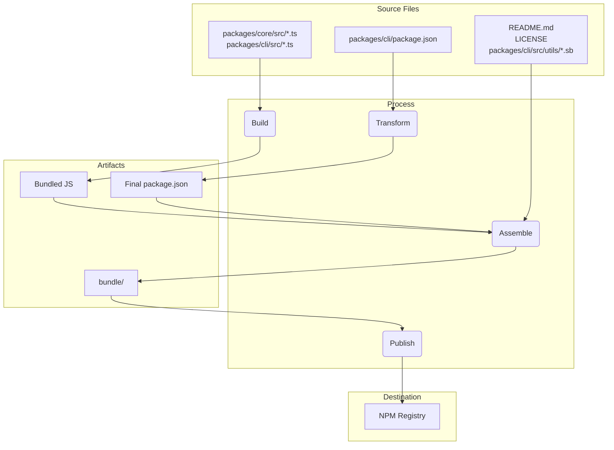

# パッケージ概要

このmonorepoには、`@qwen-code/qwen-code`と`@qwen-code/qwen-code-core`の2つの主要パッケージが含まれています。

## `@qwen-code/qwen-code`

これはQwen Codeのメインパッケージです。ユーザーインターフェース、コマンド解析、およびその他のすべてのユーザー向け機能を担当しています。

このパッケージがpublishされる際、単一の実行可能ファイルにバンドルされます。このバンドルには、`@qwen-code/qwen-code-core`を含むすべてのパッケージ依存関係が含まれます。つまり、ユーザーが`npm install -g @qwen-code/qwen-code`でパッケージをインストールしても、`npx @qwen-code/qwen-code`で直接実行しても、彼らはこの単一の自己完結型実行ファイルを使用していることになります。

## `@qwen-code/qwen-code-core`

このパッケージには、CLI のコアロジックが含まれています。設定されたプロバイダーへの API リクエストの実行、認証の処理、ローカルキャッシュの管理を担当します。

このパッケージはバンドルされていません。公開される際は、独自の依存関係を持つ標準的な Node.js パッケージとして公開されます。これにより、必要に応じて他のプロジェクトでスタンドアロンパッケージとして使用できます。`dist` フォルダー内のすべてのトランスパイルされた JS コードはパッケージに含まれています。

# リリースプロセス

このプロジェクトでは、すべてのパッケージが正しくバージョン管理および公開されるように、構造化されたリリースプロセスに従っています。このプロセスは、可能な限り自動化されるように設計されています。

## リリース方法

リリースは、[release.yml](https://github.com/QwenLM/qwen-code/actions/workflows/release.yml) GitHub Actions ワークフローを通じて管理されています。パッチやホットフィックスの手動リリースを行うには以下の手順に従ってください：

1.  リポジトリの **Actions** タブに移動します。
2.  一覧から **Release** ワークフローを選択します。
3.  **Run workflow** ドロップダウンボタンをクリックします。
4.  必要な入力項目を記入します：
    - **Version**: リリースする正確なバージョン（例：`v0.2.1`）。
    - **Ref**: リリース元のブランチまたはコミット SHA（デフォルトは `main`）。
    - **Dry Run**: ワークフローをテストのみで実行する場合は `true` のままにし、本番リリースを行う場合は `false` に設定します。
5.  **Run workflow** をクリックします。

## ナイトリーリリース

手動リリースに加えて、このプロジェクトでは最新の「最先端」バージョンをテストおよび開発用に提供するための自動ナイトリーリリースプロセスも実施されています。

### プロセス

毎日深夜0時（UTC）に、[Release workflow](https://github.com/QwenLM/qwen-code/actions/workflows/release.yml) がスケジュール通り自動実行されます。このワークフローでは以下の手順が実行されます：

1.  `main` ブランチから最新のコードをチェックアウトします。
2.  すべての依存関係をインストールします。
3.  `preflight` チェックと統合テストをすべて実行します。
4.  すべてのテストが成功すれば、次のナイトリーバージョン番号を計算します（例：`v0.2.1-nightly.20230101`）。
5.  パッケージをビルドし、`nightly` dist-tag 付きで npm に公開します。
6.  最後に、ナイトリーバージョン用の GitHub Release を作成します。

### エラー処理

ナイトリーのワークフロー内でいずれかのステップが失敗した場合、リポジトリ内に新しい issue が自動で作成され、`bug` および `nightly-failure` のラベルが付与されます。この issue には、簡単にデバッグできるように失敗したワークフロー実行へのリンクが含まれます。

### Nightly Build の使い方

最新の Nightly Build をインストールするには、`@nightly` タグを使用してください：

```bash
npm install -g @qwen-code/qwen-code@nightly
```

また、[release-docker.yml](../.gcp/release-docker.yml) という Google Cloud Build を実行しています。これはリリースに合わせて sandbox 用の Docker イメージを公開します。この処理も、サービスアカウントの権限が整理され次第、GH に移行し、メインのリリースファイルと統合される予定です。

### リリース後に行うこと

ワークフローが正常に完了したら、[GitHub Actions タブ](https://github.com/QwenLM/qwen-code/actions/workflows/release.yml)で進行状況を確認できます。完了後は以下の手順を行ってください：

1. リポジトリの [Pull Requests ページ](https://github.com/QwenLM/qwen-code/pulls)を開く。
2. `release/vX.Y.Z` ブランチから `main` への新しい Pull Request を作成する。
3. Pull Request をレビューし（`package.json` ファイル内のバージョン更新のみが含まれているはず）、マージする。これにより `main` ブランチのバージョンが最新のまま維持されます。

## リリースの検証

新しいリリースをプッシュした後は、Smoke Testing を実行して、パッケージが期待通りに動作することを確認する必要があります。これは、ローカルにパッケージをインストールし、一連のテストを実行することで確認できます。

- `npx -y @qwen-code/qwen-code@latest --version` — rc や dev タグを使用していない場合、プッシュが成功したことを確認できます。
- `npx -y @qwen-code/qwen-code@<release tag> --version` — タグが正しくプッシュされたことを確認できます。
- _これはローカル環境に破壊的です_  
  `npm uninstall @qwen-code/qwen-code && npm uninstall -g @qwen-code/qwen-code && npm cache clean --force && npm install @qwen-code/qwen-code@<version>`
- 基本的な LLM コマンドやツールをいくつか実行して確認する Smoke Testing を推奨します。これにより、パッケージが期待通りに動作していることを確認できます。将来的には、このプロセスをより体系化する予定です。

## バージョン変更をマージするタイミング、またはマージしない場合とは？

現在または古いコミットからパッチリリースやホットフィックスリリースを作成する上記のパターンでは、リポジトリが以下の状態になります：

1.  タグ（`vX.Y.Z-patch.1`）：このタグは、リリースしたい安定版コードを含むmainブランチ上の元のコミットを正しく指しています。これは非常に重要です。このタグをチェックアウトした人は、公開されたコードそのものを取得できます。
2.  ブランチ（`release-vX.Y.Z-patch.1`）：このブランチには、タグ付けされたコミットの上に新しいコミットが1つ含まれています。その新しいコミットには、package.json（およびpackage-lock.jsonなどの関連ファイル）のバージョン番号変更のみが含まれています。

このような分離は良いことです。これにより、マージを決定するまで、mainブランチの履歴にリリース固有のバージョンアップが混入することを防げます。

これが重要な判断ポイントであり、リリースの性質によって完全に左右されます。

### Stable Patch と Hotfix のためのマージバック

Stable patch や hotfix リリースを行う際は、ほぼ必ず `release-<tag>` ブランチを `main` にマージバックする必要があります。

- **なぜ必要なのか？** 主な理由は、main ブランチの package.json 内のバージョン情報を更新するためです。例えば、古いコミットから v1.2.1 をリリースしたが、そのバージョンアップの変更を main にマージしなかった場合、main ブランチの package.json には依然として `"version": "1.2.0"` と記載されたままになります。次の開発者が次の機能リリース（例：v1.3.0）の作業を開始する際に、誤った古いバージョン番号を持つコードベースからブランチを作成してしまうことになり、混乱を招いたり、後で手動でのバージョン修正が必要になったりします。
- **プロセス:** release-v1.2.1 ブランチを作成し、パッケージの公開が成功した後、release-v1.2.1 を main にマージするためのプルリクエストを開いてください。この PR には `"chore: bump version to v1.2.1"` という1つのコミットのみが含まれます。これはクリーンでシンプルな統合方法であり、main ブランチを最新のリリースバージョンと同期した状態に保ちます。

### プレリリース（RC、Beta、Dev）では main へのマージをしない

通常、プレリリース用の release branch は `main` にマージしません。

- 理由：プレリリースバージョン（例：v1.3.0-rc.1、v1.3.0-rc.2）は、定義上、不安定で一時的なものです。main ブランチの履歴に、リリース候補（RC）用の一連のバージョン更新が残ることを避けたいのです。main の package.json には RC ではなく、最新の stable リリースバージョンを反映させるべきです。
- プロセス：release-v1.3.0-rc.1 ブランチを作成し、`npm publish --tag rc` を実行したら、そのブランチの役目は終わりです。そのまま削除して問題ありません。RC のコードはすでに main（または feature ブランチ）に存在しているため、機能的なコードは失われません。release branch はバージョン番号を扱うための一時的な手段に過ぎません。

## ローカルでのテストと検証：パッケージングおよび公開プロセスの変更

実際に NPM に公開したり、GitHub リリースを作成したりすることなくリリースプロセスをテストする必要がある場合は、GitHub UI からワークフローを手動でトリガーできます。

1.  リポジトリの [Actions タブ](https://github.com/QwenLM/qwen-code/actions/workflows/release.yml) に移動します。
2.  「Run workflow」ドロップダウンをクリックします。
3.  `dry_run` オプションをチェックしたまま（`true`）にしておきます。
4.  「Run workflow」ボタンをクリックします。

これにより、リリースプロセス全体が実行されますが、`npm publish` および `gh release create` ステップはスキップされます。ワークフローのログを確認して、すべてが期待通りに動作していることを検証できます。

パッケージングおよび公開プロセスへの変更をコミットする前に、ローカルでテストを行うことは非常に重要です。これにより、パッケージが正しく公開され、ユーザーによってインストールされた際に期待通りに動作することを保証できます。

変更内容を検証するには、公開プロセスの dry run を実行できます。これは、npm レジストリに実際にパッケージを公開せずに、公開プロセスをシミュレートするものです。

```bash
npm_package_version=9.9.9 SANDBOX_IMAGE_REGISTRY="registry" SANDBOX_IMAGE_NAME="thename" npm run publish:npm --dry-run
```

このコマンドは以下の処理を行います：

1.  すべてのパッケージをビルドします。
2.  すべての prepublish スクリプトを実行します。
3.  npm に公開される予定の package tarball を作成します。
4.  公開される予定のパッケージのサマリーを表示します。

生成された tarball を確認し、正しいファイルが含まれていること、および `package.json` ファイルが正しく更新されていることを検証できます。tarball は各パッケージディレクトリのルートに作成されます（例：`packages/cli/qwen-code-0.1.6.tgz`）。

dry run を実行することで、パッケージングプロセスへの変更が正しいことを確信でき、パッケージが正常に公開されることを保証できます。

```markdown
## リリースの詳細

リリースプロセスの主な目的は、`packages/` ディレクトリにあるソースコードをビルドし、プロジェクトルートの一時的な `bundle` ディレクトリにクリーンで自己完結型のパッケージを構築することです。この `bundle` ディレクトリが実際に NPM に公開される内容となります。

以下が主要ステージです：

### ステージ 1：リリース前の健全性チェックとバージョン管理

- **処理内容**: ファイルを移動する前に、プロジェクトが正常な状態であることを確認します。これにはテスト、lint、type-check（`npm run preflight`）が含まれます。ルートの `package.json` および `packages/cli/package.json` のバージョン番号が新しいリリースバージョンに更新されます。
- **理由**: 高品質で動作するコードのみがリリースされるように保証するためです。バージョニングは新しいリリースを示す最初のステップです。

### ステージ 2：ソースコードのビルド

- **処理内容**: `packages/core/src` および `packages/cli/src` 内の TypeScript ソースコードが JavaScript にコンパイルされます。
- **ファイルの移動**:
  - `packages/core/src/**/*.ts` → コンパイル → `packages/core/dist/`
  - `packages/cli/src/**/*.ts` → コンパイル → `packages/cli/dist/`
- **理由**: 開発中に書かれた TypeScript コードは、Node.js で実行できるプレーンな JavaScript に変換する必要があります。CLI パッケージが core パッケージに依存しているため、core パッケージが先にビルドされます。

### ステージ 3：最終公開パッケージのアセンブル

これは最も重要なステージで、ファイルが移動・変換され、公開用の最終形になります。プロジェクトルートに一時的な `bundle` フォルダが作成され、最終的なパッケージ内容が格納されます。

#### 1. `package.json` の変換

- **処理内容**: `packages/cli/package.json` から読み込まれ、修正された上でルートの `bundle/` ディレクトリに書き出されます。
- **ファイルの移動**: `packages/cli/package.json` → （メモリ内変換）→ `bundle/package.json`
- **理由**: 最終的な `package.json` は開発時に使用していたものとは異なる必要があり、以下の変更が加えられます：
  - `devDependencies` を削除。
  - ワークスペース固有の `"dependencies": { "@qwen-code/core": "workspace:*" }` を削除し、core コードが最終的な JavaScript ファイルに直接バンドルされるようにする。
  - `bin`, `main`, `files` フィールドが最終パッケージ構造内の正しい場所を指すように調整。

#### 2. JavaScript バンドルの作成

- **処理内容**: `packages/core/dist` と `packages/cli/dist` のビルド済み JavaScript が、単一の実行可能な JavaScript ファイルにバンドルされます。
- **ファイルの移動**: `packages/cli/dist/index.js` + `packages/core/dist/index.js` → （esbuild によるバンドル）→ `bundle/gemini.js`（または同様の名前）
- **理由**: 必要なアプリケーションコードをすべて含んだ単一で最適化されたファイルを作成することで、パッケージを簡潔にします。core パッケージを NPM 上での別依存として保持する必要がなくなり、そのコードが直接含まれるようになります。

#### 3. 静的および補助ファイルのコピー

- **処理内容**: ソースコードではないが、パッケージが正しく動作したり説明のために必要なファイルが `bundle` ディレクトリにコピーされます。
- **ファイルの移動**:
  - `README.md` → `bundle/README.md`
  - `LICENSE` → `bundle/LICENSE`
  - `packages/cli/src/utils/*.sb`（サンドボックスプロファイル）→ `bundle/`
- **理由**:
  - `README.md` と `LICENSE` は、どの NPM パッケージにも含めるべき標準的なファイルです。
  - サンドボックスプロファイル（`.sb` ファイル）は CLI のサンドボックス機能に必要な実行時アセットであり、最終実行ファイルと同じディレクトリに配置される必要があります。

### ステージ 4：NPM への公開

- **処理内容**: ルートの `bundle` ディレクトリ内で `npm publish` コマンドが実行されます。
- **理由**: `bundle` ディレクトリ内で `npm publish` を実行することで、ステージ 3 で慎重にアセンブルしたファイルのみが NPM レジストリにアップロードされます。これにより、ソースコードやテストファイル、開発設定などが誤って公開されることを防ぎ、ユーザー向けにクリーンで最小限のパッケージを提供できます。

### ファイルフローの概要



このプロセスにより、最終的に公開される成果物は、開発ワークスペースの直接的なコピーではなく、プロジェクトのためだけに設計されたクリーンで効率的な表現となることが保証されます。
```

## NPM Workspaces

このプロジェクトでは、monorepo 内のパッケージを管理するために [NPM Workspaces](https://docs.npmjs.com/cli/v10/using-npm/workspaces) を使用しています。これにより、プロジェクトのルートから複数のパッケージ間で依存関係を管理したりスクリプトを実行したりできるため、開発が簡素化されます。

### 仕組み

ルートの `package.json` ファイルで、このプロジェクトのワークスペースが定義されています：

```json
{
  "workspaces": ["packages/*"]
}
```

これは、`packages` ディレクトリ内のすべてのフォルダが、ワークスペースの一部として管理されるべき個別のパッケージであることを NPM に伝えます。

### ワークスペースのメリット

- **依存関係管理の簡素化**: プロジェクトのルートから `npm install` を実行すると、ワークスペース内のすべてのパッケージの依存関係がインストールされ、それらが相互にリンクされます。つまり、各パッケージのディレクトリでそれぞれ `npm install` を実行する必要がないということです。
- **自動リンク機能**: ワークスペース内のパッケージは、お互いに依存関係を持つことができます。`npm install` を実行すると、NPM はパッケージ間のシンボリックリンクを自動的に作成します。これにより、あるパッケージに変更を加えると、そのパッケージに依存している他のパッケージからすぐにその変更を利用できるようになります。
- **スクリプト実行の簡略化**: ルートプロジェクトから `--workspace` フラグを使って、任意のパッケージ内のスクリプトを実行できます。例えば、`cli` パッケージ内の `build` スクリプトを実行するには、`npm run build --workspace @qwen-code/qwen-code` と実行します。