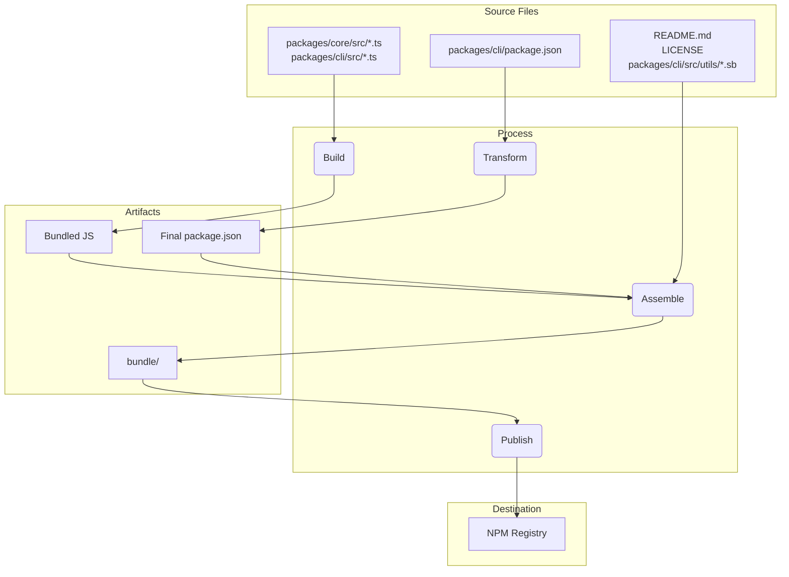

# パッケージ概要

このmonorepoには、`@qwen-code/qwen-code`と`@qwen-code/qwen-code-core`の2つの主要パッケージが含まれています。

## `@qwen-code/qwen-code`

これはQwen Codeのメインパッケージです。ユーザーインターフェース、コマンド解析、およびその他のすべてのユーザー向け機能を担当しています。

このパッケージが公開される際には、単一の実行可能ファイルにバンドルされます。このバンドルには、`@qwen-code/qwen-code-core`を含むすべてのパッケージ依存関係が含まれます。つまり、ユーザーが`npm install -g @qwen-code/qwen-code`でパッケージをインストールしても、`npx @qwen-code/qwen-code`で直接実行しても、この単一の自己完結型実行ファイルを使用することになります。

## `@qwen-code/qwen-code-core`

このパッケージには、CLI のコアロジックが含まれています。設定されたプロバイダーへの API リクエストの実行、認証の処理、ローカルキャッシュの管理を担当します。

このパッケージはバンドルされていません。パブリッシュ時には、独自の依存関係を持つ標準的な Node.js パッケージとしてパブリッシュされます。これにより、必要に応じて他のプロジェクトでスタンドアロンパッケージとして使用できます。`dist` フォルダー内のすべてのトランスパイルされた js コードがパッケージに含まれています。

# リリースプロセス

このプロジェクトでは、すべてのパッケージが正しくバージョン管理およびパブリッシュされるように、構造化されたリリースプロセスに従っています。このプロセスは、可能な限り自動化されるように設計されています。

## リリース方法

リリースは、[release.yml](https://github.com/QwenLM/qwen-code/actions/workflows/release.yml) GitHub Actions ワークフローを通じて管理されています。パッチまたはホットフィックスの手動リリースを実行するには：

1.  リポジトリの **Actions** タブに移動します。
2.  リストから **Release** ワークフローを選択します。
3.  **Run workflow** ドロップダウンボタンをクリックします。
4.  必要な入力項目を埋めます：
    - **Version**: リリースする正確なバージョン（例: `v0.2.1`）。
    - **Ref**: リリース元のブランチまたはコミット SHA（デフォルトは `main`）。
    - **Dry Run**: ワークフローをテストのみで実行する場合は `true` のままにし、本番リリースする場合は `false` に設定します。
5.  **Run workflow** をクリックします。

## ナイトリーリリース

手動リリースに加えて、このプロジェクトでは最新の「最先端」バージョンをテストおよび開発用に提供するための自動ナイトリーリリースプロセスが実行されています。

### プロセス

毎日UTCの真夜中（日本時間では午前9時）に、[Release workflow](https://github.com/QwenLM/qwen-code/actions/workflows/release.yml)がスケジュールに従って自動実行されます。このワークフローは以下のステップを実行します：

1.  `main`ブランチから最新のコードをチェックアウトします。
2.  すべての依存関係をインストールします。
3.  `preflight`チェックと統合テストの全スイートを実行します。
4.  すべてのテストが成功した場合、次のnightlyバージョン番号を計算します（例：`v0.2.1-nightly.20230101`）。
5.  パッケージをビルドし、`nightly` dist-tagでnpmに公開します。
6.  最後に、nightlyバージョンのGitHub Releaseを作成します。

### エラー処理

nightlyワークフローのいずれかのステップが失敗した場合、リポジトリに新しいissueが自動的に作成され、`bug`と`nightly-failure`のラベルが付与されます。このissueには、簡単にデバッグできるように失敗したワークフロー実行へのリンクが含まれます。

### Nightly Build の使い方

最新の Nightly Build をインストールするには、`@nightly` タグを使用します：

```bash
npm install -g @qwen-code/qwen-code@nightly
```

また、[release-docker.yml](../.gcp/release-docker.yml) という Google Cloud Build を実行しています。これは、リリースに合わせて Sandbox 用の Docker イメージを公開するものです。サービスアカウントの権限が整理され次第、こちらも GH に移行し、メインのリリースファイルと統合される予定です。

### リリース後に行うこと

Workflow が正常に完了した後、[GitHub Actions タブ](https://github.com/QwenLM/qwen-code/actions/workflows/release.yml) で進行状況を確認できます。完了したら以下の手順を行ってください：

1. リポジトリの [Pull Requests ページ](https://github.com/QwenLM/qwen-code/pulls) にアクセスします。
2. `release/vX.Y.Z` ブランチから `main` への Pull Request を新規作成します。
3. Pull Request をレビューします（`package.json` ファイル内のバージョン更新のみを含むはずです）し、マージします。これにより `main` ブランチのバージョンが最新の状態に保たれます。

## リリースの検証

新しいリリースをプッシュした後は、パッケージが期待通りに動作することを確認するために、Smoke Testing を実行してください。これは、ローカルにパッケージをインストールし、一連のテストを実行して正しく機能していることを確認することで可能です。

- `npx -y @qwen-code/qwen-code@latest --version`：rc や dev タグを使用していない場合、プッシュが成功したことを確認できます。
- `npx -y @qwen-code/qwen-code@<release tag> --version`：タグが正しくプッシュされたことを確認できます。
- _これはローカル環境に破壊的な操作を行います_：`npm uninstall @qwen-code/qwen-code && npm uninstall -g @qwen-code/qwen-code && npm cache clean --force && npm install @qwen-code/qwen-code@<version>`
- 基本的なLLMコマンドやツールをいくつか実行して確認する Smoke Testing を推奨します。これにより、パッケージが期待通りに動作していることを確認できます。将来的には、このプロセスをさらに明確に文書化する予定です。

## バージョン変更をマージするタイミング、またはマージしない場合とは？

現在または古いコミットからパッチリリースやホットフィックスリリースを作成する上記のパターンでは、リポジトリは以下の状態になります：

1.  タグ (`vX.Y.Z-patch.1`)：このタグは、リリースしたい安定版コードを含むmainブランチ上の元のコミットを正しく指しています。これは非常に重要です。このタグをチェックアウトする人は、公開されたコードそのものを取得できます。
2.  ブランチ (`release-vX.Y.Z-patch.1`)：このブランチは、タグ付けされたコミットの上に1つの新しいコミットを含んでいます。その新しいコミットには、package.json（およびpackage-lock.jsonなどの関連ファイル）でのバージョン番号変更のみが含まれています。

このような分離は良いことです。メインブランチの履歴をリリース固有のバージョンアップで汚すことなく、マージするタイミングを自分で決めることができます。

これが重要な判断ポイントであり、リリースの性質によって完全に異なります。

### Stable Patch および Hotfix のための Merge Back

Stable patch や hotfix リリースを行う際は、ほぼ常に `release-<tag>` ブランチを `main` ブランチにマージし直す必要があります。

- **なぜ必要なのか？**  
  主な理由は、main ブランチの package.json 内のバージョン情報を更新するためです。例えば、古いコミットから v1.2.1 をリリースしたが、そのバージョンアップの変更を main にマージしなかった場合、main ブランチの package.json には依然として `"version": "1.2.0"` と記載されたままになります。次の開発者が次の機能リリース（例：v1.3.0）の作業を開始する際に、誤った古いバージョン番号を持つコードベースからブランチを作成してしまうことになります。これは混乱を招き、後で手動でバージョンを修正する必要が出てきます。

- **手順:**  
  release-v1.2.1 ブランチを作成し、パッケージの公開が成功した後、release-v1.2.1 を main にマージするための Pull Request を作成してください。この PR には `"chore: bump version to v1.2.1"` という1つのコミットのみが含まれます。これは main ブランチを最新のリリースバージョンと同期させるための、クリーンでシンプルな統合です。

### プレリリース（RC、Beta、Dev）では main へのマージをしない

通常、プレリリース用の release branch は `main` にマージしません。

- 理由：プレリリースバージョン（例：v1.3.0-rc.1、v1.3.0-rc.2）は、定義上、不安定で一時的なものです。main ブランチの履歴にリリース候補版のためのバージョン更新を多数含めたくはありません。main の package.json には RC ではなく、最新の stable リリースバージョンを反映させるべきです。
- プロセス：release-v1.3.0-rc.1 ブランチを作成し、`npm publish --tag rc` を実行したら、そのブランチの役目は終わりです。そのまま削除して問題ありません。RC のコードはすでに main（または feature ブランチ）に存在しているため、機能的なコードは失われません。release ブランチはバージョン番号を扱うための一時的な手段にすぎません。

## ローカルでのテストと検証：パッケージングおよび公開プロセスの変更

NPM への公開や GitHub リリースの作成を行わずにリリースプロセスをテストする必要がある場合は、GitHub UI からワークフローを手動でトリガーできます。

1.  リポジトリの [Actions タブ](https://github.com/QwenLM/qwen-code/actions/workflows/release.yml) にアクセスします。
2.  「Run workflow」ドロップダウンをクリックします。
3.  `dry_run` オプションをチェックしたまま（`true` のまま）にします。
4.  「Run workflow」ボタンをクリックします。

これにより、リリースプロセス全体が実行されますが、`npm publish` および `gh release create` ステップはスキップされます。ワークフローのログを確認して、すべてが期待通りに動作していることを検証できます。

パッケージングおよび公開プロセスへの変更をコミットする前に、ローカルでテストを行うことが重要です。これにより、パッケージが正しく公開され、ユーザーがインストールした際に期待通りに動作することを保証できます。

変更を検証するには、公開プロセスのドライランを実行できます。これにより、npm レジストリに実際にパッケージを公開せずに、公開プロセスをシミュレートできます。

```bash
npm_package_version=9.9.9 SANDBOX_IMAGE_REGISTRY="registry" SANDBOX_IMAGE_NAME="thename" npm run publish:npm --dry-run
```

このコマンドは以下の処理を行います：

1.  すべてのパッケージをビルドします。
2.  すべての prepublish スクリプトを実行します。
3.  npm に公開される予定のパッケージ tarball を作成します。
4.  公開される予定のパッケージのサマリーを表示します。

生成された tarball を確認して、正しいファイルが含まれていること、および `package.json` ファイルが正しく更新されていることを検証できます。tarball は各パッケージディレクトリのルートに作成されます（例：`packages/cli/qwen-code-0.1.6.tgz`）。

ドライランを実行することで、パッケージングプロセスへの変更が正しいことを確認し、パッケージが正常に公開されることに自信を持てるようになります。

## Release Deep Dive

リリースプロセスの主な目的は、`packages/` ディレクトリ内のソースコードをビルドし、プロジェクトのルートに一時的な `bundle` ディレクトリを作成して、クリーンで自己完結型のパッケージをアセンブルすることです。実際に NPM に publish されるのはこの `bundle` ディレクトリの中身です。

以下が主なステージです：

### Stage 1: リリース前の健全性チェックとバージョニング

- **処理内容**: ファイルを移動する前に、プロジェクトが正常な状態にあることを確認します。これにはテスト、lint、型チェック（`npm run preflight`）が含まれます。ルートの `package.json` と `packages/cli/package.json` のバージョン番号が新しいリリースバージョンに更新されます。
- **目的**: 高品質で動作するコードのみがリリースされるように保証します。バージョンの更新は新しいリリースの開始を示す最初のステップです。

### Stage 2: ソースコードのビルド

- **処理内容**: `packages/core/src` と `packages/cli/src` 内の TypeScript ソースコードが JavaScript にコンパイルされます。
- **ファイルの移動**:
  - `packages/core/src/**/*.ts` → コンパイル → `packages/core/dist/`
  - `packages/cli/src/**/*.ts` → コンパイル → `packages/cli/dist/`
- **目的**: 開発中に書かれた TypeScript コードは、Node.js で実行できるプレーンな JavaScript に変換する必要があります。`cli` パッケージが `core` パッケージに依存しているため、まず `core` パッケージがビルドされます。

### Stage 3: 最終的な publish 用パッケージのアセンブル

これはファイルが最終的な publish 用の状態に変換・移動される最も重要なステージです。プロジェクトのルートに一時的な `bundle` フォルダが作成され、最終的なパッケージコンテンツが配置されます。

#### 1. `package.json` の変換

- **処理内容**: `packages/cli/` にある `package.json` が読み込まれ、変更され、ルートの `bundle/` ディレクトリに書き込まれます。
- **ファイルの移動**: `packages/cli/package.json` → （メモリ内変換）→ `bundle/package.json`
- **目的**: 最終的な `package.json` は開発中に使用していたものとは異なる必要があります。主な変更点は以下の通りです：
  - `devDependencies` を削除
  - ワークスペース固有の依存関係 `"dependencies": { "@qwen-code/core": "workspace:*" }` を削除し、core コードが最終的な JavaScript ファイルに直接バンドルされるようにする
  - `bin`、`main`、`files` フィールドが最終的なパッケージ構造内の正しい場所を指すようにする

#### 2. JavaScript バンドルの作成

- **処理内容**: `packages/core/dist` と `packages/cli/dist` のビルド済み JavaScript が、単一の実行可能な JavaScript ファイルにバンドルされます。
- **ファイルの移動**: `packages/cli/dist/index.js` + `packages/core/dist/index.js` → （esbuild でバンドル）→ `bundle/gemini.js`（または同様の名前）
- **目的**: これにより、必要なすべてのアプリケーションコードを含む単一の最適化されたファイルが作成されます。core パッケージを NPM 上の別々の依存関係として保持する必要がなくなり、コードが直接含まれるためパッケージが簡潔になります。

#### 3. 静的ファイルとサポートファイルのコピー

- **処理内容**: ソースコードの一部ではないが、パッケージが正しく動作したり適切に説明されたりするために必要な重要なファイルが `bundle` ディレクトリにコピーされます。
- **ファイルの移動**:
  - `README.md` → `bundle/README.md`
  - `LICENSE` → `bundle/LICENSE`
  - `packages/cli/src/utils/*.sb`（サンドボックスプロファイル）→ `bundle/`
- **目的**:
  - `README.md` と `LICENSE` は、どの NPM パッケージにも含めるべき標準的なファイルです。
  - サンドボックスプロファイル（.sb ファイル）は CLI のサンドボックス機能が動作するために必要な重要なランタイムアセットです。最終的な実行ファイルの隣に配置される必要があります。

### Stage 4: NPM への publish

- **処理内容**: ルートの `bundle` ディレクトリ内で `npm publish` コマンドが実行されます。
- **目的**: `bundle` ディレクトリ内から `npm publish` を実行することで、Stage 3 で慎重にアセンブルしたファイルのみが NPM レジストリにアップロードされます。これにより、ソースコード、テストファイル、開発用設定などが誤って publish されるのを防ぎ、ユーザー向けにクリーンで最小限のパッケージを提供できます。

## ファイルフローの概要



このプロセスにより、最終的に publish されるアーティファクトは、開発ワークスペースの直接的なコピーではなく、プロジェクトのためだけにビルドされたクリーンで効率的な表現となることが保証されます。

## NPM Workspaces

このプロジェクトでは、monorepo 内のパッケージを管理するために [NPM Workspaces](https://docs.npmjs.com/cli/v10/using-npm/workspaces) を使用しています。これにより、プロジェクトのルートから複数のパッケージの依存関係を管理したり、スクリプトを実行したりできるため、開発が簡素化されます。

### 仕組み

ルートの `package.json` ファイルで、このプロジェクトのワークスペースが定義されています：

```json
{
  "workspaces": ["packages/*"]
}
```

これは、`packages` ディレクトリ内のすべてのフォルダが、ワークスペースの一部として管理されるべき別のパッケージであることを NPM に伝えます。

### Workspaces の利点

- **依存関係管理の簡素化**: プロジェクトのルートから `npm install` を実行すると、ワークスペース内のすべてのパッケージの依存関係がインストールされ、それらが相互にリンクされます。つまり、各パッケージのディレクトリでそれぞれ `npm install` を実行する必要がないということです。
- **自動リンク**: ワークスペース内のパッケージは、お互いに依存関係を持つことができます。`npm install` を実行すると、NPM はパッケージ間の symlink を自動的に作成します。これにより、あるパッケージに変更を加えると、そのパッケージに依存する他のパッケージからすぐにその変更を利用できるようになります。
- **スクリプト実行の簡素化**: プロジェクトのルートから `--workspace` フラグを使って、任意のパッケージ内のスクリプトを実行できます。例えば、`cli` パッケージ内の `build` スクリプトを実行するには、`npm run build --workspace @qwen-code/qwen-code` を実行します。