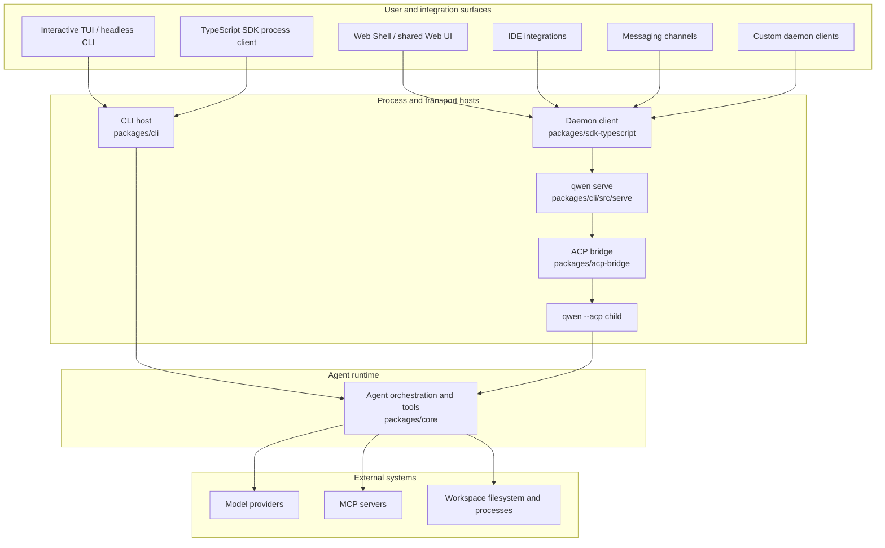

# Qwen Code 아키텍처 개요

Qwen Code는 대화형 터미널, 헤드리스 및 프로그램적 실행, Agent Client Protocol(ACP), 장실행 HTTP 데몬, 웹 및 IDE 클라이언트, 그리고 메시징 채널 어댑터를 지원하는 모노레포입니다. 이 문서에서는 이러한 표면들을 구현하는 패키지를 매핑하고 주요 런타임 경계를 설명합니다.

데몬 내부에 대한 자세한 내용은 [데몬 문서](./daemon/00-index.md)부터 시작하세요. HTTP 요청 및 이벤트 형태는 [`qwen serve` 프로토콜 레퍼런스](./qwen-serve-protocol.md)를 참조하세요.

## 시스템 개관

Qwen Code에는 두 가지 에이전트 실행 모델이 있습니다:

- **직접 실행:** 대화형 TUI와 헤드리스 CLI가 에이전트 런타임을 직접 구성하고 실행합니다.
- **ACP 실행:** `qwen --acp`는 ACP 트랜스포트 뒤에서 에이전트를 호스팅합니다. ACP 클라이언트가 직접 구동하거나, 공유 ACP 브리지를 통해 `qwen serve`가 구동할 수 있습니다.

`qwen serve`는 ACP 실행 위에 HTTP + Server-Sent Events(SSE) 제어 평면을 추가하여 여러 클라이언트가 장기 생존하는 워크스페이스 범위 런타임을 사용할 수 있게 합니다.

다이어그램은 주요 프로덕션 경로를 보여줍니다. 일부 어댑터는 독립 실행 모드도 있습니다. 예를 들어 `qwen channel start`는 HTTP 데몬 없이 ACP 브리지를 사용합니다. 이러한 변형에 대해서는 [채널 플러그인 가이드](./channel-plugins.md#runtime-modes)를 참조하세요.

## 저장소 레이아웃

| 경로                                                                                                         | 책임                                                                                                                                                                                                                       |
| ------------------------------------------------------------------------------------------------------------ | -------------------------------------------------------------------------------------------------------------------------------------------------------------------------------------------------------------------------- |
| `packages/cli`                                                                                               | `qwen` 실행 파일, 인자 파싱, 설정 조합, Ink TUI, 헤드리스 출력, ACP 진입점, `qwen serve`, 그리고 명령별 어댑터.                                                                                                            |
| `packages/core`                                                                                              | UI 독립 에이전트 오케스트레이션, 모델 제공자 통합, 프롬프트 및 컨텍스트 구성, 도구 등록 및 실행, 권한, 세션, 메모리, 텔레메트리, 그리고 공유 서비스.                                                                        |
| `packages/acp-bridge`                                                                                        | ACP 채널 수명주기, 세션 멀티플렉싱, 이벤트 전달, 권한 중재, 프로세스 생성, 그리고 데몬과 어댑터 호스트가 공유하는 파일시스템 경계.                                                                                        |
| `packages/sdk-typescript`                                                                                    | `query()`를 통한 프로그램적 프로세스 실행과 `qwen serve`용 HTTP/SSE 클라이언트 및 트랜스크립트 프로젝션.                                                                                                                  |
| `packages/webui`                                                                                             | TypeScript SDK 위에 구축된 공유 React 컴포넌트와 데몬 React 어댑터.                                                                                                                                                        |
| `packages/web-shell`                                                                                         | `packages/webui`와 데몬 SDK 위에 구축된 터미널 스타일 브라우저 UI.                                                                                                                                                         |
| `packages/web-templates`                                                                                     | 임베딩 가능한 JavaScript 및 CSS 문자열로 패키징된 웹 템플릿.                                                                                                                                                               |
| `packages/audio-capture`                                                                                                                                                       | 음성 입력을 위한 네이티브 마이크 캡처.                                                                                                                                                                                     |
| `packages/channels`                                                                                                                                                            | 메시징 서비스를 위한 공유 채널 런타임 및 플랫폼 어댑터.                                                                                                                                                                    |
| `packages/desktop-shell`, `packages/vscode-ide-companion`, `packages/chrome-extension`, `packages/zed-extension` | 호스트 환경에 맞게 Qwen Code를 적응시키는 제품 및 에디터 표면.                                                                                                                                                             |
| `packages/sdk-java`, `packages/sdk-python`                                                                                                                                 | 언어별 프로그램적 클라이언트.                                                                                                                                                                                              |
| `packages/cua-driver`, `packages/mobile-mcp`                                                                 | MCP 호환 경계를 통해 노출되는 컴퓨터 사용 및 모바일 기기 통합.                                                                                                                                                             |
| `integration-tests`                                                                                                                                                          | CLI, 대화형, SDK, 샌드박스, hook, 터미널 동작에 대한 엔드투엔드 테스트.                                                                                                                                                    |
| `docs` and `docs-site`                                                                                                                                                       | 사용자, 개발자, 프로토콜, 설계 문서 및 문서 사이트.                                                                                                                                                                         |
| `scripts`                                                                                                                                                                    | 빌드, 패키징, 릴리스, 검증, 그리고 저장소 유지보수 자동화.                                                                                                                                                                 |

대부분의 코드는 `packages/` 아래의 npm 워크스페이스에 존재합니다. 패키지는 상대 경로를 통해 다른 패키지의 소스 트리로 진입하는 대신 선언된 공개 익스포트를 통해 의존해야 합니다.

## 패키지 경계

### CLI 및 프레젠테이션 표면

`packages/cli`는 실행 파일을 소유하고 커맨드라인 인자에서 런타임 모드를 선택합니다. 사용자 및 워크스페이스 설정을 로드하고, 코어 구성을 생성하고, 필요시 요청된 샌드박스에 진입한 다음, 대화형, 헤드리스, ACP, 데몬, 채널, 또는 유지보수 플로우 중 하나를 시작합니다.

프레젠테이션은 코어 런타임 외부에 남습니다:

- Ink TUI는 로컬 대화형 세션을 렌더링합니다.
- `packages/webui`는 데몬 상태를 React 제공자 및 hook에 적응시킵니다.
- `packages/web-shell`은 브라우저 터미널 경험을 제공합니다.
- IDE 및 채널 패키지는 호스트별 이벤트를 공유 클라이언트 또는 브리지 계약으로 변환합니다.

### 코어 런타임

`packages/core`는 에이전트 루프를 소유합니다. 모델 요청을 구성하고, 대화 컨텍스트를 유지하고, 도구 호출을 디스패치하고, 권한 정책을 적용하고, 구조화된 이벤트와 결과를 활성 호스트에 반환합니다. 내장 도구는 파일 작업, 셸 실행, 검색, 플래닝, 웹 접근, 메모리, skill, 서브에이전트를 커버합니다. MCP는 런타임을 특정 통합에 결합하지 않고 도구 및 리소스 표면을 확장합니다.

코어 패키지는 결과 표시 방식이나 원격 클라이언트 전송 방식을 결정하지 않습니다. 이러한 결정은 CLI, 브리지, SDK, UI 레이어에 속합니다.

### ACP 브리지

`packages/acp-bridge`는 호스트 프로세스를 ACP 에이전트 런타임에 연결합니다. 주요 책임은 다음과 같습니다:

- ACP 채널을 생성하거나 연결합니다.
- 세션과 클라이언트를 멀티플렉스합니다.
- 프롬프트, 취소, ACP 알림을 전달합니다.
- 권한 요청을 중재합니다.
- 제한된 세션 이벤트 스트림을 발행합니다.
- 호스트에 워크스페이스 파일시스템 인터페이스를 제공합니다.

브리지는 프로덕션에서 실제 `qwen --acp` 자식 프로세스를 사용하거나 테스트에서 인메모리 채널을 사용할 수 있습니다. 공개 진입점에 대해서는 [`@qwen-code/acp-bridge` README](../../packages/acp-bridge/README.md)를 참조하세요.

### SDK 및 UI 어댑터

TypeScript SDK는 두 가지 클라이언트 스타일을 노출합니다:

- `query()`는 프로그램적 로컬 사용을 위해 Qwen Code 프로세스를 시작하고 제어합니다.
- 데몬 클라이언트는 HTTP와 SSE를 통해 `qwen serve`와 통신합니다.

`packages/webui`는 데몬 클라이언트 위에 React 상태 레이어를 구축하고, `packages/web-shell`은 해당 상태 레이어 위에 브라우저 UI를 구축합니다. IDE 통합 및 데몬 관리 채널을 포함한 다른 클라이언트는 서버 구현 코드를 임포트하는 대신 동일한 SDK와 이벤트 계약을 재사용합니다.

## 런타임 플로우

### 직접 CLI 플로우

1. CLI가 인자를 파싱하고 사용자, 워크스페이스, 환경, 커맨드라인 구성을 해석합니다.
2. 샌드박싱을 준비하고 코어 런타임 구성을 생성합니다.
3. 코어 런타임이 모델 요청을 구축하고 에이전트/도구 루프에 진입합니다.
4. 도구 호출이 권한 정책에 따라 확인되고 활성 워크스페이스 환경에서 실행됩니다.
5. CLI가 TUI에서 증분 이벤트를 렌더링하거나 헤드리스 출력을 위해 직렬화합니다.

### 데몬 플로우

1. 클라이언트가 TypeScript SDK 또는 문서화된 HTTP API를 사용하여 `qwen serve`에 연결합니다.
2. 데몬이 요청을 인증하고 요청된 작업을 소유하는 워크스페이스를 해석합니다.
3. 워크스페이스 런타임이 ACP 브리지를 통해 에이전트 작업을 `qwen --acp` 자식으로 전달합니다.
4. 자식이 직접 실행과 동일한 코어 에이전트 및 도구 로직을 실행합니다.
5. 응답과 알림이 브리지를 통해 반환되고, 세션 이벤트가 SSE를 통해 클라이언트에 전달됩니다.

멀티 워크스페이스 세션이 활성화되면, 각 활성 워크스페이스 런타임은 자체 브리지와 ACP 자식을 소유합니다. 파일시스템 접근, 환경 오버레이, MCP 트랜스포트, 세션, 그리고 장애 처리는 해당 해석된 런타임으로 범위가 지정됩니다. [데몬 아키텍처](./daemon/01-architecture.md)에서는 프로세스 토폴로지, 신뢰 경계, 이벤트 리플레이, 수명주기를 자세히 문서화합니다.

## 확장 지점

Qwen Code는 여러 레이어에서 확장할 수 있습니다:

- **MCP 서버**는 코어 런타임에 도구, 프롬프트, 리소스를 추가합니다.
- **Extension 및 skill**은 재사용 가능한 명령, 구성, 에이전트 동작을 패키징합니다.
- **채널 플러그인**은 메시징 플랫폼을 공유 채널 런타임에 적응시킵니다.
- **SDK 클라이언트**는 커스텀 로컬 또는 데몬 지원 애플리케이션을 구축합니다.
- **UI 어댑터**는 공유 데몬 이벤트를 호스트별 상태 및 프레젠테이션으로 프로젝션합니다.

플랫폼별 관심사는 어댑터에 유지하세요. 공유 에이전트 동작은 코어 런타임에 속하고, 트랜스포트 및 와이어 동작은 ACP 브리지, SDK, 또는 데몬 호스트에 속합니다.

## 구성 및 상태

CLI는 런타임을 구성하기 전에 커맨드라인 인자, 환경 변수, 사용자 설정, 워크스페이스 설정, 그리고 기본값에서 유효 구성을 조합합니다. 코어는 해석된 구성을 수신하며 프레젠테이션별 입력을 직접 읽지 않습니다. 지원되는 설정과 범위에 대해서는 [Settings](../users/configuration/settings.md)를 참조하세요.

직접 세션은 공유 코어 서비스를 통해 히스토리와 메타데이터를 지속합니다. 데몬 모드에서는 데몬이 소유 워크스페이스를 해석하고 워크스페이스 및 세션 범위 작업을 클라이언트에 노출합니다. ACP 자식은 활성 에이전트 실행의 소유자로 남습니다.

## 다음 단계

- [데몬 개발자 문서](./daemon/00-index.md)
- [`qwen serve` HTTP 프로토콜](./qwen-serve-protocol.md)
- [TypeScript SDK](../../packages/sdk-typescript/README.md)
- [ACP 브리지](../../packages/acp-bridge/README.md)
- [채널 플러그인 개발자 가이드](./channel-plugins.md)
- [도구 개발](./tools/introduction.md)
- [통합 테스트](./development/integration-tests.md)
