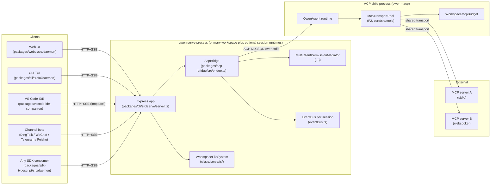
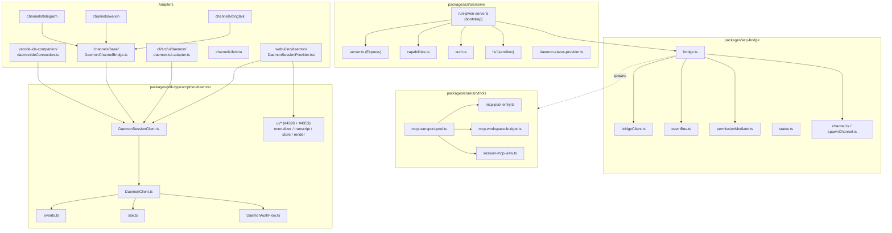
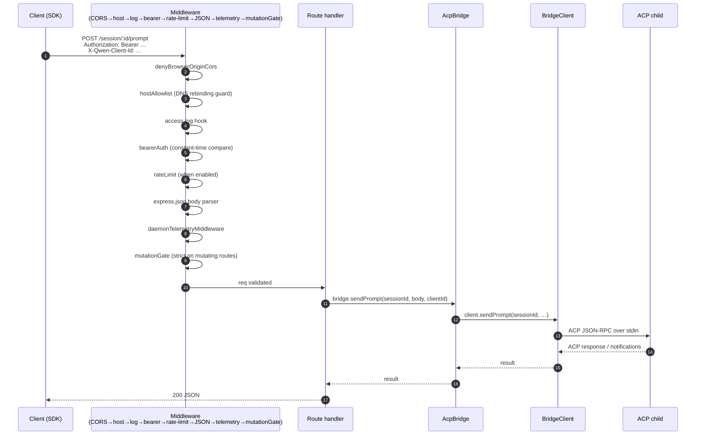
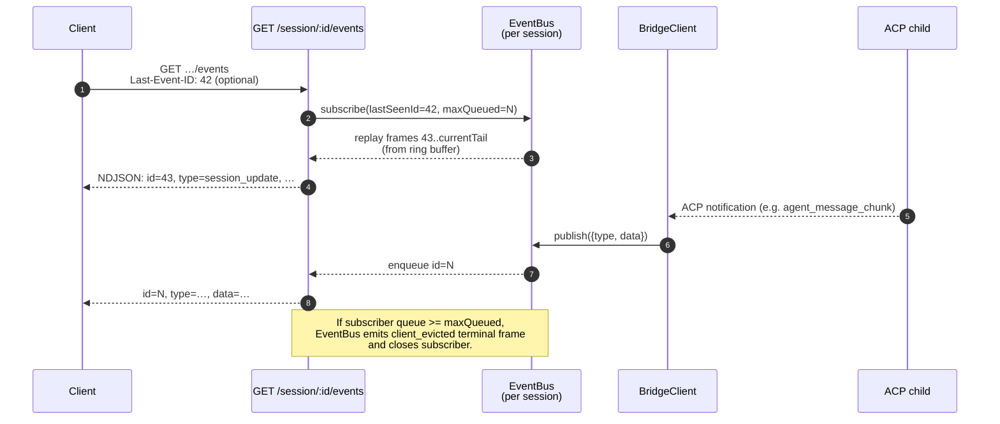
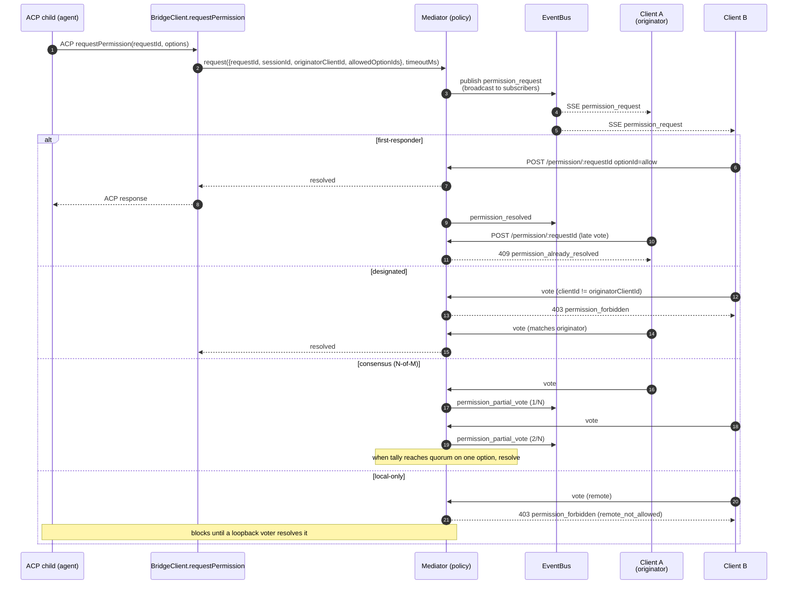
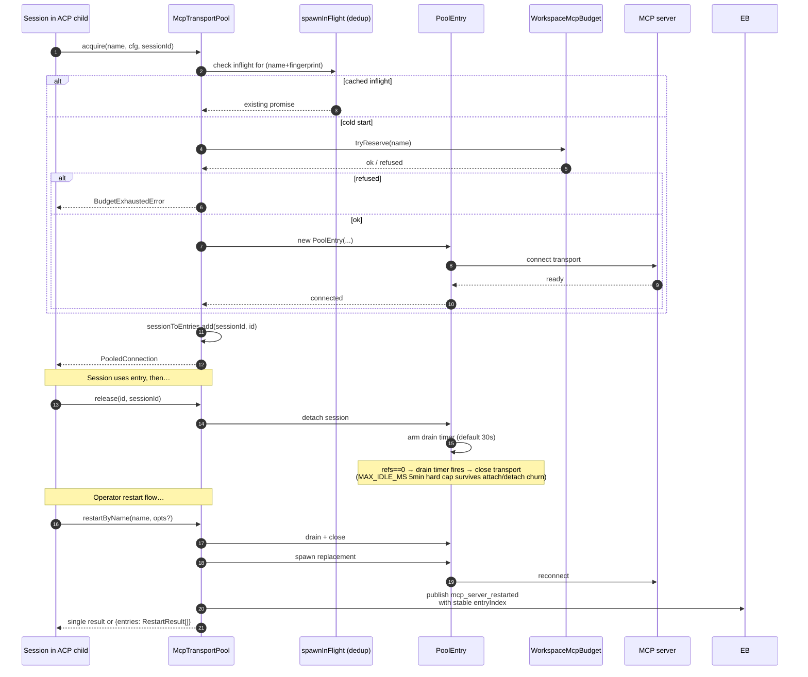
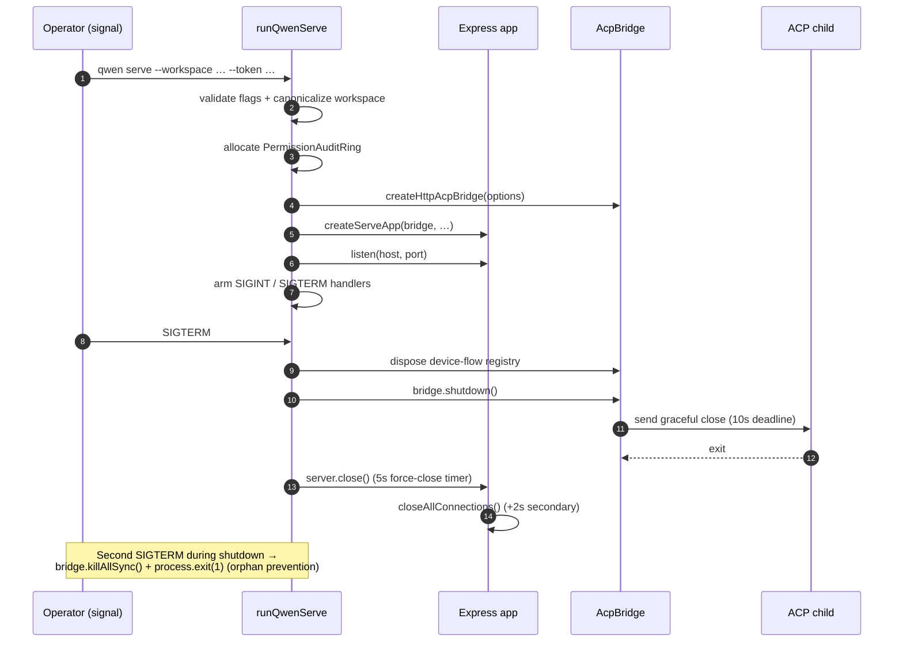

# 데몬 아키텍처

## 개요

`qwen serve` 프로세스는 기본적으로 하나의 Express HTTP 서버와 하나의 기본 워크스페이스를 호스팅합니다. `multi_workspace_sessions`가 활성화되면 활성 세션의 폐쇄 루프를 위해 추가 워크스페이스 런타임을 호스팅할 수 있습니다. 각 등록된 워크스페이스는 자체 `@qwen-code/acp-bridge` / `qwen --acp` 자식 쌍을 소유합니다. 여러 클라이언트(CLI TUI, IDE 컴패니언, IM 채널 봇, 웹 BFF, 커스텀 스크립트)가 HTTP + SSE를 통해 연결되며 하나의 ACP 세션을 공유(`sessionScope: 'single'`, 기본값)하거나 대화 스레드별로 세션을 분할(`sessionScope: 'thread'`)합니다.

ACP 자식 내부에서 MCP 서버는 `McpTransportPool` (F2)을 통해 워크스페이스 전체에서 공유됩니다. 단일 (서버 이름 + 구성 핑거프린트) 튜플은 세션이 어떻게 발견하든 하나의 MCP 트랜스포트에 매핑됩니다. 브리지의 `MultiClientPermissionMediator` (F3)는 4가지 정책 중 하나 아래에서 모든 연결된 클라이언트의 권한 투표를 조정합니다.

이 문서는 나머지 문서 세트의 기반이 되는 **시스템 수준 그림**을 제공합니다. 각 주요 플로우가 Mermaid 시퀀스 다이어그램으로 표시됩니다. 컴포넌트별 구현 세부사항은 다른 18개 문서에 있습니다.

## 프로세스 토폴로지

데몬 프로세스와 ACP 자식은 `AcpChannel`로 연결됩니다(기본값: 실제 서브프로세스 stdio 파이프 쌍. 테스트용 `inMemoryChannel`). 데몬이 하는 모든 것은 이 분할에 의해 형성됩니다: HTTP와 SSE 트래픽은 데몬에서 종료되고, 에이전트 결정과 도구 호출은 자식에서 발생하며, 브리지가 둘을 연결합니다.

## 패키지 맵

세 가지 신뢰 경계가 중요합니다: HTTP 엣지(`serve/auth.ts` 미들웨어 체인), 브리지-ACP-자식 경계(stdio를 통한 NDJSON, 인증 없음. 자식은 브리지를 암묵적으로 신뢰), 에이전트-MCP-서버 경계(에이전트가 호스트에 접근하는 도구를 호출할 수 있음).

## 워크플로우 1: HTTP 요청 수명주기

스트리밍이 아닌 라우트(prompt, cancel, model switch, metadata, workspace CRUD)는 단일 JSON 응답으로 종료됩니다. 스트리밍 출력은 이 연결의 청크화된 HTTP 본문이 **아닌** SSE 채널에서 대역외로 전달됩니다. 워크플로우 2를 참조하세요.

## 워크플로우 2: SSE 이벤트 전달 및 리플레이

링 버퍼는 제한되어 있습니다(`eventRingSize`, 기본값 8000). `Last-Event-ID`가 링의 헤드보다 오래된 재연결 클라이언트는 `state_resync_required`를 수신하며 `loadSession`의 제한된 리플레이 스냅샷 창에서 재구축하거나 로컬 히스토리가 이미 있는 경우 `resumeSession`을 사용해야 합니다. 느린 클라이언트는 큐 채움 75%에서 `slow_client_warning`를, 한도에서 `client_evicted`를 트리거합니다.

## 워크플로우 3: 멀티 클라이언트 권한 중재

정책 간 탈출구: 모든 클라이언트는 `CANCEL_VOTE_SENTINEL`에 투표하여 요청을 `cancelled / agent_cancelled`로 단락 회로할 수 있습니다. 브리지는 일반 `optionId` 필드를 통해 와이어 호출자가 센티널을 밀반입하는 것을 방지합니다(`InvalidPermissionOptionError`).

## 워크플로우 4: MCP 트랜스포트 풀 획득 / 해제 / 재시작

`releaseSession(sessionId)`는 역 `sessionToEntries` 인덱스를 사용하여 세션이 보유한 모든 엔트리를 O(refs)로 해제합니다. 데몬 종료 시 `drainAll()`은 `draining` 플래그를 설정(새 획득 거부)하고 구성 가능한 타임아웃 내에서 모든 엔트리가 종료되기를 기다립니다.

## 워크플로우 5: 수명주기 — 시작 및 우아한 종료

2단계 종료가 중요한 이유는 인플라이트 HTTP 요청, 인플라이트 SSE 구독자, ACP 자식의 인플라이트 도구 호출 모두 제한된 분해 창이 필요하기 때문입니다. 어떤 것이든 해당 데드라인을 초과하면 강제 종료 경로가 인계되므로 멈춘 자식이 데몬 프로세스를 계속 살릴 수 없습니다.

## 주요 파일

| 관심사             | 파일                                                        |
| ------------------ | ----------------------------------------------------------- |
| 부트스트랩         | `packages/cli/src/serve/run-qwen-serve.ts`                  |
| Express 앱         | `packages/cli/src/serve/server.ts`                          |
| 기능 레지스트리    | `packages/cli/src/serve/capabilities.ts`                    |
| 인증 미들웨어      | `packages/cli/src/serve/auth.ts`                            |
| 브리지             | `packages/acp-bridge/src/bridge.ts`                         |
| BridgeClient       | `packages/acp-bridge/src/bridgeClient.ts`                   |
| 권한 중재자        | `packages/acp-bridge/src/permissionMediator.ts`             |
| EventBus           | `packages/acp-bridge/src/eventBus.ts`                       |
| MCP 트랜스포트 풀  | `packages/core/src/tools/mcp-transport-pool.ts`             |
| 워크스페이스 MCP 예산 | `packages/core/src/tools/mcp-workspace-budget.ts`        |
| 워크스페이스 FS    | `packages/cli/src/serve/fs/`                                |
| SDK DaemonClient   | `packages/sdk-typescript/src/daemon/DaemonClient.ts`        |
| SDK SessionClient  | `packages/sdk-typescript/src/daemon/DaemonSessionClient.ts` |
| 이벤트 스키마      | `packages/sdk-typescript/src/daemon/events.ts`              |

## 레퍼런스

- 설계 이슈: [#3803](https://github.com/QwenLM/qwen-code/issues/3803) (데몬 설계), [#4175](https://github.com/QwenLM/qwen-code/issues/4175) (F-series 마일스톤).
- 사용자 가이드: [`../../users/qwen-serve.md`](../../users/qwen-serve.md).
- 와이어 프로토콜 레퍼런스: [`../qwen-serve-protocol.md`](../qwen-serve-protocol.md).
- F2 설계 문서: [`../../design/f2-mcp-transport-pool.md`](../../design/f2-mcp-transport-pool.md).
- F2 설계 노트: 이슈 [#4175](https://github.com/QwenLM/qwen-code/issues/4175) 커밋 4-6.
