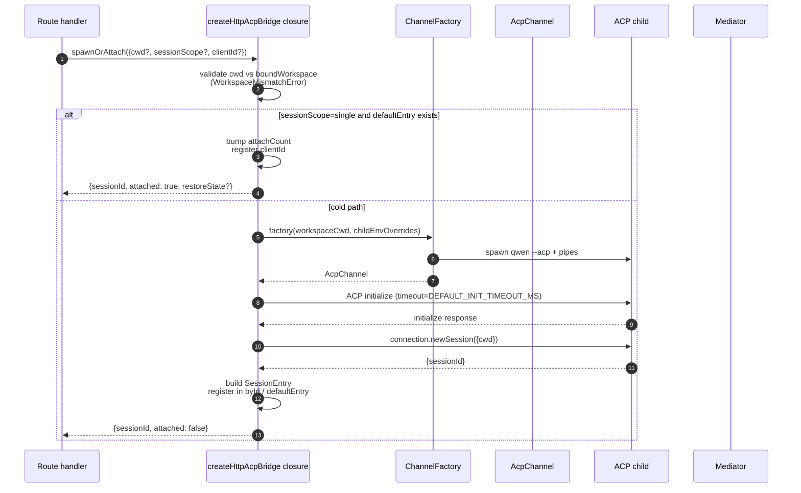
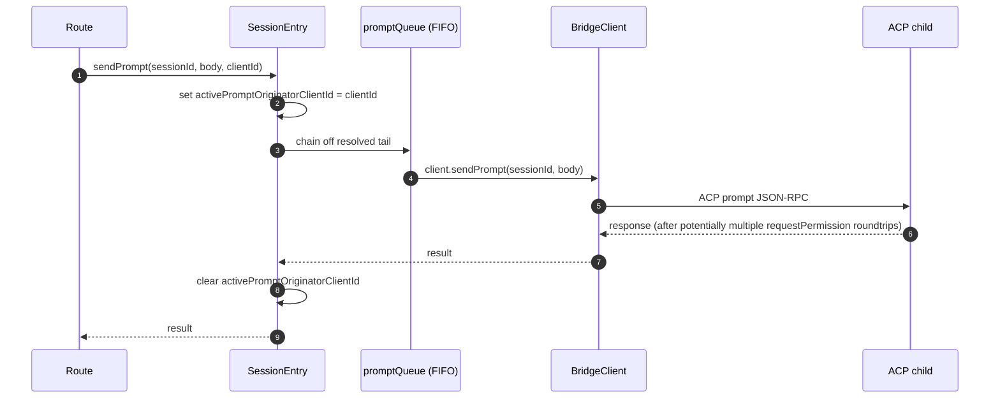
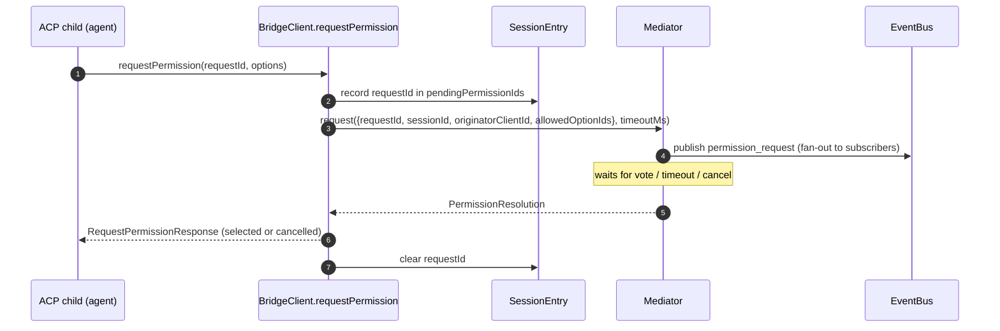
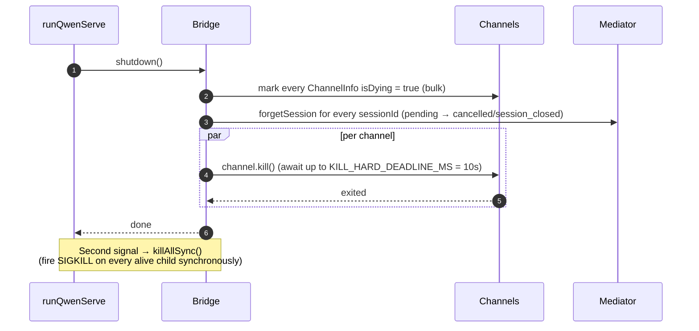

# ACP 브리지

## 개요

`packages/acp-bridge/`는 데몬의 HTTP 레이어와 ACP 자식 프로세스 사이의 경계를 소유합니다. `packages/cli/src/serve/`(`qwen serve` 데몬)에 의해 소비되며, 향후 소비자(`channels/base/AcpBridge.ts`, VS Code IDE 컴패니언)가 CLI 패키지에 접근하지 않고 동일한 브리지 코어를 사용할 수 있도록 #4175 F1 3단계에서 추출되었습니다.

각 활성 `WorkspaceRuntime`은 하나의 `HttpAcpBridge` 인스턴스를 소유합니다. 프로덕션에서는 기본 브리지를 예열하고 실패 시 첫 사용 시 재시도합니다. 신뢰된 보조는 온디맨드로 `AcpChannel`을 열고 자식을 시작합니다. 신뢰되지 않은 보조는 ACP를 시작할 수 없습니다. 런타임 내에서 브리지는 채널 위에 멀티플렉스된 세션, 세션별 `EventBus`, `MultiClientPermissionMediator`, `BridgeFileSystem` 어댑터, ACP 지향 헬퍼(`spawnOrAttach`, `loadSession`, `resumeSession`, `sendPrompt`, `cancelSession`, `respondToPermission`, 워크스페이스 상태 및 MCP 재시작을 위한 extMethod RPC)를 제공합니다. 브리지와 자식은 워크스페이스 런타임 간에 공유되지 않습니다.

## 책임

- 플러그 가능한 `ChannelFactory`를 통해 ACP 자식을 생성하거나 연결합니다. 기본 팩토리: `defaultSpawnChannelFactory` (서브프로세스 `qwen --acp`). 테스트는 `inMemoryChannel`을 주입합니다.
- `aliveChannels`(채널 레지스트리)와 `byId`(세션 레지스트리)를 유지합니다.
- 하나의 워크스페이스 런타임에 대한 N개의 HTTP 측 세션을 `connection.newSession()`을 통해 ACP 자식에 멀티플렉스합니다.
- `promptQueue`를 통해 세션별 프롬프트를 직렬화합니다(ACP는 세션당 하나의 활성 프롬프트를 강제합니다).
- `setSessionModel` 호출에 대한 세션별 FIFO로, 다른 모델을 가진 동시 연결이 에이전트와 경합하지 않습니다.
- `GET /session/:id/events`를 구동하는 세션별 `EventBus`([`10-event-bus.md`](./10-event-bus.md) 참조).
- 권한 플로우: `BridgeClient.requestPermission` → `MultiClientPermissionMediator.request` → 팬아웃 → 투표 수집 → ACP 응답([`04-permission-mediation.md`](./04-permission-mediation.md) 참조).
- 파일 I/O: ACP 읽기 및 쓰기를 위한 `BridgeFileSystem` 어댑터. 동일 호스트 데몬 런타임은 `readTextFile: false`를 광고하므로 일반 텍스트 읽기는 자식 내에 유지되고 최종 텍스트 쓰기는 위임된 상태로 유지됩니다([`07-workspace-filesystem.md`](./07-workspace-filesystem.md) 참조).
- 워크스페이스 수준 상태(`/workspace/mcp`, `/workspace/skills`, `/workspace/providers`), MCP 재시작, 선택적 비공개 관리 Tool Guard 콜백을 위한 extMethod RPC.
- 수명주기: 채널당 `KILL_HARD_DEADLINE_MS`(10초)를 가진 우아한 `shutdown()`. 두 번째 시그널 강제 종료를 위한 동기 `killAllSync()`.

## 아키텍처

**공개 진입점**: `packages/acp-bridge/src/bridge.ts`의 `createHttpAcpBridge(opts: BridgeOptions): HttpAcpBridge`.

**주요 타입**:

| 타입                            | 파일                    | 역할                                                                                                                                                                                                                         |
| ------------------------------- | ----------------------- | ---------------------------------------------------------------------------------------------------------------------------------------------------------------------------------------------------------------------------- |
| `HttpAcpBridge`                 | `bridgeTypes.ts`        | 공개 인터페이스: `spawnOrAttach`, `loadSession`, `resumeSession`, `sendPrompt`, `cancelSession`, `subscribeEvents`, `respondToPermission`, `getWorkspaceMcpStatus`, `restartMcpServer`, `shutdown`, `killAllSync`, …         |
| `BridgeSession`                 | `bridgeTypes.ts`        | HTTP 핸들러에 반환되는 `{ sessionId, workspaceCwd, attached, clientId?, createdAt? }`.                                                                                                                                       |
| `BridgeOptions`                 | `bridgeOptions.ts`      | 생성 시 구성([구성](#configuration) 참조).                                                                                                                                                                                  |
| `AcpChannel`                    | `channel.ts`            | `{ stream, kill(), killSync(), exited }` — 하나의 ACP NDJSON 채널.                                                                                                                                                          |
| `ChannelFactory`                | `channel.ts`            | `(workspaceCwd, childEnvOverrides?) => Promise<AcpChannel>`.                                                                                                                                                                 |
| `BridgeClient`                  | `bridgeClient.ts`       | 하나의 ACP `ClientSideConnection`을 래핑합니다. ACP `Client`를 구현합니다(`requestPermission`, `readTextFile`, `writeTextFile`, `sessionUpdate`, `extNotification`).                                                        |
| `EventBus`                      | `eventBus.ts`           | 세션별 인메모리 pub/sub. [`10-event-bus.md`](./10-event-bus.md) 참조.                                                                                                                                                       |
| `MultiClientPermissionMediator` | `permissionMediator.ts` | 4가지 정책 중재자. [`04-permission-mediation.md`](./04-permission-mediation.md) 참조.                                                                                                                                        |

**내부 상태 (`createHttpAcpBridge`에 의해 클로저)**:

| 상태            | 형태                          | 목적                                                                                                                                                                                                                                                                                                                                                                                |
| --------------- | ----------------------------- | ----------------------------------------------------------------------------------------------------------------------------------------------------------------------------------------------------------------------------------------------------------------------------------------------------------------------------------------------------------------------------------- |
| `aliveChannels` | `Map<string, ChannelInfo>`    | 채널 ID로 키된 채널 레지스트리. 각 `ChannelInfo`는 `channel`, `connection`, `client`(채널당 하나의 `BridgeClient`), `sessionIds: Set<string>`, `pendingRestoreIds`, `statusClosedReject?`, `isDying: boolean`를 보유합니다.                                                                                                                                                          |
| `byId`          | `Map<string, SessionEntry>`   | sessionId로 키된 세션 레지스트리. 각 `SessionEntry`는 `channel`, `connection`, `events: EventBus`, `promptQueue: Promise<void>`, `modelChangeQueue: Promise<void>`, `pendingPermissionIds: Set<string>`, `clientIds: Map<string, count>`, `activePromptOriginatorClientId?`, `attachCount`, `spawnOwnerWantedKill`, `restoreState?`, `sessionLastSeenAt?`, `clientLastSeenAt: Map<string, ms>`를 보유합니다. |
| `defaultEntry`  | `SessionEntry \| null`        | `sessionScope: 'single'`일 때 사용되는 "single" 세션.                                                                                                                                                                                                                                                                                                                               |
| `defaultPolicy` | `PermissionPolicy`            | `BridgeOptions.permissionPolicy`를 통해 구성됩니다.                                                                                                                                                                                                                                                                                                                                  |
| `mediator`      | `MultiClientPermissionMediator` | 브리지 인스턴스당 하나.                                                                                                                                                                                                                                                                                                                                                             |
| 상수            | —                             | `DEFAULT_INIT_TIMEOUT_MS = 10_000`, `MCP_RESTART_TIMEOUT_MS = 300_000`, `DEFAULT_MAX_SESSIONS = 32`, `MAX_EVENT_RING_SIZE = 1_000_000`, `DEFAULT_PERMISSION_TIMEOUT_MS = 5분`, `DEFAULT_MAX_PENDING_PER_SESSION = 64`.                                                                                                                                                                |

**`isDying` 불변식**: 모든 종료 경로는 `channel.kill()`을 await하기 **전에** `ChannelInfo.isDying = true`를 동기적으로 설정해야 합니다. `ensureChannel`은 dying 채널을 부재로 취급하고 새 채널을 생성합니다. 이 플래그 없이는 SIGTERM 유예 창(최대 10초) 동안 도착하는 동시 `spawnOrAttach`가 곧 종료될 트랜스포트에 연결되고 호출자의 sessionId가 후속 작업에서 모두 404를 받을 수 있습니다. **설정 사이트**(동기화 유지 필요): `ensureChannel`(초기화 실패 + 지연 종료 재검사), `doSpawn`(빈 채널의 newSession 실패), `killSession`(마지막 세션 퇴장), `shutdown`(일괄).

**`channelInfo` 보존 불변식**: `isDying = true`를 설정할 때 `channelInfo`를 지우지 **마세요**. `killAllSync`는 SIGTERM 유예 창 동안 채널을 찾아 `process.exit(1)`에서 SIGKILL을 발생시켜야 합니다. `aliveChannels`는 `channel.exited`가 발생할 때까지 dying 엔트리를 보유합니다.

**BridgeClient 제한된 버퍼링**: `byId`에 아직 없는 sessionId에 대해 `BridgeClient`에 도착하는 ACP `extNotification` 프레임(`connection.newSession`의 응답이 아직 반환되지 않았지만 `newSession` 내부의 MCP 발견이 이미 예산 이벤트를 발생시킨 경우)은 `MAX_EARLY_EVENT_SESSIONS = 64` × `MAX_EARLY_EVENTS_PER_SESSION = 32` × `EARLY_EVENT_TTL_MS = 60_000`으로 제한된 초기 이벤트 큐에 버퍼링됩니다. 최악의 경우 약 400KB의 힙입니다. 버퍼링 없이는 새 세션의 첫 SSE 리플레이 링 슬롯이 생성 중에 발생한 이벤트를 놓치게 됩니다.

## 워크플로우

### `spawnOrAttach` (주요 진입점)

주요 사항:

- 기존 `defaultEntry`가 있는 `sessionScope='single'`은 `attachCount`를 증가시키고, `clientId`를 등록하고, `attached: true`를 반환합니다.
- 콜드 경로는 ChannelFactory를 실행하고, ACP `initialize`(`DEFAULT_INIT_TIMEOUT_MS=10초`)를 수행하고, `connection.newSession({cwd})`를 호출한 다음 새 `SessionEntry`를 등록합니다.
- `byId.size >= maxSessions`일 때 `SessionLimitExceededError`가 throw됩니다.
- `X-Qwen-Client-Id`가 `[A-Za-z0-9._:-]{1,128}` 범위를 벗어나면 `InvalidClientIdError`가 throw됩니다.
- `server.ts`의 연결 끊김 리퍼는 `attachCount`/`spawnOwnerWantedKill`을 통해 생성 소유자를 추적하여 생성 소유자가 연결을 끊었지만 다른 클라이언트가 이미 연결된 세션을 분해하지 않습니다(#3889 BQ9tV 검토).

### 프롬프트 직렬화

큐 꼬리에서의 실패는 이전 프롬프트의 거부가 후속 프롬프트를 오염시키지 않도록 **삼켜집니다**. 원래 호출자는 여전히 자체 반환된 프롬리스에서 거부를 받습니다. 세션에 캐시된 `transportClosedReject`는 프롬리스 프라미스를 `channel.exited`와 경합시켜 크래시된 자식이 중단 없이 즉시 표면화됩니다.

### 권한 플로우 (고수준)

`InvalidPermissionOptionError`는 와이어 투표가 일반 `optionId` 필드를 통해 `CANCEL_VOTE_SENTINEL`을 주입하려고 할 때 중재자 이전에 throw됩니다. 센티널은 요청을 `cancelled / agent_cancelled`로 단락 회로하는 브리지의 유일한 탈출구이며 실수로 와이어에서 접근할 수 없어야 합니다. [`04-permission-mediation.md`](./04-permission-mediation.md) 참조.

### 종료

## 채널 팩토리

`AcpChannel`(`channel.ts`)는 브리지의 트랜스포트 추상화입니다. 프로덕션은 `spawnChannel.ts`의 `defaultSpawnChannelFactory`를 사용하며, stdio 파이프 쌍으로 `qwen --acp`를 서브프로세스로 실행합니다. 테스트는 `inMemoryChannel`을 주입하여 에이전트를 인프로세스로 실행합니다. 브리지는 기본 메커니즘에 대해 알지 못합니다 — `{ stream, kill, killSync, exited }`만 필요합니다.

`ChannelFactory`는 `childEnvOverrides`를 허용하므로 각 데몬 핸들이 `process.env`를 변경하지 않고도(두 임베디드 데몬이 같은 Node 프로세스에서 실행되면 경합 발생) 자체 MCP 예산 환경 변수(`QWEN_SERVE_MCP_CLIENT_BUDGET`, `QWEN_SERVE_MCP_BUDGET_MODE`)를 전달할 수 있습니다.

## 상태 및 수명주기

- 브리지 생성은 동기적입니다. 호출자는 첫 세션 전에 채널을 예열할 수 있습니다. 그렇지 않으면 첫 `spawnOrAttach`이 ACP 자식을 콜드 스타트합니다. 실패한 예열은 첫 사용 시 재시도할 수 있습니다.
- `defaultEntry`는 `sessionScope: 'single'`에서 브리지의 수명주기 동안 존재합니다. 채널은 `sessionIds.size === 0`(`killSession` 후) AND `isDying`이 true로 전환될 때 정리됩니다.
- `MAX_EVENT_RING_SIZE = 1_000_000`은 운영자 오타로 인한 세션당 ~500MB OOM을 방지하는 `BridgeOptions.eventRingSize`의 소프트 상한입니다.
- `DEFAULT_PERMISSION_TIMEOUT_MS = 5 * 60 * 1000`은 고정된 권한 요청이 세션별 `promptQueue`를 무기한 차단하는 것을 방지합니다.
- `DEFAULT_MAX_PENDING_PER_SESSION = 64`는 `DEFAULT_MAX_SUBSCRIBERS`를 미러링합니다. 초과 `requestPermission` 호출은 stderr 경고와 함께 cancelled로 해결됩니다.

## 의존성

| 업스트림                                                                                   | 다운스트림                                   |
| ------------------------------------------------------------------------------------------ | -------------------------------------------- |
| `@agentclientprotocol/sdk` — `ClientSideConnection`, `PROTOCOL_VERSION`, ACP 타입           | `packages/cli/src/serve/` (데몬)              |
| `@qwen-code/qwen-code-core` — `ApprovalMode`, `TrustGateError`, `getCurrentGeminiMdFilename` | `packages/channels/base/` (계획, F4)          |
| `node:crypto`, `node:fs`, `node:path`                                                      | `packages/vscode-ide-companion/` (계획, F4)   |

## 구성

`BridgeOptions` (`bridgeOptions.ts`):

| 키                                            | 기본값                                             | 목적                                                                                                                                                     |
| --------------------------------------------- | -------------------------------------------------- | -------------------------------------------------------------------------------------------------------------------------------------------------------- |
| `boundWorkspace`                              | (필수)                                             | 브리지가 강제하는 표준 워크스페이스 경로.                                                                                                                |
| `sessionScope`                                | `'single'`                                         | `'single'`은 모든 클라이언트 간에 하나의 세션을 공유합니다. `'thread'`는 각 대화 스레드별로 별도 세션을 생성합니다.                                       |
| `channelFactory`                              | `defaultSpawnChannelFactory`                       | 플러그 가능한 ACP 자식 팩토리.                                                                                                                           |
| `initializeTimeoutMs`                         | `DEFAULT_INIT_TIMEOUT_MS = 10_000`                 | ACP `initialize` 핸드셰이크 타임아웃.                                                                                                                    |
| `sessionRestoreTimeoutMs`                     | `60_000`                                           | ACP `loadSession` / `unstable_resumeSession` 타임아웃. 기본값 60초이며, 명시적으로 구성된 initialize 타임아웃이 이를 높일 수 있지만 낮출 수는 없습니다.      |
| `maxSessions`                                 | `DEFAULT_MAX_SESSIONS = 32`                        | `byId.size`의 캡. `0` / `Infinity` = 무제한. NaN/음수는 throw.                                                                                           |
| `eventRingSize`                               | `DEFAULT_RING_SIZE` (`eventBus.ts`에서)             | 세션별 이벤트 링. `MAX_EVENT_RING_SIZE`로 소프트 캡.                                                                                                     |
| `permissionResponseTimeoutMs`                 | `DEFAULT_PERMISSION_TIMEOUT_MS = 5분`               | 중재자의 요청별 월클럭.                                                                                                                                  |
| `maxPendingPermissionsPerSession`             | `DEFAULT_MAX_PENDING_PER_SESSION = 64`             | 대량 에이전트에 대한 백프레셔.                                                                                                                         |
| `childEnvOverrides`                           | `{}`                                               | ACP 자식에 대한 핸들별 환경 추가/제거.                                                                                                                   |
| `externalToolGuard`                           | (없음)                                             | 비공개 자식→부모 사전 실행 결정을 위한 선택적 핸들러. 브리지는 현재 활성 프롬프트의 소유 채널에서만 수락합니다.                                             |
| `persistApprovalMode`, `persistDisabledTools` | —                                                  | Wave 4 뮤테이션 라우트를 위한 설정 쓰기 hook.                                                                                                            |
| `contextFilename`                             | `settings.json`의 `context.fileName`에서            | `getCurrentGeminiMdFilename`을 재정의합니다.                                                                                                             |
| `statusProvider`                              | (없음)                                             | 데몬 호스트 프리플라이트 셀(`DaemonStatusProvider`).                                                                                                     |
| `delegateReadTextFileToClient`                | `true`                                             | 동일 호스트 런타임에서만 `false`로 설정하여 자식 `FileSystemService.readTextFile` 소비자가 일반 CLI 파일시스템 서비스를 사용하도록 합니다.                    |
| `fileSystem`                                  | (없음)                                             | ACP `readTextFile` / `writeTextFile`을 위한 `BridgeFileSystem` 어댑터.                                                                                   |
| `permissionPolicy`                            | `settings.json`의 `policy.permissionStrategy`에서    | `first-responder` / `designated` / `consensus` / `local-only` 중 하나.                                                                                   |
| `permissionConsensusQuorum`                   | `settings.json`에서                                 | consensus 정책의 N.                                                                                                                                      |
| `permissionAudit`                             | `createNoOpPermissionAuditPublisher()`              | 감사 추적을 위해 `PermissionAuditRing`에 연결합니다.                                                                                                     |
| `channelIdleTimeoutMs`                        | `0`                                                | 마지막 세션이 닫힌 후 ACP 자식을 이 밀리초 동안 유지합니다.                                                                                               |

## 추가 브리지 메서드

핵심 `spawnOrAttach`, `sendPrompt`, `cancelSession`, `respondToPermission`, `loadSession`, `resumeSession` 호출 외에도 `HttpAcpBridge` 인터페이스에 이제 다음 데몬 대상 헬퍼가 포함됩니다:

| 메서드                                                       | 목적                               |
| ------------------------------------------------------------ | ---------------------------------- |
| `generateSessionRecap(sessionId, context?)`                  | 한 줄 세션 요약을 생성합니다.      |
| `generateSessionBtw(sessionId, question, signal?, context?)` | 사이드 질문 / btw 프롬프트에 답합니다. |
| `executeShellCommand(sessionId, command, signal?, context?)` | 데몬 호스트에서 셸 명령을 실행합니다. |
| `getSessionContextUsageStatus(sessionId, opts?)`             | 컨텍스트 창 사용을 반환합니다.     |
| `getSessionSupportedCommandsStatus(sessionId)`               | 사용 가능한 슬래시 명령어를 반환합니다. |
| `getSessionTasksStatus(sessionId)`                           | 백그라운드 작업 스냅샷을 반환합니다. |
| `getSessionStatsStatus(sessionId)`                           | 세션 사용 통계를 반환합니다.       |
| `setSessionApprovalMode(sessionId, mode, opts, context?)`    | 세션의 승인 모드를 업데이트합니다. |
| `detachClient(sessionId, clientId?)`                         | 클라이언트를 명시적으로 분리합니다. |
| `addRuntimeMcpServer(name, config, originatorClientId)`      | 런타임에 MCP 서버를 추가합니다.    |
| `removeRuntimeMcpServer(name, originatorClientId)`           | 런타임에 MCP 서버를 제거합니다.    |
| `manageMcpServer(serverName, action, originatorClientId)`    | 활성화 / 비활성화 / 인증 / 인증 해제. |
| `generateWorkspaceAgent(description, originatorClientId)`    | AI로 서브에이전트 정의를 생성합니다. |
| `preheat()`                                                  | 첫 세션 전에 ACP 자식을 웜업합니다. |
| `getSessionLastEventId(sessionId)`                           | 세션의 단조 이벤트 ID를 읽습니다.  |
| `getWorkspaceToolsStatus()`                                  | 내장 도구 레지스트리 스냅샷을 반환합니다. |
| `getWorkspaceMcpToolsStatus(serverName)`                     | 특정 MCP 서버의 도구를 반환합니다. |

`BridgeSpawnRequest.sessionScope`는 `'per-client'`에서 `'thread'`로 이름 변경되었습니다. `BridgeRestoredSession`은 이제 `compactedReplay`, `liveJournal`, `lastEventId`를 포함합니다. 해당 리플레이 필드는 활성 세션의 제한된 인메모리 창으로, `BridgeOptions.compactedReplayMaxBytes`(기본 4MiB, 하드 상한 256MiB)로 캡됩니다. 인플라이트 `liveJournal`은 `BridgeOptions.maxJournalEvents`(기본 10,000개의 리플레이 엔트리)와 `BridgeOptions.maxJournalBytes`(기본 8MiB의 직렬화된 소스 이벤트)로 별도로 캡됩니다. 연속적인 호환 텍스트 또는 사고 청크는 리플레이 엔트리를 공유하며, 엔트리당 최대 256개의 소스 이벤트입니다. 다른 이벤트 및 속성 경계는 그대로 유지됩니다. 오래된 보존 리플레이가 삭제된 경우 `compactedReplay[0]`은 ID 없는 `history_truncated` 마커입니다. 저널 엔트리가 삭제된 경우 `liveJournal[0]`은 `scope: 'live_journal'`를 가진 `history_truncated` 마커를 포함합니다. 보존 및 삭제 카운트는 리플레이 엔트리가 아닌 소스 이벤트를 설명합니다. 전체 지속 트랜스크립트는 디스크에 남아 있으며 이 브리지 응답으로 노출되지 않습니다.
`BridgeClientRequestContext`는 브리지 호출을 통해 스레딩되는 요청 컨텍스트입니다. `clientId`, `fromLoopback: boolean`, `promptId`를 포함합니다.

## 주의사항 및 알려진 제한

- `MCP_RESTART_TIMEOUT_MS = 300_000`(5분) — `/workspace/mcp/:server/restart`의 브리지 타임아웃은 `McpClientManager.MAX_DISCOVERY_TIMEOUT_MS`가 stdio 서버의 경우 최대 5분일 수 있기 때문에 의도적으로 큽니다. 더 짧은 데드라인은 ACP 자식이 백그라운드에서 계속 재연결하는 동안 거짓 타임아웃을 발생시킵니다.
- `BridgeOptions.eventRingSize > 1_000_000`은 생성 시 throw합니다.
- `connection.unstable_resumeSession`은 안정적인 `session_resume` 데몬 기능을 통해 노출됩니다. `unstable_session_resume`는 이전 SDK를 위한 지원 중단된 호환성 별칭으로 계속 광고됩니다. 클라이언트는 `session_resume`을 기능 감지해야 합니다.
- 브리지 패키지는 `@qwen-code/acp-bridge`입니다. 현재 코드는 패키지 서브경로에서 이벤트 버스와 상태 원시 요소를 직접 임포트합니다. `serve/acp-session-bridge.ts`는 더 넓은 브리지 표면에 대한 CLI 로컬 호환성 파사드로 남아 있습니다.

## 레퍼런스

- `packages/acp-bridge/src/bridge.ts` (특히 `createHttpAcpBridge`, 350줄+)
- `packages/acp-bridge/src/bridgeClient.ts`
- `packages/acp-bridge/src/bridgeTypes.ts`
- `packages/acp-bridge/src/bridgeOptions.ts`
- `packages/acp-bridge/src/channel.ts`
- `packages/acp-bridge/src/spawnChannel.ts`
- `packages/acp-bridge/src/bridgeErrors.ts`
- 이슈: [#3803](https://github.com/QwenLM/qwen-code/issues/3803), [#4175](https://github.com/QwenLM/qwen-code/issues/4175).
