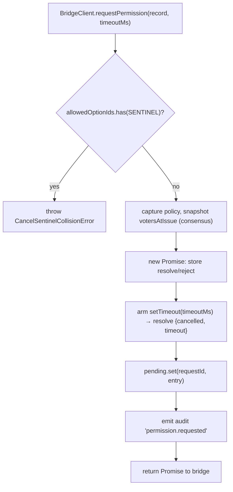
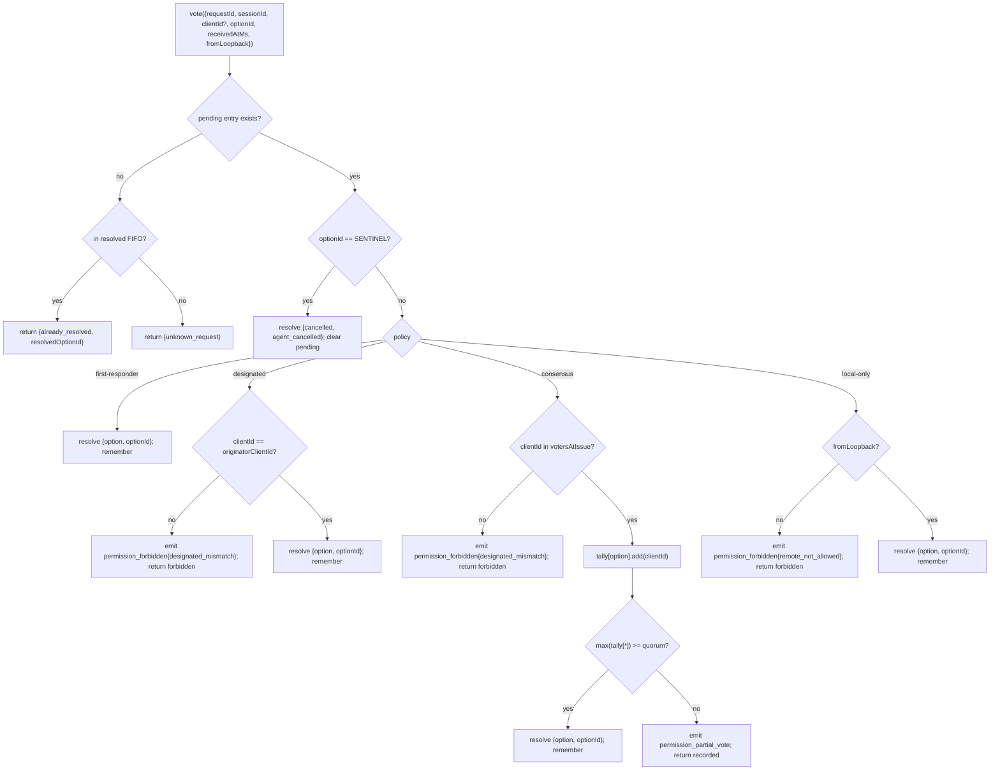

# 다중 클라이언트 권한 중재

## 개요

ACP 자식의 에이전트가 `requestPermission`을 호출하면, 데몬은 단순히 하나의 클라이언트로 전달하지 않습니다. `sessionScope: 'single'`에서는 연결된 모든 클라이언트가 요청을 보며, 그중 어느 클라이언트든 응답할 수 있습니다. 중재가 없으면 늦은 투표는 갈 곳이 없고, 두 클라이언트가 같은 요청을 두고 경합할 수 있으며, 하나의 악성 클라이언트가 원본을 덮어쓸 수 있습니다.

`MultiClientPermissionMediator`(`packages/acp-bridge/src/permissionMediator.ts`)는 `PermissionMediator` 계약(`packages/acp-bridge/src/permission.ts`)을 구현하며, 브리지의 모든 대기 중 및 해결된 권한 상태를 관리합니다. `PermissionPolicy`에 선언된 네 가지 정책 중 하나를 통해 투표를 배분합니다:

| 정책 | 해결 규칙 | 사용 사례 |
| --- | --- | --- |
| `first-responder` | 첫 유효 투표가 승리; 이후 투표자는 `permission_already_resolved`를 받음. | 실시간 크로스 클라이언트 협업 UX(기본값). |
| `designated` | 프롬프트의 `originatorClientId`만 해결할 수 있음; 나머지는 `permission_forbidden{designated_mismatch}`를 받음. | UI 화면이 자체 승인을 소유해야 하는 테넌트별 SaaS. |
| `consensus` | v1 client-id 스냅샷에 걸친 N-of-M 쿼럼; 중간 `permission_partial_vote` 이벤트로 UI가 진행 상황을 표시할 수 있음. | 두 운영자가 합의해야 하는 엔터프라이즈 변경 리뷰. |
| `local-only` | 루프백이 아닌 투표자를 거부; 루프백 클라이언트가 해결할 때까지 대기. | 원격 제어가 권한 상승을 부여하면 안 되는 워크스테이션. |

> **v1 보안 제한**: `X-Qwen-Client-Id`는 자가 보고됩니다. `designated`와
> `consensus`에는 아직 소유 증명이 없습니다. `originatorClientId`를 관찰한
> 클라이언트가 해당 id를 재사용할 수 있습니다. `{outcome:'cancelled'}`도
> 정책 배분 전에 cancel sentinel을 통해 라우팅되므로, `local-only`조차
> cancel을 정책 보호 해결로 취급할 수 없습니다. 강력한 격리를 위해서는
> 데몬을 루프백에 바인딩하거나 인증된 리버스 프록시 뒤에 두어야 합니다.
> [보안 참고: v1 클라이언트 id는 자가 보고됨](#security-note-v1-client-identity-is-self-reported) 참조.

## 책임

- 모든 대기 중 요청 추적(`request → vote → resolved` 수명주기).
- 요청별 벽시계 타임아웃 설정 및 해제(**N1 불변식**: 타임아웃은 `request()` 내부에서 동기적으로 설정되어야 하여, 즉시 취소된 세션이 영구 대기 중인 클로저를 누수하지 않도록 함).
- `request()` 시점에 캡처된 정책을 통해 투표 배분(데몬 정책이 중간에 변경되어도 진행 중인 요청에는 영향 없음).
- 최근 해결된 요청의 제한된 FIFO(`MAX_RESOLVED_PERMISSION_RECORDS = 512`)를 유지하여 중복 투표가 `unknown_request` 대신 구조화된 `already_resolved`를 받도록 함.
- 세션별 EventBus에서 `permission_partial_vote`(consensus) 및 `permission_forbidden`(designated / consensus / local-only) 발행.
- 세션 종료 시 `forgetSession(sessionId)`를 통해 대기 중 요청을 `{kind: 'cancelled', reason: 'session_closed'}`로 해결.
- 와이어를 통한(`InvalidPermissionOptionError`) 및 에이전트가 게시한 옵션 라벨을 통한(`CancelSentinelCollisionError`) `CANCEL_VOTE_SENTINEL`의 악성 또는 실수 주입을 거부.

## 아키텍처

### 공개 인터페이스

```ts
interface PermissionMediator {
  readonly policy: PermissionPolicy;
  request(
    record: PermissionRequestRecord,
    timeoutMs: number,
  ): Promise<PermissionResolution>;
  vote(vote: PermissionVote): PermissionVoteOutcome;
  forgetSession(sessionId: string): void;
}
```

`MultiClientPermissionMediator`는 다음을 추가합니다: `peekSessionFor(requestId)`, `pendingCount(sessionId)`, 내부 감사 퍼블리셔 등. `BridgeClient`는 `request()` 반쪽에만 의존합니다(구조적 서브 타이핑 — `bridgeClient.ts` 참조).

### `PermissionPolicy` 및 `PermissionVoteOutcome`

```ts
type PermissionPolicy =
  | 'first-responder'
  | 'designated'
  | 'consensus'
  | 'local-only';

type PermissionVoteOutcome =
  | { kind: 'resolved'; resolvedOptionId: string }
  | { kind: 'recorded'; votesNeeded: number } // consensus 부분
  | { kind: 'already_resolved'; resolvedOptionId: string }
  | { kind: 'forbidden'; reason: 'designated_mismatch' | 'remote_not_allowed' }
  | { kind: 'unknown_request' };

type PermissionResolution =
  | { kind: 'option'; optionId: string }
  | {
      kind: 'cancelled';
      reason: 'timeout' | 'session_closed' | 'agent_cancelled';
    };
```

### Cancel sentinel

`CANCEL_VOTE_SENTINEL = '__cancelled__'`. 브리지는 `mediator.vote`를 호출하기 **전에** 투표자의 `{outcome:'cancelled'}`를 이 sentinel에 매핑합니다. 중재자는 정책을 배분하기 **전에** sentinel을 라우팅합니다 — 투표자 취소는 `clientId` / 루프백 / 멤버십과 관계없이 모든 정책에서 작동합니다. 두 가지 가드:

1. **`bridge.ts`**는 `optionId === CANCEL_VOTE_SENTINEL`인 와이어 투표를 `InvalidPermissionOptionError`로 거부합니다(악성 와이어 클라이언트가 `optionId`를 속여 cancel을 주입할 수 없어야 함).
2. **`mediator.request`**는 `allowedOptionIds`에 sentinel이 포함된 레코드를 `CancelSentinelCollisionError`로 거부합니다(에이전트가 합법적으로 `'__cancelled__'`를 옵션 라벨로 게시하는 경우 가장할 수 없어야 함).

이 의도적인 크로스 정책 이스케이프는 `permissionMediator.ts`에 문서화되어 있어, 향후 유지보수자가 바이패스를 실수로 제거하지 않도록 합니다.

### 대기 중 상태

각 대기 중 요청은 `requestId`로 키잉되며 다음을 포함합니다:

- `policy` — `request()` 시점에 캡처됨.
- `record: PermissionRequestRecord`(requestId, sessionId, originatorClientId, allowedOptionIds, issuedAtMs).
- `resolve` / `reject` 클로저.
- `votesAtIssue`(consensus만) — 이슈 시점의 세션에 등록된 `clientIds`의 스냅샷; 이후 투표는 이 집합에 없으면 거부됨.
- `tally`(consensus만) — 옵션별 투표 수를 세는 `Map<optionId, Set<clientId>>`.
- `timeoutHandle` — `request()` 내부에서 설정된 Node 타임아웃(N1 불변식).
- `auditTrail[]` — 투표별 감사 레코드.

### 해결된 FIFO

`MAX_RESOLVED_PERMISSION_RECORDS = 512`. 초과는 `resolvedOrder.shift()`를 통한 FIFO로 제거됩니다(DeepSeek 리뷰 #4335 / 3271627446 — `PermissionAuditRing`와 동일). `{requestId, sessionId, outcome}`만 저장하므로, 512개의 레코드는 일반적인 UI 재연결/경합 창에서 100KB 미만으로 유지됩니다.

## 워크플로

### `request()` (N1 불변식)



타이머는 엔트리가 다른 곳에서 보이기 **전에** 설정됩니다. 이것이 없으면 `pending.set`과 `setTimeout` 사이에 도착하는 `forgetSession`이 타임아웃 없이 대기 중인 엔트리를 남기게 되어, 브리지의 세션별 `promptQueue`가 영원히 멈추게 됩니다.

### `vote()` 배분



### `forgetSession()`

세션 종료, 제거, 브리지 종료 시 호출됩니다. `record.sessionId === sessionId`인 모든 대기 중 엔트리에 대해:

1. 타임아웃을 취소합니다.
2. 대기 중 Promise를 `{kind: 'cancelled', reason: 'session_closed'}`로 해결합니다.
3. 감사 레코드를 추가합니다.
4. `pending`에서 제거합니다.

브리지의 세션 종료 경로는 대기 중 권한이 세션보다 오래 살아남지 않도록 채널 종료 창 **항상 전에** `forgetSession`을 호출합니다.

## 상태 및 수명주기

- `policy`는 요청별로 캡처됩니다. 데몬 전체 정책을 변경해도(향후 인터페이스) 진행 중인 요청에는 영향이 없습니다.
- `votesAtIssue`(consensus)는 `request()` 시점에 캡처됩니다; 요청 이후에 도착한 클라이언트도 투표할 수 있지만, 해당 `clientId`가 이슈 시점에 세션에 등록되어 있지 않으면 투표가 `designated_mismatch`로 거부됩니다. 이것은 의도적으로 `designated` 정책의 불일치 사유를 재사용하여 계약을 닫은 상태로 유지합니다; 향후 버전에서는 SDK 소비자가 구별해야 할 경우 유니언을 분리할 수 있습니다.
- 해결된 엔트리는 최대 `MAX_RESOLVED_PERMISSION_RECORDS`(512)까지 FIFO에 유지됩니다. 제거 후 같은 `requestId`에 대한 중복 투표는 `{unknown_request}`를 반환합니다.
- `permission_partial_vote`는 `consensus`에서만 발생합니다. 다른 정책에서는 의존하지 마십시오.
- `permission_forbidden`은 `designated`, `consensus`, `local-only`에서 발생합니다 — `first-responder`에서는 발생하지 않습니다.

## 의존성

- [`03-acp-bridge.md`](./03-acp-bridge.md) — 브리지가 `BridgeClient.requestPermission`을 `mediator.request`에 배선하는 방법.
- [`10-event-bus.md`](./10-event-bus.md) — 부분 투표 및 forbidden 프레임이 클라이언트에 도달하는 방법.
- [`09-event-schema.md`](./09-event-schema.md) — `permission_*` 이벤트의 페이로드 계약.
- [`08-session-lifecycle.md`](./08-session-lifecycle.md) — `forgetSession()`은 모든 세션 종료 시 호출됨.
- [`02-serve-runtime.md`](./02-serve-runtime.md) — `PermissionAuditRing`(512개 엔트리 감사 레코드 FIFO).

## 설정

| 소스 | 설정 항목 | 효과 |
| --- | --- | --- |
| `settings.json` | `policy.permissionStrategy` | 활성 중재자 정책. |
| `settings.json` | `policy.consensusQuorum` | consensus의 N. |
| `BridgeOptions` | `permissionPolicy`, `permissionConsensusQuorum`, `permissionAudit` | 프로그래밍 방식 오버라이드. |
| Capability tag | `permission_mediation`(항상; `modes: ['first-responder', 'designated', 'consensus', 'local-only']`) | 빌드 지원 집합. |
| Capability envelope | `policy.permission` | 이 데몬이 실행 중인 활성 정책. |

`policy.permissionStrategy`가 명시적으로 설정되지 않으면, 데몬은 `first-responder`를 사용합니다. `designated`, `consensus`, `local-only`는 `settings.json`에 설정되었을 때만 적용됩니다.

## Consensus 쿼럼: 기본 공식과 M=2 경계

`consensus` 정책이 활성 상태이고 `policy.consensusQuorum`이 설정되지 않으면, 중재자는 `permissionMediator.ts`의 `consensusQuorumFor`를 통해 **N = floor(M/2) + 1**을 계산합니다:

```ts
Math.max(1, Math.floor(m / 2) + 1);
```

| M (`votersAtIssue.size`) | 기본 N | 동작 |
| --- | --- | --- |
| 1 | 1 | 한 명의 투표자가 즉시 해결. |
| 2 | 2 | 만장일치 필요. |
| 3 | 2 | 과반수. |
| 4 | 3 | 과반 초과. |
| 5 | 3 | 과반수. |
| 6 | 4 | 과반 초과. |

**M = 2**의 경우, 분할 투표(A는 X 선택, B는 Y 선택)는 투표자 취소, 세션 취소, 또는 선택적 상호작용 타임아웃으로만 해결될 수 있습니다: 어떤 옵션도 만장일치에 도달하지 못합니다. `permissionResponseTimeoutMs`는 기본적으로 비활성화되어 있습니다; 구성되면, 해결되지 않은 분할은 해당 데드라인에서 `{cancelled, timeout}`으로 해결됩니다. 투표 진행 경로는 해당 동작을 stderr에 기록합니다.

M = 2에 대해 first-vote-wins 동작을 원하는 운영자는 `policy.consensusQuorum: 1`을 명시적으로 설정할 수 있습니다. M = 4에 만장일치를 요구하는 등 더 엄격한 설정도 같은 필드를 사용합니다.

## 부트 시점 정책 검증

`runQwenServe.validatePolicyConfig(policyConfig)`(`packages/cli/src/serve/run-qwen-serve.ts`)는 부트 시 병합된 `settings.json`의 `policy.*`를 검증하고 운영자 실수에 대해 `InvalidPolicyConfigError`를 throw합니다:

- `policy.permissionStrategy`가 설정되었지만 네 가지 지원 모드에 속하지 않음. 유효 집합은 런타임에 `SERVE_CAPABILITY_REGISTRY.permission_mediation.modes`에서 파생되며, 이것이 기능 광고의 단일 진실 소스입니다.
- `policy.consensusQuorum`이 설정되었지만 양의 정수가 아님.

또한 `consensusQuorum`이 설정되었지만 `permissionStrategy !== 'consensus'`일 때 stderr 경고가 있습니다; 그렇지 않으면 오버라이드가 consensus가 아닌 정책에서 조용히 무시됩니다.

`InvalidPolicyConfigError`는 `instanceof` 테스트를 위해 export됩니다. `runQwenServe`는 이를 사용하여 운영자 설정 오류(명시적 부트 실패로 rethrow)와 설정 읽기 I/O 실패(기본값으로 폴백)를 구별합니다.

## 보안 참고: v1 클라이언트 id는 자가 보고됨

`X-Qwen-Client-Id`는 HTTP 클라이언트가 제공합니다. v1에서 데몬은 형식(`[A-Za-z0-9._:-]{1,128}`)을 검증하고 `clientIds`에서 연결된 클라이언트 id를 추적하지만, 소유 증명은 수행하지 않습니다. SSE에서 `originatorClientId`를 관찰할 수 있는 클라이언트는 같은 id로 등록하여 이후 요청에서 해당 원본을 사칭할 수 있습니다.

정책 영향:

- **`first-responder`**는 id에 의존하지 않으므로 영향이 없습니다.
- **`designated`**는 원격 클라이언트가 `originatorClientId`를 재사용하면 스푸핑될 수 있습니다.
- **`consensus`**는 이슈 시점의 `votersAtIssue` 스냅샷을 기준으로 합니다; 요청이 발행될 때 스푸핑된 id가 이미 연결되어 있으면 투표할 수 있습니다.
- **`local-only`**는 `fromLoopback: boolean`이 클라이언트가 아닌 연결 원격 주소에서 데몬이 스탬프하므로 id 스푸핑에 면역입니다.

향후 pair-token 메커니즘은 `POST /session`에서 세션별 비밀을 발급하고 `designated` / `consensus` 투표에 이를 요구합니다. 이 메커니즘은 v1에 존재하지 않습니다.

## 크로스 연결 투표 라우팅

### 투표 전달 경로

권한 투표는 두 가지 독립적인 전송 경로를 통해 브리지 중재자에 도달할 수 있습니다:

1. **ACP 전송(동일 연결 응답)**: `permission_request` 브리지 이벤트는 소유 연결의 세션 범위 SSE/WS 스트림에 `session/request_permission` JSON-RPC 요청으로 전달됩니다. 클라이언트는 같은 연결에서 JSON-RPC 응답으로 답합니다. 디스패처의 `resolveClientResponse`는 연결 로컬 JSON-RPC id를 브리지의 `requestId`에 매핑하고 `bridge.respondToSessionPermission`을 호출합니다.

2. **REST API(크로스 연결)**: 다른 ACP 연결의 클라이언트나 ACP 연결이 없는 클라이언트를 포함한 모든 HTTP 클라이언트가 `POST /session/:id/permission/:requestId`를 통해 투표할 수 있습니다. 레거시 `POST /permission/:requestId` 경로(URL에 세션 없음)는 `peekSessionFor(requestId)`를 사용하여 세션을 확인한 후 같은 `respondToSessionPermission` 경로로 위임합니다.

### 연결 로컬 권한 요청 ID

ACP 전송은 와이어와 브리지 간 매핑을 위해 2단계 ID 체계를 사용합니다:

| 계층 | ID 형식 | 범위 | 목적 |
| --- | --- | --- | --- |
| JSON-RPC 메시지 id | `_qwen_perm_N`(문자열, 연결별 단조 증가) | 연결 로컬 | 세션 스트림에서 JSON-RPC 요청→응답 쌍을 상관관계 매핑. |
| 브리지 요청 id | 불투명 문자열(에이전트/중재자가 생성한 UUID) | 데몬 전역 | 모든 경로와 중재자의 대기 중/해결된 맵에서 권한 요청을 식별. |

브리지 요청 id는 `_meta` 벤더 확장 프로그램을 통해 전달되므로, 클라이언트가 REST 경로로 투표할 때 이를 포함할 수 있습니다:

```json
{
  "method": "session/request_permission",
  "id": "_qwen_perm_3",
  "params": {
    "sessionId": "<session-id>",
    "toolCall": { "name": "shell" },
    "options": [{ "optionId": "allow", "name": "Allow" }],
    "_meta": { "qwen": { "requestId": "<bridge-request-id>" } }
  }
}
```

연결은 `conn.pending: Map<jsonRpcId, PendingClientRequest>`에 매핑을 저장하며, 여기서 `PendingClientRequest.bridgeRequestId`는 브리지 레벨 id입니다.

### 투표 인증 규칙

`respondToSessionPermission(sessionId, requestId, response, context)`는 다음 검사를 **순서대로** 적용합니다:

1. **세션 존재** — `sessionId`로 지정된 세션이 활성 상태여야 합니다(`byId.has(sessionId)`). 그렇지 않으면 `SessionNotFoundError`.

2. **크로스 세션 거부** — `peekSessionFor(requestId)`가 요청이 실제로 속한 세션을 확인합니다. _다른_ 세션에 속하면 투표는 세션 멤버십 정보를 노출하지 않고 거부됩니다(`false` / 404 반환).

3. **알 수 없는 요청 가드** — `peekSessionFor`가 `undefined`를 반환할 때(요청 타임아웃, LRU 제거, 또는 존재하지 않음), 투표는 `clientId` 검증 **전에** 거부됩니다(`false` / 404 반환). 이것은 오라클 공격을 방지합니다: 이것이 없으면, 조작된 `clientId`를 사용한 probe가 "세션에 이 클라이언트가 있음"(검증 통과 → 404)과 "클라이언트를 알 수 없음"(`InvalidClientIdError` → 400)을 구별할 수 있습니다.

4. **클라이언트 id 검증** — `resolveTrustedClientId(entry, context?.clientId)`는 제공된 `X-Qwen-Client-Id`(REST) 또는 브리지에서 스탬프된 `clientId`(ACP)가 세션의 `clientIds` 맵에 등록되어 있는지 확인합니다. 익명 투표(`clientId === undefined`)는 통과되며 — 정책 배분이 이를 처리합니다. 등록되지 않은 id는 `InvalidClientIdError`를 throw합니다(라우트 핸들러에 의해 400으로 매핑).

5. **Cancel sentinel 강제** — `{ outcome: "selected", optionId: "__cancelled__" }` 와이어 투표는 sentinel 주입을 방지하기 위해 `InvalidPermissionOptionError`로 거부됩니다.

6. **중재자 `vote()` 배분** — 검증된 투표는 활성 정책을 적용하는 `permissionMediator.vote(...)`로 전달됩니다([워크플로 → `vote()` 배분](#vote-배분) 참조).

### 루프백 평가

`fromLoopback` 비트는 연결별이 아닌 **요청별**로 평가됩니다:

- **ACP 전송**: `reqLoopback`는 HTTP 계층에서 POST 요청의 커널 레벨 `req.socket.remoteAddress`에서 스탬프되어 `dispatcher.handle(conn, msg, sessionHeader, isLoopbackReq(req))`로 전달됩니다. 즉, `initialize` 요청과 다른 피어에서 도착한 권한 투표 POST는 자체 루프백 평가를 받습니다.
- **REST API**: `detectFromLoopback(req)`가 같은 소켓 레벨 원격 주소를 평가합니다.

어떤 경로도 조작 가능한 헤더(`X-Forwarded-For`, `Forwarded` 등)에서 루프백을 파생하지 않습니다.

### ACP 전송 투표 응답 형식

클라이언트는 표준 JSON-RPC 응답으로 `session/request_permission`에 응답합니다:

**수락(옵션 선택)**:

```json
{
  "jsonrpc": "2.0",
  "id": "_qwen_perm_3",
  "result": {
    "outcome": { "outcome": "selected", "optionId": "allow" }
  }
}
```

**취소**:

```json
{
  "jsonrpc": "2.0",
  "id": "_qwen_perm_3",
  "result": {
    "outcome": { "outcome": "cancelled" }
  }
}
```

**오류 응답**(디스패처에 의해 취소로 매핑됨):

```json
{
  "jsonrpc": "2.0",
  "id": "_qwen_perm_3",
  "error": { "code": -32000, "message": "user declined" }
}
```

### `resolveClientResponse`의 실패 복구

`bridge.respondToSessionPermission`이 throw될 때(예: 잘못된 투표 본문), 디스패처는 명시적 취소(`cancelAbandonedPermission`)로 폴백하여 중재자가 영구적으로 멈추지 않도록 합니다. 투표와 취소 모두 throw되면(이중 실패), `pending` 엔트리는 **유지**되어 연결의 최종 종료(`abandonPendingForSession`)가 재시도할 수 있도록 합니다.

## 주의사항 및 알려진 제한

- **Cancel sentinel는 정책 배분 전에 라우팅됩니다**(설계상) — `local-only` 데몬과 `consensus` 데몬 모두 `{outcome: 'cancelled'}`를 게시하는 어떤 투표자에 의해 취소될 수 있습니다. 이것은 `permissionMediator.ts`에 문서화되어 있으며 에이전트 측 중단 경로입니다.
- **`designated`와 `consensus`는 `PermissionVoteOutcome`에서 `designated_mismatch`를 공유합니다**. 중재자는 별도의 감사 레코드를 발행하지만 와이어 형식은 단일입니다. 향후 프로토콜 버전에서 유니언을 분리할 수 있습니다.
- **익명 투표자(`X-Qwen-Client-Id` 없음)**는 `first-responder`와 `local-only`(루프백)에서만 허용됩니다; `designated`와 `consensus`는 거부합니다.
- **크로스 정책 이스케이프 해치**는 cancel이 정책으로 게이팅될 수 없음을 의미합니다. 배포에서 정책 게이팅 cancel이 필요하면 향후 계약 변경이 필요합니다 — 라우트 레벨 체크로 덮지 마십시오.
- **`votesAtIssue` 스냅샷 의미**는 클라이언트 집합이 자주 변하는 consensus 배포에서, 요청 발행 후에 연결된 합법적 클라이언트가 거부될 수 있음을 의미합니다. 운영자는 변경 리뷰 프롬프트를 발행하기 전에 협력 클라이언트 id를 미리 등록해야 합니다.

## 참고 자료

- `packages/acp-bridge/src/permission.ts`(고정 계약)
- `packages/acp-bridge/src/permissionMediator.ts`(F3 중재자 구현)
- `packages/acp-bridge/src/bridgeClient.ts`(`PermissionMediator`에 구조적 서브 타이핑 사용)
- `packages/acp-bridge/src/bridge.ts`(`respondToSessionPermission` — 투표 라우팅 및 인증)
- `packages/acp-bridge/src/bridgeErrors.ts`(`CancelSentinelCollisionError`, `InvalidPermissionOptionError`, `PermissionForbiddenError`, `InvalidClientIdError`)
- `packages/cli/src/serve/acp-http/dispatch.ts`(`resolveClientResponse` — ACP 전송 투표 경로)
- `packages/cli/src/serve/acp-http/connection-registry.ts`(`AcpConnection.pending` — 연결 로컬 요청 매핑)
- `packages/cli/src/serve/routes/permission.ts`(REST 투표 라우트)
- `packages/cli/src/serve/permission-audit.ts`(감사 링 + 퍼블리셔)
- 이슈: [#4175](https://github.com/QwenLM/qwen-code/issues/4175) F3 시리즈.
