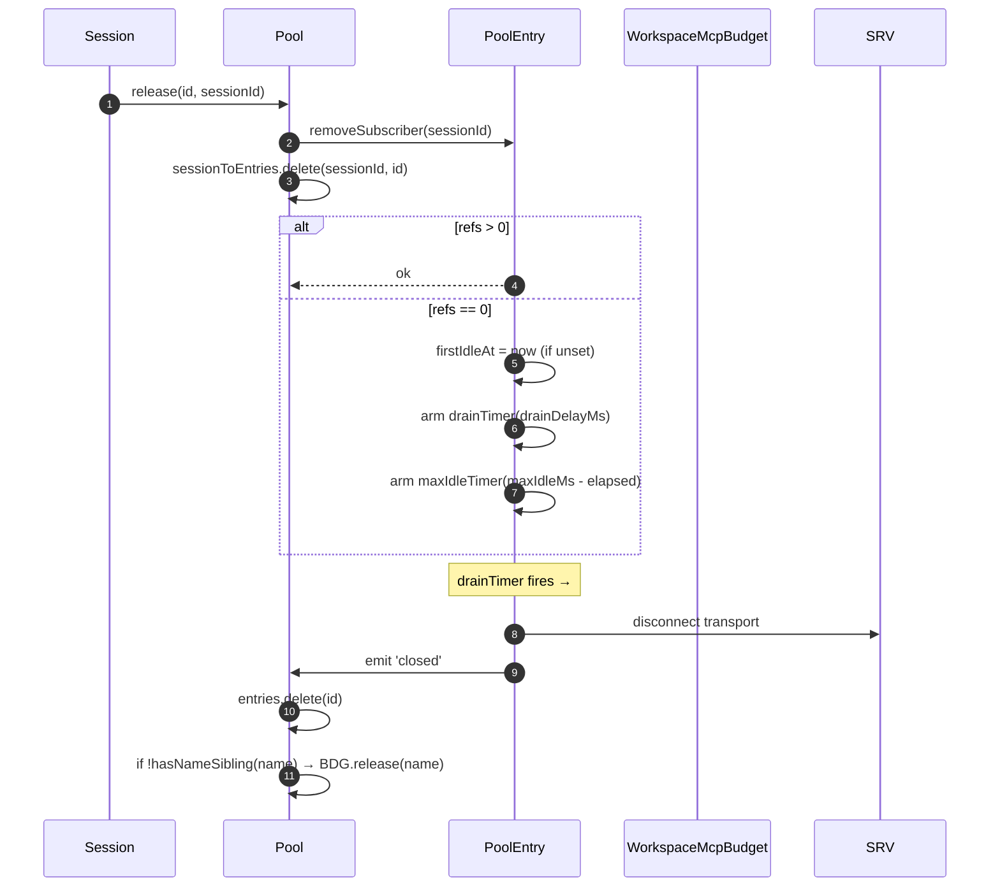
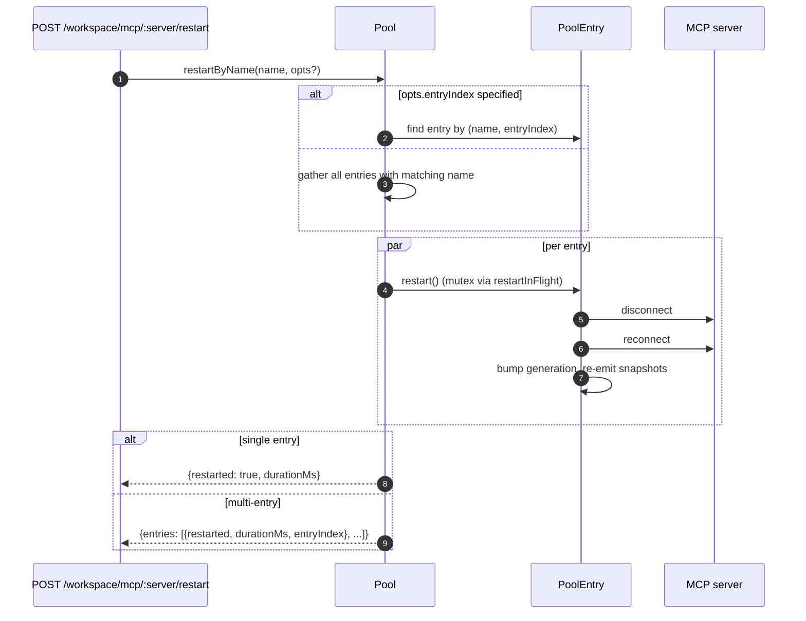
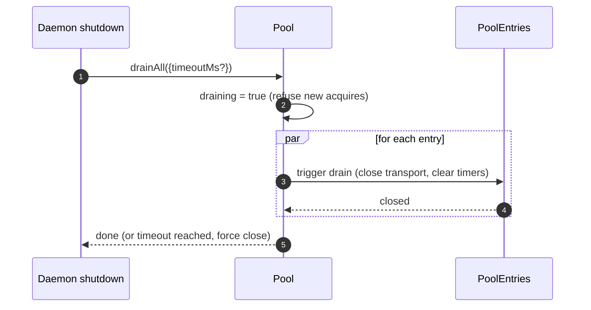

---
---

# 워크스페이스 MCP 트랜스포트 풀

## 개요

`McpTransportPool`(`packages/core/src/tools/mcp-transport-pool.ts`)은 F2(#4175 커밋 5) 워크스페이스 범위 풀입니다. 하나의 런타임 내부에서 여러 ACP 세션이 고유한 `(serverName + configFingerprint)` 튜플당 하나의 트랜스포트를 공유하며, 각 세션이 자체 MCP 자식 프로세스를 생성하지 않습니다. 풀 모드가 활성화되면 시작되는 모든 ACP 자식이 독립적인 풀(`QwenAgent.mcpPool`)을 소유합니다. 프로덕션에서는 기본 자식을 예열하고 실패 시 첫 사용 시 재시도합니다. 신뢰되는 보조 자식은 온디맨드로 시작되고, 신뢰되지 않는 보조 자식은 아무것도 시작하지 않습니다. 풀은 에이전트 시작 시 런타임의 부트스트랩 `Config`로 한 번 구성되며 세션 수명 주기를 넘어 유지됩니다. 엔트리는 세션 연결을 참조 카운트하고, 참조 카운트가 0이 되면 설정 가능한 유예 기간 후 닫힙니다.

이것은 다중 세션 데몬이 세션마다 모든 MCP 서버의 복사본을 포킹하는 것을 방지하는 주요 메커니즘입니다.

## 책임

- `(name + fingerprint)`당 하나의 MCP 트랜스포트를 획득 또는 생성하고, `spawnInFlight`를 통해 동시 획득을 중복 제거합니다.
- 세션별 참조를 해제하고, 마지막 참조가 분리될 때 엔트리의 드레인 타이머를 설정합니다.
- 하드 `MAX_IDLE_MS` 상한으로 참조 카운트 변동을 견뎌내어, 빈번한 클라이언트가 유휴 트랜스포트를 무기한 유지하지 못하게 합니다.
- 역 인덱스(`sessionToEntries`)에서 세션의 참조 카운트를 관리하여 `releaseSession(sessionId)`를 O(entries)가 아닌 O(refs)로 만듭니다.
- 엔트리를 온디맨드로 재시작합니다(`restartByName`). 단일 엔트리는 `{restarted, durationMs}`를 반환하고, 다중 엔트리는 `{entries: RestartResult[]}`를 반환합니다(F2 다중 엔트리 계약).
- 데몬 종료 시 설정 가능한 타임아웃으로 전체 풀을 드레인합니다. 드레인 중에는 새 획득을 거부합니다.
- `acquire` 시 [`06-mcp-budget-guardrails.md`](./06-mcp-budget-guardrails.md)의 `WorkspaceMcpBudget`을 확인하여 이름별 예약 상한을 적용합니다. 형제 엔트리가 같은 이름을 보유하지 않으면 엔트리 종료 시 슬롯을 해제합니다.
- `SessionMcpView`를 통해 세션별 필터링된 도구/프롬프트 스냅샷을 생성하여, 한 세션의 발견이 다른 세션에 도구를 등록하지 않도록 합니다.

## 아키텍처

### 공개 인터페이스

```ts
class McpTransportPool {
  constructor(cliConfig: Config, options: McpTransportPoolOptions);
  acquire(
    serverName,
    cfg,
    sessionId,
    sessionToolRegistry,
    sessionPromptRegistry,
  ): Promise<PooledConnection>;
  release(id, sessionId): void;
  releaseSession(sessionId): void;
  restartByName(
    name,
    opts?,
  ): Promise<RestartResult | { entries: RestartResult[] }>;
  drainAll(opts?): Promise<void>;
  getBudget(): WorkspaceMcpBudget | undefined;
  getSnapshot(): McpPoolSnapshot;
}
```

`McpTransportPoolOptions`:

- `workspaceContext: WorkspaceContext`(필수).
- `debugMode: boolean`.
- `sendSdkMcpMessage?` — 세션별 콜백(풀은 SDK MCP를 우회).
- `pooledTransports?: ReadonlySet<McpTransportKind>` — 기본값 `{stdio, websocket}`. HTTP/SSE 트랜스포트는 헤더에 세션별 OAuth 상태가 포함될 수 있으므로 기본적으로 풀링되지 않지만, 운영자가 `QWEN_SERVE_MCP_POOL_TRANSPORTS`로 명시적 풀링을 선택할 수 있습니다.
- `drainDelayMs?` — 기본값 `30_000`.
- `entryOptions?: (transport) => PoolEntryOptions`.
- `budget?: WorkspaceMcpBudget`.

### 내부 상태

| 상태                 | 타입                                      | 용도                                                                                                 |
| -------------------- | ----------------------------------------- | ---------------------------------------------------------------------------------------------------- |
| `entries`            | `Map<ConnectionId, PoolEntry>`            | `connectionIdOf(name, fingerprint)`로 키잉된 활성 풀 엔트리.                                          |
| `unpooledIds`        | `Set<ConnectionId>`                       | 구성된 `pooledTransports` 허용 목록 밖의 트랜스포트 엔트리.                                           |
| `spawnInFlight`      | `Map<ConnectionId, Promise<PoolEntry>>`   | 같은 키에 대한 동시 콜드 획득을 중복 제거.                                                            |
| `sessionToEntries`   | `Map<string, Set<ConnectionId>>`          | V21-2 O(refs) `releaseSession`을 위한 역 인덱스.                                                      |
| `draining`           | `boolean`                                 | 드레인 뮤텍스 — 설정되면 모든 `acquire` 호출이 거부됨.                                                 |
| `nextIndexByName`    | `Map<string, number>`                     | V21-7 서버 이름별 단조 `entryIndex`(새 엔트리가 나타나도 대시보드가 재정렬되지 않음).                    |

### `PoolEntry`(엔트리별 구조, `mcp-pool-entry.ts`)

상태 머신: `spawning → active ⇄ (active ↔ reconnect) → (active → draining on last detach, draining → active on attach OR draining → closed on timer)`.

| 필드                                                     | 용도                                                                              |
| -------------------------------------------------------- | --------------------------------------------------------------------------------- |
| `localStatus: MCPServerStatus`                           | `MCPServerStatus` 수명 주기에 의해 구동.                                           |
| `state: PoolEntryState`                                  | `spawning`/`active`/`draining`/`closed`/`failed`.                                  |
| `generation: number`                                     | 각 재시작마다 증가. 구독자가 재연결 사이클을 감지하기 위해 비교.                    |
| `refs: Set<string>`                                      | 현재 연결된 세션 ID.                                                               |
| `subscribers: Map<string, SessionMcpView>`               | 세션별 필터링 뷰.                                                                  |
| `subscriberHandles: Map<string, PooledConnectionImpl>`   | `acquire`에서 반환된 핸들.                                                         |
| `toolsSnapshot[], promptsSnapshot[]`                     | 표준 풀 수준 스냅샷. `toolsChanged` / `promptsChanged` 시 재발행.                   |
| `drainTimer?`                                            | `refs.size === 0`일 때 설정. 기본값 30초. 연결 시 재설정.                           |
| `maxIdleTimer?`                                          | 첫 유휴 시 설정. 획득/해제 변동으로 재설정되지 않음. 기본값 5분.                    |
| `firstIdleAt?`                                           | 최대 유휴 하드 캡의 워터마크.                                                       |
| `restartInFlight?`                                       | `restart()`를 위한 뮤텍스.                                                         |

### `PoolEntryOptions`

```ts
interface PoolEntryOptions {
  drainDelayMs: number; // default 30_000
  maxIdleMs: number; // default 5 * 60_000
  maxReconnectAttempts: number; // default 3 (stdio/ws) or 5 (http/sse)
  reconnectStrategy:
    | { kind: 'fixed'; delayMs: number }
    | { kind: 'exponential'; baseMs: number; capMs: number };
}
```

`defaultPoolEntryOptions(transport)`(`mcp-pool-entry.ts`)는 stdio/ws 기본값 `{fixed 5s, 3 attempts}`과 http/sse 기본값 `{exponential 1s → 16s, 5 attempts}`을 반환합니다. 원격 트랜스포트는 장애가 일시적인 경우가 더 많으므로 더 긴 재시도 예산을 받습니다.

## 워크플로우

### `acquire`

```mermaid
sequenceDiagram
    autonumber
    participant S as Session
    participant P as Pool
    participant SIF as spawnInFlight
    participant E as PoolEntry
    participant BDG as WorkspaceMcpBudget
    participant SRV as MCP server

    S->>P: acquire(name, cfg, sessionId, sessionToolRegistry, sessionPromptRegistry)
    P->>P: refuse if draining
    P->>P: connectionId = connectionIdOf(name, fingerprint)
    P->>P: if !isPoolable(cfg) → mark unpooled
    alt entry in entries (warm)
        E-->>P: existing PoolEntry
    else inflight cold spawn
        SIF-->>P: existing Promise<PoolEntry>
    else cold start
        P->>BDG: tryReserve(name) (if budget set + poolable)
        BDG-->>P: 'reserved' | 'already_held' | 'refused'
        alt refused
            P->>BDG: recordRefusal(name, transport)
            P-->>S: BudgetExhaustedError
        else ok
            P->>E: spawnEntry(name, cfg)
            E->>SRV: connect transport
            SRV-->>E: ready
            P->>P: entries.set(id, E); nextIndexByName++
            E-->>P: connected
        end
    end
    P->>E: addSubscriber(sessionId, sessionToolRegistry, sessionPromptRegistry)
    P->>P: sessionToEntries.add(sessionId, id)
    P->>P: cancel drain timer (refs>0)
    P-->>S: PooledConnection { id, serverName, entryIndex, client, toolsSnapshot, promptsSnapshot, on, off, release }
```

### `release` + drain



`hasNameSibling(name)`(`mcp-transport-pool.ts`)는 `entries.values()`와 `spawnInFlight.keys()`를 모두 순회하며, 후자를 `parseConnectionId`로 파싱합니다(서버 이름에 합법적으로 `::`가 포함될 수 있으므로 `startsWith`는 `${name}::`로 시작하는 형제 이름에서 오탐이 발생합니다).

`releaseSession(sessionId)`은 `sessionToEntries`에서 읽고 참조된 모든 엔트리를 O(refs)로 해제한 다음 인덱스 엔트리를 정리합니다. 브리지의 세션 종료 경로에서 사용되므로 전체 엔트리 맵을 순회하지 않습니다.

### `restartByName`



데몬 HTTP 레이어의 프리플라이트 예산 검사는 대상 슬롯이 아직 예약되지 않았고 재시작이 `enforce` 예산을 초과할 경우 `{restarted:false, skipped:true, reason:'budget_would_exceed'}`를 반환합니다(Wave 4 변형 제어).

### `drainAll`



## 상태 및 수명 주기

- 풀 생성은 동기적이며, 첫 `acquire`가 트랜스포트를 콜드 스타트합니다.
- `drainDelayMs`(기본값 30초)는 연결 시 취소로 재설정됩니다.
- `maxIdleMs`(기본값 5분)는 연결/분리 변동으로 **절대** 재설정되지 않습니다. 첫 유휴에서 ticking을 시작하고, 엔트리가 실제로 닫히거나 데드라인 전에 연결될 때만 중단됩니다. 빈번한 클라이언트에 대한 방어책입니다.
- `nextIndexByName`은 단조적입니다. 새 엔트리가 나타난 후에도 기존 엔트리는 할당된 인덱스를 유지하므로, `entryIndex`를 읽는 대시보드가 재정렬되지 않습니다.
- 스폰 실패는 예약된 예산 슬롯을 해제합니다(V21-4 — 이것이 없으면 연결 중 충돌한 콜드 스폰이 예약을 영구적으로 누출합니다).

## 의존성

- `packages/core/src/tools/mcp-client.ts` — `McpClient`, 상태 열거형, `SendSdkMcpMessage`.
- `packages/core/src/tools/mcp-pool-entry.ts` — `PoolEntry`, `PoolEntryOptions`, `defaultPoolEntryOptions`.
- `packages/core/src/tools/mcp-pool-key.ts` — `connectionIdOf`, `parseConnectionId`, `isPoolable`, `mcpTransportOf`, `POOLED_TRANSPORTS_DEFAULT`.
- `packages/core/src/tools/mcp-pool-events.ts` — `ConnectionId`, `PoolEntryState`, `PoolEvent`.
- `packages/core/src/tools/session-mcp-view.ts` — 풀 스냅샷을 필터링하는 세션별 뷰.
- `packages/core/src/tools/mcp-workspace-budget.ts` — `WorkspaceMcpBudget`([`06-mcp-budget-guardrails.md`](./06-mcp-budget-guardrails.md) 참조).
- `packages/core/src/tools/mcp-discovery-timeout.ts` — `discoveryTimeoutFor`, `runWithTimeout`.

## 설정

| 소스                          | 설정 항목                                                       | 효과                                                                                                      |
| ----------------------------- | --------------------------------------------------------------- | --------------------------------------------------------------------------------------------------------- |
| 환경 변수                      | `QWEN_SERVE_NO_MCP_POOL=1`                                      | 킬 스위치 — `QwenAgent.mcpPool`이 undefined로 유지. 세션별 `McpClientManager`가 적용됨(pre-F2 경로).       |
| 플래그                         | `--mcp-client-budget=N`, `--mcp-budget-mode={off,warn,enforce}` | `childEnvOverrides`를 통해 ACP 자식으로 전달. 자식이 `WorkspaceMcpBudget`을 구성하고 풀에 전달.             |
| 기능 태그(조건부)              | `mcp_workspace_pool`, `mcp_pool_restart`                        | 풀이 켜져 있을 때 함께 광고됨. SDK가 풀 인식 응답 형태로 분기하기 위해 두 태그를 모두 사전 확인.            |

### 풀링되지 않은 엔트리(HTTP / SSE / SDK-MCP)

구성의 `pooledTransports` 허용 목록(기본적으로 HTTP, SSE, SDK-MCP) 밖의 트랜스포트는 별도 경로를 사용합니다. `createUnpooledConnection(name, cfg, sessionId, ...)`(`mcp-transport-pool.ts`)이 ID가 `${name}::unpooled-${entryIndex}`인 세션별 엔트리를 생성합니다. 풀링된 엔트리와의 차이점:

- `entries`에 저장되고 `unpooledIds: Set<ConnectionId>`에서도 추적되어 `release` / `releaseSession`이 닫기-분리 동작을 빠르게 처리할 수 있습니다(refs는 항상 최대 1).
- 풀 리플레이 대신 `McpClient.discover()`가 직접 사용됩니다. 세션의 레지스트리에 이미 등록된 내용이 있으므로 `applyTools` / `applyPrompts`는 no-op입니다(W77 / `attach()`의 `skipReplay: true`).
- 워크스페이스 예산이 여전히 적용됩니다. F2 예산 후속 조치는 풀링되지 않은 연결이 `tryReserve`를 우회하던 기존 허점을 닫았습니다. 풀링 여부와 관계없이 같은 `WorkspaceMcpBudget` 슬롯이 예약되고 엔트리 종료 시 해제됩니다.

W77 레이스(`cb206da36`): `createUnpooledConnection`은 `client.connect()` / `client.discover()`를 await하기 **전에** 엔트리를 `this.entries`에 저장하지만, `attach()`가 성공한 **후에야** `sessionToEntries[sessionId]`를 인덱싱합니다. 연결/발견 창에서 동시 `closeStoredSession()` / `releaseSession(sessionId)`가 빈 인덱스를 보고 풀링되지 않은 스폰이 완료되도록 한 다음, `attach()`가 이미 닫힌 세션에 도구/프롬프트를 등록하는 문제가 있었습니다. 수정 사항:

- `mcp-pool-entry.ts`: 공개 `isTerminated(): boolean` 프로브(`state === 'closed' || state === 'failed'`).
- `mcp-pool-entry.ts`: `markActive()`는 `isTerminated()`이면 단축되어 해체된 엔트리가 `'active'`로 부활하지 못합니다.
- 호출자(풀의 풀링되지 않은 경로)는 await 사이에서 `isTerminated()`를 확인하고 부모 세션이 사라졌으면 attach를 중단합니다.

이 레이스는 당시 잠재적인 것이었지만(W61/W71 세션별 `releaseSession` hook은 F4에 적용), 해당 hook이 도착하는 순간 실제 문제가 됩니다. 수정은 F2 시리즈에서 조기에 적용되었습니다.

## `GET /workspace/mcp` 풀 인식 스냅샷 필드

풀이 활성 상태일 때, 각 `ServeWorkspaceMcpStatus` 서버 셀(`packages/acp-bridge/src/status.ts`)에는 세 개의 추가 필드가 포함됩니다.

| 필드               | 타입                                          | 용도                                                                                                                                                                                                                                                                                                                                        |
| ------------------ | --------------------------------------------- | ------------------------------------------------------------------------------------------------------------------------------------------------------------------------------------------------------------------------------------------------------------------------------------------------------------------------------------------- |
| `disabledReason`   | `'config' \| 'budget'`                        | 운영자 비활성화 서버(`disabledMcpServers`의 `disabled: true`)와 예산 거부(`status: 'error', errorKind: 'budget_exhausted'`)를 구분합니다. 대시보드에서 `errors[]` 또는 `budgets[]`를 교차 참조 없이 하나의 서버 행을 렌더링할 수 있습니다.                                                                                                      |
| `entryCount`       | `number` (`>=1`)                              | 풀 모드에서 세션이 세션별 OAuth 헤더와 같은 다른 핑거프린트를 주입할 때 같은 이름의 여러 `PoolEntry` 인스턴스가 존재할 수 있습니다. 이 필드는 `QWEN_SERVE_NO_MCP_POOL=1`로 풀이 비활성화되면 생략됩니다. 새 클라이언트는 `entryCount > 1`일 때 "N entries" 배지를 렌더링합니다.                                                                  |
| `entrySummary`     | `ReadonlyArray<{entryIndex, refs, status}>`   | 엔트리별 상세 정보. `entryIndex`는 엔트리 생성 시 할당된 안정적인 불투명 정수이며, 원시 핑거프린트가 아니므로 스냅샷 diff가 OAuth나 환경 변수 로테이션 타이밍을 유출하지 않습니다. `refs`는 현재 연결된 세션 수입니다. `status`는 대시보드가 집계 `mcpStatus`가 이미 연결된 상태에서도 엔트리별 헬스를 표시할 수 있게 합니다.                        |

`(entryCount, entrySummary)`는 항상 쌍으로 브로드캐스트됩니다. `mcp_workspace_pool` 기능 태그는 두 필드를 모두 포함합니다. 이전 SDK 클라이언트는 추가적 프로토콜 계약에 따라 이를 무시합니다.

풀 스냅샷은 `subprocessCount`도 노출합니다. 이것은 `'stdio'` 패밀리만 계산합니다. WebSocket, HTTP, SSE 트랜스포트는 원격 서버에 연결하며 로컬 자식 프로세스를 생성하지 않습니다. 초기 버전에서는 WebSocket 트랜스포트도 로컬 서브프로세스로 계산하여 리소스 대시보드의 수치가 부풀려졌습니다.

## Drain은 두 종료 경로 모두에서 실행됩니다

풀 드레인은 SIGTERM 핸들러로만 제한되지 않습니다. 일반 IDE 종료 경로(`await connection.closed`)도 `packages/cli/src/acp-integration/acpAgent.ts`의 `drainPoolBeforeExit`을 통해 `drainAll`을 호출합니다. 데몬이 프로세스 시그널을 받든 IDE가 연결을 정상적으로 닫든, 풀은 `draining`에 진입하고 새 획득을 거부하며 엔트리가 닫히기를 기다립니다.

## `/mcp refresh`는 부트 발견 경로를 공유합니다

`discoverAllMcpTools`(부트 발견)와 `discoverAllMcpToolsIncremental`(`/mcp refresh` / 핫 리로드)는 모두 풀 모드에서 먼저 풀을 확인합니다(`packages/core/src/tools/mcp-client-manager.ts`). 공유 게이트는 핫 리로드가 실수로 세션별 클라이언트를 생성하거나 예산을 이중 계산하거나 고아 트랜스포트를 남기는 것을 방지합니다.

## 재연결 중 진행 중인 도구 호출(`MCPCallInterruptedError`)

기본 MCP 트랜스포트가 자동으로 연결이 끊어지면(연결이 명시적 종료 없이 `'active'` / `'draining'`에서 `localStatus === DISCONNECTED`로 점프), 풀은 엔트리를 `'failed'`로 표시하고 `pool.entries`에서 제거한 후 구독자 뷰를 분리하기 전에 `failed` 이벤트를 발행합니다. 이 발행-후-분리 순서가 중요합니다. 구독자가 `failed` 이벤트를 충분히 빨리 받아 대기 중인 `callTool` promise를 `MCPCallInterruptedError`로 라우팅하므로, 멈춘 `await client.callTool(...)`이 중단 없이 깨끗하게 거부됩니다. `forceShutdown`도 같은 발행-후-분리 순서를 사용합니다.

## 핑거프린트 및 `canonicalOAuth` 정규화

풀 키는 `mcp-pool-key.ts`의 `fingerprint(cfg)`에서 옵니다. 해시는 모든 트랜스포트 정의 필드를 포함합니다.

> `transport, command, args, cwd, env, url, httpUrl, tcp, headers, timeout, oauth`

세션별 필터링 및 메타데이터 필드(`includeTools`, `excludeTools`, `trust`, `description`, `extensionName`, `discoveryTimeoutMs`)는 제외되므로, 필터가 다른 세션도 하나의 엔트리를 공유할 수 있습니다.

OAuth 셀의 경우 `canonicalOAuth(o)`는 모든 `MCPOAuthConfig` 필드를 해시합니다: `clientId`, `clientSecret`, 정렬된 `scopes`, 정렬된 `audiences`, `authorizationUrl`, `tokenUrl`, `redirectUri`, `tokenParamName`, `registrationUrl`. 이것은 자격 증명 격리 계약입니다. `clientSecret`, `audiences`, `redirectUri`만 다른 두 세션 구성은 다른 핑거프린트를 가지며 하나의 엔트리를 공유할 수 없습니다. 기밀 클라이언트와 다중 audience 토큰 배포가 이것에 의존합니다.

`scopes`와 `audiences`를 정렬하면 호출부 순서가 무의미해집니다. 명시적 `null`은 정규화되어 undefined 필드가 명시적 null과 동일하게 해시됩니다. 키에 `discoveryTimeoutMs`가 포함되지 않습니다. 같은 키지만 다른 타임아웃을 가진 동시 acquire 호출은 "선착순"이며, pre-F2 세션별 매니저 동작과 일치합니다.

`PoolEntry`는 `cfg: MCPServerConfig`를 비공개로 유지합니다. 외부 코드는 트랜스포트 패밀리를 알아야 할 때 `entry.transportKind` getter를 사용해야 합니다. 이를 통해 환경 변수, 헤더 인증, OAuth 필드가 실수로 소비자에게 유출되는 것을 방지합니다.

## Extension 언로드는 `MAX_IDLE_MS`에 의존합니다

런타임에 MCP extension을 언로드하기 위한 활성 정리 경로는 의도적으로 없습니다. `MCPServerConfig`가 병합된 워크스페이스 설정에 더 이상 나타나지 않는 고아 엔트리는 마지막 구독자가 분리된 후 `MAX_IDLE_MS` 하드 캡에 의해 자연스럽게 회수됩니다. 동기적 언로드-정리 경로는 드문 운영자 엣지 케이스에 복잡성을 추가할 뿐이며, 하드 캡은 언로드 시점 이후 고아 프로세스 수명을 기본값 5분으로 제한합니다.

더 빠른 정리가 필요한 운영자는 데몬을 재시작하거나 이제 구성되지 않은 이름에 대해 `POST /workspace/mcp/:server/restart`를 호출할 수 있습니다. 이는 비활성화된 서버 경로를 통해 엔트리를 해체합니다.

## 자가 복구 관측성

풀은 자가 복구 경로에서 두 가지 구조화된 진단을 발행합니다.

**`McpClient.lastTransportError: Error | undefined`**(`packages/core/src/tools/mcp-client.ts`) — `McpClient.onerror`는 가장 최근의 트랜스포트 예외를 비공개 필드에 저장하고 `connect()` 진입 시 초기화합니다. `PoolEntry`의 자동 삭제 경로는 `client.getLastTransportError()`를 읽고 `emit({kind:'failed', lastError})`에 포함하므로, 구독자와 대시보드가 루트 원인을 찾기 위해 stderr를 검색할 필요가 없습니다.

**`SweepResult`**(내부 인터페이스, 내보내지지 않음. `packages/core/src/tools/mcp-pool-entry.ts`) — `sweepAndDisconnect(reason)`는 `Promise<SweepResult>`를 반환합니다.

```ts
interface SweepResult {
  pidSweepError?: Error; // listDescendantPids 자체가 예외를 발생시킨 경우
  descendantsFound?: number; // 발견된 자손 pid 수
  descendantsSignaled?: number; // 성공적으로 SIGTERM된 수
}
```

유일한 소비자는 `statusChangeListener`의 자동 삭제 블록입니다. `descendantsFound` / `descendantsSignaled`를 사용하여 부분 시그널 케이스(발견된 프로세스보다 적은 수에 시그널이 전송됨. 보통 `listDescendantPids`와 `sigtermPids` 사이에서 프로세스가 종료되었거나 EPERM이 발생했기 때문)와 스위프 에러를 감지하고 구조화된 경고를 로그에 기록합니다. `forceShutdown`과 `doRestart`는 이 반환 값을 무시합니다. 그들의 catch 경로가 이미 더 풍부한 실패 신호를 가지고 있기 때문입니다.

## 서브프로세스 정리: `pid-descendants` 스냅샷 경로

`McpTransportPool`이 stdio 서브프로세스를 종료할 때 자손 프로세스를 나열해야 합니다. `npx` 래퍼와 셸 래퍼는 여러 단계의 포크를 생성할 수 있습니다. `packages/core/src/tools/pid-descendants.ts`는 `listDescendantPids(rootPid) → Promise<number[]>`와 `sigtermPids(pids)`를 `sweepAndDisconnect`용으로 노출합니다.

### Linux / macOS 기본 경로

단일 `ps -A -o pid=,ppid=` 스냅샷이 프로세스 테이블을 읽고 `Map<ppid, pid[]>`로 파싱한 다음, `walkDescendants(tree, root)`가 BFS로 서브트리를 추출합니다. 어떤 깊이든 하나의 `ps` 포크만 필요합니다.

`walkDescendants`는 `visited: Set<number>`를 유지하고 `root`를 세트에 포함하여 PID 재사용 사이클에 대비합니다. 빠른 프로세스 변동 환경에서 스냅샷에 이론적으로 A→B / B→A 루프가 포함될 수 있습니다. `visited`가 없으면 워커가 `MAX_DESCENDANTS` 할당을 가짜 데이터로 채우고 실제 자손을 밀어낼 수 있습니다.

### Windows 기본 경로

단일 `Get-CimInstance Win32_Process | ConvertTo-Csv -Delimiter ","` 스냅샷이 모든 `(ProcessId, ParentProcessId)` 행을 출력한 다음 같은 `Map` 및 `walkDescendants` 경로가 실행됩니다.

명시적 `-Delimiter ","`가 필요합니다. Windows에 기본 탑재된 PowerShell 5.1은 `ConvertTo-Csv`의 기본값을 시스템 로캘 목록 구분 기호로 사용합니다. DE, FR, NL, IT 및 유사한 로캘은 `;`를 사용하므로, 수정 전 파서 `^"(\d+)","(\d+)"$`가 절대 매칭되지 않아 모든 데몬 종료 시 per-pid CIM 필터 경로로 폴백하여 자식당 약 0.5-1초의 PowerShell 시작 비용이 추가되었습니다.

### 폴백 경로

BusyBox `<v1.28`은 `ps -o`가 없고, distroless 컨테이너에는 `ps`가 포함되지 않을 수 있으며, 일부 Windows 환경은 ACL을 통해 CIM 출력을 잘라냅니다. 기본 경로가 0행을 파싱하거나 예외를 발생시키면 코드는 per-pid BFS로 폴백합니다. Linux / macOS는 `pgrep -P <pid>`를 사용하고, Windows는 `Get-CimInstance -Filter "ParentProcessId=$p"`를 사용합니다. 여기서 `$p`는 문자열 연결이 아닌 PowerShell 변수 바인딩입니다. 현재 `Number.isInteger` 가드는 진입점에 충분하며, 바인딩은 종심 방어의 한 층입니다.

### 공유 제약

두 경로 모두 `MAX_DESCENDANTS = 256`과 `MAX_DEPTH = 8`로 제한되어 악의적이거나 비정상적인 프로세스 트리가 스위프를 저하시키는 것을 방지합니다.

스냅샷 경로는 `maxBuffer: 8MB`를 사용합니다. 약 250k 프로세스가 있는 병리적 호스트에 충분한 크기입니다. Node의 기본 1MB 버퍼는 약 30k 프로세스에서 자식 프로세스 출력을 잘라낼 수 있습니다.

성능 향상은 의도적으로 적당합니다(일반적인 200-500 프로세스 개발 머신은 10ms 미만으로 파싱되며 per-pid `pgrep`보다 약 2배 빠릅니다). 주요 이점은 포크 위생과 스냅샷 일관성입니다. BFS는 전체 서브트리를 한 번에 보지만, 이전 per-pid 쿼리 경로는 두 쿼리 사이에 포크된 손자를 놓칠 수 있었습니다.

## 임베딩 호스트 참고: `McpClientManager` 생성자

`McpClientManager`는 `(config, toolRegistry, options?: McpClientManagerOptions)`로 생성됩니다. 클래스를 직접 import하는 임베딩 호스트는 다음을 전달해야 합니다.

```ts
new McpClientManager(config, toolRegistry, {
  eventEmitter,
  sendSdkMcpMessage,
  healthConfig,
  budgetConfig,
  pool,
});
```

테스트는 하나 또는 두 개의 필드만 중요한 케이스를 한 줄로 유지할 수 있도록 `mkManager(overrides?)` 팩토리를 선호해야 합니다.

## 구현 노트

이 헬퍼들은 내부용이지만 소스 코드에서 볼 수 있습니다.

- `McpTransportPool.acquire()`는 `attachPooledSession`과 `rollbackReservationOnSpawnFailure`를 사용하여 고속 경로 attach, 스폰 후 attach, 풀링된 spawn-in-flight catch 동작을 공유합니다. 런타임 동작은 변경되지 않으며 레이스 윈도우 불변성은 여전히 호출부에 있습니다.
- `SessionMcpView.applyTools` / `applyPrompts`는 `compileNameFilter(cfg)`를 통해 `includeTools` / `excludeTools`를 한 번 컴파일하고 `compiledFilterAccepts(compiled, name)`로 각 도구를 확인합니다. 내보내진 `passesSessionFilter` / `passesSessionPromptFilter`도 같은 컴파일 경로를 사용합니다. `excludeTools`는 정확 매칭이며 `includeTools`는 첫 번째 `(...)` 접미사를 제거하여 `toolName(args)`가 `toolName`과 매칭됩니다.

디자인 문서: [`../../design/f2-mcp-transport-pool.md`](../../design/f2-mcp-transport-pool.md) §6은 트랜스포트 풀 상태 머신, 재연결, 드레인, 자손 스위프 경로를 다룹니다.

## 주의사항 및 알려진 제한

- **HTTP / SSE 트랜스포트는 기본적으로 풀링되지 않음** — 운영자가 명시적으로 `QWEN_SERVE_MCP_POOL_TRANSPORTS`에 포함하지 않는 한, 각 획득은 세션 수명 동안만 존재하는 새 엔트리를 생성합니다. 헤더에 세션별 OAuth 상태가 포함될 수 있으므로 기본적으로 풀링하면 세션 간 자격 증명 유출 위험이 있습니다.
- **`maxIdleMs`는 attach/detach 변동을 견디는 하드 캡입니다.** 5분 유휴 하드 캡은 공격적으로 attach/detach하는 클라이언트도 유휴 트랜스포트를 5분 이상 유지할 수 없음을 의미합니다. 장기간 고정 트랜스포트가 필요한 운영자는 `maxIdleMs`를 늘리거나 서버를 풀 밖에서 실행해야 합니다.
- **서버 이름별 예산 슬롯**은 이름은 같지만 핑거프린트가 다른 두 풀 엔트리가 하나가 아닌 하나의 슬롯을 공유함을 의미합니다. 서브프로세스 회계는 `pool.getSnapshot().subprocessCount`를 통해 별도로 노출됩니다.
- **`startsWith` 회귀**는 `hasNameSibling`에서 회피되었습니다. MCP 서버 이름에 합법적으로 `::`가 포함될 수 있기 때문입니다(`mcp-pool-key.test.ts`). 항상 `parseConnectionId`의 `lastIndexOf('::')` 분할을 사용하며 문자열 접두사 매칭은 사용하지 않습니다.
- **풀 드레인은 단방향입니다** — `drainAll`은 `draining = true`를 영구적으로 설정합니다. 추가 작업을 위해서는 새 풀이 필요합니다.

## 참고 자료

- `packages/core/src/tools/mcp-transport-pool.ts`(전체 파일)
- `packages/core/src/tools/mcp-pool-entry.ts`(엔트리 수명 주기)
- `packages/core/src/tools/mcp-pool-key.ts`(`connectionIdOf`, `parseConnectionId`)
- `packages/core/src/tools/mcp-pool-events.ts`(이벤트 타입)
- `packages/core/src/tools/session-mcp-view.ts`(세션별 필터링 뷰)
- F2 디자인 문서(v2.2, 32개 항목 리뷰 폴드인 변경 로그 포함): [`../../design/f2-mcp-transport-pool.md`](../../design/f2-mcp-transport-pool.md). 디자인 계약을 권위 있는 자료로 간주하십시오. 이 페이지는 개발자 심층 분석입니다.
- F2 디자인 노트: 이슈 [#4175](https://github.com/QwenLM/qwen-code/issues/4175)(F2 시리즈의 커밋 4-6).
