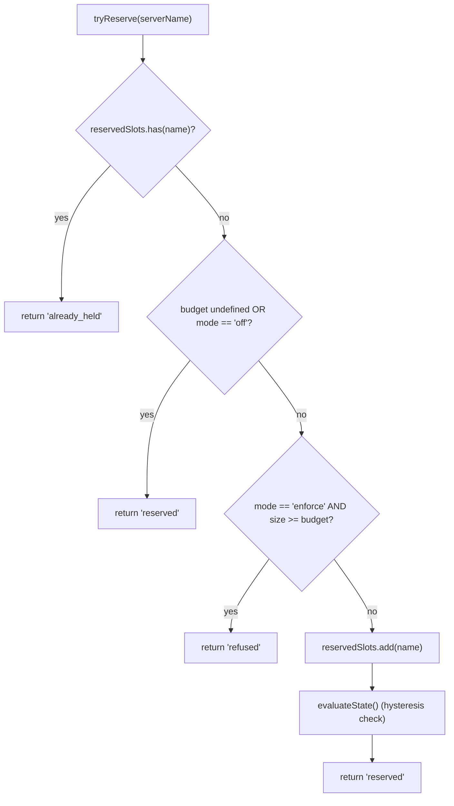
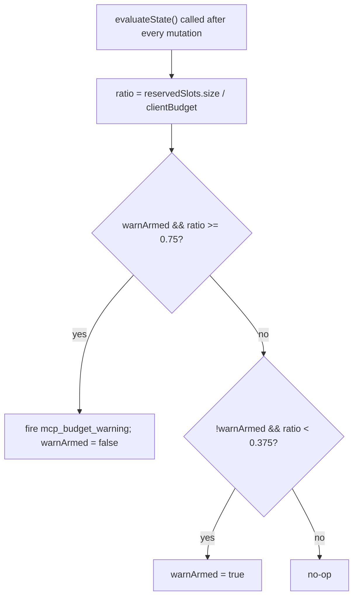

# MCP 워크스페이스 예산 가드레일

## 개요

`WorkspaceMcpBudget`(`packages/core/src/tools/mcp-workspace-budget.ts`)은 F2(#4175 commit 6)의 워크스페이스 범위 MCP 클라이언트 예산 컨트롤러입니다. `McpClientManager`가 인라인으로 갖는 것과 동일한 상태 머신(슬롯 예약, 75% 히스테리시스 경고, `discoverAllMcpTools*` 패스 전반의 거부 배치 병합)을 소유하지만, 각 ACP 자식의 매니저 안에 세션당 한 번씩 존재하는 대신 `McpTransportPool` 안에 **워크스페이스당 한 번** 존재합니다. 풀은 `acquire`와 `release` 호출을 이곳에 위임하므로 상한이 세션이 아닌 **워크스페이스**에 적용됩니다.

레거시 `McpClientManager` 예산 메커니즘은 독립 실행형 qwen 및 SDK MCP 서버(commit 4 수정에 따라 풀을 우회하는)를 위해 유지됩니다. 풀 모드 → `WorkspaceMcpBudget`이 강제; 독립 실행형 / SDK MCP → 매니저의 인라인 메커니즘이 강제. 풀 모드 검색은 매니저의 `tryReserveSlot`을 호출하지 않으므로 이중 계수가 발생하지 않습니다.

## 책임

- 현재 보유 중인 서버 NAME의 `reservedSlots: Set<string>`을 추적합니다(슬롯 키는 NAME당 하나이며, PR 14 v1과 일치).
- `tryReserve(name) → 'reserved' | 'already_held' | 'refused'` — 원자적이고 동기적이므로 동시에 실행되는 `Promise.all` acquire가 await 경계에서 상한을 통과할 수 없습니다.
- `release(name) → boolean` — 멱등적(`Set.delete` 시맨틱).
- `reservedSlots.size / clientBudget`의 75% 상승 교차 시 `mcp_budget_warning`을 한 번 발생시키고, 37.5% 하강 교차 이후에만 재설정됩니다.
- 벌크 검색 패스 전반의 서버별 거부를 병합합니다 — `beginBulkPass()` / `endBulkPass()` 브래킷이 거부를 단일 `mcp_child_refused_batch` 이벤트로 누적합니다.
- 스냅샷 소비자를 위한 `lastRefusedServerNames`을 유지합니다(`GET /workspace/mcp`) — 다음 벌크 패스의 시작에서 초기화되며, emit 시점이 아닙니다. 따라서 패스 사이의 스냅샷에서도 마지막 거부 집합을 볼 수 있습니다.

## 아키텍처

### 설정

```ts
new WorkspaceMcpBudget({
  clientBudget?: number,           // undefined = 무제한
  mode: 'off' | 'warn' | 'enforce',
  onEvent?: (event: McpBudgetEvent) => void,
});
```

`mode` 시맨틱:

- `off` — 모든 메서드가 no-op; `tryReserve`는 무조건 `'reserved'`를 반환; 이벤트가 발생하지 않습니다.
- `warn` — 슬롯이 추적되고 `mcp_budget_warning`이 75%에서 발생하지만, `tryReserve`는 절대 거부하지 않습니다.
- `enforce` — `tryReserve`가 `clientBudget` 초과 시 거부; `recordRefusal`이 서버별 거부를 큐에 저장; `endBulkPass`가 `mcp_child_refused_batch`를 emit합니다.

### `mcp-client-manager.ts`의 상수

- `MCP_BUDGET_WARN_FRACTION = 0.75` — 상승 임계값.
- `MCP_BUDGET_REARM_FRACTION = 0.375` — 하강 히스테리시스 재설정.
- `McpBudgetMode = 'off' | 'warn' | 'enforce'`.

### 내부 상태

| 상태                                               | 용도                                                                                                         |
| -------------------------------------------------- | ------------------------------------------------------------------------------------------------------------ |
| `reservedSlots: Set<string>`                       | 권한 있는 예약 집합; 히스테리시스는 `size / clientBudget`을 평가합니다.                                       |
| `pendingRefusalNames: Set<string>`                 | 현재 `beginBulkPass`/`endBulkPass` 창 동안 누적된 거부 이름; `endBulkPass`에서 비워집니다.                     |
| `pendingRefusalTransports: Map<string, transport>` | emit되는 배치가 거부된 각 서버의 transport를 포함하도록 하는 사이드카입니다.                                   |
| `lastRefusedServerNames: readonly string[]`        | 가장 최근에 완료된 패스의 스냅샷에서 보이는 거부 목록. 다음 패스 시작 시 초기화됩니다.                          |
| `warnArmed: boolean`                               | 히스테리시스 상태 — true = 발생 준비, false = 마지막 37.5% 감소 이후 이미 발생함.                               |
| `bulkPassDepth: number`                            | 중첩 벌크 패스를 위한 재진입 카운터(중첩 패스는 이중 emit하면 안 됨).                                         |

## 워크플로

### `tryReserve`



`tryReserve`는 **동기적**입니다. 풀의 `acquire`는 비동기이지만, 예약이 모든 `await` 이전에 발생하므로 서로 다른 이름에 대한 두 개의 동시 `Promise.all` acquire가 모두 상한을 통과할 수 없습니다.

### 히스테리시스



히스테리시스는 워크로드가 75% 주변에서 진동할 때 반복적인 경고를 방지합니다. 첫 번째 교차에서 발생하고, 37.5%까지 떨어지지 않는 후속 교차에서는 발생하지 않습니다.

### 거부 배치 병합

```mermaid
sequenceDiagram
    autonumber
    participant POOL as pool.discoverAllMcpToolsViaPool
    participant BDG as WorkspaceMcpBudget
    participant EB as EventBus

    POOL->>BDG: beginBulkPass()
    BDG->>BDG: bulkPassDepth++<br/>clear lastRefusedServerNames if outermost
    loop per server in pass
        POOL->>BDG: tryReserve(name)
        alt refused
            POOL->>BDG: recordRefusal(name, transport)
            BDG->>BDG: pendingRefusalNames.add; pendingRefusalTransports.set
            Note over BDG: NO event yet (coalesce)
        end
    end
    POOL->>BDG: endBulkPass()
    BDG->>BDG: bulkPassDepth--
    alt outermost (depth == 0) AND pending non-empty
        BDG->>EB: emit mcp_child_refused_batch<br/>{refusedServers, budget, liveCount, reservedCount, mode: 'enforce', scope?: 'workspace'}
        BDG->>BDG: lastRefusedServerNames = drain pendingRefusalNames
    end
```

패스 외부의 거부(예: 벌크 패스를 완전히 우회하는 지연 `readResource` 생성)는 형태 일관성을 위해 인라인으로 길이 1 배치를 emit합니다. 중첩 패스(`bulkPassDepth > 0`)는 발생하지 않으며, 가장 바깥쪽 패스 종료에서만 병합된 배치가 emit됩니다.

## 상태 및 라이프사이클

- 예산 컨트롤러는 풀 초기화 시 워크스페이스당 한 번 생성됩니다.
- `clientBudget`은 생성 후 변경 불가; 런타임 변경은 풀 재구성이 필요합니다.
- `mode` 역시 변경 불가(`onEvent`는 `mode === 'off'`일 때 방어를 위해 `undefined`로 보관됨).
- `warnArmed`는 true로 시작; 37.5% 하강 교차를 통해 true로 재설정됩니다.
- `lastRefusedServerNames`는 `endBulkPass` emit 시 초기화되지 않으며 — 다음 벌크 패스의 **시작**에서만 초기화됩니다. 이를 통해 패스 사이에 호출되는 스냅샷 라우트도 마지막 거부 집합을 보고할 수 있습니다(그렇지 않으면 대시보드는 거부 배치 이벤트가 전달된 직후 빈 거부를 표시하게 됩니다).

## 의존성

- `packages/core/src/tools/mcp-client-manager.ts` — `McpBudgetEvent`, `McpBudgetMode`, `McpRefusedServer`, `MCP_BUDGET_WARN_FRACTION`, `MCP_BUDGET_REARM_FRACTION`, `BudgetExhaustedError`(거부 시 풀의 `acquire`가 throw)를 재사용.
- `packages/core/src/tools/mcp-transport-pool.ts` — 예산을 소비; 풀의 `onEvent` 배관을 통해 데몬 EventBus로 이벤트를 전달.
- 데몬 스냅샷 라우트 `GET /workspace/mcp` — `getReservedSlots()`, `getRefusedServerNames()`, `getReservedCount()`, `getBudget()`, `getMode()`를 읽음.

## 설정

| 소스            | 노브                                                                                   | 효과                                                                                        |
| --------------- | -------------------------------------------------------------------------------------- | ------------------------------------------------------------------------------------------- |
| 플래그          | `--mcp-client-budget=N`                                                                | 워크스페이스 컨트롤러의 `clientBudget`을 설정.                                               |
| 플래그          | `--mcp-budget-mode={off,warn,enforce}`                                                 | `mode`를 설정. `enforce`는 양수 `clientBudget`이 필요하며, 그렇지 않으면 부팅이 명시적으로 실패. |
| 환경 변수       | `QWEN_SERVE_MCP_CLIENT_BUDGET`, `QWEN_SERVE_MCP_BUDGET_MODE`                           | `childEnvOverrides`를 통해 ACP 자식으로 전달; 자식의 `readBudgetFromEnv()`가 가져옴.          |
| Capability 태그 | `mcp_guardrails`(항상; `modes: ['warn', 'enforce']`), `mcp_guardrail_events`(항상)     | [`11-capabilities-versioning.md`](./11-capabilities-versioning.md) 참조.                     |

## 주의사항 및 알려진 제한

- **예약 키는 NAME당 하나입니다.** 같은 서버 이름이지만 다른 지문(예: 서로 다른 OAuth 헤더를 주입하는 세션)을 가진 두 풀 엔트리가 하나의 슬롯을 함께 사용합니다. 서브프로세스 회계는 풀 스냅샷의 `subprocessCount`를 통해 별도로 노출됩니다. 운영자는 예산을 "서브프로세스 수"가 아닌 "설정된 서버 슬롯"으로 생각해야 합니다.
- **히스테리시스는 활성(CONNECTED) 수가 아닌 예약 수를 기준으로 트리거됩니다.** 예약에는 진행 중인 연결이 포함되며 일시적 연결 끊김에서도 유지되므로, 히스테리시스는 재연결 주기에서 안정적으로 유지됩니다. 활성 수는 해당 렌즈를 원하는 SDK 소비자를 위해 이벤트 페이로드에서 `liveCount`로 노출됩니다.
- **`warn` 모드는 절대 거부하지 않습니다.** 여전히 예약을 추적하고 `mcp_budget_warning`을 발생시키지만, `tryReserve`는 항상 `'reserved'`를 반환합니다. 거부 시맨틱은 `enforce` 전용입니다.
- **워크스페이스 범위 예산 이벤트는 `scope: 'workspace'`를 포함**하여 연결된 모든 세션에 동시에 전파됩니다. SDK 리듀서의 `mcpBudgetWarningCount` / `mcpChildRefusedBatchCount`는 같은 연결의 세션 간에 함께 증가합니다. `McpClientManager`의 세션별 레거시 이벤트는 `scope`를 포함하지 않으며(의미상 `'session'`이 기본값).
- **킬 스위치 `QWEN_SERVE_NO_MCP_POOL=1`** 는 풀을 완전히 비활성화합니다; 워크스페이스 예산도 비활성화되며, 세션별 `McpClientManager` 예산이 인계합니다. Capability 인벨로프는 `mcp_workspace_pool`과 `mcp_pool_restart`를 제거하여 이를 정확하게 보고합니다.
- **`ServeMcpBudgetStatusCell.scope`는 capability 기반이며 이전 호환성을 유지합니다.** 스냅샷 셀은 단일 `budget?` 필드가 아닌 `budgets[]`를 노출합니다. `mcp_workspace_pool`과 함께, 선택된 런타임이 `scope: 'workspace'`를 emit; 풀이 비활성화되거나 사용 불가한 경우, 레거시 매니저가 `scope: 'session'`을 emit. 소비자는 알 수 없는 추가 `scope` 값을 실패하지 않고 삭제하여 허용해야 합니다.

## 참고 자료

- `packages/core/src/tools/mcp-workspace-budget.ts`(전체 클래스)
- `packages/core/src/tools/mcp-client-manager.ts`(`BudgetExhaustedError`, `McpBudgetEvent`, 히스테리시스 상수)
- `packages/core/src/tools/mcp-transport-pool.ts`(`tryReserve`를 호출하는 풀의 `acquire` 사이트)
- F2 설계 문서(v2.2): [`../../design/f2-mcp-transport-pool.md`](../../design/f2-mcp-transport-pool.md) §11 — 워크스페이스 수준 예산 및 예산/지문 후속 조치에 대한 v2.2 변경 로그 항목.
- F2 설계 노트: issue [#4175](https://github.com/QwenLM/qwen-code/issues/4175) commit 6.
