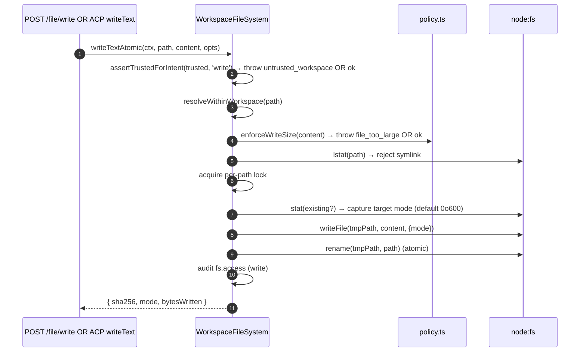
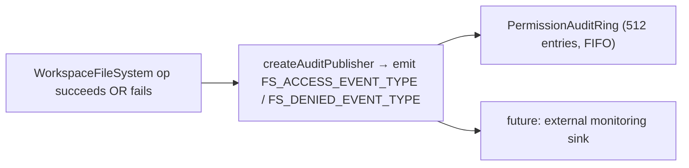

# 워크스페이스 파일 시스템 경계

## 개요

데몬 HTTP 파일 라우트와 위임된 ACP `readTextFile` / `writeTextFile` 호출은 `WorkspaceFileSystem` 경계(`packages/cli/src/serve/fs/`)를 통과하며, 이 경계가 제공하는 기능은 다음과 같습니다:

- **경로 해석** — 경로를 정규화하고 심볼릭 링크를 포함한 워크스페이스 이탈을 거부합니다.
- **신뢰 게이트** — 워크스페이스가 신뢰되지 않을 때(`untrusted_workspace`) 쓰기를 거부합니다.
- **크기 및 콘텐츠 정책** — 전체 스냅샷/출력 상한(`MAX_READ_BYTES = 256 KiB`), 큰 텍스트 창의 출력 및 스캔 비용 상한(`MAX_TEXT_SCAN_BYTES = 8 MiB`), 쓰기 상한(`MAX_WRITE_BYTES = 5 MiB`), 이진 파일 감지.
- **원자성** — 대상 모드 보존과 새 파일 기본 `0o600`을 사용한 write-then-rename.
- **감사** — 모든 접근/거부가 `PermissionAuditRing`/모니터링용 구조화 이벤트를 발생시킵니다.
- **타입화된 에러** — HTTP 상태로 매핑되는 닫힌 `FsErrorKind` 유니언.

HTTP 파일 라우트(`GET /file`, `GET /file/bytes`, `POST /file/write`, `POST /file/edit`, `GET /list`, `GET /glob`, `GET /stat`)는 이 경계를 사용합니다. 프로덕션 데몬에서 위임된 상태로 남는 ACP 호출은 주입된 브리지 어댑터를 통해 WFS에 도달합니다. 일반 브리지 호출자는 이러한 어댑터를 주입할 때만 WFS를 사용합니다. 프로덕션 동일 호스트 `qwen serve` 런타임은 `readTextFile: false`를 광고하므로, 모든 자식 `FileSystemService.readTextFile` 소비자는 일반 CLI 파일시스템 서비스를 사용합니다. 최종 ACP `writeTextFile` 콘텐츠 쓰기는 WFS를 통해 위임된 상태로 유지됩니다.

이 텍스트 읽기 기능 슬라이스는 직접 `read_file`과 write, edit, notebook, sed, artifact 작업에서 사용되는 공유 사전 읽기를 포함합니다:

- 의도적으로 일반 CLI 읽기 동작을 수용하며 WFS 읽기 측 보장은 수용하지 않습니다. [설계 문서](../../design/daemon-local-text-reads.md)가 포기하는 항목의 정확한 목록을 소유합니다.
- 같은 문서가 이 변경 후에도 write 및 edit 계열에 대해 #8618이 여전히 재현되는 이유와, 유지된 어댑터 읽기 경로가 "안전하게 실패하는" 제한된 의미를 기록합니다.
- 직접 외부 `read_file`은 일반 CLI 권한 규칙과 핵심 파일 작업 텔레메트리를 유지합니다.
- HTTP 파일시스템 라우트는 워크스페이스 범위로 유지되며, 에이전트 발견 도구 동작은 이 기능에 의해 변경되지 않습니다.
- 상위 디렉토리 생성 및 셸 명령과 같은 보조 작업은 별도의 기존 경로이며 이 경계에서 다루지 않습니다.
- `qwen serve`은 동일 머신, 동일 UID 보안 주체를 가정하며 OS 샌드박스가 아닙니다.

## 책임

- 사용자가 제공한 경로를 경계의 나머지 부분에서 안전하게 사용할 수 있는 브랜드화된 `ResolvedPath` 값으로 해석합니다.
- 바인딩된 워크스페이스 외부 경로(`path_outside_workspace`)와 대상이 심볼릭 링크인 경로(`symlink_escape`)를 거부합니다.
- `MAX_READ_BYTES`를 초과하는 전체 스냅샷 읽기를 거부하되, 출력이 `MAX_READ_BYTES`로 제한되고 스캔 비용이 `MAX_TEXT_SCAN_BYTES`로 제한되는 명시적 창은 허용합니다. `MAX_WRITE_BYTES`를 초과하는 쓰기 및 이진 파일(`binary_file`)을 거부합니다.
- 워크스페이스가 신뢰되지 않을 때 쓰기/편집을 거부합니다(`untrusted_workspace`) — `assertTrustedForIntent(trusted, intent)`로 게이트됩니다.
- `shouldIgnore`를 통해 `.gitignore` / `.qwenignore` 패턴을 준수합니다.
- 대상 모드 보존과 함께 원자적 write-then-rename을 수행합니다. 새 파일 기본 모드는 `0o600`입니다.
- 모든 작업에서 `fs.access` / `fs.denied` 감사 이벤트를 발생시킵니다.
- 모든 실패를 종류와 HTTP 상태가 포함된 `FsError`로 매핑합니다. 라우트 핸들러는 이를 일관되게 직렬화합니다.

## 아키텍처

### 모듈 레이아웃

| 파일                       | 목적                                                                                                                                                                                                                                                |
| -------------------------- | --------------------------------------------------------------------------------------------------------------------------------------------------------------------------------------------------------------------------------------------------- |
| `paths.ts`                 | `canonicalizeWorkspace`, `resolveWithinWorkspace`, `hasSuspiciousPathPattern`, 브랜드화된 `ResolvedPath`, `Intent` 유니언 (`read \| write \| list \| stat \| glob`).                                                                                |
| `policy.ts`                | `MAX_READ_BYTES`, `MAX_TEXT_SCAN_BYTES`, `MAX_WRITE_BYTES`, `BINARY_PROBE_BYTES`, `assertTrustedForIntent`, `detectBinary`, `enforceReadBytesSize`, `enforceReadSize`, `enforceWriteSize`, `shouldIgnore`.                                         |
| `audit.ts`                 | `FS_ACCESS_EVENT_TYPE`, `FS_DENIED_EVENT_TYPE`, `createAuditPublisher`, 감사 페이로드 타입.                                                                                                                                                        |
| `errors.ts`                | `FsError` 클래스, `isFsError`, `FsErrorKind` 유니언 (14종), `FsErrorStatus` 유니언 (`400 / 403 / 404 / 409 / 413 / 422 / 500 / 503`).                                                                                                              |
| `workspace-file-system.ts` | `createWorkspaceFileSystemFactory`, `WorkspaceFileSystem`(읽기/쓰기/목록을 조율하는 오케스트레이터), `WriteMode`, `ContentHash`, `FsEntry`, `FsStat`, `ListOptions`, `GlobOptions`, `ReadTextOptions`, `ReadBytesOptions`, `WriteTextAtomicOptions`. |

### `FsErrorKind` 분류

| 종류                     | 기본 HTTP | 의미                                                                                                                                                                                        |
| ------------------------ | --------- | ------------------------------------------------------------------------------------------------------------------------------------------------------------------------------------------- |
| `path_outside_workspace` | 400       | 해석된 경로가 바인딩된 워크스페이스 외부에 있습니다.                                                                                                                                        |
| `symlink_escape`         | 400       | 대상이 심볼릭 링크입니다(보수적인 PR 18 + PR 20 정책에 따라 거부됨).                                                                                                                        |
| `path_not_found`         | 404       | `ENOENT`.                                                                                                                                                                                    |
| `binary_file`            | 422       | 텍스트 라우트에서 콘텐츠가 이진으로 감지되었거나, 텍스트 라우트가 디코딩할 수 없는 인코딩의 큰 텍스트입니다.                                                                                 |
| `file_too_large`         | 413       | 창 없는/전체 스냅샷 텍스트가 `MAX_READ_BYTES`를 초과하거나, 라인 오프셋이 `MAX_TEXT_SCAN_BYTES`를 초과하거나, 쓰기가 `MAX_WRITE_BYTES`를 초과합니다.                                         |
| `hash_mismatch`          | 409       | 낙관적 동시성 `expectedSha256`이 실패했거나, 안정적 읽기 중에 파일이 변경되었습니다.                                                                                                         |
| `file_already_exists`    | 409       | 기존 파일에 대해 `mode: 'create'`가 사용되었습니다.                                                                                                                                         |
| `text_not_found`         | 422       | `POST /file/edit`의 검색 문자열이 파일에 없습니다.                                                                                                                                          |
| `ambiguous_text_match`   | 422       | 정확히 하나여야 하는 매치에서 여러 개가 발견되었습니다.                                                                                                                                     |
| `untrusted_workspace`    | 403       | 신뢰되지 않는 워크스페이스에서 쓰기가 시도되었습니다.                                                                                                                                       |
| `permission_denied`      | 403       | OS 수준의 `EACCES` / `EPERM`.                                                                                                                                                               |
| `io_error`               | 503       | `ENOSPC` / `EIO` / `EBUSY` / `ETXTBSY` / `ENAMETOOLONG` / `EMFILE` / `ENFILE`. **`permission_denied`와 구별됩니다.** 모니터링 파이프라인이 "디스크 가득" 문제를 보안 담당자에게 페이지하지 않도록 합니다. |
| `internal_error`         | 500       | 경계에 도달한 비-errno 에러(`TypeError`, 프로그래머 버그).                                                                                                                                   |
| `parse_error`            | 400 / 422 | 요청 바디 파싱 에러(400) 또는 서비스 수준 불변식 위반(422).                                                                                                                                 |

### `BridgeFileSystem`(ACP 측 어댑터)

`packages/acp-bridge/src/bridgeFileSystem.ts`는 다음을 정의합니다:

```ts
interface BridgeFileSystem {
  readText(params: ReadTextFileRequest): Promise<ReadTextFileResponse>;
  writeText(params: WriteTextFileRequest): Promise<WriteTextFileResponse>;
}
```

이것은 ACP `readTextFile` / `writeTextFile`의 주입 지점입니다. Bridge 테스트와 Mode A 임베디드 호출자는 `BridgeOptions`에서 이를 생략할 수 있으며, `BridgeClient`는 인라인 `fs.readFile` / `fs.writeFile` 프록시로 폴백합니다(pre-F1 동작 보존). 프로덕션 `qwen serve`는 `createBridgeFileSystemAdapter(fsFactory)`(`packages/cli/src/serve/bridge-file-system-adapter.ts`)를 통해 `BridgeFileSystem`를 연결하고 `delegateReadTextFileToClient: false`를 설정합니다. 따라서 기능을 준수하는 자식은 텍스트를 로컬에서 읽고 최종 ACP 텍스트 쓰기를 위임합니다. 어댑터는 읽기 구현을 유지하므로 예기치 않거나 기능을 위반하는 위임 읽기도 여전히 WFS의 워크스페이스 경계에 도달합니다.

어댑터가 반드시 보존해야 하는 두 가지 방어적 속성(어댑터가 주입되면 인라인 프록시는 완전히 우회되므로):

1. **일반 파일이 아닌 것 거부** — 소켓 / 파이프 / 문자 디바이스 / procfs / sysfs 항목은 `stats.size === 0`이어도 무제한 데이터를 스트리밍할 수 있습니다. 인라인 경로는 메시지에 `describeStatKind(stats)`와 함께 예외를 발생시킵니다.
2. **무제한 전체 파일 버퍼링 방지.** 인라인 폴백은 버퍼링 읽기를 `READ_FILE_SIZE_CAP = 100 MiB`로 제한합니다. 주입된 어댑터는 더 엄격한 WorkspaceFileSystem 계약을 적용합니다. 전체 스냅샷은 256 KiB에서 멈추고, 더 큰 UTF-8 파일은 유한한 `limit`이 필요하며 inode에 바운드된 핸들에서 스트리밍되어 최대 256 KiB만 반환됩니다. 500 MB 로그 전체를 읽어서 `{ line: 1, limit: 10 }`만 반환해서는 안 됩니다.

어댑터는 더 나아가서: `WorkspaceFileSystem.writeTextOverwrite`(PR 18 프리미티브)를 사용하여 원자적 임시 파일 생성 및 rename 쓰기, 모드 보존, `0o600` 기본값, 그리고 경로별 잠금 내의 심볼릭 링크 거부를 수행합니다. 이것은 심볼릭 링크를 해석하여 대상으로 쓰기를 수행했던 **pre-F1 인라인 프록시와의 차이점**입니다 — 심볼릭 링크된 dotfile을 통해 쓰기에 의존하던 에이전트는 이제 해석된 경로로 직접 접근해야 합니다.

### ACP 와이어에서의 FsError 보존

`BridgeFileSystem` 어댑터가 `FsError`(`kind: 'untrusted_workspace'` / `'symlink_escape'` / `'file_too_large'` / 등)를 발생시키면, ACP SDK의 기본 RPC 에러 경로는 `error.message`만 제네릭 `-32603 "Internal error"`로 직렬화합니다 — `kind` / `status` / `hint`는 제거됩니다. 그러면 다운스트림 에이전트 RPC 클라이언트는 타입화된 UI(인증 재시도 vs 파일 선택기 vs 프록시 힌트)를 디스패치하기 위해 사람이 읽을 수 있는 메시지를 정규식으로 매칭해야 합니다.

`BridgeClient.writeTextFile`과 `BridgeClient.readTextFile`은 FsError 형태의 예외를 잡아 ACP `RequestError`로 다시 발생시키는 얇은 가드(`packages/acp-bridge/src/bridgeClient.ts`)를 설치합니다:

```ts
function isFsErrorShape(err: unknown): err is FsErrorShape {
  return (
    err instanceof Error &&
    err.name === 'FsError' &&
    typeof (err as { kind?: unknown }).kind === 'string'
  );
}

function preserveFsErrorOverAcp(err: unknown): never {
  if (isFsErrorShape(err)) {
    throw new RequestError(-32603, err.message, {
      errorKind: err.kind,
      ...(err.hint !== undefined ? { hint: err.hint } : {}),
      ...(err.status !== undefined ? { status: err.status } : {}),
    });
  }
  throw err;
}
```

이제 에이전트의 RPC 클라이언트는 `data.errorKind`(닫힌 `FsErrorKind` 값)과 선택적 `data.hint`, `data.status`를 받으므로, SDK 소비자는 메시지를 정규식으로 매칭하는 대신 타입화된 열거형으로 분기합니다.

두 가지 설계 참고 사항:

- **임포트 대신 덕 타이핑** — `FsError`는 `packages/cli/src/serve/fs/errors.ts`에 있고 `BridgeClient`는 `packages/acp-bridge`에 있습니다. 직접적인 `import { FsError }`는 의존성을 역전시키게 됩니다. 덕 체크(`name === 'FsError'` + `kind: string`)는 동일한 크로스 패키지 번들링 이유로 `mapDomainErrorToErrorKind`(`status.ts`)가 `TrustGateError` / `SkillError`에 대해 이미 수행하는 방식과 동일합니다.
- **JSON-RPC 코드는 -32603 유지** — 브리지는 `FsError.kind`를 JSON-RPC 에러 코드 형태로 안정적으로 매핑할 수 없으므로, 구조화된 `data` 필드가 SDK 소비자를 위한 시맨틱 정보를 전달합니다. 와이어 상태 코드(`-32603` "internal error")는 변경되지 않으며, 클라이언트는 `data.errorKind`로 라우팅합니다.

### 신뢰 게이트

`assertTrustedForIntent(trusted, intent)`는 호출자가 주입한 신뢰 부울을 소비합니다. 정책 레이어는 `Config.isTrustedFolder()`를 직접 읽지 않습니다. 읽기 / 목록 / stat / glob은 항상 허용됩니다(신뢰는 쓰기 전용). 신뢰되지 않는 워크스페이스에서의 쓰기 인텐트는 `FsError('untrusted_workspace', ..., status: 403)`를 발생시킵니다. 신뢰 신호는 `WorkspaceFileSystemFactoryDeps.trusted: boolean`을 통해 유입됩니다 — `runQwenServe`은 운영자가 암묵적으로 신뢰하는 워크스페이스에 대해 데몬을 부팅하므로 `true`를 전달하고, `createServeApp`(`runQwenServe` 없는 직접 임베딩)은 `false`로 기본 설정되며 프로세스당 한 번 경고합니다([`02-serve-runtime.md`](./02-serve-runtime.md) 참조).

## 워크플로

### 읽기

```mermaid
sequenceDiagram
    autonumber
    participant R as HTTP route OR BridgeFileSystem.readText
    participant FS as WorkspaceFileSystem
    participant POL as policy.ts
    participant FSP as node:fs

    R->>FS: readText(ctx, path, opts)
    FS->>FS: resolveWithinWorkspace(path) → ResolvedPath OR throw
    FS->>FSP: stat(path)
    FSP-->>FS: stats
    FS->>FS: reject if not regular file (describeStatKind)
    alt cursor supplied
        FS->>FSP: open stable FileHandle
        FS->>FS: validate cursor {dev,ino,size}; seek to the byte offset
        FS->>FS: return whole lines; emit the next cursor
    else file <= 256 KiB
        FS->>FSP: open + read stable full snapshot
        FSP-->>FS: buffer
        FS->>FS: hash full snapshot; apply line/output limits
    else file > 256 KiB AND an explicit window arg
        FS->>FSP: open stable FileHandle
        FS->>FS: stream requested lines from the same inode
        FS->>FS: cap output at 256 KiB and scan at 8 MiB; omit full-file hash
    else windowless large read
        FS-->>R: file_too_large
    end
    FS->>POL: detectBinary(sample)
    POL-->>FS: isBinary?
    FS->>FS: reject if binary
    FS->>FS: shouldIgnore? → annotate meta.matchedIgnore
    FS->>FS: audit fs.access
    FS-->>R: { content, optional sha256, truncated?, meta }
```

`readText`는 무시 규칙 때문에 읽기를 건너뛰거나 거부하지 않습니다. 파일을 정상적으로 읽고 `meta.matchedIgnore`에 매칭된 무시 분류를 기록합니다. `list`와 `glob`은 `includeIgnored`가 활성화되지 않은 경우에만 무시된 결과를 필터링합니다.

### 쓰기



원자적 write-then-rename은 쓰기 중 SIGKILL / OOM이 발생해도 대상이 잘린 상태로 남지 않도록 보장합니다. `mode: 'create'`는 lstat에서 `file_already_exists`로 중단됩니다. `mode: 'overwrite'`는 진행됩니다. `expectedSha256`은 낙관적 동시성을 활성화합니다(불일치 시 `hash_mismatch`).

### `POST /file/edit`(단일 텍스트 교체)

쓰기 위에 두 가지 실패 모드를 추가합니다:

- `text_not_found`(422) — 검색 문자열이 파일에 없습니다.
- `ambiguous_text_match`(422) — 정확히 하나여야 하는 매치에서 여러 개가 발견되었습니다(라우트의 계약).

### 감사 팬아웃



`FS_ACCESS_EVENT_TYPE` / `FS_DENIED_EVENT_TYPE`는 컨텍스트(`ctx`), 경로, 인텐트, 결과, errorKind?, bytesRead/written, sha256?를 전달합니다.

## 상태 및 수명주기

- 팩토리는 데몬 부팅 시 한 번 빌드됩니다(`runQwenServe` → `resolveBridgeFsFactory` → 어댑터).
- 각 요청은 `RequestContext`를 생성하고 해당 호출에 대해서만 팩토리의 오케스트레이터를 호출합니다 — 파일별 장기 상태는 없습니다.
- 경로별 잠금은 쓰기 작업 동안에만 존재합니다(크로스 콜 잠금 없음. 동일 경로에 대한 동시 쓰기는 잠금에서 경합하여 직렬화됩니다).
- 감사 링은 `runQwenServe`이 소유하며 권한 감사 퍼블리셔와 공유됩니다.

## 의존성

- `@qwen-code/qwen-code-core` — `Ignore`, `isBinaryFile`, `Config.isTrustedFolder()`.
- `node:fs`, `node:path`, `node:crypto`.
- `@qwen-code/acp-bridge` — ACP 측의 `BridgeFileSystem` 계약.
- HTTP 라우트: `packages/cli/src/serve/routes/workspace-file-read.ts`, `workspace-file-write.ts`.

## 설정

| 소스                                              | 노브                                                                  | 효과                                                                                                                |
| ------------------------------------------------- | --------------------------------------------------------------------- | ------------------------------------------------------------------------------------------------------------------- |
| `WorkspaceFileSystemFactoryDeps.trusted: boolean` | 생성자 입력                                                           | 쓰기 허용 여부. `runQwenServe`에서는 `true`가 기본값, `createServeApp`에서는 `false`가 기본값(경고 포함).           |
| 상수                                              | `MAX_READ_BYTES = 256 KiB`                                            | 전체 스냅샷 및 반환 텍스트 상한. 더 큰 텍스트는 명시적 창 인수가 필요합니다.                                        |
| 상수                                              | `MAX_TEXT_SCAN_BYTES = 8 MiB`                                         | 큰 텍스트 읽기가 라인 오프셋을 찾기 위해 스캔할 수 있는 바이트 수. 이를 초과하면 `file_too_large`.                  |
| 상수                                              | `MAX_WRITE_BYTES = 5 MiB`                                             | 쓰기 상한. `express.json({ limit: '10mb' })`보다 작게 설정됨.                                                       |
| 상수                                              | `BINARY_PROBE_BYTES = 4096`                                           | 콘텐츠 기반 이진 감지를 위한 샘플 크기.                                                                             |
| 기능 태그                                         | `workspace_file_read`, `workspace_file_bytes`, `workspace_file_write` | [`11-capabilities-versioning.md`](./11-capabilities-versioning.md) 참조.                                            |
| 워크스페이스 파일                                 | `.gitignore`, `.qwenignore`                                           | 무시된 경로는 `shouldIgnore`에서 `ignored: true`로 나타납니다.                                                     |

## 주의 사항 및 알려진 제한

- **심볼릭 링크는 해석되지 않고 거부됩니다.** 이것은 심볼릭 링크를 해석했던 pre-F1 인라인 `BridgeClient.writeTextFile` 프록시와의 차이점입니다. 심볼릭 링크된 dotfile을 통해 쓰는 에이전트는 해석된 경로로 직접 접근해야 합니다.
- **`io_error`와 `permission_denied`는 구별됩니다.** 혼동하지 마세요. 모니터링 파이프라인은 알림에 `errorKind`를 사용합니다. ENOSPC를 permission_denied로 합치면 보안 담당자가 `df -h` 문제로 호출받게 됩니다.
- **새 파일 모드는 umask 기본값이 아닌 `0o600`이 기본값입니다.** 쓰기 syscall의 `mode` 인수는 umask를 우회합니다. 공개 파일을 쓰는 에이전트는 명시적으로 모드 오버라이드를 전달해야 합니다.
- **`createServeApp`의 기본 `trusted: false`**는 커스텀 `fsFactory` 또는 `bridge`를 주입하지 않는 임베더에 대해 ACP 쓰기를 `untrusted_workspace`로 조용히 거부합니다. 첫 번째 호출 시 한 번의 stderr 경고가 발생하며, 이후 호출자는 알림을 받지 못합니다. [`02-serve-runtime.md`](./02-serve-runtime.md) 참조.
- **큰 텍스트는 명시적 창 인수가 필요합니다.** `line` / `limit` / `maxBytes` 중 하나. 이 중 아무것도 없는 읽기는 `file_too_large`로 남습니다. 전체 파일을 가지고 있다고 생각하는 호출자가 잘린 상태로 다시 쓸 수 있기 때문입니다. 창은 inode에 바운드된 핸들에서 스트리밍되며 `MAX_READ_BYTES`를 초과하여 반환하지 않습니다.
- **`MAX_READ_BYTES`는 읽기가 반환하는 것을 제한하고, `MAX_TEXT_SCAN_BYTES`는 비용을 제한합니다.** 라인 오프셋은 바이트 0부터 스캔하여 해석되므로, `{ line: 900_000_000, limit: 20 }`은 거의 아무것도 반환하지 않으면서도 파일을 끝까지 스캔합니다. 8 MiB 이상의 스캔 후 읽기는 `file_too_large`로 거부되며, 어떤 오프셋이든 O(1)에 도달하는 `readBytes`를 가리킵니다.
- **스트리밍된 창은 추가는 허용하지만 잘리기는 허용하지 않습니다.** 전체 스냅샷 경로는 전체 파일을 반환하기 때문에 바이트 단위의 안정성을 요구할 수 있습니다. 접두사 창은 그럴 수 없으며, 그렇지 않으면 라이브 로그의 모든 읽기가 실패합니다. 스트리밍 경로는 inode 정체성과 "줄어들지 않음"을 검증하므로, 추가는 통과하고 잘리기 / 교체는 여전히 거부됩니다. `sizeBytes`는 `open` 시점의 크기를 보고하며, 창이 잘려 나온 스냅샷을 설명합니다.
- **큰 부분 읽기는 전체 파일 해시를 생략합니다.** 스트리밍이 EOF 전에 멈추면 `originalLineCount`가 생략됩니다.
- **페이징은 라인 기준이 아닌 바이트 커서 기준입니다.** 콘텐츠를 남긴 읽기는 `hasMore`와, 바이트 오프셋을 파생할 수 있는 경우 불투명한 `nextCursor`를 반환합니다. 이것으로부터 재개하면 O(1)입니다. `line`으로 재개하면 바이트 0부터 재스캔하며 `MAX_TEXT_SCAN_BYTES`를 초과하면 거부됩니다. 커서는 `{dev, ino, size}`를 가지므로, 교체되거나 잘린 파일은 잘못된 위치의 바이트 대신 `hash_mismatch`를 발생시키며, 추가는 유효한 상태로 남깁니다. 비-UTF-8 스냅샷 읽기는 `hasMore`를 보고하지만 커서는 없습니다 — 디코딩된 텍스트가 UTF-8로 재인코딩된 것이므로 길이가 파일 오프셋과 매핑되지 않습니다.
- **`BridgeFileSystem` 어댑터는 두 가지 인라인 프록시 게이트를 모두 복제해야 합니다**(일반 파일이 아닌 것 거부 + 제한된 버퍼링/스트리밍). 어댑터가 주입되면 인라인 경로는 완전히 우회됩니다.

## 참고 문헌

- `packages/cli/src/serve/fs/index.ts`(배럴)
- `packages/cli/src/serve/fs/paths.ts`
- `packages/cli/src/serve/fs/policy.ts`
- `packages/cli/src/serve/fs/errors.ts`
- `packages/cli/src/serve/fs/audit.ts`
- `packages/cli/src/serve/fs/workspace-file-system.ts`
- `packages/cli/src/serve/bridge-file-system-adapter.ts`
- `packages/acp-bridge/src/bridgeFileSystem.ts`
- HTTP 라우트 레퍼런스: [`../qwen-serve-protocol.md`](../qwen-serve-protocol.md).
