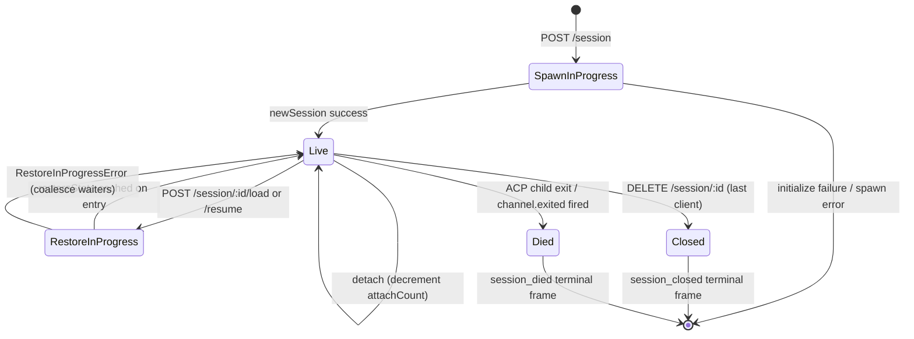

# 세션 생명주기 및 Identity

## 개요

데몬 **세션**은 하나의 ACP `sessionId`에 고정된 하나의 논리적 대화입니다. 브리지는 세션마다 [`03-acp-bridge.md`](./03-acp-bridge.md)에 설명된 `SessionEntry`를 유지하며, ACP 자식 연결과 HTTP 측 관리를 결합합니다: 프롬프트 FIFO, 모델 변경 FIFO, 이벤트 버스, 대기 중인 권한, 연결된 클라이언트, 하트비트, 복원 상태, 터미널 프레임 톰스톤.

데몬 **클라이언트**는 `X-Qwen-Client-Id`로 식별됩니다. 이는 HTTP 호출자가 요청에 붙이는 불투명하고 데몬이 검증하는 문자열입니다. 브리지는 어떤 클라이언트가 어떤 세션에 연결되어 있는지 추적하며, originator client id를 사용해 `designated` 권한 정책, 감사 추적, 이벤트 귀인을 처리합니다.

이 문서는 모든 세션 생명주기 전환(create / attach / load / resume / close / die / evict)과 데몬이 노출하는 모든 identity 서피스를 설명합니다.

## 책임

- 세션 생성, 연결, 복원, 정리.
- `X-Qwen-Client-Id` 검증 및 잘못된 id 거부.
- 세션당 다중 연결 클라이언트 추적(`clientIds: Map<string, count>`, `attachCount`).
- 송신 이벤트에 `originatorClientId` 기록.
- 대시보드에서 어떤 클라이언트가 여전히 연결되어 있는지 확인할 수 있도록 하트비트 실행.
- 운영자가 `PATCH /session/:id/metadata`로 설정하는 세션 메타데이터(`displayName`) 제공.
- 터미널 프레임 송신 처리(`session_died`, `session_closed`, `client_evicted`, `stream_error`).

## 아키텍처

| 관심사                    | 소스                                                         | 비고                                                                                        |
| ------------------------- | ------------------------------------------------------------ | ------------------------------------------------------------------------------------------- |
| `SessionEntry`            | `packages/acp-bridge/src/bridge.ts`                          | 세션별 구조체. 전체 필드 목록은 [`03-acp-bridge.md`](./03-acp-bridge.md) 참조.             |
| `BridgeSession` (공개)    | `packages/acp-bridge/src/bridgeTypes.ts`                     | `{ sessionId, workspaceCwd, attached, clientId?, createdAt? }` — HTTP 핸들러에 반환.         |
| `BridgeSessionState`      | `packages/acp-bridge/src/bridgeTypes.ts`                     | `LoadSessionResponse \| ResumeSessionResponse` — 엔트리에 `restoreState`로 캐시.             |
| `DaemonSession` (SDK)     | `packages/sdk-typescript/src/daemon/types.ts`                | `{ sessionId, workspaceCwd, attached, clientId?, createdAt? }`.                             |
| Client-id 검증            | `packages/acp-bridge/src/bridge.ts` (`spawnOrAttach` 근처)   | 패턴 `[A-Za-z0-9._:-]{1,128}`. 잘못된 형식이면 `InvalidClientIdError`.                     |
| 세션 연결 끊김 정리       | `packages/cli/src/serve/server.ts`                           | `attachCount` + `spawnOwnerWantedKill`로 spawn 소유자 연결 끊김 추적.                      |

### 상태 머신



### Attach vs Spawn

`sessionScope: 'single'`(기본값)에서 브리지의 `defaultEntry`는 모든 연결 클라이언트가 공유합니다. `defaultEntry`가 이미 존재하는 상태에서 `POST /session`이 도착하면 새 ACP 자식을 생성하지 않고 `attached: true`를 반환합니다. 브리지는 `attachCount`를 동기적으로 증가시키고 호출자의 `X-Qwen-Client-Id`를 `clientIds`에 등록합니다.

`sessionScope: 'thread'`에서는 각 스레드가 고유한 세션을 생성할 수 있습니다. 호출자는 여전히 `maxSessions`을 준수해야 합니다.

### Identity

`X-Qwen-Client-Id`는 **선택 사항**이지만 **강력히 권장**됩니다. 데몬이 호출자를 대신해 생성하지 않습니다. 클라이언트가 직접 선택하여 요청 간에 재사용하면, 데몬이 투표 귀인, 이벤트 감사, 재연결 감지를 수행할 수 있습니다.

검증 규칙:

- 문자 집합: `[A-Za-z0-9._:-]`.
- 길이: 1–128.
- 범위를 벗어나면: `InvalidClientIdError`(`400`).

데몬은 다음 조건을 모두 만족할 때 송신 SSE 이벤트에 `originatorClientId`를 기록합니다:

1. 이벤트를 촉발한 요청에 `X-Qwen-Client-Id`가 포함되어 있고, AND
2. 해당 id가 세션의 `clientIds` 집합에 현재 등록되어 있으며, AND
3. 세션에 `activePromptOriginatorClientId`가 설정되어 있음(인라인 `sessionUpdate` 및 `permission_request`는 활성 프롬프트의 originator를 상속).

`X-Qwen-Client-Id`가 없는 익명 호출자는 `first-responder` 정책에서 정상 작동합니다. `designated`는 `permission_forbidden{ reason: 'designated_mismatch' }`로 투표를 거부합니다. `consensus`는 투표자가 발행 시점의 `votersAtIssue` 스냅샷에 없으므로 동일한 `forbidden` 사유로 거부합니다. `local-only`만이 익명 루프백 투표자를 허용하는 유일한 정책입니다.

## 워크플로

### 생성 또는 연결

```mermaid
sequenceDiagram
    autonumber
    participant C as Client
    participant R as POST /session
    participant B as Bridge.spawnOrAttach
    participant CH as ACP child

    C->>R: POST /session<br/>X-Qwen-Client-Id: alice<br/>{cwd, sessionScope?}
    R->>R: validate clientId pattern
    R->>B: spawnOrAttach({cwd, sessionScope, clientId})
    alt single scope + defaultEntry exists
        B->>B: bump attachCount; register clientId
        B-->>R: {sessionId, attached: true, restoreState?}
    else cold
        B->>CH: spawn + ACP initialize + newSession
        CH-->>B: sessionId
        B->>B: build SessionEntry; register in byId
        B-->>R: {sessionId, attached: false}
    end
    R-->>C: 200 { sessionId, attached, ... }
```

### 로드 / 재개

`POST /session/:id/load` — 영속화된 세션을 복원하고 현재 경계 replay 스냅샷 창을 반환합니다(`session/load` 알림 또는 응답 모드 리플레이가 응답 반환 전에 시드됨).

`POST /session/:id/resume` — 리플레이 없이 복원(`connection.unstable_resumeSession`, 안정 `session_resume` 데몬 capability로 노출. `unstable_session_resume`는 더 이상 사용되지 않는 별칭으로 유지).

공통:

1. 채널의 세션별 `pendingRestoreIds` 집합을 사용해 동시 복원 호출을 병합(`RestoreInProgressError`).
2. 엔트리에 `restoreState`를 캐시하여 늦게 연결하는 클라이언트도 원래 복원자와 동일한 페이로드를 받도록 함.

### 하트비트

`POST /session/:id/heartbeat`는 `clientId`와 무관하게 `sessionLastSeenAt`를 갱신합니다. 요청에 등록된 `X-Qwen-Client-Id`가 포함되어 있으면 `clientLastSeenAt.set(clientId, Date.now())`도 갱신됩니다. 클라이언트별 축출은 v1에서 **구현되지 않았습니다**. 폐지 정책은 F-series Wave 5에서 계획 중입니다. 현재 하트비트는 대시보드와 PR 24의 예정된 폐지 정책을 위한 관측 가능성을 제공합니다.

### 메타데이터

`PATCH /session/:id/metadata`는 `{displayName?}`을 받습니다. 검증:

- 최대 길이: `MAX_DISPLAY_NAME_LENGTH = 256`.
- 제어 문자 포함 불가(`hasControlCharacter`가 코드 포인트 ≤ 0x1f 또는 == 0x7f를 거부).
- 위반 시 `InvalidSessionMetadataError`(`400`).

성공 시 모든 구독자에게 `session_metadata_updated`를 전송합니다.

### 종료

| 터미널 프레임      | 트리거                                                                                                                                          |
| ------------------ | ----------------------------------------------------------------------------------------------------------------------------------------------- |
| `session_closed`   | `DELETE /session/:id`(client_close) 또는 프로그래밍 방식 종료.                                                                                   |
| `session_died`     | `channel.exited`가 어떤 이유로든 발생(크래시, 자식 kill). OS 종료 경로를 사용한 경우 `exitCode?` + `signalCode?` 포함.                           |
| `client_evicted`   | EventBus의 구독자별 큐 오버플로([`10-event-bus.md`](./10-event-bus.md) 참조). 세션 수준 종료가 아니라 **해당 구독자만** 종료.                    |
| `stream_error`     | SubscriberLimitExceededError 또는 기타 라우트 수준 스트림 실패.                                                                                  |

대기 중인 권한은 모든 종료 경로에서 `mediator.forgetSession(sessionId)`를 통해 `{kind:'cancelled', reason:'session_closed'}`로 해결됩니다.

### 연결 끊김 정리 가드

spawn 소유 클라이언트의 HTTP 응답을 작성할 수 없을 때(TCP 핸드셰이크 중 리셋), 라우트는 `killSession({ requireZeroAttaches: true })`을 호출합니다. 다른 클라이언트가 이미 연결되어 있으면(`attachCount > 0`) 가드가 단락되고 세션은 유지됩니다. `spawnOwnerWantedKill = true`로 의도를 기록하여, 나중에 `detachClient()`가 `attachCount`를 0으로 만들면 지연된 정리가 완료됩니다. 이 가드가 없으면 빠르게 연결이 끊기는 spawn 소유자가 정상 세션을 매번 종료해 버립니다.

## 상태 및 생명주기

생명주기에 중요한 `SessionEntry` 필드:

| 필드                               | 타입                  | 의미                                                                          |
| ---------------------------------- | --------------------- | ----------------------------------------------------------------------------- |
| `clientIds`                        | `Map<string, number>` | 등록된 클라이언트 id → 등록 참조 카운트.                                       |
| `attachCount`                      | `number`              | `spawnOrAttach`가 이 엔트리에 대해 `attached: true`를 반환한 횟수.             |
| `activePromptOriginatorClientId`   | `string?`             | 현재 실행 중인 프롬프트의 originator.                                          |
| `restoreState`                     | `BridgeSessionState?` | 캐시된 로드/재개 응답. 늦게 연결하는 클라이언트도 일관된 페이로드를 확인.      |
| `spawnOwnerWantedKill`             | `boolean`             | 지연 정리 톰스톤(위의 연결 끊김 정리 참조).                                   |
| `sessionLastSeenAt`                | `number?`             | 모든 클라이언트의 가장 최근 하트비트(epoch ms).                                |
| `clientLastSeenAt`                 | `Map<string, number>` | 클라이언트별 하트비트.                                                        |
| `pendingPermissionIds`             | `Set<string>`         | 현재 대기 중인 ACP requestId. 취소/종료 시 cancelled로 해결하는 데 사용.       |

## 의존성

- ACP 레이어: `connection.newSession`, `connection.unstable_resumeSession`, `connection.loadSession`.
- [`03-acp-bridge.md`](./03-acp-bridge.md) — 브리지 아키텍처 전체.
- [`04-permission-mediation.md`](./04-permission-mediation.md) — originator + identity가 정책 결정에 미치는 영향.
- [`10-event-bus.md`](./10-event-bus.md) — 터미널 프레임 전달.

## 추가 세션 엔드포인트

다음 엔드포인트는 기본 생명주기 서피스를 확장합니다:

### 논블로킹 프롬프트(`non_blocking_prompt` capability 태그)

`POST /session/:id/prompt`는 이제 프롬프트가 완료될 때까지 블로킹하는 대신 HTTP **202**와 `{ promptId, lastEventId }`를 반환합니다. 실제 결과는 SSE에서 `turn_complete` / `turn_error`로 전달되며, `promptId` 필드가 해당 이벤트를 202 응답과 연결합니다. `DaemonSessionClient.prompt()`은 활성 이벤트 구독이 있을 때 자동으로 논블로킹 경로를 사용하고 SSE 스트림에서 결과를 투명하게 매칭합니다.

### 세션 요약(`session_recap` capability 태그)

`POST /session/:id/recap`은 빠른 모델에게 "어디까지 했는지" 한 줄 요약을 요청합니다. `{ sessionId, recap: string | null }`을 반환하며, `null`은 히스토리가 너무 짧거나 모델이 일시적으로 실패했음을 의미합니다. 이 엔드포인트는 best-effort입니다.

### 세션 사이드 질문(`session_btw` capability 태그)

`POST /session/:id/btw`는 메인 대화 흐름을 방해하지 않고 세션 컨텍스트에 대해 일회성 질문을 합니다. 캐시 경로에서 `runForkedAgent`를 사용하여 단일 턴, 도구 없는 LLM 호출을 수행하고 `{ sessionId, answer: string | null }`을 반환합니다. 구현은 `BTW_MAX_INPUT_LENGTH`, 크로스 세션 유출 가드, 타임아웃 처리를 적용합니다.

### 셸 명령어 실행

`POST /session/:id/shell`은 LLM을 거치지 않고 데몬 호스트에서 직접 셸 명령어를 실행합니다. 세션 SSE 버스에서 `user_shell_command` / `user_shell_result` 이벤트로 출력을 스트리밍하고, 명령어와 결과를 LLM 대화 히스토리에 주입합니다. 응답은 `{ exitCode, output, aborted }`입니다. 활성 보조 워크스페이스 세션의 경우, 단일 REST 라우트가 세션 소유자를 확인하고 해당 런타임의 브리지에서 실행하므로 명령어는 소유 워크스페이스 cwd에서 시작됩니다. 이 라우트는 경로 샌드박스를 제공하지 않습니다. 워크스페이스 한정 ACP 클라이언트는 소유 워크스페이스 연결에서 `_qwen/session/shell`을 계속 사용할 수 있습니다.

### 세션 되감기

`GET /session/:id/rewind/snapshots` 및 `POST /session/:id/rewind`는 소유 활성 워크스페이스 런타임을 확인합니다. 영속화된 세션은 되감기 전에 로드하거나 재개해야 합니다. 되감기는 대화 히스토리를 자르고 `edit` 및 `write_file`로 추적되는 파일을 선택적으로 복원합니다. 셸 명령어, Git, 스크립트, 수동 변경은 되돌리지 않습니다. 파일 복원은 best-effort이므로, 응답이 대화 히스토리가 이미 이동한 후 `rewound: false` 및 `filesFailed[]`를 보고할 수 있습니다. SDK 되감기 호출은 클라이언트가 ACP 전송을 사용하는 경우에도 항상 owner-aware REST를 사용합니다. 변이는 엄격한 REST 인증을 유지해야 하기 때문입니다.

### 세션 분리

`POST /session/:id/detach`는 `attachCount`를 감소시켜 클라이언트를 세션에서 명시적으로 분리합니다. 이것만으로 세션이 종료되지는 않습니다. 다른 연결이나 구독자가 남아있지 않으면 세션이 정리됩니다. 이 엔드포인트는 204를 반환합니다.

### 배치 세션 삭제

`POST /sessions/delete`는 `{ sessionIds: string[] }`(최대 100개 id)를 받아 브리지 세션을 종료하고 활성 또는 아카이브된 트랜스크립트 파일을 삭제합니다. 동일한 id에 대해 활성 및 아카이브 JSONL 파일이 모두 존재하면 하드 삭제가 둘 다 제거하므로 운영자가 충돌을 정리할 수 있습니다. 활성 및 아카이브 worktree 사이드카를 정리하지만, 파일 히스토리 스냅샷, 서브에이전트 트랜스크립트, 런타임 사이드카는 그대로 둡니다. 복원력을 위해 `Promise.allSettled`를 사용하며 `{ removed, notFound, errors }`를 반환합니다.

### 세션 아카이브

`POST /sessions/archive`는 비활성 세션 JSONL 파일을 `chats/`에서 `chats/archive/`로 이동합니다. 대상 세션이 활성 상태이면 데몬은 먼저 세션별 아카이브 게이트에 진입하고 ACP 자식이 `ChatRecordingService`를 플러시하도록 엄격 종료를 수행합니다. 종료나 플러시에 실패하면 아카이브는 JSONL을 제자리에 둡니다.

`POST /sessions/unarchive`는 아카이브된 JSONL 파일을 `chats/`로 다시 이동합니다. 이것은 저장소 상태 전환일 뿐이므로 클라이언트는 이후에 `session/load` 또는 `session/resume`을 호출해야 합니다. 아카이브된 세션은 로드/재개 시 `409 session_archived`를 반환하며, 아카이브 전환과 경합하는 변이는 `409 session_archiving`을 반환합니다.

### 컨텍스트 사용량(`session_context_usage` capability 태그)

`GET /session/:id/context-usage`는 구조화된 컨텍스트 창 사용량을 반환합니다. `?detail=true`는 도구, 메모리, skill별로 그룹화된 세분화된 사용량을 포함합니다.

### 세션 통계(`session_stats` capability 태그)

`GET /session/:id/stats`는 사용 통계를 반환합니다: 모델 지표(입력/출력 토큰, 캐시 읽기/쓰기, 총 비용), 도구별 호출 카운트 및 레이턴시, 파일 편집 카운트, 활성 세션의 skill별 호출 카운트. `skills` 블록은 이 세션의 skill 본문 로드 및 skill 슬래시 명령어만 반영하며, 크로스 세션 활동 집계가 아닙니다.

### 세션 작업(`session_tasks` capability 태그)

`GET /session/:id/tasks`는 에이전트 작업, 셸 작업, 모니터 작업 및 이들의 생명주기 상태에 대한 배경 작업 스냅샷을 반환합니다. 다른 서브에이전트가 생성한 에이전트 엔트리는 선택적 계보 필드(`parentAgentId`, `parentName`, `depth`)를 가지므로 클라이언트가 중첩된 서브에이전트를 트리로 렌더링할 수 있습니다. 페이로드 예시는 `qwen-serve-protocol.md`를 참조하세요.

`session_monitor_tool_correlation` capability는 모니터 엔트리가 `toolUseId`를 보장하여 클라이언트가 트랜스크립트 도구 호출을 해당 작업 세부 정보와 연결할 수 있게 합니다.

### 세션 LSP 상태(`session_lsp` capability 태그)

`GET /session/:id/lsp`는 데몬 클라이언트를 위한 정리된 세션별 LSP 상태를 반환합니다: 활성화 여부, 집계 서버 카운트, 사용 불가/초기화 상태, 서버별 `name`, `status`, `languages`, `transport`, `command`, `error`. 비활성화 또는 사용 불가 LSP는 전송 오류가 아닌 HTTP 200 상태 데이터로 표현됩니다.

### 압축 리플레이

`POST /session/:id/load`는 이제 `BridgeRestoredSession`을 반환하며, 여기에는 `compactedReplay?: BridgeEvent[]`, `liveJournal?: BridgeEvent[]`, `lastEventId?: number`가 포함될 수 있습니다. 이 필드들은 활성 세션의 데몬의 경계 내 메모리 리플레이 창이며 전체 트랜스크립트 API가 아닙니다. 기본 창 상선은 활성 세션당 4 MiB(`--compacted-replay-max-bytes`)이며, 부팅 시 잘못된 상선을 거부합니다. 하드 상한은 256 MiB입니다. `compactedReplay`는 `TurnBoundaryCompactionEngine`에서 생성됩니다: 턴 경계에서 연속 텍스트/사고 블록을 접고, 도구 호출 시퀀스를 최종 상태로 축소하며, 임시 신호를 버리고, O(tokens) 로그 대신 O(turns) 리플레이 로그를 생성합니다(일반적으로 25-30배 축소). 해당 바이트 창에서 이전 리플레이 엔트리가 삭제되면 `compactedReplay[0]`는 합성 id가 없는 `history_truncated` 마커이며 `{reason: 'replay_window_exceeded', truncatedEvents, retainedEvents, maxBytes, truncatedTurns?, fullTranscriptAvailable: boolean}`를 포함합니다. `fullTranscriptAvailable`은 capability 플래그입니다: `true`는 클라이언트가 `GET /session/:id/transcript`로 전체 영속 트랜스크립트를 페이지할 수 있음을 의미하고, `false`는 경계 내 리플레이만 사용 가능함을 의미합니다. 클라이언트는 이를 상태로 렌더링하고 보유된 리플레이를 정상적으로 적용해야 합니다. 재동기화 루프를 촉발해서는 안 됩니다.

### ACP 자식 예열

`bridge.preheat()`는 첫 세션 전에 ACP 자식 프로세스를 워밍업하여 첫 실제 세션에서 콜드 스타트 레이턴시를 방지합니다. `channelIdleTimeoutMs`와 쌍을 이루며, 이는 마지막 세션이 닫힌 후에도 ACP 자식을 유지하고, skip-relaunch 동작은 새 세션이 도착할 때 이미 유휴 상태인 자식을 재사용합니다.

## 설정

- `BridgeOptions.maxSessions`(기본값 32) — 상한.
- `BridgeOptions.sessionScope`(기본값 `'single'`; 선택적 `'thread'`).
- `BridgeOptions.initializeTimeoutMs`(기본값 10s) — ACP `initialize` 핸드셰이크.
- `BridgeOptions.sessionRestoreTimeoutMs`(기본값 60s) — ACP `loadSession` / `unstable_resumeSession` 기한. 기본값 60s이며, 명시적으로 설정된 initialize 타임아웃이 이를 올릴 수 있지만 낮출 수는 없습니다.
- `BridgeOptions.channelIdleTimeoutMs`(기본값 0; ACP 자식을 즉시 정리).
- Capability 태그: `session_create`, `session_id_override`, `session_scope_override`, `session_load`, `session_resume`, `unstable_session_resume`(더 이상 사용되지 않는 별칭), `session_list`, `session_info`, `session_close`, `session_metadata`, `session_set_model`, `client_identity`, `client_heartbeat`, `session_recap`, `session_generation`, `session_btw`, `session_context_usage`, `session_tasks`, `session_monitor_tool_correlation`, `session_stats`, `session_lsp`, `session_status`, `non_blocking_prompt`.

### 무상태 생성(`session_generation` capability 태그)

`POST /session/:id/generate`는 `{ "prompt": string }`을 받아 `started`, 선택적 `thinking`, `delta`, `done`, 또는 `error` 이벤트와 함께 요청 범위 SSE 스트림을 반환합니다. 이 요청은 대화 히스토리를 읽지 않고, 턴을 기록하지 않으며, 도구를 노출하지 않습니다. ACP 자식은 사용 가능한 경우 유효한 설정된 빠른 모델을 사용하고, 그렇지 않으면 세션의 메인 모델을 사용합니다.

## 주의사항 및 알려진 제한

- `connection.unstable_resumeSession`은 ACP 레이어에서 여전히 불안정할 수 있지만, 데몬은 커밋된 v1 라우트 계약을 `session_resume`로 광고합니다. `unstable_session_resume`는 더 이상 사용되지 않는 호환성 별칭으로만 유지됩니다.
- v1에는 **클라이언트별 축출이 없습니다**. 세션별 및 구독자별 종료만 존재합니다. 폐지 정책은 F-series Wave 5 / PR 24입니다.
- `client_evicted`는 세션별이 아닌 구독자별입니다. SSE 구독자가 축출된 클라이언트는 재연결할 수 있습니다.
- 익명 클라이언트(`X-Qwen-Client-Id` 없음)는 `designated` 또는 `consensus` 정책에서 투표할 수 없습니다.

## 참고 자료

- `packages/acp-bridge/src/bridge.ts`(SessionEntry 정의)
- `packages/acp-bridge/src/bridgeTypes.ts`(`HttpAcpBridge`, `BridgeSession`, `BridgeSessionState`)
- `packages/sdk-typescript/src/daemon/types.ts`(`DaemonSession`)
- `packages/sdk-typescript/src/daemon/DaemonSessionClient.ts`
- Wire 참고: [`../qwen-serve-protocol.md`](../qwen-serve-protocol.md)(라우트 카탈로그).
