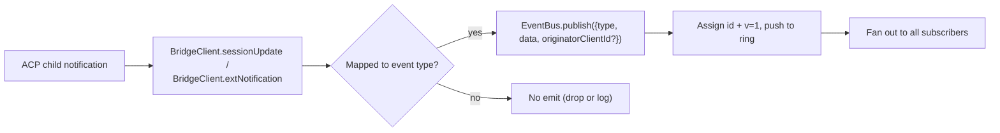
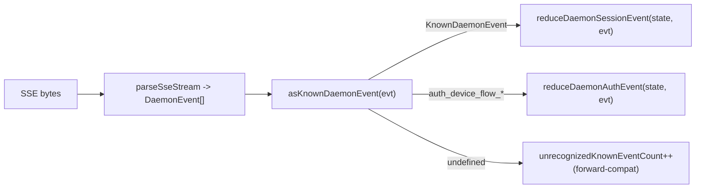

---

# 타입화된 Daemon 이벤트 스키마 v1

## 개요

`GET /session/:id/events`에서 daemon이 내보내는 모든 SSE 프레임은 `{ id, v, type, data, originatorClientId?, _meta? }` 형태를 갖는다. `v: 1`은 현재 `EVENT_SCHEMA_VERSION`이다. `type`은 `packages/sdk-typescript/src/daemon/events.ts`의 닫힌 집합인 `DAEMON_KNOWN_EVENT_TYPE_VALUES`에서 온다. 엔벨로프의 `_meta` 필드는 `packages/cli/src/serve/routes/sse-events.ts`의 `formatSseFrame()`에 의해 SSE 기록 시점에 찍힌다. [엔벨로프 수준 메타데이터](#envelope-level-metadata)를 참조.

SDK는 `asKnownDaemonEvent(evt)`를 노출한다. 알려진 이벤트 타입에 대해 판별된 `KnownDaemonEvent`를 반환하고, 그 외 타입에는 `undefined`를 반환한다. 따라서 SDK 사용자는 최신 daemon이 새 이벤트 타입을 추가할 때 SDK와 동시에 업그레이드할 필요 없이 forward compatibility를 처리할 수 있다. 세션 reducer는 이를 `unrecognizedKnownEventCount`로 기록한다.

wire 형식은 [`../qwen-serve-protocol.md`](../qwen-serve-protocol.md)에 있다. 이 페이지는 각 이벤트의 페이로드 계약이다.

## 책임

- 이벤트 어휘(`DAEMON_KNOWN_EVENT_TYPE_VALUES`)의 단일 정보 소스를 제공한다.
- 각 이벤트 타입에 대해 타입화된 엔벨로프(`DaemonEventEnvelope<TType, TData>`)를 제공한다.
- 이벤트 스트림을 SDK 뷰 상태로 투영하는 순수 reducer(`reduceDaemonSessionEvent`, `reduceDaemonAuthEvent`)를 제공한다.
- `typed_event_schema` capability 태그를 정보 신호로 브로드캐스트한다. 태그가 없어도 `asKnownDaemonEvent`는 `unknown`으로 폴백한다.

## 이벤트 어휘

도메인별로 그룹화한다.

### Core session

| Type                         | Direction      | Trigger                                                                               | Key payload fields                                                                                           |
| ---------------------------- | -------------- | ------------------------------------------------------------------------------------- | ------------------------------------------------------------------------------------------------------------ |
| `session_update`             | S->C           | 모든 ACP `sessionUpdate` 알림: 에이전트 텍스트, 사고, 도구 호출, 계획               | `sessionUpdate: string, content?: ...` (불투명 ACP 형태)                                                     |
| `session_metadata_updated`   | S->C           | `PATCH /session/:id/metadata`                                                         | `sessionId, displayName?`                                                                                    |
| `session_died`               | S->C terminal  | `channel.exited`                                                                      | `sessionId, reason, exitCode? \| null, signalCode? \| null`                                                  |
| `session_closed`             | S->C terminal  | `DELETE /session/:id` 또는 프로그래밍적 종료                                        | `sessionId, reason: 'client_close' \| string, closedBy?`                                                     |
| `session_snapshot`           | S->C synthetic | SSE attach / replay 이후 스냅샷 프레임                                              | `sessionId, currentModelId: string \| null, currentApprovalMode: string \| null, recordingDegraded: boolean` |
| `session_recording_degraded` | S->C           | 비동기 쓰기 실패 후 세션 트랜스크립트 writer가 영구적으로 중단됨                    | `sessionId, reason: 'write_failed'`                                                                          |

### 구독자 수준 합성 프레임

| Type                    | Trigger                                                                                                                                                                                                                              | Notes                                                                                                                                                                                                                                                                                                                          |
| ----------------------- | ------------------------------------------------------------------------------------------------------------------------------------------------------------------------------------------------------------------------------------ | ------------------------------------------------------------------------------------------------------------------------------------------------------------------------------------------------------------------------------------------------------------------------------------------------------------------------------ |
| `client_evicted`        | 구독자별 EventBus 큐 오버플로우. **`id` 없음**                                                                                                                                                                                      | `reason: 'queue_overflow' \| 'queue_bytes_overflow' \| string, droppedAfter?: number, queueSize?: number, maxQueued?: number, queuedBytes?: number, maxQueuedBytes?: number, eventBytes?: number`; 현재 구독자에 대해서만 terminal이며, 세션은 계속 유지됨.                                                                  |
| `slow_client_warning`   | 라이브 프레임 백로그 또는 라이브 직렬화 바이트 백로그 >= 75%. 강제 푸시되며 **`id` 없음**                                                                                                                                           | `queueSize, maxQueued, lastEventId, queuedBytes?, maxQueuedBytes?, threshold?: 'frames' \| 'bytes' \| 'frames_and_bytes'`; 프레임과 바이트 측정값이 모두 37.5% 미만으로 떨어지면 재설정됨.                                                                                                                                    |
| `stream_error`          | `SubscriberLimitExceededError` 또는 다른 라우트 스트림 오류                                                                                                                                                                         | `error: string`; 구독에 대해 terminal.                                                                                                                                                                                                                                                                                         |
| `state_resync_required` | `subscribe({lastEventId})`가 daemon ring에 더 이상 `[lastEventId+1, earliestInRing-1]`이 없거나, 클라이언트 커서가 이전 bus epoch에서 온 것을 감지. 나머지 replay 프레임 **이전에** 강제 푸시되며 **`id` 없음**.                   | `reason: 'ring_evicted' \| 'epoch_reset' \| string`, `lastDeliveredId: number`, `earliestAvailableId: number`. 이것은 복구 신호이며 terminal이 아님: SSE 스트림은 열린 상태로 유지되고 replay + 라이브 프레임이 계속됨. SDK reducer는 `awaitingResync = true`를 설정하고 호출자가 `loadSession`으로 초기화할 때까지 delta를 건너뜀. |
| `history_truncated`     | `POST /session/:id/load`가 오래된 in-memory replay 엔트리가 삭제된 후 제한된 replay 스냅샷을 반환. `compactedReplay` 앞에 붙으며 **`id` 없음**.                                                                                    | `reason: 'replay_window_exceeded'`, `truncatedEvents: number`, `retainedEvents: number`, `maxBytes: number`, `truncatedTurns?: number`, `fullTranscriptAvailable: boolean`. 이것은 상태 마커이며 resync 요청이 아님. 클라이언트는 이를 렌더링하고 retained replay 적용을 계속함.                                            |
| `replay_complete`       | `Last-Event-ID` replay 루프가 끝난 후 clean replay와 ring-evicted 경로 모두에서, `data.replayedCount === 0`인 경우에도 발행되는 id 없는 센티널. **`id` 없음**                                                                       | `replayedCount: number`; 소비자가 타임아웃 없이 catch-up UI를 결정적으로 제거할 수 있게 함.                                                                                                                                                                                                                                     |

`fullTranscriptAvailable`은 불리언 capability 플래그이며 리터럴 `true` 타입이 아니다. 현재 daemon은 `/session/:id/transcript`로 영구화된 트랜스크립트를 페이지할 수 있을 때 `true`를 내보낸다. 오래되었거나 제한된 daemon은 `false`를 내보낼 수 있으며, 클라이언트는 제한된 replay를 정상적으로 계속 렌더링해야 한다.

### Permissions (F3 + base)

| Type                          | Direction | Trigger                                            | Key payload fields                                                                                                                               |
| ----------------------------- | --------- | -------------------------------------------------- | ------------------------------------------------------------------------------------------------------------------------------------------------ |
| `permission_request`          | S->C      | 에이전트가 `requestPermission`를 호출                              | `requestId, sessionId, toolCall, options[]`; 엔벨로프에 프롬프트 originator의 `originatorClientId`가 찍힘.                                       |
| `permission_resolved`         | S->C      | Mediator가 결정을 내림                                           | `requestId, outcome` (ACP `PermissionOutcome`)                                                                                                   |
| `permission_already_resolved` | S->C      | 요청이 이미 결정된 후에 투표가 도착                              | `requestId, sessionId, outcome`                                                                                                                  |
| `permission_partial_vote`     | S->C      | `consensus` 정책이 비최종 투표를 기록                            | `requestId, sessionId, votesReceived, votesNeeded (>= 1), quorum, optionTallies: Record<string, number>, originatorClientId?`                    |
| `permission_forbidden`        | S->C      | 정책이 투표를 거부                                               | `requestId, sessionId, clientId?, reason: 'designated_mismatch' \| 'remote_not_allowed', originatorClientId?`; 익명 투표자는 `clientId`를 생략함. |

### Models

| Type                  | Direction | Payload                                      |
| --------------------- | --------- | -------------------------------------------- |
| `model_switched`      | S->C      | `sessionId, modelId`                         |
| `model_switch_failed` | S->C      | `sessionId, requestedModelId, error: string` |

### MCP guardrails (PR 14b + F2)

| Type                         | Direction | Payload                                                                                                                                                                                                                                                                                                                                                                                                                                           |
| ---------------------------- | --------- | ------------------------------------------------------------------------------------------------------------------------------------------------------------------------------------------------------------------------------------------------------------------------------------------------------------------------------------------------------------------------------------------------------------------------------------------------- |
| `mcp_budget_warning`         | S->C      | `liveCount, reservedCount, budget, thresholdRatio: 0.75, mode: 'warn' \| 'enforce', scope?: 'workspace' \| 'session'`                                                                                                                                                                                                                                                                                                                             |
| `mcp_child_refused_batch`    | S->C      | `refusedServers: [{ name, transport, reason: 'budget_exhausted' }], budget, liveCount, reservedCount, mode: 'enforce', scope?: 'workspace' \| 'session'`                                                                                                                                                                                                                                                                                          |
| `mcp_server_restarted`       | S->C      | F2 다중 엔트리 풀 재시작에 대한 `serverName, durationMs, entryIndex?`                                                                                                                                                                                                                                                                                                                                                                             |
| `mcp_server_restart_refused` | S->C      | `serverName, reason: 'budget_would_exceed' \| 'in_flight' \| 'disabled' \| 'restart_failed', entryIndex?, details?`. 네 번째 값 `restart_failed`는 풀 모드 다중 엔트리 재시작의 내부 하드 실패를 전달한다. `MCP_RESTART_REFUSED_REASONS`는 알 수 없는 reason을 거부한다. 오래된 SDK reducer는 `parseDaemonEvent`가 `undefined`를 반환하므로 새로운 additive reason 값을 조용히 무시한다. 새로운 reason은 이를 아는 SDK와 함께 배포해야 한다. |

### Mutation control (Wave 4 PR 16+17)

| Type                     | Direction | Payload                                                                                                                                        |
| ------------------------ | --------- | ---------------------------------------------------------------------------------------------------------------------------------------------- |
| `memory_changed`         | S->C      | 파일 메모리: `scope: 'workspace' \| 'global', filePath, mode, bytesWritten`; 관리 메모리: `scope: 'managed', source, taskId, touchedScopes`    |
| `agent_changed`          | S->C      | `change: 'created' \| 'updated' \| 'deleted', name, level: 'project' \| 'user'`                                                                |
| `approval_mode_changed`  | S->C      | `sessionId, previous, next, persisted: boolean`                                                                                                |
| `tool_toggled`           | S->C      | `toolName, enabled`; 다음 ACP 자식 spawn에 영향을 미치며 이미 실행 중인 세션은 변경하지 않음.                                                  |
| `settings_changed`       | S->C      | 워크스페이스 설정 쓰기가 완료됨. 페이로드는 개방적이며 소비자는 read-after-write로 새로고침해야 함.                                            |
| `settings_reloaded`      | S->C      | Daemon 워크스페이스 서비스가 설정을 다시 읽음. 페이로드는 개방적.                                                                              |
| `trust_change_requested` | S->C      | `workspaceCwd, desiredState: 'trusted' \| 'untrusted', reason?`                                                                                |
| `workspace_initialized`  | S->C      | `path, action: 'created' \| 'overwrote' \| 'noop', originatorClientId?`                                                                        |
| `github_setup_completed` | S->C      | `releaseTag, readmeUrl, secretsUrl?, workflows: [{path, status, sizeBytes?, error?}], gitignore: {path, status, added?, error?}`               |

`memory_changed`는 세션 없는 관리 메모리 작업도 포함한다. 해당 페이로드에서 `scope`는 `"managed"`이고, `source`는 `"workspace_memory_remember"`, `"workspace_memory_forget"`, `"workspace_memory_dream"` 중 하나이며, `taskId`는 큐에 대기된 작업 id이고, `touchedScopes`는 변경된 관리 메모리 scope(`"user"` 및/또는 `"project"`)를 나열한다. remember/forget/dream 작업이 관리 메모리를 변경하지 않고 완료되면 이벤트가 발행되지 않는다.

### Auth device flow (PR 21)

이 이벤트는 세션이 아닌 워크스페이스 기준이다. 세션 reducer는 이를 no-op로 처리하며, `reduceDaemonAuthEvent`가 이를 워크스페이스 수준 상태로 투영한다.

| Type                          | Direction | Payload                                               |
| ----------------------------- | --------- | ----------------------------------------------------- |
| `auth_device_flow_started`    | S->C      | `deviceFlowId, providerId, expiresAt`                 |
| `auth_device_flow_throttled`  | S->C      | `deviceFlowId, intervalMs`                            |
| `auth_device_flow_authorized` | S->C      | `deviceFlowId, providerId, expiresAt?, accountAlias?` |
| `auth_device_flow_failed`     | S->C      | `deviceFlowId, errorKind, hint?`                      |
| `auth_device_flow_cancelled`  | S->C      | `deviceFlowId`                                        |

### MCP 런타임 변경

| Type                 | Direction | Trigger                                                       | Key payload fields                                                           |
| -------------------- | --------- | ------------------------------------------------------------- | ---------------------------------------------------------------------------- |
| `mcp_server_added`   | S->C      | `POST /workspace/mcp/servers`를 통해 런타임에 서버 추가       | `name, transport, replaced, shadowedSettings, toolCount, originatorClientId` |
| `mcp_server_removed` | S->C      | 런타임에 서버 제거                                            | `name, wasShadowingSettings, originatorClientId`                             |

### Extensions 라이프사이클

| Type                 | Direction | Trigger                                                              | Key payload fields                                                                                                                               |
| -------------------- | --------- | -------------------------------------------------------------------- | ------------------------------------------------------------------------------------------------------------------------------------------------ |
| `extensions_changed` | S->C      | 백그라운드 extension 설치/새로고침 작업 완료 또는 상태 변경          | `refreshed, failed, status?: 'installed' \| 'enabled' \| 'disabled' \| 'updated' \| 'uninstalled' \| 'failed', source?, name?, version?, error?` |

### Mid-turn 메시지 주입

| Type                        | Direction | Trigger                                                                                         | Key payload fields                                                                                                                 |
| --------------------------- | --------- | ----------------------------------------------------------------------------------------------- | ---------------------------------------------------------------------------------------------------------------------------------- |
| `mid_turn_message_injected` | S->C      | 웹 셸 또는 원격 클라이언트가 `POST /session/:id/inject`를 통해 실행 중인 turn에 메시지를 주입  | `sessionId, messages: string[], originatorClientId?`; 소비자는 dedup 전에 `originatorClientId`를 자신의 id와 비교해야 함.          |

### Turn 라이프사이클 / 어시스턴트 푸시

| Type                  | Direction | Trigger                                                                                                             | Key payload fields                                                                                                                                                                               |
| --------------------- | --------- | ------------------------------------------------------------------------------------------------------------------- | ------------------------------------------------------------------------------------------------------------------------------------------------------------------------------------------------ |
| `prompt_cancelled`    | S->C      | 명시적 `cancelSession` 라우트 **또는** originator SSE 연결 해제로 프롬프트가 취소됨                                | 엔벨로프에 취소 클라이언트의 `originatorClientId`가 찍힘. 이것은 "취소 요청됨"을 의미하며 "취소 확인됨"이 아니다. 피어 구독자는 프롬프트가 종료되었음을 알게 됨.                                  |
| `turn_complete`       | S->C      | turn이 성공적으로 완료됨 | `sessionId, stopReason, promptId?, branchPoint?`. `promptId`는 비차단 프롬프트 응답(`202`)과 연결됨. 조건을 만족하는 완료된 turn은 `branchPoint: { assistantRecordUuid, checkpointUuid }`를 포함. |
| `turn_error`          | S->C      | turn이 실패함                                                                                                       | `sessionId, message, code?, promptId?`; 동일한 `promptId` 상관 메커니즘.                                                                                                                                              |
| `session_rewound`     | S->C      | `POST /session/:id/rewind` 성공                                                                                     | `sessionId, promptId, targetTurnIndex, filesChanged[], filesFailed[], originatorClientId?`                                                                                                       |
| `session_branched`    | S->C      | 레거시 호환 이벤트. 현재 branch 엔드포인트는 결과를 직접 반환하며 이 이벤트를 발행하지 않음 | `sourceSessionId, newSessionId, displayName, originatorClientId?`. 리더는 오래된 프로듀서에 대한 지원을 유지. |
| `followup_suggestion` | S->C      | ACP 자식이 `end_turn` 이후 ghost-text 후속 제안을 생성하여 세션별 SSE로 전달                                      | `sessionId, suggestion, promptId`; wire는 `getFilterReason()===null`인 제안만 전달함. 클라이언트는 이를 입력 placeholder ghost text로 렌더링하고 다음 `sendPrompt`에서 무효화함.                   |
| `user_shell_command`  | S->C      | 사용자가 `POST /session/:id/shell`을 통해 셸 명령을 시작; 같은 세션의 다른 구독자에게 fan out                                             | `sessionId, command, shellId, originatorClientId?`. 아직 타입화된 `DaemonXxxData` 인터페이스가 없으며, `asKnownDaemonEvent`는 `undefined`를 반환하고 UI normalizer가 임시로 파싱함.                |
| `user_shell_result`   | S->C      | 위 셸 명령의 결과                                                                                                   | `sessionId, shellId, exitCode, output, aborted`. `user_shell_command`과 동일한 임시 파싱 참고.                                                                                                   |

## 아키텍처

| Concern                                | Source                                         | Notes                                                                                                              |
| -------------------------------------- | ---------------------------------------------- | ------------------------------------------------------------------------------------------------------------------ |
| `EVENT_SCHEMA_VERSION = 1`             | `packages/acp-bridge/src/eventBus.ts`          | 모든 프레임에 전송됨.                                                                                              |
| `DAEMON_KNOWN_EVENT_TYPE_VALUES`       | `packages/sdk-typescript/src/daemon/events.ts` | 53개 타입의 닫힌 목록.                                                                                             |
| `DaemonEventEnvelope<TType, TData>`    | `events.ts`                                    | 제네릭 엔벨로프.                                                                                                   |
| `DaemonKnownEventType`                 | `events.ts`                                    | `typeof DAEMON_KNOWN_EVENT_TYPE_VALUES[number]`.                                                                   |
| 이벤트별 페이로드 타입                 | `events.ts`                                    | 대부분의 이벤트 타입에 `DaemonXxxData` 인터페이스가 있음. `user_shell_*`는 현재 UI normalizer에서 임시로 파싱함.    |
| `asKnownDaemonEvent(evt)`              | `events.ts`                                    | `KnownDaemonEvent \| undefined`를 반환.                                                                            |
| `reduceDaemonSessionEvent(state, evt)` | `events.ts`                                    | `DaemonSessionViewState`로 투영.                                                                                   |
| `reduceDaemonAuthEvent(state, evt)`    | `events.ts`                                    | `DaemonAuthState`로 투영.                                                                                          |
| `isWorkspaceScopedBudgetEvent(evt)`    | `events.ts`                                    | F2 `scope: 'workspace'`를 감지.                                                                                    |

### `DaemonSessionViewState`

`reduceDaemonSessionEvent`이 채우는 뷰 상태. CLI TUI 어댑터, `DaemonChannelBridge`, VS Code IDE가 소비한다. 주요 필드:

- `alive: boolean` - terminal 프레임(`session_died`, `session_closed`, `client_evicted`, `stream_error`) 이후 `false`가 됨.
- `currentModelId?: string` - `model_switched`에서.
- `displayName?: string` - `session_metadata_updated`에서.
- `recordingDegraded: boolean` - `session_recording_degraded`의 sticky 세션 녹화 상태. 명시적 `session_snapshot.recordingDegraded` 값이 우선.
- `pendingPermissions: Record<string, DaemonPermissionRequestData>` - `requestId` 기준 열린 요청. `permission_resolved` / `permission_already_resolved`에 의해 정리됨.
- `lastSessionUpdate?: DaemonSessionUpdateData` - 최신 `session_update`.
- `lastModelSwitchFailure?: DaemonModelSwitchFailedData` - `model_switch_failed`에서.
- `terminalEvent?` - 원시 terminal 이벤트.
- `streamError?: DaemonStreamErrorData` - 최신 `stream_error` 페이로드.
- `unrecognizedKnownEventCount`, `lastUnrecognizedKnownEvent?` - 이벤트가 `asKnownDaemonEvent`에 의해 인식되었지만 reducer에 전용 상태가 아직 없음.
- `droppedPermissionRequestCount`, `lastDroppedPermissionRequestId?` - 잘못된 권한 요청이 pending map에 진입하지 못함.
- `unmatchedPermissionResolutionCount`, `lastUnmatchedPermissionResolutionId?` - 권한 resolution에 매칭되는 pending 요청이 없음.
- `slowClientWarningCount`, `lastSlowClientWarning?` - `slow_client_warning`에서.
- `mcpBudgetWarningCount`, `lastMcpBudgetWarning?` - `mcp_budget_warning`에서.
- `mcpChildRefusedBatchCount`, `lastMcpChildRefusedBatch?` - `mcp_child_refused_batch`에서.
- `lastWorkspaceMutation?`, `lastWorkspaceMutationType?` - `memory_changed` / `agent_changed`에서.
- `approvalMode?`, `approvalModeChangedCount`, `lastApprovalModeChange?` - `approval_mode_changed`에서.
- `toolToggleCount`, `lastToolToggle?` - `tool_toggled`에서.
- `workspaceInitCount`, `lastWorkspaceInit?` - `workspace_initialized`에서.
- `mcpRestartCount`, `lastMcpRestart?` - `mcp_server_restarted`에서.
- `mcpRestartRefusedCount`, `lastMcpRestartRefused?` - `mcp_server_restart_refused`에서.
- `settings_changed` / `settings_reloaded` - `asKnownDaemonEvent`에 의해 인식됨. 세션 reducer는 전용 뷰 상태 필드를 유지하지 않으며, UI는 일반적으로 이를 새로고침 신호로 처리함.
- `permissionVoteProgress: Record<string, DaemonPermissionPartialVoteData>` - 합의 투표 진행 상태.
- `forbiddenVotes: DaemonPermissionForbiddenData[]`, `forbiddenVoteCount` - 정책에 의해 거부된 투표 기록. 최대 32개.
- `awaitingResync: boolean` - `state_resync_required`에 의해 설정됨. 소비자가 뷰 상태를 초기화하면 해제됨.
- `resyncRequiredCount`, `lastResyncRequired?` - resync 관측성.
- `lastFollowupSuggestion?: DaemonFollowupSuggestionData` - daemon이 푸시한 최신 후속 제안.
- `lastTurnComplete?: DaemonTurnCompleteData` - 최신 성공적 turn 완료.
- `lastTurnError?: DaemonTurnErrorData` - 최신 turn 오류.
- `rewindCount`, `lastRewind?`, `lastBranch?` - 최신 rewind / branch 이벤트.

### `DaemonAuthState`

`providerId`당 하나의 엔트리. `auth_device_flow_*`에 의해 구동됨. 각 flow는 `{ deviceFlowId, status, providerId, expiresAt?, lastThrottleIntervalMs?, lastError? }`를 노출한다.

## 흐름

### Producer 측



### Consumer 측 (SDK)



## 엔벨로프 수준 메타데이터

각 이벤트의 `data` 페이로드 외에도, daemon은 두 개의 엔벨로프 수준 필드를 찍는다.

### `_meta.serverTimestamp` - daemon 클록

`packages/acp-bridge/src/eventBus.ts`의 `EventBus.publish()`는 이벤트가 bus에 진입할 때 `_meta.serverTimestamp`를 찍는다. `BridgeEvent` 타입은 `_meta?: Record<string, unknown>`을 포함하므로, daemon 내부 소비자는 bus에 발행된 모든 이벤트에서 `_meta`를 **볼 수 있다**. `packages/cli/src/serve/routes/sse-events.ts`의 `formatSseFrame()`은 `EventBus.publish`를 우회하는 합성 프레임(예: `stream_error`)에 대해서만 폴백 타임스탬프를 제공한다.

```jsonc
{
  "id": 47,
  "v": 1,
  "type": "session_update",
  "data": { ... },
  "_meta": { "serverTimestamp": 1716287345123 }
}
```

병합은 입력 이벤트의 기존 `_meta` 키를 유지한다(`{...input._meta, serverTimestamp: Date.now()}`). producer는 추가 엔벨로프 수준 `_meta` 키를 첨부할 수 있으며, `EventBus.publish`는 타임스탬프와 병합할 뿐 덮어쓰지 않는다.

중요한 이유: 상대적 시간을 렌더링하거나 트랜스크립트 블록을 정렬하는 다중 클라이언트 UI는 각 브라우저/탭/폰의 로컬 클록 대신 서버 시간을 사용해야 한다. 서버 스탬핑은 클라이언트 간 순서를 일관되게 유지한다.

SDK 접근: `event._meta?.serverTimestamp`를 선호한다. 호환 경로에서 `event.serverTimestamp` 또는 `event.data._meta.serverTimestamp`를_probe_할 수도 있다. ACP 페이로드 `data._meta`와 daemon 엔벨로프 `_meta`를 혼동하지 말 것.

### `originatorClientId`

등록된 `X-Qwen-Client-Id`를 포함한 요청에 의해 트리거된 이벤트는 이 필드를 찍을 수 있다. [`08-session-lifecycle.md`](./08-session-lifecycle.md)를 참조.

## 도구 호출 `_meta` (출처 / serverId)

이것은 엔벨로프 `_meta`와 별개이다. ACP `session/update` 페이로드는 `event.data._meta`에 자체 `_meta`를 가질 수 있다. `ToolCallEmitter`(`packages/cli/src/acp-integration/session/emitters/tool-call-emitter.ts`)는 `emitStart`, `emitResult`, `emitError`에서 두 필드를 찍는다:

| Field        | Type                                      | Resolution rule                                                                                                                                                            |
| ------------ | ----------------------------------------- | -------------------------------------------------------------------------------------------------------------------------------------------------------------------------- |
| `provenance` | `'builtin' \| 'mcp' \| 'subagent'`        | `ToolCallEmitter.resolveToolProvenance`: `subagentMeta`가 `subagent`로 우선. 도구 이름이 `mcp__<server>__<tool>`과 매칭되면 `mcp`. 나머지는 모두 `builtin`.               |
| `serverId`   | `provenance === 'mcp'`인 경우에만 `string` | `mcp__<serverId>__<tool>`에서 휴리스틱하게 추출.                                                                                                                          |

기존 `_meta.toolName` 표시 이름은 유지된다. UI는 이 필드를 사용하여 도구 이름을 다시 파싱하지 않고도 builtin / MCP 서버 / 서브에이전트 배지를 렌더링한다.

## SDK reducer 동작

`packages/sdk-typescript/src/daemon/events.ts`의 `reduceDaemonSessionEvent(state, evt)`는 스트림을 `DaemonSessionViewState`로 투영한다. resync 관련 필드는 다음과 같다:

- **`awaitingResync: boolean`** - `state_resync_required`에 의해 설정됨. 호출자가 해제하며, 일반적으로 `POST /session/:id/load`가 뷰 상태를 초기화한 이후.
- **`resyncRequiredCount: number`** - 관측성 카운터.
- **`lastResyncRequired?: DaemonStateResyncRequiredData`** - 최신 페이로드.

`awaitingResync = true`인 동안, reducer는 **delta 적용을 건너뛰고** 닫힌 `RESYNC_PASSTHROUGH_TYPES` 집합만 허용한다:

| Passthrough type             | resync 중에도 적용되는 이유                                                    |
| ---------------------------- | ------------------------------------------------------------------------------ |
| `state_resync_required`      | 드문 두 번째 resync가 `lastResyncRequired` / `resyncRequiredCount`를 업데이트해야 함. |
| `session_died`               | Terminal 스트림 신호는 resync 중에도 계속 보여야 함.                           |
| `session_closed`             | 위와 동일.                                                                     |
| `client_evicted`             | 위와 동일.                                                                     |
| `stream_error`               | 위와 동일.                                                                     |
| `session_snapshot`           | 전체 상태 authoritative 프레임. resync 중에도 적용해도 안전.                   |
| `session_recording_degraded` | 트랜스크립트 delta 상태와 독립적인 sticky 안전 신호.                           |

`lastEventId`는 resync 중에도 `advanceLastEventId(base)`를 통해 단조롭게 증가한다. 호출자가 초기화하고 `awaitingResync`를 해제한 후, 후속 delta는 올바른 커서에 정렬된다.

`reduceDaemonAuthEvent`는 device flow 이벤트를 워크스페이스 수준 auth 상태 엔트리로 투영한다. 개념적으로 `{deviceFlowId, status, providerId, expiresAt?, lastThrottleIntervalMs?, lastError?}` 형태이다. 코드에서 reducer는 `DaemonDeviceFlowReducerState`에 `status`, `errorKind`, `hint`, `intervalMs`, `lastSeenEventId`, `authorizedExpiresAt`, `accountAlias`를 저장한다. daemon 이벤트 페이로드 자체는 위에 나열된 이벤트별 형태를 유지한다.

## 상태와 forward compatibility

- 알려진 이벤트 타입을 추가하려면 `DAEMON_KNOWN_EVENT_TYPE_VALUES`에 추가하면 된다. 오래된 SDK는 폴백 경로를 통해 인식되지 않는 이벤트 타입에 대해 `undefined`를 반환하고 `unrecognizedKnownEventCount`를 증가시킨다. 새로운 SDK는 판별된 유니언에 의존한다.
- 기존 페이로드에 선택적 필드를 추가하는 것은 안전하다. 페이로드는 개방적(`{ [key: string]: unknown }`)이기 때문이다.
- 기존 페이로드 **형태**를 변경하는 것은 breaking change이며 `EVENT_SCHEMA_VERSION`을 올리고 `caps.features.typed_event_schema_v2`와 같은 호환 capability 태그를 광고해야 한다.
- `id`는 세션별 단조 증가값이다. 구독자 수준 합성 프레임(`client_evicted`, `slow_client_warning`, `stream_error`, `state_resync_required`, `replay_complete`, `session_snapshot`)은 의도적으로 id가 없어서 다른 구독자가 갭을 보지 않는다.
- `originatorClientId`는 `data`가 아닌 엔벨로프에 위치한다. F3 partial-vote / forbidden 페이로드는 `mergeOriginator`를 통해 `data`에도 병합하므로 뷰 상태 소비자가 엔벨로프를 유지할 필요가 없다.

## 의존성

- [`10-event-bus.md`](./10-event-bus.md) - 전달 채널.
- [`11-capabilities-versioning.md`](./11-capabilities-versioning.md) - SDK가 `typed_event_schema`, `mcp_guardrail_events`, `permission_mediation`을 preflight하는 방법.
- [`04-permission-mediation.md`](./04-permission-mediation.md) - 권한 이벤트가 생성되는 방법.
- [`13-sdk-daemon-client.md`](./13-sdk-daemon-client.md) - `asKnownDaemonEvent`, reducer, 뷰 상태 형태.

## 설정

- 항상 광고됨: `typed_event_schema`, `mcp_guardrail_events`, `permission_mediation`(지원되는 정책 모드와 함께).
- 스키마 자체를 직접 제어하는 환경 변수나 플래그는 없다. `QWEN_SERVE_NO_MCP_POOL=1`은 MCP 이벤트 `scope`를 `'workspace'`에서 없거나 `'session'`으로 변경한다.

## 주의사항 및 알려진 제한

- 6개의 합성 프레임 타입은 의도적으로 `id`가 없다. SDK 코드는 모든 이벤트에 id가 있다고 가정하면 안 된다.
- `permission_partial_vote`는 `consensus`에서만 나타난다. `permission_forbidden`은 `designated`, `consensus`, `local-only`에서 나타나지만 `first-responder`에서는 나타나지 않는다.
- `mcp_child_refused_batch`는 `mode: 'enforce'`에서만 나타난다. `warn` 모드는 절대 거부하지 않는다.
- `auth_device_flow_*` 이벤트는 세션 기준이 아니다. `DaemonSessionClient`를 통해 소비할 때는 세션 reducer 대신 `reduceDaemonAuthEvent`를 사용해야 한다.

## 참고 자료

- `packages/sdk-typescript/src/daemon/events.ts`
- `packages/acp-bridge/src/eventBus.ts` (`EVENT_SCHEMA_VERSION`)
- `packages/cli/src/serve/capabilities.ts` (`typed_event_schema`, `mcp_guardrail_events`, `permission_mediation`)
- Wire 참고: [`../qwen-serve-protocol.md`](../qwen-serve-protocol.md)
