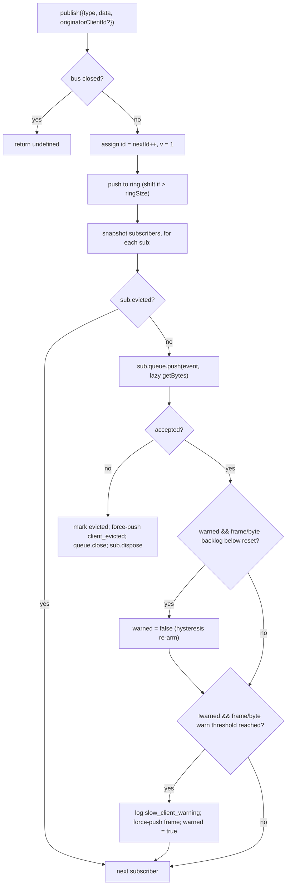

# SSE 이벤트 버스 및 백프레셔

## 개요

`EventBus`(`packages/acp-bridge/src/eventBus.ts`)는 데몬의 `GET /session/:id/events` SSE 라우트에 데이터를 공급하는 세션별 인메모리 발행/구독 시스템입니다. 각 이벤트에 단조 증가 id를 할당하고, 최근 이벤트를 유한 링 버퍼에 저장하여 `Last-Event-ID` 리플레이를 지원하고, 발행된 이벤트를 모든 구독자에게 전달하며, 구독자별 백프레셔를 적용하고(라이브 큐 75% 채워짐 또는 직렬화 바이트 75% 채워짐 시 경고, 한도 도달 시 퇴출), 구독자 로컬 합성 프레임(`client_evicted`, `slow_client_warning`)을 생성합니다. 이 합성 프레임은 SDK에서 일급 이벤트로 취급하지만, 버스는 **`id` 없이** 표시하여 세션별 시퀀스 슬롯을 소비하지 않습니다.

`EventBus`는 현재 `acp-bridge` 패키지 내부에서만 사용되며, 세션당 하나의 클로저 인스턴스를 통해 브리지 팩토리가 소비합니다. 향후 리팩토링(`eventBus.ts`의 150–159줄에 명시됨)에서는 이를 최상위 빌딩 블록으로 격상하여 채널, 이중 출력, 향후 WebSocket 전송이 병렬 스트림을 실행하는 대신 동일한 버스를 통해 구독할 수 있도록 할 예정입니다.

## 책임

- 1부터 시작하는 세션별 단조 증가 이벤트 id를 할당합니다.
- 최근 `ringSize`개의 이벤트를 버퍼링하여 `lastEventId`를 사용한 구독 시 리플레이합니다.
- 발행된 이벤트를 최대 `maxSubscribers`명의 동시 구독자에게 전달합니다.
- 구독자별 유한 큐를 적용합니다. 라이브 프레임 한도 또는 라이브 직렬화 바이트 한도를 초과하는 구독자는 합성 `client_evicted` 터미널 프레임과 함께 퇴출됩니다.
- 라이브 프레임 75% 채워짐 또는 라이브 직렬화 바이트 75% 채워짐 시 오버플로우 에피소드당 한 번 `slow_client_warning`을 발생시키며, 37.5% 히스테리시스로 반복 경고를 방지합니다.
- `AbortSignal.abort()` 시 구독을 즉시 해체합니다.
- 버스 종료 시(예: 세션 해체) 모든 구독자를 정리합니다.
- `publish`에서 절대 예외를 발생시키지 않습니다(계약: "publish는 항상 안전하게 호출할 수 있음").

## 아키텍처

| 상수                                     | 값          | 용도                                                                                                 |
| ---------------------------------------- | ----------- | ---------------------------------------------------------------------------------------------------- |
| `EVENT_SCHEMA_VERSION`                   | `1`         | 모든 `BridgeEvent.v`에 스탬프됨. 호환성 깨지는 프레임 변경 시 증가.                                  |
| `DEFAULT_RING_SIZE`                      | `8000`      | 세션별 리플레이 링. 운영자가 `--event-ring-size`로 재정의 가능.                                      |
| `DEFAULT_MAX_QUEUED`                     | `256`       | 구독자별 라이브 프레임 백로그 한도.                                                                  |
| `DEFAULT_MAX_QUEUED_BYTES`               | `2 MiB`     | 구독자별 라이브 직렬화 바이트 백로그 한도.                                                           |
| `DEFAULT_MAX_SUBSCRIBERS`                | `64`        | 세션별 구독자 한도.                                                                                  |
| `WARN_THRESHOLD_RATIO`                   | `0.75`      | `slow_client_warning` 트리거 비율(`maxQueued` 또는 `maxQueuedBytes` 대비).                           |
| `WARN_RESET_RATIO`                       | `0.375`     | 히스테리시스 리암 비율.                                                                              |
| `MAX_EVENT_RING_SIZE` (`bridge.ts` 내부) | `1_000_000` | `BridgeOptions.eventRingSize`의 소프트 상한선. 오타로 인한 OOM 장애를 잡기 위함.                     |

### `BridgeEvent`

```ts
interface BridgeEvent {
  id?: number; // monotonic per session; absent on synthetic terminal frames
  v: 1; // EVENT_SCHEMA_VERSION
  type: string; // one of the 53 known types or future-extensible
  data: unknown; // payload (typed per-type by the SDK; see 09-event-schema.md)
  _meta?: { serverTimestamp?: number; [key: string]: unknown }; // stamped by EventBus.publish
  originatorClientId?: string; // set when the event derives from a clientId-stamped request
}
```

### `SubscribeOptions`

```ts
interface SubscribeOptions {
  lastEventId?: number; // replay from after this id (Last-Event-ID resume)
  signal?: AbortSignal; // aborts the subscription promptly
  maxQueued?: number; // per-subscriber live frame backlog cap; default 256
}
```

`subscribe()`는 `AsyncIterable<BridgeEvent>`를 반환합니다. SSE 라우트는 `for await`로 이를 소비합니다. 등록은 **동기적**입니다 — `subscribe()`가 반환될 때 구독자는 이미 연결되어 있으므로, 소비자의 첫 `next()`와 경합하는 `publish()`도 전달됩니다.

라이브 바이트 한도는 테스트/임베딩 호출자만을 위한 버스 레벨 생성자 옵션입니다. HTTP 쿼리 파라미터, SDK 옵션, CLI 플래그, 또는 기능으로 노출되지 않습니다. 클라이언트가 데몬의 메모리 예산을 증가시킬 수 없어야 하기 때문입니다.

### `BoundedAsyncQueue`

구독자별 큐입니다. 두 가지 핵심 동작:

- **라이브 한도는 라이브 항목에만 적용됩니다.** `forcePush()`로 삽입된 항목은 항목당 `forced: true` 태그를 가지며 `liveCount`나 `liveBytes`에 절대 포함되지 않습니다. 이를 통해 `Last-Event-ID` 리플레이 경로가 수백 개의 과거 프레임을 새 구독자에게 force-push할 수 있으며, 방금 재개한 구독자가 즉시 라이브 한도에 걸려 퇴출되는 것을 방지합니다.
- **`liveCount`와 `liveBytes`는 필드로 유지됩니다.** `forcedInBuf` 위치에서 파생되지 않습니다. 이전 위치 기반 휴리스틱은 `slow_client_warning`이 스트림 중간에 force-push를 시작하면서 깨졌습니다(경고는 리플레이와 달리 큐의 앞이 아니라 뒤에 추가됨). 항목별 `forced` 태그는 위치와 무관하며, 라이브 항목은 직렬화 바이트 추정치도 저장하여 큐 배출 시 `liveBytes`가 감소합니다.
- **직렬화 바이트는 지연 계산됩니다.** `push()`는 이벤트가 버퍼링될 때만 `Buffer.byteLength(JSON.stringify(event), 'utf8')`를 계산합니다. 구독자가 이미 `next()`를 대기 중이면 이벤트가 직접 전달되므로 바이트 추정치가 계산되지 않습니다. 직렬화가 실패하면 데몬이 stderr에 최선 진단을 출력하고, 해당 이벤트는 바이트 계산에서 건너뛰어지지만 `publish()`의 절대-예외-발생-안함 계약은 유지됩니다. 라이브 프레임 한도에는 여전히 포함됩니다.

`push(value, getBytes)`는 차단하거나 예외를 발생시키는 대신 accepted/rejected 결과를 반환합니다. 프레임 오버플로우는 `queue_overflow`로 거부됩니다. 바이트 오버플로우는 `queue_bytes_overflow`로 거부됩니다. 라이브 큐가 비어 있을 때는 하나의 초과 크기 이벤트가 허용되지만, 그 뒤에 두 번째 라이브 이벤트가 오면 구독자가 퇴출됩니다. `forcePush(value)`는 두 한도를 모두 우회합니다. `close({drain?: boolean})`는 기본적으로 대기 항목을 배출하며, abort 경로에서는 `drain: false`를 전달하여 즉시 삭제합니다.

## 워크플로우

### Publish



`publish`는 절대 예외를 발생시키지 않습니다. publish 도중 버스를 종료하면(셧다운 경로는 `channel.kill()`을 대기하기 전에 세션별 버스를 종료함) 예외 대신 `undefined`를 반환합니다. 에이전트가 버스 종료와 채널 kill 사이의 짧은 창에서 `sessionUpdate` 알림을 여전히 발행할 수 있기 때문입니다.

### 구독 + 리플레이 (링 퇴출 감지 포함)

```mermaid
sequenceDiagram
    autonumber
    participant SR as SSE route
    participant EB as EventBus
    participant Q as BoundedAsyncQueue

    SR->>EB: subscribe({lastEventId: 42, maxQueued: 256, signal})
    EB->>EB: refuse if subs.size >= maxSubscribers<br/>(throws SubscriberLimitExceededError)
    EB->>Q: new BoundedAsyncQueue(maxQueued, maxQueuedBytes)
    EB->>EB: subs.add(sub)
    EB->>EB: epochReset = lastEventId >= nextId
    alt epochReset (old bus epoch)
        EB->>Q: forcePush state_resync_required<br/>{ reason: 'epoch_reset', lastDeliveredId: 42, earliestAvailableId: ring[0]?.id ?? nextId }
        Note over EB,Q: id-less synthetic, frame goes BEFORE replay.<br/>Replay scans the whole current ring.
    else same bus epoch
        EB->>EB: earliestInRing = ring[0]?.id
        opt earliestInRing > lastEventId + 1 (gap evicted)
            EB->>Q: forcePush state_resync_required<br/>{ reason: 'ring_evicted', lastDeliveredId: 42, earliestAvailableId: earliestInRing }
            Note over EB,Q: id-less synthetic, frame goes BEFORE replay.<br/>Stream stays open; SDK reducer flips awaitingResync.
        end
    end
    loop ring scan
        EB->>EB: for e in ring where e.id > (epochReset ? 0 : 42)
        EB->>Q: forcePush(e)
    end
    EB->>EB: attach AbortSignal listener<br/>(onAbort → queue.close({drain:false}); dispose)
    EB-->>SR: AsyncIterable
    SR->>Q: next() in for-await loop
```

구독 시점에 `subs.size >= maxSubscribers`이면 `SubscriberLimitExceededError`가 발생하며, SSE 라우트는 이를 catch하여 거부된 클라이언트에게 `stream_error` 합성 프레임을 직렬화합니다. 이렇게 하지 않으면 클라이언트가 왜 빈 스트림을 받는지 알 수 없습니다. 빈 이터러블을 반환하면 부하 상태에서 "일부 클라이언트는 이벤트를 받고 일부는 받지 못하는" 상황에 대한 가시성이 운영자에게 없어집니다.

### 링 퇴출 → `state_resync_required` (복구 플로우)

소비자가 `Last-Event-ID: N`으로 재연결할 때 링의 가장 오래된 생존 이벤트가 `id > N + 1`이면, `[N+1, earliestInRing-1]` 범위의 이벤트가 소비자가 재연결하기 전에 퇴출된 것입니다. 단순 리플레이는 비연속 접미사로 조용히 성공하며, SDK 리듀서는 스트림이 연속적인 것처럼 델타를 적용하고, 상태는 데몬의 실제 상태와 분기됩니다 — 터미널 신호 없이.

`EventBus.subscribe()`에 구현된 방식:

1. 먼저 `opts.lastEventId >= this.nextId`를 확인합니다. 참이면 클라이언트 커서가 이전 버스 epoch의 것입니다(데몬 재시작 / EventBus 재구성). 버스는 `reason: 'epoch_reset'`을 발생시키고 현재 링 전체를 리플레이합니다.
2. 그렇지 않으면 `earliestInRing = this.ring[0]?.id`를 계산합니다.
3. `earliestInRing > opts.lastEventId + 1`이면 리플레이 프레임 **전에** 합성 프레임을 force-push합니다:
   ```jsonc
   {
     "v": 1,
     "type": "state_resync_required",
     "data": {
       "reason": "ring_evicted",
       "lastDeliveredId": <opts.lastEventId>,
       "earliestAvailableId": <earliestInRing>
     }
   }
   ```
4. 그 후 일반 리플레이 루프를 계속합니다.

핵심 계약(그리고 #4360 리뷰에서 수정된 사항):

- **`id` 없음** — `client_evicted`와 동일한 no-slot 패턴이므로 다른 구독자가 관찰하는 세션별 단조 시퀀스 슬롯을 차지하지 않습니다.
- **스트림 유지** — `client_evicted`(실제로 터미널)와 달리 `state_resync_required`는 복구 지향적입니다. 리플레이 + 라이브 프레임이 이후에도 계속 흐릅니다.
- **리듀서 자동 델타 스킵** — SDK 측은 `awaitingResync = true`로 전환하고 `state_resync_required`, 터미널 프레임, 전체 상태 스냅샷만 적용합니다. 소비 코드가 `loadSession`을 호출하여 플래그를 해제할 때까지입니다. `RESYNC_PASSTHROUGH_TYPES`는 [`09-event-schema.md`](./09-event-schema.md)를 참조하십시오.
- **네트워크 친화적** — 프레임이 와이어에 유지되므로 SDK가 나중에 "놓친 것" diff를 계산할 수 있습니다. 추가 재연결 사이클이 필요하지 않습니다.

### 퇴출 터미널 플로우

구독자의 라이브 백로그가 한도에 도달하고 다음 `push()`가 거부될 때:

1. `sub.evicted = true`로 표시합니다.
2. 퇴출 데이터를 구성하고, `logSubscriberEvicted(evictionData)`를 stderr에 출력한 다음, `id` **없이** `client_evicted` 프레임을 구성합니다. 프레임 오버플로우는 `reason: 'queue_overflow'`를 사용합니다. 바이트 오버플로우는 `reason: 'queue_bytes_overflow'`를 사용합니다. 둘 다 `queueSize`, `maxQueued`, `queuedBytes`, `maxQueuedBytes`를 포함합니다. 바이트 오버플로우는 `eventBytes`도 포함합니다.
3. `queue.forcePush(evictionFrame)`로 소비 이터레이터가 하나의 터미널 프레임을 보도록 합니다.
4. `queue.close()`로 터미널 프레임 이후 이터레이션이 풀리도록 합니다.
5. `sub.dispose()`를 호출합니다 — `subs`에서 제거하고 `AbortSignal` 리스너를 분리합니다. 이 정리가 없으면 정지된 소비자의 클로저가 `AbortSignal` 가비지 컬렉션까지 활성 상태로 유지됩니다.

### Abort 플로우

`AbortSignal.abort()` → `onAbort()`:

1. `queue.close({drain: false})` — 버퍼된 항목을 삭제하여 SSE 라우트가 아무도 듣지 않는 소켓에 이벤트를 계속 직렬화하지 않도록 합니다.
2. `dispose()` — `disposed` 플래그를 통해 멱등성을 보장합니다.

구독 시점에 이미 abort된 시그널은 이터레이터를 반환하기 전에 `onAbort()`를 동기적으로 호출합니다.

## 상태 및 라이프사이클

- `nextId`는 1에서 시작하여 증가만 합니다. `lastEventId` getter는 `nextId - 1`을 반환합니다.
- `ring`은 유계이며, shift에 의한 퇴출은 가득 차면 O(n)입니다. `ringSize=8000`에서 고부하 세션의 경우 낮은 밀리초 단위로 측정되며, 프레임당 레이턴시 예산보다 훨씬 낮습니다. 순환 버퍼 리팩토링은 프로파일링에서 플래그가 올라오거나 운영자가 `--event-ring-size`를 자릿수만큼 증가시킬 때까지 보류됩니다.
- `close()`는 `closed`를 뒤집고, 모든 구독자의 큐를 종료하고, `subs`를 비웁니다. 이후 `publish()` / `subscribe()`는 no-op입니다(`publish`는 undefined를 반환하고, `subscribe`는 `emptyAsyncIterable`을 반환).
- 각 세션은 하나의 `EventBus`를 소유합니다. 버스 종료는 `channel.kill()` 이전에 발생하므로, 셧다운 중 진행 중인 publish는 예외 대신 undefined를 반환합니다.

## 의존성

- `packages/acp-bridge/src/bridge.ts`에서 사용(`BridgeClient.sessionUpdate` / `BridgeClient.extNotification` → `events.publish(...)`).
- `packages/cli/src/serve/routes/sse-events.ts`에서 사용(SSE 라우트 핸들러 → `events.subscribe(...)` 후 `BridgeEvent`를 SSE 와이어 프레임으로 포맷).
- CLI 소비자는 `@qwen-code/acp-bridge/eventBus`에서 이벤트 버스를 직접 import합니다.
- SDK 소비자: `packages/sdk-typescript/src/daemon/sse.ts`(`parseSseStream`), 그 다음 `asKnownDaemonEvent`([`09-event-schema.md`](./09-event-schema.md), [`13-sdk-daemon-client.md`](./13-sdk-daemon-client.md) 참조).

## 설정

- `--event-ring-size <n>` — 세션별 링 깊이. `MAX_EVENT_RING_SIZE = 1_000_000`으로 소프트 캡됨.
- 구독자 `?maxQueued=N` 쿼리 파라미터(`GET /session/:id/events`), 범위 `[16, 2048]`. SDK 클라이언트는 옵트인 전 `caps.features.slow_client_warning`를 프리플라이트합니다.
- `EventBus(..., { maxQueuedBytes })` 생성자 옵션은 테스트/임베딩 호출자만을 위한 것입니다. 기본값은 2 MiB이며 잘못된 값은 `TypeError`를 발생시킵니다. 의도적으로 `?maxQueuedBytes` 쿼리 파라미터는 없습니다.
- `BridgeOptions.eventRingSize`(임베딩 사용 시 데몬 기본값을 재정의).
- 기능 태그: `session_events`, `slow_client_warning`, `typed_event_schema`.

## 클라이언트 통합: `Last-Event-ID` 재연결

### 와이어 포맷

`GET /session/:id/events`가 발행하는 id 포함 SSE 프레임에는 모두 `id:` 줄이 포함됩니다:

```
id: 42
event: session_update
data: {"id":42,"v":1,"type":"session_update","data":{...},"_meta":{"serverTimestamp":1719000000000}}

```

합성/터미널 프레임(`state_resync_required`, `replay_complete`, `client_evicted`, `slow_client_warning`, `stream_error`)은 `id:` 줄 **없이** 발행됩니다 — 세션별 단조 시퀀스를 진행시키지 않습니다.

### 재연결 프로토콜

클라이언트가 연결 끊김 후 재연결할 때, 마지막으로 성공적으로 받은 이벤트 id를 `Last-Event-ID` HTTP 헤더로 전송합니다:

```
GET /session/:id/events HTTP/1.1
Last-Event-ID: 42
Accept: text/event-stream
```

데몬의 `EventBus`는 링 버퍼에서 `id > Last-Event-ID`인 모든 이벤트를 리플레이한 후 라이브 전달로 전환합니다. `replay_complete` 합성 프레임이 리플레이와 라이브 사이의 경계를 표시합니다:

```jsonc
// no id: line — synthetic
{
  "v": 1,
  "type": "replay_complete",
  "data": { "replayedCount": 7, "lastReplayedEventId": 49 },
}
```

### 리플레이 동작

| 시나리오                                     | 동작                                                                                                                                                                                                                                                                                                   |
| -------------------------------------------- | ------------------------------------------------------------------------------------------------------------------------------------------------------------------------------------------------------------------------------------------------------------------------------------------------------ |
| `Last-Event-ID` 없음                         | 라이브 전용 스트림. 리플레이 없음. 재연결 지원 이전 클라이언트와 하위 호환.                                                                                                                                                                                                                             |
| `Last-Event-ID: 0`                           | 링 버퍼 전체를 처음부터 리플레이(`--event-ring-size`로 제한, 기본값 8000).                                                                                                                                                                                                                              |
| `Last-Event-ID: N` (`ring[0].id <= N+1`)     | `id > N`인 이벤트의 연속 리플레이 후 라이브.                                                                                                                                                                                                                                                           |
| `Last-Event-ID: N` (`ring[0].id > N+1`)      | 갭 감지됨 — 생존 접미사 리플레이 전에 `state_resync_required`(`reason: 'ring_evicted'`) 발생. SDK는 유한 리플레이 스냅샷 윈도우를 복구하기 위해 `loadSession`을 호출해야 합니다. 반환된 `compactedReplay`는 이전 인메모리 리플레이 항목이 삭제된 경우 `history_truncated`로 시작할 수 있습니다.         |
| `Last-Event-ID: N` (`N >= nextId`)           | Epoch 리셋(데몬 재시작) — `state_resync_required`(`reason: 'epoch_reset'`) 발생 후 전체 링 리플레이.                                                                                                                                                                                                    |

### 유효성 검사 규칙

데몬은 `Last-Event-ID`를 엄격하게 파싱합니다:

- 순수 10진수 문자열만 허용됩니다(예: `"42"`).
- 비숫자, 음수, 분수, 오버플로 값(`Number.MAX_SAFE_INTEGER` 초과)은 조용히 거부됩니다 — 스트림은 라이브 전용으로 시작하고 데몬이 브레드크럼을 기록합니다.
- `retry: 3000` 지시문은 호환 `EventSource` 구현에게 재연결 전 3초 대기하도록 지시합니다.

### 하위 호환성

`Last-Event-ID` 메커니즘은 완전히 옵트인입니다:

- 헤더를 절대 보내지 않는 클라이언트는 재연결 지원 이전과 동일한 라이브 전용 스트림을 받습니다.
- 이벤트 id를 추적하지 않는 이전 SDK 버전도 계속 동작합니다.
- `replay_complete` 프레임은 합성(`id:` 없음)이므로 id를 인식하지 못하는 소비자를 혼란스럽게 하지 않습니다.

### 브라우저 `EventSource` 제한사항

네이티브 브라우저 `EventSource` API는 마지막 `id:` 필드를 자동으로 추적하여 재연결 시 전송합니다. 그러나 커스텀 헤더(예: `Authorization: Bearer`)를 **설정할 수 없습니다**. 인증이 필요한 클라이언트는 `EventSource` 대신 raw `fetch()` + 수동 SSE 파싱을 사용해야 합니다(TypeScript SDK가 `parseSseStream`을 통해 수행하는 방식). SDK의 `RestSseTransport`가 이 패턴을 보여줍니다 — `fetch()` 호출에서 `Last-Event-ID`를 명시적 HTTP 헤더로 설정합니다.

## 주의사항 및 알려진 제한

- **합성 프레임에는 `id`가 없습니다.** `Last-Event-ID` 재개를 사용하는 SDK 소비자는 id가 있는 프레임만 기록합니다. `slow_client_warning`, `client_evicted`, `state_resync_required`, `replay_complete`는 커서를 진행시키지 않으며 세션별 시퀀스 번호를 소비하지 않습니다. id를 가진 두 라이브 프레임 사이에 실제 갭이 있으면, 비공개 합성 프레임으로 처리하지 말고 링 퇴출 / epoch 리셋 리싱크 경로로 처리하십시오.
- `client_evicted`는 **세션별이 아닌 구독자별**입니다. 동일한 클라이언트가 재연결할 수 있습니다.
- `BoundedAsyncQueue` 이터레이터는 **동시 드라이버에 안전하지 않습니다** — 두 개의 동시 `.next()` 호출이 같은 이벤트를 두고 경합합니다. 데몬 사용은 순차적입니다(SSE 라우트 핸들러의 `for await ... of`). 따라서 프로덕션에서 안전합니다.
- 버스는 현재 패키지 내부입니다. 채널과 웹 UI는 버스에 직접 접근하지 않고 데몬의 HTTP SSE 라우트를 통해 구독해야 합니다. Stage 1.5에서 이것이 해제될 예정입니다.

## 참고 자료

- `packages/acp-bridge/src/eventBus.ts` (전체 파일)
- `packages/acp-bridge/src/bridge.ts` (publish 사이트, 특히 `BridgeClient.sessionUpdate`와 F3 권한 이벤트)
- `packages/cli/src/serve/routes/sse-events.ts` (SSE 라우트 핸들러 — `BridgeEvent`를 와이어 SSE로 포맷)
- `packages/sdk-typescript/src/daemon/sse.ts` (클라이언트 측 SSE 와이어 파서)
- 와이어 참조: [`../qwen-serve-protocol.md`](../qwen-serve-protocol.md) (`Last-Event-ID` 재연결 계약).
