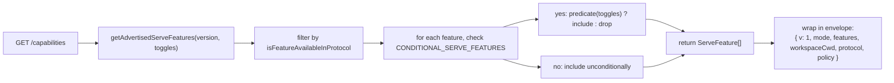
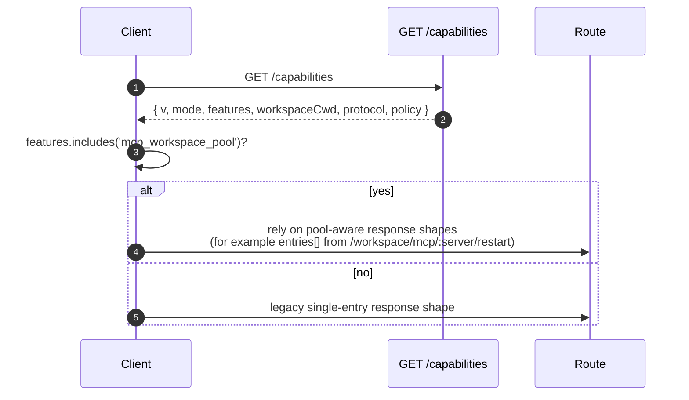

# Capabilities & 프로토콜 버전 관리

## 개요

`GET /capabilities`는 데몬의 프리플라이트 엔드포인트입니다. 모든 SDK 클라이언트는 다른 라우트를 호출하기 전에 이 엔드포인트를 읽어서 데몬이 사용하는 프로토콜 버전, 활성화된 기능 태그, 데몬이 허용하는 워크스페이스 런타임을 확인해야 합니다. 계약은 다음과 같습니다:

- **프로토콜 버전은 하나뿐입니다: `v1`.** `SERVE_PROTOCOL_VERSION = 'v1'`이고 `SUPPORTED_SERVE_PROTOCOL_VERSIONS = ['v1']`입니다. v1은 내부적으로 추가 방식이며, 프레임 구조를 깨는 변경은 v2로 예약됩니다.
- **각 태그에는 `since` 버전이 있습니다.** 향후 v2 데몬은 v1과 v2 태그를 모두 광고할 수 있습니다.
- **일부 태그는 조건부입니다.** `CONDITIONAL_SERVE_FEATURES`에 나열된 태그는 해당 배포 토글이 활성화된 경우에만 광고됩니다. 태그가 존재한다는 것은 해당 동작이 존재한다는 의미입니다.
- **Capability 태그 = 동작 계약.** 기존 태그 아래에 새 동작을 추가하면 이전 태그를 프리플라이트한 클라이언트가 조용히 깨질 수 있습니다. 새 동작에는 새 태그가 필요합니다.

전체 레지스트리는 `packages/cli/src/serve/capabilities.ts`에 있습니다.

## 책임

- 데몬이 광고할 수 있는 모든 기능을 선언합니다.
- 광고되는 기능을 프로토콜 버전과 배포 토글에 따라 필터링합니다.
- `getRegisteredServeFeatures()`(모든 키, 필터 없음), `getAdvertisedServeFeatures(version, toggles)`(필터링됨), `getServeProtocolVersions()`(엔벨로프 `{ current, supported }`)를 노출합니다.
- "태그가 존재하면 동작도 존재한다"는 불변식을 유지합니다. `server.test.ts`에는 모든 조건부 태그가 해당 토글이 켜져 있을 때 광고되는지 확인하는 테스트가 포함되어 있으며, 술어 없이 조건부 태그를 추가하면 해당 테스트가 실패합니다.

## 아키텍처

### Capability 엔벨로프

`/capabilities` 반환 값:

```ts
{
  v: 1,                    // CAPABILITIES_SCHEMA_VERSION
  mode: 'http-bridge',
  features: ServeFeature[],
  workspaceCwd: string,
  workspaces?: Array<{ id: string, cwd: string, primary: boolean, trusted: boolean }>,
  protocol?: { current: 'v1', supported: ['v1'] },
  policy?: { permission: PermissionPolicy },
}
```

`workspaceCwd`는 표준 기본 워크스페이스 경로입니다([`02-serve-runtime.md`](./02-serve-runtime.md) 참조). 현재 데몬은 `workspaces[]`를 등록된 런타임 카탈로그로 사용하며, `multi_workspace_sessions`는 둘 이상의 런타임이 활성 상태임을 나타냅니다. `policy.permission`은 활성 중재자 정책입니다.

### `ServeCapabilityDescriptor`

```ts
interface ServeCapabilityDescriptor {
  since: ServeProtocolVersion; // current = 'v1'
  modes?: readonly string[]; // 기능에 모드(operation modes)가 있는 경우 나열
}
```

`modes`를 사용하는 v1 태그 4개:

- `mcp_guardrails: { since: 'v1', modes: ['warn', 'enforce'] }` - 클라이언트는 거부 동작에 의존하기 전에 `'enforce'`를 프리플라이트해야 합니다.
- `permission_mediation: { since: 'v1', modes: ['first-responder', 'designated', 'consensus', 'local-only'] }` - 빌드 시 지원되는 세트이며, 활성 정책은 `policy.permission`에 있습니다.
- `workspace_voice_transcription: { since: 'v1', modes: ['batch'] }` - 데몬이 제공하는 전사 경로입니다.
- `voice_transcribe: { since: 'v1', modes: ['streaming', 'batch'] }` - `/voice/stream` WebSocket에서 사용 가능한 두 가지 전사 경로입니다.

### 조건부 태그

```ts
export const CONDITIONAL_SERVE_FEATURES: ReadonlyMap<
  ServeFeature,
  (toggles: AdvertiseFeatureToggles) => boolean
> = new Map([
  ['require_auth', (t) => t.requireAuth === true],
  ['mcp_workspace_pool', (t) => t.mcpPoolActive === true],
  ['mcp_pool_restart', (t) => t.mcpPoolActive === true],
  ['allow_origin', (t) => t.allowOriginActive === true],
  [
    'prompt_absolute_deadline',
    (t) => typeof t.promptDeadlineMs === 'number' && t.promptDeadlineMs > 0,
  ],
  [
    'writer_idle_timeout',
    (t) =>
      typeof t.writerIdleTimeoutMs === 'number' && t.writerIdleTimeoutMs > 0,
  ],
  ['workspace_settings', (t) => t.persistSettingAvailable === true],
  ['workspace_voice', (t) => t.persistSettingAvailable === true],
  [
    'workspace_voice_transcription',
    (t) => t.voiceTranscriptionAvailable === true,
  ],
  ['session_shell_command', (t) => t.sessionShellCommandEnabled === true],
  [
    'multi_workspace_session_rewind',
    (t) => t.multiWorkspaceSessionsEnabled === true,
  ],
  [
    'multi_workspace_session_shell',
    (t) =>
      t.multiWorkspaceSessionsEnabled === true &&
      t.sessionShellCommandEnabled === true,
  ],
  ['rate_limit', (t) => t.rateLimit === true],
  ['workspace_reload', (t) => t.reloadAvailable === true],
  ['voice_transcribe', (t) => t.voiceWsAvailable !== false],
]);
```

`Map`은 멤버십과 술어를 함께 저장합니다. 새 조건부 태그를 추가하려면 두 가지 변경을 조율해야 합니다:

1. `SERVE_CAPABILITY_REGISTRY`에 태그와 해당 `since` 버전을 등록합니다.
2. `CONDITIONAL_SERVE_FEATURES`에 해당 술어를 추가합니다.

기본 태그는 `Map`에 존재하지 않으며 무조건 광고됩니다. 이것은 별도의 Set이 아닌 부재로 의도적으로 표현됩니다.

### v1 태그 (도메인별 그룹)

기반: `health`, `daemon_status`, `capabilities`.

세션: `session_create`, `session_id_override`, `session_scope_override`, `session_load`, `session_resume`, `unstable_session_resume`, `session_list`, `session_info`, `session_prompt`, `session_mid_turn_message_mutation`, `session_cancel`, `session_events`, `session_set_model`, `session_close`, `session_metadata`, `session_archive`, `session_export`, `session_transcript`, `session_context`, `session_context_usage`, `session_supported_commands`, `session_tasks`, `session_monitor_tool_correlation`, `session_stats`, `session_lsp`, `session_status`, `session_approval_mode_control`, `session_recap`, `session_btw`, **`session_shell_command`** (조건부), `session_language`, `session_rewind`, `session_hooks`, `session_branch`.

스트리밍: `slow_client_warning`, `typed_event_schema`.

Identity 및 heartbeat: `client_identity`, `client_heartbeat`.

권한: `session_permission_vote`, `permission_vote`, **`permission_mediation`** (`modes: ['first-responder', 'designated', 'consensus', 'local-only']`).

워크스페이스 읽기 전용 스냅샷: `workspace_mcp`, `workspace_skills`, `workspace_providers`, `workspace_acp_status`, `workspace_env`, `workspace_preflight`, `workspace_hooks`, `workspace_extensions`.

확장 프로그램 관리: `extension_management_v2`는 글로벌 `/extensions/*` 카탈로그/변경/운영 계약과 워크스페이스 활성화 프로젝션을 추가합니다. 이것은 게시된 `workspace_extensions` 호환 표면 및 `workspace_qualified_rest_core`와 별개입니다.

V2 Extension 배치 활성화: `extension_batch_activation_v2`는 `extension_management_v2`에 전역 기본 활성화 대기열과 선택된 워크스페이스 오버배치 대기열을 추가합니다. 이전 V2 데몬은 단일 활성화 라우트만 노출하므로 클라이언트는 독립적으로 프리플라이트해야 합니다.

워크스페이스 한정 세션 읽기: `workspace_persisted_transcript`, `workspace_session_export`, `workspace_archived_session_export`, `workspace_session_live_state`. 활성 및 보관된 내보내기 태그는 서로 독립적이며 `session_export` 및 `workspace_qualified_rest_core`와도 독립적이므로, 클라이언트는 내보내려는 정확한 저장 상태를 프리플라이트해야 합니다. 지속된 전사 페이징은 제한된 읽기 정책 하에서 신뢰할 수 없는 보조를 허용합니다. 두 전체 내보내기 경로는 모두 신뢰 전용입니다. `workspace_session_live_state` 역시 `workspace_qualified_rest_core`와 독립적이며 신뢰 전용입니다. 선택된 런타임의 메모리 전용 라이브 세션 스냅샷과 카탈로그 버전을 제공하며, 신뢰할 수 없는 보조 지속 읽기 정책을 라이브 브리지 상태로 확장하지 않습니다.

워크스페이스 변경 (Wave 4+): `workspace_memory`, `workspace_agents`, `workspace_agent_generate`, `workspace_acp_preheat`, `workspace_tool_toggle`, **`workspace_settings`** (조건부), `workspace_permissions`, `workspace_init`, `workspace_github_setup`, `workspace_trust`, `workspace_mcp_restart`, `workspace_mcp_manage`, `workspace_file_read`, `workspace_file_bytes`, `workspace_file_read_cursor`, `workspace_file_write`, `workspace_file_upload`, **`workspace_reload`** (조건부).

MCP 가드레일: **`mcp_guardrails`** (`modes: ['warn', 'enforce']`), `mcp_guardrail_events`, `mcp_server_runtime_mutation`, **`mcp_workspace_pool`** (조건부), **`mcp_pool_restart`** (조건부).

프롬프트 제어: **`prompt_absolute_deadline`** (조건부), **`writer_idle_timeout`** (조건부), `non_blocking_prompt`.

인증: `auth_provider_install`, `auth_device_flow`, **`require_auth`** (조건부), **`allow_origin`** (조건부).

음성: **`workspace_voice`** (조건부), **`workspace_voice_transcription`** (조건부, `modes: ['batch']`), **`voice_transcribe`** (조건부, `modes: ['streaming', 'batch']`).

속도 제한: **`rate_limit`** (조건부).

멀티 워크스페이스 세션 라우팅: **`multi_workspace_sessions`** (조건부),
**`multi_workspace_session_rewind`** (조건부),
**`multi_workspace_session_shell`** (조건부). 클라이언트는 기본 세션에 대해 `session_rewind`로 rewind를 사용할 수 있으며, 보조 라이브 세션은 추가로 `multi_workspace_session_rewind`가 필요합니다. Shell은 보조 세션에 대해 동등한 `session_shell_command`과 `multi_workspace_session_shell` 쌍을 사용합니다. ACP 네이티브 클라이언트는 initialize가 반환하는 `_qwen.methods`를 계속 사용합니다. ACP rewind 벤더 메서드는 광고되지 않습니다.

굵은 태그는 `modes`가 있거나 조건부입니다.

## 흐름

### 데몬 측: 엔벨로프 조립



### 클라이언트 측: 기능 프리플라이트



## 상태 및 라이프사이클

- `CAPABILITIES_SCHEMA_VERSION`는 와이어 엔벨로프 구조 버전으로, 현재 `1`입니다. 엔벨로프가 깨지는 경우에만 올립니다.
- `SERVE_PROTOCOL_VERSION = 'v1'`은 프로토콜 기능 버전입니다. v1 내에서 기능을 추가하는 것은 추가 방식이며, 이전 클라이언트는 새 태그를 프리플라이트하지 않으면 새 동작을 볼 수 없습니다. 기능 제거는 v2 깨짐입니다.
- `EVENT_SCHEMA_VERSION = 1`은 SSE 프레임의 `v` 필드입니다([`09-event-schema.md`](./09-event-schema.md) 참조). 이것은 독립적인 버전 축입니다. 이벤트 스키마를 올려도 프로토콜 버전이 오르지 않으며, 그 반대도 마찬가지입니다.
- `session_resume`는 `POST /session/:id/resume`의 안정적인 데몬 기능입니다. `unstable_session_resume`는 폐기된 별칭으로 계속 광고됩니다. 기초가 되는 ACP 메서드가 여전히 `connection.unstable_resumeSession`으로 명명되어 있기 때문입니다. 새 클라이언트는 `session_resume`을 기능 감지해야 합니다.

## 의존성

- `/capabilities` 응답을 구성할 때 `packages/cli/src/serve/server.ts`가 읽습니다.
- 토글 입력은 `runQwenServe` / `createServeApp`에서 전달되며, 인증, MCP, origin, 프롬프트, 설정, shell, 속도 제한, reload, 라이브 워크스페이스 런타임 수 상태를 포함합니다.
- 엔벨로프의 활성 `permission` 정책은 `BridgeOptions.permissionPolicy`에서 오며, 이는 `settings.json`의 `policy.permissionStrategy`를 읽습니다.

## 설정

| 소스                       | 설정                                                             | capabilities에 미치는 영향                                                                                                                                              |
| -------------------------- | ---------------------------------------------------------------- | ----------------------------------------------------------------------------------------------------------------------------------------------------------------------- |
| CLI 플래그                 | `--require-auth`                                                 | `require_auth`를 광고합니다.                                                                                                                                            |
| 환경 변수                  | `QWEN_SERVE_NO_MCP_POOL=1`                                       | `mcp_workspace_pool` 및 `mcp_pool_restart` 광고가 중단됩니다. MCP 이벤트가 더 이상 `scope: 'workspace'`를 스탬프하지 않습니다.                                          |
| CLI 플래그                 | `--mcp-client-budget=N`, `--mcp-budget-mode={off,warn,enforce}`  | 태그 세트는 변경하지 않습니다(`mcp_guardrails`는 항상 광고됨). 서버별 예약 및 거부 동작만 변경합니다.                                                                    |
| CLI 플래그 / 환경 변수     | `--rate-limit` / `QWEN_SERVE_RATE_LIMIT=1`                       | `rate_limit`를 광고합니다.                                                                                                                                              |
| 임베디드 옵션              | `persistSettingAvailable`                                        | `workspace_settings` 및 `workspace_voice`를 광고합니다.                                                                                                                 |
| 임베디드 옵션              | `voiceTranscriptionAvailable`                                    | `workspace_voice_transcription`을 광고합니다.                                                                                                                           |
| CLI 플래그 / 임베디드 옵션 | `--enable-session-shell` / `sessionShellCommandEnabled`          | `session_shell_command`를 광고합니다.                                                                                                                                   |
| 런타임 상태                | 등록된 워크스페이스 런타임이 둘 이상                              | `multi_workspace_sessions` 및 `multi_workspace_session_rewind`를 광고합니다. 세션 shell이 효과적으로 활성화된 경우 `multi_workspace_session_shell`도 광고합니다.         |
| 임베디드 옵션              | `reloadAvailable`                                                | `workspace_reload`를 광고합니다.                                                                                                                                        |
| 임베디드 옵션              | `voiceWsAvailable`                                               | `voice_transcribe`를 광고합니다.                                                                                                                                        |
| `settings.json`            | `policy.permissionStrategy`                                      | 엔벨로프의 `policy.permission`을 설정합니다.                                                                                                                            |

## 주의사항 및 알려진 제한

- **`--require-auth`는 프리플라이트를 숨깁니다.** `--require-auth`를 사용하면 `/capabilities`를 포함한 모든 라우트에 bearer 인증이 필요합니다. 인증되지 않은 클라이언트는 `caps.features.require_auth`를 프리플라이트할 수 없으며, 401 응답 본문이 검색 표면입니다. `require_auth` 태그는 강화된 배포 감사 UI를 위한 인증된 확인입니다.
- **태그가 존재하면 동작도 존재합니다.** 향후 기여자가 `since`를 올리지 않고 기존 태그 아래에 동작을 추가하면, 이전 태그를 프리플라이트한 클라이언트가 조용히 새 동작을 받을 수 있습니다. 규칙은: 새 동작에는 새 태그를 부여합니다.
- **`unstable_*` 태그는 프로토콜 버전 상승 없이도 구조가 변경될 수 있습니다.** 이것들에 의존할 때는 SDK 버전을 고정하세요.
- 라우트 카탈로그는 [`../qwen-serve-protocol.md`](../qwen-serve-protocol.md)에 있으며, 이 페이지에서는 의도적으로 중복하지 않습니다.

## 참고 자료

- `packages/cli/src/serve/capabilities.ts`
- `packages/cli/src/serve/types.ts` (`ServeOptions`, `CapabilitiesEnvelope`)
- `packages/cli/src/serve/server.ts` (엔벨로프 조립)
- `packages/acp-bridge/src/eventBus.ts` (`EVENT_SCHEMA_VERSION`)
- 와이어 레퍼런스: [`../qwen-serve-protocol.md`](../qwen-serve-protocol.md)
- 인증 및 배포 가드레일: [`12-auth-security.md`](./12-auth-security.md)
