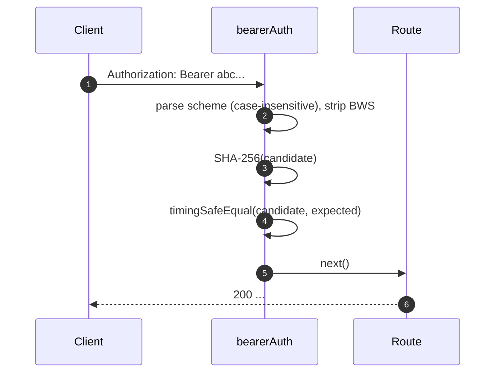
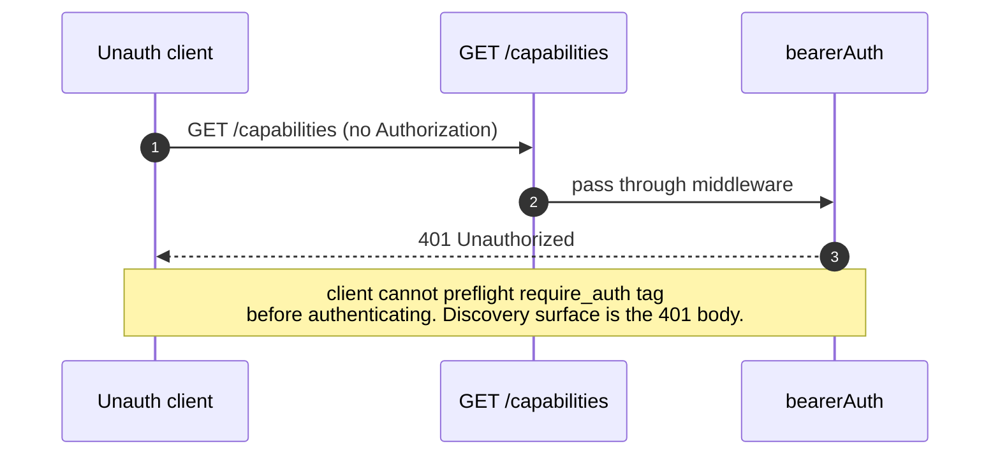
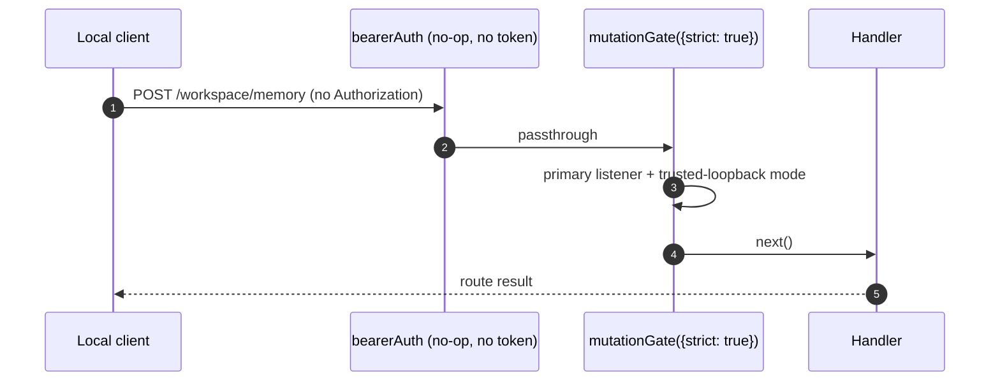

# 인증 및 보안 모델

## 개요

`qwen serve`는 기본적으로 로컬 데몬이며, 잘못된 설정 시 노출될 수 있는 표면입니다. 보안 모델은 **계층적**으로 설계되어 설정 오류 시 안전하게 실패합니다.

1. **바인드** — 루프백이 아닌 바인드에서 베어러 토큰 없이 시작하려고 하면 **시작이 거부됩니다**.
2. **베어러 인증** — `bearerAuth` 미들웨어가 상수 시간 SHA-256 비교를 통해 일반 루프백 바인드에서 `/health`를 제외한 일반 API 라우트를 보호합니다(`require_auth`는 해당 엔드포인트도 베어러 뒤로 이동합니다). 채널 웹훅 수신은 `x-qwen-webhook-secret`로 인증되는 베어러 이전의 별도 라우트입니다. Web Shell 문서 및 에셋 라우트는 모든 모드에서 인증 이전에 유지됩니다.
3. **Host 헤더 허용 목록** — 루프백에서는 `localhost`, `127.0.0.1`, `[::1]`, `host.docker.internal`, 또는 정확히 바인딩된 루프백 주소(포트 포함)만 허용됩니다. 80 또는 443에서 수신할 때는 포트 없는 형태도 허용됩니다. 이 허용 목록은 DNS 리바인딩으로부터 방어합니다. Local Control LAN 리스너는 예외로, 기본 바인드와 관계없이 항상 광고된 authority의 Host 검사를 강제합니다.
4. **Origin 제어** — 런타임 앱은 항상 가변 허용 목록(`MutableOriginAllowlist`) 위에 `allowOriginCors`를 설치합니다: `--allow-origin <pattern>` 항목이 시딩하고, Local Control이 활성화된 동안 LAN origin을 추가합니다. 일치하지 않는 origin은 403 거부 엔벨로프를 받습니다. 무조건적 거부 방어벽(`denyBrowserOriginCors`)은 런타임 시작 전에 응답하는 부트스트랩 앱에만 남아 있습니다.
5. **라우트별 뮤테이션 게이트** — strict 라우트는 운영자 권한을 요구합니다. 토큰 없는 루프백 기본 리스너는 신뢰됩니다. 베어러 인증된 요청과 페어링된 Local Control 요청도 자격을 갖춥니다. 신뢰 권한 없이 이 게이트에 도달한 토큰 없는 기본 요청은 구별되는 `code: 'token_required'` 오류를 받습니다. 누락되거나 잘못된 설정된 자격 증명과 페어링되지 않은 Local Control 자격 증명은 리스너 범위 베어러 미들웨어에 의해 `401 Unauthorized`로 먼저 거부됩니다.
6. **디바이스 플로우 인증** — 제공자용 OAuth 별도 표면(`POST /workspace/auth/device-flow` + `/:id`에 대한 GET/DELETE).

이 문서에서는 각 계층과 부트 경로에서 적용되는 명시적 불변식을 설명합니다.

## 책임

- 안전하지 않은 설정에서의 부팅을 거부합니다.
- 설정된 경우 베어러를 통해 일반 API 요청을 게이트하며, 루프백 `/health` 예외가 적용됩니다. 채널 웹훅 수신은 독립적인 공유 비밀 게이트 뒤에 유지하고, 루프백 Host 및 브라우저 Origin 검사를 인증된 라우트와 예외 라우트 앞에 유지합니다.
- Wave 4 라우트가 선택적으로 사용하는 라우트별 뮤테이션 게이트를 제공합니다.
- SSE 이벤트를 통해 표시되는 제공자 OAuth 플로우를 구동하는 디바이스 플로우 레지스트리를 호스팅합니다.

## 아키텍처

### 부트 시점 거부 규칙

`run-qwen-serve.ts`에서:

```ts
if (!isLoopbackBind(opts.hostname) && !token) {
  throw new Error('Refusing to bind <host>:<port> without a bearer token. ...');
}
if (opts.requireAuth && !token) {
  throw new Error(
    'Refusing to start with --require-auth set but no bearer token configured. ...',
  );
}
```

토큰 없는 allow-origin 설정은 루프백 HTTP(S) origin으로 제한됩니다.
비 HTTP(S) 항목은 기존 처리를 유지합니다:

```ts
const parsed = parseAllowOriginPatterns(opts.allowOrigins);
if (parsed.allowAny && !token) {
  throw new Error(
    "Refusing to start with --allow-origin '*' but no bearer token configured. ...",
  );
}
if (findNonLoopbackHttpOrigin(parsed) && !token) {
  throw new Error(
    'Refusing to start with a non-loopback HTTP(S) --allow-origin but no bearer token configured. ...',
  );
}
```

이러한 거부는 명시적 부트 실패입니다(stderr에 표시되거나 임베더에게 throw됨).
절대로 조용히 통과하지 않습니다. #3803의 위협 모델은 데몬이 루프백 밖을 개방 상태로 바인딩하는 것을 조용히 허용하는 것을 명시적으로 금지합니다.

`runQwenServe()`는 `localhost`를 한 번 확인하고, 리스너를 해당 주소에 고정하며, 신뢰 루프백 authority를 게시하기 전에 실제 리스너 주소를 검증합니다. 결과가 `127.0.0.0/8` 또는 `::1` 밖에 있으면 토큰 없는 시작이 실패하고 리스너를 닫습니다. `createServeApp()`은 소켓을 소유하지 않으므로, 호출자가 선언된 루프백 호스트 이름이 루프백에만 바인딩되도록 보장할 책임이 있습니다. 선언된 비 루프백 임베드는 strict 라우트, 세션 셸, Local Control 페어링 자료를 안전하게 실패 상태로 유지합니다. 또한 생성 시 비어 있지 않은 토큰 없이 `requireAuth: true`를 거부하여, 잘못된 강화 설정에서 비 strict 라우트가 실수로 개방되지 않도록 합니다.

### 미들웨어 체인 (HTTP 요청 순서)

```mermaid
flowchart LR
    REQ[Request] --> SO["strip same-origin Origin<br/>(Web Shell support)"]
    SO --> AO["allowOriginCors<br/>(mutable allowlist: --allow-origin<br/>patterns + Local Control LAN origin)"]
    AO --> HA["hostAllowlist"]
    HA --> LOG["access-log middleware<br/>(DaemonLogger)"]
    LOG --> WH{"Channel webhook?"}
    WH -->|yes| WS["x-qwen-webhook-secret<br/>+ webhook rate/body limits"]
    WH -->|no| BA["bearerAuth"]
    BA --> RL["rate-limit middleware<br/>(when enabled)"]
    RL --> JSON["express.json<br/>(body parser)"]
    JSON --> TEL["daemonTelemetryMiddleware<br/>(OTel span)"]
    TEL --> MG["per-route: mutationGate<br/>(opt-in strict)"]
    MG --> HANDLER["route handler"]
```



`mutationGate`는 라우트별 미들웨어 팩토리입니다(`createMutationGate`가 `mutate()`를 반환). 라우트는 등록 시 `mutate()` 또는 `mutate({strict: true})`를 호출합니다. 전역 `app.use()` 미들웨어가 아닙니다. 접근 로그는 `bearerAuth` 이전에 등록되므로 401 거부도 기록됩니다. 일반 API 속도 제한은 `bearerAuth` 이후, `express.json()` 이전에 실행되므로 인증된 요청만 카운트되고, 제한을 초과할 경우 큰 본문이 파싱 전에 거부됩니다. 채널 웹훅 수신은 베어러 인증 이전에 분기하며, 자체 공유 비밀 검사, 뮤테이션 티어 속도 검사, 1 MiB 파서를 적용합니다.

### `bearerAuth`

- **토큰 미설정** → 미들웨어가 no-op입니다(루프백 개발자 기본값). 예외: Local Control **LAN 리스너**는 리스너 범위이며 항상 페어링 자격 증명을 요구합니다(`CredentialStore.isOpen`은 `local-control`에 대해 절대 true가 아님). 따라서 토큰 없는 데몬에서도 개방되지 않습니다.
- **토큰 설정** → 생성 시 설정된 토큰을 한 번 SHA-256 해시합니다. 모든 요청에서 후보를 해시하고 `timingSafeEqual`로 비교합니다. 문자열 동일성 단축 없음. 시간 누출 없음.
- **스키마 파싱**: RFC 7235 §2.1에 따라 대소문자 구분 없는 `Bearer`. RFC 7230 §3.2.6 BWS에 따라 스키마와 자격 증명 사이의 `SP\tHTAB`를 허용합니다. 순수 HTAB 구분자는 거부합니다.
- **CodeQL 강화**: `\s+` / `.+` 중복이 있는 정규식 대신 수작업 `indexOf` 파싱을 사용합니다(다항 정규식 위험 없음).

### `hostAllowlist`

루프백 전용. 포트 기준으로 `Set<string>`을 유지합니다. 허용되는 Host:

- `localhost:<port>`, `127.0.0.1:<port>`, `[::1]:<port>`, `host.docker.internal:<port>`, 그리고 동일한 포트의 정확히 바인딩된 루프백 주소. 마지막 형태는 지원되는 전체 IPv4 루프백 범위(`127.0.0.0/8`)를 커버하면서도 무관한 Host를 허용하지 않습니다.
- 포트 80 또는 443에 바인딩된 경우에만 해당 포트 없는 형태도 허용됩니다(RFC 7230 §5.4 기본 포트 생략).

Host 비교는 **대소문자를 구분하지 않습니다**. Express는 헤더 이름을 정규화하지만 값은 정규화하지 않으므로, Host를 대문자로 표기하는 Docker 프록시(`Localhost:4170`, `HOST.docker.internal`)는 정확한 문자열 비교 시 403이 발생합니다.

루프백이 아닌 바인드는 기본 게이트를 우회합니다(운영자가 노출 영역을 선택한 것이며, 베어러 토큰이 Host 스푸핑을 대신 게이트합니다). Local Control LAN 리스너는 예외입니다: 기본 바인드와 관계없이 항상 광고된 authority의 Host 검사를 강제합니다.

### `denyBrowserOriginCors` (부트스트랩 앱 전용)

`Origin` 헤더가 포함된 모든 요청을 거부합니다. CLI/SDK는 Origin을 설정하지 않습니다. 브라우저만 설정합니다. `cors` 패키지의 오류 콜백이 생성할 500 HTML 대신 결정론적인 `403 { error: 'Request denied by CORS policy' }`를 반환합니다. 런타임 앱은 더 이상 이 방어벽을 설치하지 않습니다 — 가변 허용 목록 위에서 `allowOriginCors`를 실행합니다(아래 참조); 거부 동작은 일치하지 않는 origin 분기로서 거기서 생존합니다. 이 방어벽은 런타임 시작 전에 요청을 처리하는 부트스트랩 앱(run-qwen-serve.ts)에만 남아 있습니다.

예외: **루프백** 바인드에서 Web Shell의 동일 출처 XHR은 별도 미들웨어(`server/self-origin.ts`)에서 처리되며, Origin이 표준 루프백 자체 Origin(`127.0.0.1`, `localhost`, `[::1]`, `host.docker.internal`) 중 하나 또는 정확히 바인딩된 루프백 주소와 일치할 때 `Origin`을 제거합니다. 스키마가 일치하는 포트 없는 origin은 해당 기본 포트(80의 `http`, 443의 `https`)에서만 허용됩니다. 루프백이 아닌 바인드에서 셸의 XHR은 일치하지 않는 `Origin`을 가지며 데몬 origin에 대해 `--allow-origin`이 필요합니다.

### `allowOriginCors` (런타임 앱, 항상 설치)

런타임 앱은 `allowOriginCors(originAllowlist)`를 무조건 설치합니다. 허용 목록은 `--allow-origin <pattern>` 항목(없을 수 있음)에서 시딩되고 Local Control이 활성화된 동안 런타임에 확장되는 `MutableOriginAllowlist`입니다(LAN origin이 리스너와 함께 추가/제거됨):

- 일치하는 `Origin` 값은 `Access-Control-Allow-Origin`, `Access-Control-Allow-Headers`, `Access-Control-Allow-Methods`를 받습니다. `OPTIONS` 프리플라이트는 `204`를 반환합니다.
- 일치하지 않는 `Origin` 값은 거부 모드와 동일한 결정론적 `403 { error: 'Request denied by CORS policy' }`를 받습니다.
- `--allow-origin '*'`는 `--token`이 필요합니다. 그렇지 않으면 부팅이 거부됩니다.
- 토큰 없이 HTTP(S) `--allow-origin` 값은 루프백 호스트로 제한됩니다. 루프백이 아닌 브라우저 origin은 토큰이 필요한데, 그렇지 않으면 코드 실행을 포함한 전체 운영자 API를 실행할 수 있기 때문입니다.
- 명시적 브라우저 확장 origin은 토큰 없는 로컬 자동화 경로를 유지합니다. 시작 로그에서 토큰 없이 허용된 브라우저 origin이 전체 운영자 권한을 받음을 기록합니다.
- `parseAllowOriginPatterns()`는 부트 시 패턴 구문을 검증합니다.
- `allow_origin` 기능 태그는 이 모드가 설정된 경우에만 광고됩니다.

### `createMutationGate`

라우트별 선택적 게이트. 동작 매트릭스:

| 데몬/요청 권한                                          | 라우트 옵션     | 결과                             |
| ------------------------------------------------------------- | --------------- | -------------------------------- |
| 토큰 설정됨                                              | 아무 값         | 통과¹                     |
| 신뢰 루프백 기본 리스너                             | 아무 값         | 통과                      |
| 페어링된 Local Control 리스너                                 | `strict: true`  | 통과                      |
| 신뢰 루프백 권한 없는 토큰 없는 기본 요청 | `strict: true`  | `401 { code: 'token_required' }` |
| 모든 토큰 없는 배포                                     | `strict: false` | 통과                      |

¹ 모든 토큰 설정은 전역 `bearerAuth`가 일반 API 라우트에서 게이트 이전에 베어러 인증을 강제합니다. 루프백 `/health`는 `--require-auth`가 설정되지 않은 경우 예외입니다. 채널 웹훅 수신은 이 미들웨어 이전에 자체 공유 비밀로 인증합니다. 게이트는 보호하는 라우트에서 중복이지만 무해합니다. `--require-auth`는 자체적으로 인증이 아니며 토큰이 있어야 유효합니다.

신뢰 루프백 모드는 `루프백 바인드 && 설정된 토큰 없음 && !requireAuth`에서 한 번 파생됩니다. 기본 리스너를 통해 도달하는 요청만 인증합니다. 내부 베어러 인증 마커를 스탬프하지 않으므로, 리스너 자격 증명과 배포 권한은 별개의 사실로 유지됩니다. `code: 'token_required'` 형태는 strict 게이트에 도달하는 이전 데몬과 토큰 없는 비신뢰 임베드를 위해 유지되므로, SDK 클라이언트가 일반적인 401 대신 구성 힌트를 표시할 수 있습니다. 설정된 토큰 및 Local Control 자격 증명 실패는 이전의 단순 `401 Unauthorized` 응답을 유지합니다.

Local Control 상태 및 활성화 응답은 운영자 권한이 있는 호출자에게만 페어링 URL 및 QR을 노출합니다: 신뢰하는 기본 리스너 호출자, 베어러 인증된 기본 호출자, 이미 페어링된 LAN 클라이언트. 페어링되지 않은 LAN 호출자와 비신뢰 임베드는 이를 검색할 수 없습니다. 활성화는 여전히 기본 리스너가 필요하며, LAN 클라이언트는 페어링 후 접근하거나 기존 규칙에 따라 비활성화를 요청할 수 있습니다.

**Wave 4+ strict 라우트**: `/workspace/memory`, `/workspace/agents/*`,
`/workspace/agents/generate`, `/file/write`, `/file/edit`,
`/workspace/tools/:name/enable`, `/workspace/mcp/:server/restart`,
`/workspace/mcp/:server/{enable,disable,authenticate,clear-auth}`,
`/workspace/mcp/servers` (POST/DELETE), `/workspace/auth/device-flow`,
`/workspace/init`, `/session/:id/approval-mode`, `/session/:id/rewind`,
`/session/:id/shell`.

Rewind는 ACP 트랜스포트가 설정된 경우에도 TypeScript SDK에서 REST 전용으로 유지됩니다. 이는 strict 뮤테이션 게이트와 베어러/클라이언트 ID 헤더를 보존합니다. ACP 라우트 테이블에는 의도적으로 rewind 매핑이 없습니다. 소유자 라우팅은 rewind나 shell이 보조 런타임 브릿지에 도달하기 전에 워크스페이스 신뢰를 다시 확인합니다. 중복된 라이브 세션 ID는 기본 런타임으로 폴백하지 않고 `ambiguous_session_owner`로 안전하게 실패합니다.

### `/health` 예외

루프백 바인드에서 `/health`는 베어러 미들웨어 **이전에** 등록되므로 파드 내부의 활성 상태 프로브는 토큰을 포함할 필요가 없습니다. 루프백이 아닌 바인드는 다른 일반 API 라우트와 함께 `/health`를 게이트합니다. `--require-auth`는 예외를 제거합니다: `/health`도 루프백에서 `Authorization: Bearer <token>`이 필요합니다. 채널 웹훅 수신은 모든 모드에서 베어러 인증 외부에 유지되며 자체 `x-qwen-webhook-secret`가 필요합니다.

### v1 클라이언트 ID(`X-Qwen-Client-Id`)는 자체 보고

데몬은 `X-Qwen-Client-Id`의 형식(`[A-Za-z0-9._:-]{1,128}`)만 검증하고 세션별 연결된 클라이언트 ID를 추적합니다. 현재 소유 증명(proof-of-possession)을 수행하지 않습니다. SSE에서 `originatorClientId`를 관찰한 클라이언트는 동일한 ID로 재등록하여 이후 요청에서 해당 originator를 가장할 수 있습니다.

영향:

- `designated` — 원격 호출자가 originator를 가장하여 프롬프트 originator만을 위한 요청에 투표할 수 있습니다.
- `consensus` — 스푸핑된 ID가 이미 `votersAtIssue` 스냅샷에 있으면 투표할 수 있습니다.
- `local-only`는 데몬이 연결 원격 주소에서 스탬프하는 `fromLoopback`을 기준으로 게이트하므로 영향을 받지 않습니다.
- `first-responder`는 ID에 무관하므로 영향을 받지 않습니다.

향후 페어 토큰 메커니즘은 `POST /session`에서 세션별 비밀을 발급합니다. `designated` / `consensus` 투표는 이를 제시해야 합니다. 그전까지는 강화된 designated 정책이 필요한 배포는 루프백에 바인딩하거나 인증된 리버스 프록시 뒤에서 실행해야 합니다. 정책 수준 세부 사항은 [`04-permission-mediation.md`](./04-permission-mediation.md)를 참조하세요.

### 디바이스 플로우 인증

제공자 인증을 위한 별도 OAuth 표면입니다. v1 제공자 식별자는 `qwen-oauth`이지만, Qwen OAuth 무료 티어는 2026-04-15에 중단되었습니다. 새로운 설정은 현재 지원되는 인증 제공자가 있으면 이를 사용해야 합니다.

- `POST /workspace/auth/device-flow` — 플로우를 시작합니다. `{deviceFlowId, providerId, expiresAt, verificationUrl, userCode}`를 반환합니다.
- `GET /workspace/auth/device-flow/:id` — 상태를 폴링합니다.
- `DELETE /workspace/auth/device-flow/:id` — 취소합니다.
- `GET /workspace/auth/status` — 현재 계정 / 제공자 스냅샷입니다.

SSE 이벤트 `auth_device_flow_{started, throttled, authorized, failed, cancelled}`는 모든 구독자에게 플로우 상태를 팬아웃하여 다중 클라이언트 UI를 동기화합니다. [`09-event-schema.md`](./09-event-schema.md)를 참조하세요.

구현: `packages/cli/src/serve/auth/device-flow.ts` + `qwen-device-flow-provider.ts`.

**로그 삽입 / 트로이 목마 소스 방어**: `sanitizeForStderr(value)`(`device-flow.ts`)는 ASCII 제어 문자와 Unicode 제어 문자를 `?`로 대체합니다. 그렇지 않으면 악성 IdP가 로그 라인을 위조하거나 페이로드를 숨길 수 있습니다:

| 범위                             | 제거 이유                                                                                                                                                                                                                                                  |
| -------------------------------- | ----------------------------------------------------------------------------------------------------------------------------------------------------------------------------------------------------------------------------------------------------------- |
| `\x00–\x1f`, `\x7f`, `\x80–\x9f` | ASCII C0 / DEL / C1 제어 문자, 터미널 이스케이프, 로그 라인 위조.                                                                                                                                                                                           |
| U+200B-U+200F                    | 제로 너비 문자 + LRM / RLM. 보이지 않지만 터미널 렌더링을 변경할 수 있습니다.                                                                                                                                                                                |
| U+2028-U+2029                    | LINE / PARAGRAPH SEPARATOR. 많은 Unicode 인식 터미널에서 라인 브레이크로 처리합니다.                                                                                                                                                                         |
| U+202A-U+202E                    | 양방향 EMBEDDING / OVERRIDE 제어.                                                                                                                                                                                                                            |
| U+2066-U+2069                    | 양방향 ISOLATE 제어(LRI / RLI / FSI / PDI). 주요 [CVE-2021-42574 "Trojan Source"](https://trojansource.codes/) 벡터입니다. U+202D(LRO) 대신 U+2066(LRI)를 사용하는 IdP는 유사한 시각적 재정렬로 EMBEDDING/OVERRIDE 전용 필터를 우회할 수 있습니다.           |
| U+FEFF                           | BOM / 제로 너비 비분리 공백.                                                                                                                                                                                                                                 |

각 제거된 코드 포인트를 삭제하는 대신 `?`로 대체하여 길이를 보존하므로, 운영자가 해당 인덱스에 무언가가 있었음을 확인할 수 있습니다. 두 레이어 모두 새니타이저를 사용합니다: `qwenDeviceFlowProvider`는 IdP `oauthError`를 새니타이징하고, 레지스트리의 late-poll 옵저버는 감사 힌트에 보간되는 제공자 제어 값(`latePollResult.kind` / `lateErr.name`)을 새니타이징합니다.

`auth_device_flow` 기능 태그는 **무조건** 광고됩니다. 라우트 자체는 데몬이 특정 제공자를 충족할 수 없을 때 `400 unsupported_provider`를 반환합니다. 지원되는 제공자 목록은 `/capabilities`가 아닌 `/workspace/auth/status`에 있으며, 이는 디스크립터 형태를 균일하게 유지하기 위함입니다.

## 워크플로우

### 베어러 인증 성공 요청



### 베어러 인증 실패 모드

모두 `401 { error: 'Unauthorized' }`를 반환합니다(`missing header` / `wrong scheme` / `wrong token`에 대해 균일하므로 프로빙이 구별할 수 없습니다).

### `--require-auth` 그림자



인증 후 `caps.features.includes('require_auth')`로 배포가 강화되었는지 확인합니다.

### 신뢰 루프백에서의 strict 뮤테이션



## 상태 및 라이프사이클

- 베어러 토큰은 부트 시 읽어들여지며 트리밍됩니다(`cat token.txt`의 개행이 비교를 조용히 깨뜨리지 않도록).
- CLI 전용 `--open-with-auth` 모드는 부팅 전에 실행됩니다. 결정론적 루프백/Web Shell 검사 후, 동일한 option-over-environment 선택을 적용하고 비어 있지 않은 선택된 토큰이 없을 때만 `ServeOptions.token`을 base64url로 인코딩된 32 랜덤 바이트로 채웁니다. 생성된 자격 증명은 프로세스 수명을 가지며, `process.env`에 기록되거나 데몬에 의해 영속화되지 않고, 기존 URL 프래그먼트를 통해 브라우저에 전달됩니다. Web Shell은 브라우저 복사본을 탭별 `sessionStorage`에 보관합니다. 순수 `--open`과 직접 `runQwenServe()` 호출자는 이를 생성하지 않습니다.
- 허용된 Host Set은 포트별로 캐시됩니다. 포트 변경 시 재구축됩니다(임시 `0` → `listen` 후 실제 포트).
- 뮤테이션 게이트는 앱 빌드당 `passthrough`와 `strictDenier`를 한 번씩만 생성합니다. 라우트별 호출은 캐시된 클로저를 반환합니다(요청별 할당 없음).
- 디바이스 플로우 레지스트리는 `shutdown()` Phase 1에서 해제되므로 대기 중인 플로우가 HTTP 해체 전에 `cancelled`로 해결됩니다.

## 의존성

- `node:crypto` — `createHash`, `timingSafeEqual`.
- `packages/cli/src/serve/loopback-binds.ts` — `isLoopbackBind`.
- `packages/cli/src/serve/auth/device-flow.ts` — 디바이스 플로우 상태 머신.
- `@qwen-code/acp-bridge` — 세션별 SSE 버스에서 디바이스 플로우 이벤트를 노출합니다.

## 설정

| 소스            | 설정                                                                                    | 효과                                                                    |
| --------------- | --------------------------------------------------------------------------------------- | ----------------------------------------------------------------------- |
| 환경 변수       | `QWEN_SERVER_TOKEN`                                                                     | 베어러 토큰(트리밍됨).                                                  |
| 플래그          | `--token`                                                                               | 베어러 토큰(환경 변수를 재정의).                                        |
| CLI 플래그      | `--open-with-auth`                                                                      | 데몬 부팅 전 루프백 Web Shell 베어러를 재사용 또는 생성.                 |
| 플래그          | `--require-auth`                                                                        | 베어러를 루프백 + `/health`로 확장. 토큰이 있어야 부팅 가능.             |
| 플래그          | `--hostname`                                                                            | 루프백이 아닌 바인드는 `--token`(또는 환경 변수)이 필요합니다.           |
| 플래그          | `--allow-origin <pattern>`                                                              | CORS 허용 목록 모드로 전환. 와일드카드 및 루프백이 아닌 HTTP(S) origin은 토큰이 필요합니다. |
| 기능 태그       | `require_auth`(조건부), `auth_device_flow`(항상), `allow_origin`(조건부)                 | [`11-capabilities-versioning.md`](./11-capabilities-versioning.md) 참조. |

## 주의사항 및 알려진 제한

- **`--require-auth`는 기능 프리플라이트를 가립니다.** 인증되지 않은 클라이언트는 `require_auth` 태그를 검색할 수 없습니다. 검색 표면은 401 본문 자체입니다.
- **뮤테이션 게이트 body-parser 순서**: `mutationGate({strict: true})` 401 응답은 `express.json()`이 본문을 파싱한 **후에** 발생합니다. 포화된 리스너의 최악의 경우: `--max-connections × express.json({limit: '10mb'})` ≈ 2.5 GB 일시적. 루프백이 아닌 프로덕션 진입점은 이미 일반 API 파서 이전에 베어러 인증을 요구합니다. 채널 웹훅 수신은 대신 자체 1 MiB 파서 이전에 공유 비밀을 검사합니다. 직접 비신뢰 임베드는 리스너 노출을 자체적으로 관리합니다.
- **동일 출처 Origin 제거**는 `server.ts`에서 `allowOriginCors` _이전에_ 발생합니다. 향후 변경으로 제거 위치가 이동하면 Web Shell이 깨집니다.
- **토큰 비교는 SHA-256 다이제스트**로 수행되며 원시 토큰이 아닙니다. 가변 길이 토큰 비교를 고정 크기 다이제스트 비교로 축소하여 시간 누출을 줄입니다.
- 데몬은 현재 mTLS, 요청 서명, 페어 토큰 소유 증명을 **지원하지 않습니다**. `--rate-limit`은 클라이언트 ID / IP 키별 HTTP 속도 제한을 제공합니다. 클라이언트 ID 인증이 아닙니다.

## 참고 자료

- `packages/cli/src/serve/auth.ts` (전체 파일)
- `packages/cli/src/serve/run-qwen-serve.ts` (거부 규칙)
- `packages/cli/src/serve/loopback-binds.ts`
- `packages/cli/src/serve/auth/device-flow.ts`
- `packages/cli/src/serve/auth/qwen-device-flow-provider.ts`
- 사용자 대상 위협 모델: [`../../users/qwen-serve.md`](../../users/qwen-serve.md).
- 프로토콜 참조: [`../qwen-serve-protocol.md`](../qwen-serve-protocol.md).
