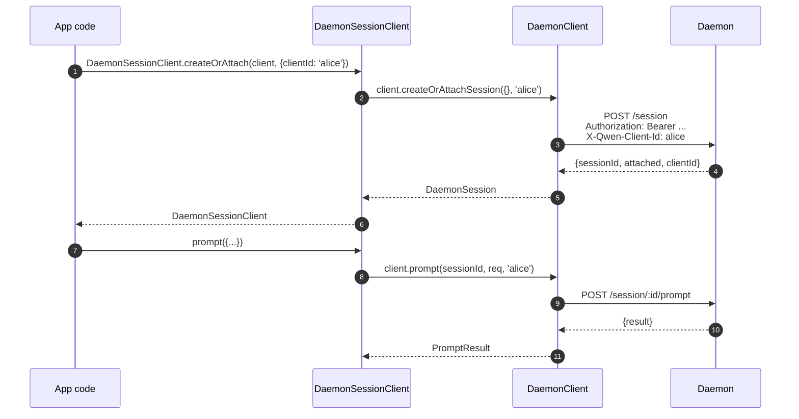
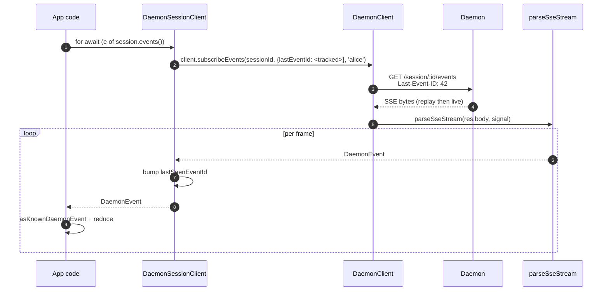
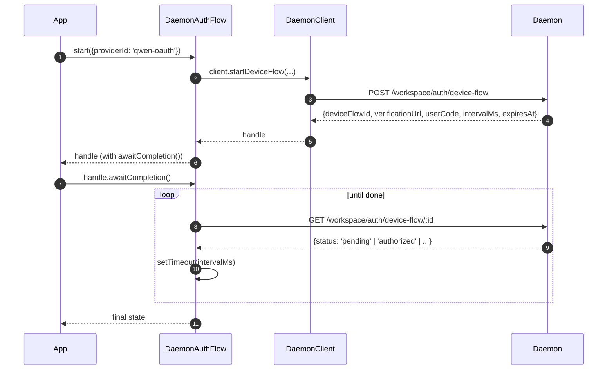

# TypeScript SDK 데몬 클라이언트

## 개요

`packages/sdk-typescript/src/daemon/`는 **TypeScript SDK의 데몬 클라이언트**입니다. TypeScript / JavaScript 호스트(CLI의 TUI 어댑터, 채널 봇 백엔드, VS Code IDE 컴패니언, 커스텀 스크립트, 서버 측 웹 백엔드)에서 실행 중인 `qwen serve` 데몬에 연결하는 표준 방법입니다. 다른 모든 어댑터는 이것에 의존합니다.

패키지 구조는 의도적으로 작습니다:

| 파일                     | 표면                                                                                                                        |
| ------------------------ | ------------------------------------------------------------------------------------------------------------------------------ |
| `index.ts`               | 공개 배럴(`DaemonClient`, `DaemonSessionClient`, `DaemonAuthFlow`, `parseSseStream`, 이벤트 리듀서, 타입).              |
| `DaemonClient.ts`        | 저수준 HTTP/SSE 파사드 — `qwen-serve-protocol.md` 라우트당 하나의 메서드.                                                     |
| `DaemonSessionClient.ts` | SSE 리플레이 추적을 갖춘 세션 범위 래퍼.                                                                               |
| `DaemonAuthFlow.ts`      | 고수준 OAuth 디바이스 플로우 헬퍼.                                                                                           |
| `sse.ts`                 | `parseSseStream`(NDJSON / SSE 프레이밍 파서).                                                                                |
| `events.ts`              | `asKnownDaemonEvent`, `reduceDaemonSessionEvent`, `reduceDaemonAuthEvent`([`09-event-schema.md`](./09-event-schema.md) 참조).  |
| `types.ts`               | `DaemonCapabilities`, `DaemonSession`, `DaemonEvent`, `PermissionResponse`, `PromptResult`, MCP / 에이전트 / 메모리 / 인증 타입. |

실습 예제는 [`../examples/daemon-client-quickstart.md`](../examples/daemon-client-quickstart.md)에 있으며, 이 문서는 아키텍처 및 계약 참조입니다.

## 책임

- 데몬 HTTP 라우트당 하나의 TypeScript 메서드를 제공합니다.
- 모든 요청에 베어러 토큰 + `X-Qwen-Client-Id`를 올바르게 스탬프합니다.
- 호출자가 제공한 `AbortSignal`과 호출별 타임아웃을 합성합니다(장기 실행 SSE를 종료하지 않으면서).
- SSE 프레임을 스트리밍하여 타입화된 `DaemonEvent`로 파싱합니다.
- 세션별 `lastSeenEventId`를 추적하여 재연결 시 올바르게 리플레이합니다.
- 데몬이 제공한 간격으로 폴링하는 디바이스 플로우 인증 표면을 노출합니다.

## 아키텍처

### `DaemonClient` (`DaemonClient.ts`)

생성자:

```ts
new DaemonClient({
  baseUrl: string,                  // default 'http://127.0.0.1:4170'
  token?: string,
  fetch?: typeof globalThis.fetch,  // injectable for tests
  fetchTimeoutMs?: number,          // 0 = disabled; default DEFAULT_FETCH_TIMEOUT_MS
});
```

메서드 그룹(모든 메서드는 `X-Qwen-Client-Id`를 스탬프하기 위해 선택적 `clientId`를 받습니다):

| 그룹               | 메서드                                                                                                                                                                                                                                                                                                                                                                                                                                                                       |
| ------------------- | ----------------------------------------------------------------------------------------------------------------------------------------------------------------------------------------------------------------------------------------------------------------------------------------------------------------------------------------------------------------------------------------------------------------------------------------------------------------------------- |
| 플러밍            | `health()`, `capabilities()`, `auth` (지연 `DaemonAuthFlow` 접근자)                                                                                                                                                                                                                                                                                                                                                                                                         |
| 세션            | `createOrAttachSession`, `loadSession`, `resumeSession`, `listSessions`, `closeSession`, `setSessionMetadata`, `getSessionContext`, `getSessionSupportedCommands`, `setSessionApprovalMode`, `setSessionModel`                                                                                                                                                                                                                                                                |
| 프롬프팅           | `prompt`, `cancel`, `heartbeat`                                                                                                                                                                                                                                                                                                                                                                                                                                               |
| 이벤트              | `subscribeEvents` (SSE 제너레이터), `subscribeEventsStream` (raw 응답)                                                                                                                                                                                                                                                                                                                                                                                                     |
| 권한         | `respondToPermission`, `respondToSessionPermission`                                                                                                                                                                                                                                                                                                                                                                                                                           |
| 워크스페이스 스냅샷 | `getWorkspaceMcp`, `getWorkspaceSkills`, `getWorkspaceProviders`, `getWorkspaceEnv`, `getWorkspacePreflight`                                                                                                                                                                                                                                                                                                                                                                  |
| 워크스페이스 변경 | `addWorkspace`, `updateWorkspace`, `writeWorkspaceMemory`, `readWorkspaceMemory`, `rememberWorkspaceMemory`, `getWorkspaceMemoryRememberTask`, `forgetWorkspaceMemory`, `getWorkspaceMemoryForgetTask`, `dreamWorkspaceMemory`, `getWorkspaceMemoryDreamTask`, `listWorkspaceAgents`, `getWorkspaceAgent`, `createWorkspaceAgent`, `updateWorkspaceAgent`, `deleteWorkspaceAgent`, `setWorkspaceToolEnabled`, `setWorkspaceSkillEnabled`, `restartMcpServer`, `initWorkspace` |
| 파일               | `readFile`, `readFileBytes`, `writeFile`, `editFile`, `listDirectory`, `globPaths`, `statPath`                                                                                                                                                                                                                                                                                                                                                                                |
| 인증                | `startDeviceFlow`, `pollDeviceFlow`, `cancelDeviceFlow`, `getAuthStatus`                                                                                                                                                                                                                                                                                                                                                                                                      |

### `fetchWithTimeout`

모든 요청은 `fetchWithTimeout`을 통과합니다. 주요 세부 사항:

- **본문 읽기가 타이머 범위 내에 있습니다.** 이전 구현은 헤더가 도착하면 타이머를 해제했습니다. 프록시가 본문 전송 중간에 지체하면 `await res.json()`이 `fetchTimeoutMs`을 초과하여 중단될 수 있습니다. 현재 형태는 본문 읽기 코드를 콜백으로 전달하여 타이머가 헤더 도착과 본문 소비 모두를 커버합니다.
- **`perCallTimeoutMs`**는 단일 호출이 클라이언트 전체 기본값을 재정의할 수 있게 합니다. 가장 눈에 띄는 호출자는 `restartMcpServer`입니다. SDK는 `MCP_RESTART_DEFAULT_TIMEOUT_MS = 330_000`(5분 30초)을 사용합니다. 데몬 자체의 `MCP_RESTART_TIMEOUT_MS`는 정확히 300초입니다. 클라이언트가 이 값과 일치하면 300초 근처에 완료되는 재시작이 데몬이 구조화된 응답을 직렬화하고 전송하는 동안 레이스에서 질 수 있어 거짓 양성 `TimeoutError`가 발생합니다. 추가 30초는 직렬화, 네트워크 전송, 양측 디코딩을 커버합니다. 더 빡빡한 예산이 필요한 호출자는 `timeoutMs`를 전달할 수 있습니다. `0`을 전달하면 타임아웃이 비활성화됩니다.
- **`AbortSignal.any`**는 호출자가 제공한 신호와 호출별 타이머 신호를 합성하여 호출자 취소와 호출별 타임아웃 모두를 깨끗하게 중단합니다.
- **`AbortController` + 취소 가능한 `setTimeout`**을 `AbortSignal.timeout()` 대신 사용하여 빠르게 해결되는 요청이 이벤트 루프에서 대기 타이머를 누출하지 않습니다. 타이머는 `finally`에서 해제됩니다.
- **스트리밍 엔드포인트(`subscribeEvents`)는 타임아웃을 우회합니다** — 장기 실행 SSE는 타임아웃으로 종료되면 안 됩니다.

### `DaemonSessionClient` (`DaemonSessionClient.ts`)

하나의 세션을 바인딩하고 `lastSeenEventId`를 자동으로 추적하여 SSE 리플레이와 재연결이 추가 호출자 상태 없이 작동합니다.

```ts
class DaemonSessionClient {
  readonly client: DaemonClient;
  readonly session: DaemonSession;
  readonly state: DaemonSessionState;
  private lastSeenEventId: number | undefined;

  static createOrAttach(client, req?): Promise<DaemonSessionClient>;
  static load(client, sessionId, req?): Promise<DaemonSessionClient>;
  static resume(client, sessionId, req?): Promise<DaemonSessionClient>;

  events(opts?: DaemonSessionSubscribeOptions): AsyncIterable<DaemonEvent>;
  prompt(req: PromptRequest): Promise<PromptResult>;
  cancel(): Promise<void>;
  respondToPermission(...): Promise<PermissionResponse>;
  setModel(modelServiceId): Promise<SetModelResult>;
  heartbeat(): Promise<HeartbeatResult>;
  setMetadata(metadata): Promise<SessionMetadataResult>;
  close(): Promise<void>;
}
```

`events()`는 기본적으로 `resume: true`로 `client.subscribeEvents`를 프록시합니다 — 추적된 `lastSeenEventId`를 전달하여 재연결 시 이전 구독이 중단된 지점부터 리플레이합니다. yield되는 모든 이벤트는 `lastSeenEventId`를 증가시킵니다.

### `DaemonAuthFlow` (`DaemonAuthFlow.ts`)

```ts
class DaemonAuthFlow {
  start(opts: { providerId, ... }): Promise<DaemonAuthFlowHandle>;
}
interface DaemonAuthFlowHandle {
  deviceFlowId: string;
  providerId: string;
  expiresAt: string;
  verificationUrl: string;
  userCode: string;
  awaitCompletion(opts?): Promise<DaemonAuthDeviceFlowState>;
  cancel(): Promise<void>;
}
```

`awaitCompletion()`은 플로우가 `authorized`, `failed`, `cancelled`이 될 때까지 데몬이 제공한 `intervalMs` 간격으로 `GET /workspace/auth/device-flow/:id`를 폴링합니다. `client.auth`를 통해 지연 생성되므로 인증을 사용하지 않는 클라이언트는 할당 비용이 발생하지 않습니다.

### `parseSseStream` (`sse.ts`)

`Response.body`(`ReadableStream<Uint8Array>`)를 `AsyncIterable<DaemonEvent>`로 변환합니다. 처리:

- LF 및 CRLF 프레이밍.
- 버퍼 오버플로 캡(16 MiB) — 데몬이 터무니없이 큰 단일 프레임을 방출하는 것에 대한 방어적 경계.
- AbortSignal 연결 — 중단 시 스트림과 이터레이터가 닫힙니다.
- 댓글 전용 프레임과 알 수 없는 이벤트 타입(`DaemonEvent`로 전달됨. SDK 소비자는 `asKnownDaemonEvent`를 통해 하류에서 좁힙니다).

### 타입 (`types.ts`)

주요 내보내기: `DaemonCapabilities`, `DaemonSession`(`{ sessionId, workspaceCwd, attached, clientId?, createdAt? }`), `DaemonEvent`, `DaemonSessionState`, `DaemonSessionContextStatus`, `DaemonSessionSupportedCommandsStatus`, `PermissionResponse`, `PromptResult`, `HeartbeatResult`, `SetModelResult`, `SessionMetadataResult` 및 MCP / 에이전트 / 메모리 / 인증 결과 타입. 관리되는 워크스페이스 메모리 태스크 타입에는 `DaemonWorkspaceMemoryRememberTask`, `DaemonWorkspaceMemoryForgetTask`, `DaemonWorkspaceMemoryDreamTask`가 포함됩니다.

워크스페이스 관리 메모리 태스크 헬퍼:

```ts
await client.rememberWorkspaceMemory('Use strict TypeScript.', {
  contextMode: 'workspace',
});
await client.getWorkspaceMemoryRememberTask('remember-...');

await client.forgetWorkspaceMemory('old preference');
await client.getWorkspaceMemoryForgetTask('forget-...');

await client.dreamWorkspaceMemory();
await client.getWorkspaceMemoryDreamTask('dream-...');
```

워크스페이스 skill 토글은 두 클라이언트 형태 모두에서 사용 가능합니다:

```ts
await client.setWorkspaceSkillEnabled('review', false, {
  clientId: 'dashboard-1',
});
await client
  .workspaceByCwd('/work/secondary')
  .setWorkspaceSkillEnabled('review', true, { clientId: 'dashboard-1' });
```

프리플라이트 `capabilities.features.includes('workspace_skill_toggle')`. 타입화된 `DaemonSkillToggleResult`은 표준 `skillName`, 디스크 상태 `changed` 여부, 활성화 상태(`applied`, `deferred`, `partial`), 새로고침/실패한 세션 수를 보고합니다. `DaemonWorkspaceSkillStatus.userInvocable`은 선택적 false 전용 필드입니다. 부재는 skill이 사용자 호출 가능함을 의미합니다.

일괄 변경의 경우, `workspace_skill_batch_toggle`를 프리플라이트하고 동일한 계약으로 두 클라이언트 형태 중 하나를 호출합니다:

```ts
await client.setWorkspaceSkillsEnabled(['review', 'deploy'], false, {
  clientId: 'dashboard-1',
});
await client
  .workspaceByCwd('/work/secondary')
  .setWorkspaceSkillsEnabled(['review', 'deploy'], true);
```

`DaemonSkillBatchToggleResult`은 정렬된 성공 `results`, 대상별 `errors`, 그리고 일괄 수준 활성화/세션 새로고침 카운트를 포함합니다. 데몬은 유효한 대상을 함께 지속하고 활성 세션을 한 번 새로고칩니다. 하나의 예상 대상 오류가 다른 유효한 대상을 차단하지 않습니다. 이 메서드는 200이 아닌 응답에서만 throw합니다. 200이 모든 대상이 적용되었음을 의미하지 않으므로 일괄을 성공으로 처리하기 전에 항상 `errors`를 확인하십시오.

워크스페이스 표시 이름은 선택적 프레젠테이션 메타데이터입니다. 프리플라이트 `capabilities.features.includes('workspace_display_name')`. 워크스페이스 ID와 표준 경로는 유일한 선택자이며, 중복 표시 이름도 유효합니다.

```ts
const workspace = await client.addWorkspace('/srv/repos/payments', {
  persist: true,
  displayName: 'Payments Production',
});

await client.updateWorkspace(workspace.id, {
  displayName: 'Payments',
});
await client.updateWorkspace(workspace.id, { displayName: null });
```

`addWorkspace`는 `displayName?: string`을 받으며 설정된 경우 반환합니다. `updateWorkspace`는 ID 또는 cwd 선택자와 `{ displayName: string | null }`을 받습니다. `null`은 이름을 제거합니다. 이름은 트리밍 후 256자로 제한되며 내부 C0/DEL 제어 문자를 거부합니다. 프로세스 로컬 워크스페이스는 현재 데몬 프로세스 동안만 이름을 유지합니다. 일치하는 영구 등록은 기존 스토어를 통해 업데이트됩니다. `DaemonWorkspaceCapability.displayName`은 선택적으로 유지되어 SDK가 이전 데몬과도 계속 상호 운용됩니다.

## 워크플로우

### 생성 또는 첨부 + 첫 프롬프트



### 리플레이와 함께 구독



### 디바이스 플로우 인증



`qwen-oauth`는 레거시 v1 제공자 식별자입니다. Qwen OAuth 무료 티어는 2026-04-15에 중단되었으므로, 새 클라이언트는 현재 지원되는 인증 제공자가 있으면 이를 선호해야 합니다.

## 상태 및 라이프사이클

- `DaemonClient`는 연결이 없습니다. 생성 시 아무것도 발생하지 않습니다. 모든 메서드는 새로운 `fetch`를 엽니다.
- `DaemonSessionClient`는 `events()` 호출 간에 `lastSeenEventId`를 유지합니다. 재연결 시 마지막에 본 지점부터 리플레이합니다.
- `DaemonAuthFlow`는 지연됩니다 — `client.auth`는 첫 접근 시 생성합니다.
- SSE 이터레이터는 다음 경우에 닫힙니다: (a) 데몬이 스트림을 종료, (b) `AbortSignal.abort()` 발생, (c) 소비자가 `for await`에서 벗어남, (d) 버퍼 오버플로 캡(16 MiB) 도달.

## 의존성

- `globalThis.fetch`(Node 18+ 기본 제공, 브라우저, undici 등). 테스트를 위해 `DaemonClient`별로 주입 가능합니다.
- 네이티브 `AbortController` / `AbortSignal.any` / `setTimeout`.
- `@qwen-code/qwen-code-core` 또는 `@qwen-code/acp-bridge`에 대한 전이적 의존성 없음 — SDK 패키지는 완전히 분리되어 외부 소비자가 데몬의 내부로 끌어오지 않습니다.

## `ui/*` 서브패키지([#4328](https://github.com/QwenLM/qwen-code/pull/4328) + [#4353](https://github.com/QwenLM/qwen-code/pull/4353))

SDK는 또한 `packages/sdk-typescript/src/daemon/ui/`를 내보냅니다. 이는 데몬 이벤트를 트랜스크립트 블록으로 변환하는 호스트 중립적 기본 요소 집합입니다:

- `normalizeDaemonEvent(evt)`는 53개의 알려진 데몬 와이어 이벤트를 43개의 UI 친화적 `DaemonUiEventType` 값으로 매핑합니다. 모델링되지 않거나 잘못된 이벤트는 `debug`로 정규화됩니다.
- `createDaemonTranscriptState()` 및 `reduceDaemonTranscriptEvents(state, events)`는 UI 이벤트를 `DaemonTranscriptBlock[]`으로 투영합니다.
- `createDaemonTranscriptStore()`는 구독 / 디스패치를 래핑합니다.
- `render.ts` / `terminal.ts`는 HTML 및 터미널 기본 렌더러를 제공하고, `toolPreview.ts`는 도구 호출 요약을 생성합니다.
- 셀렉터에는 `selectTranscriptBlocksOrderedByEventId`, `selectPendingPermissionBlocks`, `selectCurrentTool`, `selectApprovalMode`, `selectToolProgress`, `selectSubagentChildBlocks`, `formatMissedRange`, `formatBlockTimestamp`가 포함됩니다.
- 공개 상수에는 `DAEMON_PLAN_TOOL_CALL_ID`가 포함됩니다.
- `conformance.ts`는 교차 호스트 일관성 테스트 스위트를 포함합니다.

첫 프로덕션 소비자는 React의 `DaemonSessionProvider`를 통한 `packages/webui/src/daemon/`입니다. 자세한 아키텍처, 용어집, 셀렉터 테이블, 레거시 `DaemonTuiAdapter`와의 관계는 [`14-cli-tui-adapter.md`](./14-cli-tui-adapter.md)를 참조하세요.

이 서브패키지는 `@qwen-code/sdk/daemon` 서브 경로에서 내보내집니다. `import { DaemonClient }`를 사용하는 기존 코드는 영향을 받지 않습니다.

## SDK와 `Last-Event-ID` 재연결

### `DaemonSessionClient`를 통한 자동 추적

`DaemonSessionClient`는 내부적으로 `lastSeenEventId`를 추적합니다. 숫자 `id`가 있는 각 yield된 이벤트는 커서를 증가시킵니다. 후속 `events()` 호출은 추적된 ID를 `Last-Event-ID`로 자동 전달하므로, 추가 호출자 상태 없이 리플레이와 함께 재연결이 작동합니다:

```ts
import { DaemonClient, DaemonSessionClient } from '@qwen-code/sdk/daemon';

const client = new DaemonClient({ baseUrl: 'http://127.0.0.1:4170', token });
const session = await DaemonSessionClient.createOrAttach(client);

// 첫 구독 — 라이브로 시작(또는 새 세션의 경우 링 시작부터).
for await (const event of session.events()) {
  console.log(event.type, event.id);
  // session.lastEventId는 id를 포함하는 각 프레임에서 증가합니다.
  if (shouldStop(event)) break;
}

// 재연결 — 자동으로 Last-Event-ID: <last seen id>를 전송합니다.
// 데몬은 링에서 놓친 이벤트를 리플레이한 후 라이브로 전환합니다.
for await (const event of session.events()) {
  // 리플레이 프레임이 먼저 도착하고, 합성 `replay_complete`가 온 후,
  // 라이브 이벤트가 이어집니다.
  handleEvent(event);
}
```

### `DaemonClient`를 통한 수동 재연결

저수준 제어를 위해 `DaemonClient.subscribeEvents`를 직접 사용하고 커서를 직접 관리합니다:

```ts
const client = new DaemonClient({ baseUrl: 'http://127.0.0.1:4170', token });

let cursor: number | undefined; // undefined = 첫 연결 시 라이브 전용

async function* subscribe(sessionId: string, signal: AbortSignal) {
  for await (const event of client.subscribeEvents(sessionId, {
    lastEventId: cursor,
    signal,
  })) {
    // id를 포함하는 프레임만 커서를 진행시킵니다.
    if (event.id !== undefined) {
      cursor = event.id;
    }
    // 링 제거 갭 처리.
    if (event.type === 'state_resync_required') {
      // 상태가 오래됨 — 데몬의 제한된 리플레이 스냅샷 창을 다시 로드합니다.
      await client.loadSession(sessionId);
      continue;
    }
    if (event.type === 'history_truncated') {
      // 정보용 전용. 상태 알림을 렌더링한 후 유지된 리플레이 이벤트 적용을 계속합니다.
      // 추가 리로드를 트리거하지 않습니다.
    }
    yield event;
  }
}
```

### 재시도 루프와 함께 재연결

SDK는 네트워크 실패 시 **자동 재시도를 하지 않습니다**. `events()` 주위에 재시도 루프를 구현합니다:

```ts
async function resilientSubscribe(session: DaemonSessionClient) {
  const MAX_RETRIES = 10;
  const BASE_DELAY_MS = 1000;

  for (let attempt = 0; attempt < MAX_RETRIES; attempt++) {
    try {
      // `resume: true`(기본값)는 추적된 lastSeenEventId를 전달합니다.
      for await (const event of session.events()) {
        attempt = 0; // 성공적 이벤트 시 초기화
        handleEvent(event);
      }
      break; // 깨끗한 스트림 종료
    } catch (err) {
      const delay = BASE_DELAY_MS * 2 ** Math.min(attempt, 5);
      await new Promise((r) => setTimeout(r, delay));
    }
  }
}
```

재연결 시 데몬은 제한된 링(기본 8000 이벤트)에서 `id > lastSeenEventId`인 이벤트를 리플레이합니다. 갭이 링을 초과하면 `state_resync_required` 프레임이 클라이언트에게 `loadSession`을 호출하고 현재 제한된 리플레이 스냅샷 창에서 재구축하도록 신호합니다. 해당 스냅샷은 `history_truncated`로 시작할 수 있습니다. 이를 운영자 표시 상태 마커로 취급하고 추가 재동기화 요청으로 취급하지 마십시오.

`history_truncated.fullTranscriptAvailable`은 부울 기능 플래그입니다. `true`이면 호출자가 `DaemonClient.getSessionTranscriptPage(sessionId, { cursor, limit })`로 전체 활성 영구 리플레이를 페이지할 수 있습니다. `false`이면 클라이언트는 제한된 리플레이를 정상적으로 렌더링해야 합니다.

`workspace_persisted_transcript`가 광고되면 `client.workspaceById(workspaceId).getSessionTranscriptPage(sessionId, { cursor, limit })`는 ACP에 첨부하지 않고 선택된 등록된 워크스페이스를 읽습니다. 워크스페이스 한정 메서드는 클라이언트에 교체 가능한 트랜스포트가 있어도 항상 네이티브 REST를 사용합니다. 커서는 데몬이 재시작하면 만료됩니다.

`workspace_session_export`가 광고되면 `client.workspaceById(workspaceId).exportSession(sessionId, { format })` 또는 `client.workspaceByCwd(workspaceCwd).exportSession(...)`이 선택된 신뢰되는 워크스페이스의 활성 영구 트랜스크립트를 내보냅니다. 기존 `DaemonSessionExportResult`를 반환하고 선택적 클라이언트 ID와 클라이언트 전체 fetch 타임아웃 동작을 보존하며, 클라이언트에 교체 가능한 트랜스포트가 있어도 항상 네이티브 REST를 사용합니다. `session_export` 또는 `workspace_qualified_rest_core`에서 이 메서드의 서버 지원을 추론하지 마십시오. 이전 데몬은 기본 전용 내보내기를 유지합니다.

`workspace_archived_session_export`가 광고되면 `client.workspaceById(workspaceId).exportArchivedSession(sessionId, { format })` 또는 해당 `workspaceByCwd` 메서드를 사용하여 선택된 워크스페이스의 아카이브된 영구 트랜스크립트만 내보냅니다. 이 메서드는 활성 내보내기와 동일한 결과 타입과 네이티브 REST 동작을 사용하지만 활성 세션으로 폴백하지 않습니다. 지원 여부는 활성 내보내기 기능으로부터 추론할 수 없습니다.

`workspace_session_live_state`가 광고되면, `client.getWorkspaceSessionLiveState(workspaceCwd)` 또는 범위 지정된 `client.workspaceById(workspaceId).getSessionLiveState()` / `client.workspaceByCwd(workspaceCwd).getSessionLiveState()`가 선택된 신뢰 워크스페이스의 메모리 전용 라이브 세션 스냅샷과 카탈로그 버전을 읽으며, `DaemonWorkspaceSessionLiveState`(`{ v: 1, catalogVersion: DaemonSessionCatalogVersion, sessions: DaemonSessionLiveState[] }`)를 반환합니다. 이 메서드는 항상 베어러 인증과 인코딩된 워크스페이스 선택자가 포함된 네이티브 REST를 사용하며, 선택적 클라이언트 ID를 보존하고 기존 단축 요청 타임아웃을 사용합니다. `requireCapability()`를 호출하지 않습니다 — 폴마다 기능 프로브를 수행하면 요청 볼륨이 두 배가 되기 때문입니다 — 따라서 소비자는 이미 로드된 기능에서 `workspace_session_live_state`를 한 번 프리플라이트하고, 해당 태그가 없으면 기존 카탈로그 폴링으로 폴백합니다. `workspace_qualified_rest_core`에서 지원을 추론하지 마십시오.

### 생성 시 `lastEventId` 시딩

프로세스 재시작 간에 커서를 유지하는 호출자는 시딩할 수 있습니다:

```ts
const session = new DaemonSessionClient({
  client,
  session: { sessionId, workspaceCwd, attached: true },
  lastEventId: persistedCursor, // 유지된 위치에서 재개
});
```

값은 유한한 음이 아닌 정수여야 합니다(생성 시 검증). 잘못된 값은 throw합니다.

## 설정

| 설정               | 위치                                | 효과                                                                                  |
| ------------------ | ------------------------------------ | --------------------------------------------------------------------------------------- |
| `baseUrl`          | `DaemonClient` 생성자           | 데몬 URL. 후행 슬래시 제거.                                                  |
| `token`            | `DaemonClient` 생성자           | `Authorization: Bearer`로 스탬프.                                                     |
| `fetch`            | `DaemonClient` 생성자           | 테스트 주입 지점.                                                                   |
| `fetchTimeoutMs`   | `DaemonClient` 생성자           | 호출별 타임아웃. `0` = 비활성화.                                                       |
| `clientId`         | 메서드별 선택적 인자              | `X-Qwen-Client-Id` 헤더([`08-session-lifecycle.md`](./08-session-lifecycle.md) 참조). |
| `lastEventId`      | `DaemonSessionClient` 생성자    | 리플레이 커서 시딩.                                                                     |
| `maxQueued`        | 구독별 옵션                 | SSE 라우트의 `?maxQueued=N`. 프리플라이트 `caps.features.slow_client_warning`을 먼저 확인. |
| `perCallTimeoutMs` | 메서드별(예: `restartMcpServer`) | 클라이언트 전체 타임아웃 재정의.                                                           |

## 주의사항 및 알려진 제한

- **`fetchTimeoutMs`는 호출별이며 연결 수준이 아닙니다.** 긴 본문 읽기가 타이머를 공유합니다. 응답을 스트리밍하는 데몬은 호출별 타임아웃을 재정의하거나 `0`으로 설정해야 합니다.
- **SSE는 fetch 타임아웃을 우회합니다** — 장기 실행 SSE 연결은 `fetchTimeoutMs`로 종료되지 않습니다. 호출자 제어 중단을 위해 `AbortSignal`을 사용하세요.
- **`parseSseStream` 버퍼 캡은 16 MiB**입니다(방어적 경계). 이보다 큰 단일 프레임은 이터레이터를 중단합니다(데몬은 정상적으로 이런 프레임을 방출하지 않음).
- **`asKnownDaemonEvent`는 인식되지 않는 이벤트 타입에 대해 `undefined`를 반환합니다.** SDK 소비자는 유니언이 완전하다고 가정하지 않고 이 분기를 처리해야 합니다. 이것이 이전 호환성 계약입니다. 인식되지 않는 이벤트는 `DaemonSessionViewState.unrecognizedKnownEventCount`를 증가시킵니다.
- **`client_evicted`, `slow_client_warning`, `stream_error`는 리플레이 링에 없습니다.** 제거 후 재연결하면 데몬의 링에서 이어받습니다. 제거 프레임을 다시 보지 않습니다.
- **`DaemonClient`은 자동 재시도를 하지 않습니다.** 네트워크 실패는 거부로 표면화됩니다. 재연결 / 리플레이 전략은 호출자의 책임입니다(`DaemonSessionClient.events()`는 리플레이를 쉽게 만들지만 재연결은 여전히 호출별입니다).

## 참고 자료

- `packages/sdk-typescript/src/daemon/DaemonClient.ts`
- `packages/sdk-typescript/src/daemon/DaemonSessionClient.ts`
- `packages/sdk-typescript/src/daemon/DaemonAuthFlow.ts`
- `packages/sdk-typescript/src/daemon/sse.ts`
- `packages/sdk-typescript/src/daemon/events.ts`
- `packages/sdk-typescript/src/daemon/types.ts`
- 엔드투엔드 실습: [`../examples/daemon-client-quickstart.md`](../examples/daemon-client-quickstart.md).
